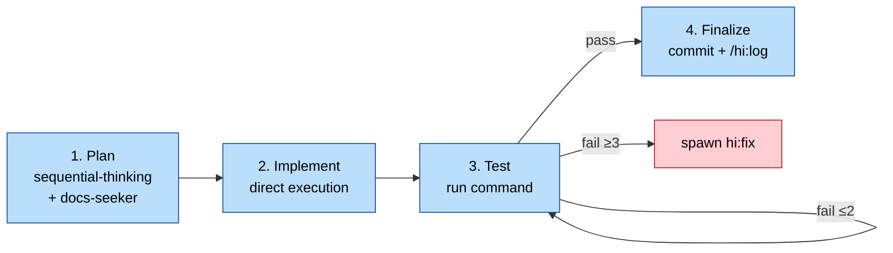
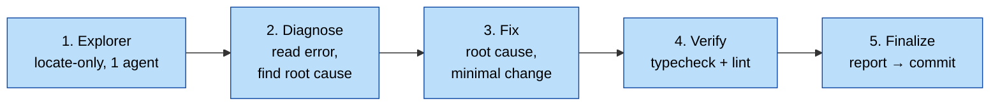
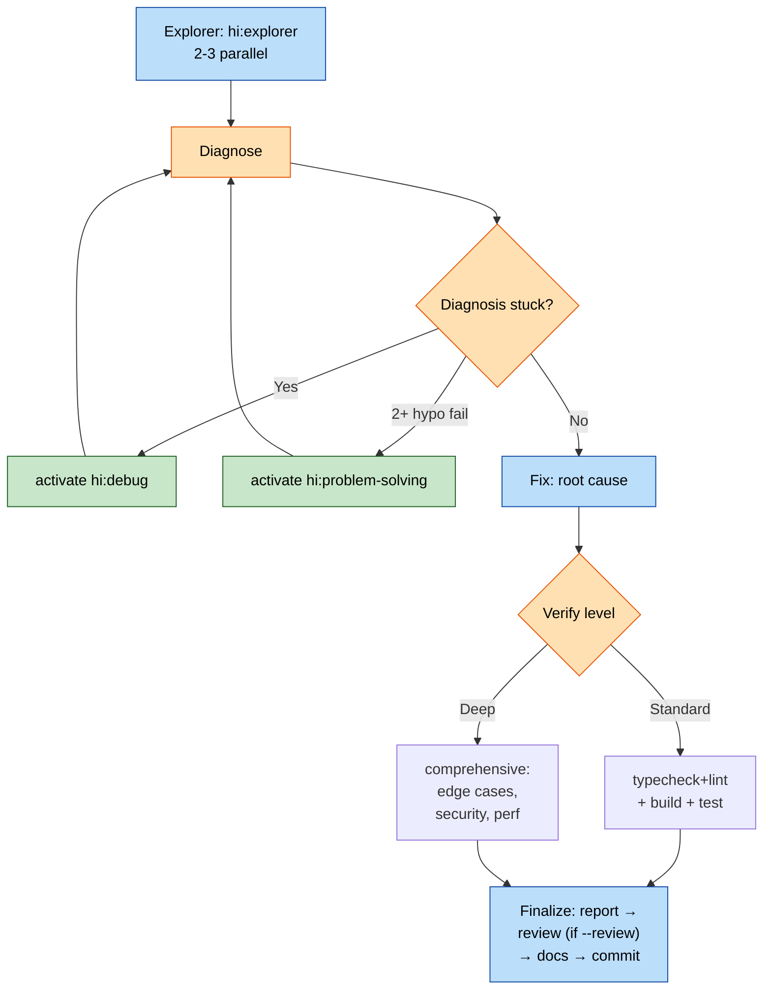
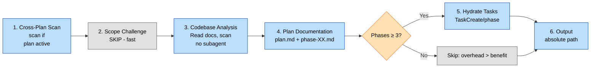
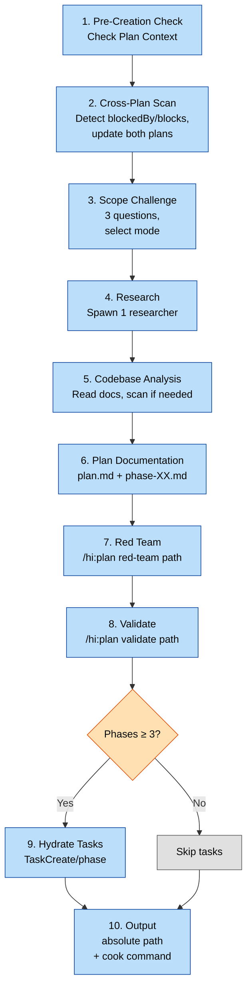
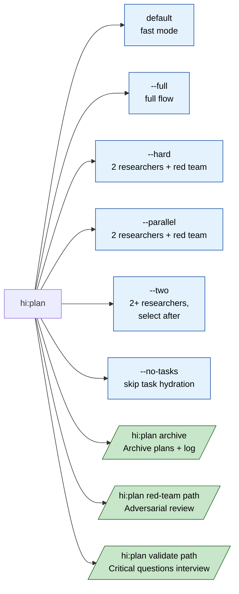
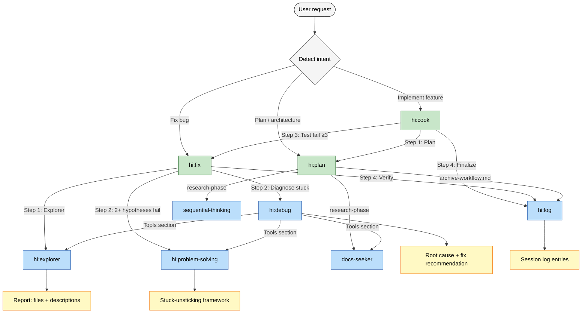

# DevKit

A token-efficient agent skills kit for software engineering workflows. 13 composable skills, designed for Claude Code / Cursor / Continue / Copilot...etc
## Installation


## Advanced Capabilities

For complex codebases exceeding millions of Lines of Code and massive documentation scale (tens of gigabytes) - please integrate with **cortex-harness** (https://github.com/baka3k/cortex-harness).

The pre-configured skills **natively** support hybrid querying across both Graph Databases (GraphDB) and Vector Databases (VectorDB). 

By combining **graph-code-based relational** queries with **semantic search**, the system optimizes context retrieval and dramatically accelerates project onboarding and codebase understanding.


#Installation

```bash
$ npx skill-dev

┌  devkit  Dev Kit Installer
│
◇ Select skills
│  Space to toggle · Enter to continue
│
│ ◉ all
│ ◉ code-review
│ ◉ debugging
│ ◉ root-cause-analysis
│ ◉ architecture-review
│ ◉ refactoring
│ ◉ performance-analysis
│ ◉ security-review
│ ◉ test-generation
│ ◉ ...
└

◇ Select target agent
❯ Claude Code
  OpenCode
  Qwen Code
  GitHub Copilot
  Cursor
  Continue
  Generic

◇ Install location
❯ Global (~/.claude/skills)
  Current project

◇ Summary
Agent: Claude Code
Skills: 13 selected
Location: Global
Install? (Y/n)
```

## Install Other skills from github

## Usage

```bash
npx skill-dev                       # default: baka3/dev-kit on GitHub
npx skill-dev <url>                 # any supported source
npx skill-dev owner/repo            # GitHub shorthand
npx skill-dev ./local-skills        # local directory
npx skill-dev https://example.com   # well-known endpoint
npx skill-dev -h                    # help
npx skill-dev -v                    # version
npx skill-dev --no-manifest         # skip AGENTS.md / CLAUDE.md auto-install
```

## Manifest files (AGENTS.md / CLAUDE.md)

Whenever the source repo (or local directory / well-known endpoint) carries `AGENTS.md` or `CLAUDE.md` at its root, `skill-dev` automatically copies them. Each file routes to its own "natural home" so the install mirrors how the skills directory is laid out:

| File | Global scope target | Why |
| --- | --- | --- |
| `AGENTS.md` | `~/.agents/AGENTS.md` | Universal, agent-neutral. Sibling of the canonical `~/.agents/skills/` so the same content is shared by every agent. |
| `CLAUDE.md` | `~/.claude/CLAUDE.md` | Claude-Code-specific. Sits alongside the `skills/` symlink that points into `~/.agents/skills/`. Respects `$CLAUDE_CONFIG_DIR` if set. |
| Other (e.g. `GEMINI.md`) | `~/.agents/` (fallback) | Unknown filenames default to the canonical `~/.agents/` — add a new switch case in [`src/install/manifest.ts`](src/install/manifest.ts) to route a new manifest elsewhere. |

For **project scope** every file lands at the project root (`<cwd>/AGENTS.md`, `<cwd>/CLAUDE.md`) — same convention as the rest of the ecosystem.

Existing files are **not** silently overwritten — the install dialog flags which files would be replaced and asks once for an explicit yes/no. New files are always installed. Pass `--no-manifest` to skip the feature entirely. Missing source files are skipped without an error.

```bash
npx skill-dev                       # auto-installs manifests (asks before overwriting)
npx skill-dev --no-manifest         # skills only
```

See [`src/constants.ts`](src/constants.ts) for the canonical list of manifest filenames. To add `GEMINI.md`, change one line and every provider will pick it up.

## Syncing extra files

Use `--sync-file <path>` (repeatable) or `SKILL_DEV_SYNC_FILES` (comma-separated) to copy extra files into the install target alongside the skills. Useful for keeping a project-level `AGENTS.md` or `CLAUDE.md` in sync with a master copy:

```bash
# One-off
npx skill-dev --sync-file ~/notes/AGENTS.md --sync-file ~/notes/CLAUDE.md

# Persistent via env
export SKILL_DEV_SYNC_FILES="~/notes/AGENTS.md,~/notes/CLAUDE.md"
npx skill-dev
```

For project scope the files land in the current working directory; for global scope, in `$HOME`. Existing files are overwritten. Missing source files are skipped with a warning (no failure).

## Supported agents

| Agent | Global install | Project install |
| --- | --- | --- |
| Claude Code | `~/.claude/skills` | `.claude/skills` |
| OpenCode | `~/.config/opencode/skills` | `.opencode/skills` |
| Qwen Code | `~/.qwen/skills` | `.qwen/skills` |
| GitHub Copilot | `~/.copilot/skills` | `.github/skills` |
| Cursor | `~/.cursor/skills` | `.cursor/skills` |
| Continue | `~/.continue/skills` | `.continue/skills` |
| Generic | `~/.devkit/skills` | `.devkit/skills` |

Set `CLAUDE_CONFIG_DIR`, `CODEX_HOME`, or `XDG_CONFIG_HOME` to override the base config directory.

## Custom sources

The CLI uses a **provider pattern** — no `git clone`, only HTTP. To publish your own skill set, point `skill-dev` at any of:

| Provider | Example | Notes |
| --- | --- | --- |
| **GitHub** | `https://github.com/owner/repo` | Uses the Git Trees API + `raw.githubusercontent.com` |
| **GitLab** | `https://gitlab.com/owner/repo` | Uses the GitLab Repository Tree API |
| **Well-known** | `https://example.com` (serves `/.well-known/agent-skills/index.json`) | RFC 8615–style discovery |
| **Local** | `./my-skills` | Reads `SKILL.md` files from a directory tree |

A "skill" is any directory that contains a `SKILL.md` file with YAML frontmatter:

```markdown
---
name: Code Review
description: Carefully review code for correctness, performance, and style
---

# Code Review

When reviewing code, follow these steps…
```

A repository may lay out skills under any of `skills/`, `skills/.curated/`, `.agents/skills/`, or at the repo root.

## How install works

For each (skill, agent, scope) pair, the CLI:

1. Writes the skill's `SKILL.md` to **`.agents/skills/<name>`** (the canonical location).
2. Symlinks the agent's skills directory to the canonical one (single source of truth, easy updates).
3. Falls back to a recursive copy on Windows when symlinks aren't available.

The result: **one copy on disk** that every agent reads from, and updates apply everywhere.

## Environment variables

| Var | Effect |
| --- | --- |
| `GITHUB_TOKEN` | Use a GitHub token to avoid rate limits (private repos too) |
| `GITLAB_TOKEN` | Use a GitLab token to avoid rate limits (private repos too) |
| `INSTALL_INTERNAL_SKILLS=1` | Include skills marked `metadata.internal: true` |
| `CLAUDE_CONFIG_DIR` | Override the Claude Code base config directory |
| `CODEX_HOME` | Override the Qwen Code base config directory |
| `XDG_CONFIG_HOME` | Override the OpenCode base config directory |

## Programmatic API

```ts
import { parseSource, findProvider, loadSkillsFromSource } from "skill-dev/source";
import { discover } from "skill-dev/source/discover";
import { installSkill } from "skill-dev/install/run";
```

The package is published as ESM (`"type": "module"`).

## Skills

### Orchestrators (drive end-to-end work)

| Skill | Purpose | Default mode |
|-------|---------|--------------|
| `hi:cook` | Implement features (plan → code → test → finalize) | `fast` |
| `hi:fix` | Fix bugs (explorer → diagnose → fix → verify → finalize) | `quick` |
| `hi:plan` | Multi-mode planning (fast / full / hard / parallel) | `fast` |

### Leaf skills (called by orchestrators)

| Skill | Purpose |
|-------|---------|
| `hi:explorer` | Parallel codebase explore (multi-agent file discovery) |
| `hi:debug` | Systematic debugging + root cause tracing + verification gate |
| `hi:knows` | Evidence retrieval (Git → MCP → memory) |
| `hi:log` | Write session log entries to `./docs/logs/` |
| `hi:problem-solving` | Stuck-unsticking techniques (inversion, collision-zone, scale-game) |

### Analysis & methodology

| Skill | Purpose |
|-------|---------|
| `hi:scenario` | 12-dimension edge case explore before implementation |
| `hi:predict` | 5-persona pre-analysis debate |
| `hi:security` | STRIDE + OWASP security audit with iterative auto-fix |
| `hi:sequential-thinking` | Sequential reasoning with revision / branching / hypothesis testing |

## Typical Workflows

```
Implement feature:  hi:cook (fast) → hi:plan inline → code → test → hi:log → commit
Implement complex:  hi:cook (full) → hi:explorer → hi:plan (full) → code → review → commit
Fix bug:            hi:fix (quick) → explorer → diagnose → fix → verify → commit
                    hi:fix (deep)  → hi:explorer (parallel) → hi:debug → hi:problem-solving
Pre-flight chehi:   hi:scenario (12 dim) → hi:predict (5 personas) → ship
Security audit:     hi:security (STRIDE phases 0-6) → fix mode → re-verify
```

## Quick Start

```bash
# Skills are picked up automatically by Claude Code / Cursor / Continue.
# Trigger via slash command or natural language.
```

**Install on Cursor (global)**: copy `.cursorrules` + skill folders to `~/.cursor/skills/`.
**Install on Claude Code**: copy skill folders to `~/.claude/skills/`.

See [USAGE_GUIDE.md](USAGE_GUIDE.md) for per-skill usage, inputs, and outputs.

## Folder Structure

```
dev-kit/
├── hi-cook/          SKILL.md + references/ + agents/
├── hi-fix/
├── hi-plan/
├── hi-explorer/       (renamed from hi-ciu)
├── hi-debug/         SKILL.md + references/ + scripts/
├── hi-knows/
├── hi-log/
├── hi-problem-solving/  SKILL.md + references/ (7 techniques)
├── hi-scenario/      SKILL.md + references/
├── hi-predict/
├── hi-security/      SKILL.md + references/ + scripts/
├── hi-sequential-thinking/  SKILL.md + references/ (5 files)
├── knows/            Standalone evidence retrieval
├── .cursorrules      Cursor auto-load rules
├── AGENTS.md         Agent harness instructions
├── CLAUDE.md         Project-level Claude instructions
├── devkit.md         Workflow diagrams (mermaid) + HARD-GATEs
├── dependency.md     Skill-to-skill call graph + missing skills
```

## Key Conventions

- **HARD-GATE** — non-negotiable rules per skill (e.g. `hi:fix` blocks before Explorer + Diagnose complete)
- **Inline > Spawn** — only spawn sub-skills when really needed (>2 fail, scope too large)
- **Mode flags** — every orchestrator has `--fast` / `--full` / `--review`; default = lightest
- **Evidence over assumption** — every claim cites `file:line` or `commit:sha`
- **Vietnamese by default** — human-readable outputs (logs, plans) are Vietnamese; technical artifacts keep English

## Token Economy

Designed for minimum token burn:
- Default modes skip heavy sub-skill spawns (~80% reduction vs naive workflow)
- Parallel subagents only when 3+ files / 2+ independent issues
- Verification gates prevent over-fixing (typecheck+lint beats full test suite when not needed)

See [optimize.md](optimize.md) for the full token-burn analysis.

## Adding a Skill

1. Create `your-skill/SKILL.md` with frontmatter: `name`, `description`, `argument-hint`, `metadata`
2. Add `references/` for supporting docs (optional)
3. Add `agents/openai.yaml` for Cursor / Copilot picker (optional)
4. Run `python scripts/sync_manifest.py` (auto-regenerates MANIFEST.json)

## Reference Docs

| Doc | What's in it |
|-----|--------------|
| [devkit.md](devkit.md) | Mermaid workflow diagrams + HARD-GATEs + cross-skill integration |
| [dependency.md](dependency.md) | Skill call graph, missing skills, external refs to fix |

# DevKit — Workflow Diagrams

> Visual workflows for the 3 core skills: `hi:cook`, `hi:fix`, `hi:plan`. Mapped to current `SKILL.md` versions (cook v3.0.0, fix v2.0.0, plan v2.0.0).

---

## 0. Leaf Skills (Called automatically by main skills)

| Skill | Called by | Purpose |
| --- | --- | --- |
| `hi:explorer` | cook, fix, debug | Codebase scanning & file discovery |
| `hi:log` | cook, plan | Session logging |
| `sequential-thinking` | plan | Step-by-step analysis |
| `docs-seeker` | plan, debug | Documentation lookup |
| `hi:debug` | fix | Advanced debugging |
| `hi:problem-solving` | fix, debug | Stuck-unsticking framework |

## 1. `hi:cook` — Feature Implementation

### 1.1 Mode Matrix

| Mode | Research | Plan | Review | Test | Finalize |
| --- | --- | --- | --- | --- | --- |
| `fast` (default) | skip | inline `hi:plan --fast` | skip | run | commit + log |
| `full` | yes (`explorer` + researcher) | yes | MUST | run | commit + log + review |
| `review` | skip | inline | MUST | run | commit + log + review |
| `auto` | skip | inline | auto-pass | run | commit + log |
| `no-test` | skip | inline | skip | skip | commit + log |
| `code` (path to plan) | skip | — | optional | run | commit + log |

### 1.2 Quick (default) — Linear Flow



---

## 2. `hi:fix` — Issue Resolution

### 2.1 Quick (default) — Linear Flow



### 2.2 Standard / Deep — Escalation Path



---

## 3. `hi:plan` — Implementation Planning

### 3.1 Fast (default) — Linear Flow



### 3.2 Full (--full) — 10 Steps



### 3.3 Subcommands



---

## 4. Cross-skill Integration



---

## 5. HARD-GATEs

| Skill | HARD-GATE | Violation Behavior |
| --- | --- | --- |
| `hi:cook` | No code without plan + review | Stop, request `hi:plan` first (unless user says "just code it") |
| `hi:fix` | No fix before Explorer + Diagnose | Force Steps 1-2; if fail 3+ times → STOP, ask user for architecture |
| `hi:plan` | Cross-Plan Scan update **both plan.md** | Ensure bidirectional update, no plan left behind |

---

## 6. General Rules (Cross-cutting)

1. **Hard-gate first, fast-path later** — default to lightweight mode, use flags for expansion.
2. **Inline > Spawn** — only spawn sub-skills when necessary (3+ fails, 2+ hypothesis fails, large scope).
3. **Token budget** — each subagent spawn = 10-15K tokens. Prioritize inline methodology.
4. **Test/Verify just enough** — `typecheck+lint` for quick, `+build+test` for standard, `comprehensive` for deep.
5. **Review optional** — run only via `--review` or `full` mode. Auto-approve requires score ≥ 9.5 + 0 critical.
6. **Finalize = commit + log** — always conclude with git commit + `/hi:log` (recording decisions, root causes, impacts).

## License
This project is licensed under the MIT License. See [LICENSE](LICENSE) for details.
