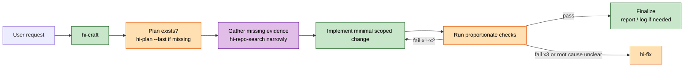
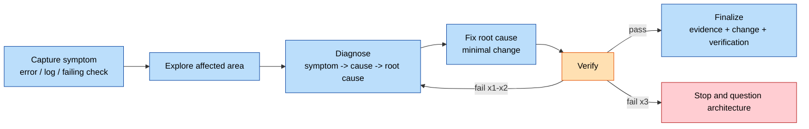
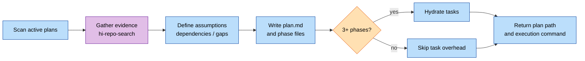
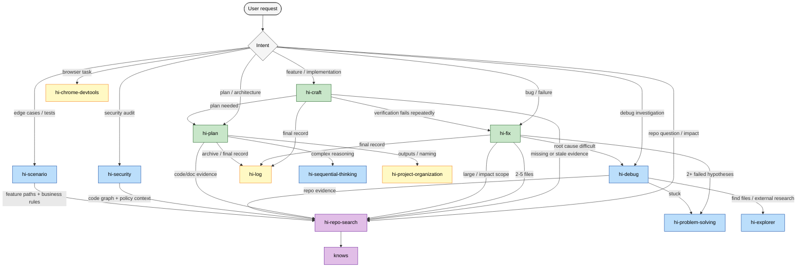

# DevKit

A token-efficient agent skills kit for software engineering workflows. 15 composable skills, designed for Claude Code / Cursor / Continue / Copilot...etc

## Advanced Capabilities
Integrated with Cortex Harness, the Dev Kit delivers an end-to-end Software Development Life Cycle (SDLC) framework, providing a unified execution model for planning, implementation, debugging, repository evidence search, security review, scenario generation, browser automation, session logging, and other extensible engineering workflows.

For enterprise-scale projects with codebases containing millions of lines of code (LOC) and documentation repositories spanning tens of gigabytes, integration with Cortex Harness is recommended:
https://github.com/baka3k/cortex-harness

The pre-configured skills provide native support for hybrid retrieval across both Graph Databases (GraphDB) and Vector Databases (VectorDB).

By combining graph-based code relationship queries with semantic vector search, the system delivers high-quality contextual retrieval, significantly accelerating project onboarding, codebase comprehension, and AI-assisted software development.


# Installation

```bash
$ npx skill-dev
┌   devkit   Dev Kit Installer
│
◆  Select skills
│  ◼ hi-craft
│  ◼ hi-debug
│  ◼ hi-explorer
│  ◼ hi-fix
│  ◼ knows
│  ◼ hi-log
│  ◼ hi-plan (Should ALWAYS activate before implementing ANY implement , or fix.)
│  ◼ hi-predict
│  ◼ hi-problem-solving
│  ◼ hi-scenario
│  ◼ hi-security
│  ◼ hi-sequential-thinking
└ ....

◇ Select target agent
❯ Claude Code
  OpenCode
  Qwen Code
  GitHub Copilot
  Cursor
  Continue
  Generic

◇ Install location
❯ Global (~/.claude/skills)
  Current project

◇ Summary
Agent: Claude Code
Skills: 12 selected
Location: Global
Install? (Y/n)
```

## Install Other skills from github

## Usage

```bash
npx skill-dev                       # default: baka3/dev-kit on GitHub
npx skill-dev <url>                 # any supported source
npx skill-dev owner/repo            # GitHub shorthand
npx skill-dev ./local-skills        # local directory
npx skill-dev https://example.com   # well-known endpoint
npx skill-dev -h                    # help
npx skill-dev -v                    # version
npx skill-dev --no-manifest         # skip AGENTS.md / CLAUDE.md auto-install
```

## Manifest files (AGENTS.md / CLAUDE.md)

Whenever the source repo (or local directory / well-known endpoint) carries `AGENTS.md` or `CLAUDE.md` at its root, `skill-dev` automatically copies them. Each file routes to its own "natural home" so the install mirrors how the skills directory is laid out:

| File                     | Global scope target     | Why                                                                                                                                                                        |
| ------------------------ | ----------------------- | -------------------------------------------------------------------------------------------------------------------------------------------------------------------------- |
| `AGENTS.md`              | `~/.agents/AGENTS.md`   | Universal, agent-neutral. Sibling of the canonical `~/.agents/skills/` so the same content is shared by every agent.                                                       |
| `CLAUDE.md`              | `~/.claude/CLAUDE.md`   | Claude-Code-specific. Sits alongside the `skills/` symlink that points into `~/.agents/skills/`. Respects `$CLAUDE_CONFIG_DIR` if set.                                     |
| Other (e.g. `GEMINI.md`) | `~/.agents/` (fallback) | Unknown filenames default to the canonical `~/.agents/` — add a new switch case in [`src/install/manifest.ts`](src/install/manifest.ts) to route a new manifest elsewhere. |

For **project scope** every file lands at the project root (`<cwd>/AGENTS.md`, `<cwd>/CLAUDE.md`) — same convention as the rest of the ecosystem.

## AGENTS.md

```
# Root Agent: Context Search Directive

**Objective:** Gather project context before executing tasks.
**Fast-Fail Rule:** If a tool is missing or disconnected -> SKIP IMMEDIATELY to the next level (Do NOT retry).

## Strict Priority Flow
*Proceed to the next step ONLY if the current step yields no results or the tool is unavailable.*

1. **`mind_mcp`**: Retrieve project docs, concepts, and foundational knowledge.
2. **`graph_mcp` (`semantic_search`)**: Find codebase relationships and logic (rely on semantics, not exact string matching).
3. **`serena` (search)**: Broad codebase search.
4. **`grep`/`rg` (Native tools)**: File system sweep for exact strings (Absolute last resort).

## Mandatory Rules
- **No Hallucination:** If the entire search chain fails, stop and ask the user for details. Never fabricate context.
- **Merge Context:** Prioritize structured data from `graph_mcp` if tools return overlapping information.
- **No Assumptions:** Ask, don't guess. Highlight tradeoffs and admit confusion.
- **Minimal Code:** Solve only the target problem. No over-engineering.
- **Strict Scope:** Touch only what's necessary. Clean up your own mess.
- **Success Criteria:** Iterate until explicitly verified.
```

**NOTICE**: For complex codebases exceeding millions of Lines of Code and massive documentation scale (tens of gigabytes), you need mind_mcp & graph_mcp - please integrate with **cortex-harness** (https://github.com/baka3k/cortex-harness).

- mind_mcp: **GraphRAG** – Handles project document processing and retrieval.
- graph_mcp: **GraphCode** – Maps the source code call graph, visualizing function-level node interactions.

About Serena - refer https://github.com/oraios/serena

## Supported agents

| Agent          | Global install              | Project install    |
| -------------- | --------------------------- | ------------------ |
| Claude Code    | `~/.claude/skills`          | `.claude/skills`   |
| OpenCode       | `~/.config/opencode/skills` | `.opencode/skills` |
| Qwen Code      | `~/.qwen/skills`            | `.qwen/skills`     |
| GitHub Copilot | `~/.copilot/skills`         | `.github/skills`   |
| Cursor         | `~/.cursor/skills`          | `.cursor/skills`   |
| Continue       | `~/.continue/skills`        | `.continue/skills` |
| Generic        | `~/.devkit/skills`          | `.devkit/skills`   |

Set `CLAUDE_CONFIG_DIR`, `CODEX_HOME`, or `XDG_CONFIG_HOME` to override the base config directory.

## What Is Included

### Core Workflow Skills

| Directory | Skill name | Purpose |
| --- | --- | --- |
| `hi-craft/` | `hi-craft` | Feature implementation workflow: plan, implement, test, and finalize. |
| `hi-fix/` | `hi-fix` | Bug, test, CI, type, lint, UI, and runtime issue resolution. |
| `hi-plan/` | `hi-plan` | Implementation plans, architecture plans, phased roadmaps, and plan validation. |
| `hi-debug/` | `hi-debug` | Root-cause debugging for failures, logs, CI, databases, performance, and system behavior. |

### Evidence And Exploration

| Directory | Skill name | Purpose |
| --- | --- | --- |
| `hi-repo-search/` | `hi-repo-search` | Traceable repository evidence from project docs, semantic code search, symbols, call paths, dependency analysis, and documents. |
| `hi-explore/` | `hi-explorer` | Fast parallel codebase and external research for file discovery, web/docs lookup, GitHub analysis, and UI/image understanding. |
| `hi-knows/` | `knows` | Unified knowledge retrieval from Git, MCP, and memory files. |

### Analysis And Review

| Directory | Skill name | Purpose |
| --- | --- | --- |
| `hi-scenario/` | `hi-scenario` | Edge-case and test-scenario generation across 12 dimensions. |
| `hi-predict/` | `hi-predict` | Five-persona pre-analysis before risky features, refactors, or releases. |
| `hi-security/` | `hi-security` | STRIDE + OWASP security audit with MCP-assisted code analysis and optional iterative auto-fix. |
| `hi-sequential-thinking/` | `hi-sequential-thinking` | Step-by-step reasoning with revision, branching, and hypothesis testing. |
| `hi-problem-solving/` | `hi-problem-solving` | Structured techniques for stuck points, recurring patterns, constraints, and scale uncertainty. |

### Utilities

| Directory | Skill name | Purpose |
| --- | --- | --- |
| `hi-log/` | `hi-log` | Session log entries for recent changes, decisions, impacts, and reflections. |
| `hi-project-organization/` | `hi-project-organization` | File placement, output naming, directory organization, and Markdown structure. |
| `hi-chrome-devtools/` | `hi-chrome-devtools` | Browser automation through Puppeteer CLI scripts with persistent sessions, screenshots, performance, network, scraping, forms, auth, and debugging. |

## Repository Search Integration

`hi-repo-search` is the shared evidence layer for questions that require verified repository context. Use it before planning or changing code when the answer depends on codebase structure, architecture, cross-file behavior, impact analysis, or project documentation.

The expected context search chain is:

1. `mind_mcp` for project documents, concepts, and foundational knowledge.
2. `graph_mcp` semantic search for code relationships and logic.
3. `serena` search for broad codebase discovery.
4. `rg` or `grep` only as the final exact-string filesystem sweep.

If one level is missing or disconnected, skip immediately to the next level. If the full chain yields no evidence, stop and ask for more details instead of guessing.

`hi-repo-search` is intentionally evidence-only. It gathers and verifies context; orchestration remains with `hi-craft`, `hi-fix`, `hi-plan`, `hi-debug`, `hi-scenario`, `hi-security`, or the calling agent.

Recommended modes:

| Mode | Use when |
| --- | --- |
| `--code` | You need symbol, file, call path, or implementation evidence. |
| `--doc` | You need project docs, concepts, requirements, or architectural notes. |
| `--deep` | You need to reconcile code and docs. |
| `--impact` | You need dependency, blast-radius, caller, or workflow impact evidence. |

## Installation

```bash
npx skill-dev                       # default: baka3/dev-kit on GitHub
npx skill-dev <url>                 # any supported source
npx skill-dev owner/repo            # GitHub shorthand
npx skill-dev ./local-skills        # local directory
npx skill-dev https://example.com   # well-known endpoint
npx skill-dev --no-manifest         # skip AGENTS.md / CLAUDE.md auto-install
npx skill-dev -h                    # help
npx skill-dev -v                    # version
```

During installation, select the skills, target agent, and install location. DevKit supports global and project-local installation.

## Supported Agents

| Agent | Global install | Project install |
| --- | --- | --- |
| Claude Code | `~/.claude/skills` | `.claude/skills` |
| OpenCode | `~/.config/opencode/skills` | `.opencode/skills` |
| Qwen Code | `~/.qwen/skills` | `.qwen/skills` |
| GitHub Copilot | `~/.copilot/skills` | `.github/skills` |
| Cursor | `~/.cursor/skills` | `.cursor/skills` |
| Continue | `~/.continue/skills` | `.continue/skills` |
| Generic | `~/.devkit/skills` | `.devkit/skills` |

Set `CLAUDE_CONFIG_DIR`, `CODEX_HOME`, or `XDG_CONFIG_HOME` to override base config directories where supported by the target agent.

## Manifest Files

When the source repo or local directory includes `AGENTS.md` or `CLAUDE.md`, `skill-dev` copies those files with the installed skills.

| File | Global scope target | Purpose |
| --- | --- | --- |
| `AGENTS.md` | `~/.agents/AGENTS.md` | Agent-neutral operating instructions and context search priority. |
| `CLAUDE.md` | `~/.claude/CLAUDE.md` | Claude Code specific project instructions. |
| Other root manifests | `~/.agents/` fallback | Generic manifest placement for unknown agent-specific files. |

For project scope, manifests land at the project root, such as `<cwd>/AGENTS.md` and `<cwd>/CLAUDE.md`.

## Custom Sources

`skill-dev` uses source providers instead of requiring a local `git clone`.

| Provider | Example | Notes |
| --- | --- | --- |
| GitHub | `https://github.com/owner/repo` | Uses GitHub tree and raw file APIs. |
| GitLab | `https://gitlab.com/owner/repo` | Uses GitLab repository tree APIs. |
| Well-known | `https://example.com` | Reads `/.well-known/agent-skills/index.json`. |
| Local | `./my-skills` | Reads `SKILL.md` files from a directory tree. |

A skill is any directory containing a `SKILL.md` with YAML frontmatter:

```markdown
---
name: Code Review
description: Carefully review code for correctness, performance, and style.
---

# Code Review
```

Skill repositories may lay out skills under `skills/`, `skills/.curated/`, `.agents/skills/`, or at the repo root.

## How Installation Works

For each selected skill and target agent, the installer:

1. Writes the skill to the canonical `.agents/skills/<name>` location.
2. Links the target agent skills directory to that canonical copy when possible.
3. Falls back to recursive copy on Windows or when links are unavailable.

The result is one canonical skill copy that multiple agents can consume.

## Typical Workflows

```text
Implement feature:    hi-craft -> hi-plan --fast -> implement -> test -> hi-log
Fix bug:              hi-fix -> hi-explorer -> diagnose -> fix -> verify
Plan architecture:    hi-plan --full -> hi-repo-search --deep -> phases -> validate
Investigate failure:  hi-debug -> logs/traces -> root cause -> fix recommendation
Impact analysis:      hi-repo-search --impact -> hi-predict -> scoped plan
Security audit:       hi-security -> findings -> optional auto-fix -> re-verify
Scenario coverage:    hi-scenario -> edge cases -> tests or review checklist
Browser task:         hi-chrome-devtools -> inspect/click/screenshot/network
```

## Workflow Diagrams

### Supporting Skills

| Skill | Called by | Purpose |
| --- | --- | --- |
| `hi-repo-search` | `hi-craft`, `hi-fix`, `hi-plan`, `hi-debug`, `hi-scenario`, `hi-security` | Evidence bundle from docs, semantic code search, symbols, call paths, and impact analysis. |
| `hi-explorer` | `hi-fix`, `hi-debug`, ad-hoc exploration | Parallel file discovery and external research. |
| `knows` | Any evidence-heavy answer | Traceable knowledge retrieval from Git, MCP, and memory. |
| `hi-log` | `hi-craft`, `hi-plan`, finalization flows | Session logs for changes, decisions, impacts, and reflections. |
| `hi-project-organization` | Any file-producing workflow | Output paths, names, directory structure, and Markdown organization. |
| `hi-sequential-thinking` | `hi-plan`, complex debugging, design reasoning | Step-by-step reasoning with revision and hypothesis tracking. |
| `hi-problem-solving` | `hi-fix`, `hi-debug` | Stuck-point techniques after failed hypotheses or complexity spirals. |

### `hi-craft` - Feature Implementation

| Mode | Context | Plan | Review | Test |
| --- | --- | --- | --- | --- |
| default / `--fast` | Reuse existing plan evidence | Required | Optional | Yes |
| `--full` | Refresh evidence as needed | Required | Required | Yes |
| `--review` | Reuse evidence | Required | Required | Yes |
| `--auto` | Reuse evidence | Required | Auto-pass noncritical | Yes |
| `--no-test` | Reuse evidence | Required | Optional | No |
| plan path | Execute supplied plan | Supplied | As specified | Yes |



### `hi-fix` - Issue Resolution

| Mode | Scope | Repository evidence | Delegation |
| --- | --- | --- | --- |
| default | Clear, local issue | Direct inspection | None |
| `--standard` | 2-5 files | `hi-repo-search --code` | None |
| `--deep` | 5+ files or architectural impact | `hi-repo-search --deep --impact` | Up to 2 investigators |
| `--parallel` | Independent issues | One evidence bundle per issue | One agent per issue |
| `--review` | Any scope | Mode-dependent | Human review at gates |



### `hi-plan` - Implementation Planning

| Mode | Research | Delegation | Review |
| --- | --- | --- | --- |
| default / `--fast` | Targeted `hi-repo-search` | None | None |
| `--full` | Deep evidence refresh | Up to 2 investigators | Optional red-team |
| `--hard` | Deep impact analysis | Up to 2 investigators | Required red-team |
| `--parallel` | Hard scope | One agent per independent track | Required red-team |
| `--two` | Shared evidence | One agent per approach | Review after selection |



## Cross-Skill Integration



## HARD-GATEs

| Skill | HARD-GATE | Violation behavior |
| --- | --- | --- |
| `hi-craft` | Do not edit until a reviewed plan exists, unless the user explicitly skips planning. | Stop, create or reuse a plan, then continue. |
| `hi-fix` | Do not fix before locating the failure and identifying root cause. | Return to explore/diagnose; after 3 failed fix attempts, question architecture with the user. |
| `hi-plan` | Scan active plans first and record relevant `blockedBy` / `blocks` relationships. | Update the related plans before producing the new plan. |
| `hi-repo-search` | Provide traceable evidence only; do not invent context or own implementation decisions. | Report search coverage and ask for details if evidence is missing. |
| `hi-security` | Security findings need source evidence and severity-ranked remediation. | Do not auto-fix outside the requested audit/fix scope. |
| `hi-project-organization` | Do not override established project layout without evidence. | Use existing conventions or return an advisory recommendation. |

## General Rules

1. Hard-gates first, fast path after that.
2. Use `hi-repo-search` when codebase structure, docs, relationships, or impact matter.
3. Prefer direct execution for small local tasks; escalate to deeper modes when risk, uncertainty, or file count grows.
4. Verify proportionally: quick checks for narrow edits, broader tests for shared behavior or user-facing flows.
5. Keep `hi-repo-search` as evidence gathering; orchestration and final decisions stay with the calling skill or agent.

## Folder Structure

```text
dev-kit/
├── AGENTS.md
├── CLAUDE.md
├── README.md
├── devkit.md
├── hi-chrome-devtools/
├── hi-craft/
├── hi-debug/
├── hi-explore/
├── hi-fix/
├── hi-knows/
├── hi-log/
├── hi-plan/
├── hi-predict/
├── hi-problem-solving/
├── hi-project-organization/
├── hi-repo-search/
├── hi-scenario/
├── hi-security/
└── hi-sequential-thinking/
```

## Key Conventions

- Evidence comes before assumptions. Prefer traceable context from `mind_mcp`, `graph_mcp`, `serena`, then native search.
- Keep changes scoped. Skills should solve the target problem without unrelated refactors or cleanup.
- Use the lightest useful mode first. Escalate to deep, review, parallel, or impact modes when risk or uncertainty justifies it.
- `hi-repo-search` gathers evidence; implementation and final decisions stay with the orchestrating skill or agent.
- Human-facing skill output may be localized by the calling agent. Technical artifacts, identifiers, paths, and commands stay precise.

## Adding A Skill

1. Create `your-skill/SKILL.md` with `name`, `description`, and optional `argument-hint` / `metadata`.
2. Add `references/` when the skill needs supporting procedures or deeper instructions.
3. Add `scripts/` only for reusable automation that the skill should call instead of retyping.
4. Add `agents/openai.yaml` when the skill should appear in an agent picker.
5. Update this README when the skill changes the public catalog or workflow integration.

## Reference Docs

| Doc | What it contains |
| --- | --- |
| [AGENTS.md](AGENTS.md) | Root agent context-search directive and mandatory operating rules. |
| [CLAUDE.md](CLAUDE.md) | Claude Code specific project instructions. |
| [devkit.md](devkit.md) | Detailed workflow diagrams and cross-skill integration notes. |

## License

This project is licensed under the MIT License. See [LICENSE](LICENSE) for details.
