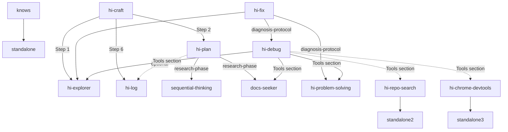

# Skill Dependency Graph

> This file details the relationships between skills: which skills call others, which are standalone, and any external references pointing to non-existent skills.

---

## 1. Dependency Graph Overview

---

## 2. Skill Details

### 2.1 `knows` — Knowledge Retrieval

| Property | Value |
| --- | --- |
| **Status** | 🟢 Primary — called directly |
| **Calls** | *None. Fully standalone.* |
| **Called by** | *None.* |
| **Description** | Fetches evidence from Git history, MCP (mind/graph), and memory files. |

---

### 2.2 `hi-craft` — Feature Implementation

| Property | Value |
| --- | --- |
| **Status** | 🟢 Primary — called directly |
| **Calls** | `hi-explorer`, `hi-plan`, `hi-log` |
| **Called by** | *None.* |
| **Description** | Main orchestrator for implementation: research → plan → code → test → review → finalize. |

**Call Details:**

| Step | Call | File:Line | Purpose |
| --- | --- | --- | --- |
| Step 1: Research | `hi-explorer` | `hi-craft/SKILL.md:41` | "Spawn researcher + hi-explorer. Reports <=150 lines." |
| Step 2: Plan | `hi-plan` | `hi-craft/SKILL.md:44` | "Spawn planner. Fast: /hi-plan --fast." |
| Step 6: Finalize | `hi-log` | `hi-craft/SKILL.md:62` | "/hi-log" — log after completion |

---

### 2.3 `hi-plan` — Implementation Planning

| Property | Value |
| --- | --- |
| **Status** | 🟢 Primary — called directly |
| **Calls** | `sequential-thinking`, `docs-seeker`, `hi-log` (optional) |
| **Called by** | `hi-craft` (Step 2) |
| **Description** | Designs architecture, implementation plans, scope challenges, and red-team reviews. |

---

### 2.4 `hi-explorer` — Parallel Codebase explore

| Property | Value |
| --- | --- |
| **Status** | 🔵 Linked — called by `hi-craft` and `hi-fix` |
| **Calls** | *None. Standalone.* |
| **Called by** | `hi-craft` (Step 1), `hi-fix` (Step 1) |
| **Description** | Uses parallel agents to scan codebase, find files, and collect context. |

---

### 2.5 `hi-log` — Session Logging

| Property | Value |
| --- | --- |
| **Status** | 🔵 Linked — called by `hi-craft` and `hi-plan` |
| **Calls** | *None. Standalone.* |
| **Called by** | `hi-craft` (Step 6), `hi-plan` (optional, archive-workflow) |
| **Description** | Logs analysis of changes and decisions. |

---

### 2.6 `sequential-thinking` — Sequential Thinking

| Property | Value |
| --- | --- |
| **Status** | 🔵 Linked — called by `hi-plan` |
| **Calls** | *None. Standalone.* |
| **Called by** | `hi-plan` (research-phase) |
| **Description** | Step-by-step analysis for complex problems using revision, branching, and hypothesis testing. |

---

### 2.7 `docs-seeker` — Documentation Discovery

| Property | Value |
| --- | --- |
| **Status** | 🔵 Linked — called by `hi-plan` |
| **Calls** | *None. Standalone.* |
| **Called by** | `hi-plan` (research-phase) |
| **Description** | Script-first documentation discovery via llms.txt standard. |

---

### 2.8 `hi-debug` — Debugging & System Investigation

| Property | Value |
| --- | --- |
| **Status** | 🔵 Linked — called by `hi-fix` |
| **Calls** | `docs-seeker`, `hi-explorer`, `hi-problem-solving` |
| **Called by** | `hi-fix` (diagnosis-protocol.md) |
| **Description** | Debug framework: systematic debugging, root cause tracing, defense-in-depth, log/CI analysis, performance diagnostics. |
| **Other refs** | Also references `hi-chrome-devtools` ✅ and `hi-repo-search` ✅ — skills now exist. |

---

### 2.9 `hi-problem-solving` — Problem-Solving Techniques

| Property | Value |
| --- | --- |
| **Status** | 🔵 Linked — called by `hi-fix` and `hi-debug` |
| **Calls** | *None. Standalone.* |
| **Called by** | `hi-fix` (diagnosis-protocol.md), `hi-debug` (Tools Integration) |
| **Description** | Systematic stuck-unsticking: simplification, collision-zone thinking, pattern recognition, inversion, scale games. |

---

### 2.10 `hi-fix` — Bug Fixing (Orchestrator Layer)

| Property | Value |
| --- | --- |
| **Status** | ⚪ Unused — **NOT called by any primary skill** |
| **Calls** | `hi-explorer`, `hi-debug`, `hi-problem-solving` |
| **Called by** | *None.* |
| **Description** | Orchestrator for bug fixing: locate → diagnose → fix → verify → finalize. |

---

### 2.11 `hi-repo-search` — Repository Exploration

| Property | Value |
| --- | --- |
| **Status** | 🟣 Tool — standalone, referenced by `hi-debug` |
| **Calls** | `code_graph` MCP, `graph_rag` MCP |
| **Called by** | `hi-debug` (Tools section) |
| **Description** | Search & explore ingested repos via code graph (Neo4j) + document graph RAG (Qdrant/Neo4j). Semantic search, call graph tracing, dependency analysis, entity extraction. |

---

### 2.12 `hi-chrome-devtools` — Browser Automation

| Property | Value |
| --- | --- |
| **Status** | 🟣 Tool — standalone, referenced by `hi-debug` |
| **Calls** | Puppeteer CLI |
| **Called by** | `hi-debug` (Tools section) |
| **Description** | Browser automation via Puppeteer CLI with persistent sessions. Screenshots, performance, network, scraping, form automation, auth, debugging. |

---

## 3. External References — Missing Skills

| Skill name | Referenced from | File:Line | Suggestion |
| --- | --- | --- | --- |
| `hi-git` | `hi-plan/references/archive-workflow.md:17` | "stage+commit+push via /hi-git" | Delete or create skill |

---

## 4. Summary Table

| Skill | Primary | Calls others? | Called by? | Missing Ref? | Note |
| --- | --- | --- | --- | --- | --- |
| `knows` | ✅ | ❌ | ❌ | ❌ | Fully standalone |
| `hi-craft` | ✅ | `explorer`, `plan`, `log` | ❌ | ❌ | Main orchestrator |
| `hi-plan` | ✅ | `sequential`, `docs`, `log` | `cook` | ❌ | Refs fixed |
| `hi-explorer` | 🔵 | ❌ | `cook`, `fix` | ❌ | Service skill |
| `hi-log` | 🔵 | ❌ | `cook`, `plan` | ❌ | Service skill |
| `sequential-thinking` | 🔵 | ❌ | `plan` | ❌ | Added |
| `docs-seeker` | 🔵 | ❌ | `plan` | ❌ | Added |
| `hi-debug` | 🔵 | `docs`, `explorer`, `probsolve` | `fix` | ❌ | Added |
| `hi-problem-solving` | 🔵 | ❌ | `fix`, `debug` | ❌ | Added |
| `hi-fix` | ⚪ | `explorer`, `debug`, `probsolve` | ❌ | ❌ | Safe to delete |
| `hi-repo-search` | 🟣 | ❌ | `debug` (Tools) | ❌ | **NEW** — code + doc exploration |
| `hi-chrome-devtools` | 🟣 | ❌ | `debug` (Tools) | ❌ | **NEW** — browser automation |

---
