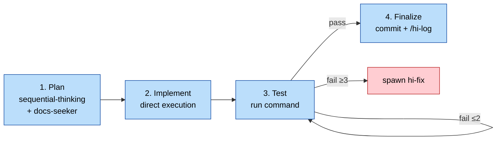
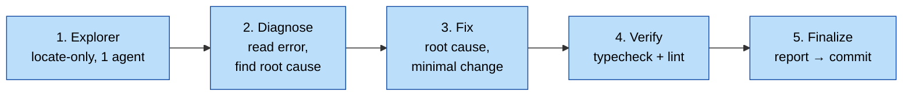
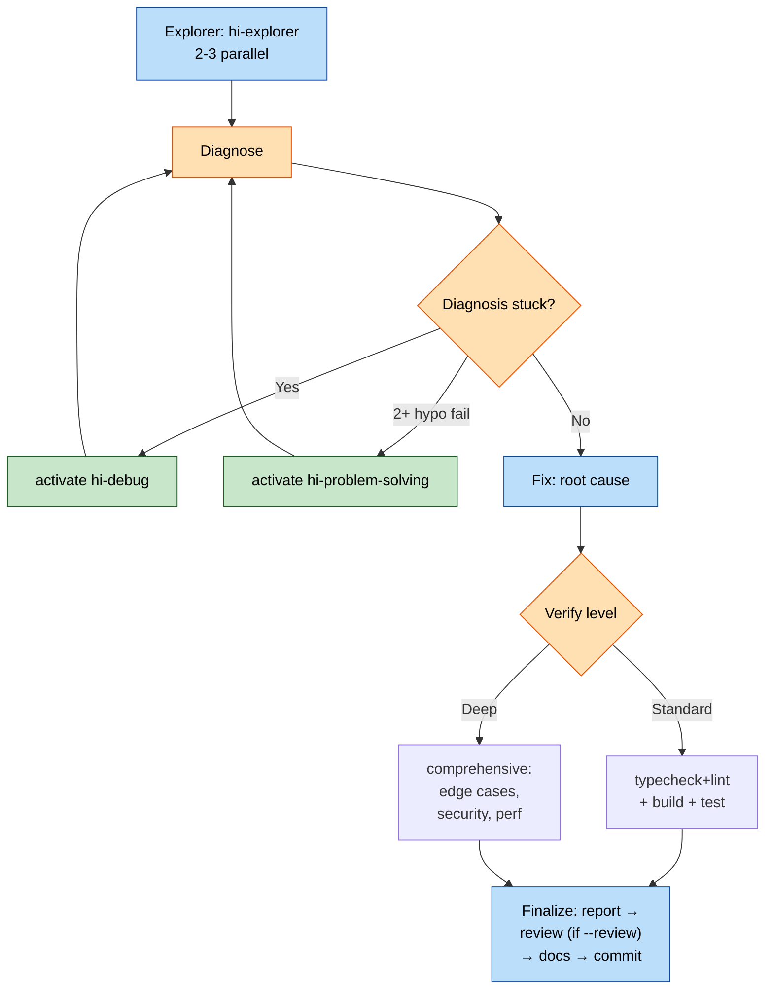
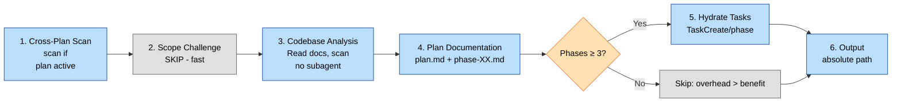
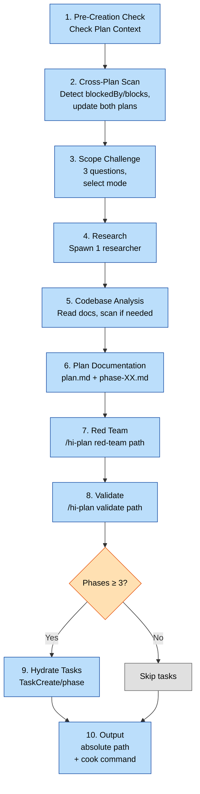
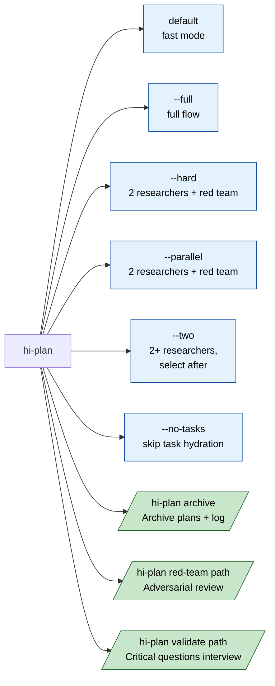
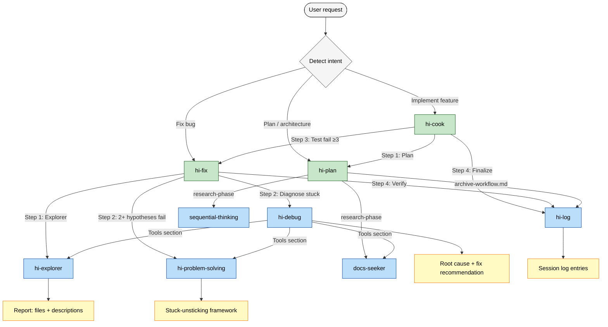

# DevKit — Workflow Diagrams

> Visual workflows for the 3 core skills: `hi-cook`, `hi-fix`, `hi-plan`. Mapped to current `SKILL.md` versions (cook v3.0.0, fix v2.0.0, plan v2.0.0).

---

## 0. Leaf Skills (Called automatically by main skills)

| Skill | Called by | Purpose |
| --- | --- | --- |
| `hi-explorer` | cook, fix, debug | Codebase scanning & file discovery |
| `hi-log` | cook, plan | Session logging |
| `sequential-thinking` | plan | Step-by-step analysis |
| `docs-seeker` | plan, debug | Documentation lookup |
| `hi-debug` | fix | Advanced debugging |
| `hi-problem-solving` | fix, debug | Stuck-unsticking framework |

## 1. `hi-cook` — Feature Implementation

### 1.1 Mode Matrix

| Mode | Research | Plan | Review | Test | Finalize |
| --- | --- | --- | --- | --- | --- |
| `fast` (default) | skip | inline `hi-plan --fast` | skip | run | commit + log |
| `full` | yes (`explorer` + researcher) | yes | MUST | run | commit + log + review |
| `review` | skip | inline | MUST | run | commit + log + review |
| `auto` | skip | inline | auto-pass | run | commit + log |
| `no-test` | skip | inline | skip | skip | commit + log |
| `code` (path to plan) | skip | — | optional | run | commit + log |

### 1.2 Quick (default) — Linear Flow

---

## 2. `hi-fix` — Issue Resolution

### 2.1 Quick (default) — Linear Flow

### 2.2 Standard / Deep — Escalation Path

---

## 3. `hi-plan` — Implementation Planning

### 3.1 Fast (default) — Linear Flow

### 3.2 Full (--full) — 10 Steps

### 3.3 Subcommands

---

## 4. Cross-skill Integration

---

## 5. HARD-GATEs

| Skill | HARD-GATE | Violation Behavior |
| --- | --- | --- |
| `hi-cook` | No code without plan + review | Stop, request `hi-plan` first (unless user says "just code it") |
| `hi-fix` | No fix before Explorer + Diagnose | Force Steps 1-2; if fail 3+ times → STOP, ask user for architecture |
| `hi-plan` | Cross-Plan Scan update **both plan.md** | Ensure bidirectional update, no plan left behind |

---

## 6. General Rules (Cross-cutting)

1. **Hard-gate first, fast-path later** — default to lightweight mode, use flags for expansion.
2. **Inline > Spawn** — only spawn sub-skills when necessary (3+ fails, 2+ hypothesis fails, large scope).
3. **Token budget** — each subagent spawn = 10-15K tokens. Prioritize inline methodology.
4. **Test/Verify just enough** — `typecheck+lint` for quick, `+build+test` for standard, `comprehensive` for deep.
5. **Review optional** — run only via `--review` or `full` mode. Auto-approve requires score ≥ 9.5 + 0 critical.
6. **Finalize = commit + log** — always conclude with git commit + `/hi-log` (recording decisions, root causes, impacts).
