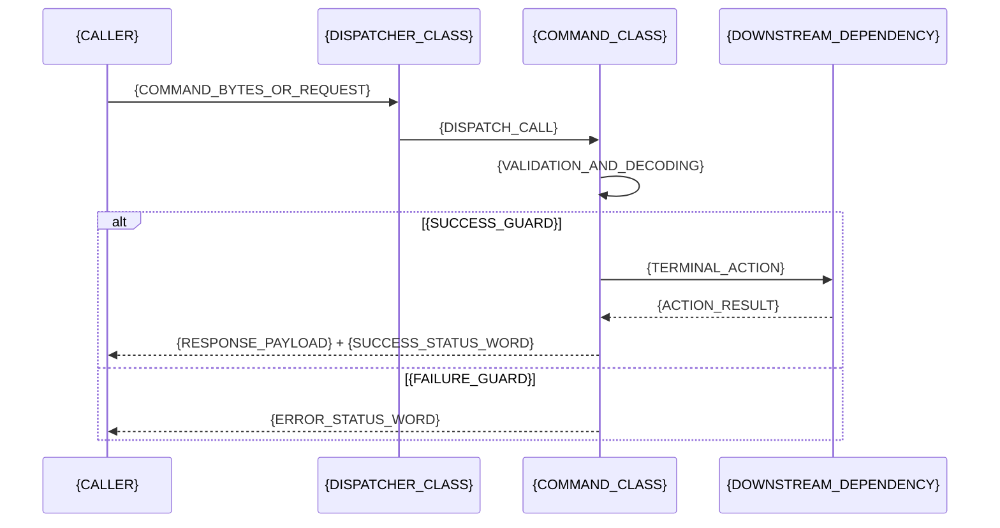
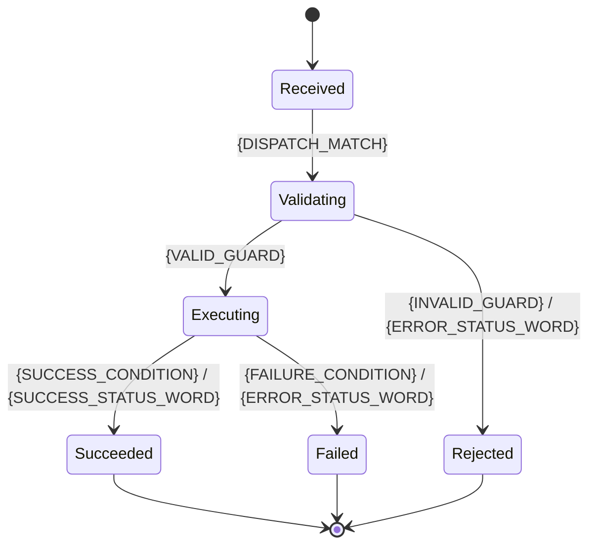

# Command Document Template

Use the complete structure below only when the requester explicitly asks for a full or all-sections command document. For a scoped request, generate only the requested sections plus both field tables. Replace every placeholder with verified evidence. In full-document mode, preserve every heading and write `{N/A}` when it does not apply.

````markdown
# {COMMAND_NAME} Command

## {SECTION_ID}.1 Purpose

{1-3 sentences describing what this command does and when it is used.}

## {SECTION_ID}.2 Definition

command: {CLA_HEADER} {Lc} [{REQUEST_TLV_TABLE_REF}] {LE_OR_TRAILER}
response: [{RESPONSE_TLV_TABLE_REF}] {SUCCESS_STATUS_WORD}
{Repeat the response line for every distinct response shape or status combination.}

## Table {REQUEST_TABLE_NO}: {COMMAND_NAME} Command Fields

| Tag     | Length (bytes) | Description     | Field is             |
| ------- | -------------: | --------------- | -------------------- |
| {TAG_1} |        {LEN_1} | {DESCRIPTION_1} | mandatory / optional |
| {TAG_2} |        {LEN_2} | {DESCRIPTION_2} | mandatory / optional |
| {TAG_3} |        {LEN_3} | {DESCRIPTION_3} | mandatory / optional |

## Table {RESPONSE_TABLE_NO}: {COMMAND_NAME} Response Fields

| Tag     | Length (bytes) | Description     | Field is             |
| ------- | -------------: | --------------- | -------------------- |
| {TAG_A} |        {LEN_A} | {DESCRIPTION_A} | mandatory / optional |
| {TAG_B} |        {LEN_B} | {DESCRIPTION_B} | mandatory / optional |

## Implementation Class Diagram

```mermaid
classDiagram
    class {DISPATCHER_CLASS} {
        +{DISPATCH_METHOD}({REQUEST_TYPE}) {RESPONSE_TYPE}
    }
    class {COMMAND_CLASS} {
        +{VALIDATE_METHOD}({REQUEST_TYPE}) {VALIDATION_RESULT}
        +{EXECUTE_METHOD}({COMMAND_CONTEXT}) {RESPONSE_TYPE}
    }
    class {CODEC_CLASS} {
        +{DECODE_METHOD}({BYTE_INPUT}) {REQUEST_TYPE}
        +{ENCODE_METHOD}({RESPONSE_TYPE}) {BYTE_OUTPUT}
    }
    {DISPATCHER_CLASS} --> {COMMAND_CLASS} : selects
    {COMMAND_CLASS} --> {CODEC_CLASS} : parses/encodes
```

## {SECTION_ID}.3 Usage

{Write the normative behavior here. Express every processing sequence as numbered steps; use short paragraphs only for non-processing context.}

1. {Rule one about preconditions / validation / sequencing.}
2. {Rule two about how to encode values, ordering, byte order, or protocol constraints.}
3. {Rule three about what happens on success.}
4. {Rule four about what happens on failure.}

## Command Sequence Diagram



## Command State Diagram



## Response Error Status Words

| Status Word | Comment           |
| ----------- | ----------------- |
| {SW_1}      | {ERROR_COMMENT_1} |
| {SW_2}      | {ERROR_COMMENT_2} |
| {SW_3}      | {ERROR_COMMENT_3} |

## Notes

* {Add source cross-references, evidence caveats, or version scope.}
* {Do not restate field definitions or normative protocol behavior here.}

## Generation Rules for AI

* Generate the complete structure only when the requester explicitly asks for a full or all-sections document.
* For a scoped request, generate only the requested sections and always include both the command and response field tables. If evidence proves that a table has no fields, retain the table heading and write `{N/A}`.
* Put TLV and other wire-field definitions in the field tables, never in narrative paragraphs.
* Keep data definitions in **Definition** and the field tables. Keep narrative protocol behavior in **Usage** only.
* Describe processing logic in **Usage** as numbered steps.
* Use consistent terminology and preserve the same field names across command, response, tables, and diagrams.
* Document every distinct possible response explicitly; never collapse multiple response shapes or status outcomes into one generic response.
* Preserve tags and status words in the representation and notation established by verified implementation or protocol evidence. Do not force hexadecimal or convert a binary, numeric, enum, or textual value into another representation.
* Keep length values in bytes.
* Mark each field as **mandatory** or **optional**.
* If the command has no response payload, still show the response line with only the status word.
* In full-document mode, if a section does not apply, keep the heading and write `{N/A}` rather than deleting the section.
* Include only classes, calls, guards, states, and transitions supported by the evidence ledger.
````
