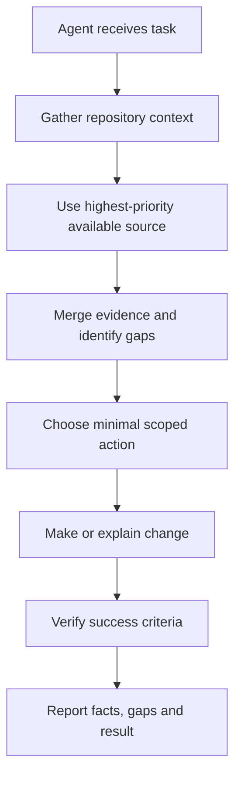
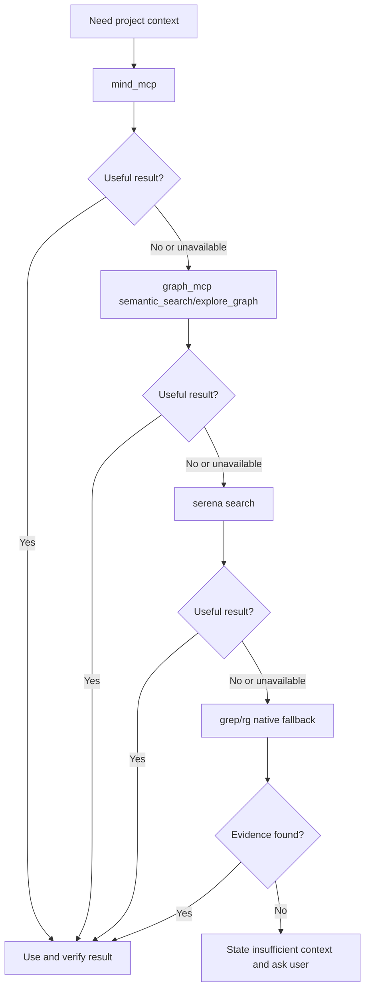
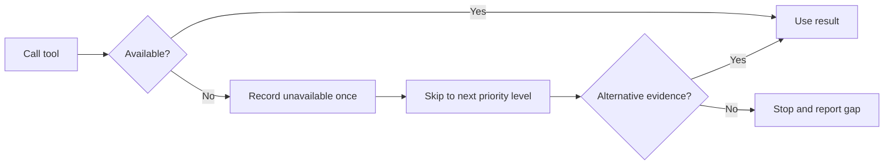
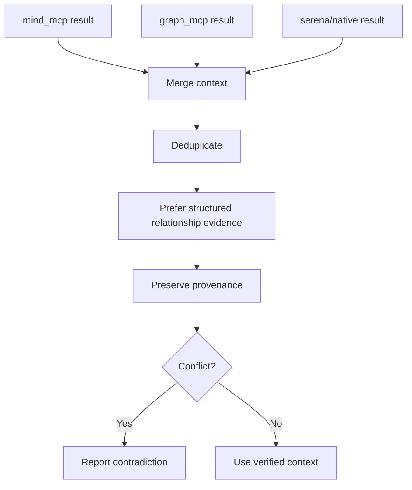
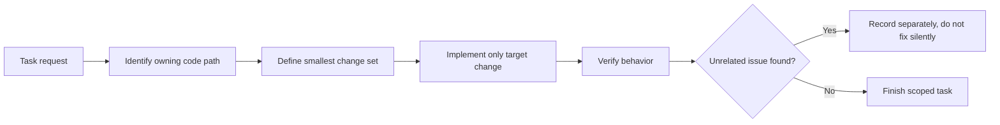
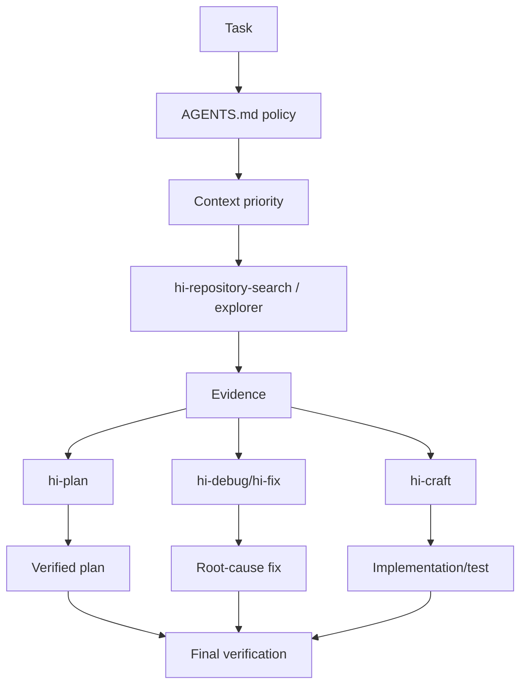
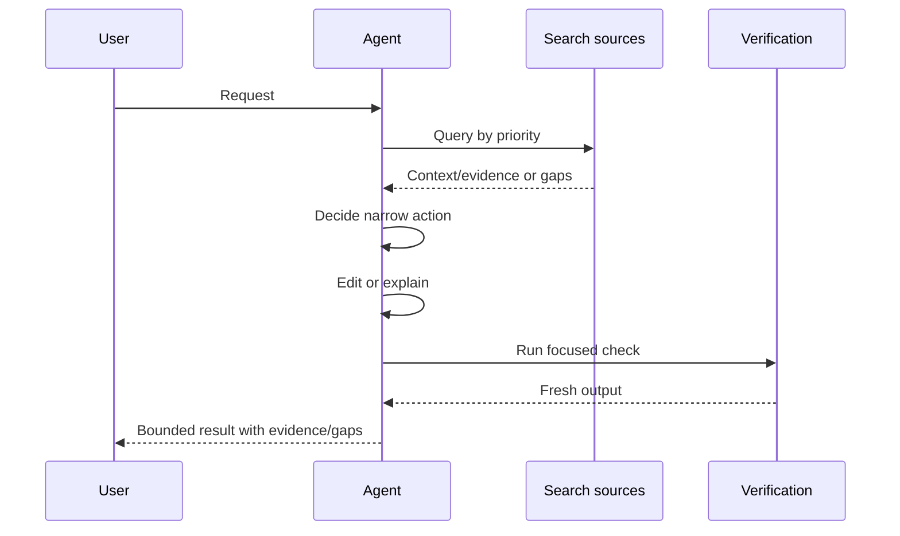
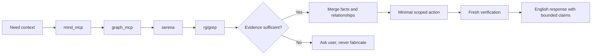

# AGENTS.md: Operating Guide for Agents

> `AGENTS.md` is a repository-level policy that governs how agents gather context, control reliability, limit scope, and verify results before answering or editing code.

## 1. What is AGENTS.md?

`AGENTS.md` is not source code, not an implementation plan, and not a skill that implements a feature. It is an **operating contract** between the repository and the AI agent.

This file answers the following questions:

- Where should the agent look for context first?
- How should the agent fall back when a tool is missing or fails?
- When is the agent allowed to use native search?
- What should the agent do if it cannot find context?
- How can hallucination and unsupported assumptions be avoided?
- How narrowly should changes be scoped?
- How must success be verified?
- In what language should the agent respond?

In this repository, `AGENTS.md` is the baseline policy for the skills and agent tasks running in the workspace.

## 2. Primary Objectives



The goal is not to gather as much information as possible. The goal is to:

1. find the right context;
2. use the most trustworthy source first;
3. never fabricate when evidence is missing;
4. only change what is necessary;
5. verify the result.

## 3. Current Policy Structure

`AGENTS.md` consists of the following rule groups:

| Group | Purpose |
|---|---|
| Objective | Defines the goal of gathering project context |
| Fast-Fail Rule | Do not retry tools that are missing/disconnected |
| Strict Priority Flow | Search source ordering |
| Mandatory Rules | No hallucination, merge context, scope, verify |
| Language Rule | Agent responds in English |

## 4. Strict Priority Flow

The mandatory query order:

```text
1. mind_mcp
2. graph_mcp: semantic_search, explore_graph
3. serena
4. grep/rg
```



### 4.1 Level 1: `mind_mcp`

`mind_mcp` is the first source for:

- project documentation;
- concepts;
- foundational knowledge;
- requirements;
- business context;
- architecture/project paragraphs.

Use this level when the question requires understanding “what the project says” or “what a feature means in the domain”.

Example of a good query:

```text
Find project requirements and architecture decisions related to authentication.
```

### 4.2 Level 2: `graph_mcp`

If `mind_mcp` is insufficient, use `graph_mcp` to find code relationships and logic by semantics:

- semantic code search;
- graph exploration;
- callers/callees;
- module relationships;
- entry points;
- execution paths;
- impact.

`graph_mcp` prioritizes semantics, not just exact strings. When using parser-aware graph tools, pass the correct `parser_type` and limit depth/result according to the question.

Example query:

```text
Find the function that handles authentication and trace its call path to token storage.
```

### 4.3 Level 3: `serena`

`serena` is a broad structural search fallback for:

- declarations;
- implementations;
- references;
- symbol overview;
- diagnostics;
- exact project structure that requires language-aware search.

Use it when structured mind/graph context does not provide enough evidence or when a tool is unavailable.

### 4.4 Level 4: `grep`/`rg`

Native exact-string search is the last-resort fallback:

- find literal error messages;
- exact filename/path;
- config keys;
- specific identifiers/strings;
- quick verification after structured search.

Native search is not forbidden, but it should not be the first move when project context or semantic relationships need to be understood first.

## 5. Proceed-Only-if-No-Result/Unavailable Rule

The priority flow does not mean all four levels must always be called. The agent must stop once evidence is sufficient.

```text
mind_mcp has enough evidence -> graph/serena/rg not needed
mind_mcp insufficient        -> try graph_mcp
graph insufficient           -> try serena
serena insufficient          -> use rg/grep
all fail                     -> stop and ask the user
```

This helps to:

- reduce tool calls;
- reduce duplicate results;
- keep query scope small;
- avoid native search producing fragmented context before the domain is understood.

## 6. Fast-Fail Rule

> If a tool is missing or disconnected: skip it immediately, do not retry.

### 6.1 When to fast-fail?

- MCP server not connected;
- tool not exposed;
- tool provider unavailable;
- session/config lacks the capability;
- service returns an explicit unavailable error.

### 6.2 What to do after fast-fail?

1. record the tool as unavailable;
2. move to the next level;
3. do not repeat the same call;
4. continue if evidence can still be gathered;
5. record the gap in the final report.



### 6.3 What is not allowed

- retrying the same tool repeatedly just because no result has been returned;
- pretending a tool ran;
- fabricating evidence from output that was never received;
- omitting gaps from the final response.

## 7. Mandatory Rule 1: No Hallucination

Rule:

> If the entire search chain returns no context, stop and ask the user. Never fabricate context.

### 7.1 Fact, inference, and unknown

The agent must distinguish between:

| Type | Meaning | How to write it |
|---|---|---|
| Fact | Has a direct source | “File X defines function Y.” |
| Inference | Inferred from multiple evidence | “This suggests that it may…” |
| Assumption | Temporarily assumed to proceed | “The current assumption is…” |
| Unknown | No evidence yet | “Could not be determined…” |

### 7.2 Not finding something does not mean it does not exist

Invalid example:

```text
No implementation was found, so this feature does not exist.
```

Correct approach:

```text
No implementation was found in the sources checked;
the project context is insufficient to conclude that the feature does not exist.
```

### 7.3 When the user must be asked

Ask the user when:

- all search levels fail;
- the target/feature is unclear;
- multiple sources contradict each other with no owner to decide;
- context outside the repository is needed;
- production behavior cannot be inferred from static sources;
- a user request change carries risk but lacks acceptance criteria.

## 8. Mandatory Rule 2: Merge Context

When multiple tools return evidence that overlaps or complements each other:

1. collect each result;
2. deduplicate;
3. prefer structured data from `graph_mcp` for the same relationship;
4. keep source/provenance;
5. record contradictions if sources differ;
6. distinguish facts from inferences.



### 8.1 Merge example

- `mind_mcp`: the requirement states tokens must rotate;
- `graph_mcp`: identifies the current token flow;
- `serena`: finds the implementation/reference;
- `rg`: confirms the literal config key.

A valid conclusion must state which source each claim is based on, not lump everything into one vague “source”.

## 9. Mandatory Rule 3: No Assumptions

The agent must not fill gaps with silent speculation.

### 9.1 Assumption gate

Before using an assumption, ask:

- what evidence the assumption is based on;
- what the impact would be if it is wrong;
- whether there is a cheap query that can check it;
- whether the work can proceed without the assumption;
- whether the user/domain owner needs to confirm it.

### 9.2 How to report uncertainty

```markdown
## Open Questions
- The target module was found, but its production configuration was not indexed.
- The graph shows a possible callback path; direct runtime registration is unverified.
- Please provide the deployment/environment context before changing behavior.
```

### 9.3 Do not turn a pattern into a fact

The fact that code “usually” uses the repository pattern does not prove this file uses that pattern too. Read the source or the direct relationship instead.

## 10. Mandatory Rule 4: Minimal Code

The policy requires solving the target problem with minimal code:

- no refactoring outside scope;
- no unnecessary abstractions;
- no fixing unrelated bugs;
- no changing unrelated metadata;
- no expanding the search/change just because an opportunity is noticed.

“Minimal” does not mean blind patching. It must be enough to resolve the root behavior and be verifiable.



## 11. Mandatory Rule 5: Strict Scope

Scope includes:

- files read/edited;
- the behavior to address;
- related dependencies;
- the output the user requested;
- acceptance criteria.

### 11.1 Scope discipline

Before expanding scope, determine:

- whether the new change blocks the task;
- whether it directly affects correctness/security;
- whether user approval is needed;
- whether it can be deferred and reported separately.

### 11.2 Unrelated issue

If an unrelated bug is discovered:

- do not fix it on your own;
- record the path/symbol and impact if needed;
- propose a follow-up;
- keep the diff clean.

## 12. Mandatory Rule 6: Success Criteria

A task only succeeds when the success criteria are verified, not merely when the code has changed.

### 12.1 Verify per claim

| Claim | Check to run |
|---|---|
| File created | File exists, content/format check |
| Symbol modified | Compile/typecheck/test or structural check |
| Bug fixed | Reproduce original symptom after fix |
| Tests pass | Fresh test command, output/exit code |
| Build pass | Fresh build command, exit 0 |
| Requirements met | Requirement-by-requirement checklist |
| Migration complete | Final tree, links/imports, no unintended files |

### 12.2 Do not over-claim

Avoid:

- “done” when validation has not been run;
- “all good” when unresolved gaps remain;
- “feature complete” when only a plan has been created;
- “no impact” when tracing was only done at limited depth.

## 13. Response Language

The final rule of `AGENTS.md`:

> The agent always responds in English.

This applies to the agent's responses in this repository, even though the user may communicate in another language. Code comments/docs may follow task-specific requirements or file conventions, but the final agent response must be in English per policy.

## 14. Interaction with Skills



### 14.1 With `hi-repository-search`

`AGENTS.md` defines the priority chain. `hi-repository-search` executes repository evidence search with modes and an Evidence Bundle.

### 14.2 With `hi-codebase-research-explorer`

The Explorer can parallelize local/external research, but internal search must still respect the tool priority policy when looking for local context.

### 14.3 With `hi-plan`

Before creating a plan, the agent must gather sufficient repository context, detect uncertainty, and never fabricate files/architecture.

### 14.4 With `hi-fix`/`hi-debug`

Root-cause diagnosis requires evidence before the fix. If the search chain fails, report the gap or ask the user; do not guess the root cause.

### 14.5 With `hi-craft`

The implementation must stay within strict scope and verify tests/builds before claiming completion.

## 15. Standard Operating Procedure

### Phase 1: Understand

- read the user request;
- identify a concrete anchor;
- check applicable instruction files;
- determine success criteria;
- state one local hypothesis and a cheap discriminating check for coding tasks.

### Phase 2: Gather

- run search by priority;
- fast-fail unavailable tools;
- merge source evidence;
- record gaps/unknowns.

### Phase 3: Decide

- choose the smallest scoped action;
- do not expand before it is needed;
- ask the user if ambiguity blocks progress;
- identify the verification command.

### Phase 4: Act

- edit minimally;
- leave unrelated changes untouched;
- no overwrites or destructive operations;
- preserve existing conventions.

### Phase 5: Verify

- run focused executable validation;
- read the output/exit code;
- fix local defects if any;
- only claim what the evidence proves.



## 16. Fallback matrix

| Primary situation | Fallback | Report |
|---|---|---|
| `mind_mcp` unavailable | `graph_mcp` | Mind context unavailable |
| `graph_mcp` unavailable | `serena` | Graph relationships unverified |
| `serena` unavailable | `rg`/grep | Structural semantic search unavailable |
| All search unavailable | Ask user | Insufficient repository context |
| Source conflict | Keep both claims | Contradiction unresolved |
| Target unclear | Ask user | Need concrete anchor |
| Verification command unavailable | Alternative check or report blocker | Cannot claim full verification |

## 17. What AGENTS.md Prevents

### 17.1 Tool thrashing

Do not repeatedly call the same unavailable tool. This saves time and makes failures clearer.

### 17.2 Hallucinated architecture

Do not invent module/file relationships that the graph/source has not proven.

### 17.3 Broad unrelated changes

Do not turn a small fix into a repository-wide refactor.

### 17.4 False completion

Do not report pass/fixed/done without a fresh verification.

### 17.5 Search-first with blind exact text

Do not start with a repository-wide sweep when project knowledge/semantic graph can return better context.

## 18. Agent Checklist Before Responding

### Context

- [ ] Has a specific file/symbol/error/request been identified?
- [ ] Was the correct search priority used?
- [ ] Was the unavailable tool recorded?
- [ ] Does the evidence have a source locator?

### Reasoning

- [ ] Were facts and inferences separated?
- [ ] Is there an unverified assumption?
- [ ] Is there a contradiction/gap that needs to be stated?
- [ ] Is the scope expanding unnecessarily?

### Action

- [ ] Has the smallest change set been chosen?
- [ ] Does it touch unrelated files/user changes?
- [ ] Is there a risk of overwrites/secrets/destructive actions?

### Verification

- [ ] Which verification command proves the claim?
- [ ] Was the command freshly run?
- [ ] Were the output and exit code read?
- [ ] Does the final response accurately state the evidence limits?

## 19. Example: Successful Search Chain

Task:

```text
Find where authentication errors are transformed into API responses.
```

Flow:

1. `mind_mcp`: find architecture/requirements about the auth error contract.
2. If insufficient, `graph_mcp`: semantic search for auth error handling and trace the flow to the HTTP response.
3. `serena`: find the declaration/reference of the error mapper.
4. `rg`: used only to confirm the exact error class/string if needed.
5. Read the source directly.
6. Return facts, relationships, confidence, and gaps.

Evidence response of the form:

```markdown
## Findings
- `AuthErrorMapper.toResponse` converts domain auth errors to HTTP responses — code — high
  Evidence: direct caller path from auth middleware.

## Relationships
- `AuthMiddleware.handle` -> `AuthService.authenticate` -> `AuthErrorMapper.toResponse`

## Inferences
- Updating the mapper may affect all protected routes using the shared middleware.

## Gaps
- Error behavior for one legacy route is not indexed.
```

## 20. Example: Failed Search Chain

Task:

```text
Explain the business rule for an undocumented legacy billing flow.
```

If:

- `mind_mcp` has no requirement;
- `graph_mcp` has no project/index;
- `serena` cannot find a symbol;
- `rg` cannot find relevant source;

The agent must return:

```text
I could not establish the billing rule from the available project context.
The configured search sources did not return a verified implementation or document.
Please provide the relevant module, repository path, or business requirement.
```

Do not infer the rule from the name “billing”.

## 21. Example: Conflict Between Code and Document

The current code allows a 30-day session timeout. The security decision document requires 7 days.

Correct response:

```markdown
## Contradictions
- Code config currently permits a 30-day session timeout.
- Security decision document specifies a 7-day timeout.

## Inferences
- The implementation appears inconsistent with the documented policy.

## Gaps
- The document's effective date and deployment environment are not confirmed.

## Next Step
- Ask the policy owner whether the document or implementation is authoritative before changing behavior.
```

Do not choose code or the document as the source of truth on your own without an owner/context.

## 22. Verify policy compliance

### 22.1 Search compliance

- [ ] Query starts from `mind_mcp` when applicable.
- [ ] Graph semantic/explore is prioritized before native search.
- [ ] Serena is used for structural search when needed.
- [ ] `rg` is the last fallback or for exact verification.
- [ ] Stop when evidence is sufficient.

### 22.2 Evidence compliance

- [ ] No fabricated context.
- [ ] Clear source locators.
- [ ] Relationships are verified.
- [ ] Contradictions/gaps are reported.
- [ ] Inferences are labeled.

### 22.3 Scope compliance

- [ ] Only target the necessary files/behavior.
- [ ] No unrelated issues are fixed.
- [ ] User changes are not overridden.
- [ ] No destructive commands without approval.

### 22.4 Completion compliance

- [ ] Success criteria are checked.
- [ ] Fresh executable validation ran when possible.
- [ ] Output/exit code was read.
- [ ] Final claim does not exceed the evidence.
- [ ] Response uses English per policy.

## 23. Limitations to Understand Correctly

### 23.1 The priority flow does not guarantee tools are always available

The policy specifies the order and fallback. It does not guarantee that MCP, the graph index, or Serena are connected.

### 23.2 Structured results still need verification

`mind_mcp` or `graph_mcp` return structured context, but the source may be stale, incomplete, or parser-limited. Important claims still require direct verification.

### 23.3 Native search is not absolutely forbidden

`rg` is appropriate for exact strings and fallback. The rule only prevents using it as the first/only context strategy when semantics are needed.

### 23.4 Not every task requires asking the user

If evidence is sufficient and the scope is clear, the agent should act. Ask the user only when ambiguity/gaps block progress or when safe verification is impossible.

### 23.5 The language rule may conflict with user preference

In this workspace, `AGENTS.md` requires English responses. This is a repository instruction to follow unless a higher-priority instruction overrides it legitimately.

## 24. Quick Summary



The shortest sentence to remember:

> `AGENTS.md` requires the agent to move from trustworthy context to minimal action, always record gaps, and only claim what evidence and verification actually prove.
