# Hi Codebase Research Explorer: Complete Guide

> `hi-codebase-research-explorer` is a skill that gathers codebase intelligence and external research using multiple agents running in parallel. It is used to find files, symbols, dependencies, web documentation, GitHub repositories, images, UI, and diagrams before planning, fixing, or implementing.

## 1. What problem does this skill solve?

In a large repository, reading a few files at random often leads to conclusions that lack context. A task may involve:

- file implementation;
- callers and callees;
- tests and fixtures;
- config/environment;
- documentation;
- Git history;
- external API or library docs;
- uncloned GitHub repositories;
- screenshot/UI/architecture diagrams.

Explorer turns a search request into an organized investigation:

1. analyze the target and scope;
2. choose internal, external, or hybrid mode;
3. divide the work into non-overlapping scopes;
4. run agents in parallel;
5. collect, deduplicate, and synthesize evidence;
6. clearly report gaps, timeouts, and unresolved questions.

It is **not** a skill for fixing code. Explorer agents are read/search-only by default; the output is used as input for `hi-plan`, `hi-fix`, `hi-craft`, or the human developer.

## 2. Overall mental model

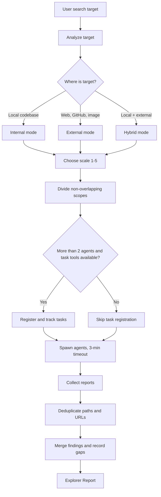

## 3. Syntax

```text
/hi-codebase-research-explorer [search-target]
```

`search-target` can be:

- a local directory or path;
- the name of a file, class, function, or behavior to find;
- an error message;
- a documentation URL;
- a GitHub repository or owner/repo;
- an image path, screenshot, or diagram;
- a topic to research;
- a request combining local code and external docs.

Examples:

```text
/hi-codebase-research-explorer authentication middleware and its tests
/hi-codebase-research-explorer https://github.com/vercel/next.js
/hi-codebase-research-explorer screenshot of the failing mobile layout
/hi-codebase-research-explorer local payment client plus current Stripe retry guidance
```

This skill does not have many workflow flags like `hi-plan` or `hi-fix`. Complexity is controlled by analyzing the target, choosing a mode, and scaling from 1 to 5 agents.

## 4. Four types of targets

### 4.1 Local

The target is inside the current codebase:

- source file;
- test;
- config;
- module;
- symbol;
- error path;
- internal dependency graph.

Use **internal mode**.

### 4.2 External

The target is outside the current repository:

- web docs/blog;
- uncloned GitHub repository;
- GitHub issue/commit/docs;
- image/screenshot;
- architecture diagram.

Use **external mode** and the appropriate MCP tools.

### 4.3 Hybrid

Requires connecting local code with external evidence:

- local code uses a library and needs to read its current docs;
- a local fork needs to be compared with upstream GitHub;
- a local UI bug requires reading a screenshot and the component source;
- a local error needs to be cross-referenced against external issues/docs.

Use **hybrid mode** and spawn agents with separate toolsets.

### 4.4 Ambiguous target

If the target does not indicate what to look for, the explorer should:

- extract the clearest entity/behavior from the prompt;
- look for local context first if there are repository signals;
- record what remains ambiguous in `Unresolved Questions`;
- not turn an ambiguous search into a firm conclusion.

## 5. Analyze: detect the scope

The first step parses the user prompt and determines:

- whether the target is local, external, or hybrid;
- the type of resource to find;
- the directory/repository/domain scope;
- a reasonable agent count;
- the toolset to grant each agent;
- the output the user needs: paths, docs, dependencies, visual understanding, or diagnosis.

### 5.1 SCALE

SCALE is the expected number of agents, from 1 to 5:

| SCALE | Agents | Use case |
|---:|---:|---|
| 1 | 1 | A single file, a single docs page, or a simple repo lookup |
| 2-3 | 2-3 | Multiple modules, multiple sources, or repo + docs |
| 4-5 | 4-5 | Comprehensive investigation with many queries/toolsets |
| 6+ | Not recommended | Split into multiple batches instead of spawning too many |

SCALE is not a goal to increase the agent count. Only increase it when the branches have independent scopes and their results complement each other.

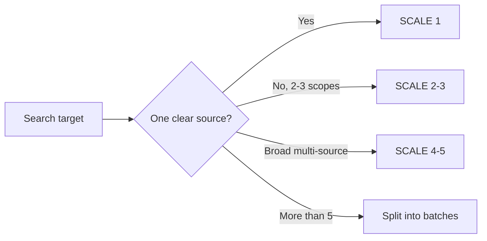

## 6. Divide: split work without overlap

Each agent must have its own scope and must not read the same area just to repeat conclusions.

### 6.1 Internal directory division

Directories are usually divided by ownership:

```text
src/ | lib/ | tests/ | config/ | api/ | types/
```

Example for the authentication feature:

| Agent | Scope | Question |
|---|---|---|
| A | `src/auth/` | What are the entry points and business logic? |
| B | `tests/auth/` | What behavior do existing tests cover? |
| C | `config/` + docs | What are the config, environment, and integration contract? |

Do not assign the same directory to multiple agents unless they have clearly different queries.

### 6.2 External toolset division

Each external agent should be assigned a toolset:

| Agent | Toolset | Goal |
|---|---|---|
| Web docs | web search + web reader | Find and read current docs |
| GitHub | repo structure + search + read | Analyze the repository |
| Visual | image/UI/diagram analyzer | Understand screenshots or diagrams |

An agent may have multiple tools in the same category, but avoid assigning too many unrelated goals.

### 6.3 Non-overlap principles

A scope is considered overlapping if two agents:

- read the same file to answer the same question;
- search for the same symbol without different lenses;
- use the same external source without distinct goals;
- both reach architecture conclusions without dividing the evidence.

If redundancy is required because the issue is critical, label it clearly as **independent verification**, not as a normal scope.

## 7. Register Tasks

Task registration helps track agents when there are more than two agents and task tools are available.

### 7.1 When to register

- call `TaskList` first to reuse existing tasks;
- if no suitable task exists, create one task per agent;
- attach enough metadata to know what each agent is doing;
- move the task to `in_progress` before spawning;
- move it to `completed` after the agent returns its report;
- mark timeout/skip instead of leaving the task in an active state.

### 7.2 Standard metadata

```yaml
agentType: general-purpose
scope: <directory or research scope>
scale: <small|medium|large>
agentIndex: 0
 totalAgents: 3
toolMode: <read|search|bash|web|repo|visual>
tools: [<mcp_tool_1>, <mcp_tool_2>]
priority: P2
effort: 3m
```

The `totalAgents` field should not be ignored when consolidating the report, because it helps identify whether the batch is complete or some agents timed out.

### 7.3 When to skip task registration

Skip if:

- there are at most 2 agents;
- task tools are unavailable;
- the lookup is too small and results are returned directly;
- creating tasks adds more overhead than the tracking value.

Skipping registration does not mean skipping parallel work; it only drops the tracking layer.

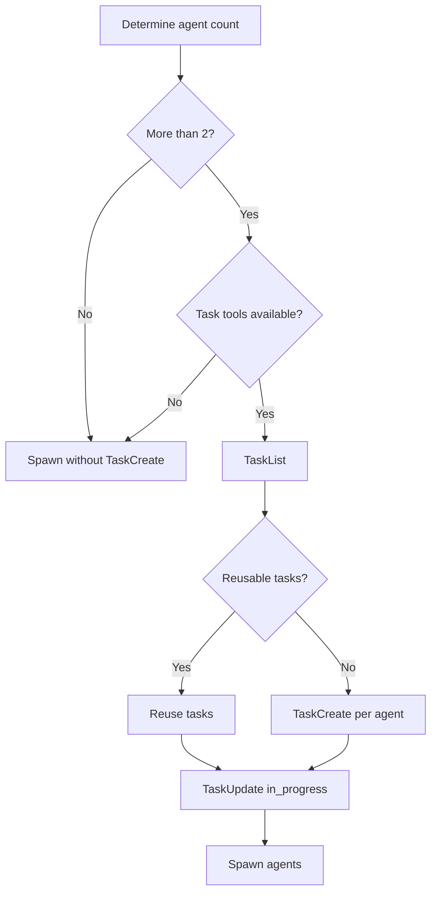

## 8. Spawn and timeout

### 8.1 Before spawning

Each task must be moved to `in_progress` before the agent starts. The agent prompt must include:

- the index and total number of agents;
- its own scope;
- the specific target;
- the allowed toolset;
- report format;
- a 3-minute timeout;
- a requirement to record unresolved items if a tool is unavailable.

### 8.2 Timeout policy

Each agent has a default timeout of 3 minutes:

- agent returns results before the timeout: collect;
- agent times out: skip and record the gap;
- do not blindly retry a timed-out agent;
- if a tool fails, use a same-category fallback when possible;
- if multiple agents fail with the same tool, record `tool degraded` in the report.

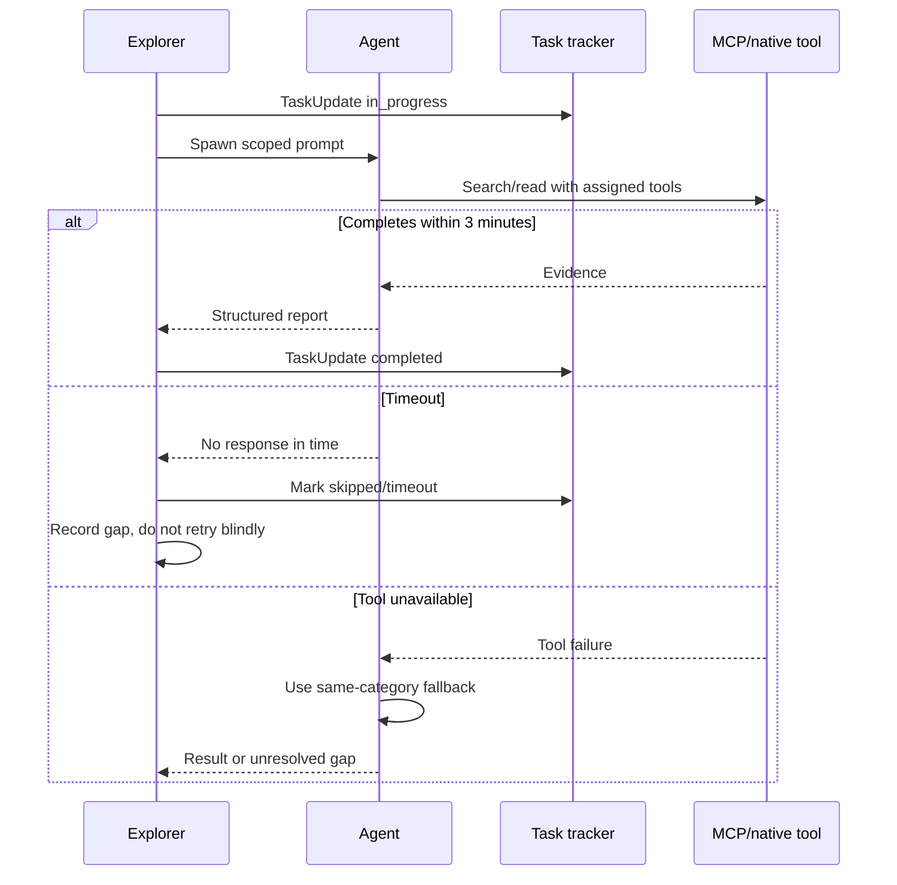

## 9. Internal mode: local codebase

### 9.1 When to use

Use internal mode when the target is inside the current single repository. Examples:

- "find where login is handled";
- "which file creates the payment event?";
- "trace the call path of this error";
- "find tests for component X";
- "where is the database client config?".

### 9.2 Tool priority flow

The internal explorer must prioritize evidence in this order:

1. `mind_mcp`: project docs, concepts, and foundational knowledge;
2. `graph_mcp`: semantic search and the relationship graph;
3. `serena`: broad codebase search;
4. `grep`/`rg`: exact-string sweep as a last-resort fallback.

Fast-fail rule: if a tool is missing or unavailable, move immediately to the next tool without endless retries.

> Note: the quick reference in `SKILL.md` calls for Glob/Grep/Read/Bash for internal mode, while `internal-explore.md` puts the priority flow through mind/graph/serena before native tools. When operating under repo policy, prefer structured context first; only use native search when the earlier layers return no results or are unavailable.

### 9.3 Prompting an internal agent

```text
Quickly explore {DIRECTORY} for: {TARGET}
Use Glob/Grep. List files with descriptions. Timeout 3m.
Report:
## Found Files
- path/file.ext - description
```

The prompt must bound the directory/target so the agent does not scan the whole repo without a goal.

### 9.4 File chunking

When reading files:

| Size | How to read |
|---:|---|
| <500 lines | Read the whole file |
| 500-1500 lines | Split into 2-3 chunks |
| >1500 lines | Split into chunks of roughly 500 lines |

Chunking helps preserve context and prevents the agent from reading too much unrelated code.

### 9.5 Internal output

```markdown
## Found Files
- src/auth/login.ts - login entry point and token creation
- src/auth/user-repository.ts - user lookup contract
- tests/auth/login.test.ts - login regression coverage

## Key Findings
- Login uses repository projection X.
- Token creation requires field Y.

## Unresolved
- Production-only failure cannot be reproduced locally.
```

## 10. External mode: web, GitHub, and visual

### 10.1 Web docs/blog

Standard workflow:

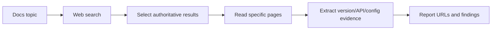

Use web search for short queries or error lookups; use the web reader to read a specific URL. When the docs search returns no results:

1. refine the query;
2. try searching with a recency filter if the tool supports it;
3. read the specific page if the user provided a URL;
4. record the source gap explicitly if still not found.

Do not use a search snippet as final evidence when the original page can be read.

### 10.2 GitHub repository

Standard workflow:

1. review the repo structure;
2. search related docs/code/issues/commits;
3. read specific files;
4. report the repo path and line/context when available.

Toolset:

```text
mcp__zread__get_repo_structure
mcp__zread__search_doc
mcp__zread__read_file
```

If the repo is not found:

- verify the `owner/repo`;
- check public/private access;
- record that the repo lookup failed;
- do not fabricate the content of unread files.

### 10.3 Image, screenshot, and UI

Choose the tool based on the goal:

| Target | Tool category | Output |
|---|---|---|
| Screenshot UI | UI/image analyzer | Layout, components, visual issues |
| Error screenshot | Error screenshot analyzer | Text, error context, likely causes |
| Architecture diagram | Technical diagram analyzer | Nodes, edges, flow, boundaries |
| Chart/dashboard | Data visualization analyzer | Trends, anomalies, metrics |
| OCR code/text | Text extraction | Extracted text/code |
| General image | General image analyzer | Visual description |

The image source must match the tool's supported format. For video or large files, convert/limit according to tool constraints; do not send secrets in images/queries.

### 10.4 Visual results do not replace source evidence

Screenshot analysis can point to a symptom or layout, but it does not prove root cause. Visual findings must be tied to:

- component source;
- CSS/layout owner;
- data state;
- browser/viewport;
- reproduction steps.

## 11. Hybrid mode

Hybrid mode is used when local and external evidence depend on each other.

Example: local code uses `Library v3`; you need to know the current behavior of `Library v3` and compare it with the upstream implementation.

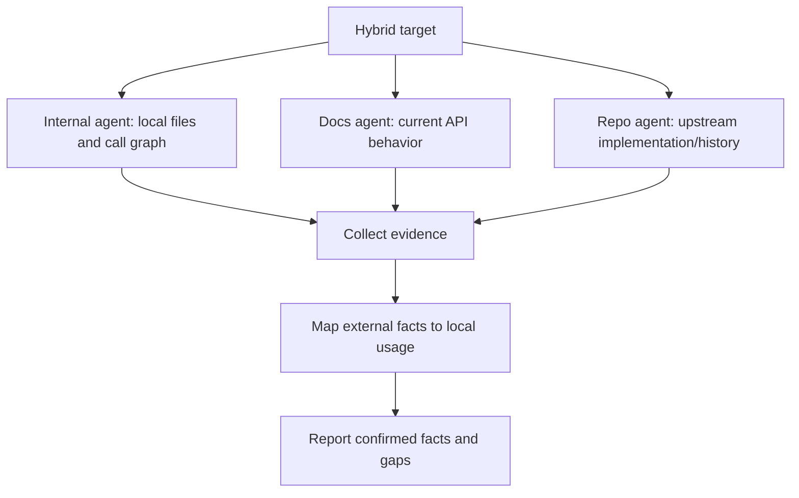

Hybrid rules:

- each agent has one toolset and scope;
- do not treat external docs as evidence of the local implementation until version/config is mapped;
- record version, source URL/repo, and assumptions;
- if the local fork differs from upstream, note the divergence;
- collection must deduplicate but must not merge two contradictory findings into one fact.

## 12. Collect: synthesize results

Collect is the step that turns multiple reports into a single usable explorer report.

### 12.1 Deduplicate

Deduplicate:

- duplicate file paths;
- duplicate URLs;
- the same GitHub path;
- the same finding with different wording;
- an agent repeating a dependency.

Do not deduplicate by dropping provenance when two agents provide different evidence. Descriptions may be merged, but a note must be kept if the results conflict.

### 12.2 Merge descriptions

Each resource should have a short description answering:

- what this resource is;
- how it relates to the target;
- through which lens the agent found it.

### 12.3 Note gaps and timeouts

The report must record:

- which agent timed out;
- which tool was unavailable;
- which source was not accessible;
- which query was inconclusive;
- which parts have not been verified.

Do not hide gaps by writing the report as if the investigation were complete.

### 12.4 Resolve conflicts

If two agents conflict:

1. keep both claims temporarily;
2. compare sources and scopes;
3. prioritize direct, recent, and correctly-versioned evidence;
4. mark each claim as `CONFIRMED`, `REFUTED`, or `INCONCLUSIVE`;
5. put the conflict into `Unresolved Questions` if it remains unresolved.

## 13. Explorer Report format

Standard output:

```markdown
# explorer Report
## Relevant Files / Resources
- path/to/file.ts - description
- https://docs.example.com/page - description
- github.com/owner/repo/path - description
## Key Findings
- finding 1
- finding 2
## Unresolved Questions
- any gaps
```

### 13.1 Relevant Files / Resources

The list must contain genuinely relevant resources. Do not list hundreds of files just because they are in the same directory.

Example:

```markdown
## Relevant Files / Resources
- src/auth/session.ts - owns session refresh and expiry handling
- tests/auth/session.test.ts - covers refresh success but not expired refresh token
- https://docs.example.com/oauth/refresh - external refresh-token contract
```

### 13.2 Key Findings

A finding should be an evidence-backed fact or conclusion, not a repeated file list.

Good:

```markdown
- Session refresh is initiated from `refreshSession`, not the route handler.
- Existing tests cover valid refresh tokens but omit revoked-token behavior.
```

Not good:

```markdown
- There are many auth files.
- Maybe the route handles refresh.
```

### 13.3 Unresolved Questions

Use this section for:

- production-only behavior;
- unavailable tool/source;
- unconfirmed versions;
- conflicting agent findings;
- dependencies that could not be traced;
- user decisions that need to be asked.

## 14. Output and downstream handoff

### 14.1 Explorer output

Explorer returns:

- relevant paths/files/resources;
- descriptions;
- key findings;
- unresolved questions;
- gaps/timeouts/tool degradation if any.

It should not return:

- code fixes that were not requested;
- assumptions written as facts;
- unnecessary full file contents;
- reports that do not distinguish local from external evidence.

### 14.2 Handoff to hi-plan

`hi-plan` uses the explorer report to:

- identify existing code to reuse;
- divide phases;
- build a related code list;
- surface dependencies and risks;
- compare architecture options;
- write implementation steps with traceability.

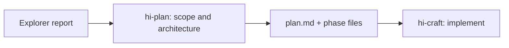

### 14.3 Handoff to hi-fix

`hi-fix` uses the explorer for locate-only before diagnosis:

- affected file;
- direct dependencies;
- caller/callee;
- test location;
- config/environment;
- recent history.

The explorer does not conclude root cause on behalf of diagnosis, unless the evidence is clear enough — and even then it must still be verified during the diagnosis step.

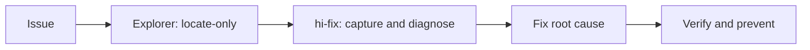

### 14.4 Handoff to hi-craft

`hi-craft` may use the explorer when:

- creating a quick plan before implementation;
- the plan lacks files/context;
- library/API docs are needed;
- research is needed for full mode.

## 15. Explorer verification

Explorer does not verify behavior with tests like `hi-fix` does. It verifies the quality of **evidence collection**.

### 15.1 Scope verify

- [ ] The target has been classified as local/external/hybrid.
- [ ] SCALE matches the complexity.
- [ ] Each agent has a non-overlapping scope.
- [ ] The toolset matches the target type.
- [ ] The directory or repository boundary is clear.

### 15.2 Execution verify

- [ ] Tasks were registered when needed.
- [ ] Tasks moved to `in_progress` before spawning.
- [ ] The 3-minute timeout was applied.
- [ ] Agent timeouts were recorded, not treated as success.
- [ ] Unavailable tools were fallbacked or recorded as gaps.
- [ ] Internal agents are read-only.

### 15.3 Evidence verify

- [ ] Relevant files/resources have descriptions.
- [ ] Key findings are separated from the raw file list.
- [ ] Local and external sources are distinguished.
- [ ] Version/source URL/repo are recorded for external sources.
- [ ] Conflicting findings are handled, not blindly merged.
- [ ] Unresolved Questions reflect real gaps.

### 15.4 Collection verify

- [ ] Duplicate paths/URLs were deduplicated.
- [ ] No important evidence was lost when merging the report.
- [ ] All agent results or timeouts are accounted for.
- [ ] The report is sufficient for downstream skills to continue without searching from scratch.

## 16. Internal search decision tree

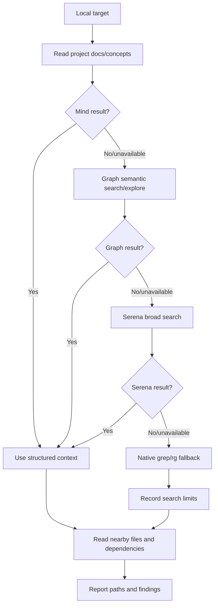

Tool priority is the policy of finding structured context before exact-string search. Native search is still useful when verifying a specific symbol/string or when the MCP layers return no results.

## 17. External research decision tree

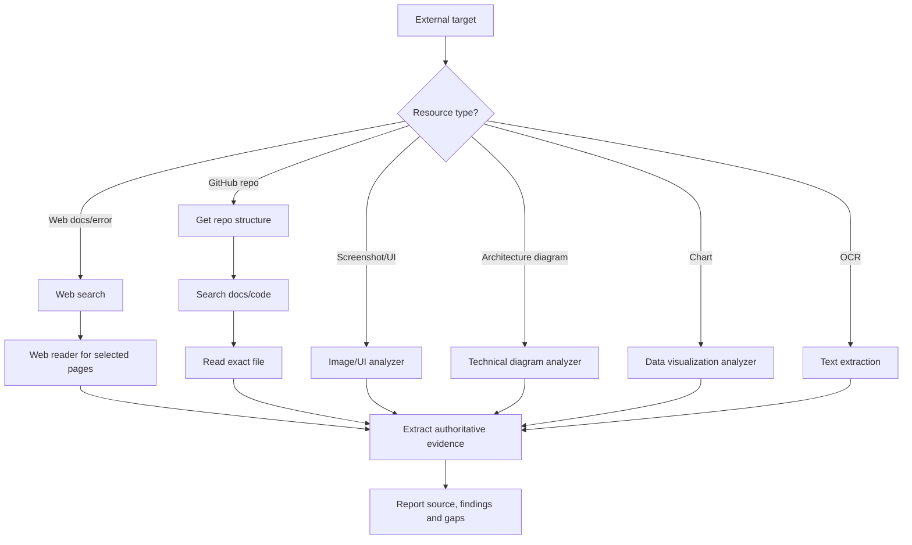

## 18. Failure modes

| Symptom | Action |
|---|---|
| Web search returns no results | Refine the query, try a recency filter |
| Web reader timeout | Use a shorter URL or a search snippet as a noted fallback |
| GitHub repo not found | Verify `owner/repo`, check access |
| Image format unsupported | Convert to PNG/JPG/WebP, check size |
| MCP tool unavailable | Fallback within the same category, no endless retries |
| 2+ agents fail with the same tool | Record `tool degraded` |
| Agent timeout | Skip, record the gap, do not assume results |
| Conflicting findings | Keep provenance, mark unresolved, or verify further |
| Too many files | Tighten the directory/symbol scope, split into batches |
| Search returns too little | Expand the query in a controlled way, do not open the whole repo at once |

## 19. Limitations and safety principles

### 19.1 Explorer must not modify source on its own

Internal agents are read-only. If the user wants a fix, the explorer output is handed off to an appropriate skill such as `hi-fix` or `hi-craft`.

### 19.2 Do not send secrets to external tools

Before sending a URL/query/image to MCP:

- redact tokens, API keys, and passwords;
- remove unnecessary user data;
- do not upload screenshots containing credentials;
- limit the source to the part that needs research.

### 19.3 External sources are not always correct for the local version

The latest docs may not match the installed version. The report must record:

- package/library version;
- the docs version read, if any;
- local config;
- divergence or assumptions.

### 19.4 Parallelism is not automatically faster

Parallelism has overhead: dividing scope, task tracking, spawning, collecting, and deduplicating. For a single file or a single docs page, one agent is usually better than five.

### 19.5 A timeout is information

A timeout indicates the investigation is incomplete on one branch. It is not evidence that the target does not exist.

## 20. Example: local end-to-end

Request:

```text
Find the entire refresh-token handling flow and where a fix is needed if a token is reused.
```

Invocation:

```text
/hi-codebase-research-explorer refresh token flow and reuse handling
```

### 20.1 Analyze

The target is local; the scope covers auth/session and tests. SCALE 3:

- agent A: session/auth implementation;
- agent B: tests and fixtures;
- agent C: config, middleware, and call sites.

### 20.2 Divide and spawn

Each agent has its own directory/target, a 3-minute timeout, and must not modify source.

### 20.3 Collect

The result might be:

```markdown
# explorer Report
## Relevant Files / Resources
- src/auth/refresh-token.ts - validates and rotates refresh tokens
- src/middleware/auth.ts - attaches session context
- tests/auth/refresh-token.test.ts - covers valid rotation but not replay
- config/auth.ts - token TTL and reuse policy

## Key Findings
- Rotation is owned by `refresh-token.ts`, not the middleware.
- Existing tests do not cover two requests using the same token concurrently.
- Reuse policy is configured but no storage-level uniqueness constraint was found.

## Unresolved Questions
- Is the token store shared across all production instances?
- Is replay expected to revoke the whole token family?
```

### 20.4 Handoff

`hi-fix` can use this report to diagnose root cause; `hi-plan` can create phases for the storage constraint, rotation logic, and concurrency tests.

## 21. Example: external/hybrid end-to-end

Request:

```text
Check whether the local client retries the API correctly according to the current provider guidance.
```

### 21.1 Divide agents

- Agent A: local API client, retry helper, tests.
- Agent B: provider docs on retries, idempotency, and status codes.
- Agent C: upstream/provider GitHub examples if needed.

### 21.2 Collect properly

Do not conclude "the client is wrong" just because the docs describe retries differently. You need to map:

- local package/provider version;
- local retry config;
- whether methods are idempotent;
- actual status codes;
- tests and observed logs.

### 21.3 Report

```markdown
## Relevant Files / Resources
- src/http/retry-client.ts - local retry policy
- tests/http/retry-client.test.ts - retry assertions
- https://provider.example/docs/retries - provider guidance for current API
- github.com/provider/sdk/src/retry.ts - upstream reference implementation

## Key Findings
- Local client retries POST without an idempotency key.
- Provider guidance allows retry only for idempotent requests or keyed writes.
- Local dependency version differs from the upstream example version.

## Unresolved Questions
- Does every POST caller provide an idempotency key in production?
```

## 22. Output quality rubric

### Good

- clear scope;
- specific sources/paths;
- findings backed by evidence;
- duplicates merged;
- gaps and timeouts stated;
- downstream skills can start their next step.

### Weak

- only lists files with no descriptions;
- the report mixes local and external;
- turns guesses into facts;
- does not record tool timeouts;
- spawned agents overlap;
- does not state version/source;
- returns code fixes even though the user only asked to explore.

## 23. Relationship with other skills

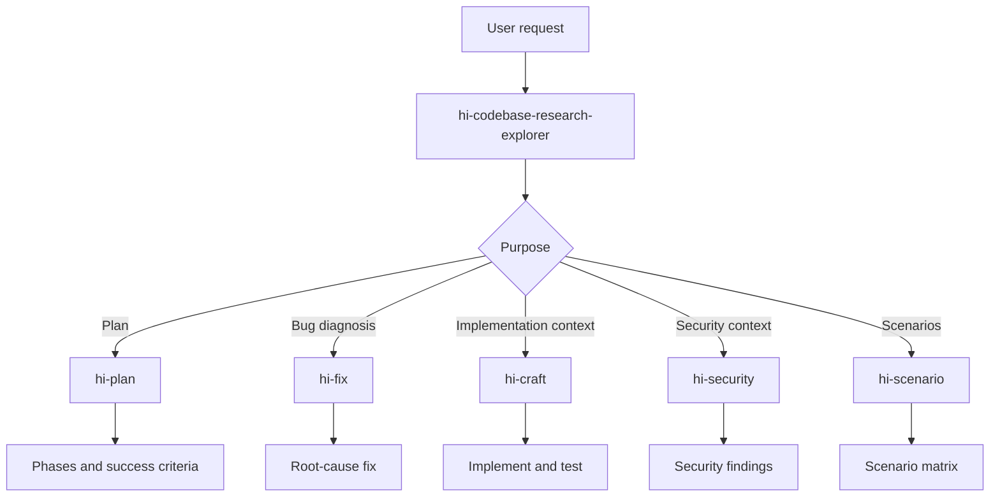

| Skill | What the explorer provides |
|---|---|
| `hi-plan` | Existing code, architecture context, alternatives, dependencies |
| `hi-fix` | Affected files, direct dependencies, call sites, tests, recent history |
| `hi-craft` | Context to create or execute a plan |
| `hi-security` | Code locations and data flows to audit |
| `hi-scenario` | Behavior surface, edge cases, and integration points |
| `hi-repository-search` | Can be the structured backend for deeper graph/code search |

## 24. Quick summary


The shortest sentence to remember:

> `hi-codebase-research-explorer` does not try to answer everything with a single search; it organizes the search for evidence from the right source, within the right scope, using the right tools, and hands off verifiable results to the next step.
