# Hi Craft Skill: Complete Guide

> `hi-craft` is the skill that executes end-to-end software changes. It takes a request or an existing plan, implements the code, runs tests, handles errors and completes the handoff. It is not just a "write code" command.

## 1. What problem does Hi Craft solve?

A complete software change does not end at producing source code. It must simultaneously ensure:

- the requirement is understood and has a clear scope;
- the implementation follows the plan or current patterns;
- the task is tracked with the correct status;
- tests are run and results are checked;
- test failures are fixed within a bounded cycle;
- the change is reviewed when the risk requires it;
- the artifacts and change history are completed.

`hi-craft` acts as the orchestration layer for this chain:

```text
[Plan] -> [Implement] -> [Test] -> [Finalize]
```

It connects to other skills when needed:

- `hi-plan`: create a plan if the request has no plan;
- `hi-sequential-thinking`: analyze short tasks before planning;
- `hi-docs-seeker`: look up documentation when needed;
- `hi-fix`: deep debugging after multiple test failures;
- `hi-log`: write a log at the end of the workflow.

## 2. Overall mental model

`hi-craft` has three major responsibilities:

1. **Readiness**: ensure there is a plan or create one before coding.
2. **Execution**: carry out the phases/tasks, update status and keep changes within scope.
3. **Evidence**: run tests, review if needed, then produce a handoff trail.

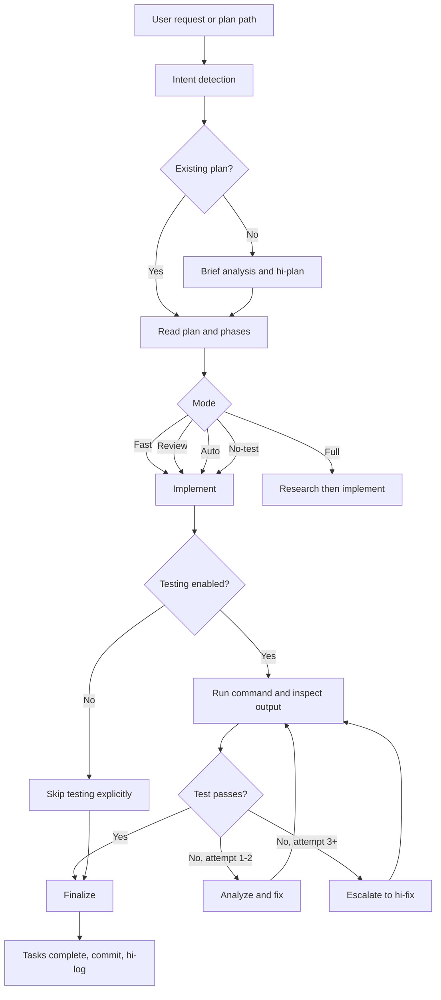

### 2.1 Detailed sequence down to skill and execution boundary

The diagram below expands the full orchestration of `hi-craft`. The Plan step is kept as a black box: `hi-craft` only calls `hi-plan --fast` and receives back the plan path/phases, without expanding the internal workflow of `hi-plan`.

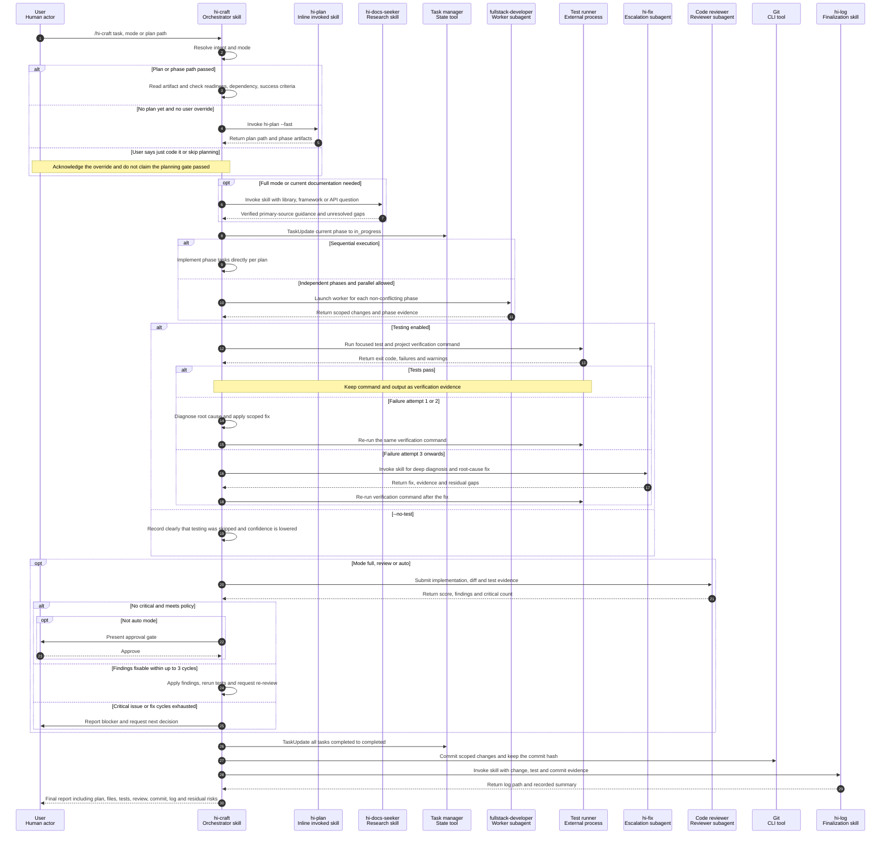

#### 2.1.1 Actor types

In the sequence diagram, the first line is the actor identity and the second line is the actor type/title. `Skill` describes a behavior loaded into an agent; `SubAgent` is a separate agent runtime that is spawned or launched to carry out an independent scope.

| Actor | Type / title | Runtime behavior | SubAgent? |
|---|---|---|---:|
| User | Human actor | Sends requests, approvals and blocking decisions | No |
| `hi-craft` | **Orchestrator skill** | Runs in the current/root agent, holds workflow state and coordinates the steps | No |
| `hi-plan` | Inline invoked skill | Invoked inline by `hi-craft` to create a plan; the contract forbids spawning a separate planner | No |
| `hi-docs-seeker` | Research skill | Invoked by the current agent when current documentation is needed | No |
| Task manager | State-management tool | Holds task state per session via `TaskUpdate` | No |
| `fullstack-developer` | Worker subagent | Launched per phase when parallel execution is safe | **Yes** |
| Test runner | External process | Runs test, lint, typecheck or build commands and returns exit/output | No |
| `hi-fix` | Escalation subagent | After the third failure, craft spawns an agent running the `hi-fix` skill for deep diagnosis | **Yes** |
| Code reviewer | Reviewer subagent | Reviews independently, returns score, findings and critical count | **Yes** |
| Git | CLI tool | Creates a commit and returns the commit identity | No |
| `hi-log` | Finalization skill | Writes change/test/commit evidence into a log | No |

An actor bearing a skill name does not imply a SubAgent. Only steps that use `spawn` or `launch` semantics create a separate agent runtime; `invoke`, `use` or `call inline` calls run as capabilities of the current agent, unless the orchestration contract says otherwise.

The boundaries that must be understood correctly:

- `hi-plan` is a single skill call in this sequence. Scope challenge, research, red-team or validation details of the plan are not repeated here.
- `hi-docs-seeker` only runs when current documentation or full-mode research is needed, not on every craft call.
- Test failures on attempts 1-2 are diagnosed and fixed by `hi-craft` itself. From the third attempt onward the work moves to `hi-fix`, after which the verification command must still be re-run.
- The code reviewer is the reviewer agent of the review gate, not a separately named skill in the current contract.
- Parallel execution is only valid when phase dependency, file ownership and shared contracts do not conflict.

Reference source: [`hi-craft/SKILL.md`](../../hi-craft/SKILL.md).

#### 2.1.2 Context retrieval before implementation

The core contract of `hi-craft` does not itself declare `mind_mcp`, `graph_mcp` or Serena. However, in this repository, [`AGENTS.md`](../../AGENTS.md) requires every task to gather project context in priority order before executing. Therefore `hi-craft` must run the retrieval chain once plan/readiness context exists and before modifying code. The chain stops as soon as one layer has provided enough evidence.

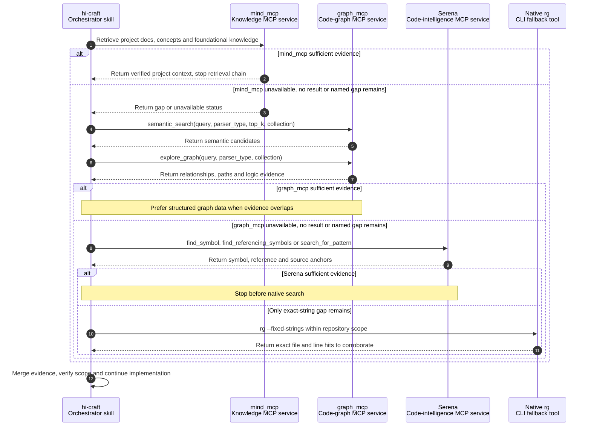

The applicable rules:

- This is a **project-level requirement** from `AGENTS.md`, not a portable behavior of every `hi-craft` installation.
- `mind_mcp` is used for project knowledge and docs; `graph_mcp` is used for semantic code relationships and logic; Serena confirms symbol/reference/source; `rg` is only the final exact-string fallback.
- `semantic_search` only produces candidates. Claims about call paths or dependencies need `explore_graph` or direct-source corroboration.
- Do not routinely call all four layers. Only descend to the next layer when the current one is unavailable, returns no result, or a named evidence gap remains.
- A user override of the planning gate does not automatically skip context retrieval and evidence verification.

Reference sources: [`AGENTS.md`](../../AGENTS.md) and [`hi-craft/SKILL.md`](../../hi-craft/SKILL.md).

## 3. Hard gate: plan before code

The most important rule of the skill:

> Do not write code when no plan exists and has been reviewed.

This hard gate protects the workflow from jumping straight into implementation without knowing:

- the real objective;
- the files or modules to change;
- the dependencies between parts;
- the success criteria;
- how to test;
- the risks and trade-offs.

There is one explicitly recorded exception: if the user actively asks to "just code it" or "skip planning", the user override overrides the hard gate. However, when the override is used, the executor should record this as a risky change and must not claim on its own that the workflow passed planning review.

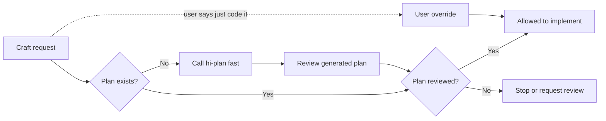

## 4. Syntax and intent detection

### 4.1 Invocation forms

```text
/hi-craft <task>
/hi-craft <task> --full
/hi-craft <task> --review
/hi-craft <task> --auto
/hi-craft <task> --no-test
/hi-craft path/to/plan.md
/hi-craft path/to/phase-01-name.md
```

### 4.2 How to detect intent

| Input | Mode | Behavior |
|---|---|---|
| No flag | `fast` | Skip research/review, still run tests |
| `--full` or the word "full" | `full` | Research and review are mandatory |
| `--review` | `review` | Skip research, review is mandatory |
| `--auto`, "trust me", "yolo" | `auto` | Auto-approve review |
| `--no-test` | `no-test` | Skip testing |
| Path to `plan.md` or `phase-*.md` | `code` | Execute an existing plan |

A request can both name a task and carry a flag. The skill must resolve the intent before doing the code work in order to know whether to create a plan, read a plan or directly run a phase.

## 5. Mode matrix

| Mode | Research | Review | Testing | When to use |
|---|---|---|---:|---:|---|
| `fast` | Skip | Skip | Run | Clear, small changes or when speed is needed |
| `full` | Yes | MUST | Run | Large feature or when full process is needed |
| `review` | Skip | MUST | Run | Context already exists, but a code review gate is needed |
| `auto` | Skip | Auto-pass | Run | User accepts auto-approve within a suitable scope |
| `no-test` | Per mode | Per mode | Skip | Only when tests are unavailable or the user requests it |

### 5.1 Fast mode

Fast is the default. The skill:

1. checks for a plan;
2. if no plan exists, invokes `hi-plan --fast` inline;
3. implements directly;
4. runs the test command;
5. finalizes.

Fast has no separate research and does not invoke a code reviewer. This reduces time, but it should not be used for changes with high security, architecture or production risk unless external review exists.

### 5.2 Full mode

Full adds research and makes review mandatory. The general flow:

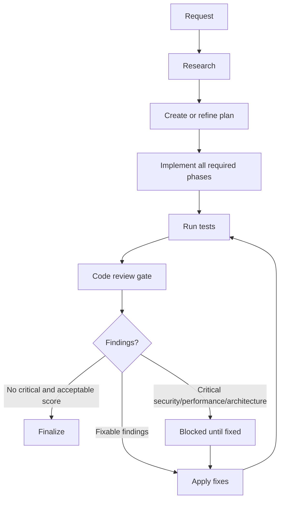

Full is suitable when the change touches many modules, API contracts, data models, authentication, payments, migrations or important user workflows.

### 5.3 Review mode

`--review` skips research but makes the final review mandatory. Use it when:

- the plan and context already exist;
- the implementation is relatively clear;
- an independent reviewer is needed to check the code;
- you want to keep research cost low without dropping the quality gate.

Review mode does not mean "review the plan". This is a code review after implementation.

### 5.4 Auto mode

`--auto` or phrases like "trust me", "yolo" allow auto-approving the review. This mode still runs tests but reduces the user-confirmation step for review findings.

Auto mode is only suitable when:

- the scope is small;
- the requester understands the change well;
- there is no critical security, performance or architecture risk;
- the test results are strong enough for the change.

Auto-approval does not turn a critical finding into a safe one. The skill rule still states that critical issues always block when the review finds a Security, Performance or Architecture violation.

### 5.5 No-test mode

`--no-test` skips the entire testing step. This is a high-risk mode and must be used deliberately.

Acceptable reasons:

- documentation-only changes;
- the repository has no available test command;
- the user needs a scaffold created first;
- tests depend on an external service that is not ready.

When using `--no-test`, the output should state clearly that testing was skipped. Do not report "tests passed" when tests did not run.

### 5.6 Code mode: passing a path to a plan

When a path to `plan.md` or `phase-*.md` is passed, the skill understands that the user wants to execute an existing artifact rather than create a new plan.

```text
/hi-craft plans/260814-audit-log/plan.md
```

In code mode:

- read the plan and the related phases;
- determine the tasks/phases to perform;
- keep the implementation aligned with the success criteria;
- do not expand scope on your own without updating the plan;
- run tests according to the current mode.

Passing a `phase-*.md` is useful when you want to do one specific phase, but you must check `blockedBy` before starting.

## 6. Step-by-step workflow

### 6.1 Step 1: Plan

#### 6.1.1 When there is no plan

The skill uses `hi-sequential-thinking` for a short analysis of the task, then invokes `hi-plan --fast` inline if needed. It does not spawn a separate planner for this step.

If documentation of a library, framework, SDK or API is needed, use `hi-docs-seeker` before deciding the implementation.

Expected outcome:

- a plan directory;
- `plan.md`;
- `phase-*.md` files if the scope needs multiple phases;
- success criteria and a test approach;
- dependencies/risks at a level sufficient to begin.

#### 6.1.2 When a plan already exists

The skill reads the plan before touching code. It needs to determine:

- whether the plan status is still active;
- which phase is being executed;
- the related files/modules;
- whether a phase has an unfinished dependency;
- whether existing tasks correspond to the phase;
- which review/validation decision has been recorded;
- what the test command or success criteria are.

#### 6.1.3 Readiness checklist

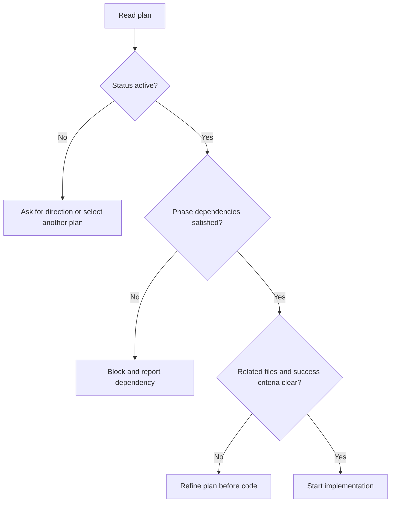

### 6.2 Step 2: Implement

#### 6.2.1 Executing tasks

The skill carries out the implementation steps in the phase and updates task state:

- task in progress: `in_progress`;
- task complete: `completed`;
- task blocked: keep an appropriate status and record the blocker;
- task no longer needed: update the plan instead of silently dropping it.

If there are multiple phases and the environment supports parallel mode, a `fullstack-developer` may be launched per phase. But parallel is only safe when phases do not conflict on files/data contracts or when the dependencies are proven.

#### 6.2.2 Implementation principles

Implementation must:

- follow the success criteria;
- prefer existing patterns in the repository;
- keep the public API stable if the plan does not require a breaking change;
- not fix unrelated bugs;
- not add abstractions unless they remove real complexity;
- update docs when the contract or usage changes;
- record scope changes if a new requirement is discovered.

#### 6.2.3 When the plan is insufficient

Do not guess when the plan is missing important information. There are three valid directions:

1. read nearby code/call sites to resolve ambiguity;
2. update the plan/phase with a new decision when there is enough evidence;
3. ask the user when this is a product decision, a security decision, or a trade-off that cannot be inferred from the code.

A good implementation does not just "make it run"; it preserves traceability from request → plan → code → test.

#### 6.2.4 Points to watch while coding

- input validation and error handling;
- authorization and data exposure;
- transaction boundaries;
- timeout, retry and idempotency;
- backward compatibility;
- migration/rollback;
- concurrency and race conditions;
- performance at the expected scale;
- logging, metrics and correlation ID;
- tests for both the happy path and the failure path.

### 6.3 Step 3: Test

#### 6.3.1 Default testing

Except for `--no-test`, the skill must run the test command and inspect the output. Testing is not just "calling a command"; you need to look at the exit code, meaningful failures and warnings, and the coverage of the changed behavior.

The verification layers can include:

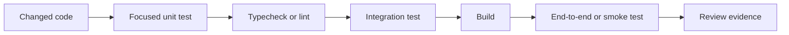

Not every repository has all of the above layers. The skill must use the commands available in the project and state clearly which layers ran, which are unavailable or were skipped.

#### 6.3.2 Test failure handling cycle

The handling rules are defined as follows:

- **Attempts 1-2**: analyze and fix the error yourself;
- **Attempt 3 onward**: spawn `hi-fix` for deep debugging;
- do not spawn a separate tester;
- after every fix you must re-run the verification command.

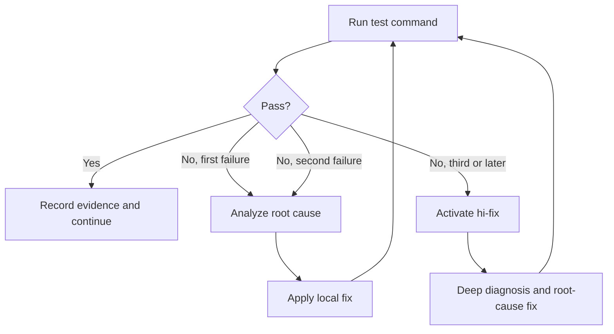

#### 6.3.3 Distinguishing test failures

When a test fails, classify it before fixing:

| Error type | How to handle |
|---|---|
| Regression from new code | Fix the implementation or the test according to correct behavior |
| Test has wrong expectation | Verify the contract, then update the test if needed |
| Unrelated existing failure | Do not spread the fix into another scope; record it clearly |
| Environment/dependency failure | Fix the setup if it belongs to the task, otherwise record a blocker |
| Flaky/race failure | Reproduce, find the timing/resource cause, do not just blindly retry |
| Build/type/lint error | Fix immediately if it results from the change |

#### 6.3.4 Success criteria

A passing test may not be enough. You need to cross-check against the phase success criteria:

- the main behavior is correct;
- important edge cases have coverage;
- error behavior is correct;
- API/schema backward compatibility is confirmed;
- migrations have a rollback/roll-forward strategy;
- security controls are verified;
- docs or configuration have been updated.

### 6.4 Step 4: Review

Review is optional in fast mode, but mandatory in `full` and `review` modes. `auto` may auto-approve according to the mode policy.

The reviewer checks at minimum:

- correctness and behavioral regression;
- security;
- performance;
- architecture and maintainability;
- test adequacy;
- scope creep;
- error handling and observability.

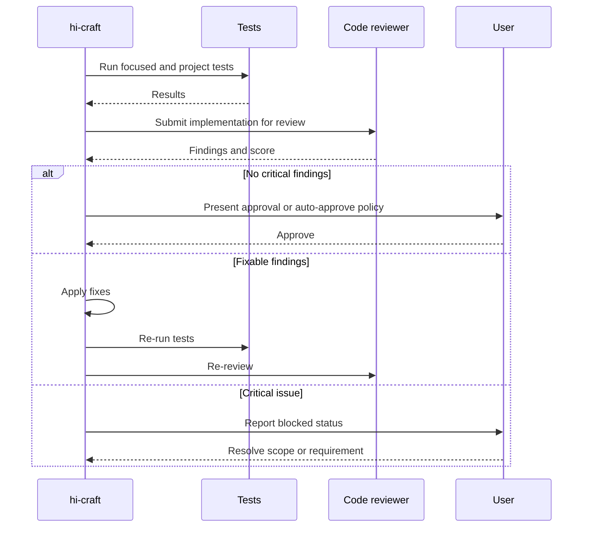

#### 6.4.1 Review score and fix cycles

The current rules:

- a score of `9.5` or higher with no critical issue may be auto-approved in auto mode;
- a maximum of 3 fix cycles;
- critical issues always block, especially Security, Performance and Architecture violations.

If the target is still not reached after 3 cycles, do not keep patching blindly. Stop, aggregate the findings and return to diagnosis/planning.

### 6.5 Step 5: Finalize

Finalization consists of three main things:

1. mark all tasks complete;
2. `git commit` the changes;
3. run `/hi-log` to write a log.

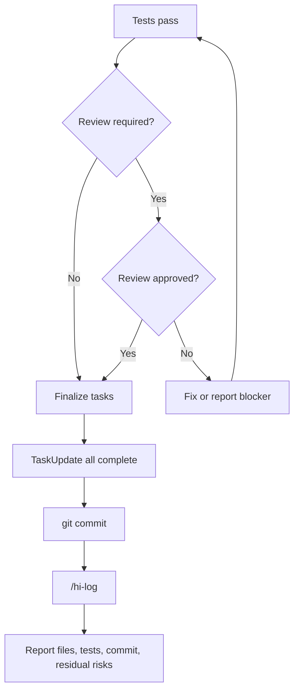

#### 6.5.1 Commit

Commit is part of the finalize flow according to `SKILL.md`, but it must still respect the project's permissions and conventions. The commit message should reflect the actual change, not be generic.

Before committing, check:

- only related files are included;
- no unintended secrets or generated artifacts;
- test output has passed;
- plan/phase status has been updated;
- the diff does not contain unrelated changes.

#### 6.5.2 Log

`/hi-log` creates a log for the session/change. The log should let others know:

- which task was done;
- which files or modules changed;
- the test command and its results;
- notable decisions;
- known limitations or follow-ups;
- the related commit/reference.

## 7. Handoff from hi-plan to hi-craft

`hi-plan` creates persistent artifacts; `hi-craft` uses those artifacts to execute.

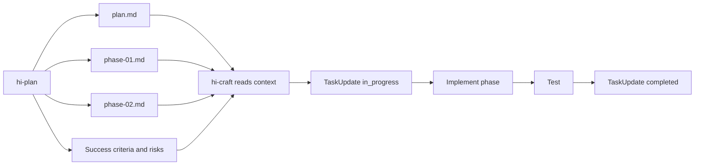

### 7.1 Handoff checklist

Before calling `hi-craft path/to/plan.md`, check:

- the plan has an active/pending status;
- the phases link correctly;
- phase dependencies are complete or handled;
- the related code paths exist;
- the implementation steps are specific enough;
- the success criteria are measurable;
- the test command or verification method is clear;
- accepted red-team findings and validation decisions have propagated.

### 7.2 Same-session and cross-session handoff

- **Same session**: the task list may still exist; `hi-craft` continues from the current task state.
- **Different session**: the task list may be empty; you need to read the plan/phase and re-hydrate from the checklist or task metadata.

The plan file is the persistent source of truth; the task manager is only a temporary execution view.

## 8. How to verify hi-craft?

### 8.1 Readiness verify

Before coding:

- does a plan exist;
- has the plan been reviewed;
- is the scope clear;
- does any phase dependency have a blocker;
- do the success criteria and test strategy exist.

### 8.2 Implementation verify

While coding:

- did each task move to `in_progress` before being worked on;
- do the changes stay within the phase's related code;
- is there no silent scope expansion;
- are the public contract and backward compatibility preserved;
- are errors, security and observability handled.

### 8.3 Test verify

After coding:

- did the command actually run;
- did the exit code succeed;
- does the output contain significant failures/warnings;
- do the focused tests cover the new behavior;
- did typecheck/lint/build pass;
- was the failure fixed at its root cause, or only retried.

### 8.4 Review verify

If the mode requires review:

- did the reviewer run;
- does the score meet the policy;
- is the critical count zero;
- are the fix cycles within the limit;
- were the findings handled or recorded.

### 8.5 Finalize verify

Before reporting completion:

- tasks are completed;
- the commit was created successfully;
- the log was written;
- the output report contains test evidence;
- residual risks and skipped checks are stated;
- the working tree has no unintended changes.

## 9. Output of hi-craft

A good output should state:

- which mode ran;
- where the used or created plan is;
- which phases/tasks were completed;
- which main files/modules changed;
- which test commands ran and their results;
- whether review ran, and the main score/findings;
- the commit hash or commit status;
- the log path if any;
- skipped checks, blockers or residual risks.

Example report structure:

```text
Mode: full
Plan: plans/260814-audit-log/plan.md
Completed phases: 1, 2, 3
Changed: auth service, audit event schema, integration tests
Tests: npm test - passed
Review: approved, no critical findings
Commit: abc1234
Log: docs/logs/...
Residual risks: external event delivery still requires staging verification
```

Do not report:

- "done" when tests were skipped without stating it clearly;
- "review passed" when review did not run;
- "all tasks completed" when a task is still blocked;
- "production ready" when only unit tests ran.

## 10. Failure handling and escalation

### 10.1 Plan failure

If there is no plan or the plan is not clear enough:

- call `hi-plan --fast` when possible;
- add phases/success criteria;
- ask the user if a product/security decision is missing;
- do not start coding from unsupported assumptions.

### 10.2 Test failure

According to the policy:

```text
Failure 1 -> self diagnosis and fix
Failure 2 -> self diagnosis and fix
Failure 3+ -> hi-fix
```

`hi-fix` is used when the error needs root-cause analysis, call-stack tracing, log analysis, multi-layer validation or environment diagnosis.

### 10.3 Review failure

A review failure does not mean fixing every finding regardless of scope. You need to:

1. classify critical/high/medium;
2. fix critical findings first;
3. decide whether a finding belongs to the task;
4. update the plan if a new requirement/architecture is discovered;
5. re-run tests after the fix;
6. re-review within the 3-cycle limit.

### 10.4 When testing is impossible

If the test command cannot run due to the environment:

- distinguish a code error from a setup error;
- try an appropriate substitute verification, such as typecheck or a focused command;
- record clearly which command failed and why;
- do not silently lower confidence;
- do not claim tests pass.

## 11. When to use which mode?

| Situation | Recommendation |
|---|---|
| Small fix, clear pattern, fast test | Default / `fast` |
| Multi-module feature or needs research | `--full` |
| Plan/context already exists, mandatory code review | `--review` |
| User accepts auto-approve for small changes | `--auto` |
| Only scaffolding/docs, or tests unavailable | `--no-test` |
| A specific plan to implement | Pass a `plan.md` path |
| Many independent phases and tool support for parallel | Parallel execution within phases, after checking dependencies |

## 12. `--parallel` in the interface versus reality

`hi-craft/SKILL.md` clearly defines the `fast`, `full`, `review`, `auto` and `no-test` modes. However, `hi-craft/agents/openai.yaml` describes a default prompt that supports `--parallel`.

The safe interpretation:

- `--parallel` is declared in the interface prompt;
- the main workflow in `SKILL.md` does not yet have a separate mode matrix for parallel;
- parallel execution is described in Step 2 as launching a `fullstack-developer` per phase;
- parallel should only be used when phase dependency, file ownership and shared contracts are clear;
- if formal behavior is needed, `SKILL.md` should be updated to define a mode, matrix, conflict handling and finalize policy consistent with the interface.

This is a documentation drift point that should be known before operating. Do not assume the interface prompt alone fully defines the semantics of a mode.

## 13. End-to-end example

Suppose the request is: "Add rate limiting for the login API".

### 13.1 Invoke the skill

```text
/hi-craft add rate limiting for the login API --full
```

### 13.2 Plan gate

The skill checks for a plan. If none exists:

```text
/hi-plan add rate limiting for the login API --fast
```

The plan should determine:

- which middleware or gateway owns the rate limit;
- the key by IP, account or device;
- the response/status code when limited;
- the distributed counter and consistency;
- the bypass policy for internal traffic;
- tests for burst, reset window and concurrency.

### 13.3 Implementation

The developer carries out the recorded phases, for example:

1. configuration and default limits;
2. limiter middleware;
3. storage/counter integration;
4. metrics and error response;
5. unit/integration tests.

### 13.4 Test

Run focused tests first, then the project test suite. If a test fails on the first or second attempt, analyze and fix it yourself. If it fails from the third attempt, hand over to `hi-fix`.

### 13.5 Review

Full mode requires reviewing the following questions:

- can it be bypassed with a spoofed header;
- does it expose account enumeration;
- do distributed nodes use a consistent counter;
- do retries amplify traffic;
- does the default limit break legitimate clients;
- do the metrics contain credentials or PII.

### 13.6 Finalize

Only finalize after:

- tests pass;
- review has no remaining critical findings;
- task states are completed;
- the commit and log are created;
- residual risk such as production limit tuning is recorded.

## 14. Relationship with other skills

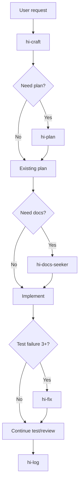

| Skill | Role in relation to hi-craft |
|---|---|
| `hi-plan` | Creates the implementation plan and phases |
| `hi-sequential-thinking` | Analyzes short tasks before planning |
| `hi-docs-seeker` | Finds current docs for a library/API |
| `hi-fix` | Deep debugging after multiple test failures |
| `hi-log` | Writes a log after finalize |
| `hi-predict` | Can be used before large changes to forecast risk |
| `hi-scenario` | Can be used to expand edge-case/test scenarios |
| `hi-security` | Can be used for in-depth security audits |

## 15. Limitations to understand correctly

### 15.1 Hi-craft does not replace developer judgment

The skill coordinates the workflow, but it cannot know product decisions or acceptable risk on its own if the repository does not reflect them. Blocking points must be asked about or recorded clearly.

### 15.2 Passing tests do not prove production readiness

Tests can miss:

- load/performance behavior;
- external service failures;
- deployment/configuration drift;
- migration rollback;
- permission combinations without fixtures;
- real user workflows.

### 15.3 Auto mode does not remove critical risk

Auto-approval is only a policy about the approval flow. It should not be used to skip security, performance or architecture violations.

### 15.4 Commit does not equal business completion

A commit only confirms the change was recorded in Git. You must still state residual risks, deployment steps, migration steps or staging verification that has not run.

### 15.5 No-test should be treated as an exception

If `--no-test` is used, confidence decreases. The output must clearly state why tests were skipped and which verification is needed at a later step.

## 16. Quick summary

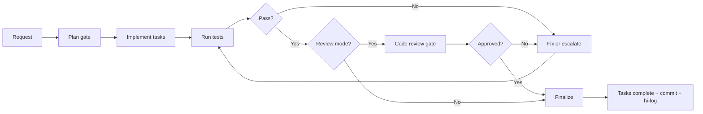

The shortest way to remember it:

> `hi-craft` does not just write code; it ensures the change passes through plan gate, execution, test evidence, appropriate review and traceable finalize.