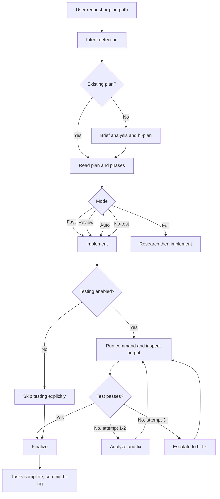
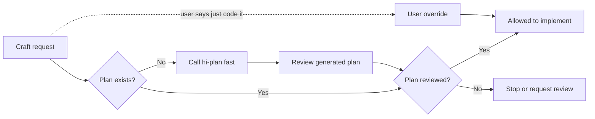
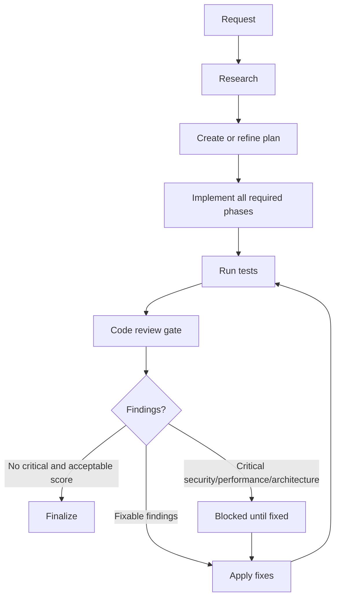
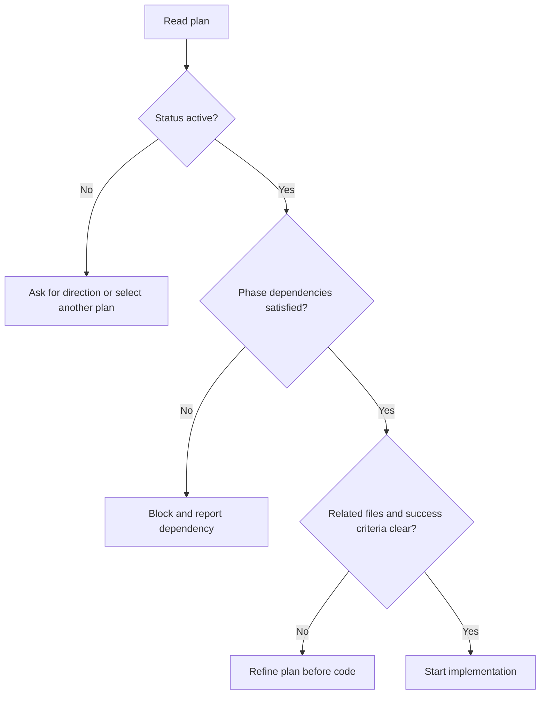
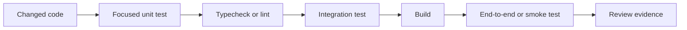
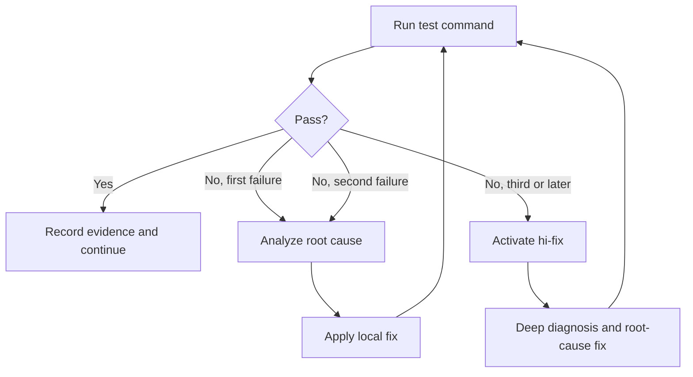
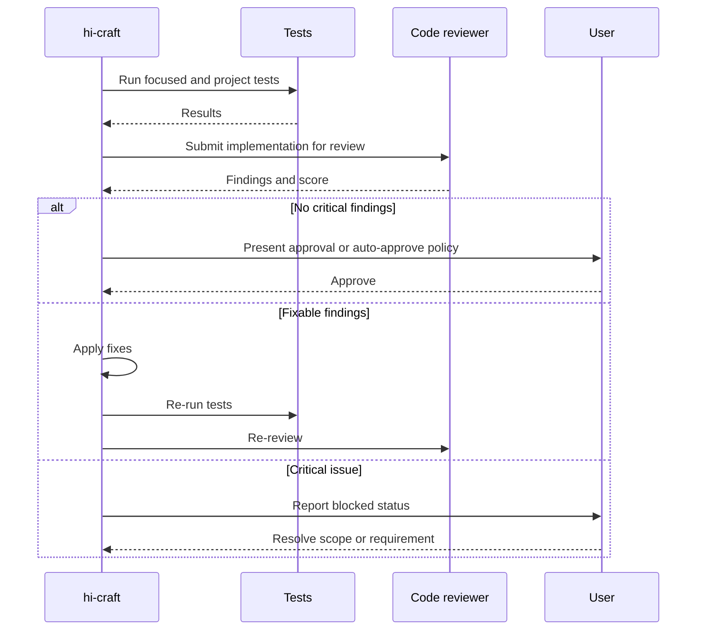
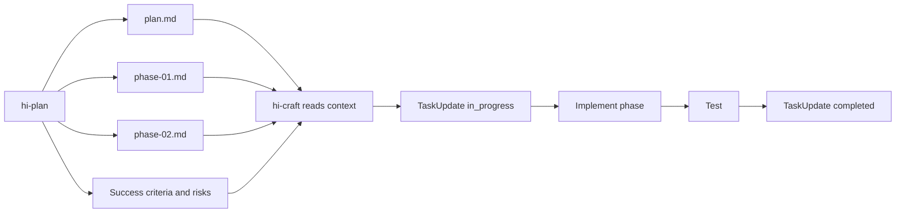
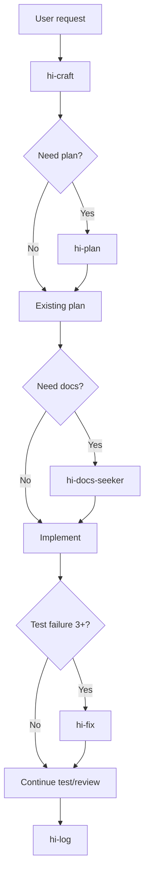
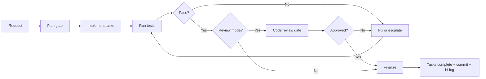

# Hi Craft Skill: Complete Guide

> `hi-craft` is the skill that executes software changes end-to-end. It takes a request or an existing plan, implements code, runs tests, handles failures, and completes the handoff. This is not merely a "write code" command.

## 1. What problem does Hi Craft solve?

A complete software change does not end with producing source code. It must also ensure, at the same time, that:

- the requirement is understood and has a clear scope;
- the implementation follows the plan or existing patterns;
- tasks are tracked with the correct status;
- tests are run and results are checked;
- test failures are fixed within a bounded cycle;
- the change is reviewed when risk requires it;
- artifacts and the change history are finalized.

`hi-craft` acts as the orchestration layer for this sequence:

```text
[Plan] -> [Implement] -> [Test] -> [Finalize]
```

It connects to other skills when needed:

- `hi-plan`: creates a plan if the request does not have one;
- `hi-sequential-thinking`: analyzes short tasks before planning;
- `hi-docs-seeker`: looks up documentation when needed;
- `hi-fix`: performs deep debugging after multiple test failures;
- `hi-log`: records the workflow log at the end.

## 2. Overall mental model

`hi-craft` has three major responsibilities:

1. **Readiness**: ensure a plan exists or create one before coding.
2. **Execution**: carry out the phases/tasks, update status, and keep changes within scope.
3. **Evidence**: run tests, review if needed, then produce a traceable handoff.



## 3. Hard gate: plan before code

The most important rule of the skill:

> You must not write code when no plan exists and has been reviewed.

This hard gate protects the workflow from jumping straight into implementation before knowing:

- the real objective;
- the files or modules to change;
- the dependencies between parts;
- the success criteria;
- how to test;
- the risks and trade-offs.

There is one documented exception: if the user explicitly asks to "just code it" or "skip planning", the user overrides the hard gate. However, when an override is used, the executor should acknowledge this as a risky change and must not claim on its own that the workflow passed planning review.



## 4. Syntax and intent detection

### 4.1 Invocation forms

```text
/hi-craft <task>
/hi-craft <task> --full
/hi-craft <task> --review
/hi-craft <task> --auto
/hi-craft <task> --no-test
/hi-craft path/to/plan.md
/hi-craft path/to/phase-01-name.md
```

### 4.2 How intent is detected

| Input | Mode | Behavior |
|---|---|---|
| No flag | `fast` | Skips research/review, still runs tests |
| `--full` or the word "full" | `full` | Research and review are mandatory |
| `--review` | `review` | Skips research, review is mandatory |
| `--auto`, "trust me", "yolo" | `auto` | Auto-approve review |
| `--no-test` | `no-test` | Skips testing |
| Path to `plan.md` or `phase-*.md` | `code` | Executes an existing plan |

A request can specify both a task and a flag. The skill must resolve the intent before implementing code so it knows whether to create a plan, read a plan, or directly execute a phase.

## 5. Mode matrix

| Mode | Research | Review | Testing | When to use |
|---|---|---:|---:|---:|---|
| `fast` | Skip | Skip | Run | Clear, small changes or speed is needed |
| `full` | Yes | MUST | Run | Large feature or a full process is required |
| `review` | Skip | MUST | Run | Context already exists, but a code review gate is needed |
| `auto` | Skip | Auto-pass | Run | User accepts auto-approve within an appropriate scope |
| `no-test` | Per mode | Per mode | Skip | Only when testing is unavailable or the user requests it |

### 5.1 Fast mode

Fast is the default. The skill:

1. checks for a plan;
2. if no plan exists, calls `hi-plan --fast` inline;
3. implements directly;
4. runs the test command;
5. finalizes.

Fast has no dedicated research and does not call a code reviewer. This saves time, but it should not be used for changes with high security, architecture, or production risk if no external review exists.

### 5.2 Full mode

Full adds research and mandates review. Overall flow:



Full is appropriate when the change touches many modules, API contracts, data models, authentication, payment, migration, or important user workflows.

### 5.3 Review mode

`--review` skips research but the final review is mandatory. Use it when:

- the plan and context already exist;
- the implementation is relatively clear;
- an independent reviewer needs to check the code;
- you want to keep research overhead low without dropping the quality gate.

Review mode does not mean "review the plan". This is a code review after implementation.

### 5.4 Auto mode

`--auto` or phrases like "trust me", "yolo" allow auto-approving the review. This mode still runs tests, but reduces the step where the user confirms review findings.

Auto mode is only appropriate when:

- the scope is small;
- the requester understands the change well;
- there is no critical security, performance, or architecture risk;
- the test results are strong enough for that change.

Auto-approve does not turn a critical finding into a safe one. The skill rules still state that critical issues always block when the review detects Security, Performance, or Architecture violations.

### 5.5 No-test mode

`--no-test` skips the entire testing step. This is a high-risk mode and must be used deliberately.

Acceptable reasons:

- documentation-only changes;
- the repository has no usable test command;
- the user needs to create a scaffold first;
- tests depend on an external service that is not ready.

When using `--no-test`, the output should clearly state that testing was skipped. You must not report "tests passed" if tests were not run.

### 5.6 Code mode: passing a path to a plan

When a path to `plan.md` or `phase-*.md` is passed, the skill understands that the user wants to execute an existing artifact rather than create a new plan.

```text
/hi-craft plans/260814-audit-log/plan.md
```

In code mode:

- read the plan and its related phases;
- determine which tasks/phases need to be executed;
- keep the implementation aligned with the success criteria;
- do not expand scope on your own without updating the plan;
- run tests according to the current mode.

Passing `phase-*.md` is useful when you want to work on one specific phase, but you must check `blockedBy` before starting.

## 6. Step-by-step workflow

### 6.1 Step 1: Plan

#### 6.1.1 When no plan exists

The skill uses `hi-sequential-thinking` for a brief task analysis, then calls `hi-plan --fast` inline if needed. Do not spawn a separate planner for this step.

If documentation for a library, framework, SDK, or API is needed, use `hi-docs-seeker` before deciding on the implementation.

Expected outcomes:

- a plan directory;
- `plan.md`;
- `phase-*.md` files if the scope requires multiple phases;
- success criteria and a test approach;
- dependencies/risks at a level sufficient to start.

#### 6.1.2 When a plan already exists

The skill reads the plan before touching code. It needs to determine:

- whether the plan status is still active;
- which phase is currently being executed;
- the related files/modules;
- whether the phase has any unfinished dependencies;
- whether the existing tasks match the phase;
- which review/validation decisions have been recorded;
- what the test command or success criteria are.

#### 6.1.3 Readiness checklist



### 6.2 Step 2: Implement

#### 6.2.1 Executing tasks

The skill performs the implementation steps in the phase and updates task state:

- task being worked on: `in_progress`;
- task completed: `completed`;
- task blocked: keep an appropriate status and record the blocker;
- task no longer needed: update the plan instead of silently skipping it.

If there are multiple phases and the environment supports parallel mode, you can launch `fullstack-developer` per phase. But parallel execution is only safe when phases do not conflict on file/data contracts or when dependencies have been proven.

#### 6.2.2 Implementation principles

Implementation must:

- stay aligned with the success criteria;
- prefer patterns that already exist in the repository;
- keep the public API stable unless the plan requires a breaking change;
- not fix unrelated bugs;
- not add abstractions unless they remove real complexity;
- update docs when contracts or usage change;
- record scope changes if new requirements are discovered.

#### 6.2.3 When the plan is insufficient

Do not guess when the plan is missing important information. There are three valid directions:

1. read more of the closest code/call sites to resolve ambiguity;
2. update the plan/phase with the new decision if there is enough evidence;
3. ask the user when it is a product decision, security decision, or a trade-off that cannot be inferred from the code.

A good implementation does not merely "make it run"; it must preserve traceability from request → plan → code → test.

#### 6.2.4 Points to watch when coding

- input validation and error handling;
- authorization and data exposure;
- transaction boundaries;
- timeout, retry, and idempotency;
- backward compatibility;
- migration/rollback;
- concurrency and race conditions;
- performance at the expected scale;
- logging, metrics, and correlation IDs;
- tests for both the happy path and failure path.

### 6.3 Step 3: Test

#### 6.3.1 Default testing

Except for `--no-test`, the skill must run the test command and inspect the output. Testing is not just "calling the command"; you need to check the exit code, meaningful failures and warnings, and the coverage of the changed behavior.

The verification layers may include:



Not every repository has all the layers above. The skill should use the commands available in the project and clearly state which layers ran, which are unavailable, or which were skipped.

#### 6.3.2 Test failure handling cycle

The handling rules are defined as follows:

- **Attempts 1-2**: analyze and fix the failure yourself;
- **Attempt 3 and beyond**: spawn `hi-fix` for deep debugging;
- do not spawn a separate tester;
- after every fix, re-run the verification command.



#### 6.3.3 Distinguishing test failures

When a test fails, classify it before fixing:

| Failure type | How to handle |
|---|---|
| Regression caused by new code | Fix the implementation or the test according to the correct behavior |
| Test has wrong expectation | Verify the contract, then update the test if needed |
| Existing unrelated failure | Do not fix into other scopes; note it clearly |
| Environment/dependency failure | Fix the setup if it belongs to the task, otherwise record a blocker |
| Flaky/race failure | Reproduce, find the timing/resource cause, do not just blindly retry |
| Build/type/lint error | Fix immediately if it stems from the change |

#### 6.3.4 Success criteria

Tests passing is not necessarily enough. You need to check against the phase's success criteria:

- the main behavior is correct;
- important edge cases have coverage;
- error behavior is correct;
- API/schema backward compatibility is confirmed;
- migrations have a rollback/roll-forward strategy;
- security controls are verified;
- docs or configuration have been updated.

### 6.4 Step 4: Review

Review is optional in fast mode, but mandatory in `full` and `review` modes. `auto` may auto-approve according to the mode policy.

The reviewer checks at minimum:

- correctness and behavioral regression;
- security;
- performance;
- architecture and maintainability;
- test adequacy;
- scope creep;
- error handling and observability.



#### 6.4.1 Review score and fix cycles

Current rules:

- a score of `9.5` or higher with no new critical issues may be auto-approved in auto mode;
- a maximum of 3 fix cycles;
- critical issues always block, especially Security, Performance, and Architecture violations.

If the bar is still not reached after 3 cycles, do not keep blindly patching. Stop, consolidate the findings, and go back to diagnosis/planning.

### 6.5 Step 5: Finalize

Finalization consists of three main tasks:

1. mark all tasks as completed;
2. `git commit` the changes;
3. run `/hi-log` to record the log.

```mermaid
flowchart TD
    A[Tests pass] --> B{Review required?}
    B -->|No| C[Finalize tasks]
    B -->|Yes| D{Review approved?}
    D -->|No| E[Fix or report blocker]
    E --> A
    D -->|Yes| C
    C --> F[TaskUpdate all complete]
    F --> G[git commit]
    G --> H[/hi-log]
    H --> I[Report files, tests, commit, residual risks]
```

#### 6.5.1 Commit

Commit is part of the finalize flow per `SKILL.md`, but it must still respect the project's permissions and conventions. The commit message should reflect the actual change, not generic wording.

Before committing, check:

- only related files are included;
- no secrets or unintended generated artifacts;
- test output has passed;
- plan/phase status has been updated;
- the diff contains no unrelated changes.

#### 6.5.2 Log

`/hi-log` creates a log for the session/change. The log should let others know:

- which tasks were done;
- which files or modules changed;
- the test commands and their results;
- notable decisions;
- known limitations or follow-ups;
- related commits/references.

## 7. Handoff from hi-plan to hi-craft

`hi-plan` creates persistent artifacts; `hi-craft` uses those artifacts to execute.



### 7.1 Handoff checklist

Before calling `hi-craft path/to/plan.md`, check:

- the plan has active/pending status;
- the phases link correctly;
- phase dependencies are completed or handled;
- related code paths exist;
- the implementation steps are specific enough;
- success criteria are measurable;
- the test command or verification method is clear;
- accepted red-team findings and validation decisions have been propagated.

### 7.2 Same-session and cross-session handoff

- **Same session**: the task list may still exist, so `hi-craft` continues from the current task state.
- **Cross session**: the task list may be empty; read the plan/phases and re-hydrate from the checklist or task metadata.

The plan file is the persistent source of truth; the task manager is only a temporary execution view.

## 8. How is hi-craft verified?

### 8.1 Readiness verify

Before coding:

- does a plan exist;
- has the plan been reviewed;
- is the scope clear;
- do phase dependencies have blockers;
- do success criteria and a test strategy exist.

### 8.2 Implementation verify

During coding:

- does each task move to `in_progress` before being worked on;
- do the changes stay within the phase's related code;
- is there no silent scope expansion;
- are public contracts and backward compatibility preserved;
- are errors, security, and observability handled.

### 8.3 Test verify

After coding:

- was the command actually run;
- did the exit code succeed;
- does the output contain significant failures/warnings;
- do focused tests cover the new behavior;
- does typecheck/lint/build pass;
- was the failure root-caused and fixed, or only retried.

### 8.4 Review verify

If the mode requires review:

- was the reviewer actually run;
- does the score meet policy;
- are critical findings at zero;
- are fix cycles below the limit;
- have findings been resolved or recorded.

### 8.5 Finalize verify

Before reporting completion:

- tasks are completed;
- the commit was created successfully;
- the log was recorded;
- the output report includes test evidence;
- residual risks and skipped checks are stated;
- the working tree has no unintended changes.

## 9. Output of hi-craft

A good output should clearly state:

- which mode was run;
- where the plan used or created is located;
- which phases/tasks were completed;
- the main files/modules changed;
- the test commands run and their results;
- whether review ran, and the main score/findings;
- the commit hash or commit status;
- the log path if any;
- skipped checks, blockers, or residual risks.

Example report structure:

```text
Mode: full
Plan: plans/260814-audit-log/plan.md
Completed phases: 1, 2, 3
Changed: auth service, audit event schema, integration tests
Tests: npm test - passed
Review: approved, no critical findings
Commit: abc1234
Log: docs/logs/...
Residual risks: external event delivery still requires staging verification
```

You should not report:

- "done" when tests were skipped without saying so;
- "review passed" when the review never ran;
- "all tasks completed" when tasks are still blocked;
- "production ready" when only unit tests were run.

## 10. Failure handling and escalation

### 10.1 Plan failure

If there is no plan or the plan is not clear enough:

- call `hi-plan --fast` when possible;
- add missing phases/success criteria;
- ask the user when product/security decisions are missing;
- do not start coding based on assumptions with no evidence.

### 10.2 Test failure

Per policy:

```text
Failure 1 -> self diagnosis and fix
Failure 2 -> self diagnosis and fix
Failure 3+ -> hi-fix
```

`hi-fix` is used when the error requires root-cause analysis, call-stack tracing, log analysis, multi-layer validation, or environment diagnosis.

### 10.3 Review failure

A review failure does not mean fixing every finding regardless of scope. You need to:

1. classify critical/high/medium;
2. fix critical issues first;
3. determine whether the finding belongs to the task;
4. update the plan if new requirements/architecture are discovered;
5. re-run tests after the fix;
6. re-review within the limit of 3 cycles.

### 10.4 Testing is not possible

If the test command cannot run because of the environment:

- distinguish code errors from setup errors;
- try a suitable alternative verification, such as typecheck or a focused command;
- clearly record the failed command and the reason;
- do not silently lower confidence;
- do not claim tests passed.

## 11. When to use which mode?

| Situation | Recommendation |
|---|---|
| Small fix, clear pattern, fast tests | Default / `fast` |
| Feature spanning many modules or requiring research | `--full` |
| Plan/context exists, mandatory code review needed | `--review` |
| User accepts auto-approve for small changes | `--auto` |
| Only scaffolding/docs, or testing unavailable | `--no-test` |
| A concrete plan needs to be executed | Pass the `plan.md` path |
| Many independent phases and tooling supports parallel | Parallel execution within phases, after checking dependencies |

## 12. `--parallel` in the interface and in practice

`hi-craft/SKILL.md` clearly defines the modes `fast`, `full`, `review`, `auto`, and `no-test`. However, `hi-craft/agents/openai.yaml` has a default prompt description that supports `--parallel`.

The safe interpretation:

- `--parallel` is declared in the interface prompt;
- the main workflow in `SKILL.md` does not yet have a dedicated mode matrix for parallel;
- parallel execution is described in Step 2 as launching `fullstack-developer` per phase;
- parallel should only be used when phase dependencies, file ownership, and shared contracts are clear;
- if formal behavior is needed, `SKILL.md` should be updated to define the mode, matrix, conflict handling, and finalize policy consistently with the interface.

This is a documentation drift point you should be aware of before operating. Do not assume that the interface prompt automatically defines the full semantics of a mode.

## 13. End-to-end example

Suppose the request is: "Add rate limiting to the login API".

### 13.1 Invoke the skill

```text
/hi-craft add rate limiting for the login API --full
```

### 13.2 Plan gate

The skill checks for a plan. If none exists:

```text
/hi-plan add rate limiting for the login API --fast
```

The plan should define:

- which middleware or gateway owns the rate limit;
- the key by IP, account, or device;
- the response/status code when limited;
- the distributed counter and consistency;
- the bypass policy for internal traffic;
- tests for burst, window reset, and concurrency.

### 13.3 Implementation

The developer executes the recorded phases, for example:

1. configuration and default limits;
2. the limiter middleware;
3. storage/counter integration;
4. metrics and error response;
5. unit/integration tests.

### 13.4 Test

Run focused tests first, then the project test suite. If tests fail on the first or second attempt, analyze and fix them yourself. If they fail from the third attempt on, escalate to `hi-fix`.

### 13.5 Review

Full mode mandates reviewing these questions:

- can it be bypassed with a forged header;
- does it leak account enumeration;
- do distributed nodes use a consistent counter;
- does retry amplify traffic;
- do the default limits break legitimate clients;
- do the metrics contain credentials or PII.

### 13.6 Finalize

Finalize only after:

- tests pass;
- review has no remaining critical findings;
- task states are completed;
- the commit and log were created;
- residual risks such as tuning limits in production have been recorded.

## 14. Relationship with other skills



| Skill | Role in relation to hi-craft |
|---|---|
| `hi-plan` | Creates the implementation plan and phases |
| `hi-sequential-thinking` | Analyzes short tasks before planning |
| `hi-docs-seeker` | Finds current docs for libraries/APIs |
| `hi-fix` | Deep debugging after multiple test failures |
| `hi-log` | Records the log after finalize |
| `hi-predict` | Can be used before large changes to forecast risk |
| `hi-scenario` | Can be used to expand edge-case/test scenarios |
| `hi-security` | Can be used for in-depth security audits |

## 15. Limitations to understand correctly

### 15.1 Hi-craft does not replace the developer's judgment

The skill orchestrates the workflow, but it cannot know product decisions or acceptable risk on its own if the repository does not reflect them. Blocking points must be asked about or recorded explicitly.

### 15.2 Tests passing does not prove production readiness

Tests can miss:

- load/performance behavior;
- external service failures;
- deployment/configuration drift;
- migration rollback;
- permission combinations with no fixture;
- real user workflows.

### 15.3 Auto mode does not eliminate critical risk

Auto-approve is only a policy about the approval flow. It should not be used to bypass security, performance, or architecture violations.

### 15.4 A commit does not equal business completion

A commit only confirms that the changes were recorded in Git. You should still state residual risks, deployment steps, migration steps, or staging verifications that were not run.

### 15.5 No-test must be treated as an exception

If `--no-test` is used, confidence drops. The output must clearly explain why tests were skipped and what verification is needed in a later step.

## 16. Quick summary



The shortest sentence to remember:

> `hi-craft` does not merely write code; it ensures the change passes through the plan gate, execution, test evidence, appropriate review, and a traceable finalize.
