# Hi Debug Skill: Complete Guide

> `hi-debug` is a skill for investigating bugs, test failures, unexpected behavior, performance issues, call stacks, logs, CI/CD, databases, and system incidents using evidence and root-cause analysis. It is not a shortcut for fixing code right away.

## 1. What problems does Hi Debug solve?

A symptom can appear in a completely different place from its root cause:

```text
UI error -> API response -> service state -> database data -> migration/config
```

If you only fix the symptom location, the error can:

- come back through another call path;
- be masked by a fallback or suppression;
- only disappear locally but still occur in production;
- make tests pass while the contract is still wrong;
- create regressions when data/state changes.

`hi-debug` organizes an investigation into verifiable activities:

1. observe and capture the state before any fix;
2. build a specific hypothesis;
3. test each hypothesis with a small experiment;
4. trace backward to the root cause;
5. design the fix and defense-in-depth;
6. run fresh verification before making any claim.

## 2. Two layers of debugging

The skill has two main workflows:

### 2.1 Code-level debugging

Used for bugs, tests, type/lint checks, call stacks, or behavior in code. It consists of four phases:

```text
Root Cause Investigation -> Pattern Analysis -> Hypothesis and Testing -> Implementation
```

### 2.2 System-level investigation

Used for incidents, server 500s, CI/CD, databases, deployments, multi-component failures, or behavior changes with no clear cause. It consists of five steps:

```text
Initial Assessment -> Data Collection -> Analysis -> Root Cause Identification -> Solution Development
```

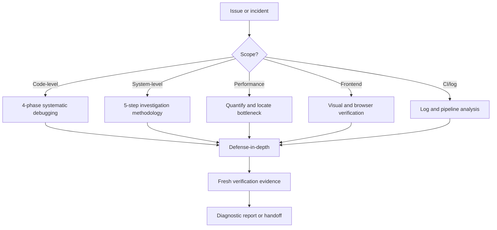

## 3. The supreme principle: Iron Law

> **NO COMPLETION CLAIMS WITHOUT FRESH VERIFICATION EVIDENCE**
>
> You must not claim "fixed", "passed", or "completed" without running a fresh verification command and reading its output/exit code.

Before any completion claim:

1. **Identify**: which command proves the claim?
2. **Run**: run that command in full.
3. **Read**: read the output and exit code, count the failures.
4. **Verify**: does the output actually confirm the claim?
5. **Report**: if it does not, report the actual status honestly.

### 3.1 Not enough to claim

| Claim | Required evidence | Not sufficient |
|---|---|---|
| Tests pass | Fresh test command, 0 failures | Old test or "should pass" |
| Lint clean | Lint output, 0 errors | Part of the file or typecheck |
| Build succeeds | Build exit 0 | Lint pass |
| Bug fixed | Original symptom reproduced and passing | Code changed |
| Regression test works | Red-green cycle if needed | Test passed once |
| Agent completed | VCS diff + independent verification | Agent says success |
| Requirements met | Checklist of each requirement | Tests pass but a requirement is missed |

### 3.2 Red flags

Stop and verify when you see these statements or thoughts:

- "should work";
- "probably fixed";
- "looks correct";
- "I'm pretty sure";
- "linter passes so the build should pass";
- "the agent said it's done";
- "just this once";
- "a partial check is enough".

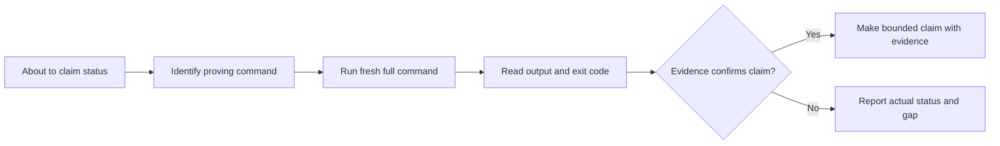

## 4. When to use which technique?

| Technique | Use when | Reference |
|---|---|---|
| Systematic Debugging | Any bug/code issue that needs investigation and fix | `systematic-debugging.md` |
| Root Cause Tracing | Deep error in the call stack, unclear origin of invalid data | `root-cause-tracing.md` |
| Defense-in-Depth | Root cause found, need to prevent recurrence at every layer | `defense-in-depth.md` |
| Verification | About to claim fixed/passing/completed | `verification.md` |
| Investigation Methodology | Server incident, multi-component failure | `investigation-methodology.md` |
| Log & CI/CD Analysis | Pipeline, deployment, server logs | `log-and-ci-analysis.md` |
| Performance Diagnostics | Latency, slow query, CPU/memory/disk | `performance-diagnostics.md` |
| Reporting Standards | Writing diagnostic/incident/performance reports | `reporting-standards.md` |
| Task Management | Investigation with 3+ steps or multiple agents | `task-management-debugging.md` |
| Frontend Verification | UI, layout, responsive, visual regression | `frontend-verification.md` |

Main tool integrations:

- `psql` for PostgreSQL;
- `gh` for GitHub Actions logs/pipeline;
- `hi-docs-seeker` for package docs;
- `hi-repository-search` and `hi-codebase-research-explorer` for code/docs context;
- Chrome MCP or `hi-chrome-devtools` for frontend;
- `hi-problem-solving` when stuck.

## 5. Code-level workflow: four phases

### 5.1 Overview

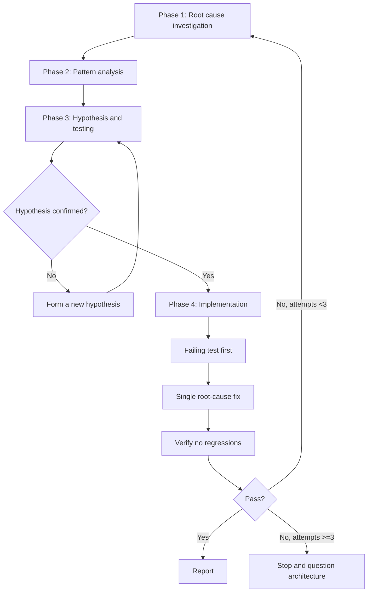

Each phase must be completed before the next one. Do not use the Implementation phase to replace diagnosis.

### 5.2 Phase 1: Root Cause Investigation

Before any fix:

1. read the error carefully, never skip the stack trace;
2. reproduce consistently if possible;
3. check recent changes:
   - `git diff`;
   - recent commits;
   - dependency changes;
   - config/environment;
4. capture data in/out at each component boundary;
5. trace the data flow backward through the call stack to its source.

Key questions:

- where does the error occur?
- where does the first abnormal value appear?
- which boundary fails to validate?
- when did the new behavior start?
- is the error deterministic or intermittent?

### 5.3 Phase 2: Pattern Analysis

Don't just look for the failing code; look for code that works correctly in the same codebase:

- a working example of the same pattern;
- a complete reference implementation;
- every difference between the working and failing paths;
- component, config, and environment dependencies;
- test setup and fixtures.

Never dismiss a difference with "that probably isn't relevant". Every difference is a candidate hypothesis until it is refuted.

### 5.4 Phase 3: Hypothesis and Testing

A hypothesis must be specific:

```text
X is the root cause because of Y; if true, experiment Z should observe W.
```

Example:

```text
The projection missing userId is the root cause because the mapper receives an object without the required field;
running the test with a projection variant will reproduce undefined before token creation.
```

Rules:

- one specific hypothesis at a time;
- the smallest experiment with high discriminative power;
- change one variable;
- verify results before moving on;
- if it fails, go back with a new hypothesis;
- say "I don't understand X" when you don't understand it, don't pretend to be certain.

### 5.5 Phase 4: Implementation

Only start when the root cause has been confirmed:

1. create a failing test case before fixing;
2. implement a single fix aimed at the root cause;
3. run tests and verification;
4. check for regressions;
5. add prevention/defense-in-depth.

If the fix does not work:

- fewer than 3 attempts: go back to Phase 1 with new evidence;
- 3 attempts or more: stop and question the architecture with a human partner.

## 6. Root-cause tracing

### 6.1 Trace skeleton

```text
1. Observe:        Error: <symptom> at <location>
2. Immediate cause: <code line that directly fails>
3. Call chain:     callee <- caller <- ... <- entry point
4. Bad value:      <param> = <unexpected value>
5. Original trigger: <test/setup that introduced the bad value>
```

### 6.2 Trace backward

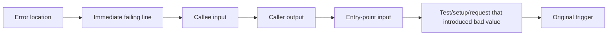

Do not fix at the error location if the bad data is created by the caller or setup. Fix the source that creates the wrong invariant, then validate at the layers the data passes through.

### 6.3 Instrumentation when manual tracing is hard

In tests, you can add `console.error()` so the logger is not hidden:

```typescript
async function gitInit(directory: string) {
  console.error('DEBUG git init:', {
    directory,
    cwd: process.cwd(),
    stack: new Error().stack,
  });
  await execFileAsync('git', ['init'], { cwd: directory });
}
```

Capture output:

```bash
npm test 2>&1 | grep 'DEBUG git init'
```

What to capture:

- test file;
- line number;
- input value;
- cwd/environment;
- call stack;
- the repeated pattern.

Instrumentation is an investigation tool, not the final fix. Once you have the evidence, decide deliberately whether to keep or remove the instrumentation.

### 6.4 Find the test causing pollution

When tests fail due to shared state or pollution, use the script `scripts/find-polluter.sh`:

```bash
./scripts/find-polluter.sh '.git' 'src/**/*.test.ts'
```

The goal is to find the first test that dirties the state, not the last test that detects the already-dirtied state.

## 7. System-level investigation: five steps

Use this workflow for incidents, server errors, deployments, databases, or multi-component behavior.

### 7.1 Overall diagram

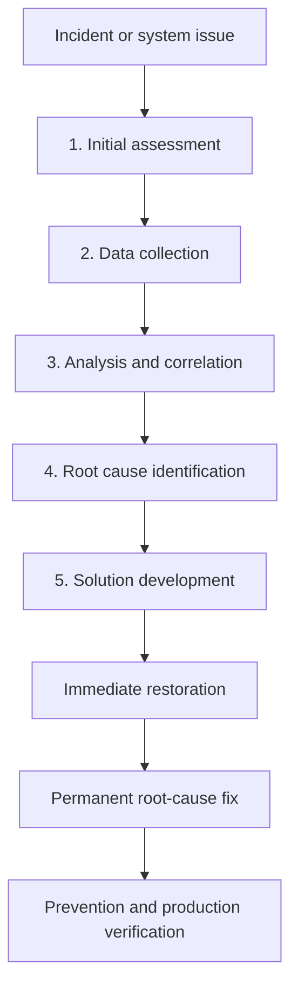

### 7.2 Step 1: Initial Assessment

Gather scope and impact before going deep:

- symptoms, errors, user reports;
- affected endpoints/services/DB/queues;
- timeframe and timezone;
- deploy/config changes near the incident;
- severity;
- users affected;
- data at risk;
- blast radius.

Useful commands:

```bash
gh run list --limit 10
git log --oneline -20 --since="2 days ago"
git diff HEAD~5 -- '*.env*' '*.config*' '*.yml' '*.yaml' '*.json'
```

### 7.3 Step 2: Data Collection

Collect evidence systematically before analyzing:

- server/app logs;
- CI/CD logs;
- database state and migrations;
- CPU, memory, disk, network;
- external dependencies, DNS, CDN, third-party status;
- codebase summary or repository search;
- package docs and versions.

CI commands:

```bash
gh run list --workflow=ci.yml --limit 5
gh run view <run-id>
gh run view <run-id> --log-failed
gh run view <run-id> --log > /tmp/ci-full.txt
```

### 7.4 Step 3: Analysis and Correlation

Build the timeline in order:

```text
first signal -> propagation -> component failure -> user impact
```

Correlate:

- timestamps across services, remember timezone;
- request/correlation ID;
- deploy/config change;
- rate and frequency of the error;
- affected user/endpoint segment;
- upstream/downstream errors;
- database queries and integrity;
- dependency graph.

Important questions:

- is there a deployment correlation?
- is the error intermittent or consistent?
- all users or a subset?
- only one endpoint or the whole system?
- does upstream or downstream fail first?

### 7.5 Step 4: Root Cause Identification

List hypotheses by evidence strength. For each hypothesis:

- smallest experiment;
- evidence to confirm/refute;
- environmental factors;
- race condition/resource limit/config drift;
- full event chain.

Do not fix the first hypothesis just because it sounds plausible.

### 7.6 Step 5: Solution Development

Prioritize by impact × urgency:

1. immediate fix: hotfix, rollback, or config to restore service;
2. root-cause fix: resolve the underlying issue;
3. preventive measures: monitoring, alerting, validation;
4. production verification plan.

Immediate mitigation must not be mistaken for a permanent fix.

## 8. Log and CI/CD analysis

### 8.1 GitHub Actions

```bash
gh run list --limit 10
gh run list --workflow=ci.yml --limit 5
gh run view <run-id>
gh run view <run-id> --log-failed
gh run view <run-id> --log > /tmp/ci-full.txt
gh run rerun <run-id> --failed
```

When reading a failed pipeline:

1. identify the failed step;
2. get focused logs;
3. look for `Error:`, `FAIL`, `exit code`, stack trace;
4. check annotations:

```bash
gh api repos/{owner}/{repo}/check-runs/{id}/annotations
```

### 8.2 Common patterns

| Pattern | Likely cause | Investigation |
|---|---|---|
| Local pass, CI fail | Environment difference | Node/Python/OS/env/secret |
| Intermittent | Race/flaky/shared state | Run 3 times, check timing |
| Timeout | Resource limit/infinite loop | CPU/memory/loop/timeout |
| Permission error | Token/secret config | Secret names, token scope |
| Install fail | Registry/lockfile/version | Lockfile and registry |
| Build pass, test fail | Test setup/DB/fixture | Test config and fixture |

### 8.3 Server/application logs

Collection strategy:

- identify log locations;
- filter by incident timeframe;
- correlate request IDs across services;
- find repeated errors and rate changes;
- preserve original lines.

Priority fields:

- timestamp;
- level;
- message;
- stack trace;
- request ID;
- user ID if not sensitive;
- endpoint;
- response code;
- duration.

### 8.4 Error pattern recognition

| Pattern | Suggestion |
|---|---|
| Sudden spike | Deploy, config, external dependency |
| Gradual increase | Resource leak or data growth |
| Cyclical | Cron/scheduled job |
| Single endpoint | Code or data specific to that endpoint |
| All endpoints | Infra, DB, or network |

## 9. Performance diagnostics

### 9.1 Measure before optimizing

You must have baseline and current metrics:

- expected response time;
- actual response time;
- percentiles if available;
- when the degradation started;
- which endpoints are affected;
- consistent or intermittent;
- traffic/load at that time.

Do not optimize based on the feeling that "the app is slow".

### 9.2 Locate bottleneck layer

```text
Request -> Network -> Web Server -> Application -> Database -> Filesystem
                                      |             |
                                      +-> External APIs/Services
```

| Layer | Check | Tool |
|---|---|---|
| Network | Latency, DNS, TLS | `curl -w`, network logs |
| Web server | Queue, connections | Server metrics/access logs |
| Application | CPU, memory | Profiler, APM, `process.memoryUsage()` |
| Database | Query, connections | `EXPLAIN ANALYZE`, `pg_stat_statements` |
| Filesystem | I/O, disk | `iostat`, `df -h` |
| External API | Duration, timeout | Request logs with duration |

### 9.3 PostgreSQL diagnostics

Slow queries:

```sql
SELECT query, calls, mean_exec_time, total_exec_time
FROM pg_stat_statements
ORDER BY mean_exec_time DESC
LIMIT 20;
```

Active queries:

```sql
SELECT pid,
       now() - pg_stat_activity.query_start AS duration,
       query,
       state
FROM pg_stat_activity
WHERE state != 'idle'
ORDER BY duration DESC;
```

Table sizes:

```sql
SELECT relname,
       pg_size_pretty(pg_total_relation_size(relid))
FROM pg_catalog.pg_statio_user_tables
ORDER BY pg_total_relation_size(relid) DESC
LIMIT 20;
```

Missing-index signal:

```sql
SELECT relname, seq_scan, seq_tup_read, idx_scan
FROM pg_stat_user_tables
WHERE seq_scan > 100
  AND seq_tup_read > 10000
ORDER BY seq_tup_read DESC;
```

Connection pool:

```sql
SELECT count(*), state
FROM pg_stat_activity
GROUP BY state;
```

Specific query:

```sql
EXPLAIN (ANALYZE, BUFFERS, FORMAT TEXT) <your-query>;
```

Look for:

- sequential scan on large tables;
- nested loop with high row counts;
- sort without an index;
- excessive buffer hits;
- N+1 queries;
- connection exhaustion;
- bloat.

### 9.4 Application performance patterns

| Issue | Symptom | Investigation/fix direction |
|---|---|---|
| N+1 queries | Many small DB calls per request | Eager load or batch |
| Memory leak | Memory grows over time | Heap profile, listeners |
| Blocking I/O | High latency, low CPU | Async, pool |
| CPU-bound | CPU high with load | Algorithm, cache |
| Connection exhaustion | Intermittent timeouts | Pool size, reuse |
| Large payload | High transfer/memory | Pagination, compression, streaming |

### 9.5 Optimization priority

One change at a time, re-measure after each change:

1. quick wins: index, N+1, cache;
2. configuration: pool, timeout, workers;
3. code: algorithm, data structure;
4. architecture: read replica, async, CDN, distributed cache.

A performance report must include baseline, bottleneck evidence, root cause, expected impact, and a verification plan.

## 10. Frontend verification

Only use this workflow when the issue involves the frontend: `tsx`, `jsx`, Vue, Svelte, HTML, CSS, SCSS, components, layout, DOM, responsive, animation, UI, or UX.

### 10.1 Detect browser capability

Prefer Chrome MCP. If unavailable, use `hi-chrome-devtools`. If both are unavailable, explicitly record that visual verification was skipped.

### 10.2 Chrome verification flow

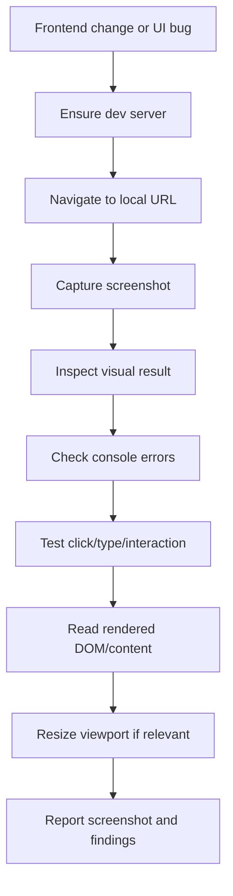

Steps:

1. `chrome__navigate` to the local URL;
2. `chrome__screenshot`;
3. read the screenshot;
4. evaluate console errors;
5. click/type to test interactions;
6. get content to verify the DOM/text;
7. check responsiveness if the issue involves the viewport.

### 10.3 Fallback chrome-devtools

```bash
SKILL_DIR="$HOME/.claude/skills/chrome-devtools/scripts"
npm install --prefix "$SKILL_DIR" 2>/dev/null
node "$SKILL_DIR/screenshot.js" --url http://localhost:3000 --output ./verification-screenshot.png
node "$SKILL_DIR/console.js" --url http://localhost:3000 --types error,pageerror --duration 5000
```

Check:

- layout without overflow/overlap;
- content renders correctly;
- responsive;
- interactions;
- no console errors;
- screenshot path recorded in the report.

Visual verification does not replace unit/integration tests. It adds evidence for browser behavior.

## 11. Defense-in-depth

### 11.1 Why multiple layers?

A single validation can be bypassed by:

- another code path;
- refactor;
- mocked tests;
- direct database call;
- different config/environment.

The goal is not just "bug fixed", but "make the bug difficult or impossible to come back through the main paths".

### 11.2 Four layers

| Layer | Purpose | Example |
|---|---|---|
| 1. Entry point | Reject invalid input at the API boundary | Throw if the path does not exist |
| 2. Business logic | Ensure data is valid for the operation | Required domain field |
| 3. Environment guard | Prevent dangerous operations based on context | Tests may only use a temp dir |
| 4. Debug instrumentation | Record context for forensics | cwd, input, stack |

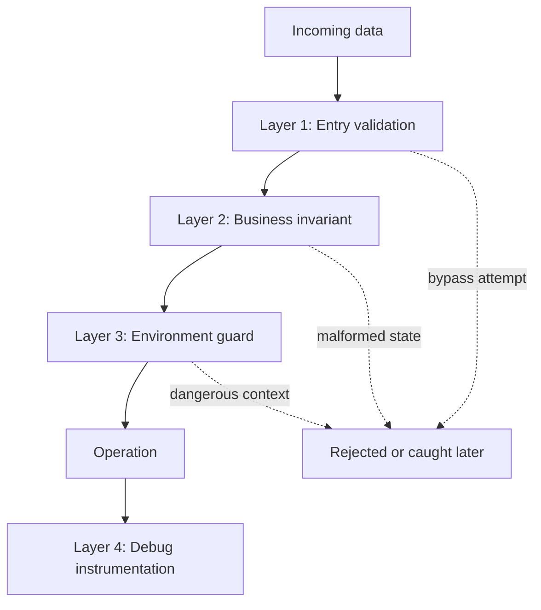

### 11.3 How to apply

1. trace data from origin to use;
2. map every checkpoint;
3. add validation at the appropriate four layers;
4. test each layer;
5. try to bypass layer 1 and confirm layer 2 still catches it;
6. verify logging does not leak secrets.

Defense-in-depth does not mean adding endless checks. Only add guards with clear ownership that protect real invariants.

## 12. Task management for investigations

### 12.1 When to create tasks

| Scope | Tasks? | Reason |
|---|---:|---|
| One bug, one file | No | Direct debugging is enough |
| Multi-component, 3+ steps | Yes | Track assess → collect → analyze → fix → verify |
| Parallel log/data collection | Yes | Coordinate independent evidence |
| CI failure with 3+ causes | Yes | Track hypothesis elimination |

### 12.2 3-Task Rule

If the investigation has fewer than 3 meaningful steps, skip task creation to avoid overhead.

### 12.3 Standard pipeline tasks

```text
Assess incident scope      -> pending
Collect logs and evidence  -> blockedBy: Assess
Analyze root cause         -> blockedBy: Collect
Implement fix              -> blockedBy: Analyze
Verify fix                 -> blockedBy: Fix
```

Metadata should include:

```yaml
metadata:
  debugStage: assess|collect|analyze|fix|verify
  incident: <id>
  severity: P0|P1|P2|P3
  effort: <estimate>
  cycle: 1
```

### 12.4 Parallel evidence collection

Collection tasks do not block each other:

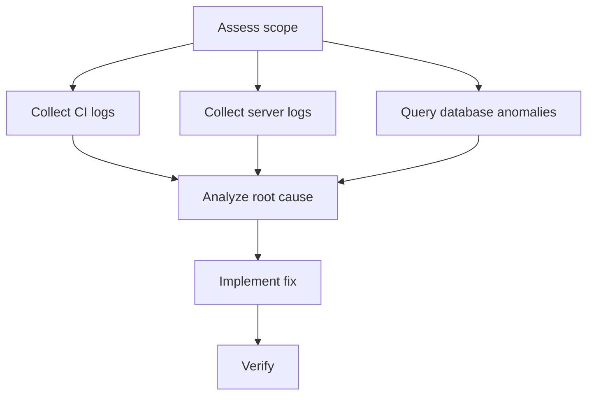

### 12.5 Lifecycle and re-investigation

```text
pending -> in_progress -> completed
```

If Verify fails:

```text
Analyze(cycle 2) -> Fix(cycle 2) -> Verify(cycle 2)
```

Limit to 3 cycles, then question the architecture.

Tasks are session-scoped. The diagnostic report is a persistent artifact and must be written after the investigation. If TaskCreate fails, continue with sequential debugging and record a warning; tasks increase visibility but are not core functionality.

## 13. Reporting standards

### 13.1 Principles

- concise: facts and evidence, no long stories;
- honest: distinguish `likely cause` from `confirmed cause`;
- state unknowns;
- report impact and status;
- separate immediate mitigation from the permanent fix.

### 13.2 Template

```markdown
# [Issue Title] - Investigation Report

## Executive Summary
- **Issue:**
- **Impact:**
- **Root cause:**
- **Status:**
- **Fix:**

## Timeline
- HH:MM -
- HH:MM -

## Technical Analysis
### Findings
1.
2.

### Evidence
[logs, queries, metrics]

## Recommendations
### Immediate (P0)
- [ ]

### Short-term (P1)
- [ ]

### Long-term (P2)
- [ ]

## Unresolved Questions
-
```

### 13.3 Evidence to preserve

- exact error messages;
- stack traces;
- timestamps and timezone;
- request/correlation IDs;
- before/after comparison;
- counts/frequency;
- normal path and error path;
- commands and exit codes.

## 14. What does a complete investigation look like?

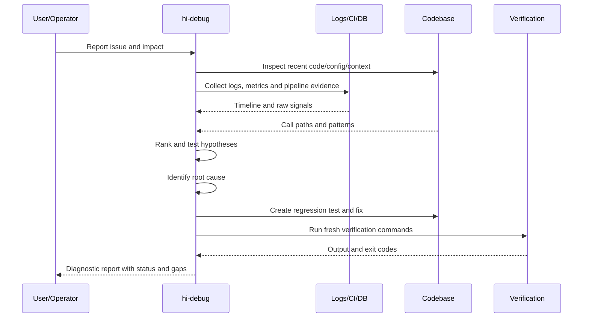

## 15. Code-level example: undefined data in the call stack

Issue:

```text
A test fails at token creation with `userId is undefined`.
```

### 15.1 Observe

Capture:

- exact stack trace;
- test name;
- input fixture;
- command;
- recent diff;
- value at the token service boundary.

### 15.2 Pattern analysis

Find a working test that creates tokens successfully. Compare:

- repository query projection;
- mapper;
- fixture fields;
- async setup;
- transaction state.

### 15.3 Hypothesis

```text
Hypothesis: the new projection drops `userId`, so the mapper receives an object missing the field.
Experiment: run the mapper with the old/new projection and log the input boundary.
```

If the projection variant reproduces the error and the old projection passes, the hypothesis is confirmed.

### 15.4 Root-cause trace

```text
Token error
-> token service reads undefined userId
-> mapper output misses required field
-> repository projection excludes userId
-> test setup introduced new projection
```

### 15.5 Implementation and verification

- write a regression test for the new projection;
- enforce the required field at the repository/domain boundary;
- fix the projection or contract;
- run old tests + new tests;
- run typecheck/lint/build as scoped;
- claim only after fresh output confirms it.

## 16. System-level example: CI passes locally but fails in the pipeline

Issue:

```text
Local tests pass, GitHub Actions fails the integration test with a database timeout.
```

### 16.1 Initial assessment

- workflow/run ID;
- failing job/step;
- which commit/deploy started it;
- all jobs or only integration;
- data/user impact if CI is blocking the release.

### 16.2 Data collection

```bash
gh run list --workflow=ci.yml --limit 5
gh run view <run-id> --log-failed
git log --oneline -20
git diff HEAD~5 -- '.github/**' '*.yml' '*.yaml' '*.json'
```

Also check:

- DB service startup log;
- Node/Python version;
- env vars/secret names;
- migration status;
- connection pool;
- test parallelism.

### 16.3 Hypotheses

| Hypothesis | Experiment |
|---|---|
| CI DB not ready | Check service health and startup timing |
| Connection pool too small | Compare config and active connections |
| Migration not run | Inspect migration logs/schema |
| Test pollution | Run tests one-by-one, find the polluter |
| CI version differs from local | Compare runtime/lockfile |

### 16.4 Solution development

- immediate: add a readiness check if the service is not ready;
- root cause: fix the lifecycle/config/migration contract;
- prevention: health check, explicit timeout, CI log fields;
- verify: rerun the failed job and local reproduction.

Do not claim "CI fixed" just because a rerun passed once if you do not understand the intermittent cause.

## 17. Performance example: increased API latency

Issue:

```text
P95 of `/orders` increased from 300ms to 2s after adding a filter.
```

### 17.1 Quantify

- baseline/current p50/p95/p99;
- traffic and payload size;
- start time;
- endpoint/tenant affected;
- query count/request.

### 17.2 Eliminate layers

Measure duration at the network, web server, application, DB, and external API. If app time is high, profile; if DB time is high, run `EXPLAIN ANALYZE`.

### 17.3 Hypothesis

```text
The filter creates an N+1 query because each order loads its customer again.
```

Experiment:

- count queries per request;
- compare the endpoint before/after the filter;
- inspect the query plan;
- change one variable, measure again.

### 17.4 Report

The report must include baseline/current numbers, bottleneck evidence, expected impact, and the command/metric that proves the optimization.

## 18. Frontend example: visual regression

Issue:

```text
The mobile layout overflows after changing the data table.
```

Workflow:

1. detect frontend scope;
2. start dev server;
3. screenshot desktop/mobile;
4. inspect overflow/overlap;
5. check console errors;
6. click/scroll/filter interaction;
7. read the DOM/rendered text;
8. fix the correct component/style owner;
9. take a new screenshot and record the path;
10. run tests if any.

Visual pass can only be claimed when the fresh screenshot, console output, and matching interaction evidence have all been read.

## 19. How to verify hi-debug?

### 19.1 Investigation verify

- [ ] Scope and severity identified.
- [ ] Exact symptom/error captured.
- [ ] Timeframe and recent changes checked.
- [ ] Affected components and blast radius clear.
- [ ] Logs/metrics/DB/CI evidence collected.
- [ ] Timeline correlated.

### 19.2 Root-cause verify

- [ ] Call stack/data flow traced backward.
- [ ] Working pattern compared.
- [ ] Hypothesis has a concrete experiment.
- [ ] Hypothesis confirmed/refuted by evidence.
- [ ] Root cause is not just where the symptom appears.
- [ ] Environmental factors considered.

### 19.3 Fix/prevention verify

- [ ] Failing test exists before the fix.
- [ ] Fix is a deliberate change.
- [ ] Regression test passes.
- [ ] Defense-in-depth considered.
- [ ] No unrelated changes.
- [ ] No new warnings.

### 19.4 Fresh verification verify

- [ ] Command proving the claim identified.
- [ ] Command run in the current message/session.
- [ ] Full output read.
- [ ] Exit code and failure count checked.
- [ ] Original symptom gone.
- [ ] Relevant tests/build/lint/typecheck pass.
- [ ] Report states what was not verified.

### 19.5 Report verify

- [ ] Executive summary short and accurate.
- [ ] Timeline has timestamps.
- [ ] Technical findings backed by evidence.
- [ ] Immediate/short/long-term recommendations separated.
- [ ] Unknowns recorded in Unresolved Questions.
- [ ] `likely` and `confirmed` not used interchangeably.

## 20. Limitations to understand correctly

### 20.1 Debugging does not mean fixing

`hi-debug` can end at a diagnosis report if the user only needs to understand the incident or has not authorized a fix. Fixing is a later step and requires appropriate scope/approval.

### 20.2 The root cause may be architecture

If three fix attempts do not resolve it, the problem may be shared state, coupling, or contract architecture. Continuing to patch increases risk; ask a human partner.

### 20.3 Mitigation is not a permanent fix

A rollback or config change can restore the service but does not address the cause. The report must separate the status of the immediate mitigation from the permanent root-cause fix.

### 20.4 Partial evidence is not enough for broad claims

One passing unit test does not prove integration; one passing screenshot does not prove the backend; one passing CI rerun does not prove the flaky cause is gone.

### 20.5 Session tasks and persistent reports

Debug tasks can be session-scoped. The investigation report must be a persistent artifact so others can review the timeline, evidence, decisions, and unresolved risks.

## 21. Relationship with other skills

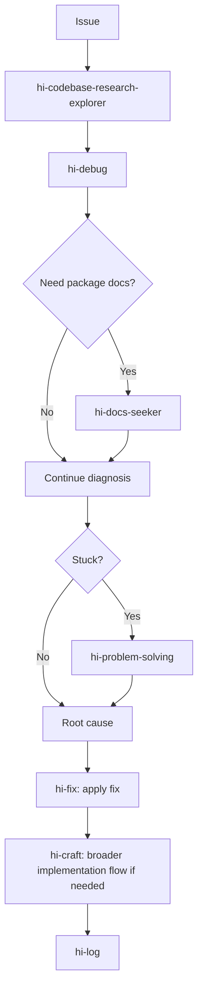

| Skill | Relationship |
|---|---|
| `hi-codebase-research-explorer` | Locate files, call paths, and external context |
| `hi-fix` | Use the diagnosis to fix the root cause |
| `hi-craft` | Call `hi-fix` after multiple test failures or for implementation orchestration |
| `hi-plan` | Record architectural changes or follow-up plans |
| `hi-docs-seeker` | Read package/framework/API docs |
| `hi-chrome-devtools` | Browser screenshot, console, and interaction |
| `hi-problem-solving` | Reframe when the hypothesis loop is stuck |
| `hi-log` | Write the investigation/finalization log |

## 22. Quick summary

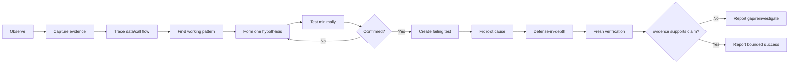

The shortest sentence to remember:

> `hi-debug` does not start with "which line should I fix?", but with "what evidence tells us what happened, where the root cause lies, and which command proves the conclusion?".
