# Hi Fix Skill: Complete Guide

> `hi-fix` is the skill that handles bugs, errors, test failures, CI/CD failures, type errors, lint errors, log errors, UI issues and other technical problems through root-cause analysis. It does not merely fix the line of code reporting the error.

## 1. What problem does Hi Fix solve?

An error usually has multiple layers:

- **Symptom**: the visible manifestation, e.g. an API returning `500` or a failing test.
- **Immediate cause**: the direct cause, e.g. `undefined` being dereferenced.
- **Contributing factor**: the condition that makes the error appear, e.g. input not validated at a boundary.
- **Root cause**: the underlying cause in design, data flow, state, contract or environment.

If you only fix the symptom, the error may disappear in one case but come back through another call path. `hi-fix` forces the workflow to go through research and diagnosis before fixing:

```text
[Codebase-Research-Explorer] -> [Diagnose] -> [Fix] -> [Verify + Prevent] -> [Finalize]
```

The goal is to produce a fix that can be explained with evidence:

- what the exact error is;
- where the error is and when it started;
- which hypotheses were confirmed/refuted;
- where the root cause lies;
- which layer the fix affects;
- which test prevents regression;
- which defense-in-depth measures were considered.

## 2. Overall mental model

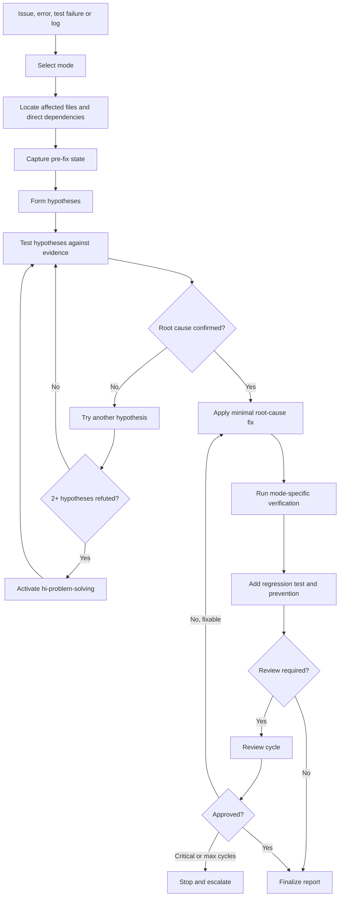

## 3. Hard gates

### 3.1 Diagnose before Fix

Mandatory rule:

> Do not fix before Codebase-Research-Explorer and Diagnose have been run.

This means you should not:

- fix the line shown in the stack trace right away without tracing backward;
- increase a timeout just to make a test pass without knowing why the timeout happened;
- add `try/catch` to swallow errors;
- add `any`, `eslint-disable` or null assertions to hide type errors;
- change test expectations before verifying the contract;
- retry many times without distinguishing flaky tests from deterministic failures.

### 3.2 Root cause before patch

Diagnosis must follow the chain:

```text
Symptom
  -> Immediate cause
    -> Contributing factor
      -> ROOT CAUSE
```

A fix is considered valid when it addresses the source of the incorrect behavior, not just the location where the error was detected.

### 3.3 Three failed fix attempts

If there are three or more failed fix attempts:

- stop further patching;
- re-examine the diagnosis and architecture;
- ask the user when a decision about architecture changes or scope is needed;
- do not keep trying randomly.

If two or more hypotheses have been refuted, activate `hi-problem-solving` to escape the loop of old assumptions.

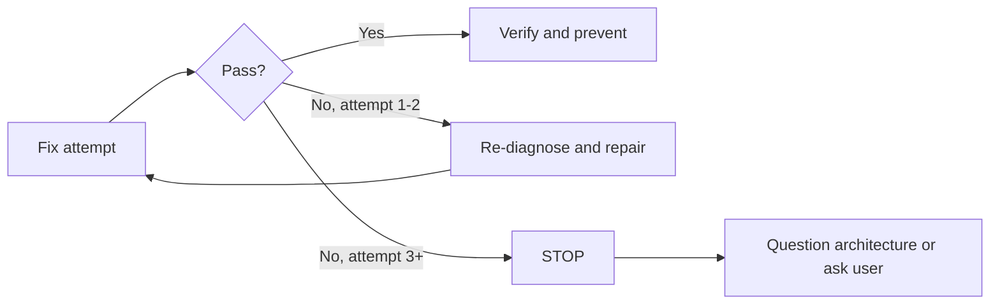

## 4. Syntax and mode selection

### 4.1 Syntax

```text
/hi-fix <issue>
/hi-fix <issue> --standard
/hi-fix <issue> --deep
/hi-fix <issue> --parallel
/hi-fix <issue> --review
```

`<issue>` can be:

- a bug description;
- an error message;
- a test failure;
- a CI job failure;
- a type/lint error;
- a file path and line;
- a log or stack trace;
- a UI behavior that needs fixing.

### 4.2 Mode table

| Mode | Typical scope | Research | Verify | Review |
|---|---|---|---|---|
| Default / Quick | 1 file, type/lint or a clear error | Locate-only | Typecheck + lint | No |
| `--standard` | 2-5 files | Full explorer, debug when needed | Typecheck + lint + build + test | Per policy or `--review` |
| `--deep` | 5+ files, architecture impact | Parallel explorer + diagnose + research | Comprehensive | Review possible |
| `--parallel` | 2+ independent issues | Separate task tree per issue | Integration verify after the branches | Per mode |
| `--review` | Human-in-the-loop | Per remaining mode | Per remaining mode | Ask the user at each review gate |

`--review` is an approval modifier, not a separate scope. It can accompany a suitable workflow to request user review of findings at each round.

## 5. Quick mode

Quick mode is the default for a single file or an error with an obvious cause:

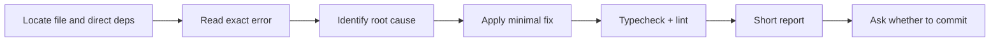

Quick mode is suitable for:

- a clear type error;
- a lint error;
- a typo or wrong import;
- a file failing with a direct stack trace;
- a test failure with a known root cause that does not affect architecture.

Quick mode still has to diagnose before fixing. "Quick" shortens the research and verification scope, it does not remove the hard gates.

According to the workflow reference, quick mode does not commit automatically; it produces a short report and asks the user whether they want to commit.

## 6. Standard mode

`--standard` is for moderate changes, usually 2-5 files:

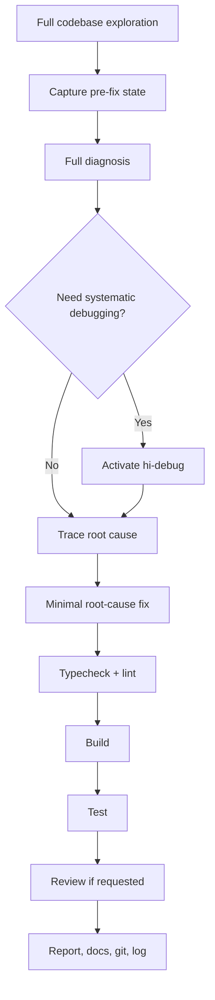

Standard mode should be used when:

- the bug crosses multiple layers;
- 2 to 5 files are involved;
- build and test are needed to prove behavior;
- the error may affect API, data flow or integration;
- documentation or review is needed before committing.

## 7. Deep mode

`--deep` is for issues touching 5 or more files or with architecture impact. This is not just Quick mode with more files; it requires additional evidence and verification:

- parallel explorers;
- parallel diagnosis and research when independent;
- call graph/data flow tracing;
- consideration of security, performance and concurrency;
- edge-case and integration verification;
- review before finalizing.

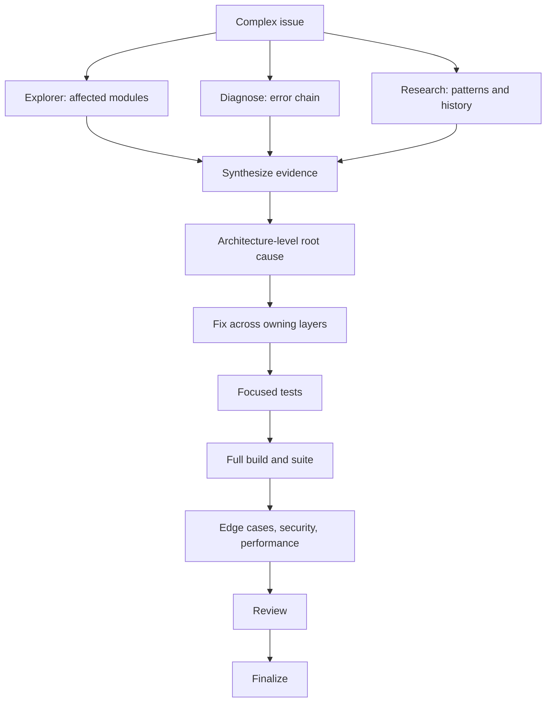

Deep mode is suitable for:

- data corruption or data loss risk;
- authentication/authorization bugs;
- migration or persistence bugs;
- memory/resource leaks;
- race conditions;
- CI/CD pipeline failures affecting many jobs;
- UI issues involving frontend, backend and browser state;
- breaking changes or architecture violations.

## 8. Parallel mode

`--parallel` is for two or more **independent** issues. Each issue has its own task tree:

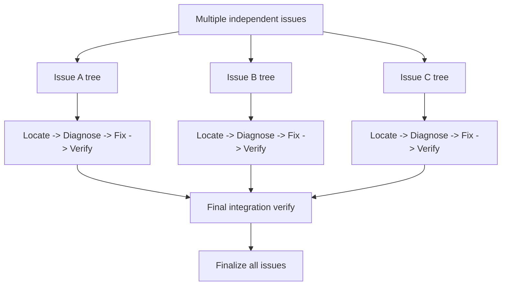

Only parallelize when:

- the issues do not touch the same ownership boundary;
- there is no shared root cause that has not been checked;
- they do not depend on a common migration/API contract;
- the result of one issue does not change the diagnosis of another.

If the issues might be manifestations of a common root cause, they must first be merged into a single diagnosis tree. Parallelizing in that case tends to produce conflicting fixes.

The final integration verify is blocked until every branch has completed its own verification.

## 9. Review mode

`--review` enables human-in-the-loop at each review cycle. Sequence:

1. run the code reviewer;
2. show score, critical count, warnings and suggestions;
3. ask the user to choose;
4. fix according to the decision;
5. test again;
6. review again, up to 3 cycles.

If there is a critical finding, the user can choose:

- Fix critical;
- Fix all;
- Approve anyway;
- Abort.

If there is no critical finding:

- Approve;
- Fix warnings/suggestions;
- Abort.

The user choosing `Approve anyway` should be explicitly recorded in the report along with the residual risk. It does not make the critical issue disappear from the evidence.

## 10. Step 1: Codebase-Research-Explorer

### 10.1 Goal

The explorer in the first step has a **locate-only** mission: find the right code region before deep diagnosis.

It needs to identify:

- the file reporting the error;
- direct dependencies;
- the entry point of the behavior;
- the nearest caller/callee;
- related tests;
- config/environment that could have an effect;
- recent commits or changes if needed.

### 10.2 Scale by mode

| Mode | Explorer |
|---|---|
| Quick | 1 locate-only agent |
| Standard | `hi-codebase-research-explorer` or 2-3 explorers |
| Deep | Explorer in parallel with Diagnose and Research |
| Parallel | Separate explorer for each issue |

The explorer must not modify code on its own. It returns context so that diagnosis can verify hypotheses.

### 10.3 Expected output

A good explorer report should include:

- relevant files and symbols;
- the path of data or control flow;
- nearest tests/call sites;
- files that may be affected;
- the limits of the evidence;
- unanswered questions.

## 11. Step 2: Diagnose

Diagnose is a mandatory step and the place where this skill differs most clearly from direct patching.

### 11.1 Capture pre-fix state

Record before fixing:

- the exact error message;
- the file, line and command causing the error;
- the stack trace;
- log snippets;
- reproduction steps;
- expected behavior;
- actual behavior;
- `git log --oneline -10`.

Capturing allows before/after comparison using the same command, instead of relying on memory.

### 11.2 Observe phase

Questions to answer:

- what is the exact error?
- which file/line does it appear at?
- when does it happen?
- does it always reproduce or does it depend on timing/data/environment?
- which commit or change did it start from?
- are there similar issues in logs/history?

### 11.3 Hypothesize phase

For each hypothesis, record:

- the hypothesis statement;
- the evidence supporting it;
- the evidence that could refute it;
- the experiment or command to test it;
- the result: `CONFIRMED`, `REFUTED` or `INCONCLUSIVE`.

Common hypotheses:

- regression from a recent change;
- data/state mismatch;
- different environment;
- missing validation;
- race condition or timing;
- contract mismatch between modules;
- dependency/config drift;
- resource limit or timeout.

### 11.4 Test hypotheses phase

Test hypotheses with the smallest possible experiment:

- reproduce the focused case;
- add temporary logging or inspect existing logs;
- run the module's tests;
- trace caller/callee;
- compare input/output at the boundary;
- compare environment/config;
- use Git history to check for regressions.

Do not run the whole test suite before knowing which test is likely to discriminate between hypotheses, unless the suite is the cheapest way to capture a baseline.

### 11.5 Trace root cause phase

Trace backward through the four layers:

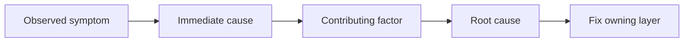

Example:

```text
Symptom: POST /login returns 500
Immediate cause: token service receives userId undefined
Contributing factor: mapper drops the field when the query uses a different projection
Root cause: two repository contracts are inconsistent but there is no type/runtime validation
Fix: unify the contract at the repository boundary + regression test for the projection variant
```

### 11.6 Escalation during diagnosis

- If the diagnosis is complex, activate `hi-debug`.
- If two or more hypotheses are refuted, activate `hi-problem-solving`.
- If three fix attempts do not resolve the issue, stop and ask about architecture.

## 12. Diagnosis report

Before fixing, a report of the following form is required:

```markdown
## Diagnosis

**Issue:** One-line description.
**Root Cause:** Clearly traced source of incorrect behavior.
**Evidence Chain:** Observation -> hypothesis -> test result.
**Recommended Fix:** Minimal change at owning layer.
**Prevention:** Regression test and defense-in-depth guards.
```

The diagnosis report is not decorative documentation. It is a checkpoint for the reviewer to verify that the upcoming fix targets the right root cause.

## 13. Step 3: Fix

### 13.1 Principles

The fix must:

- address the root cause;
- be minimal but sufficient to prevent the error;
- follow existing patterns;
- keep the public API unless a breaking change is required;
- not fix unrelated bugs;
- not hide the error with suppression or blind fallbacks;
- have a test that fails before the fix and passes after it.

### 13.2 Owning layer

Fix at the layer that owns the violated invariant, not necessarily where the error is observed:

| Symptom appears at | Root cause may lie in |
|---|---|
| UI crash | API contract, state normalization or missing null guard |
| API 500 | persistence mapping, validation or transaction boundary |
| Type error | wrong interface, generated type drift or unsafe boundary |
| CI failure | dependency/config/platform mismatch |
| Flaky test | shared state, timing, cleanup or concurrency |
| Slow request | N+1 query, retry amplification or blocking I/O |

### 13.3 Minimal diff

A good fix usually has:

- fewer files but correct ownership;
- no reformatting of unrelated code;
- no renaming of public symbols unless needed;
- no new dependency just to fix a simple case;
- no ignoring of new warnings.

If the root cause requires a large change, that is the time to update the architecture/plan or ask the user, not to pretend a small patch is enough.

## 14. Step 4: Verify + Prevent

### 14.1 Verification by mode

| Mode | Minimum verification |
|---|---|
| Quick | Typecheck + lint |
| Standard | Typecheck + lint + build + test |
| Deep | Comprehensive: edge cases + security + performance |
| Parallel | Verify each issue + final integration verify |

The same command should be run before and after the fix when possible, for a clear comparison:

```text
Pre-fix command -> fails/reproduces
Post-fix command -> passes/no longer reproduces
```

### 14.2 Prevention gate

A fix without prevention is incomplete. A regression test is mandatory:

> Every fix must have a test that fails if the fix is removed and passes when the fix is applied.

Beyond the regression test, consider defense-in-depth at the layers:

1. **Entry point**: reject invalid input at the API boundary.
2. **Business logic**: assert that data/state are reasonable.
3. **Environment**: guard dangerous operations, timeouts and fallbacks.
4. **Debug/observability**: add logging that will be useful for the next diagnosis.

### 14.3 Type safety

If the error involves types:

- `null`/`undefined`: strict null checks, `??` or `?` used in the right context;
- wrong type: type guard or runtime validation;
- missing property: required field in the interface or schema;
- do not use `any` to erase error signals;
- do not use suppression before actually handling the boundary.

### 14.4 Error handling

If the error involves failure paths:

- promises must have an appropriate `.catch()` or `try/catch`;
- silent failures must have explicit error logging;
- fallbacks must have a timeout and clear behavior;
- retries must have limits, backoff and idempotency;
- do not expose secrets/PII in errors or logs.

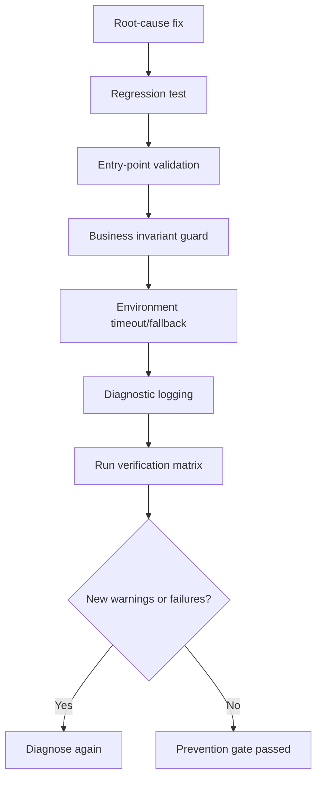

### 14.5 Verification checklist

- [ ] Pre-fix state has been captured.
- [ ] Fix targets the root cause, not just the symptom.
- [ ] The same command has been compared before/after.
- [ ] A regression test has been added.
- [ ] Defense-in-depth has been considered.
- [ ] No new warnings.
- [ ] Error handling is not swallowed.
- [ ] Scope has not been silently expanded.

## 15. Review cycle

### 15.1 Autonomous review

Autonomous process:

1. run the code reviewer;
2. get `score`, `critical_count`, warnings;
3. if score >= 9.5 and critical = 0: auto-approve;
4. if there is a critical and cycle < 3: auto-fix the critical, test again, review again;
5. if cycle >= 3: escalate to the user;
6. if there is no critical but score < 9.5: approve with warnings logged.

### 15.2 Human-in-the-loop review

Review with `--review` always shows findings and asks the user. After the user's choice:

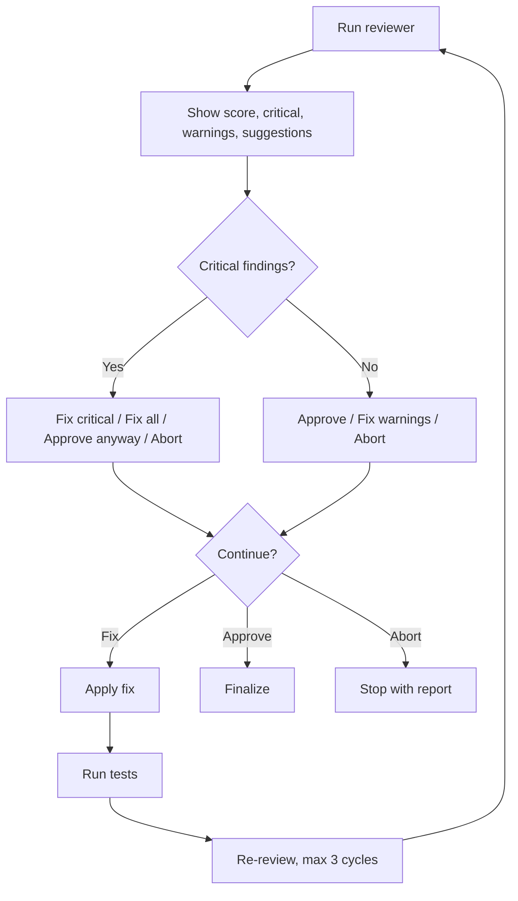

### 15.3 Quick review policy

Quick mode has a lower threshold:

- score >= 8.5 can be acceptable;
- only one auto-fix cycle before escalating;
- critical issues still block.

### 15.4 Critical issues always block

The following always require handling or user approval of a recorded exception:

- Security: XSS, SQL injection, OWASP issues;
- Performance: e.g. O(n²) when an O(n) solution exists;
- Architecture violations;
- Data loss risks;
- Breaking changes without a migration.

## 16. Step 5: Finalize

### 16.1 Quick finalize

The quick workflow ends with:

- a short report;
- a test verification summary;
- asking the user whether they want to commit.

### 16.2 Standard/Deep finalize

Standard and Deep:

1. report;
2. review if `--review` or policy requires it;
3. update documentation;
4. create a Git commit;
5. write a log entry.

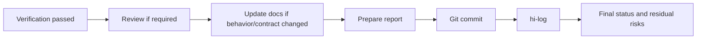

### 16.3 When not to finalize?

Do not finalize as a successful fix if:

- the root cause has not been confirmed;
- tests still fail;
- there is no regression test, unless a valid blocker is recorded;
- critical review findings still exist;
- more than three fix attempts have passed without asking about architecture;
- the task is blocked but the report says completed.

## 17. Output of hi-fix

### 17.1 Quick output

```text
Issue: Type error in user mapper
Root cause: Optional field used as required value
Fix: Runtime guard at mapper boundary
Verify: typecheck passed, lint passed
Prevention: regression test added
Commit: pending user approval
```

### 17.2 Diagnosis report

For Standard/Deep, the output should include:

- issue summary;
- pre-fix reproduction;
- evidence chain;
- hypotheses and their confirm/refute results;
- root cause;
- files changed;
- recommended fix or applied fix;
- verification commands and results;
- regression test;
- defense-in-depth;
- review score/findings;
- commit/log;
- residual risk and follow-up.

### 17.3 Do not overstate

Do not report:

- "fixed" when only the test expectation was changed;
- "verified" when only one command with insufficient scope was run;
- "no regression" when there is no regression test yet;
- "production ready" when environment/integration has not been checked;
- "root cause found" when the hypothesis is still inconclusive.

## 18. Failure handling and escalation

### 18.1 Two hypotheses refuted

When two or more hypotheses are refuted, the current diagnosis may be using the wrong framing. Activate `hi-problem-solving` to:

- invert assumptions;
- split the symptom into scenarios;
- try higher-discrimination experiments;
- consider environment or architecture boundaries.

### 18.2 Three failed fix attempts

This is an architecture question, not a signal to patch further:

1. stop fixing;
2. record all three attempts and their results;
3. identify which assumption is wrong;
4. ask the user whether they accept an architectural change;
5. update the plan if continuing.

### 18.3 CI workflow

Specialized CI workflow:

1. get the failed logs, e.g. `gh run view --log-failed`;
2. analyze stack traces and patterns;
3. reproduce locally;
4. fix the root cause;
5. run local verification;
6. record the differences between the CI and local environments.

### 18.4 Log workflow

Read the most recent N lines of logs, prioritizing:

- stack traces;
- error codes;
- request/correlation IDs;
- the first failure rather than cascading failures;
- timestamps and sequence.

Do not just take the last line if the last line is a consequence rather than the source.

### 18.5 Test failure workflow

For compile failures:

- group errors by module;
- fix the shared root cause first;
- do not mechanically fix each error in the cascade one by one.

For type errors:

- run `tsc --noEmit` if the project uses TypeScript;
- fix all errors within scope;
- do not use `any` to hide errors.

### 18.6 UI workflow

For UI issues:

1. analyze the screenshot or reproduction;
2. identify viewport, browser and state;
3. find the component/style/data owner;
4. implement the fix;
5. verify visually and with interaction tests if available;
6. check responsive layout, overlap and accessibility.

## 19. End-to-end example

Suppose the issue is:

```text
Production login intermittently returns 500 when the user has just been created.
```

### 19.1 Invoke the skill

```text
/hi-fix intermittent 500 on login for newly-created users --deep --review
```

### 19.2 Explorer

Find:

- the login controller;
- the user creation transaction;
- the token service;
- the user repository and mapper;
- integration tests;
- logs by correlation ID;
- commits around the time the issue appeared.

### 19.3 Capture pre-fix state

Record:

- the exact 500 response;
- the stack trace;
- the user creation timestamp;
- the login request timestamp;
- the query/projection used;
- `git log --oneline -10`;
- reproduction rate and environment.

### 19.4 Hypotheses

| Hypothesis | Test | Assumed result |
|---|---|---|
| User creation not committed before login | Trace transaction timing | Refuted if login only runs after commit |
| Mapper drops `userId` with the new projection | Compare projection and mapper input | Confirmed |
| Token service has a race condition | Reproduce concurrent requests | Inconclusive |

### 19.5 Root cause

```text
Symptom: Login 500
Immediate cause: token service receives userId undefined
Contributing factor: mapper uses a projection without userId but the type does not require the field
Root cause: repository boundary does not enforce the contract between projection and domain mapper
```

### 19.6 Fix and prevention

- enforce required `userId` at the repository/domain boundary;
- fix the projection or mapper per the unified contract;
- add a runtime guard for invalid data;
- add a regression test with a newly-created user and the projection variant;
- add logs without credentials so the next trace is faster.

### 19.7 Verify and review

Deep verification:

- focused unit test;
- integration test for create-then-login;
- concurrent request scenario;
- typecheck, lint, build;
- full relevant test suite;
- security review of log content;
- review where the user chooses fix critical if present.

Only finalize after the root cause is confirmed, the regression test passes and no critical review findings remain.

## 20. Relationship with other skills

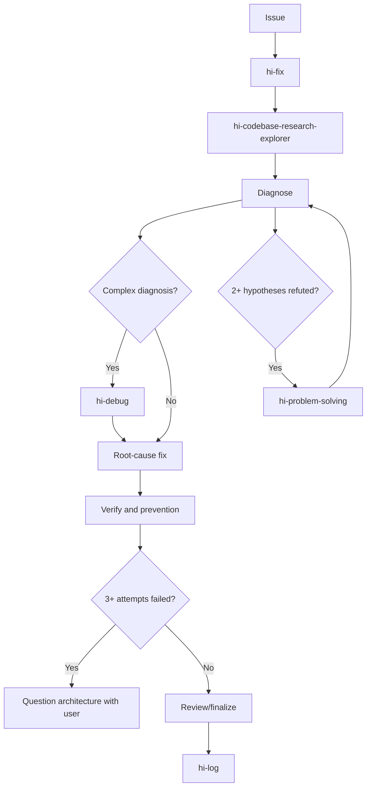

| Skill | Role |
|---|---|
| `hi-codebase-research-explorer` | Locate affected files, symbols and dependencies |
| `hi-debug` | Systematic debugging when diagnosis is hard |
| `hi-problem-solving` | Escape the framing/hypothesis loop |
| `hi-scenario` | Supplement edge cases and scenario matrix |
| `hi-security` | In-depth security audit |
| `hi-craft` | Invoke hi-fix after multiple test failures during implementation |
| `hi-log` | Write log after finalize |

## 21. How to verify hi-fix?

### 21.1 Diagnosis verify

- [ ] Exact error and pre-fix state have been captured.
- [ ] Reproduction or observation has evidence.
- [ ] Hypotheses have a way to be confirmed/refuted.
- [ ] Evidence chain leads to the root cause.
- [ ] "Probably" is not used as a final conclusion.

### 21.2 Fix verify

- [ ] Fix is at the owning layer.
- [ ] Diff is minimal and follows existing patterns.
- [ ] No unrelated changes.
- [ ] Error handling and boundary validation are clear.
- [ ] Errors are not hidden with `any`, suppression or swallowed exceptions.

### 21.3 Prevention verify

- [ ] Regression test fails without the fix and passes with it.
- [ ] Defense-in-depth has been considered.
- [ ] Type safety has been checked.
- [ ] Logging is sufficient to diagnose a recurrence but does not leak secrets.
- [ ] Timeout/fallback/retry have clear policies if needed.

### 21.4 Runtime/quality verify

- [ ] Typecheck passes.
- [ ] Lint passes.
- [ ] Build passes if the mode requires it.
- [ ] Tests pass unless `--no-test` is used.
- [ ] Edge cases have been run in Standard/Deep.
- [ ] Security/performance have been considered in Deep.

### 21.5 Review/finalize verify

- [ ] Review threshold matches the mode.
- [ ] Critical count is zero or the exception is explicitly recorded.
- [ ] Fix cycle limit is not exceeded.
- [ ] Tasks/status have been updated.
- [ ] Docs/log/commit are complete per mode.
- [ ] Residual risks are stated in the report.

## 22. Limitations to understand correctly

### 22.1 Stack trace does not always point to the root cause

A stack trace usually tells you where the symptom exploded, not where the invariant was broken. You need to trace backward through the call path and data boundaries.

### 22.2 A passing test does not prove complete prevention

A passing test may not cover:

- different input boundaries;
- concurrent requests;
- production config;
- retry/timeout;
- migration state;
- different browsers/devices;
- old data in the database.

### 22.3 Minimal fix is not the shortest diff at any cost

A one-line patch can be "small" but at the wrong layer. Truly minimal means the fewest changes needed to fix the root cause and prevent regression.

### 22.4 Review does not replace diagnosis

A code reviewer can surface problems, but the final review must not be used to bypass the diagnosis hard gate. A patch without root-cause evidence is not ready yet.

### 22.5 User escalation is a valid outcome

If the current architecture cannot be safely fixed with a small patch, stopping and asking the user is the right behavior. Reporting a clear blocker is better than a chain of hard-to-trace workarounds.

## 23. Quick summary

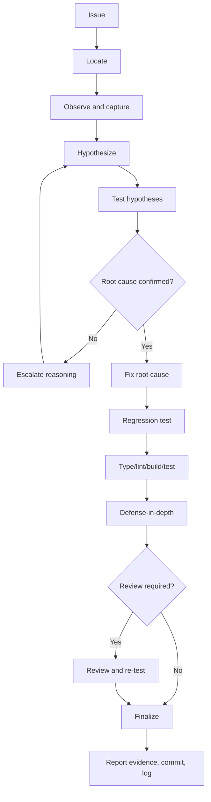

The shortest way to remember it:

> `hi-fix` does not ask "which line needs fixing?", but "why is the behavior wrong, what evidence proves it, and what can be done to keep the error from coming back?"
