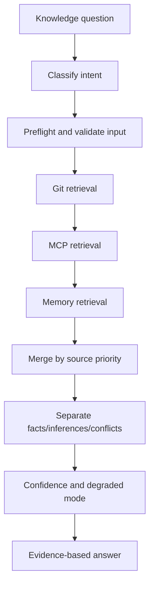
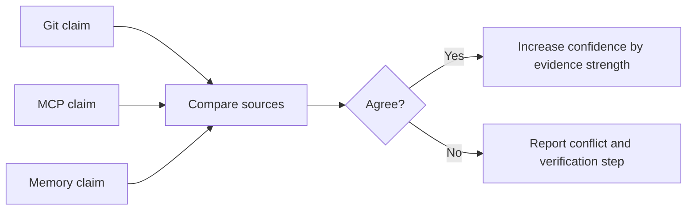
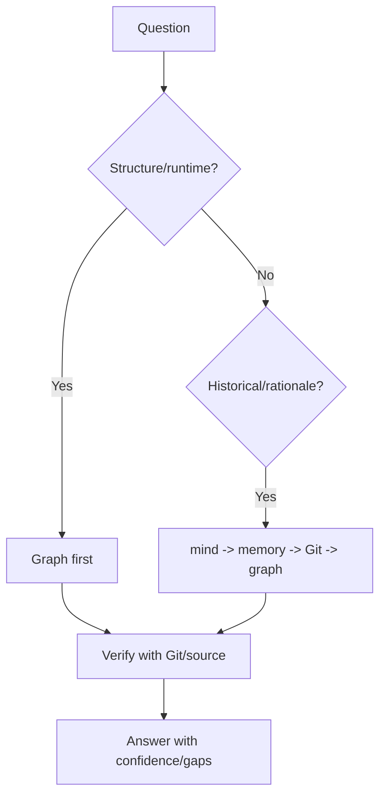

# Hi Knows Skill: Complete Guide

> `hi-knows` is a unified knowledge retrieval skill: it answers questions about why-changed, impact-radius, architecture context, and history trace using evidence from Git, MCP, and memory files.

## 1. Goal and boundaries

`hi-knows` builds answers with traceability; it is not a syntax helper, implementation engine, or database mutation tool.

Use it for:

- why code changed;
- which commit created a behavior;
- the impact radius of a symbol/module;
- architecture rationale;
- decision history;
- reconciling Git, project knowledge, and memory.

Do not use it for:

- simple syntax fixes;
- pure implementation;
- DB mutations;
- questions that do not require historical/architectural evidence.

## 2. Mental model



## 3. Intent and source priority

### 3.1 Intent

| Intent | Example question |
|---|---|
| `why-changed` | Why was this function changed? |
| `impact-analysis` | Where does changing this module have an impact? |
| `architecture-context` | Why did the system choose this pattern? |
| `history-trace` | Through which commits did this behavior take shape? |

### 3.2 Priority by intent

| Question type | Priority |
|---|---|
| Structure/Runtime | `graph_mcp → Git → mind_mcp → memory` |
| Historical/Rationale | `mind_mcp → memory → Git → graph_mcp` |

This is the difference from a fixed search order. Source priority depends on the question type.

## 4. Phase-by-phase workflow

### Phase 1: Preflight

- classify the intent;
- determine path/query/commit;
- validate that the path has no traversal;
- validate query length/special chars;
- check the commit hash;
- determine limits/context.

### Phase 2: Git

Start with scope before detail:

```bash
git log --oneline --decorate -20 -- <path>
git show <commit> --stat --format="%h %s"
git blame -L <start>,<end> --date=short <file>
```

Long Git output must be normalized before synthesis using `scripts/git-normalize.js`:

```bash
git show <commit> | node scripts/git-normalize.js
git show <commit> | node scripts/git-normalize.js --changed
git log -p | node scripts/git-normalize.js --changed --max-lines 400
```

### Phase 3: MCP

Can use:

- `mind_mcp`: `hybrid_search`, `query_graph_rag_relation`, `sequential_search`;
- `graph_mcp`: `semantic_search`, `explore_graph`, `query_subgraph`, `find_paths`, `analyze_workflow_impact`.

Use graph for structure/runtime; use mind for concepts/docs/rationale according to intent.

### Phase 4: Memory

Workspace first, then home. Only read allowlisted files:

```text
memory*.md
agent*.md
claude*.md
cursor*.md
```

Limits:

- max 300KB/file;
- max 10 files;
- max 1MB total;
- newest first.

### Phase 5: Synthesis

Merge by priority and separate:

- facts;
- inferences;
- conflicts;
- gaps;
- confidence.

## 5. Input validation and retrieval limits

The Retrieval Playbook requires:

- block `../` and `..\\`;
- queries at most 1000 chars;
- sanitize `;`, `|`, `&`, `$`;
- commit hash matches `/^[a-f0-9]{7,40}$/`.

Operational limits:

- MCP timeout 30s/call;
- 5 minutes total;
- files 300KB;
- max 10 files/query;
- cache TTL 10 minutes.

## 6. Git output normalization

Git has metadata, hunk context, and ANSI noise that cost tokens. Normalize before synthesis:

| Flag | Effect |
|---|---|
| No flag | Strip metadata, ANSI, and blank runs; cap at 200 lines |
| `--changed` | Keep only file headers and `+`/`-` lines |
| `--max-lines N` | Limit the output; `0` = no cap |

Principles:

1. summarize first with `git log --oneline`/`git show --stat`;
2. use the full diff only when the summary is not enough;
3. use `--changed` for diffs >100 lines;
4. cap output according to the token budget.

## 7. Source conflict and confidence

| Confidence | Condition |
|---|---|
| High | 2+ strong sources agree |
| Medium | 1 strong + 1 weak, no conflict |
| Low | Weak sources or unresolved conflict |

When there is a conflict:

1. label it `conflict`;
2. show both sources/citations;
3. provide a verification step;
4. do not claim a final root cause.



Do not raise confidence just because many artifacts repeat the same claim, if they all copy the same unsupported statement.

## 8. Memory source policy

Search memory in this order:

1. workspace repository;
2. `~/.claude/**/*.md`;
3. `~/.cursor/**/*.md`;
4. `~/.config/{claude,cursor}/**/*.md`.

Allowlist filename patterns, block binaries:

```text
Allowed: memory*.md, agent*.md, claude*.md, cursor*.md
Blocked: *.exe, *.dll, *.so, *.dylib
```

Memory is evidence that can help understand rationale, but it is not automatically more authoritative than code or Git. Freshness and source type must be assessed.

## 9. FalkorDB query suggestion

Do not execute direct FalkorDB/Neo4j queries. Only suggest them for the user to run in their own client.

Format:

```text
Graph Query Suggestion (FalkorDB):
- Objective: what the query answers
- Rationale: why this path/depth
- Cypher: parameterized query
- Expectation: expected row shape
- Interpretation: how to read result
```

Example for callers:

```cypher
MATCH (caller)-[:CALLS*1..4]->(target {name: $name})
RETURN caller.name, target.name
LIMIT 200
```

Rules:

- parameterize user values with `$param`;
- do not string-interpolate Cypher;
- traversal <=5 hops;
- always include `LIMIT`;
- FalkorDB is primary, Neo4j secondary.

## 10. Output format

```markdown
## Short conclusion
[Direct answer]

## Confidence
[Confidence + source basis]

## Evidence
### Git
### MCP
### Memory

## Uncertainties
[Conflicts/gaps]

## FalkorDB Query Suggestion
[Optional; never executed]
```

The answer must be short first, evidence after. Citations must be sufficient for someone else to reproduce the claim.

### Degraded mode

If a source is unavailable:

```markdown
⚠️ Degraded Mode: {reason}

- Unavailable: {failed channels}
- Missing: {limited evidence}
- Confidence: {downgraded reason}
```

Always notify degraded mode with the specific channel.

## 11. When to use Graph or Git first?



Graph suits callers/dependencies/current structure. Git/mind/memory suit why/history/rationale.

## 12. Verify hi-knows

- [ ] Intent was classified.
- [ ] Source priority matches the intent.
- [ ] Input/path/commit were validated.
- [ ] Git summary comes before full detail.
- [ ] Verbose Git output was normalized.
- [ ] Memory allowlist/size limits were respected.
- [ ] MCP timeout/total limits were applied.
- [ ] High-impact claims have citations.
- [ ] Facts/inferences/conflicts are separated.
- [ ] Degraded mode was reported.
- [ ] FalkorDB queries are only suggested, never executed.
- [ ] Confidence does not exceed the evidence.

## 13. Example: history-trace

Question: "Why did the retry policy change from 3 attempts to 5?"

1. Preflight: classify `history-trace`, validate the path.
2. mind_mcp: find incident/decision docs.
3. memory: find observations about the incident.
4. Git: `git log`/`git show` on the retry module.
5. graph: determine current callers/impact.
6. Synthesis:
   - fact: the commit changed the limit;
   - rationale: the incident doc;
   - current impact: graph callers;
   - inference: the new workload may need verification;
   - gap: no load evidence yet.

## 14. Limitations

- No single source is always right for every intent.
- Memory can be stale or agent-generated.
- Git blame gives author/time, not business rationale.
- Graph impact is bounded by depth/index limits.
- Cache TTL can make context stale if the project just changed.
- A suggested query is not a query result.

## 15. Summary

> `hi-knows` does not just find an answer; it chooses sources by intent, normalizes data, reconciles conflicts, and returns grounded confidence so readers know what is fact, what is inference, and what is missing.
