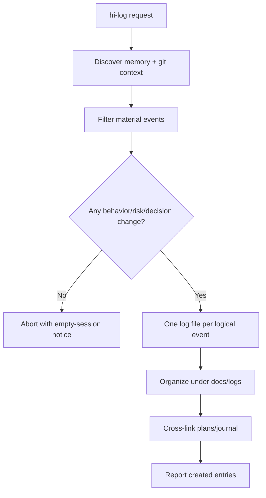
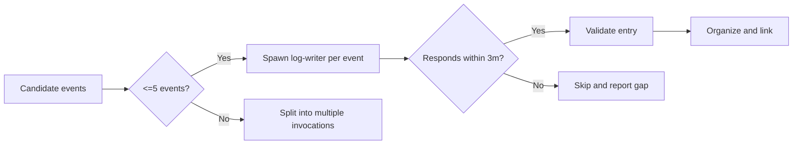
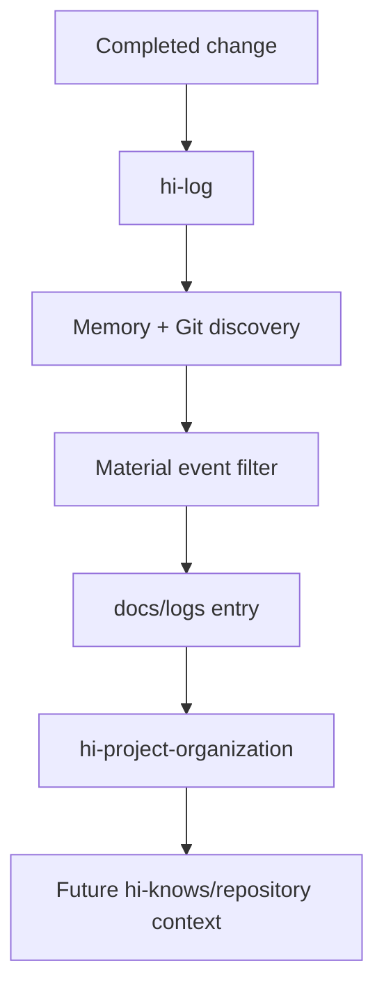

# Hi Log Skill: Complete Guide

> `hi-log` records significant changes, impacts, and decisions within a session or a scope of work. It creates persistent, short logs with specific references — not meaningless daily dumps.

## 1. Objectives

`hi-log` answers:

- What triggered the work?
- What actually changed?
- Which file/commit proves the change?
- Who or what is affected?
- Why was this approach chosen?
- What alternatives were considered?
- What risks/follow-ups remain?

The log is a historical artifact and a decision record. Task/session state may disappear; logs under `./docs/logs/` let others reconstruct the changes later.

## 2. Scope and output

- Output directory: `./docs/logs/`.
- One logical event = one file.
- Filename: `YYYY-MM-DD-<slug>.md`.
- Slug: kebab-case, max 60 characters, no collision with the date prefix.
- Maximum 5 events per invocation.
- The log-writer only reads source; it may create log files and update existing logs when corrections are needed.



## 3. Syntax

```text
/hi-log
/hi-log <topic>
/hi-log <topic> --since <ref>
/hi-log <topic> --scope <dir>
/hi-log <topic> --since <ref> --scope <dir>
```

| Input | Meaning |
|---|---|
| No topic | Summarize the most recent session |
| `<topic>` | Log only one area such as `auth`, `ci`, `release` |
| `--since <ref>` | Only take changes after a Git ref/SHA/date; default 24h |
| `--scope <dir>` | Limit exploration to a directory |

`--since` and `--scope` are filters for discovery, not decorative text in the log.

## 4. Workflow

### Phase 1: Discover

Pull context from:

- claude-mem/recent observations;
- `git diff`;
- `git log`;
- scope/since filters;
- `hi-codebase-research-explorer` if the scope is ambiguous.

The goal is to collect event candidates, not to write a log the moment a diff is seen.

### Phase 2: Filter

Keep events that:

- change behavior;
- fix a risk/bug;
- record an architecture/product/operational decision;
- have impact future readers need to know.

Discard noise:

- trivial formatting;
- regenerate-only commits;
- no-op refactors;
- sessions with no material change.

### Phase 3: Write

Spawn the log-writer per the contract. One file per logical event. Every entry must include:

- Context;
- Change;
- Impact;
- Decision;
- References.

### Phase 4: Organize

Run `/hi-project-organization` to:

- ensure logs live under `./docs/logs/`;
- check naming;
- link plans/journal;
- avoid creating a monolithic daily dump.

## 5. Empty-session gate

> Do not log an empty session.

If there is no material change:

```text
No material changes found in the requested scope/window; no log created.
```

Do not create a file with the content “nothing happened”. That pollutes the history and makes log counts meaningless.

## 6. Log format

```markdown
# <Title> — YYYY-MM-DD
## Context
What triggered this work (bug, request, plan link).
## Change
What changed, with `file:line` references.
## Impact
Who/what is affected. Risk level (low/med/high).
## Decision
Why this approach. Alternatives considered.
## References
- plan: ./plans/<id>/plan.md
- commit: <full sha>
- memory: <obs-id>
```

### 6.1 Context

State the trigger:

- bug/error;
- user request;
- plan/phase;
- incident;
- release/deployment.

### 6.2 Change

Describe the behavior/file that changed. References use `path/to/file.ts:LINE` or a full commit SHA, not just “fixed auth”.

### 6.3 Impact

Required. Record:

- affected users/services/files;
- risk level: `low`, `med`, `high`;
- compatibility/deployment implications;
- known limitations.

### 6.4 Decision

Record the rationale, not just the outcome:

- why this approach;
- which alternatives were rejected;
- constraints/trade-offs;
- remaining assumptions.

### 6.5 References

Cross-link:

- `./plans/<id>/plan.md`;
- full commit SHA;
- memory observation ID;
- issue/release if any.

## 7. Quality contract

- Every entry has all 5 required sections.
- Impact must not be `TBD`.
- File references include a line or a full commit.
- Do not log secrets/plaintext credentials.
- If a section has nothing to say, omit the file if the event is no longer material.
- Cross-link the plan when the change traces back to a plan.
- Do not edit source code/config.

## 8. Git and memory evidence

Discovery should look at summaries before details:

```bash
git log --oneline --decorate -20 -- <path>
git show <commit> --stat --format="%h %s"
git diff -- <scope>
```

Then read the details needed. Git output can be long, so normalize it before synthesis using `git-normalize.js` when the repository has such a script.

Memory helps reveal recent observations, but every important change claim should still have a file/commit reference.

## 9. Timeout and delegation

- Log-writer timeout: 3 minutes per spawn.
- Non-responder: skip, do not retry indefinitely.
- Maximum 5 events/invocation.
- Ambiguous scope: use the explorer first.
- Log-writer is read-only on source; it only creates/updates logs.



## 10. Verify hi-log

- [ ] An empty session creates no file.
- [ ] Each logical event is one file.
- [ ] Filename matches `YYYY-MM-DD-<slug>.md`.
- [ ] Has Context, Change, Impact, Decision, References.
- [ ] Impact has low/med/high.
- [ ] File references have `path:line` or full SHA.
- [ ] No secrets.
- [ ] Plan links use the correct path.
- [ ] Maximum 5 events.
- [ ] Logs live under `docs/logs/` after organization.

## 11. Relationship with other skills



- `hi-craft` calls the log after finalize.
- `hi-plan` may log plan decisions.
- `hi-fix`/`hi-debug` log the root cause and remediation.
- `hi-project-organization` manages location/index.
- `hi-knows` can use logs as historical evidence.

## 12. Example

```markdown
# Refresh token reuse guard — 2026-08-14
## Context
Security follow-up from plans/260814-token-rotation/plan.md.
## Change
Added server-side token-family reuse detection in `src/auth/refresh.ts:84`.
## Impact
Affected browser refresh flow; risk high because replayed tokens now revoke the family.
## Decision
Reuse existing session store instead of adding a second cache. This keeps revocation atomic; a separate cache was rejected because stale state could weaken enforcement.
## References
- plan: ./plans/260814-token-rotation/plan.md
- commit: 0123456789abcdef0123456789abcdef01234567
```

## 13. Limitations

- A log does not replace testing or code review.
- Memory observations may be missing or stale.
- `git diff` does not explain impact by itself; synthesis is needed.
- One large event may require multiple log files by logical boundary.
- Logs are only trustworthy when references are specific and the rationale is preserved.

## 14. Summary

> `hi-log` turns significant changes into small event logs with clear impact and rationale, so the project history keeps decisions rather than just diffs.
