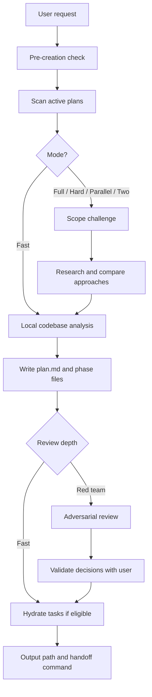
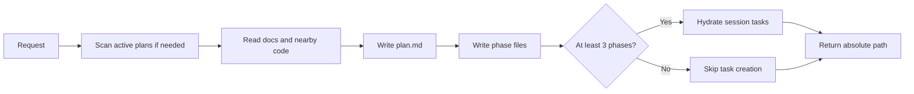
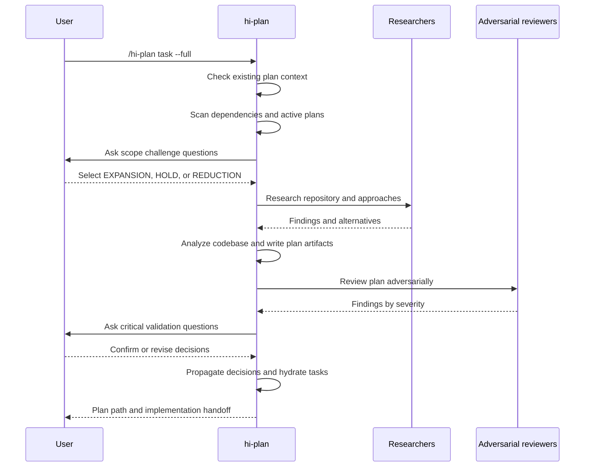
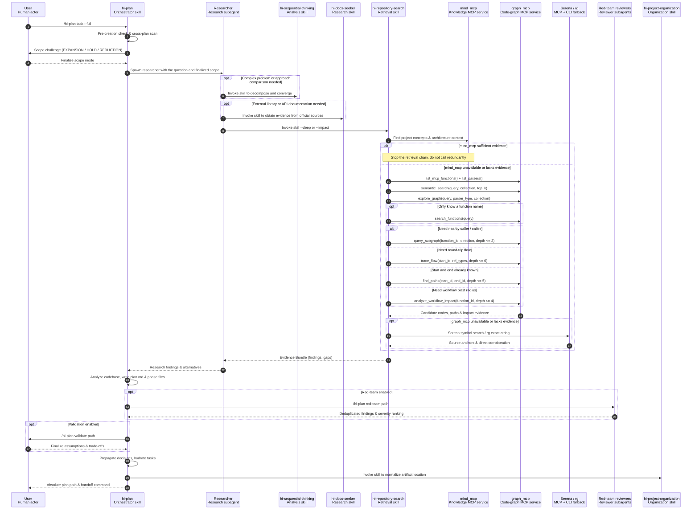
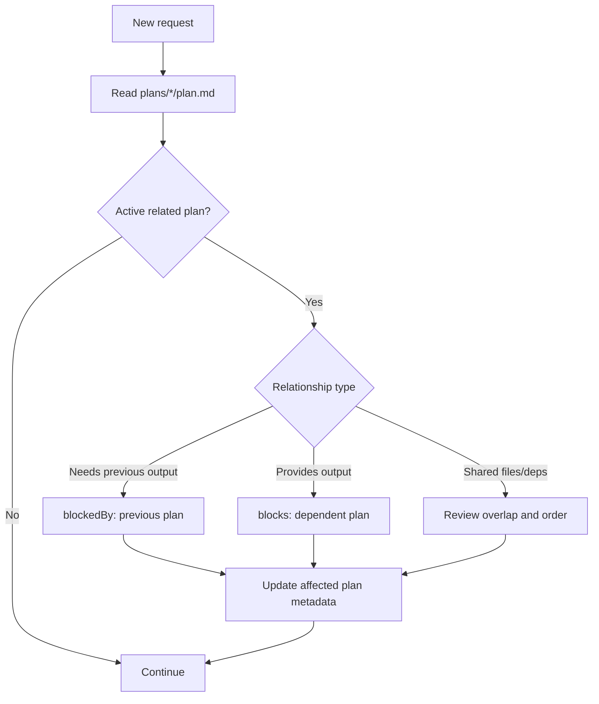
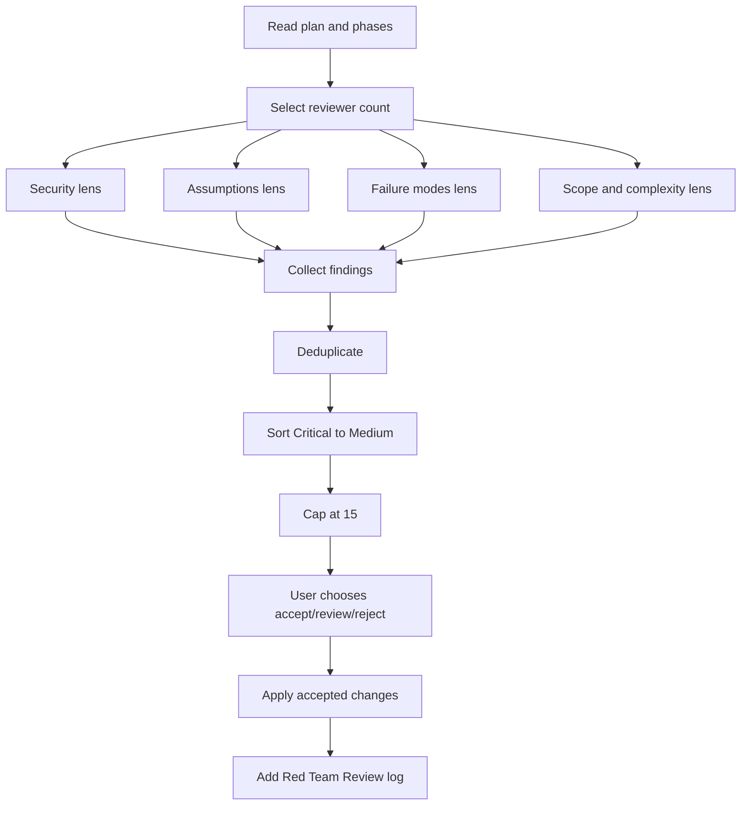
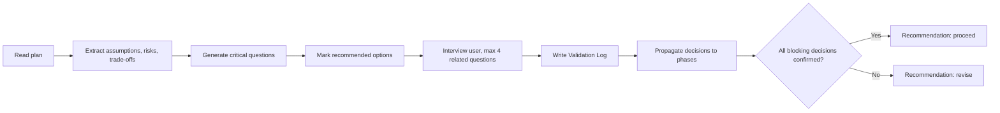
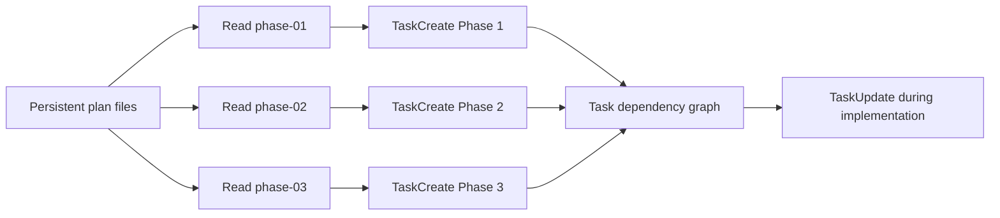
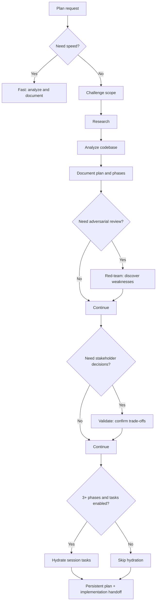

# Hi Plan Skill: Complete Guide

> `hi-plan` is the skill used to turn a technical request into a structured, evidence-based implementation plan with risk checking, which can be handed off to the implementation step. It does not just create a `plan.md` file.

## 1. What problem does Hi Plan solve?

When you receive a request like "add a login feature", many questions must be answered before writing code:

- What functionality already exists and can be reused?
- Which files, modules, APIs or dependencies are affected?
- Is another plan already working on the same code area?
- What is the minimum scope? Which parts should be deferred?
- Which architecture fits and what are the trade-offs?
- Which assumptions could be wrong in production?
- How can we verify the plan is detailed enough for someone else to implement?
- In what order do the implementation tasks depend on each other?

`hi-plan` organizes those questions into a multi-step workflow. The final output is a group of persistent plan files that `hi-craft` or a developer can use as an implementation contract.

## 2. Overall mental model

You can view `hi-plan` as a pipeline of four layers:

1. **Context**: understand the request, the repository and the existing plans.
2. **Design**: determine scope, research approaches and design phases.
3. **Challenge**: find risks with red-team and confirm decisions with validation.
4. **Handoff**: write artifacts, hydrate session tasks and hand off to implementation.



## 3. Syntax

### 3.1 Creating a plan

```text
/hi-plan <task>
/hi-plan <task> --full
/hi-plan <task> --hard
/hi-plan <task> --parallel
/hi-plan <task> --two
/hi-plan <task> --no-tasks
```

`<task>` is a description of the goal to be planned. The plan is created in the **current working project directory**, not in the user's home directory.

### 3.2 Subcommands on an existing plan

```text
/hi-plan red-team <path-to-plan>
/hi-plan validate <path-to-plan>
/hi-plan archive
```

- `red-team` adversarially reviews an existing plan.
- `validate` interviews the user/stakeholder to finalize assumptions and trade-offs.
- `archive` cleans up completed or selected plans for storage.

## 4. Flags and modes

### 4.1 Summary table

| Mode | Research | Red team | Validation | Purpose |
|---|---|---|---:|---:|---|
| Default / fast | No | No | No | Quickly create a plan based on local context |
| `--full` | 1 researcher | Per full flow | Per full flow | Full pipeline from scope to review |
| `--hard` | 2 researchers | Yes | Optional | Requires deep analysis and rebuttal |
| `--parallel` | 2 researchers | Yes | Optional | Parallel research, suitable for large problems |
| `--two` | 2+ researchers | After choosing the approach | After choosing the approach | Compare multiple directions before deciding |
| `--no-tasks` | Per mode | Per mode | Per mode | Do not create session-scoped tasks after writing the plan |

`--no-tasks` is a modifier that can be combined with other modes, for example:

```text
/hi-plan add audit logging --full --no-tasks
```

### 4.2 Fast mode

Fast mode is the default when no flag is passed. It skips research, scope challenge, red-team and validation to prioritize speed.

The actual flow:



Fast mode is suitable when:

- the request is small or already clear;
- the user needs a quick draft;
- research was already provided;
- the plan will be manually reviewed at a later step.

Fast mode **does not mean the plan has been comprehensively verified**. It only means the extended review steps are skipped.

### 4.3 `--full`

The full flow adds steps before and after writing the plan:

1. Pre-creation check.
2. Cross-plan scan.
3. Scope challenge.
4. Research.
5. Codebase analysis.
6. Write `plan.md` and `phase-*.md`.
7. Red-team review.
8. Validation interview.
9. Hydrate tasks if enough phases.
10. Return the output path and craft handoff.



#### 4.3.1 Full sequence down to skill and MCP functions

In the diagram above, `Researchers` is an **agent role**, not the name of a skill. Per the current contract, a researcher can invoke the three skills explicitly named in the research phase:

- `hi-repository-search` to obtain evidence from the repository;
- `hi-docs-seeker` to check external documentation;
- `hi-sequential-thinking` when decomposing or comparing a complex problem is needed.

`hi-repository-search` is the layer that routes down to `mind_mcp`, `graph_mcp`, Serena and `rg`. The `graph_mcp` functions in the branch below are **intent-based**; not every function is always called in a single run.



##### 4.3.1.1 Actor types

In the sequence diagram, the first line is the actor identity and the second line is the actor type/title. `Skill` is a behavior package loaded by the current agent or a subagent to execute; `SubAgent` is a separate agent runtime spawned with a specific scope.

| Actor | Type / title | Runtime behavior | SubAgent? |
|---|---|---|---:|
| User | Human actor | Sends planning requests, chooses scope and confirms trade-offs | No |
| `hi-plan` | **Orchestrator skill** | Runs in the current/root agent, holds workflow state and synthesizes the plan | No |
| Researcher | Research subagent | Spawned by `hi-plan` to investigate one approach or one research lens | **Yes** |
| `hi-sequential-thinking` | Analysis skill | Runs as a capability inside the researcher when decomposing or comparing approaches | No |
| `hi-docs-seeker` | Research skill | Runs inside the researcher to obtain documentation from official sources | No |
| `hi-repository-search` | Retrieval skill | Runs inside the researcher to gather repository evidence and coordinate the retrieval chain | Not in this flow |
| `mind_mcp` | Knowledge MCP service | Provides project documents, concepts and architecture context | No |
| `graph_mcp` | Code-graph MCP service | Provides semantic candidates, relationships, paths and impact evidence | No |
| Serena / `rg` | MCP + CLI fallback tools | Serena confirms symbol/reference; `rg` handles the final exact-string gap | No |
| Red-team reviewers | Reviewer subagents | Spawned by the `red-team` subcommand along security, assumption, failure or scope lenses | **Yes** |
| `hi-project-organization` | Organization skill | Invoked by the current agent to normalize artifact location and structure | No |

An actor bearing a skill name does not imply a SubAgent. In this flow, only `Researcher` and `Red-team reviewers` are separate agent runtimes; the remaining skills run in the current/root agent or inside the existing researcher subagent.

The boundaries that must be understood correctly:

- A Researcher does **not call** `hi-codebase-research-explorer` by default; the `hi-plan` contract currently does not declare that routing.
- Red-team reviewers are agents running hostile lenses in `/hi-plan red-team`; the contract does not say reviewer automatically calls `hi-security`.
- `semantic_search` produces candidates. Relationships are only considered evidence after `explore_graph`, graph traversal or source corroboration.
- `query_subgraph`, `trace_flow`, `find_paths` and `analyze_workflow_impact` are choice branches based on the question; they are not all run sequentially.
- When the runtime schema differs from the documentation, the response from `list_mcp_functions()` is authoritative; do not hardcode old parameters.

Reference sources: [`hi-plan/SKILL.md`](../../hi-plan/SKILL.md), [`research-phase.md`](../../hi-plan/references/research-phase.md), [`red-team-workflow.md`](../../hi-plan/references/red-team-workflow.md), [`hi-repository-search/SKILL.md`](../../hi-repository-search/SKILL.md), and [`code_graph.md`](../../hi-repository-search/references/code_graph.md).

### 4.4 `--hard`

`--hard` uses two researchers and enables red-team. This mode is suitable for:

- cross-module changes;
- authentication, authorization, payment, data migration;
- plans with many phases or many dependencies;
- changes with high production risk.

Validation can still be run afterward when the user needs to finalize business or architecture choices.

### 4.5 `--parallel`

`--parallel` also uses two researchers and red-team, but emphasizes parallel investigation. Each researcher should have a different lens, for example:

- researcher A: current code path, dependencies and implementation patterns;
- researcher B: alternative architecture, failure modes and documentation.

Parallel does not mean "everything runs at once". Steps that need a decision first, such as scope challenge, and steps that require synthesis, such as plan synthesis, must still be ordered.

### 4.6 `--two`

`--two` is for cases where you should not commit to one architecture right away. The workflow creates two or more approaches, then:

1. presents the approaches;
2. states trade-offs, costs and risks;
3. lets the user choose;
4. red-teams and validates the chosen approach;
5. writes the plan according to the final decision.

Do not use `--two` just to create more documentation. It is valuable when the architecture choice is genuinely unclear.

### 4.7 `--no-tasks`

By default, `hi-plan` tries to convert phases into tasks in the current session's task manager. `--no-tasks` skips this step.

Use this flag when:

- only an artifact is needed for review;
- the current task manager does not support it;
- the plan has few phases;
- you want to hydrate tasks in another session.

Important notes:

- plan files are **persistent**;
- tasks are **session-scoped** and may disappear when the session ends;
- the checklists in phase files are a source that can re-hydrate tasks in a later session.

## 5. Internal steps

### Step 1: Pre-creation check

The skill determines the context of the request before writing:

- the current working project directory;
- existing plan directories;
- which plans are pending/in progress;
- whether a task is related to or inherits output from another plan;
- whether instructions such as `docs/development-rules.md` must be followed.

If the context is unclear, the workflow may ask the user to clarify instead of creating a plan in the wrong direction.

### Step 2: Cross-plan dependency scan

The skill scans `plans/*/plan.md` and focuses on plans that are not yet `completed` or `cancelled`.

It looks for three kinds of relationships:

| Relationship | Meaning | Handling |
|---|---|---|
| `blockedBy` | The new plan needs output from a previous plan | Record the previous plan in `blockedBy` |
| `blocks` | The new plan produces output for another plan | Record the related plan in `blocks` |
| Overlap | Two plans modify the same file, module or dependency | Evaluate the order and update both if needed |

Dependencies must be recorded in both directions where appropriate. If only one side is recorded, the reader of the other plan will not know there is a new constraint.



### Step 3: Scope challenge

Scope challenge runs before research in the extended modes. It forces the planner to answer three questions:

1. **What already exists?** What can be reused?
2. **What's the minimum change set?** Which parts are mandatory and which can be deferred?
3. **Complexity check** If the plan exceeds 8 files, 2 new classes or 3 phases, what is the reason?

Then choose a direction:

| Choice | Behavior |
|---|---|
| `EXPANSION` | Allows `--hard` or `--two`, researches alternatives and stretch goals |
| `HOLD` | Keeps the scope, focuses on edge cases and test coverage |
| `REDUCTION` | Uses the minimal version, defers non-blocking parts |

The scope decision must be kept throughout the workflow. Do not silently expand the scope after choosing `REDUCTION`.

### Step 4: Research

Research is skipped in fast mode or when researcher reports already exist. For modes that need research, the investigation directions can include:

- scan the codebase and find the current implementation;
- read the related documentation;
- use sequential thinking for complex problems;
- look at Git history, issues, PRs or CI when needed;
- compare multiple approaches;
- record edge cases, security and performance implications.

Research is not a step for collecting as much information as possible. The goal is to provide evidence for the decisions in the plan.

### Step 5: Codebase analysis

This step connects research with implementation. The plan needs to indicate:

- the related module/file;
- the entry points of the behavior;
- the data flow and dependencies;
- the current patterns to reuse;
- the files to create/modify/delete;
- the test and verification points;
- remaining open risks or assumptions.

If a file is only forwarding or wiring, you must trace to the abstraction that directly decides the behavior instead of stopping at the intermediate file.

### Step 6: Plan documentation

A minimal plan consists of:

```text
plans/{plan-dir}/
├── plan.md
├── phase-01-name.md
└── phase-02-name.md
```

`plan.md` is the index and the high-level contract. Each `phase-*.md` is a specific implementation unit.

## 6. Artifact and output structure

### 6.1 `plan.md`

Standard frontmatter:

```yaml
title: "Brief plan title"
description: "One-sentence summary"
status: pending
priority: P2
effort: 4h
issue: 74
branch: kai/feat/feature-name
tags: [frontend, api]
blockedBy: []
blocks: []
created: 2025-12-16
```

Some fields can be auto-populated:

- `title`: from the task;
- `description`: the first sentence of the Overview;
- `status`: defaults to `pending`;
- `priority`: from the user or `P2`;
- `effort`: the total effort of the phases;
- `issue`: from the branch if available;
- `branch`: the current branch;
- `tags`: inferred from keywords;
- `blockedBy`/`blocks`: from the cross-plan scan;
- `created`: the current date.

The body of `plan.md` should be short, usually under 80 lines:

```markdown
# Plan

## Overview

## Phases
| Phase | Name | Status |
|---|---|---|
| 1 | [Setup](./phase-01-setup.md) | Pending |
```

After review, the file may contain additional sections:

- `## Red Team Review`;
- `## Validation Log`;
- decisions about rejected/accepted findings;
- unresolved questions or revised assumptions.

### 6.2 `phase-*.md`

Each phase needs enough information for another developer to implement without guessing:

1. context links;
2. overview, priority, status, description;
3. key insights from research;
4. functional and non-functional requirements;
5. architecture, components, data flow;
6. related code: create/modify/delete;
7. concrete numbered implementation steps;
8. success criteria / definition of done;
9. risk assessment and mitigation.

### 6.3 Final workflow output

Typical output includes:

- the absolute path to the plan directory;
- the list of created phases;
- the task hydration status or the reason for skipping;
- if a full flow ran: the review/validation summary;
- the craft handoff command to move to the implementation step.

The plan is the persistent output on the filesystem. The task list is only a secondary output in the current session.

## 7. How are red-team and validate different?

### 7.1 Red-team: find problems

Command:

```text
/hi-plan red-team <path>
```

Steps:

1. read `plan.md` and every `phase-*.md`;
2. scale the reviewer count to the number of phases;
3. run the adversarial lenses;
4. gather, deduplicate and rank by severity;
5. cap at a maximum of 15 findings;
6. propose `Accept` or `Reject`;
7. ask the user how to handle them;
8. apply accepted findings to the phase files;
9. add `## Red Team Review` to `plan.md`.

Reviewer lenses:

| Lens | Main question |
|---|---|
| Security adversary | Are there injections, auth bypasses or data exposure? |
| Assumption destroyer | Which assumption is unsupported or could be wrong? |
| Failure mode analyst | What breaks in production? How do timeout, retry, partial failure behave? |
| Scope/complexity critic | Is there over-engineering or scope creep? |

Reviewer count by phase:

| Number of phases | Reviewers |
|---:|---:|
| 1-2 | 2: Security + Assumptions |
| 3-5 | 3: add Failure Modes |
| 6+ | 4: add Scope/Complexity |



Red-team is not a runtime test and does not decide on behalf of the user. It produces evidence and proposals; user review is a separate gate.

### 7.2 Validate: finalize decisions

Command:

```text
/hi-plan validate <path>
```

Steps:

1. read the plan and phases;
2. find assumptions, risks and trade-offs;
3. create critical questions;
4. mark a recommended option for each question;
5. ask the user in groups, at most 4 questions at a time;
6. record the answers in `## Validation Log`;
7. propagate decisions into the affected phases;
8. conclude with `proceed` or `revise`.

Red-team asks: **"Where could this plan be wrong?"**

Validate asks: **"Given the available choices, which one do the stakeholders confirm?"**

Example:

- Red-team surfaces the assumption that an API always returns a valid response.
- Validate asks whether malformed responses need handling, how many retries, and which latency trade-off is acceptable.



## 8. How to verify?

### 8.1 Verification at the workflow level

`hi-plan` is not a test runner. In the current documentation, "verify" mainly means checking the completeness and consistency of the planning artifact across the gates:

| Gate | Check |
|---|---|
| Context gate | Were the correct project and active plans read? |
| Dependency gate | Were `blockedBy`/`blocks` and overlaps identified? |
| Scope gate | Was the scope constrained and was a reason given for complexity? |
| Research gate | Do the decisions have evidence or comparison? |
| Architecture gate | Are data flow, module ownership and related code clear? |
| Red-team gate | Were security, assumptions and failure modes challenged? |
| Validation gate | Did stakeholders confirm the blocking trade-offs? |
| Handoff gate | Do the phases have implementation steps and success criteria? |
| Task gate | Do the tasks map correctly to phases and dependencies? |

### 8.2 Manual verify checklist

Before handing off, the reviewer should check:

- whether `plan.md` has valid frontmatter;
- whether every link to `phase-*.md` exists;
- whether each phase has specific success criteria;
- whether related code distinguishes create/modify/delete;
- whether phase dependencies are in a sensible order;
- whether the total effort matches the phases;
- whether important assumptions have an owner or a validation decision;
- whether accepted red-team findings have propagated;
- whether the `Validation Log` records decisions and impact;
- whether the plan contains implementation details conflicting with the codebase;
- whether the output path is inside the current project, not the home directory.

### 8.3 Verification after moving to implementation

`hi-plan` creates a plan, it does not implement the code. After the handoff, an implementation skill such as `hi-craft` runs:

```text
Plan -> Implement -> Test -> Finalize
```

Therefore you must distinguish:

- `hi-plan` verifies **plan readiness**;
- `hi-craft` or a developer verifies **behavior with tests, lint, typecheck, build**;
- runtime/CI verifies **integration and production constraints**.

## 9. Task hydration and dependency

When there are 3 or more phases, the workflow can create one task per phase. A task should have:

- `subject`: imperative, under 60 characters;
- `activeForm`: the continuous form;
- `description`: a concrete deliverable and a link to the phase;
- metadata: phase, priority, effort, plan directory, phase file.

Mapping:



Dependency example:

```text
Phase 1: Database migration
Phase 2: API changes        blockedBy: Phase 1
Phase 3: UI integration     blockedBy: Phase 2
```

If you move to a new session, the task list may be empty. In that case re-hydrate from the checkboxes and unfinished phase files.

## 10. Archive workflow

Command:

```text
/hi-plan archive
```

Archive is not automatically the same as delete. The workflow must:

1. read `plan.md` and the beginning of the phase files;
2. ask whether to log with `hi-log`;
3. ask whether to archive a specific plan or all completed plans;
4. ask whether to move into `plans/archive` or delete permanently;
5. carry out the choice;
6. optionally stage/commit/push if the user requests it.

Output:

- the number of archived/deleted plans;
- a table of title, status, created date;
- the log/journal entries created.

## 11. When to use which mode?

| Situation | Recommendation |
|---|---|
| A small change with a clear pattern | Fast |
| An ordinary feature needing research and review | `--full` |
| High security or production risk | `--hard` |
| Many independent investigation directions | `--parallel` |
| You do not yet know which architecture to choose | `--two` |
| You only want an artifact, no session tasks | `--no-tasks` |
| A plan exists and you want to break its assumptions | `red-team` |
| A plan exists but stakeholders must finalize trade-offs | `validate` |
| A plan is finished and the workspace needs cleanup | `archive` |

## 12. Limitations and points to understand correctly

### 12.1 A full flow does not replace runtime testing

Even a plan with research, red-team and validate still does not prove the code runs correctly. Testing is needed at the implementation step.

### 12.2 Red-team and validate need user participation

Red-team produces findings and proposals, but the user chooses apply/review/reject. Validate needs stakeholder answers; if there is no answer for a blocking decision, the recommendation must be `revise`.

### 12.3 Tasks are not the only source of truth

The task manager is session-scoped. The artifacts in `plans/` are the persistent part that can be reviewed, version-controlled and re-hydrated.

### 12.4 Scope can change in a controlled way

Scope changes should be recorded in the plan, along with the reason and the impact on phases, effort, dependencies and success criteria. Do not silently add work within a phase.

### 12.5 The current documentation has one point that needs interpretation

The mode table describes red-team in `--full` as "Optional", while the full process flow lists red-team and validate as steps of the flow. When operating, you must understand:

- `--hard` and `--parallel` definitely require red-team;
- the full flow is designed to run red-team/validate after creating the plan;
- if you want to skip it, you must state the reason clearly or use fast mode instead of calling it full verification.

## 13. End-to-end example

Suppose the request is: "Add an audit log for every user permission change".

```text
/hi-plan add audit logs for user permission changes --hard
```

The expected workflow:

1. Scan active plans to find related migration or auth plans.
2. Scope challenge: only log permission mutations, not every user event yet.
3. Research: find the current auth service, event bus, schema and retention policy.
4. Codebase analysis: determine mutation entry points and transaction boundaries.
5. Write `plan.md` with phases for schema, backend emission, consumer/storage and tests.
6. Red-team finds data exposure, actor spoofing, missing transaction consistency and log injection.
7. Validate asks about retention, PII masking, delivery guarantee and query requirements.
8. Propagate the answers into the phases.
9. Hydrate tasks if there are 3 or more phases.
10. Hand off the path to implementation.

The plan's success criteria should not just be "audit log added". They need to be more specific, for example:

- every permission mutation path is identified;
- the event has actor, target, action, timestamp and correlation ID;
- sensitive fields are masked;
- the failure policy is clearly decided;
- tests cover duplicate, retry, transaction rollback and unauthorized mutation;
- phase dependencies and the migration rollout are recorded.

## 14. Quick summary



The shortest way to remember it:

> `hi-plan` does not just answer "what to do", it also tries to answer "why do it this way, what does it affect, what could go wrong, who must confirm, and how to hand off so someone else can implement it".