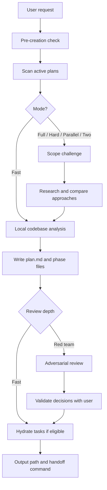
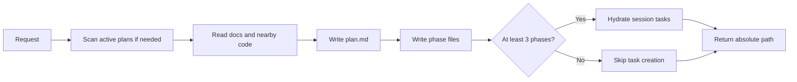
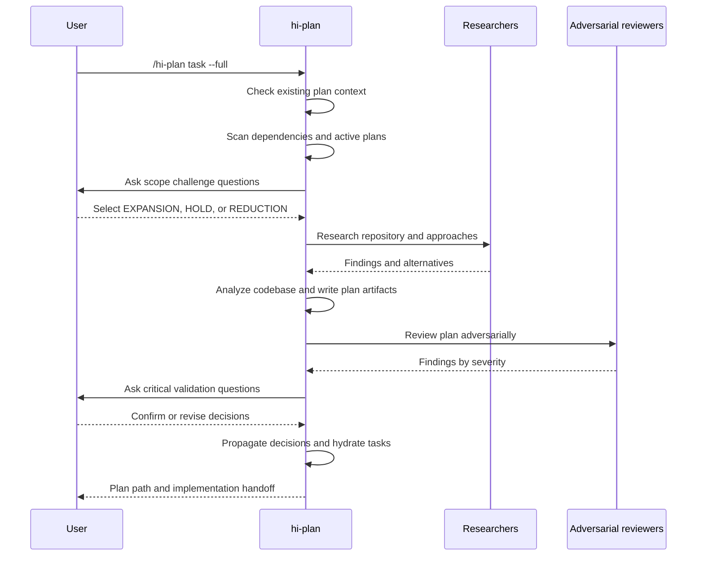
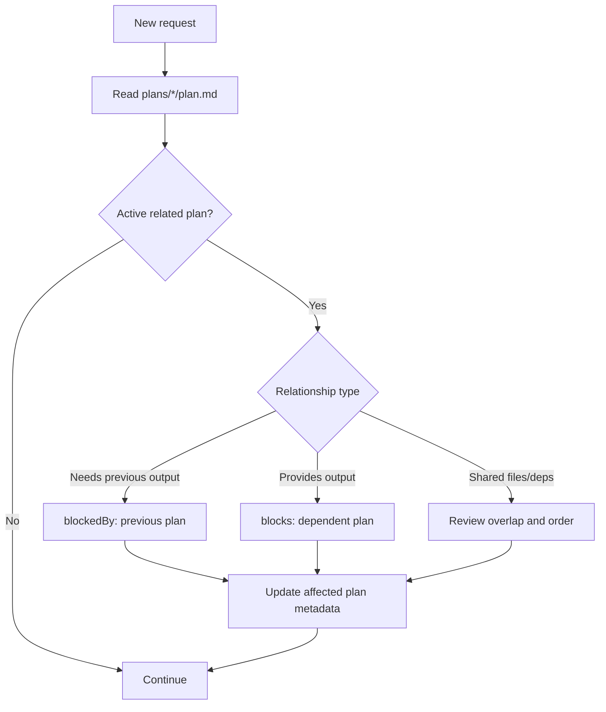
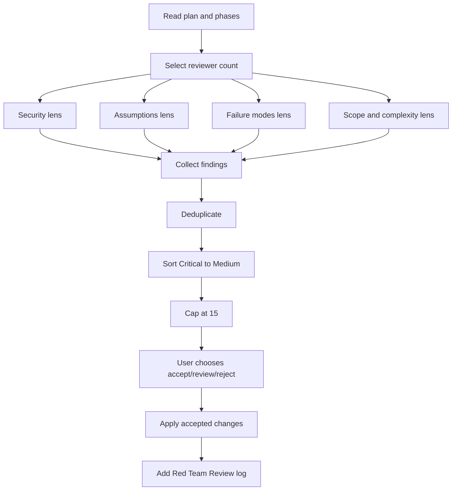
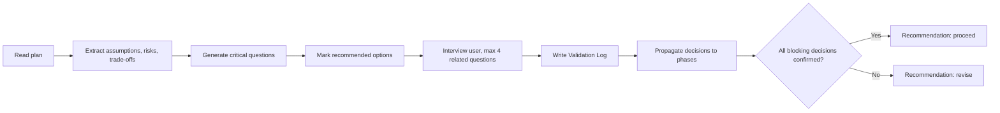
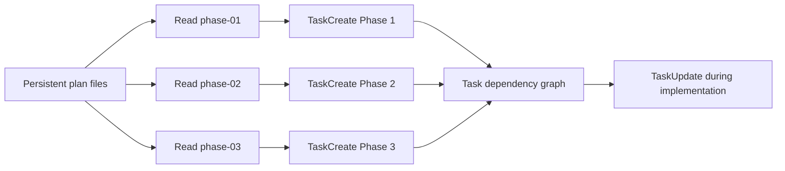
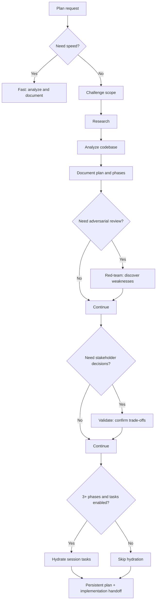

# Hi Plan Skill: Complete Guide

> `hi-plan` is the skill that turns a technical request into a structured, evidence-based implementation plan with risk checks, ready to be handed off to the implementation step. It does not merely produce a `plan.md` file.

## 1. What problem does Hi Plan solve?

When receiving a request like "add a login feature", many questions must be answered before writing code:

- Which functionality already exists and can be reused?
- Which files, modules, APIs, or dependencies are affected?
- Is there another plan working on the same code area?
- What is the minimum scope? Which parts should be deferred?
- Which architecture fits, and what are the trade-offs?
- Which assumptions could be wrong in production?
- How do we verify that the plan is detailed enough for someone else to implement?
- In what order do the implementation tasks need to depend on each other?

`hi-plan` organizes those questions into a multi-step workflow. The final output is a set of persistent plan files that `hi-craft` or a developer can use as an implementation contract.

## 2. Overall mental model

You can think of `hi-plan` as a pipeline of four layers:

1. **Context**: understand the request, the repository, and existing plans.
2. **Design**: define scope, research options, and design phases.
3. **Challenge**: find risks through red-team and confirm decisions through validate.
4. **Handoff**: write artifacts, hydrate tasks in the session, and hand off to implementation.



## 3. Syntax

### 3.1 Creating a plan

```text
/hi-plan <task>
/hi-plan <task> --full
/hi-plan <task> --hard
/hi-plan <task> --parallel
/hi-plan <task> --two
/hi-plan <task> --no-tasks
```

`<task>` is the description of the goal to be planned. The plan is created in the **current working project directory**, not in the user's home directory.

### 3.2 Subcommands on an existing plan

```text
/hi-plan red-team <path-to-plan>
/hi-plan validate <path-to-plan>
/hi-plan archive
```

- `red-team` adversarially reviews an existing plan.
- `validate` interviews the user/stakeholder to finalize assumptions and trade-offs.
- `archive` cleans up plans that are completed or selected for archiving.

## 4. Flags and modes

### 4.1 Summary table

| Mode | Research | Red team | Validation | Purpose |
|---|---:|---:|---:|---|
| Default / fast | No | No | No | Quickly create a plan based on local context |
| `--full` | 1 researcher | Full flow | Full flow | Full pipeline from scope to review |
| `--hard` | 2 researchers | Yes | Optional | Requires deep analysis and critique |
| `--parallel` | 2 researchers | Yes | Optional | Parallel research, suitable for large problems |
| `--two` | 2+ researchers | After approach is chosen | After approach is chosen | Compare multiple directions before committing |
| `--no-tasks` | Per mode | Per mode | Per mode | Do not create session-scoped tasks after writing the plan |

`--no-tasks` is a modifier and can be combined with other modes, for example:

```text
/hi-plan add audit logging --full --no-tasks
```

### 4.2 Fast mode

Fast mode is the default when no flag is passed. It skips research, scope challenge, red-team, and validation to prioritize speed.

Actual flow:



Fast mode is suitable when:

- the request is small or already clear;
- the user needs a quick draft;
- research has already been provided beforehand;
- the plan will be manually reviewed in a later step.

Fast mode **does not mean the plan has been comprehensively verified**. It only means that the extended review steps are skipped.

### 4.3 `--full`

The full flow adds steps before and after writing the plan:

1. Pre-creation check.
2. Cross-plan scan.
3. Scope challenge.
4. Research.
5. Codebase analysis.
6. Write `plan.md` and `phase-*.md`.
7. Red-team review.
8. Validation interview.
9. Hydrate tasks if the phase count is sufficient.
10. Return the output path and craft the handoff.



### 4.4 `--hard`

`--hard` uses two researchers and enables red-team. This mode is suitable for:

- cross-module changes;
- authentication, authorization, payment, data migration;
- plans with many phases or dependencies;
- changes with high production risk.

Validation can still be run afterwards when user confirmation of business or architecture choices is needed.

### 4.5 `--parallel`

`--parallel` also uses two researchers and red-team, but emphasizes parallel investigation. Each researcher should have a different lens, for example:

- researcher A: current code paths, dependencies, and implementation patterns;
- researcher B: alternative architectures, failure modes, and documentation.

Parallel does not mean "everything runs in parallel". Steps that require prior decisions, such as scope challenge, and steps that require synthesis, such as plan synthesis, must still be ordered.

### 4.6 `--two`

`--two` is for cases where committing to an architecture right away is premature. The workflow creates two or more approaches, then:

1. presents the approaches;
2. states trade-offs, costs, and risks;
3. lets the user choose;
4. red-teams and validates the chosen approach;
5. writes the plan according to the final decision.

`--two` should not be used merely to generate extra documentation. It is valuable when the architecture choice is genuinely unclear.

### 4.7 `--no-tasks`

By default, `hi-plan` attempts to convert phases into tasks in the current session's task manager. `--no-tasks` skips this step.

Use this flag when:

- only artifacts are needed for review;
- the current task manager does not support it;
- the plan has few phases;
- tasks should be hydrated in a different session.

Important notes:

- plan files are **persistent**;
- tasks are **session-scoped** and can disappear when the session ends;
- the checklists in phase files are the source for re-hydrating tasks in a later session.

## 5. Internal steps

### Step 1: Pre-creation check

The skill determines the request context before writing:

- current working project directory;
- existing plan directory;
- which plans are pending/in progress;
- whether the task is related to or inherits output from another plan;
- whether there are instructions such as `docs/development-rules.md` that must be followed.

If the context is unclear, the workflow may ask the user to clarify instead of creating a plan that goes in the wrong direction.

### Step 2: Cross-plan dependency scan

The skill scans `plans/*/plan.md` and focuses on plans that are not yet `completed` or `cancelled`.

It looks for three types of relationships:

| Relationship | Meaning | Handling |
|---|---|---|
| `blockedBy` | The new plan needs output from an earlier plan | Record the earlier plan in `blockedBy` |
| `blocks` | The new plan produces output for another plan | Record the related plan in `blocks` |
| Overlap | Two plans modify the same file, module, or dependency | Evaluate ordering and update both if needed |

Dependencies must be recorded bidirectionally where appropriate. If only one side is recorded, readers of the other plan will not know about the new constraint.



### Step 3: Scope challenge

Scope challenge runs before research in the extended modes. It forces the plan author to answer three questions:

1. **What already exists?** What can be reused?
2. **What's the minimum change set?** Which parts are mandatory, and which can be deferred?
3. **Complexity check** If it exceeds 8 files, 2 new classes, or 3 phases, what is the reason?

Then choose one direction:

| Choice | Behavior |
|---|---|
| `EXPANSION` | Allows `--hard` or `--two`, researches alternatives and stretch goals |
| `HOLD` | Keeps scope, focuses on edge cases and test coverage |
| `REDUCTION` | Uses the minimal version, defers non-blocking parts |

The scope decision must be maintained throughout the workflow. Scope must not be silently expanded after `REDUCTION` has been chosen.

### Step 4: Research

Research is skipped in fast mode or when researcher reports already exist. For modes that require research, possible investigation directions include:

- scan the codebase and find current implementations;
- read relevant documentation;
- use sequential thinking for complex problems;
- review Git history, issues, PRs, or CI when needed;
- compare multiple approaches;
- record edge cases, security and performance implications.

Research is not a step for gathering as much information as possible. The goal is to provide evidence for the decisions in the plan.

### Step 5: Codebase analysis

This is the step that bridges research and implementation. The plan needs to identify:

- related modules/files;
- entry points of the behavior;
- data flow and dependencies;
- current patterns that should be reused;
- files to create/modify/delete;
- tests and verification points;
- open risks or assumptions.

If a file is only forwarding or wiring, trace through to the abstraction that directly determines behavior instead of stopping at the intermediate file.

### Step 6: Plan documentation

A minimal plan consists of:

```text
plans/{plan-dir}/
├── plan.md
├── phase-01-name.md
└── phase-02-name.md
```

`plan.md` is the index and high-level contract. Each `phase-*.md` is a concrete implementation unit.

## 6. Artifact structure and output

### 6.1 `plan.md`

Standard frontmatter:

```yaml
title: "Brief plan title"
description: "One-sentence summary"
status: pending
priority: P2
effort: 4h
issue: 74
branch: kai/feat/feature-name
tags: [frontend, api]
blockedBy: []
blocks: []
created: 2025-12-16
```

Some fields can be auto-populated:

- `title`: from the task;
- `description`: first sentence of the Overview;
- `status`: defaults to `pending`;
- `priority`: from the user or `P2`;
- `effort`: total effort of the phases;
- `issue`: from the branch if any;
- `branch`: current branch;
- `tags`: inferred from keywords;
- `blockedBy`/`blocks`: from the cross-plan scan;
- `created`: current date.

The body of `plan.md` should be short, usually under 80 lines:

```markdown
# Plan

## Overview

## Phases
| Phase | Name | Status |
|---|---|---|
| 1 | [Setup](./phase-01-setup.md) | Pending |
```

After review, the file may have additional sections:

- `## Red Team Review`;
- `## Validation Log`;
- decisions on rejected/accepted findings;
- unresolved questions or revised assumptions.

### 6.2 `phase-*.md`

Each phase needs enough information for another developer to implement without guessing:

1. context links;
2. overview, priority, status, description;
3. key insights from research;
4. functional and non-functional requirements;
5. architecture, components, data flow;
6. related code: create/modify/delete;
7. specific numbered implementation steps;
8. success criteria / definition of done;
9. risk assessment and mitigation.

### 6.3 Final workflow output

Typical output includes:

- absolute path to the plan directory;
- list of created phases;
- task hydration status or reason for skipping;
- if a full flow ran: review/validation summary;
- craft handoff command to move to the implementation step.

The plan is persistent output on the filesystem. The task list is only auxiliary output in the current session.

## 7. How are red-team and validate different?

### 7.1 Red-team: find problems

Command:

```text
/hi-plan red-team <path>
```

Steps:

1. read `plan.md` and every `phase-*.md`;
2. scale the number of reviewers to the number of phases;
3. run the adversarial lenses;
4. collect, deduplicate, and rank by severity;
5. cap at 15 findings;
6. propose `Accept` or `Reject`;
7. ask the user how to handle them;
8. apply accepted findings to the phase files;
9. add `## Red Team Review` to `plan.md`.

Reviewer lenses:

| Lens | Primary question |
|---|---|
| Security adversary | Are there injection, auth bypass, or data exposure issues? |
| Assumption destroyer | Which assumptions have no evidence or could be wrong? |
| Failure mode analyst | What breaks in production? What about timeout, retry, partial failure? |
| Scope/complexity critic | Is there over-engineering or scope creep? |

Reviewers by phase count:

| Number of phases | Reviewers |
|---:|---:|
| 1-2 | 2: Security + Assumptions |
| 3-5 | 3: add Failure Modes |
| 6+ | 4: add Scope/Complexity |



Red-team is not runtime testing and does not make decisions on the user's behalf. It produces evidence and recommendations; user review is a separate gate.

### 7.2 Validate: finalize decisions

Command:

```text
/hi-plan validate <path>
```

Steps:

1. read the plan and phases;
2. find assumptions, risks, and trade-offs;
3. create critical questions;
4. mark a recommended option for each question;
5. ask the user in groups, at most 4 questions at a time;
6. record the answers in `## Validation Log`;
7. propagate decisions into the affected phases;
8. conclude with `proceed` or `revise`.

Red-team asks: **"Where could this plan go wrong?"**

Validate asks: **"Given the available options, which one do the stakeholders confirm?"**

Example:

- Red-team discovers the assumption that the API always returns valid responses.
- Validate asks whether malformed responses need handling, how many retries, and which latency trade-off is acceptable.



## 8. How to verify?

### 8.1 Verify at the workflow level

`hi-plan` is not a test runner. In the current documentation, "verify" mainly means checking the completeness and consistency of the planning artifact through gates:

| Gate | Check |
|---|---|
| Context gate | Was the correct project and the active plans read? |
| Dependency gate | Were `blockedBy`/`blocks` and overlaps identified? |
| Scope gate | Is the scope constrained with a reason for the complexity? |
| Research gate | Do the decisions have evidence or comparison? |
| Architecture gate | Are data flow, module ownership, and related code clear? |
| Red-team gate | Were security, assumptions, and failure modes challenged? |
| Validation gate | Did stakeholders confirm blocking trade-offs? |
| Handoff gate | Do phases have implementation steps and success criteria? |
| Task gate | Do tasks map correctly to phases and dependencies? |

### 8.2 Manual verification checklist

Before handoff, the reviewer should check:

- whether `plan.md` has valid frontmatter;
- whether every link to `phase-*.md` exists;
- whether each phase has concrete success criteria;
- whether related code distinguishes create/modify/delete;
- whether phase dependencies are in a sensible order;
- whether total effort matches the phases;
- whether important assumptions have an owner or a validation decision;
- whether accepted red-team findings have been propagated;
- whether the `Validation Log` records decisions and their impact;
- whether the plan contains no implementation details contradicting the codebase;
- whether the output path is inside the current project, not the home directory.

### 8.3 Verify after moving to implementation

`hi-plan` creates the plan; it does not write code. After handoff, an implementation skill such as `hi-craft` runs:

```text
Plan -> Implement -> Test -> Finalize
```

So a distinction must be made:

- `hi-plan` verifies **plan readiness**;
- `hi-craft` or a developer verifies **behavior with tests, lint, typecheck, build**;
- runtime/CI verifies **integration and production constraints**.

## 9. Task hydration and dependency

When there are 3 or more phases, the workflow may create one task per phase. Tasks should have:

- `subject`: imperative, under 60 characters;
- `activeForm`: continuous form;
- `description`: concrete deliverable and link to the phase;
- metadata: phase, priority, effort, plan directory, phase file.

Mapping:



Example dependencies:

```text
Phase 1: Database migration
Phase 2: API changes        blockedBy: Phase 1
Phase 3: UI integration     blockedBy: Phase 2
```

If a new session starts, the task list may be empty. In that case, re-hydrate from the checkboxes and unfinished phase files.

## 10. Archive workflow

Command:

```text
/hi-plan archive
```

Archive does not automatically mean delete. The workflow needs to:

1. read `plan.md` and the beginning of the phase files;
2. ask whether to log with `hi-log`;
3. ask whether to archive specific plans or all completed plans;
4. ask whether to move to `plans/archive` or delete permanently;
5. execute the choice;
6. optionally stage/commit/push if the user requests it.

Output:

- number of plans archived/deleted;
- table of title, status, created date;
- log/journal entries created.

## 11. When to use which mode?

| Situation | Recommendation |
|---|---|
| A small change with a clear pattern | Fast |
| A regular feature needing research and review | `--full` |
| High security or production risk | `--hard` |
| Multiple independent investigation directions | `--parallel` |
| Unsure which architecture to choose | `--two` |
| Only want the artifact, no session tasks | `--no-tasks` |
| An existing plan whose assumptions need breaking | `red-team` |
| An existing plan whose trade-offs need stakeholder confirmation | `validate` |
| A finished plan whose workspace needs cleanup | `archive` |

## 12. Limitations and points to understand correctly

### 12.1 The full flow does not replace runtime testing

Even if a plan has research, red-team, and validate, it still does not prove the code works. Testing is needed at the implementation step.

### 12.2 Red-team and validate require user participation

Red-team produces findings and recommendations, but the user chooses apply/review/reject. Validate needs stakeholder answers; if there is no answer for a blocking decision, the recommendation must be `revise`.

### 12.3 Tasks are not the only source of truth

The task manager is session-scoped. The artifacts in `plans/` are the persistent part that can be reviewed, version-controlled, and re-hydrated.

### 12.4 Scope can change in a controlled way

Scope changes should be recorded in the plan, along with the reason and the impact on phases, effort, dependencies, and success criteria. Work should not be silently added inside a phase.

### 12.5 The current documentation has one point needing interpretation

The mode table describes red-team in `--full` as "Optional", while the full process flow lists red-team and validate as steps of the flow. In operation, understand:

- `--hard` and `--parallel` definitely require red-team;
- the full flow is designed to run red-team/validate after the plan is created;
- if skipping is desired, the reason must be recorded explicitly, or fast mode should be used instead of calling it full verification.

## 13. End-to-end example

Suppose the request is: "Add an audit log for every user permission change".

```text
/hi-plan add audit logs for user permission changes --hard
```

Expected workflow:

1. Scan active plans for a related migration or auth plan.
2. Scope challenge: log only permission mutations, not every user event yet.
3. Research: find the current auth service, event bus, schema, and retention policy.
4. Codebase analysis: identify mutation entry points and transaction boundaries.
5. Write `plan.md` with phases for schema, backend emission, consumer/storage, and tests.
6. Red-team finds data exposure, actor spoofing, missing transaction consistency, and log injection.
7. Validate asks about retention, PII masking, delivery guarantees, and query requirements.
8. Propagate the answers into the phases.
9. Hydrate tasks if there are 3 or more phases.
10. Hand off the path for implementation.

The plan's success criteria should not merely be "audit log added". They need to be more specific, for example:

- every permission mutation path is identified;
- events have actor, target, action, timestamp, and correlation ID;
- sensitive fields are masked;
- the failure policy is explicitly decided;
- there are tests for duplicates, retries, transaction rollback, and unauthorized mutations;
- phase dependencies and migration rollout are documented.

## 14. Quick summary



The shortest sentence to remember:

> `hi-plan` does not only answer "what to do", but also tries to answer "why do it this way, what is affected, what could go wrong, who needs to confirm, and how to hand off so someone else can implement it".
