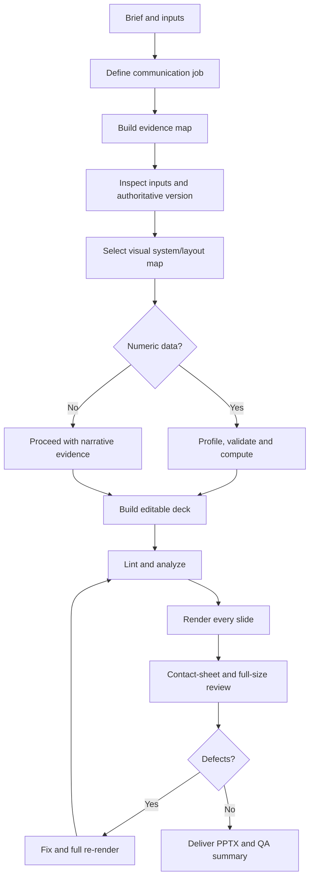
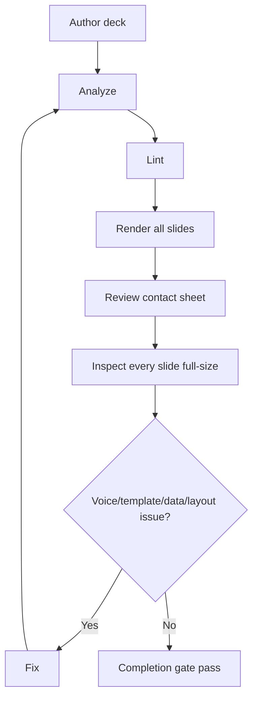
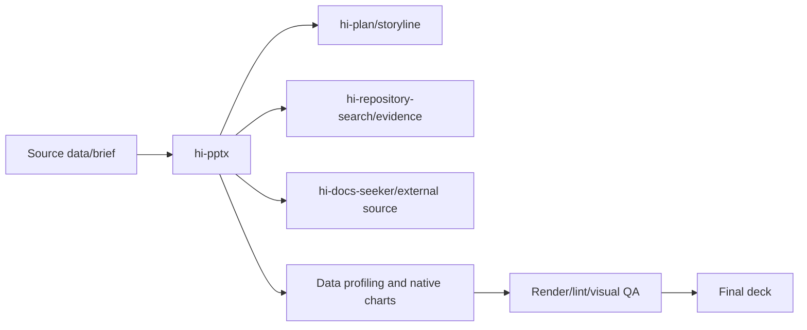

# Hi PPTX Skill: Complete Guide

> `hi-pptx` is a presentation engine that creates, edits, and visually validates client-ready PowerPoint decks using an evidence-driven storyline, native editable charts, a sanitized light design system, and strict quality gates.

## 1. Objective

The skill serves:

- executive proposal;
- consulting deck;
- architecture/current-state assessment;
- phased roadmap;
- investment options;
- KPI review;
- technical presentation;
- Japanese-customer-facing deck.

It does not just produce a `.pptx`. It must simultaneously ensure:

- clear audience and decision;
- each slide has one narrative job;
- claims traceable;
- data computed correctly before design;
- charts/diagrams editable;
- consistent visual hierarchy;
- render and inspect every slide before completion.

## 2. Hard outcomes

### Story and evidence

- identify audience, decision, central takeaway;
- each slide has a conclusion-led title;
- distinguish fact, calculation, assumption, illustrative, unknown;
- do not invent metrics/quotes/cases/sources;
- external sources/calculation definitions in speaker notes.

### Visual system

- white/light canvas, dark structural ink, restrained accent;
- choose a layout archetype before custom composition;
- typography/spacing/panels consistent;
- charts/tables/diagrams editable;
- brand assets only used when supplied/authorized.

### Data integrity

- compute first, design second;
- validate unit, denominator, period, missing values, totals, rounding;
- chart per the analytical question;
- highlight one decision-relevant series/point;
- do not declare complete before rendering/inspecting every slide.

## 3. Overall workflow



## 4. Intake

Determine or ask when low-risk:

1. audience/decision makers;
2. meeting objective and decision/action;
3. speaking time/slide count;
4. language/tone/localization;
5. source-of-truth files/data definitions/confidentiality;
6. whether brand assets may be applied.

Only ask when missing information would change:

- claims;
- data interpretation;
- branding;
- storyline.

Otherwise, use an explicit assumption register.

## 5. Communication job and evidence map

Write one sentence:

```text
By the end, the audience should [action/understanding] because [central takeaway].
```

Evidence map:

| Label | Meaning |
|---|---|
| Provided fact | Directly traceable from input |
| Derived statement | Synthesis/calculation reproducible |
| Assumption | Needed but not yet verified |
| Illustrative | Fictional/example, must be labeled |
| Unknown | Reserved for questions/dependencies/TBD |

Do not fill a hero number with a fabricated metric. If data is missing, use a question/appendix.

## 6. Storyline

Common sequence:

```text
Context → Observed issue → Implication → Proposed response → How it works → Plan → Risks/assumptions → Decision/next step
```

Do not force the sequence if the meeting objective differs. Each slide has one primary purpose:

- orient;
- explain;
- compare;
- diagnose;
- recommend;
- decide;
- plan;
- confirm.

### Takeaway title

The title is a conclusion/observation, not a category label.

- weak: `Current Situation`;
- good: `Three waiting steps slow every response`.

Titles should be one line, around <=35 characters per the design system or <=12 words/70 Latin characters per the writing guide, whichever layout constraint is tighter.

Body blocks are at most 30-40 words; put the key point first; avoid buzzwords, cloned bullets, and slogans.

## 7. Visual system

### 7.1 60-30-10 light rule

- 60% canvas: white `#FFFFFF` or pearl `#F8FAFC`;
- 30% structure: dark `#0F172A`/`#000000`;
- 10% accent: one hue such as indigo, crimson, or burnt orange.

One deck picks exactly one palette; do not mix palette A/B.

### 7.2 Palette A: Crisp Swiss

- background `#FFFFFF`;
- card `#F1F5F9`;
- primary `#020617`;
- secondary `#64748B`;
- accent `#4F46E5` or `#059669`;
- border `#E2E8F0`.

### 7.3 Palette B: Warm Editorial

- background `#FDFBF7`;
- card `#F3F0E6`;
- primary `#1C1917`;
- secondary `#78716C`;
- accent `#EA580C` or `#DC2626`;
- border `#E7E2D8`.

### 7.4 Hero element

Each slide has exactly one focal hero:

- giant metric;
- key quote;
- featured tile;
- stark contrast block.

If two elements compete, move one to another slide/appendix/notes.

### 7.5 Swiss grid

- canvas 1280×720 px, 16:9;
- 12-column grid;
- padding 60px top/bottom, 80px left/right;
- at most 2-3 content blocks;
- one quiet zone;
- hairline or one soft shadow, never both on the same card;
- card radius 16px.

## 8. Layout archetypes

| Layout | Use for | Rules |
|---|---|---|
| Hero Metric | KPI/headline stat | One giant number, whitespace |
| Stark Editorial Split | Takeaway/chapter | 50/50, one contrast block |
| Tiled Comparison | Framework/strategies | At most 3 tiles, one featured |
| Bold Statement | Quote/vision | One oversized statement, attribution |

Support layouts for roadmap, architecture, matrix, risk register while keeping the palette, hierarchy, and one-highlight rule.

Do not force dense content into a hero layout. Split the slide or move details to the appendix.

## 9. Typography and accessibility

- title geometric sans, weight 700/800;
- body readable sans;
- body `.pptx` text no smaller than 14pt;
- footnotes/sources at least 9pt;
- titles/bodies do not overflow;
- Vietnamese/Japanese glyphs render correctly;
- font substitution is a defect that must be verified;
- contrast reading text >=4.5:1;
- do not use color alone to encode meaning.

Font fallback must be cross-platform; `SF Pro Display` cannot be embedded/redistributed, so use Helvetica Neue/Inter/Arial/Aptos as appropriate.

## 10. Data workflow

When CSV/JSON/table data is available:

1. preserve clean source table;
2. profile with `scripts/profile_chart_data.py`;
3. check grain, unit, currency, denominator, period, timezone;
4. find missing/duplicate/suppressed/estimated/outlier;
5. recalculate totals/shares/deltas/rates;
6. define rounding after calculation;
7. choose the chart per the analytical question;
8. build native chart;
9. reconcile plotted values with the clean table.

Do not force a chart if the data does not support the conclusion; use a table/question/data-gap slide.

### Chart routing

| Question | Chart |
|---|---|
| Trend over time | Line |
| Category ranking | Horizontal bar |
| Few categories over time | Column |
| Composition | 100% stacked bar |
| Contribution to change | Waterfall |
| Actual vs target | Bar/bullet |
| Relationship | Scatter |
| Distribution | Histogram/box |
| Single decision metric | KPI + small trend |
| Precise values | Table |

Avoid 3D, rainbow, decorative charts, >5-slice doughnut, unjustified dual-axis.

### Chart styling

- primary navy `#1F3864`;
- one highlight orange `#F37021`;
- secondary teal `#127E84`/green `#1E9E54`;
- direct labels when possible;
- zero baseline for bars;
- units/period/source/denominator in notes/footer;
- native editable `slide.charts.add(...)`.

## 11. Implementation

### Native PPTX

- use JavaScript ES modules;
- use `@oai/artifact-tool`;
- 16:9 canvas;
- central design tokens;
- reusable helpers per archetype;
- native charts, not raster screenshots;
- `[Sources]` blocks in notes.

### HTML/CSS route

Can be used for browser decks, PDF export, or prototypes:

- canvas 1280×720;
- CSS variables as source of truth;
- self-contained font fallback;
- same palette/layout rules;
- rebuild to an editable PowerPoint when the deliverable is a `.pptx`.

### Inputs

If the user provides a deck/template:

- run `analyze_pptx.py`;
- inspect size/layouts/fonts/colors/density/object counts;
- preserve master → layout → slide hierarchy;
- do not reconstruct confidential source content.

## 12. QA and completion gate

Automated preflight:

```bash
python scripts/analyze_pptx.py output.pptx --output qa/analysis.json
python scripts/lint_pptx.py output.pptx --output qa/lint.json
python scripts/render_pptx.py output.pptx --output-dir qa/rendered --cols 4
```

Completion only when:

1. the `.pptx` opens successfully;
2. lint has no remaining unresolved errors;
3. every warning is fixed or explicitly justified;
4. every slide rendered;
5. contact sheet reviewed;
6. every full-size slide inspected;
7. voice gate and template-fidelity gate pass;
8. any subsequent corrections have been fully re-rendered.



Automated lint is triage, not proof of visual quality. Do not waive a visual defect without inspecting it.

## 13. Voice gate

Check every title/body:

- no forbidden buzzwords/slogans;
- headline is a conclusion;
- title is one line;
- bullets are not cloned skeletons;
- no generic marketing claims;
- quotes have real attribution;
- hero numbers are traceable or labeled.

## 14. Template-fidelity gate

Every slide:

- clear primary read;
- navy hierarchy, orange only for the main decision point;
- maps to an archetype;
- title/key-message/footer/alignment correct;
- at most 3 main options;
- one recommendation highlight;
- chart in the bounded zone;
- sufficient contrast;
- white text only on dark/accent fields with sufficient contrast.

## 15. Visual review

### Contact sheet

Check:

- beginning/middle/end;
- section transitions;
- consecutive density;
- mechanical composition repetition;
- important slides stand out;
- accent not becoming wallpaper;
- final slide supports the outcome.

### Full-size

Check:

- clipping/overflow/overlap;
- title/evidence dominance;
- font substitution;
- Vietnamese/Japanese glyphs;
- margin/alignment/card spacing;
- contrast/projector legibility;
- chart labels/axis/source/period;
- diagram reading path;
- no placeholders/TBD outside intentional disclosure.

## 16. Output contract

Deliver:

- final `.pptx`;
- short storyline/layout/chart summary;
- unresolved assumptions/missing evidence/editable placeholders;
- contact sheet when useful for review.

Do not deliver a complete deck before rendering/inspecting every slide.

## 17. Verify hi-pptx

- [ ] Audience/decision/central takeaway clear.
- [ ] Evidence map distinguishes fact/calculation/assumption/illustrative/unknown.
- [ ] Source-of-truth input identified.
- [ ] Each slide has one narrative job.
- [ ] Title is conclusion-led and one line.
- [ ] Each slide has one hero.
- [ ] Palette/layout archetype consistent.
- [ ] Charts native/editable.
- [ ] Data units/denominator/period/rounding correct.
- [ ] Source/calculation notes present.
- [ ] Analyze/lint/render run.
- [ ] Contact sheet and full-size slides inspected.
- [ ] Warnings fixed/justified.
- [ ] Full re-render after corrections.

## 18. Relationship with other skills



## 19. Limitations

- Do not invent evidence when sources are missing.
- Editable charts and visual fidelity involve a trade-off; prioritize editability when required.
- Lint heuristics have false positives/negatives.
- Rendering requires a suitable environment/fonts.
- A supplied template overrides the sanitized system but does not override evidence/privacy gates.
- A beautiful deck does not replace data correctness or decision clarity.

## 20. Summary

> `hi-pptx` does not just draw slides; it turns evidence into a story with a decision, deliberate layout, editable charts, and is only considered complete after the entire deck has been rendered and inspected.
