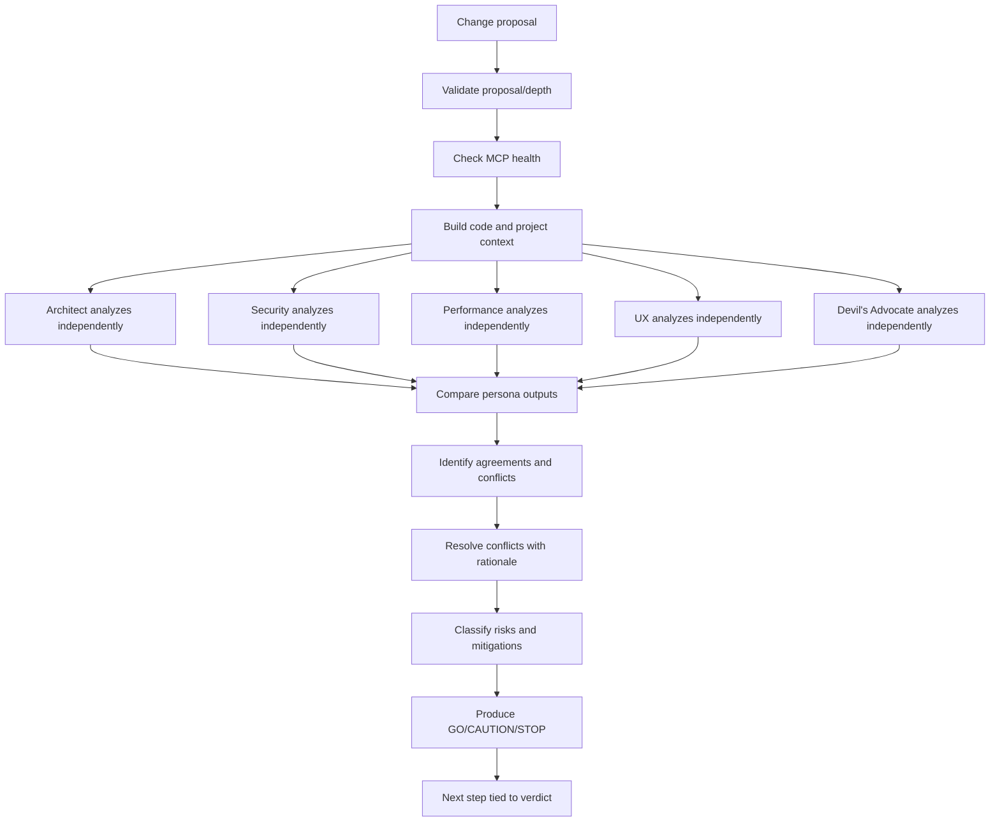
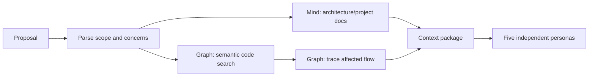
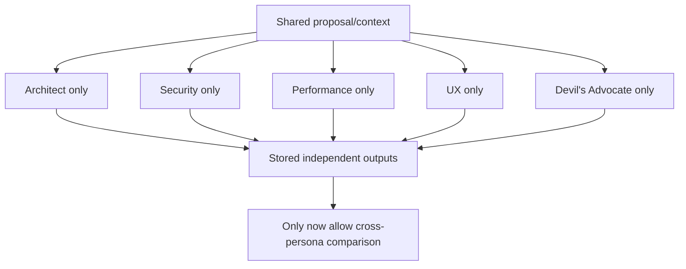
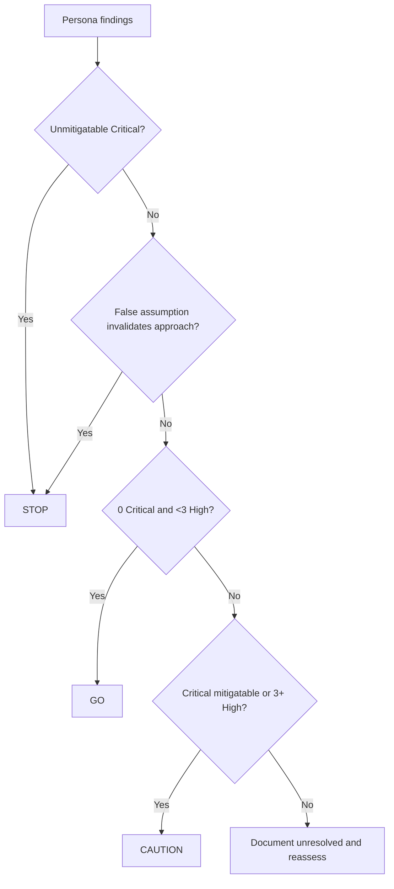
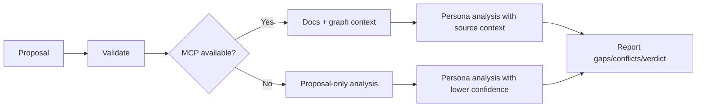
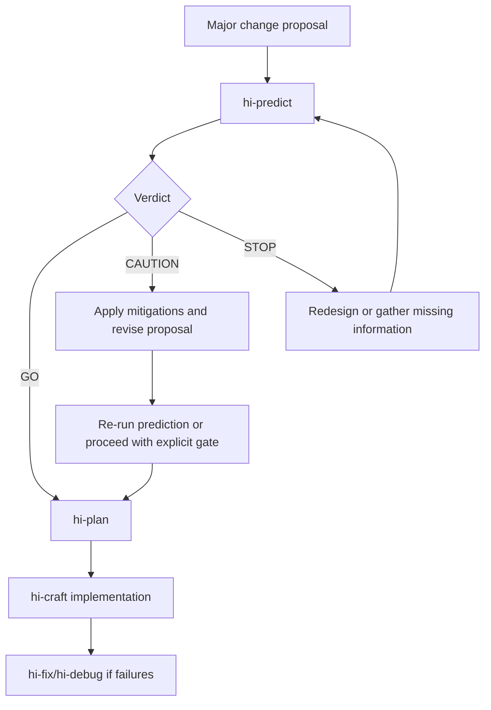
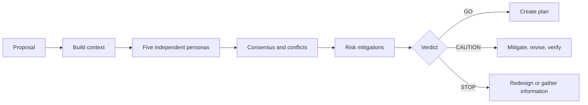

# Hi Predict Skill: Complete Guide

> `hi-predict` is a pre-analysis gate used before major features, refactors, competing approaches, or high-risk changes. Five independent personas analyze the proposal from the angles of architecture, security, performance, UX, and assumptions, then debate, resolve conflicts, and produce a `GO`, `CAUTION`, or `STOP` verdict.

## 1. What problem does Hi Predict solve?

A proposal can sound reasonable yet contain risks before the first line of code is written:

- a new architecture creates coupling or cycles;
- an endpoint opens an attack surface but lacks auth;
- a query/API call increases latency or N+1s;
- UX has no loading/error/empty/accessibility states;
- a foundational assumption is wrong;
- scope is larger than necessary;
- a simpler alternative has not been considered.

`hi-predict` brings multiple independent lenses in **before implementation**, to surface problems while the cost of change is still low.

It is not:

- a code review after implementation;
- runtime testing or performance benchmarking;
- a replacement for the product owner/domain expert;
- a decision about implementation made on behalf of the team;
- a guarantee that the proposal will be correct in production.

## 2. Overall mental model



## 3. When to use it?

### 3.1 Should use

- major features;
- refactors affecting many modules;
- competing architecture approaches;
- assumption stress-testing;
- implementation gate before code;
- authentication/authorization changes;
- data model/migration;
- payment, compliance, or PII;
- hot path/performance-sensitive features;
- important user-facing workflows.

### 3.2 No need to use

- trivial changes;
- work already approved with unchanged scope;
- pure dependency upgrades with no behavior/architecture impact;
- docs-only changes;
- changes too small that already have clear verification.

`hi-predict` should not be used to add ceremony to every small bug. It is valuable when early risk analysis is cheaper than rework after implementation.

## 4. Input contract

### 4.1 Proposal

`proposal` must:

- not be empty;
- be 10-5000 characters long;
- be natural language;
- describe the change/problem/goal;
- not be only a code snippet without context.

A good proposal:

```text
Add refresh-token rotation for all browser sessions, store token-family
revocation state, and invalidate the family when reuse is detected.
```

A weak proposal:

```text
function rotateToken() { ... }
```

### 4.2 Optional inputs

- `--files <glob>`: limits the files/modules under consideration;
- concern areas: architecture/security/performance/UX/assumptions;
- `depth`: `quick` or `deep`.

### 4.3 Depth

| Depth | Goal |
|---|---|
| `quick` | Fast pre-analysis for the main proposal and major risks |
| `deep` | Extended context, code paths, assumptions, and conflict analysis |

Quick does not mean dropping the Security persona or Devil's Advocate. The five personas remain the core model; depth controls the depth of context and analysis.

## 5. The five personas

| Persona | Focus | Core question |
|---|---|---|
| Architect | System design, scalability, coupling | Does it fit the architecture and scale without creating new coupling? |
| Security | Attack surface, data, auth | Where can it be abused and where does data leak? |
| Performance | Latency, memory, query, resource | What is the latency/N+1/memory/contention impact? |
| UX | Flow, accessibility, errors | Is it intuitive, accessible, and with clear error states? |
| Devil's Advocate | Assumptions, alternatives, worst case | Why not do nothing, and which assumptions could be wrong? |

Personas must analyze **independently** in Phase 1 and not cross-read each other's outputs. This reduces anchoring and prevents one persona from pulling the whole group toward the same assumption before independent analysis exists.

## 6. Four-phase workflow

### 6.1 Phase 0: Code Context

Target time: 3 minutes, timeout 180 seconds.

Steps:

1. parse the proposal;
2. read architecture/project context;
3. query `mind_mcp.hybrid_search` for architecture docs;
4. query `graph_mcp.semantic_search` for affected code;
5. use `trace_flow` for runtime/call paths;
6. build the context package;
7. report `phase_start`/`phase_complete`.

The context package should include:

- affected modules/files;
- entry points;
- state mutations;
- external calls;
- dependencies/call paths;
- existing architectural patterns;
- relevant requirements/decisions;
- known constraints.



MCP being unavailable does not immediately fail the proposal. Fall back to text-only analysis, mark code-derived findings as low confidence, and record `MCP unavailable`.

### 6.2 Phase 1: Independent Analysis

Target time: 5 minutes, timeout 300 seconds.

Each persona:

- reads the same proposal/context;
- analyzes through its own lens;
- does not look at other personas' outputs;
- records concerns/threats/bottlenecks/issues/assumptions;
- records recommendations/mitigations/alternatives;
- records confidence.



### 6.3 Phase 2: Consensus Debate

Target time: 3 minutes, timeout 180 seconds.

Compare outputs side-by-side:

- **Agreement**: 4+ personas align;
- **Conflict**: a meaningful disagreement;
- **Gap**: a concern only one persona sees but that has not been refuted;
- **Priority**: risk severity and affected boundary.

Each conflict must have:

- a topic;
- each persona's position;
- the trade-off;
- the resolution;
- the rationale;
- an unresolved status if it could not be resolved.

### 6.4 Phase 3: Verdict & Report

Target time: 1 minute, timeout 60 seconds.

Synthesize:

- risk summary;
- agreements;
- conflicts/resolutions;
- per-persona details;
- recommendations;
- mitigations;
- verdict;
- next steps.

Progress events:

```text
phase_start
persona_progress
conflict_resolving
final_summary
```

## 7. Persona: Architect

### 7.1 Focus

- system design;
- component boundaries;
- scalability;
- coupling/cohesion;
- consistency with the existing architecture;
- dependency graph;
- reuse of abstractions.

### 7.2 Key questions

1. Does the change create new coupling between modules?
2. Does it scale to 10x the current load?
3. Does it follow established patterns?
4. Is there an existing abstraction to reuse?
5. How does the dependency graph change?

### 7.3 Red flags

- new circular dependency;
- bypassing the service/repository layer;
- god component;
- module boundary violation;
- duplicate abstractions;
- a new architecture style without justification.

### 7.4 Output format

```yaml
architect:
  concerns:
    - "New service bypasses repository boundary"
  recommendations:
    - "Reuse existing gateway abstraction"
  confidence: "high|medium|low"
```

## 8. Persona: Security

### 8.1 Focus

- attack surface;
- data exposure/protection;
- authentication/authorization boundary;
- input validation/injection;
- secret/token handling;
- logging and transmission.

### 8.2 Key questions

1. Where is the new attack surface?
2. Where is user data stored/transmitted/logged?
3. Is there an auth check at every entry point?
4. How is input accepted and validated?
5. Are there new secret/token paths?

### 8.3 Red flags

- new endpoint missing auth;
- plaintext user data in logs;
- SQL/NoSQL string concatenation;
- new secrets without a rotation plan;
- IDOR/horizontal privilege escalation;
- sensitive error details;
- unclear CORS/CSRF boundary.

### 8.4 Security priority

Security findings are weighted higher in auth/data concerns. A Security Critical cannot become GO just because the other personas agree.

```yaml
security:
  threats:
    - "New endpoint accepts tenantId from client without ownership check"
  severity: "critical"
  mitigations:
    - "Derive tenant from verified session and enforce authorization at service boundary"
```

## 9. Persona: Performance

### 9.1 Focus

- critical path latency;
- N+1 queries;
- memory usage/leaks;
- resource contention;
- database indexes;
- external call timing;
- peak load behavior.

### 9.2 Key questions

1. How much latency is added on the critical user path?
2. Are there N+1 queries?
3. Is a large dataset loaded into memory?
4. Is caching/batching being missed?
5. What is the peak load behavior?

### 9.3 Red flags

- synchronous external API on the hot path;
- unbounded collections loaded into memory;
- list endpoints without pagination;
- new DB queries without an index plan;
- retry storms;
- new locks/contention;
- blocking I/O in the request path.

### 9.4 Output format

```yaml
performance:
  bottlenecks:
    - "One provider call added to synchronous checkout path"
  metrics_impact: "latency +150ms, queries +2"
  alternatives:
    - "Move provider reconciliation to async job"
```

Performance concerns should include numbers/estimates when possible. "Might be slow" is not as strong as a specific latency path, query count, payload size, or resource model.

## 10. Persona: UX

### 10.1 Focus

- user flow;
- intuitive behavior;
- loading/empty/error states;
- accessibility;
- mobile/slow networks;
- abort/resume;
- feedback after actions.

### 10.2 Key questions

1. How are error states displayed?
2. Can keyboard/screen reader users use it?
3. What about mobile and slow connections?
4. What is the state when a user aborts mid-flow?
5. Does every action have clear feedback?

### 10.3 Red flags

- silent failures;
- errors leaking internal details;
- mobile overflow/non-responsive layout;
- async operations without loading states;
- focus lost after validation;
- destructive actions without confirm/recover.

### 10.4 Output format

```yaml
ux:
  issues:
    - "Async export has no progress or retry state"
  edge_cases:
    - "User navigates away while export is processing"
  a11y_concerns:
    - "Status updates are not announced to screen readers"
```

## 11. Persona: Devil's Advocate

### 11.1 Focus

- hidden assumptions;
- simpler alternatives;
- worst-case failure;
- cost of doing nothing;
- organizational/knowledge risk;
- scope reduction;
- buy vs build.

### 11.2 Key questions

1. Why not do nothing? What is the cost of inaction?
2. What is the simplest version that solves the problem?
3. Which assumption is most likely to be wrong?
4. If half the scope were cut, what would still work?
5. Is there an existing solution/buy option?

### 11.3 Red flags

- using technology the team does not know;
- not seriously considering simple alternatives;
- success depending on one person;
- a timeline assuming no interruptions/scope changes;
- a proposal solving a symptom rather than the need;
- false assumptions about user behavior or scale.

### 11.4 Special rules

Devil's Advocate must challenge at least one core assumption. If an assumption has not been validated, the conflict rule requires at least `CAUTION`, never an automatic GO.

```yaml
devils_advocate:
  assumptions_challenged:
    - "All clients can migrate to the new API in one release"
  simpler_alternatives:
    - "Add compatibility adapter first"
  worst_case: "Partial rollout creates inconsistent authorization behavior"
```

## 12. Persona output contract

Each persona must provide structured output:

```yaml
persona:
  concerns_or_findings: []
  recommendations_or_mitigations: []
  confidence: high|medium|low
```

Per-persona details:

```yaml
architect:
  concerns: []
  recommendations: []
  confidence: high|medium|low

security:
  threats: []
  severity: critical|high|medium|low
  mitigations: []

performance:
  bottlenecks: []
  metrics_impact: ""
  alternatives: []

ux:
  issues: []
  edge_cases: []
  a11y_concerns: []

devils_advocate:
  assumptions_challenged: []
  simpler_alternatives: []
  worst_case: ""
```

Output is not just a list of concerns. Each risk needs a concrete mitigation.

## 13. Consensus and conflict resolution

### 13.1 Agreement

Agreement is when 4 or more personas align on a finding/decision. Agreement does not erase a minority concern; the concern still needs to be recorded if it has high severity.

### 13.2 Conflict table

The report should include:

| Topic | Architect | Security | Performance | UX | Devil's Advocate | Resolution |
|---|---|---|---|---|---|---|
| Sync provider call | Acceptable | Token exposure concern | Latency risk | Progress state needed | Async simpler | Async with explicit user state |

### 13.3 Conflict resolution rules

| Conflict | Rule |
|---|---|
| Security vs Performance | Security wins, unless performance makes the system unusable |
| Architect vs UX | UX for user-facing features, Architect for backend |
| Devil's Advocate vs everyone | An unvalidated assumption means at least CAUTION |
| Any persona Critical | Cannot be GO |

### 13.4 Resolution with rationale

A resolution cannot just say "Security wins". It must record:

```text
Security wins because the proposed performance shortcut bypasses tenant authorization.
Mitigation: cache verified authorization result with bounded TTL instead of removing the check.
```

### 13.5 Unresolvable conflict

If a conflict cannot be resolved:

- keep the conflict in the report;
- mark it unresolved;
- state the information/experiment/owner needed;
- the verdict must not pretend to be GO.

## 14. Verdict levels

### 14.1 GO

Meaning: it is safe to proceed with confidence.

Conditions:

- no persona has a remaining critical concern;
- 0 Critical;
- fewer than 3 High;
- mitigations are clear and feasible;
- no unvalidated core assumptions;
- conflicts are resolved.

Next step:

```text
GO -> hi-plan
```

`GO` does not mean the code is correct. It only means the proposal is safe enough to move into planning.

### 14.2 CAUTION

Meaning: there are concerns, but it can proceed conditionally.

Typical triggers:

- 1-2 Critical items with feasible mitigations;
- 3+ High;
- assumptions need validation but do not invalidate the whole approach;
- unresolved trade-offs that are not fully blocking.

Next step:

```text
CAUTION -> address mitigations -> update proposal/plan -> verify gates
```

CAUTION must come with an owner, an action, and an acceptance condition. It must not remain a generic warning.

### 14.3 STOP

Meaning: implementation must not continue under the current proposal.

A single trigger is enough:

- auth bypass/data exposure without a feasible mitigation;
- architecture incompatibility requiring significant rework;
- unacceptable latency/query explosion without a workaround;
- Devil's Advocate proves a false assumption invalidates the approach;
- a critical conflict that cannot be resolved;
- required context is so lacking that assessment is impossible.

Next step:

```text
STOP -> redesign or gather required information -> run hi-predict again
```

A STOP report must state exactly:

- what is blocking;
- what evidence proves it;
- what the proposal needs to change;
- the conditions for a rerun.



## 15. Risk mitigation

Every risk must have a concrete mitigation:

| Risk | Insufficient | Good mitigation |
|---|---|---|
| Auth bypass | "Add security" | Derive tenant from verified session, check ownership at service boundary, add negative tests |
| Latency | "Optimize later" | Async provider call, timeout, queue, SLO measurement |
| N+1 | "Monitor queries" | Batch/eager loading, query-count test, index plan |
| UX failure | "Show error" | Error state copy, retry action, focus announcement, screen-reader status |
| False assumption | "Validate later" | Specify experiment, owner, deadline, decision gate |

A mitigation should include:

- action;
- owner/layer;
- verification method;
- acceptance criteria;
- residual risk.

## 16. Output contract

A minimal report has:

1. title;
2. date;
3. depth;
4. verdict;
5. executive summary of 2-3 sentences;
6. agreements list;
7. conflicts table with the 5 personas and resolution;
8. risk summary table;
9. per-persona detail;
10. numbered recommendations and rationale;
11. next steps per verdict.

### 16.1 Risk summary

```markdown
| Risk | Severity | Persona | Mitigation |
|---|---|---|---|
| Missing tenant authorization | Critical | Security | Derive tenant from verified context + negative tests |
| Synchronous provider call | High | Performance | Async job + timeout + retry policy |
```

### 16.2 Deliverable

```text
prediction_report_{timestamp}.md
```

The report must keep all persona analyses, conflicts, verdict, and recommendations. Do not save only the final verdict and lose the dissenting evidence.

## 17. Progress and timeout

Timeout targets:

| Phase | Timeout |
|---|---:|
| Phase 0: Code Context | 180s |
| Phase 1: Independent Analysis | 300s |
| Phase 2: Consensus Debate | 180s |
| Phase 3: Verdict & Report | 60s |
| Total | 720s / 12 minutes |

Progress events:

- `phase_start`;
- `persona_progress`;
- `conflict_resolving`;
- `final_summary`.

### 17.1 Persona timeout

If a persona times out:

- mark it incomplete;
- continue with the remaining personas;
- do not treat a timed-out persona as agreement;
- lower confidence;
- record the gap in the report;
- consider CAUTION/STOP depending on the missing lens.

A missing Security or Architect persona for a high-risk proposal is a significant gap and should not be silently treated as a pass.

## 18. MCP fallback

### 18.1 Preflight

- validate proposal/depth;
- check MCP health;
- abort if the proposal is invalid.

### 18.2 MCP unavailable

The proposal can still be analyzed text-only, but must:

- record `MCP unavailable`;
- mark code-derived findings with lower confidence;
- not claim affected paths are verified;
- state a recommendation to rerun with repository context.



## 19. Independent analysis and bias control

### 19.1 Why independence?

If personas read output beforehand:

- Architect may anchor Security to its own design;
- Security may miss UX because it already saw "handled";
- everyone may falsely converge through groupthink;
- Devil's Advocate loses its challenging role.

### 19.2 Control process

1. provide the same baseline context;
2. do not share persona outputs in Phase 1;
3. store outputs separately;
4. only compare in Phase 2;
5. keep minority findings if not refuted;
6. record rationale when resolving conflicts.

## 20. Example: refresh-token rotation

Proposal:

```text
Add refresh-token rotation for browser sessions, persist token-family
revocation state, and revoke the family on token reuse.
```

### Architect

- reuse the existing session/token repository;
- check dependencies between login, refresh, and logout;
- avoid introducing a second token store;
- assess multi-instance consistency.

### Security

- token replay and family revocation;
- tokens must not be logged in plaintext;
- auth check at every refresh entry point;
- atomic compare-and-rotate.

### Performance

- added DB read/write on every refresh;
- index token family/session;
- caching can make revocation stale;
- concurrency/lock contention.

### UX

- how a reused token logs the user out;
- clear session-expired message;
- multi-tab refresh race;
- retry must not create a loop.

### Devil's Advocate

- is rotation really needed for every client;
- simplest version: rotate only browser or high-risk sessions;
- assumption: every client supports cookie/session updates;
- alternative: existing provider-managed token revocation.

### Conflict resolution

| Topic | Conflict | Resolution |
|---|---|---|
| Cache revocation | Performance wants caching, Security worries about stale state | Security wins; only cache negative/short TTL and authoritative check when rotating |
| Reuse response | UX wants silent refresh, Security needs to revoke the family | Security wins; clear user-facing session-expired state |
| Storage | Architect wants to reuse the store, Performance worries about write cost | Keep the store, batch/index/measure instead of adding a new store |

### Verdict

It could be `CAUTION` if the token reuse policy has no integration test or the cache semantics are undecided. After mitigation and verification, rerun to reach GO.

## 21. Example: payment gateway refactor

Proposal:

```text
Replace direct payment provider calls with a shared PaymentGateway abstraction.
```

Persona concerns:

- Architect: does the interface create a god abstraction; do implementations share the same semantics;
- Security: secret ownership, logging, idempotency keys;
- Performance: the added wrapper is negligible, but retry/middleware may duplicate;
- UX: provider error mapping and retry messages;
- Devil's Advocate: is an adapter really needed if there is only one provider?

STOP triggers if:

- the abstraction loses provider-specific fraud/authorization checks;
- the direct call path is bypassed without a migration plan;
- retry semantics cause duplicate charges.

## 22. Example: export report UI feature

Persona lenses:

- Architect: async job/status endpoint and storage lifecycle;
- Security: report authorization, signed URL expiry, PII;
- Performance: large datasets, streaming, queue, memory;
- UX: progress, cancel, retry, download states;
- Devil's Advocate: is a full export needed, or can it be filtered/paginated.

GO is only reasonable when:

- access control and URL expiry are clear;
- large exports do not block the request path;
- error/cancel states have a design;
- retention/cleanup is defined;
- assumptions about export size have evidence.

## 23. How to verify hi-predict?

### 23.1 Input/context verify

- [ ] Proposal is 10-5000 chars, natural language.
- [ ] Depth is reasonable.
- [ ] Files/glob scope is valid if provided.
- [ ] MCP health was checked.
- [ ] Context package has code/docs evidence or a clear gap.

### 23.2 Persona verify

- [ ] All five personas are present.
- [ ] Analysis is independent, with no cross-contamination.
- [ ] Devil's Advocate challenges at least one core assumption.
- [ ] Security is weighted correctly for auth/data.
- [ ] Every concern/risk has a mitigation or a reason for being unresolved.

### 23.3 Debate verify

- [ ] Agreements are only claimed when 4+ align.
- [ ] Conflicts include the personas' positions.
- [ ] Resolutions have rationale.
- [ ] Unresolvable conflicts are kept.
- [ ] Minority concerns are not deleted just because they are not consensus.

### 23.4 Verdict verify

- [ ] Critical count is correct.
- [ ] GO only when 0 Critical, <3 High, and mitigations are clear.
- [ ] CAUTION has an action/owner/acceptance condition.
- [ ] STOP clearly states the blocker and rerun conditions.
- [ ] Verdict does not claim runtime/production guarantees.

### 23.5 Report verify

- [ ] Has title/date/depth/verdict.
- [ ] Executive summary is 2-3 sentences.
- [ ] Conflict table is complete.
- [ ] Risk summary has severity/persona/mitigation.
- [ ] Per-persona details are not lost.
- [ ] Next steps match the verdict.
- [ ] Timeout/MCP gaps/confidence are recorded.

## 24. Relationship with other skills



| Skill | Relationship |
|---|---|
| `hi-plan` | Receives a proposal that has passed pre-analysis to create a plan |
| `hi-craft` | Implements after GO or a handled CAUTION |
| `hi-scenario` | Adds edge cases/test scenarios derived from persona risks |
| `hi-security` | Deep-audits the security risks that were found |
| `hi-debug` | Investigates assumptions/flow when evidence is missing or conflicting |
| `hi-repository-search` | Provides code/document context for Phase 0 |
| `hi-red-team`/plan red-team | Adversarial review of the plan after the proposal is finalized |

`hi-predict` and `red-team` are not the same:

- `hi-predict`: before implementation, debates the proposal/approach;
- `red-team`: reviews the written plan, finding weaknesses in the artifact.

## 25. Limitations to understand correctly

### 25.1 Static analysis only

The skill does not simulate runtime, benchmark, or prove production behavior. It predicts risks based on the proposal/context.

### 25.2 Quality depends on the proposal

A proposal that is too short or lacks constraints makes personas analyze on assumptions. If business nuance is missing, a domain expert review is needed.

### 25.3 One-pass, no clarification questions

Personas do not ask for clarification during the workflow. Missing-context questions must appear in gaps/next steps, never be filled in by assumption.

### 25.4 GO is not implementation approval

GO only says the proposal is safe enough to move to `hi-plan`. Planning, testing, code review, and runtime verification are still required.

### 25.5 CAUTION does not mean "ignore warnings"

Every CAUTION needs a mitigation/action condition. If left unhandled, it can escalate to STOP.

### 25.6 STOP is not failure

STOP is an early warning that helps avoid writing code against an approach with blockers. Its value is pointing out exactly what needs redesign or verification.

## 26. Quick summary



The shortest sentence to remember:

> `hi-predict` brings five independent perspectives in before the code, so a proposal is not only asked "can it be done?" but also challenged on architecture, security, performance, UX, and assumptions before the cost of rework rises.
