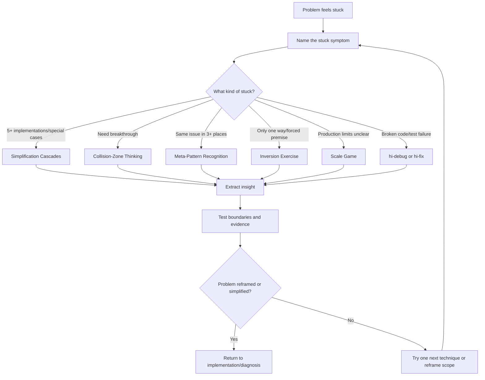
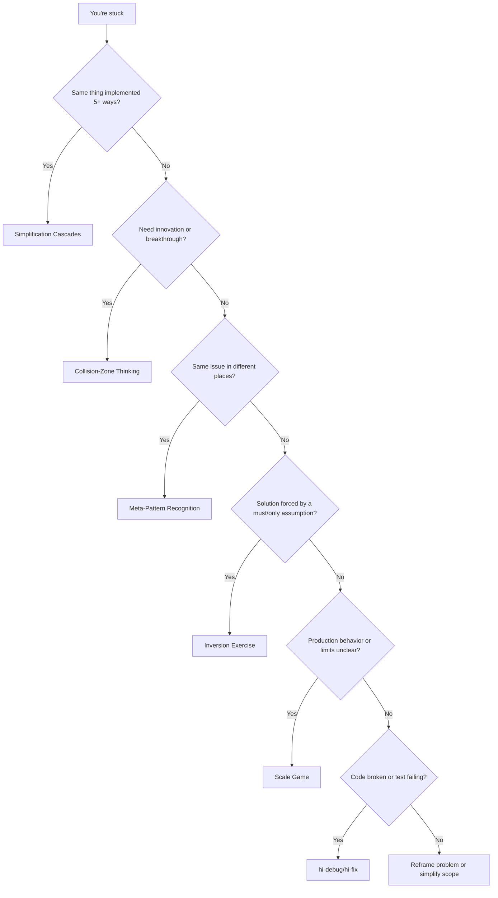
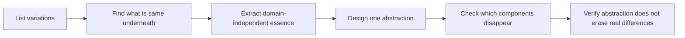
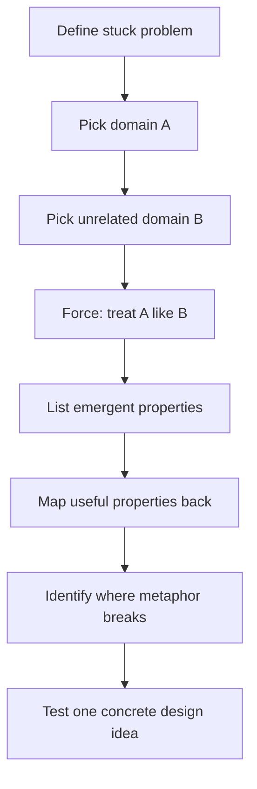
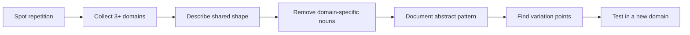
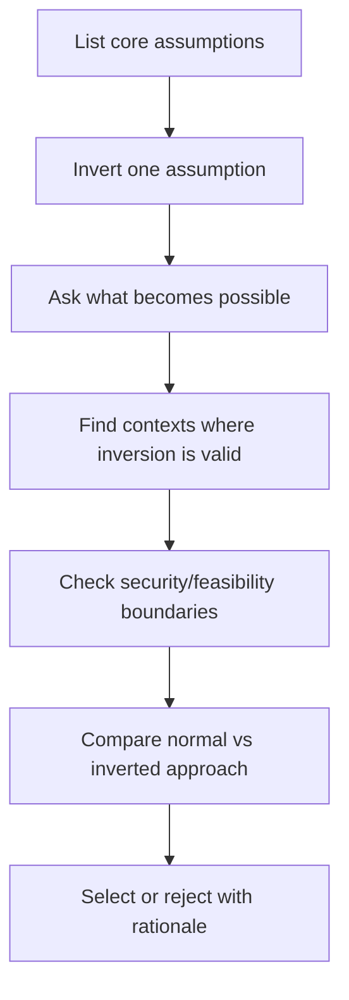
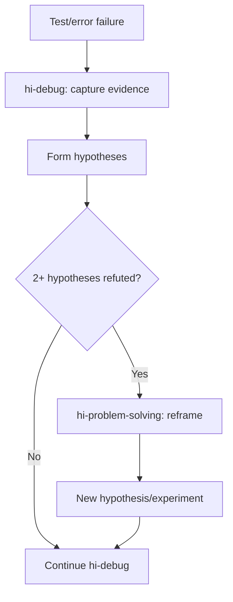
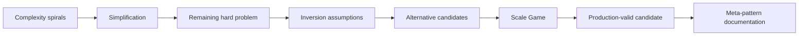
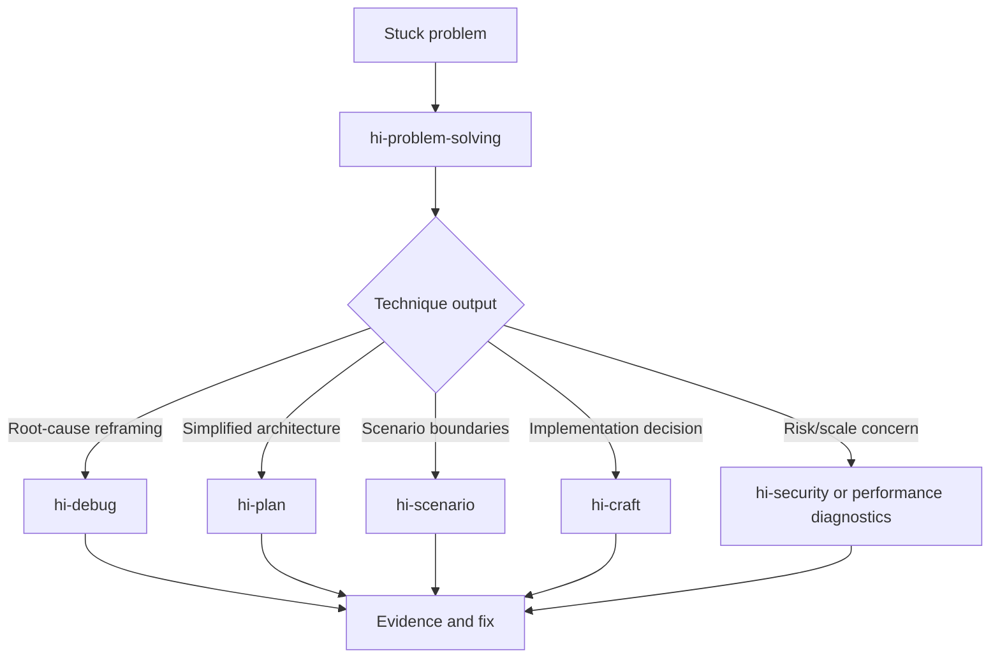
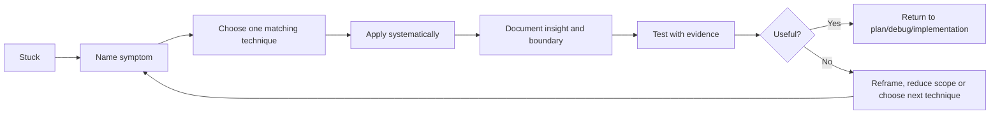

# Hi Problem Solving Skill: Complete Guide

> `hi-problem-solving` is the skill to use when reasoning gets stuck: complexity spiraling, a solution forced by assumptions, a need for a breakthrough, recurring patterns, or unknown production limits. It does not replace debugging or testing; it helps change the approach to break out of the old loop.

## 1. What problem does this skill solve?

Sometimes the problem is not a lack of effort but a lack of the right framing:

- the same behavior is implemented in 5 different ways;
- every fix adds another `if/else`;
- every approach in the current domain is only a minor optimization;
- the team says "this is the only way" but has never inverted assumptions;
- the same kind of problem appears across many domains;
- the solution works in dev but production scale is unknown;
- debug/test fails because you are solving the wrong problem.

`hi-problem-solving` provides techniques with symptom mapping:

| Stuck type | Technique |
|---|---|
| Complexity spiraling | Simplification Cascades |
| Need breakthrough | Collision-Zone Thinking |
| Recurring patterns | Meta-Pattern Recognition |
| Forced by assumptions | Inversion Exercise |
| Scale uncertainty | Scale Game |
| Code broken/test failing | Debugging skill (`hi-debug`/`hi-fix`) |

## 2. Overall mental model



## 3. When to use it?

### 3.1 When to use

- complexity grows with each patch;
- there are many special cases and the abstraction is unclear;
- conventional solutions do not meet the requirements;
- the same issue recurs across many modules/teams/domains;
- assumptions are locking the solution;
- the scale/performance/reliability limits are unknown;
- two or more hypotheses have been tried and all were refuted;
- a fresh perspective is needed before continuing to code.

### 3.2 Not a replacement for other skills

| Situation | Main skill |
|---|---|
| Code is wrong/test failing and root cause is needed | `hi-debug` or `hi-fix` |
| Need to find file/call path/context | `hi-codebase-research-explorer` |
| Need plan/architecture artifact | `hi-plan` |
| Need scenario/edge-case matrix | `hi-scenario` |
| Need end-to-end test/implementation | `hi-craft` |

`hi-problem-solving` can be called from `hi-debug` when hypotheses fail or from `hi-fix` when three attempts do not resolve the issue, but it does not automatically prove a solution is correct.

## 4. Dispatch rules

### 4.1 Decision tree



### 4.2 General process

1. **Identify stuck-type**: describe the symptom, not just say "hard".
2. **Choose one technique**: load the corresponding reference.
3. **Apply systematically**: complete all steps of the technique.
4. **Document insight**: insight, evidence, boundary, next action.
5. **Test**: verify the insight in a real context.
6. **Return**: go back to plan/diagnosis/implementation with the new framing.

Rule: use **one technique at a time**. Combine only after the first technique produces an insight that requires a second technique.

## 5. Simplification Cascades

### 5.1 Core idea

Find an insight that can eliminate many components/special cases:

> "If this is true, we no longer need X, Y, Z."

A good abstraction often turns many implementations into one general pattern.

### 5.2 When to use

- the same behavior is implemented in 5+ ways;
- the list of special cases keeps growing;
- many `if/else` branches differ only in input type/context;
- the team repeatedly says "just need to add one more case";
- complexity is hidden behind individual utilities.

### 5.3 Process



Three questions:

1. Which variations are being implemented repeatedly?
2. What invariant do they share?
3. Which abstraction expresses the invariant without forcing artificial differences?

### 5.4 Examples

| Before | Insight | After |
|---|---|---|
| Separate handlers for batch/realtime/file/network | They are all input streams | One stream processor, many sources |
| Separate session tracking, rate limiting, file validation, connection pool | All are per-entity resource limits | One ResourceGovernor with many resource types |
| Defensive copy, lock, cache invalidation, temporal coupling | Treat data as immutable transformations | Functional data flow |

### 5.5 Boundary

Not everything that looks similar on the surface should be consolidated. Check:

- whether the abstraction preserves its own invariant;
- whether error semantics differ;
- whether lifecycle/ownership differ;
- whether the abstraction creates a new "god object";
- whether the cognitive cost is lower than the duplication.

Red flags:

- "Just need to add one more case…";
- "Don't touch that, it's complex";
- the abstraction only renames the duplication without removing the logic.

## 6. Collision-Zone Thinking

### 6.1 Core idea

Deliberately bring two unrelated concepts into the same framing:

> "What if we treated X like Y?"

The goal is not to create a nice metaphor, but to discover emergent properties from another domain.

### 6.2 When to use

- conventional solutions only produce incremental improvement;
- every solution in the current domain has been tried;
- a breakthrough is needed;
- the problem behaves like a different domain but the team has not noticed.

### 6.3 Process



### 6.4 Collision examples

| Treat this | Like this | What you may discover |
|---|---|---|
| Code organization | DNA/genetics | Mutation testing, evolutionary algorithms |
| Service architecture | Lego bricks | Composable plug-and-play services |
| Data management | Water flow | Streaming, data lakes, flow-based systems |
| Request handling | Postal mail | Message queue, async processing |
| Error handling | Electrical circuits | Circuit breaker, fuse, fault isolation |

### 6.5 Distributed failure example

Problem: distributed services cause cascading failures.

Collision:

```text
What if services behaved like electrical circuits?
```

Emergent properties:

- circuit breaker;
- fuse;
- isolation boundary;
- load balancing;
- voltage regulation.

Insight: failure isolation can be designed like circuit protection.

### 6.6 Boundary

A metaphor is only a generator, not proof. You must ask:

- which properties actually map;
- which assumptions of the original domain no longer hold;
- where the metaphor breaks;
- which test proves the new design is better.

Red flags:

- "We've tried everything in this domain";
- the solution differs only in name with no new behavior;
- the metaphor is used as justification without an experiment.

## 7. Meta-Pattern Recognition

### 7.1 Core idea

When the same shape appears in 3 or more domains, it may be a universal principle worth extracting.

Rule:

```text
1 occurrence = coincidence
2 occurrences = possible pattern
3+ occurrences = likely universal pattern
```

### 7.2 When to use

- the same issue appears across many modules;
- multiple teams are reinventing the same solution;
- there is a sense of déjà vu;
- you want to create a reusable principle instead of fixing locally.

### 7.3 Process



### 7.4 Pattern examples

| Appears in | Abstract form | Other applications |
|---|---|---|
| CPU/DB/HTTP/DNS caching | Bring frequently used data closer to the consumer | CDN, prompt cache |
| Network/storage/compute layering | Separate concerns into abstraction levels | Architecture, org structure |
| Message/task/request queue | Decouple producer-consumer with a buffer | Async event systems |
| Connection/thread/object pooling | Reuse expensive resources | Memory/governance |
| API throttling/traffic shaping/circuit breaker | Bound resource consumption | LLM token budget |

### 7.5 Output pattern

```text
Observed domains: API throttling, admission control, circuit breaker
Abstract pattern: Bound resource consumption to prevent exhaustion
Variation points: resource, limit, window, behavior when exceeded
New application: bound LLM context tokens by truncate/reject policy
```

### 7.6 Boundary

A pattern is only useful if it can be described without mentioning a specific domain and still preserves the causal mechanism. Avoid patterns that are too generic, like "everything needs to be managed".

Red flag:

- calling the problem "unique" without checking other domains;
- the abstraction is only a slogan;
- the analogy yields no design/test consequence.

## 8. Inversion Exercise

### 8.1 Core idea

Invert the core assumption to reveal hidden constraints and alternative approaches:

> "What if the opposite were true?"

### 8.2 When to use

- the solution feels forced;
- the team says "must", "only way", "this is the standard way of doing it";
- requirements seem contradictory;
- the current approach feels wrong but there is no alternative yet.

### 8.3 Process



### 8.4 Examples

| Common assumption | Inversion | What it may reveal |
|---|---|---|
| Cache to reduce latency | Add latency to enable cache | Debounce |
| Pull data when needed | Push before needed | Prefetch/eager load |
| Handle errors when they occur | Make errors impossible | Type system/contracts |
| Build features users want | Remove features users don't need | Simplicity |
| Optimize common case | Optimize worst case | Resilience |
| Eager | Lazy | On-demand resource use |
| Push | Pull | Consumer-driven flow |
| Store | Compute | Derived data |

### 8.5 Slow app example

Normal framing: make everything faster with caching, query optimization, CDN, smaller bundles.

Inversion: strategic slowness can improve UX:

- debounce search;
- rate limit abuse;
- lazy load reduces initial work;
- progressive rendering improves perceived speed.

Insight: not all latency needs to be eliminated; you need to distinguish harmful latency from intentional control.

### 8.6 Valid vs invalid inversion

Valid:

```text
Store data -> Derive data on demand
```

If computation is cheaper than storage and freshness matters.

Invalid:

```text
Validate input -> Trust all input
```

This is a security vulnerability, not a valid alternative context.

Test the inversion with the question: "Would it work in any context with clear boundaries?"

## 9. Scale Game

### 9.1 Core idea

Test at both extremes to reveal truths hidden at normal scale:

> Extremes expose fundamentals.

Don't only test bigger. Testing smaller matters too, because it can reveal over-engineering.

### 9.2 When to use

- "should scale fine" but there are no numbers yet;
- production limits are unclear;
- min/max edge cases are unknown;
- the architecture needs validation;
- performance/resource behavior is a risk.

### 9.3 Scale dimensions

| Dimension | Test extremes | What it may reveal |
|---|---|---|
| Volume | 1 vs 1B items | Algorithmic complexity |
| Speed | Instant vs 1 year | Async/caching/state needs |
| Users | 1 vs 1B users | Concurrency/resource limits |
| Duration | Milliseconds vs years | Memory leak/state growth |
| Failure rate | Never vs always fails | Error handling adequacy |


### 9.4 Examples

| Normal assumption | Extreme | Insight/action |
|---|---|---|
| Handle errors as they occur | 1B errors | Logging overload, need bounded/error aggregation |
| Sync API <100ms | Global 200-500ms network | Async-first requirement |
| In-memory state for a few days | State lasting many years | Persistence/cleanup/stateless |
| Session 100 users | 1M users | Distributed session store |

### 9.5 Test both directions

- 0/1 items to find empty state and over-engineering;
- 1B items to find complexity/memory issues;
- instant response to find ordering assumptions;
- year-long duration to find leaks/expiry;
- zero failures and always failing to check recovery.

Red flags:

- "works in dev";
- the limits are unknown;
- only the median is benchmarked, without max/load/failure;
- only testing bigger while ignoring smaller.

## 10. When stuck because of broken code

The dispatch reference is clear: for broken code, failing tests, or unexpected output, switch to the debugging skill; do not use collision/inversion to replace diagnosis.

Appropriate flow:



Here `hi-problem-solving` helps reframe when the debug loop is stuck, then returns control to `hi-debug`/`hi-fix` to verify and fix.

## 11. Technique selection by symptom

### 11.1 Complexity spiraling

Symptoms:

- the same thing has 5+ implementations;
- special cases keep increasing;
- deep if/else;
- behaviors are nearly identical but do not share an abstraction.

Action: list variations → find essence → extract abstraction → verify differences.

### 11.2 Innovation block

Symptoms:

- conventional solutions are all inadequate;
- improvement is only incremental;
- no breakthrough can be found.

Action: pick two distant domains → force a collision → extract the emergent property → test the boundary.

### 11.3 Recurring patterns

Symptoms:

- the same issue appears in many places;
- multiple teams reinvent the wheel;
- calling the problem "unique".

Action: collect 3+ domains → abstract pattern → document variation points → apply elsewhere.

### 11.4 Forced assumptions

Symptoms:

- "must be this way";
- the solution feels forced;
- the premise cannot be questioned.

Action: list assumptions → invert each one → find a valid context → test the boundary.

### 11.5 Scale uncertainty

Symptoms:

- "should scale fine";
- production limits are unknown;
- the normal case passes but edge cases are unclear.

Action: pick a dimension → test min/max → measure resource/latency/state → validate the architecture.

## 12. Document insight

Each technique should end with a short artifact:

```markdown
## Problem
[Stuck problem and current framing]

## Technique
[Simplification | Collision | Meta-pattern | Inversion | Scale]

## Observation
[What was found]

## Insight
[New abstraction, alternative, pattern or limit]

## Evidence
[Examples, measurements, code paths or experiments]

## Boundary
[Where insight does not apply]

## Next Action
[Concrete implementation, diagnosis, research or question]
```

Do not write "resolved" if you only have an insight that has not been verified yet.

## 13. Combining techniques

By default, one technique at a time. You can compose them in a chain when each step produces input for the next:



Example:

1. Simplification removes 4 custom handlers.
2. Inversion asks whether to push or pull data.
3. Scale Game tests 1 item/1B items.
4. Meta-pattern documents resource governance for reuse.

Do not compose just to make the workflow longer. Each technique must have a clear output.

## 14. Attribution and origin

The reference notes that the techniques are derived from agent patterns in Microsoft Amplifier:

- Repository: [Microsoft Amplifier](https://github.com/microsoft/amplifier)
- Commit: `2adb63f858e7d760e188197c8e8d4c1ef721e2a6`
- Date: `2025-10-10`
- Source agent pattern: `insight-synthesizer`

Main adaptations:

- converted from a long-lived agent into quick-reference skills;
- added symptom-based dispatch;
- removed the JSON output requirement;
- can be applied directly without special tooling;
- progressive disclosure through `SKILL.md` and references;
- keeps the techniques domain-agnostic and composable.

## 15. Verify the problem-solving insight

### 15.1 Framing verify

- [ ] The stuck symptom is described specifically.
- [ ] The chosen technique matches the symptom.
- [ ] Problem-solving is not used to dodge necessary debug/test.
- [ ] Scope did not change silently.

### 15.2 Technique verify

- [ ] Simplification points out the components removed.
- [ ] Collision uses two genuinely different domains.
- [ ] Meta-pattern has at least 3 domains.
- [ ] Inversion has valid/invalid boundaries.
- [ ] Scale tests both minimum and maximum.

### 15.3 Insight verify

- [ ] The insight is clearly expressed, not just a slogan.
- [ ] Evidence/examples/measurement exist.
- [ ] Boundary and failure modes are documented.
- [ ] The next action is concrete.
- [ ] The candidate is tested in a real context.
- [ ] No success is claimed before verification.

## 16. End-to-end example: complexity cascade

Problem: the system has separate handlers for batch, realtime, file, and network; each handler has its own validation/retry.

### Step 1: Identify

Symptom: the same logic appears four times, and every bug must be fixed in four places.

### Step 2: Apply simplification

```text
Variations: batch, realtime, file, network
Essence: they all provide a sequence of items
Candidate abstraction: stream processor + source adapter
```

### Step 3: Boundary check

- whether ordering semantics are the same;
- whether backpressure is the same;
- whether retry/idempotency differ;
- whether batch has its own transaction boundary.

### Step 4: Verify

- implement a prototype for two sources;
- run the same scenario suite;
- benchmark memory/backpressure;
- compare error semantics;
- if the abstraction preserves the invariant and reduces duplication, create a migration plan.

## 17. End-to-end example: collision zone

Problem: distributed service cascading failure.

```text
Domain A: service architecture
Domain B: electrical circuits
Collision: service behaves like circuit
Emergent properties: breaker, fuse, isolation, load regulation
Boundary: services have semantic retries/data consistency not present in circuits
Next action: model circuit breaker states and test retry storm
```

An insight only becomes a design when it is turned into a state machine, thresholds, recovery policy, and tests.

## 18. End-to-end example: inversion

Problem: the search UI sends a request on every keystroke and is slow.

Normal assumption: the earlier the request, the better.

Inversion: deliberately wait for the user to pause.

Insight:

- debounce reduces requests;
- cancel stale requests;
- render results according to the query version;
- perceived latency can be better even though each request starts later.

Boundary:

- search requiring absolute realtime must not use a long debounce;
- accessibility must have status updates;
- security/rate limiting must not be dropped just for UX.

## 19. End-to-end example: scale game

Problem: an in-memory session currently passes with 100 users.

Test extremes:

- 1 user: check whether the flow needs a distributed store;
- 1M users: measure memory, eviction, and connections;
- milliseconds: check races/ordering;
- years: check TTL/cleanup/state growth.

The insight may be that the session must be externalized to a shared store, but latency, consistency, and failure behavior need to be verified before an architecture change.

## 20. Relationship with other skills



| Skill | Problem-solving contribution |
|---|---|
| `hi-debug` | Reframe after hypotheses are refuted |
| `hi-fix` | Escape the loop of fix attempts |
| `hi-plan` | Choose a new scope/architecture with rationale |
| `hi-scenario` | Expand edge cases from the insight |
| `hi-sequential-thinking` | Record reasoning chains, revisions, and alternatives |
| `hi-craft` | Turn the insight into implementation/test |
| `hi-security` | Check that inversion/abstraction does not create a security gap |

## 21. Limitations to understand correctly

### 21.1 An insight is not proof

The technique produces a hypothesis or a reframing. Code, benchmarks, tests, security review, and stakeholder validation are what prove a candidate fits.

### 21.2 Collision can produce wrong ideas

The metaphor must be boundary-tested. Do not bring a pattern from another domain into production just because it sounds reasonable.

### 21.3 Simplification can erase real differences

If the abstraction loses transaction, security, performance, or lifecycle semantics, that is over-simplification.

### 21.4 Inversion has ethical/technical limits

Not every assumption should be inverted. Security validation, data integrity, and compliance must not be turned into "trust blindly".

### 21.5 Scale Game does not replace load testing

Scale thinking helps choose test dimensions and architecture questions. Production claims still need real benchmark/load/failure testing.

### 21.6 One technique may not be enough

If there is no insight:

- reframe the problem: are you solving the right problem;
- explain it to someone else to find blind spots;
- take a break and come back with fresh context;
- reduce scope and solve a smaller version first.

## 22. Quick summary



The shortest sentence to remember:

> `hi-problem-solving` does not add more effort to the same dead-end direction; it helps identify the type of stuck, reframe methodically, generate new insight, and bring that insight back into a process with verification.
