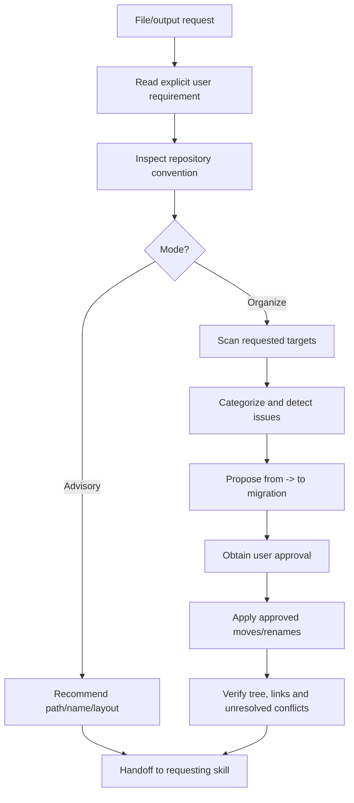
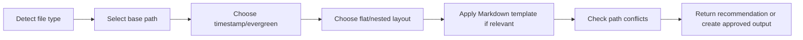
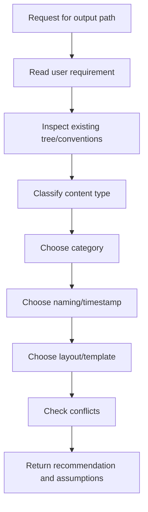
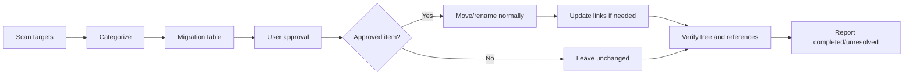
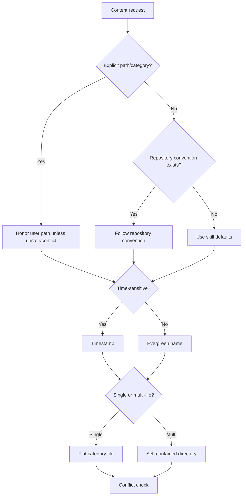
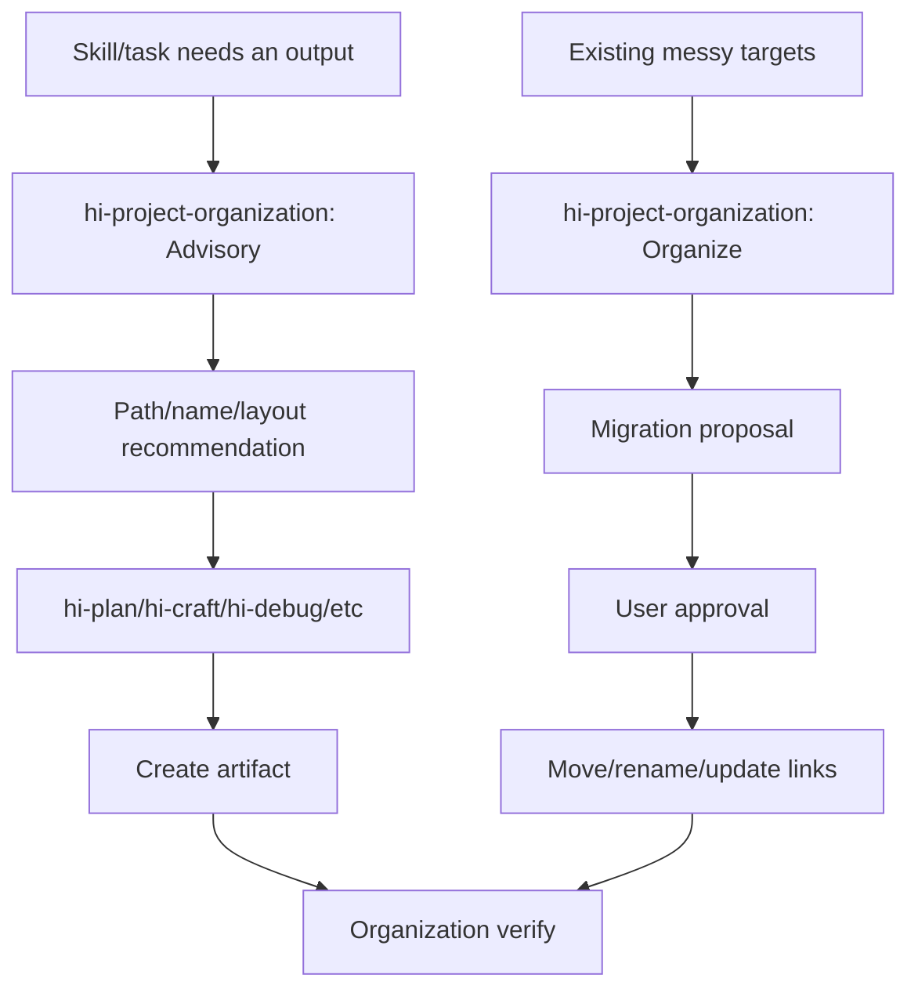
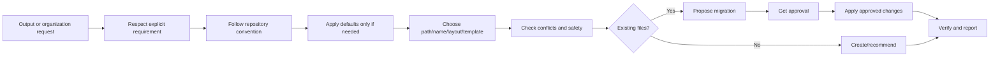

# Hi Project Organization Skill: Complete Guide

> `hi-project-organization` is the skill that decides where a file should live, what it should be named, how the directory structure should look, and what body structure Markdown should have. It helps a project keep a consistent layout without overriding existing conventions.

## 1. What problem does this skill solve?

When creating or moving an artifact, the question is not only "does the file have the right content?" but also:

- whether the file should live in `docs/`, `guides/`, `plans/`, `reports/`, or an existing category;
- whether to output a single file or a self-contained directory;
- whether the name is stable, easy to find, and follows the convention;
- whether the content is a plan, phase, report, log, ADR, guide, or specification;
- whether a timestamp is needed;
- how to handle conflicts when the file already exists;
- whether moving a file would break links/imports/build;
- whether the user has approved the migration.

`hi-project-organization` provides a decision process for those questions.

## 2. Overall mental model



Decision priority:

1. keep explicit user requirements;
2. follow the established repository/ecosystem convention;
3. only use the skill defaults when the two layers above do not decide.

## 3. Two modes

### 3.1 Advisory

Advisory only returns a recommendation:

- the path to use;
- the filename;
- the directory layout;
- timestamp or evergreen;
- the appropriate Markdown template;
- conflicts/risks to note.

Advisory does not move, rename, or delete files on its own.

Use it when:

- another skill needs to know the output path;
- the user is creating a new artifact;
- permission to modify the workspace has not been granted;
- naming needs to be decided before implementation.

Example:

```text
Request: Create a time-sensitive architecture decision.
Recommendation: docs/decisions/260814-auth-token-rotation.md
Template: ADR
Timestamp: yes
```

### 3.2 Organize

Organize actually performs the arrangement of targets, but with an approval gate:

1. scan only the requested targets;
2. categorize files/directories;
3. detect misplaced files, naming violations, conflicts;
4. present the migration `from -> to`;
5. wait for user approval;
6. apply only the approved moves/renames;
7. verify the final tree and report unresolved issues.

Do not move anything on your own before the user approves.

## 4. Resolving a new output

Six-step process:



### Step 1: Detect file type

Classify the output:

- source;
- test;
- documentation;
- technical log;
- architecture decision;
- plan;
- research/report;
- script;
- asset;
- configuration;
- user guide.

A file may need a category based on ownership, not only on its extension.

### Step 2: Select base path

Use the repository convention first. If none exists:

| Content | Default location |
|---|---|
| Source | `src/` or ecosystem-standard root |
| Tests | `test/` or `tests/` |
| Documentation | `docs/` |
| Technical logs | `docs/logs/` |
| Architecture decisions | `docs/decisions/` |
| Plans | `plans/{timestamp}-{slug}/` |
| Plan research/reports | `plans/{plan}/research/`, `plans/{plan}/reports/` |
| Standalone research/reports | `plans/research/`, `plans/reports/` |
| Scripts | `scripts/` |
| Assets | `assets/{type}/` |
| User guides | `guide/`, `guides/` or `docs/guides/` |
| Configuration | Ecosystem-standard root or supported `.config/` |

For example, in this repository the user requested that documentation be stored in `wiki/`, so that explicit requirement overrides the default `docs/`.

### Step 3: Timestamp or evergreen

Timestamp when content depends on the point in time:

- plan;
- report;
- log;
- session;
- generated artifacts whose creation time is meaningful.

Do not timestamp:

- evergreen docs;
- configs;
- source;
- scripts;
- templates;
- brand assets.

Default timestamp:

```text
{YYMMDD-HHmm}
```

If `$HI_PLAN_DATE_FORMAT` is set, use that format.

### Step 4: Flat or nested

- single output: flat within the category;
- multi-file output: self-contained directory;
- plan artifact: nested under the owning plan;
- variant: flat with a suffix;
- collection/platform: use a subdirectory when truly needed.

### Step 5: Markdown template

If the output is a plan, phase, report, log, ADR, changelog, README, guide, or specification, select the corresponding template. Do not add frontmatter if the tool/workflow does not consume it.

### Step 6: Check path conflicts

Before creating:

- whether the path already exists;
- whether a same-named file has different content;
- whether the directory has a naming conflict;
- which links/references would be affected;
- whether the file is governed by `.gitignore` or generated-file policy.

Rule: do not overwrite an existing file; surface the conflict.

## 5. Default directory layout

The defaults only apply when the repository has no clear convention.

### 5.1 Documentation

```text
docs/
├── system-architecture.md
├── code-standards.md
├── logs/{YYMMDD-HHmm}-{slug}.md
├── decisions/{YYMMDD}-{slug}.md
└── guides/{topic}.md
```

- evergreen docs are not timestamped;
- logs are timestamped;
- architecture decisions are timestamped;
- large documentation may be split by topic for easier navigation.

### 5.2 Plans

```text
plans/
├── {YYMMDD-HHmm}-{slug}/
│   ├── plan.md
│   ├── phase-{NN}-{name}.md
│   ├── research/
│   └── reports/
├── research/
├── reports/
├── templates/
└── visuals/
```

Rules:

- zero-pad phase numbers;
- scoped artifacts live inside their owning plan;
- standalone research/report lives in the top-level category;
- `plan.md` is concise and links to the detailed phase files.

### 5.3 Tests

```text
tests/
├── unit/
├── integration/
├── e2e/
├── fixtures/
└── helpers/
```

Follow the existing test root/suffix convention. Mirror the source structure when appropriate.

### 5.4 Scripts

```text
scripts/{action}-{target}.{ext}
```

- group by category when the collection is large enough;
- add a shebang if the script needs one;
- follow the existing executable/permission convention.

### 5.5 Assets

```text
assets/
├── images/
├── videos/
├── designs/
├── branding/
└── generated/{type}/
```

- single asset flat;
- multi-file output self-contained;
- use filename suffixes for size/platform/theme;
- timestamp generated content if creation time is meaningful.

### 5.6 Configuration

- manifest/compiler config at the ecosystem-standard root;
- `.config/` only when the tool/repository supports it;
- do not relocate secrets;
- do not commit populated `.env`.

## 6. Naming conventions

### 6.1 Slug

Normalize the title by:

1. lowercase;
2. replace spaces/special chars with hyphens;
3. collapse repeated hyphens;
4. trim hyphens at the start/end;
5. truncate at a word boundary, max 50 chars;
6. prefer self-documenting names, avoid confusing abbreviations.

Examples:

| Input | Slug |
|---|---|
| `User Authentication Flow` | `user-authentication-flow` |
| `Fix: API Rate Limiting Bug #42` | `fix-api-rate-limiting-bug-42` |
| `AI & Automation: A Guide` | `ai-automation-a-guide` |

### 6.2 Time-sensitive names

```text
{YYMMDD-HHmm}-{slug}
```

Examples:

```text
260814-0930-auth-token-rotation
260814-1015-payment-incident
```

### 6.3 Variants

| Variant | Pattern | Example |
|---|---|---|
| Size | `{name}-{width}x{height}.{ext}` | `hero-1920x1080.png` |
| Platform | `{name}-{platform}.{ext}` | `cover-youtube.png` |
| Theme | `{name}-{variant}.{ext}` | `logo-dark.svg` |
| Version | `{name}-v{N}.{ext}` | `mockup-v2.png` |
| Sequence | `{kind}-{NN}-{name}.{ext}` | `step-01-install.md` |

### 6.4 Code and directories

- code follows the language/repository convention;
- new non-code directories use kebab-case;
- collections use plural;
- sequences use zero-padded numbers;
- do not mechanically apply kebab-case to symbols/code files if the repo uses a different convention.

### 6.5 Plans and reports

```text
Plan folder: {YYMMDD-HHmm}-{slug}/
Standalone report: {type}-{YYMMDD-HHmm}-{slug}.md
Plan-scoped report: stable descriptive name inside reports/
```

## 7. Nesting rules

### 7.1 Single output

Keep flat within the category:

```text
docs/guides/setup.md
```

Do not create a dedicated directory for a single file unless there is an ownership/navigation reason.

### 7.2 Multi-file output

Use a self-contained directory:

```text
plans/260814-auth-flow/
├── plan.md
├── phase-01-schema.md
├── phase-02-api.md
└── reports/
```

### 7.3 Owner context

An artifact should live under the context that owns it:

- plan research under the plan;
- plan report under the plan;
- generated assets under the asset category/type;
- logs under the log directory.

### 7.4 Variants

Variants stay flat with a suffix:

```text
logo-dark.svg
logo-light.svg
```

Use a platform subdirectory only when the collection is large enough or the repository convention requires it.

### 7.5 `.gitkeep`

Only add `.gitkeep` when an intentionally empty directory needs to be tracked. Do not create `.gitkeep` for a directory that will be created once it has content.

## 8. Markdown rules

### 8.1 One H1

Each Markdown document should have exactly one H1 title. Use H2/H3 for content hierarchy.

### 8.2 Frontmatter

Only add frontmatter when:

- a tool consumes it;
- the workflow needs metadata;
- the document type requires it.

Do not add frontmatter just for decoration.

### 8.3 Content order

Default order:

```text
Context -> Main content -> Next steps / unresolved questions
```

### 8.4 Formatting

- tables for structured comparison;
- lists for sequences;
- short, scannable prose;
- relative links when appropriate for the repository;
- descriptive headings;
- do not bury critical decisions in long paragraphs.

## 9. Markdown body templates

### 9.1 Plan

```markdown
---
title: "{Plan title}"
status: pending
created: YYYY-MM-DD
---
# {Plan title}
## Overview
## Phases
## Dependencies
## Success Criteria
```

### 9.2 Phase

```markdown
# Phase {NN}: {Name}
## Context
## Requirements
## Architecture
## Related Files
## Implementation Steps
## Todo
## Risks
## Success Criteria
```

### 9.3 Report

```markdown
---
type: {report type}
date: YYYY-MM-DD
---
# {Report type}: {Subject}
## Summary
## Findings
## Recommendations
## Unresolved Questions
```

### 9.4 Log

```markdown
---
date: YYYY-MM-DD
topic: {topic}
---
# Log: {Topic}
## Context
## What Happened
## Decisions
## Reflection
## Next Steps
```

### 9.5 Document

```markdown
# {Title}
## Overview
## {Content sections}
## References
```

### 9.6 Architecture Decision Record

```markdown
# ADR-{NNN}: {Decision}
- **Status:** proposed | accepted | deprecated | superseded
- **Date:** YYYY-MM-DD
## Context
## Decision
## Consequences
## Alternatives Considered
```

### 9.7 Changelog

```markdown
## [{version}] - YYYY-MM-DD
### Added
### Changed
### Fixed
### Removed
### Deprecated
```

### 9.8 README

```markdown
# {Project name}
{One-line description}
## Quick Start
## Usage
## Development
## Contributing
## License
```

### 9.9 Guide

```markdown
# {Guide title}
## Prerequisites
## Steps
## Troubleshooting
## FAQ
```

### 9.10 Specification

```markdown
# {Specification title}
## Overview
## Requirements
## Constraints
## API / Interface
## Acceptance Criteria
```

A template is a skeleton, not a requirement to fill in empty sections. Omit a section that adds no information.

## 10. Advisory workflow in detail



The advisory response should include:

- the proposed path;
- the proposed filename;
- why this category;
- the timestamp/evergreen rationale;
- the layout;
- the template;
- conflicts/assumptions;
- whether user approval is needed before creation.

Advisory should not create directories/files on its own unless the request clearly moves to create/organize.

## 11. Organize workflow in detail

### 11.1 Scan

Only scan the requested targets; do not map the whole repository unless needed. Categorize:

- correctly placed;
- misplaced;
- naming violation;
- duplicate;
- conflict;
- protected/unsafe.

### 11.2 Propose migration

The migration table must include:

| From | To | Reason | Risk |
|---|---|---|---|
| `docs/old-guide.md` | `docs/guides/setup.md` | Align guide category | Links may change |
| `report.md` | `docs/reports/260814-report.md` | Time-sensitive report | Update references |

If a rename affects imports/links, record the update set explicitly.

### 11.3 Approval gate

The user must approve before:

- move;
- rename;
- delete;
- category reorganization;
- bulk migration.

Approval can be line-by-line or for the whole proposed migration. Do not infer approval from the user having asked to "organize" if the migration table has not been reviewed.

### 11.4 Execute

Only apply approved items. Preserve:

- file history when possible via normal move;
- content;
- permissions when appropriate;
- relative links after updates;
- unrelated user changes.

### 11.5 Verify

Check:

- the final tree;
- target paths;
- links/references;
- imports/build if source was moved;
- no accidental deletes;
- no unresolved conflicts;
- `.gitignore`/protected files were not modified.



## 12. Path conflict handling

### 12.1 Existing file

Do not overwrite. Surface:

- the path already exists;
- whether the content is identical;
- merge/rename/skip options;
- the user decision needed.

### 12.2 Existing directory

Check:

- whether the directory has the right owner/category;
- the convention inside it;
- naming/flat-vs-nested conflicts;
- whether it can be reused.

### 12.3 Name collision

Options:

- choose a different slug;
- add a variant suffix;
- add a timestamp if the content is time-sensitive;
- merge only when the user requests it and the semantics are clear.

Do not add random suffixes like `file-final-2-new.md` just to avoid a collision.

### 12.4 Link/import impact

Before moving a source/doc:

- search relative links;
- search imports/references;
- check generated/index files;
- update references after approval;
- verify build/test/docs links.

## 13. Safety rules

### 13.1 Protected paths

Do not modify:

- `.git/`;
- dependency directories;
- secrets;
- `.env` files;
- populated secret config;
- generated directories if repository policy forbids it.

### 13.2 Never overwrite

If there is a path conflict, stop at the conflict and ask/suggest. Do not silently replace a file.

### 13.3 Respect `.gitignore`

`.gitignore` is a project behavior signal. Do not remove ignores on your own to track an output. Do not commit generated secrets/artifacts just because organization needs it.

### 13.4 Preserve user changes

The worktree may be dirty. Do not revert unrelated changes. If the target has user changes that affect the migration, work with the change or ask if it is impossible.

### 13.5 No unnecessary categories

Do not create `docs/reports/`, `assets/generated/`, or nested categories if the output does not need them. A new category must have justification and fit the convention.

## 14. Decision matrix



## 15. Example: creating a report

Request:

```text
Create a report summarizing the 2026-08-14 incident.
```

Decision:

- type: report;
- time-sensitive: yes;
- default category: `plans/reports/` if it is standalone planning research, or `docs/logs/` if it is a technical incident log per repo convention;
- name: `incident-260814-<slug>.md` or the equivalent project convention;
- template: Report;
- frontmatter: type/date.

Recommendation:

```text
docs/reports/incident-260814-api-timeout.md
```

If the repository already has `docs/incidents/`, follow that instead.

## 16. Example: creating a multi-file plan

Request:

```text
Create an implementation plan for token rotation with research and phases.
```

Default:

```text
plans/260814-0930-token-rotation/
├── plan.md
├── phase-01-storage.md
├── phase-02-rotation.md
├── phase-03-tests.md
├── research/
└── reports/
```

Rules:

- the plan folder is timestamped;
- phase numbers are zero-padded;
- research/reports belong to the plan;
- `plan.md` is concise and links the detailed phases;
- do not scatter phase files at the top level of `plans/`.

## 17. Example: organizing existing files

Current:

```text
root/
├── report.md
├── docs/
│   └── setup.md
└── misc/
    └── architecture-decision.md
```

Proposal:

| From | To | Reason | Approval |
|---|---|---|---|
| `report.md` | `docs/reports/260814-api-report.md` | Report category/time naming | Required |
| `docs/setup.md` | `docs/guides/setup.md` | Guide category | Required |
| `misc/architecture-decision.md` | `docs/decisions/260814-architecture-decision.md` | ADR category/time naming | Required |

Do not move right away. First present the migration table, wait for approval, then move and check links.

## 18. Example: wiki documentation in this repository

The user requested that the skill docs be stored in `wiki/`. Although the skill's default documentation path is `docs/`, the priority order applies as follows:

```text
Explicit user requirement: wiki/
    > Repository convention/attachment context
        > Default: docs/
```

Therefore, files such as:

```text
wiki/hi-plan-skill.md
wiki/hi-craft-skill.md
wiki/hi-fix-skill.md
```

are valid per the explicit requirement. This is an important example: defaults do not override user intent.

## 19. Verify organization

### 19.1 New output verify

- [ ] The content type has been classified.
- [ ] The explicit user path is prioritized.
- [ ] The repository convention has been checked.
- [ ] Defaults are only used when there is no convention.
- [ ] Timestamp/evergreen is correct.
- [ ] Slug is lowercase kebab-case, self-documenting, <=50 chars when applicable.
- [ ] Flat/nested layout is appropriate.
- [ ] Existing path conflicts have been checked.
- [ ] The Markdown template is appropriate.

### 19.2 Existing organization verify

- [ ] Only requested targets were scanned.
- [ ] Misplaced/naming/conflict issues have been classified.
- [ ] The migration table has from/to/reason/risk.
- [ ] User approval was obtained before move/rename/delete.
- [ ] Only approved items were applied.
- [ ] Links/imports were checked.
- [ ] The final tree was verified.
- [ ] Unresolved issues were reported.

### 19.3 Safety verify

- [ ] `.git/` was not touched.
- [ ] Dependencies/secrets/.env were not touched.
- [ ] No existing file was overwritten.
- [ ] No unrelated user changes were reverted.
- [ ] `.gitignore` is respected.
- [ ] No redundant categories/nesting were created.

## 20. Relationship with other skills



| Skill | Project organization support |
|---|---|
| `hi-plan` | Plan directory, phase names, research/report placement |
| `hi-craft` | Implementation output and handoff artifact path |
| `hi-fix` | Diagnostic report, logs and related docs |
| `hi-debug` | Incident/performance/report layout |
| `hi-scenario` | Scenario report deliverable path |
| `hi-predict` | Prediction report naming/path |
| `hi-repository-search` | Evidence report/document placement |
| `hi-log` | Technical log path and timestamp |

## 21. Limitations to understand correctly

### 21.1 Local convention beats defaults

The skill should not impose the default layout when the repository already has a different structure. A project using `wiki/`, `notes/`, or `engineering/` can be perfectly valid.

### 21.2 Organization does not evaluate content correctness

The skill arranges path/name/layout. It does not replace technical review, tests, or documentation accuracy review.

### 21.3 Moves can have hidden references

Static search can miss generated links, external bookmarks, runtime paths, or case-sensitive filesystem differences. The report should state residual risk for large moves.

### 21.4 Timestamps need a stable policy

Do not timestamp evergreen docs just because they were created today. Conversely, do not drop the timestamp from an incident/report if chronology is part of its value.

### 21.5 Templates do not require filling empty sections

The Markdown template is an outline. Sections that add no information should be omitted to keep the document concise.

## 22. Quick summary



The shortest sentence to remember:

> `hi-project-organization` does not impose a rigid layout on its own; it finds the balance between explicit requirements, repository conventions, consistent naming/layout, safety, and the ability for others to find the artifact later.
