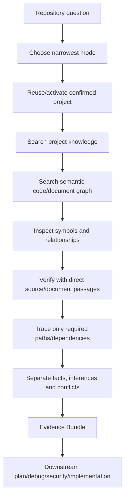
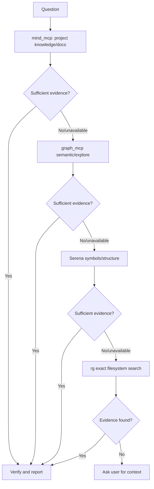
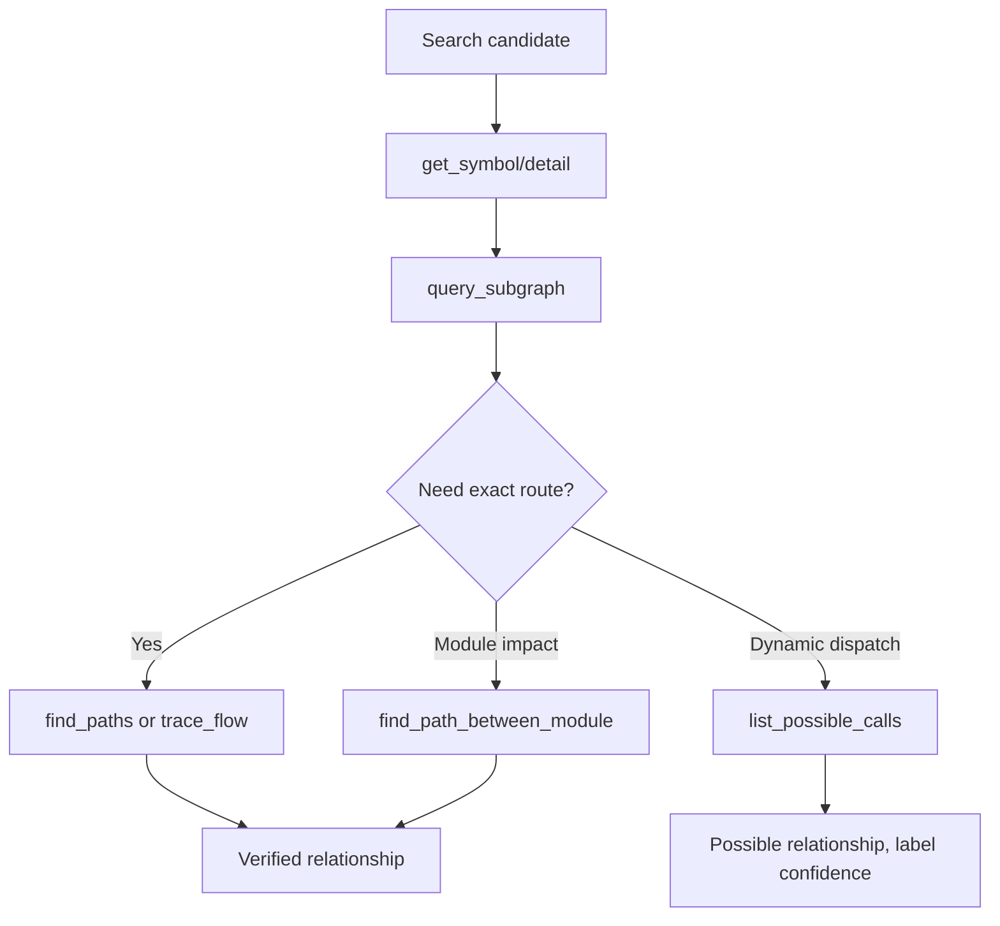
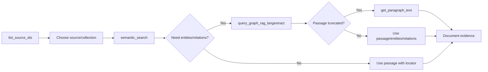
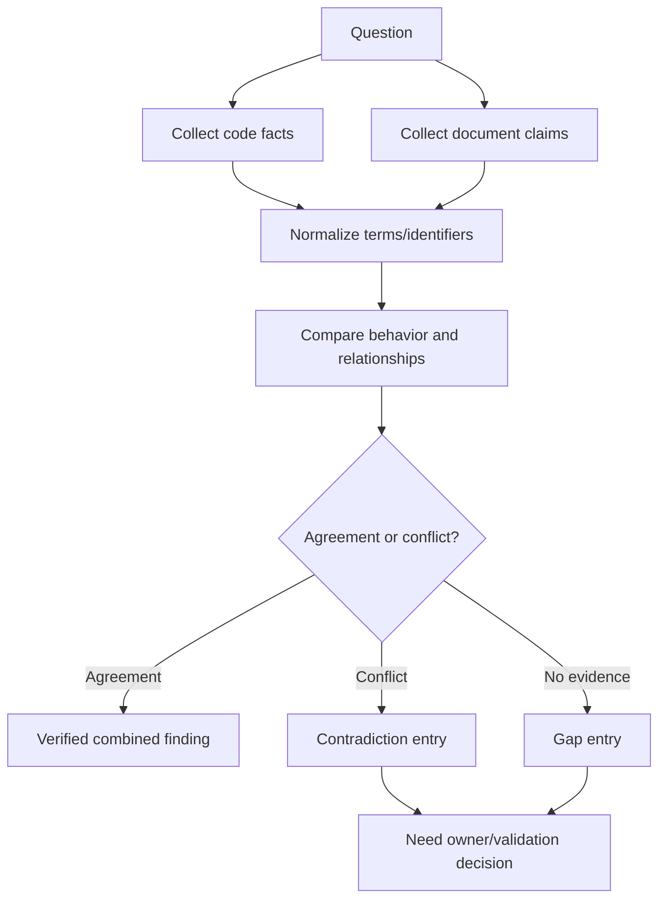
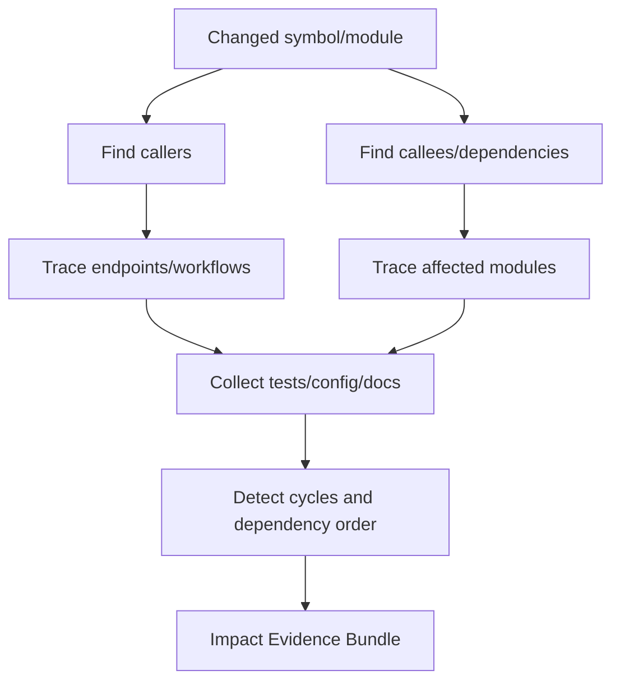
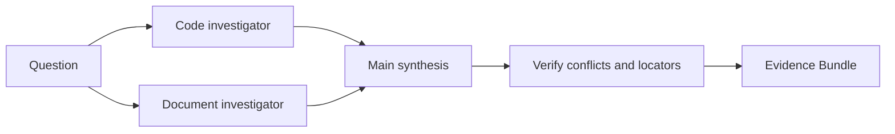
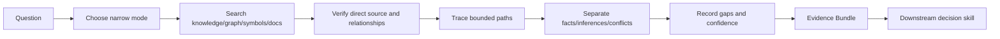

# Hi Repository Search Skill: Complete Guide

> `hi-repository-search` is a skill that gathers and verifies evidence from repository code and project documents. It serves codebase exploration, architecture, feature tracing, dependency/impact analysis, and questions that need traceable source context.

## 1. What Problem Does This Skill Solve?

A repository question usually requires several kinds of evidence:

- related function/class/file;
- symbol references and implementations;
- caller/callee and call paths;
- module dependencies;
- project documents, decisions and requirements;
- code-document contradictions;
- impact on workflows or endpoints;
- confidence and gaps of the results.

`hi-repository-search` does not only search text. It combines:

```text
Project knowledge
    + semantic code search
    + graph relationships
    + symbol structure
    + document graph RAG
    + direct source verification
    = Traceable Evidence Bundle
```

This skill does **not own**:

- planning decisions of `hi-plan`;
- root-cause diagnosis of `hi-debug`;
- implementation decisions of `hi-craft`;
- final fixes of `hi-fix`.

It provides context and evidence so those skills can make better decisions.

## 2. Overall Mental Model



Evidence is sufficient only when:

- the relevant source is identified;
- required relationships are verified;
- facts and inferences are separated;
- contradictions/gaps are stated;
- confidence is justified.

## 3. Modes

| Mode | Scope | When to use |
|---|---|---|
| Default | Narrowest search that answers the question | Small question, no need for a wide graph yet |
| `--code` | Code, symbols, references, call paths | Find implementation and execution flow |
| `--doc` | Project documents, decisions, requirements | Find rationale/requirement/document context |
| `--deep` | Reconcile code with documents, report conflicts | Code-document mismatch or architecture review |
| `--impact` | Callers, dependencies, affected modules/workflows | Blast radius, refactor and change impact |

### 3.1 Default mode

Default must start as narrow as possible:

- target one symbol/file/module;
- use a query sufficient to answer the question;
- do not automatically expand the whole graph;
- only expand when current evidence is insufficient.

Default does not mean shallow search. It is a principle for controlling scope and noise.

### 3.2 `--code`

Use when you need:

- function/class/type;
- implementations and references;
- entry point;
- caller/callee;
- call path;
- dependency order;
- function pointer/possible calls;
- module boundary.

### 3.3 `--doc`

Use when you need:

- requirements;
- architecture decision;
- business rule;
- project convention;
- design rationale;
- compliance/security policy;
- document source/paragraph.

### 3.4 `--deep`

Use when code and docs need to be reconciled. The output must distinguish:

- code fact;
- document claim;
- agreement;
- contradiction;
- missing evidence;
- inference that needs validation.

### 3.5 `--impact`

Use when a change to a node/module may affect:

- callers;
- callees;
- dependencies;
- endpoints/workflows;
- affected modules;
- migration/test surface.

Impact mode does not only count references. You need to trace the relevant relationships and state the depth/limits used.

## 4. Search Order

The skill uses the first level with sufficient evidence:



Order:

1. `mind_mcp` for project knowledge and documents;
2. `graph_mcp.semantic_search`, `graph_mcp.explore_graph` for semantic code discovery/relationships;
3. `serena` for symbols, implementations, references and structural search;
4. `rg` for exact-string filesystem search.

### 4.1 Fast-fail

If a tool is unavailable:

- record it once;
- move to the next tool level;
- do not retry indefinitely;
- keep the gap in the Evidence Bundle.

Stop descending when evidence is sufficient. Only use a lower level to close a specific gap; do not search broadly out of inertia.

### 4.2 Candidate vs proof

A semantic search result is only a candidate. Every important claim must be verified with:

- direct source;
- symbol relationship;
- call path;
- document passage;
- an appropriate graph relation.

```text
Semantic match -> Candidate
Direct symbol/source/path -> Verified fact
```

## 5. Overall Workflow

### Step 1: Reuse project

- check whether the project is already confirmed;
- reuse the project context if available;
- if not, discover and activate once;
- do not re-activate the project on every query.

### Step 2: Search narrowly

- turn the question into a target/query;
- choose the narrowest mode;
- limit depth, top_k and result count;
- record parser/project/collection context when needed;
- do not open the whole graph if the question only needs one symbol.

### Step 3: Verify claims

- read the source directly;
- get symbol details;
- check references/callers/callees;
- trace the required path;
- read the full document paragraph if the passage is truncated.

### Step 4: Trace required relationships

Only trace the relationships that answer the question:

- call path to the target;
- module dependencies;
- affected callers;
- workflows containing the behavior;
- document relations supporting the claim.

Cap depth/result count to avoid graph explosion.

### Step 5: Synthesize

Synthesize into an Evidence Bundle:

- coverage;
- findings;
- relationships;
- contradictions;
- inferences;
- gaps.

## 6. Evidence Bundle

Standard output:

```markdown
## Coverage
- tool: used | unavailable | no results | skipped

## Findings
- Claim — code|document — file+symbol|source_id+paragraph_id — confidence
  Evidence: concise supporting detail

## Relationships
Verified call paths, dependencies, or document relations.

## Contradictions
Conflicting sources or code-document differences.

## Inferences
Derived conclusions, explicitly labeled.

## Gaps
Unavailable, unindexed, or unanswered context.
```

### 6.1 Coverage

Coverage answers:

- which tools were used;
- which tools were unavailable;
- which tools returned no results;
- which scope was skipped;
- which parser/project/collection was bound;
- the key depth/top_k/limits.

Example:

```markdown
## Coverage
- mind_mcp: used, requirements query limit 10
- graph_mcp: used, semantic search top_k 10, call graph depth 2
- serena: used for symbol references
- rg: skipped, evidence sufficient
```

### 6.2 Findings

Each finding must have:

- claim;
- domain `code` or `document`;
- source locator;
- confidence;
- evidence detail.

Example:

```markdown
- `refreshSession` owns token rotation — code — `src/auth/session.ts:refreshSession` — high
  Evidence: route handler calls `refreshSession`; test covers rotation result.
```

Do not write findings like "this file seems related" without evidence.

### 6.3 Relationships

Only record verified relationships:

```markdown
- `LoginController.handle` -> `AuthService.authenticate` -> `TokenService.issue`
- `orders.ts` depends on `payment-client.ts` through `PaymentGateway.charge`
```

### 6.4 Contradictions

Clearly record which sources conflict:

```markdown
- Code allows refresh token reuse for 7 days; security policy document says reuse must revoke token family.
```

Do not arbitrarily pick one source and hide the other.

### 6.5 Inferences

An inference is a derived conclusion, not a source fact:

```markdown
- Inference: changing `TokenService.issue` may affect login and password-reset flows because both share the same caller path.
```

An inference must have the relationships/evidence leading to it and appropriate confidence.

### 6.6 Gaps

Record:

- sources not yet ingested;
- missing graph relations;
- dynamic dispatch not resolved;
- documents lacking the required paragraph;
- tool unavailable;
- production behavior that cannot be proven.

## 7. Code Graph MCP

The code graph consists of:

- Neo4j/FalkorDB for functions, classes, calls, dependencies;
- Qdrant for vector embeddings and semantic search.

### 7.1 Discovery before query

Per the code graph reference:

1. `list_mcp_functions` to learn the tools/parameters/use cases;
2. `list_parsers` to learn parser types/language aliases;
3. choose the project/parser/collection context;
4. run the appropriate search.

In a graph-enabled environment, pass `parser_type` on each call when the tool requires it to avoid using the wrong query profile.

### 7.2 Semantic search

`semantic_search` is the entry point when the exact function name is unknown. Query in natural language:

```text
how does authentication refresh an expired session?
allocate memory safely
error handling for database connections
```

Characteristics:

- mode: `code`, `comment`, `hybrid`;
- `top_k` limits candidates;
- `collection`/`project_id` scope the data;
- semantic results are candidates;
- verify with `get_symbol`, source, or graph relationships.

Do not use `expand_graph` as a substitute for the graph explorer if policy requires separate graph expansion; use `explore_graph` for clearer traversal.

### 7.3 Explore graph

`explore_graph` combines:

- semantic search;
- BM25 keyword search;
- call-graph expansion.

Use for high-level/ambiguous queries:

```text
feature that handles failed payment retries
flow from HTTP request to database transaction
where authorization is enforced for admin actions
```

Output usually includes:

- `matched_nodes`;
- `entry_points`;
- `related_paths`;
- `explanation`;
- `confidence`;
- `query_analysis`;
- `mode`.

### 7.4 Exact symbol/code search

`search_functions` is used when the name or qualified name is known:

```text
query: "authenticate|refreshSession|TokenService"
```

`search_by_code` is used when the code text inside a function body is known.

`listup_symbols_matching_file_path` inventories symbols by path.

`listup_class_matching_path` inventories methods within a class.

### 7.5 Entry points

`list_up_entrypoint` finds functions in a module that are called from outside the module. Use it to identify:

- public API;
- external interface;
- module entry;
- integration boundary.

This is a good starting point for impact analysis and feature tracing.

### 7.6 Detail inspection

Once you have a node ID:

- `get_symbol` fetches details of one node;
- `get_node_details` batch-fetches multiple nodes more efficiently.

Content mode can be selected:

- `summary`;
- `comment`;
- `code`;
- `name`;
- `auto`.

Batch details should be used when you already have many candidates, to reduce the number of MCP calls.

### 7.7 Annotation

`annotate_node` adds notes/tags/severity for code review or documentation. Annotations are metadata that aid lookup; they do not replace source code or the Evidence Bundle.

## 8. Call Graph and Flow Tracing

### 8.1 Subgraph around a function

`query_subgraph` retrieves:

- callers: who calls the function;
- callees: what the function calls;
- nodes/edges within depth.

Important parameters:

- `function_id`;
- `max_depth` defaults to 2;
- `direction`: `in`, `out`, `both`;
- `relationship_types`, usually `CALLS`.

Use `out` to see callees/dependencies; `in` to see blast radius/callers; `both` to understand context.

### 8.2 Path between functions

`find_paths` finds execution paths between a start and an end function. Limit `max_depth` (default 5) and limit results to avoid path explosion.

Use when the question is:

```text
Can request handler eventually call payment settlement?
```

### 8.3 Path between modules

`find_path_between_module` finds call paths by file/module patterns:

- source modules;
- target modules;
- direction `out`, `in`, `both`;
- `include_possible` for `POSSIBLE_CALLS`;
- `include_fp` for function pointers;
- `limit` for path count.

This is a good tool for cross-module dependency and architecture impact.

### 8.4 Advanced flow

- `trace_flow`: function-to-function by custom relationship types;
- `trace_flow_between_module`: module-to-module flow;
- `list_possible_calls`: function pointer, virtual call, callback registration.

`POSSIBLE_CALLS` must be recorded as a possible/inferred relationship, not expressed as a direct static call unless the graph has proven it.



## 9. Dependency Planning and Cycle Detection

### 9.1 Strongly Connected Components

`compute_scc` detects dependency cycles in the graph:

- `components`;
- `node_to_scc`;
- `cycle_summary`;
- `is_cycle`.

Cycles must be clearly recorded because they affect:

- refactor order;
- migration;
- build/deploy dependency;
- parallel implementation.

### 9.2 Topological sort

`topological_sort` produces:

- linear order;
- parallel waves;
- or both.

If the graph has a cycle, `on_cycle` can be:

- `auto_condense_scc`;
- `error`.

A topological order is dependency evidence, not automatically a complete implementation plan.

### 9.3 Module/file/function dependency order

Tools:

- `plan_dependency_order`: module-level;
- `plan_file_dependency_order`: file-level;
- `plan_function_dependency_order`: function-level.

Output may include:

- waves;
- module/file/function order;
- depends-on map;
- cycle info.

Use this output to support `hi-plan` or parallel implementation, but the final decision still requires the plan's scope/risks.

## 10. Document Graph RAG

Document graph RAG uses:

- Neo4j/FalkorDB for entities, relations, paragraphs;
- Qdrant for document vector embeddings.

Default transport reference: streamable HTTP, port `8789`.

### 10.1 Discover documents

`list_source_ids` lists the documents that have been ingested. Use it when source IDs are unknown.

`list_qdrant_collections` lists collections to choose the right one.

Do not search an ambiguous collection if repository policy requires binding a collection first.

### 10.2 Semantic document search

`semantic_search` is vector-only:

- returns passages;
- has `score`;
- has `source_id`;
- has `paragraph_id`;
- does not expand the graph.

Use when you only need the relevant text passage.

### 10.3 Graph RAG search

`query_graph_rag_langextract` is the primary function for deep document understanding:

1. query Qdrant to get passages;
2. get entities from the passages;
3. get relations from the graph;
4. expand related entities by depth.

Important parameters:

- `top_k`;
- `source_id`;
- `collection`;
- `include_entities`;
- `include_relations`;
- `expand_related`;
- `related_k`;
- `graph_depth`;
- `entity_types`;
- `min_score_to_expand`;
- `min_entity_occurrences`;
- `rerank` and weights.

Use a small graph depth first; increase depth only when direct relations are insufficient.

### 10.4 Full paragraph

If a passage is truncated by `max_passage_chars`, use:

```text
get_paragraph_text(source_id, paragraph_id)
```

Document evidence should point to `source_id + paragraph_id`, not just copy a snippet without a locator.

### 10.5 Typical document flow



## 11. Code-Document Reconciliation: `--deep`

### 11.1 Goal

Compare what the code does with what the documents say:

- whether the requirement is implemented;
- whether config/behavior deviates from policy;
- whether architecture docs are still accurate;
- whether a security decision is bypassed;
- whether the code has undocumented behavior.

### 11.2 Process



### 11.3 Rules

- code facts do not automatically overwrite document requirements;
- document claims do not automatically prove runtime behavior;
- version/date/source must be recorded;
- contradictions must appear in the report;
- inferences must attach an evidence chain;
- unresolved conflicts need an owner or a next query.

## 12. Impact Analysis: `--impact`

### 12.1 Questions

- which callers are affected by changing this function;
- which modules this module depends on;
- which endpoints/workflows go through this path;
- which tests need updates;
- which cycles block migration/refactor;
- which external integrations are affected.

### 12.2 Flow



### 12.3 Depth discipline

Impact analysis must record:

- start node/module;
- direction;
- max depth;
- relationship types;
- result limit;
- whether possible/dynamic calls are included;
- known unindexed/unresolved paths.

Do not claim "all impacted files" if you only searched depth 2 or only static direct callers.

## 13. Query Strategy

### 13.1 From question to query

| User question | First tool | Verify with |
|---|---|---|
| "Which function handles login?" | `semantic_search` or `search_functions` | `get_symbol`, callers/callees |
| "Who calls this function?" | `query_subgraph` direction `in` | direct source/reference |
| "Flow from A to B?" | `find_paths`/`trace_flow` | path nodes/edges + source |
| "Which modules are affected?" | `find_path_between_module`/impact | dependency/order tools |
| "What does the requirement say?" | doc `semantic_search` | `get_paragraph_text` |
| "Does the code match the docs?" | `--deep` dual search | contradiction report |
| "Are there cycles?" | `compute_scc` | cycle summary + graph edges |
| "In what order should I implement?" | dependency order tools | phase/ownership review |

### 13.2 Query narrowing

A good query includes:

- behavior or symbol;
- module/domain;
- version/project if needed;
- the relationship to answer;
- adequate limits/depth.

Example:

```text
Authentication flow that refreshes expired sessions in the API layer
```

After candidate results:

```text
Get symbol details for the refresh-session candidates, then trace callers and token-store writes up to depth 2.
```

### 13.3 Semantic query families

Do not use a single query for a large feature. You can create groups:

- entry point query;
- state mutation query;
- error handling query;
- external integration query;
- test query;
- authorization query;
- persistence query.

Then deduplicate and reconcile the findings.

## 14. Confidence and Evidence Quality

### 14.1 Confidence levels

| Confidence | Meaning |
|---|---|
| High | Direct source + verified relationship/path |
| Medium | Strong semantic/graph evidence, direct source not yet sufficient |
| Low | Static fallback, inference, or possible call |
| Unknown | Tool/source unavailable or unresolved conflict |

### 14.2 Evidence chain

```text
Query candidate
  -> symbol/path/document locator
    -> direct source/paragraph
      -> relationship verification
        -> bounded claim
```

### 14.3 Do not hallucinate

If nothing is found:

```markdown
## Gaps
- No indexed implementation found for `X`.
- Dynamic callback path not resolved by available graph.
- Requirement source unavailable.
```

Do not turn "not found" into "does not exist".

## 15. Subagents

Do not spawn by default. Use at most two investigators:

- one tracks code;
- one tracks documents.

Only delegate when:

- user/project instructions allow it;
- the tracks are independent;
- the work spans at least 3 subsystems;
- independent conflict verification is needed.

The main agent owns synthesis and confidence. A subagent report must not automatically be treated as verified evidence; the main agent must check the locator/claim.



## 16. Output for Downstream Skills

### 16.1 For `hi-plan`

Provide:

- existing code;
- module ownership;
- architecture relationships;
- dependencies/cycles;
- requirements/decision docs;
- contradictions;
- affected tests/workflows.

### 16.2 For `hi-debug`

Provide:

- entry point;
- call chain;
- data flow;
- error handler;
- config/dependency;
- possible dynamic path;
- direct source evidence.

### 16.3 For `hi-fix`

Provide locate-only context to fix the root cause:

- affected files/symbols;
- callers/callees;
- tests;
- recent implementation patterns;
- impact boundary.

### 16.4 For `hi-security`

Provide:

- auth boundary;
- data flow;
- external inputs;
- storage/logging path;
- possible exposure/call path;
- policy/document contradiction.

## 17. Verification Checklist

### 17.1 Search verify

- [ ] The smallest suitable mode has been selected.
- [ ] Project/parser/collection context is correct.
- [ ] The search order has been followed.
- [ ] Unavailable tools are recorded, no infinite retries.
- [ ] Semantic results have been treated as candidates.

### 17.2 Code verify

- [ ] The symbol/file locator exists.
- [ ] The direct source has been read.
- [ ] Caller/callee/path direction is correct.
- [ ] Depth/limit are recorded.
- [ ] Possible/dynamic calls are labeled correctly.
- [ ] Dependency cycles are checked when relevant.

### 17.3 Document verify

- [ ] Source ID/collection is correct.
- [ ] Paragraph ID is recorded.
- [ ] The full passage is fetched when truncated.
- [ ] Entity/relation expansion matches the depth.
- [ ] The document's version/date/owner is recorded if needed.

### 17.4 Synthesis verify

- [ ] Facts, relationships and inferences are separated.
- [ ] Contradictions are not hidden.
- [ ] Gaps/unindexed/unavailable items are recorded.
- [ ] Confidence has evidence.
- [ ] Claims are not broader than the search scope.
- [ ] The report is sufficient for a downstream skill to continue.

## 18. Example: Tracing the Authentication Flow

Question:

```text
From the HTTP login request, which flow creates the refresh token and stores revocation state?
```

### Step 1: Candidate discovery

Use semantic search for:

```text
HTTP login flow that creates and stores refresh tokens
```

### Step 2: Verify symbols

- fetch the `LoginController`/route candidate;
- fetch `AuthService.authenticate`;
- fetch `TokenService.issueRefreshToken`;
- fetch the token repository/storage symbol.

### Step 3: Trace

Find the path:

```text
HTTP route -> controller -> auth service -> token service -> token store
```

Also check callers if the token service is used in the password reset or refresh flow.

### Step 4: Evidence Bundle

```markdown
## Findings
- Login route delegates authentication to `AuthService.authenticate` — code — high
  Evidence: direct call path verified.
- Refresh token persistence occurs in `TokenStore.save` — code — high
  Evidence: path from token service reaches repository write.

## Relationships
- `LoginController.handle` -> `AuthService.authenticate` -> `TokenService.issue`
- `TokenService.issue` -> `TokenStore.save`

## Inferences
- Changing token persistence may affect both login and refresh flows.

## Gaps
- Revocation behavior for concurrent refresh requests is not resolved.
```

## 19. Example: Reconciling Code and Security Policy

Question:

```text
Does the code enforce the refresh-token reuse policy in the security decision document?
```

### Code side

- find token validation/reuse symbols;
- trace revocation state;
- verify concurrent/replay path.

### Document side

- list source IDs;
- semantic search policy;
- fetch the full paragraph containing the reuse rule;
- expand entities/relations if needed.

### Reconcile

```markdown
## Findings
- Code permits token reuse until expiry — code — medium/high
- Security policy requires family revocation on reuse — document — high

## Contradictions
- Code behavior and policy requirement diverge on replay handling.

## Inferences
- A security remediation plan is required; do not treat current code as compliant.

## Gaps
- No indexed integration test proves behavior under concurrent replay.
```

## 20. Example: Impact Analysis Before a Refactor

Target:

```text
Rename/change contract of `PaymentGateway.charge`.
```

Impact steps:

1. search for the symbol and get details;
2. query callers direction `in`;
3. trace module-to-module paths;
4. include possible calls/callbacks if the API is an interface;
5. list tests and endpoint workflows;
6. compute SCC/topological order if there is a dependency cycle;
7. report affected modules, confidence and unresolved dynamic paths.

Do not report a "safe rename" just because there are few direct callers; interface implementations, function pointers, generated code and docs need to be checked.

## 21. Failure Modes

| Failure | How to handle |
|---|---|
| mind_mcp unavailable | Record coverage, move to graph |
| graph unavailable | Serena/native fallback, lower confidence |
| Semantic results too broad | Narrow the query, filter project/module, verify direct source |
| No exact symbol match | Run semantic search, then inspect candidates |
| Graph path explosion | Reduce depth/limit, trace the specific relationship |
| Dynamic dispatch unresolved | Use `POSSIBLE_CALLS`, label as possible, record the gap |
| Document passage truncated | `get_paragraph_text` |
| Collection/source unclear | List collections/source IDs first |
| Code/docs conflict | Keep both, create Contradictions |
| No evidence found | Record a Gap, ask the user when all levels fail |

## 22. Limitations to Understand Correctly

### 22.1 Search is not proof of runtime

Graph/code/document search proves source context and static relationships, not behavior in every runtime/environment.

### 22.2 Semantic search is not exact search

A semantic score is candidate ranking. Direct source/path verification is still needed for important claims.

### 22.3 The graph is not always complete

Generated code, reflection, callbacks, function pointers or parser limitations can create missing edges. `POSSIBLE_CALLS` and Gaps must be used correctly.

### 22.4 The document graph does not guarantee the latest document

Record source/date/version. An indexed document may be stale or may not reflect the deployed config.

### 22.5 Impact depth is finite

If you only trace to depth 2, do not claim the full transitive blast radius. The report must state the depth/limit.

### 22.6 Does not own decisions

Repository search returns evidence. The owner of the plan, diagnosis, implementation or security policy decides the action.

## 23. Quick Summary



The shortest sentence to remember:

> `hi-repository-search` does not just answer "which file is related"; it builds an Evidence Bundle with locators, relationships, confidence, contradictions and gaps so that others can inspect and make decisions without guessing.
