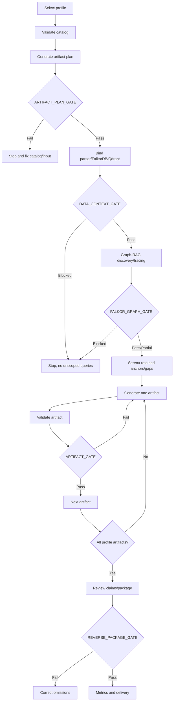
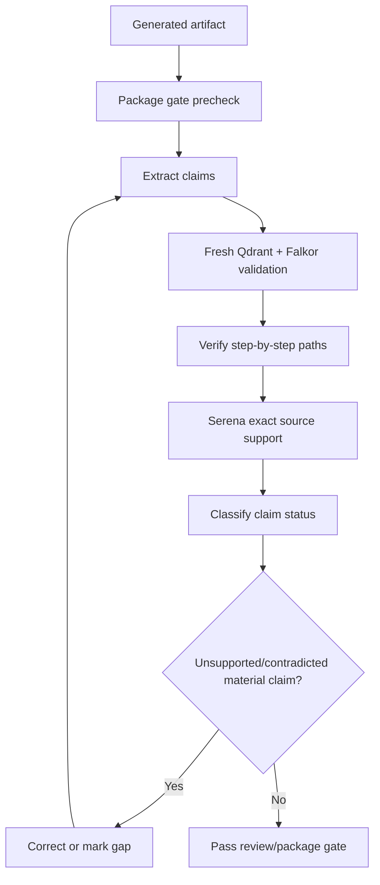
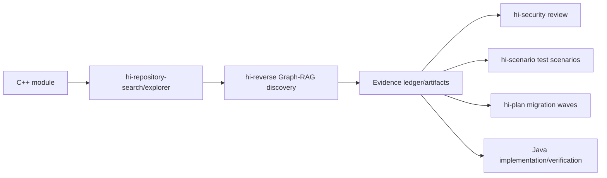

# Hi Reverse Skill: Complete Guide

> `hi-reverse` reverse-engineers a C/C++ module into validated package artifacts: use cases, traces, sequence/class/state/activity/architecture diagrams, catalogs, evidence ledger, C++→Java parity/mapping, migration waves/risks/tests, and package review.

## 1. This is not "read code, then draw diagrams"

`hi-reverse` requires behavior to be inferred from evidence, not guessed from symbol names. Graph-RAG with FalkorDB + Qdrant is the primary engine; Serena enriches at the source level; native tools are only the final fallback.

Goals:

- full discovery with saturation evidence;
- trace trigger → handler → outcome;
- keep a claim-level evidence ledger;
- generate artifacts per profile;
- validate each artifact;
- independent review;
- package gate before delivery;
- migration mapping that does not lose parity semantics.

## 2. Profiles

Choose one:

| Profile | Goal |
|---|---|
| `usecase` | Reverse an observable business/use case |
| `module` | Produce a module overview/catalog/diagrams |
| `migration` | Map C++ behavior/types/interfaces to Java |

The runtime requires Node.js 18+ and commands run from the skill directory using `npx --yes --offline --package=.`.

## 3. Gate-driven pipeline



Required gates:

- `ARTIFACT_PLAN_GATE`;
- `DATA_CONTEXT_GATE`;
- `FALKOR_GRAPH_GATE`;
- `ARTIFACT_GATE`;
- `REVERSE_PACKAGE_GATE`.

Do not claim completion when a required gate fails.

## 4. Preflight and planning commands

1. `hi-reverse-plan --check-catalog`;
2. read `PROFILE-USECASE.md` for use case, or the generated manifest profile guide for module/migration;
3. generate the plan:

```bash
npx --yes --offline --package=. hi-reverse-plan \
  --profile <p> --module <m> [--use-case <slug>] \
  [--condition <c>] --output <manifest> --summary
```

4. require `ARTIFACT_PLAN_GATE: PASS`.

Do not read `ARTIFACT-CATALOG.yaml` directly during normal execution; the script planner is the capability authority.

## 5. Data Context Gate

Before any analysis query:

- activate the C++ parser, usually `cplus`;
- confirm the FalkorDB context is active;
- select one C/C++ Qdrant collection;
- validate the collection with a scoped semantic probe;
- module-local hits must include at least two hits containing local paths/qualified names.

Record:

```text
DATA_CONTEXT_GATE: PASS|BLOCKED
parser=cplus
graph_provider=falkordb
graph_context=active|unavailable
qdrant_collection=<validated collection or unavailable>
qdrant_context=active|unavailable
```

If a candidate is rejected, bind the next collection and repeat **only the validation probe**. Do not run a query matrix over multiple/unscoped collections.

`BLOCKED` must stop analysis, no guessing.

## 6. Graph-RAG retrieval order

```text
mind_mcp → graph_mcp/Qdrant → graph_mcp/FalkorDB → Serena → native
```

### 6.1 Preflight

Per protocol:

1. mind list collections;
2. mind list source IDs if documents are allowed;
3. mind graph-RAG query if documents are allowed;
4. graph list functions;
5. graph list parsers;
6. graph list code collections;
7. bind the active data context.

Do not call `graph_mcp.list_databases`; do not hardcode/display graph keys/endpoints/ports/drivers.

### 6.2 Query matrix

Applicable query families:

- identity/boundary;
- business intent;
- lifecycle;
- state/mode;
- user trigger;
- integration;
- side effect;
- negative/recovery;
- domain language/multilingual.

Each family requires:

1. semantic search with `expand_graph:false` to seed anchors;
2. `explore_graph` to expand FalkorDB relationships;
3. retain vector scores and graph evidence separately;
4. add discovered vocabulary to the next pass.

### 6.3 Normalize the frontier

Merge by graph node ID; if unavailable, qualified symbol + file path. Retain:

- node/kind/file/line/class/module;
- exact query/family;
- semantic score and graph WHY/confidence;
- role: trigger, entry, guard, handler, adapter, side effect, recovery;
- paths/relationships/messages/states;
- source support and gaps.

Reject cross-project/module mismatches.

### 6.4 Vertical expansion

For each retained trigger/entry/handler/adapter/side-effect/recovery anchor:

- focused explore query;
- upstream callers/triggers;
- downstream callees/outcomes;
- bidirectional if the role is unclear;
- module paths for external boundaries;
- callback/virtual/function pointer;
- IPC sender/receiver/handler;
- shared state/cross-module bridges.

Connect trigger → handler → outcome with `find_paths`/`trace_flow`; use `reconstruct_flow` only when the path shape is compatible.

## 7. Falkor Graph Gate

Record:

```text
FALKOR_GRAPH_GATE: PASS|PARTIAL|BLOCKED
provider=falkordb
collection=<validated collection>
semantic_search_calls=<count>
explore_graph_calls=<count>
vertical_graph_trace_calls=<count>
query_families=<completed/applicable>
graph_expansion=<available|no-evidence|unavailable>
```

`PASS` requires:

- validated collection;
- all applicable query families;
- vertical traversal with retained anchors;
- two saturation passes;
- FalkorDB graph evidence.

`PARTIAL` only allows Serena after Graph-RAG capabilities are exhausted and missing evidence is named. `BLOCKED` stops code analysis.

## 8. Saturation

After each pass, measure:

- new unique nodes/relationships;
- path variants/entry candidates;
- triggers/handlers/outcomes;
- upstream/downstream coverage;
- connected trigger-handler-outcome paths;
- IPC/messages/external modules;
- states/modes/guards;
- use-case candidates;
- remaining gaps.

Only pass saturation after **two consecutive passes** add no material high-confidence items. A stable candidate count is not enough if paths/errors/messages/states are still growing.

## 9. Serena enrichment

Only start after `FALKOR_GRAPH_GATE: PASS` or `PARTIAL`:

1. `serena.initial_instructions` once;
2. activate the target repository root;
3. symbols overview on Graph-RAG files;
4. find retained classes/symbols;
5. bodies only for key triggers/guards/handlers/outcomes/gaps;
6. references for retained anchors;
7. search states/switch/message/callback/validation/timeout/config/multilingual.

Every Serena call must map to a Graph-RAG anchor or a named completeness gap. Do not restart broad source discovery.

## 10. Evidence ledger

Shared `evidence-ledger.json`; each claim has:

- status;
- graph provider;
- node IDs;
- symbols;
- edges;
- locations;
- retrieval calls;
- Serena support;
- affected artifacts;
- uncertainties.

Statuses:

| Status | Condition |
|---|---|
| `PROVEN` | Trigger, handler, terminal side effect connected by a Falkor path + source support |
| `LIKELY` | At least 2/3 connected, missing bridge stated |
| `TENTATIVE` | Semantic/source evidence exists but executable path not yet established |
| `REJECTED` | Utility/dead/duplicate/unrelated evidence |

Do not upgrade confidence just because a claim is repeated across multiple artifacts.

## 11. Artifact generation loop

One artifact at a time:

```bash
npx --yes --offline --package=. hi-reverse-plan --next <manifest>
```

Compact output:

- `ARTIFACT_ID`;
- `TECHNIQUE`;
- `OUTPUT`;
- `EVIDENCE_GAPS`.

Then:

1. read the single technique file;
2. retrieve evidence gaps;
3. read the correct artifact template;
4. generate;
5. validate:

```bash
npx --yes --offline --package=. hi-reverse-validate-artifact <id> <path> --summary
```

6. require `ARTIFACT_GATE: PASS`;
7. release the technique context and call the next `--next`.

Exit 1 from `--next` means all artifacts are validated, then the package gate.

## 12. Use-case bundle

Each use case must have:

```text
usecase/<MODULE>/
├── ucXXX_<slug>.md
├── trace_<slug>.json
├── seq_<slug>_<YYYYMMDD>_v1.mmd
└── class_<slug>_<YYYYMMDD>_v1.mmd
```

The Markdown must include:

- `## Sequence Diagram` linking the exact sequence file;
- `## Class Diagram` linking the exact class file;
- actor/trigger/precondition/mode/guard;
- main flow with symbol/node/relation/state/evidence;
- alternate/error/timeout/recovery;
- postconditions/side effects;
- IPC/callback/shared-state uncertainties;
- retrieval trace/saturation/gaps;
- artifact gate/version history.

`hi-reverse-validate-package --update` checks bundle links and the package gate.

## 13. Module and migration artifacts

### Module

Usually includes:

- module map/overview;
- entrypoint/interface catalog;
- class/state/activity/architecture diagrams;
- data dictionary/business rules/errors/concurrency;
- tests/review/open questions.

### Migration

Generate only after the module package is structurally valid and evidence-reviewed. Requires:

- behavioral parity;
- type mapping;
- interface/IPC mapping;
- migration waves;
- risks;
- test scenarios.

Do not present a Java redesign as required parity. Intentional changes must be separated.

## 14. Detailed migration mapping

### Behavioral parity

Map:

- use case;
- rule;
- state transition;
- side effect;
- error path;
- timing contract;
- required Java behavior;
- acceptance evidence.

### Type mapping

Map C++:

- width/signedness;
- pointer/reference;
- ownership/lifetime;
- enum/union/layout;
- encoding/serialization.

### Interface mapping

Map:

- API;
- IPC message/payload;
- callbacks;
- timeout/retry;
- external contract.

Do not silently change protocol semantics.

### Migration waves

Order by:

- runtime dependencies;
- shared data;
- cycles;
- contract ownership;
- independently testable boundaries;
- cycle-breaking strategy;
- entry/exit criteria.

### Migration risks/tests

Rank compatibility, data, concurrency, performance, operational, security, testability. Each test scenario must have source behavior, expected Java behavior, observable outcome, and traceability IDs.

## 15. Review workflow

Independent review:

1. validate the package first, stop if `REVERSE_PACKAGE_GATE` fails;
2. sequence diagram follows the trace order;
3. class diagram only has evidenced participants/relations;
4. extract every factual claim;
5. fresh Qdrant paraphrase queries;
6. pair each with explore_graph;
7. verify every executable transition;
8. query callback/virtual/IPC/shared-state bridges;
9. search missing lifecycle/state/integration/side-effect/cancel/error/recovery;
10. after saturation, use Serena exact symbols/references/branches/constants/lines;
11. classify `CONFIRMED`, `PARTIAL`, `UNSUPPORTED`, `CONTRADICTED`, `STALE`;
12. rerun artifact/completeness/saturation gates.



A UC is Reviewed only when the artifact gate passes, the diagrams agree with the evidence ledger, no material unsupported/contradicted claims remain, and applicable dimensions are evidenced/unresolved explicitly.

## 16. Metrics

Do not use file counts as coverage. Required metrics:

- `QUERY_FAMILY_COVERAGE`;
- `ENTRY_CANDIDATE_COVERAGE`;
- `ANCHOR_EXPANSION_COVERAGE`;
- `TRIGGER_HANDLER_OUTCOME_COVERAGE`;
- `ALT_ERROR_COVERAGE`;
- `IPC_CALLBACK_COVERAGE`;
- `SOURCE_SUPPORT_COVERAGE`;
- `PROVEN_UC_RATIO`;
- `UNRESOLVED_GAPS`;
- `SATURATION_STATUS`;
- `GRAPH_RAG_ROUTE`;
- `PROFILE_ARTIFACT_COVERAGE`;
- `REVERSE_PACKAGE_STATUS`.

Append a dated snapshot to `trace_metrics.md`, including raw counts, formulas, percentages, route, gaps, and highest-priority gaps. Do not report 100% when scope/evidence is unresolved.

## 17. Commands map

```text
hi-reverse-init <output-dir>
hi-reverse-plan --check-catalog
hi-reverse-plan --profile <p> --module <m> --output <f> --summary
hi-reverse-plan --next <manifest>
hi-reverse-plan --list-capabilities
hi-reverse-validate-artifact <id> <path> --summary
hi-reverse-validate-package <manifest> --update
hi-reverse-metrics [usecase-dir] [metrics-file] [package-manifest]
```

Use `--summary` for compact output; do not read the validator's implementation instead of running the validator.

## 18. Constraints and quiet routing

- Do not echo backend exceptions, host/port/key/protocol/driver.
- Do not narrate fallback/retry operational details to the user.
- Fast-fail once per capability; retry only once for `invalid_parameters` per the wrapper schema.
- User constraints:
  - no existing docs: record `mind_mcp documents: skipped by user`, still run code Graph-RAG;
  - MCP-only: stop after Serena, report gaps, no native;
  - possible use case: label every result, do not turn a name-only hit into proven;
  - do not claim exhaustiveness when collection/edge/source areas lack evidence.

## 19. Verify hi-reverse

- [ ] Catalog check passes.
- [ ] Artifact plan gate passes.
- [ ] Parser is correctly `cplus`.
- [ ] One collection validated with module-local hits.
- [ ] Data context gate passes.
- [ ] Applicable query matrix complete.
- [ ] Semantic seed paired with graph expansion.
- [ ] Vertical traversal with retained anchors.
- [ ] Two saturation passes with zero delta.
- [ ] Falkor graph gate pass/partial with clear gaps.
- [ ] Serena only enriches retained anchors/gaps.
- [ ] Evidence ledger complete at claim level.
- [ ] Each artifact validated.
- [ ] Use-case bundle links exact files.
- [ ] Review claim status has no material unsupported/contradicted claims.
- [ ] Package gate passes.
- [ ] Metrics snapshot appended.

## 20. Limitations

- Graph-RAG depends on the parser/index/collection.
- Dynamic callbacks/IPC/function pointers may not be resolved.
- Static evidence does not prove every runtime path.
- Saturation is evidence convergence, not mathematical exhaustiveness.
- A structural validator does not prove semantic correctness.
- Migration parity does not mean a Java redesign is automatically correct.
- Missing evidence must not be hidden with pretty prose/diagrams.

## 21. Relationship with other skills



## 22. Summary

> `hi-reverse` does not translate class names to Java or draw diagrams from guesses; it locks the context, retrieves Graph-RAG to saturation, keeps a claim-level ledger, validates each artifact, and only delivers the package when evidence, review, and gates all pass.
