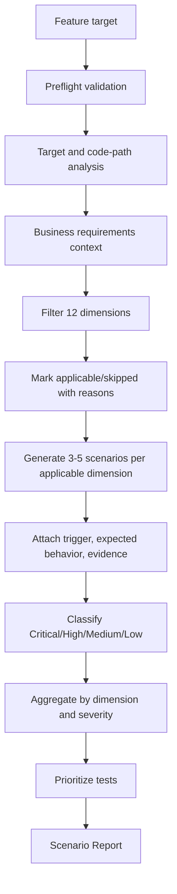
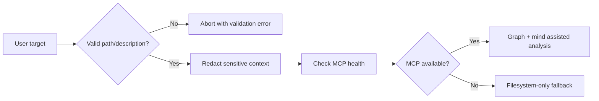
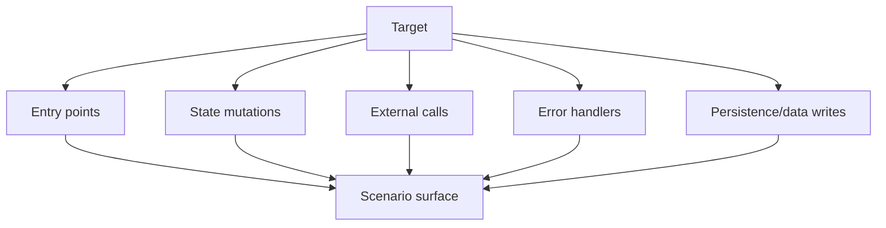
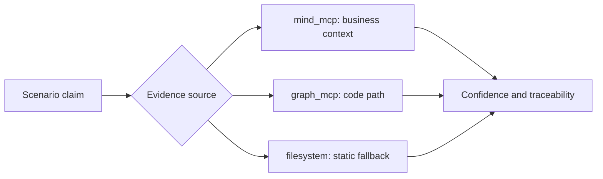
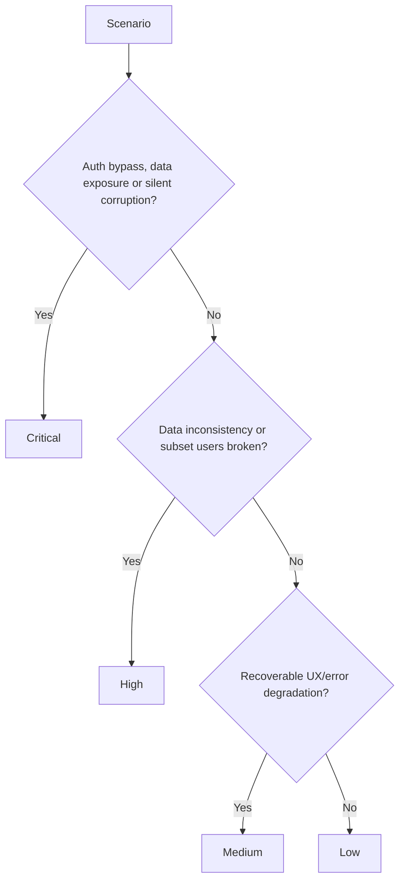
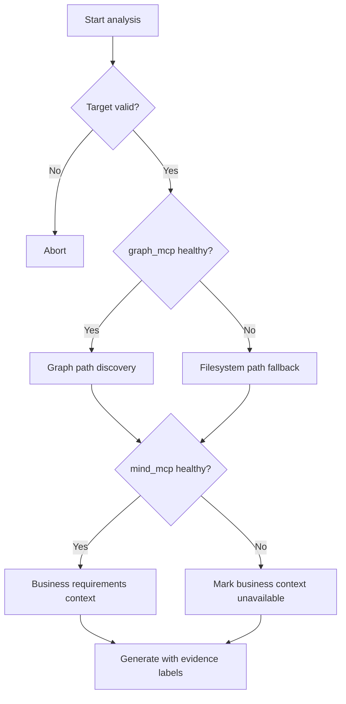
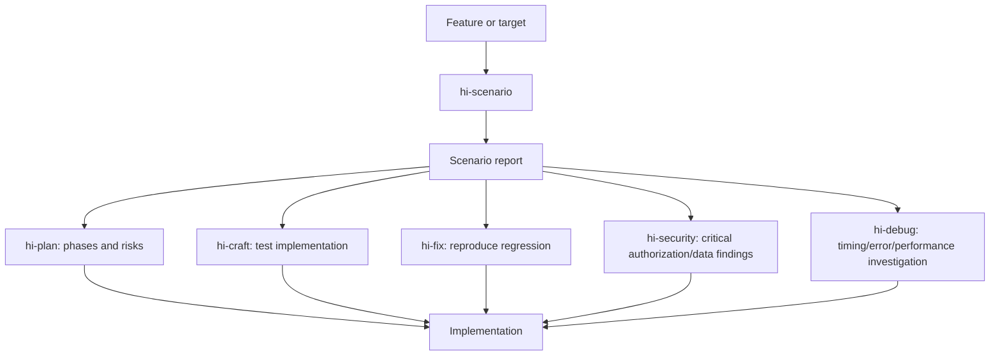
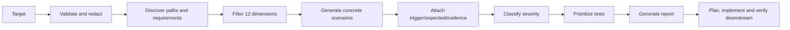

# Hi Scenario Skill: Complete Guide

> `hi-scenario` is the skill that decomposes a feature into reproducible edge cases and test scenarios, based on 12 dimensions: user types, input, timing, scale, state, environment, errors, authorization, data integrity, integration, compliance and business logic.

## 1. What problem does Hi Scenario solve?

A feature can run correctly on the happy path yet still fail when:

- a user with a different role uses it;
- input is empty, too long or malicious;
- two requests run concurrently;
- the database or an external API is slow/unavailable;
- state is in the middle of a workflow;
- data reaches boundary scale;
- a token expires or permissions are wrong;
- a webhook is replayed;
- retention, consent or PII is mishandled;
- a business rule has boundary values.

`hi-scenario` does not try to generate as many cases as possible blindly. It:

1. identifies the target and code path;
2. filters relevant dimensions;
3. creates concrete, reproducible scenarios;
4. classifies severity;
5. attaches evidence sources;
6. produces a report and test priorities.

## 2. Overall mental model



The skill's output is a **risk/test design artifact**, not an implementation and not runtime evidence that the feature passed.

## 3. When to use it?

### 3.1 Should use

- complex or stateful features;
- authoring tests;
- planning risk assessment;
- API design review;
- refactoring critical paths;
- security review;
- onboarding unfamiliar features;
- preparing for review or release;
- needing to find edge cases before coding.

### 3.2 Should not use

- cosmetic/trivial changes;
- stable code that is well tested and whose behavior is unchanged;
- pure config changes with no logic;
- simple CRUD with no business rules;
- docs-only changes.

If a feature is small but involves authorization, data loss or business-critical behavior, still use scenarios at an appropriate depth.

## 4. Input contract

The skill receives:

- `target`: path, glob or description;
- `depth`: `quick` or `deep`;
- optional focus dimensions;
- optional severity filter.

### 4.1 Target

The target needs to define the feature/code surface to analyze, e.g.:

```text
src/payments/refund.ts
src/auth/**
API endpoint POST /orders/{id}/refund
Feature: subscription upgrade and proration
```

### 4.2 Depth

| Depth | Scope |
|---|---|
| `quick` | Major paths, quick triage |
| `deep` | All relevant branches and the 12 dimensions |

`quick` must not be understood as skipping security/error dimensions when they clearly apply. It only reduces the depth and the number of paths expanded.

### 4.3 Focus dimensions

You can request focus on a group:

```text
Focus: authorization, data integrity, integration
```

Focused analysis must still report skipped dimensions and the reasons, so the reader knows the report has limits.

### 4.4 Severity filter

You can filter output by severity, e.g. only output Critical/High. However, filtering output should not lose the record of whether Medium/Low have been considered.

## 5. Preflight validation and security

### 5.1 Input validation hook

The skill has a pre-hook `input-validation` on `target` and `analysis_depth`, with redaction enabled.

The target must:

- exist;
- be readable;
- not contain `../`;
- only use the whitelist `[a-zA-Z0-9_\-./]`;
- be at most 1000 characters.

If the target is invalid or unreadable, preflight aborts instead of guessing.

### 5.2 MCP health-check hook

The skill checks the capabilities of:

- `graph_mcp` for code paths/relationships;
- `mind_mcp` for requirements/business context.

If an MCP is unavailable, fall back to filesystem/manual analysis and record lower confidence for scenarios that depend on graph/business context.

### 5.3 Redaction

Before sending queries or context to tools:

- redact secrets, tokens and API keys;
- do not include unnecessary PII;
- limit sources to the target;
- do not send raw production payloads unless needed.



## 6. The 12 dimensions

| # | Dimension | Main question |
|---:|---|---|
| 1 | User Types | Who uses it and how do permissions/behaviors differ? |
| 2 | Input Extremes | What about empty, large, unicode, malformed or injection input? |
| 3 | Timing | What about concurrency, timeout, retry, ordering and races? |
| 4 | Scale | What about 0, 1, 10k or 1M items, pagination and memory? |
| 5 | State Transitions | What about first use, abort, resume, partial and invalid transitions? |
| 6 | Environment | What about mobile, no JS, screen readers, VPN, locale, slow network? |
| 7 | Error Cascades | How do DB/API/disk/OOM/queue failures propagate? |
| 8 | Authorization | Expired token, wrong role, CSRF, horizontal/vertical escalation? |
| 9 | Data Integrity | What about duplicates, orphans, encoding, migration and transactions? |
| 10 | Integration | Replay, version mismatch, outage, rate limit and contract drift? |
| 11 | Compliance | GDPR, audit, retention, consent, PII and export? |
| 12 | Business Logic | Pricing, coupon, refund, subscription, quota, points? |

Not every feature needs all 12. The rule is **filter first, generate after**.

## 7. Four-phase workflow

### 7.1 Phase 0: Target Analysis

The goal is to understand the code path and context before thinking about edge cases.

Steps:

1. validate the target;
2. read source files;
3. query `graph_mcp`:
   - `semantic_search` with `top_k: 50`;
   - `explore_graph` depth 5;
   - `trace_flow` depth 5;
   - `find_paths` to error handlers, max 10;
4. query `mind_mcp` `hybrid_search` limit 10;
5. identify entry points;
6. identify state mutations;
7. identify external calls;
8. report phase complete.

Output status:

```text
Phase 0 complete: Target analyzed
```

Artifacts to identify:



Graph-derived scenarios must reference actual code paths. Do not use generic graph results to create scenarios with no executable path.

### 7.2 Phase 1: Dimension Filtering

Evaluate each dimension:

- `Applicable`: the feature actually has behavior in the dimension;
- `Skipped`: does not apply, a reason must be recorded;
- `Priority`: high/low risk to decide the order.

Example applicability:

```yaml
dimension_applicability:
  user_types: "Applicable if feature has role-based behavior"
  input_extremes: "Applicable if feature accepts user input"
  timing: "Applicable if concurrent access or async operations"
  scale: "Applicable if feature processes collections"
  state_transitions: "Applicable if feature has multi-step flows"
  environment: "Applicable if feature runs in browser or client"
  error_cascades: "Always applicable for server-side code"
  authorization: "Applicable if feature has access control"
  data_integrity: "Applicable if feature writes to database"
  integration: "Applicable if feature calls external services"
  compliance: "Applicable if feature handles user data"
  business_logic: "Applicable if feature has pricing/rules"
```

Special rule:

> Never skip `error_cascades` for server-side code.

Report status:

```text
Phase 1 complete: 8/12 dimensions applicable
```

### 7.3 Phase 2: Scenario Generation

For each applicable dimension, generate 3-5 scenarios:

- concrete;
- reproducible;
- implementation-agnostic;
- with a trigger;
- with expected behavior;
- with evidence.

Prioritize high-risk dimensions first, skip non-applicable dimensions.

Scenario template:

```yaml
scenario:
  dimension: "Which of the 12 dimensions"
  scenario: "Concrete edge case"
  trigger: "How to reproduce"
  expected: "What should happen"
  evidence: "mind_mcp | graph_mcp | filesystem"
```

Report status:

```text
Phase 2 complete: 32 scenarios generated
```

"Implementation-agnostic" means the scenario describes behavior/trigger/expected without locking into a specific way of coding it until needed.

### 7.4 Phase 3: Severity Classification

Classify each scenario:

| Severity | Meaning |
|---|---|
| Critical | Data loss, security breach, auth bypass, silent corruption |
| High | Feature broken for a subset of users, data inconsistency |
| Medium | Degraded UX, recoverable error not clearly surfaced |
| Low | Minor visual glitch, non-blocking warning |

Non-negotiable rules:

- auth bypass is always Critical;
- data exposure is always Critical;
- silent corruption is always Critical;
- UI-only issues are Low, unless they affect accessibility/security/business;
- Critical scenarios must describe specific expected behavior.

Report status:

```text
Phase 3 complete: Scenarios classified
```

### 7.5 Phase 4: Report Generation

Steps:

1. aggregate by dimension and severity;
2. create an applicability summary;
3. create a skipped table with reasons;
4. create a scenario table;
5. create a severity summary;
6. create test priorities;
7. list evidence sources;
8. report phase complete.

Report status:

```text
Phase 4 complete: Report generated
```

## 8. Detail per dimension

### 8.1 User Types

Ask:

- what if an unauthenticated user accesses it;
- do admin, regular user and moderator behave differently;
- banned/suspended sessions;
- brand-new users with no history/data;
- power users with extreme usage;
- bot/scraper user agents.

Scenario examples:

| Scenario | Trigger | Expected |
|---|---|---|
| Guest calls a protected action | Request without a session | Clear 401/redirect, no data leak |
| Banned user calls the API | Valid session but suspended account | Deny and audit event |
| New user opens dashboard | User has no dependent records | Empty state, no null crash |
| Bot sends a burst | Non-human UA sends many requests | Rate limit and no resource exhaustion |

### 8.2 Input Extremes

Checklist:

- empty/null/undefined;
- max length, e.g. 1MB text in a name;
- unicode, emoji, RTL, zero-width;
- `<script>`, `' OR 1=1 --`, `../../../etc/passwd`;
- negative/overflow numbers;
- international email;
- malformed JSON/XML.

Expected behavior must clearly state reject, normalize, escape, truncate or bounded accept. Do not write "handle gracefully" without defining the response/state.

### 8.3 Timing

Checklist:

- two users submit at the same time;
- DB query takes 5 seconds;
- external call timeout;
- double-click;
- scheduled job overlaps manual action;
- network reorders requests.

You need to identify idempotency, locking, timeout, retry, ordering and user-visible status.

### 8.4 Scale

Checklist:

- 0 items;
- 1 item;
- 10,000+ items;
- last page at the right boundary;
- cursor wrap-around;
- list modified while paginating.

Expected behavior needs to address memory, latency, pagination consistency and UI empty/single states.

### 8.5 State Transitions

Checklist:

- first-time use;
- abort mid-flow;
- resume after a crash;
- partial completion;
- skip/backwards invalid transition;
- deadlock/unreachable state.

If the feature is a state machine, the scenario must state the before state, trigger and after state.

### 8.6 Environment

Checklist:

- mobile with low CPU/memory;
- JavaScript disabled;
- screen reader;
- proxy/VPN;
- timezone UTC+14 to UTC-12;
- locale/date/number/RTL;
- slow 3G.

Environment scenarios should state the minimum requirements, fallback and degradation behavior.

### 8.7 Error Cascades

Checklist:

- DB connection failure;
- external API 500;
- disk full;
- OOM;
- network partition/split-brain;
- partial write/rollback;
- message queue full/backpressure.

For server-side code, this dimension is always applicable. Expected behavior must describe the error boundary, rollback, retry, alert and user response.

### 8.8 Authorization

Checklist:

- expired JWT;
- wrong role hitting an admin endpoint;
- leaked/shared tokens;
- CORS misconfiguration;
- missing CSRF;
- horizontal privilege escalation;
- vertical privilege escalation.

Auth bypass/data exposure is always Critical. Scenarios must state the actor, resource, permission and expected denial.

### 8.9 Data Integrity

Checklist:

- duplicate entries;
- orphan references;
- UTF-8/Latin-1 mismatch;
- concurrent migration/write;
- soft delete inconsistency;
- circular foreign keys.

Check unique constraints, transactions, rollback, idempotency, consistency and repair paths.

### 8.10 Integration

Checklist:

- webhook replay;
- API version mismatch;
- third-party outage;
- contract drift;
- external rate limit;
- SSL certificate expiry.

Expected behavior should address retry/backoff, idempotency keys, dead-letter, fallback and observability.

### 8.11 Compliance

Checklist:

- GDPR deletion;
- audit logging gaps;
- retention purge;
- PII in logs/errors;
- consent opt-out but still collecting;
- complete data export.

Compliance scenarios must indicate the data category, actor, retention, audit evidence and expected deletion/export behavior.

### 8.12 Business Logic

Checklist:

- price $0, negative, rounding;
- coupon stacking;
- refund after partial delivery;
- quota at the limit and over the limit;
- trial/payment/upgrade/downgrade;
- loyalty points earn/redeem/expire at the same time.

Expected behavior must follow the business rule, not just the status code.

## 9. Scenario quality

### 9.1 A good scenario

A good scenario answers all of:

```text
Who/what: actor and feature
Precondition: prior state/data/config
Trigger: specific action or event
Expected: behavior, response, state, side effect
Severity: impact if it fails
Evidence: source checked
```

Example:

```markdown
- Dimension: Timing
- Scenario: Two refund requests for the same order are sent within the same transaction window
- Trigger: Send two concurrent POST requests with the same idempotency key
- Expected: Only one refund is created; the other request returns an idempotent result; no double charge
- Severity: Critical
- Evidence: refund service entry point + payment provider integration
```

### 9.2 A bad scenario

```text
- Check concurrency.
- Handle errors.
- Test edge cases.
```

The sentences above are not reproducible, have no expected behavior, severity or evidence.

### 9.3 Implementation-agnostic but code-grounded

Scenarios should not depend only on classes/private functions. However, graph-derived scenarios must have actual code paths as evidence. Balance as follows:

- describe behavior at the feature level;
- reference entry points/state mutations/external calls;
- do not dictate new implementation;
- keep traceability so developers can find where to verify.

## 10. Evidence sources and confidence

### 10.1 mind_mcp

Use for:

- business requirements;
- domain concepts;
- product rules;
- compliance context;
- expected behavior not clearly present in source.

### 10.2 graph_mcp

Use for:

- entry points;
- call paths;
- state mutations;
- external calls;
- error handlers;
- dependencies and actual execution paths.

### 10.3 filesystem

Use as fallback when MCP is unavailable:

- source files;
- tests;
- config;
- local docs;
- static analysis.

Filesystem-only scenarios should be marked with lower confidence if business context or dynamic paths could not be verified.



## 11. Severity and test priority

### 11.1 Severity decision tree



### 11.2 Priority mapping

| Priority | Severity | Action |
|---|---|---|
| Immediate | Critical | Test/fix before implementation or release |
| Sprint | High | Include in the current implementation/test scope |
| Backlog | Medium + Low | Schedule by impact and capacity |

Critical does not mean the scenario is certain to happen; it reflects the impact if it does.

## 12. Output contract

The standard report has the title:

```text
# Scenario Report — {target}
```

The header must include:

- date;
- depth;
- source.

Required sections:

1. `Dimensions Analyzed` list;
2. `Skipped` table with reasons;
3. `Scenarios` table with columns:
   - #;
   - Dimension;
   - Scenario;
   - Severity;
   - Expected;
4. `Severity Summary`:
   - Critical;
   - High;
   - Medium;
   - Low;
   - Total;
5. `Test Priorities`:
   - Immediate = Critical;
   - Sprint = High;
   - Backlog = Medium + Low;
6. `Evidence Sources`:
   - mind_mcp;
   - graph_mcp;
   - filesystem.

Default deliverable:

```text
scenario_report_{target}_{timestamp}.md
```

## 13. Progress and observability

The skill must report progress:

- phase start/complete;
- dimension progress;
- final summary;
- counts by severity.

Metrics to track:

- total scenarios;
- dimensions analyzed/skipped;
- average scenarios per dimension;
- severity distribution;
- evidence coverage MCP-sourced vs filesystem-sourced.

Example final summary:

```text
Phase 0 complete: Target analyzed
Phase 1 complete: 8/12 dimensions applicable
Phase 2 complete: 32 scenarios generated
Phase 3 complete: 4 Critical, 10 High, 12 Medium, 6 Low
Phase 4 complete: Report generated
Evidence coverage: graph 60%, mind 20%, filesystem 20%
```

Progress is not just for the user to see activity; it helps detect dimension timeouts or partial reports.

## 14. Timeout and operational behavior

Timeout configuration:

| Priority/process | Timeout |
|---|---:|
| p0 | 120s |
| p1 | 30s |
| p2 | 300s |
| p3 | 60s |
| p4 | 60s |
| Total | 600s |

If a dimension times out:

- skip that dimension;
- record the reason;
- continue with the other dimensions;
- mark the report partial if needed;
- do not create findings as if the dimension had been analyzed.

A p0 MCP timeout falls back to filesystem analysis. Partial data can still produce a report, but confidence/gaps must be stated.

## 15. MCP fallback strategy

### 15.1 Preflight failure

If the target is invalid/readability fails: abort.

### 15.2 MCP unavailable

If graph/mind are unavailable:

1. skip the MCP immediately, do not retry indefinitely;
2. read source/filesystem manually;
3. derive call paths from static analysis;
4. skip business context if there is no replacement source;
5. mark graph-derived scenarios with lower confidence;
6. record the MCP gap in the report.



## 16. Hooks and cleanup

### 16.1 Pre-hooks

| Hook | Scope | Purpose |
|---|---|---|
| `input-validation` | target, analysis_depth | Reject invalid/unsafe input |
| `mcp-health-check` | MCP capabilities | Choose full or fallback mode |

### 16.2 Post-hook

`cleanup-handler` applies to `scenario-data/` and keeps:

```text
*.json
*.md
```

The goal is to clean up temporary artifacts while preserving the structured data/report needed for later use. Do not delete valid reports or JSON evidence.

## 17. How to verify hi-scenario?

### 17.1 Target verify

- [ ] Target exists and is readable.
- [ ] Does not contain `../`.
- [ ] Only whitelist characters are used.
- [ ] Does not exceed 1000 characters.
- [ ] Sensitive context has been redacted.

### 17.2 Analysis verify

- [ ] Entry points have been identified.
- [ ] State mutations have been identified.
- [ ] External calls have been identified.
- [ ] Error handlers have been traced.
- [ ] Graph/mind capabilities have been checked.
- [ ] Fallback is recorded if MCP is unavailable.

### 17.3 Dimension verify

- [ ] All 12 dimensions have been evaluated.
- [ ] Applicable dimensions have reasons.
- [ ] Skipped dimensions have reasons.
- [ ] Error cascades are not skipped for server-side code.
- [ ] Focus/severity filters do not hide applicability context.

### 17.4 Scenario verify

- [ ] Each scenario is concrete.
- [ ] Trigger is reproducible.
- [ ] Expected behavior is specific.
- [ ] Severity is reasonable.
- [ ] Evidence source is recorded.
- [ ] Graph-derived scenarios reference real code paths.
- [ ] No noise generated for non-applicable dimensions.

### 17.5 Report verify

- [ ] Header has date/depth/source.
- [ ] Dimensions analyzed has a list.
- [ ] Skipped table has reasons.
- [ ] Scenario table has all columns.
- [ ] Severity totals match the scenario count.
- [ ] Test priorities map correctly.
- [ ] Evidence coverage is reported.
- [ ] Partial/timeout/tool degradation is recorded.
- [ ] Deliverable is at the correct path.

## 18. Example: refund API

Target:

```text
POST /orders/{id}/refund
```

### 18.1 Phase 0

Find:

- refund controller/entry point;
- authorization middleware;
- order/payment state mutations;
- transaction boundary;
- payment provider call;
- webhook/retry handler;
- refund tests;
- audit/compliance docs.

### 18.2 Dimension filtering

Applicable:

- User Types: admin, support, customer;
- Input Extremes: amount, currency, reason;
- Timing: double submit/concurrent refund;
- State: delivered/partial/cancelled;
- Error Cascades: DB/provider failure;
- Authorization: ownership/role;
- Data Integrity: duplicate/refund total;
- Integration: provider retry/webhook;
- Compliance: audit/PII;
- Business Logic: partial refund/rounding.

Environment can be skipped if the endpoint is server-only and the UI is not part of the target, but the reason must still be recorded.

### 18.3 Scenario examples

```markdown
| # | Dimension | Scenario | Severity | Expected |
|---|---|---|---|---|
| 1 | Timing | Two refunds for the same order at the same time | Critical | Only one valid refund; no double charge |
| 2 | Authorization | Customer refunds another user's order | Critical | 403, no order/payment data leaked |
| 3 | Integration | Provider timeout after the charge was created | Critical | Idempotent retry/reconciliation, no duplicate created |
| 4 | Business Logic | Refund amount exceeds the paid amount | High | Clear reject, no mutation |
| 5 | Data Integrity | Webhook refund replay | High | Idempotent, one internal refund record |
| 6 | Compliance | Error returns a payment token | Critical | Mask sensitive data, audit event contains no secrets |
```

### 18.4 Test priority

- Immediate: duplicate refund, cross-user access, provider timeout/ambiguous result, token exposure;
- Sprint: rounding, partial delivery, webhook replay, audit completeness;
- Backlog: non-critical UI copy or recoverable display issues.

## 19. Example: subscription upgrade

Priority dimensions:

- Business Logic: proration, coupon, trial, currency;
- Timing: double click, concurrent upgrade/downgrade;
- Integration: payment provider timeout, webhook reorder;
- Data Integrity: duplicate invoice, subscription state;
- Compliance: consent, invoice retention, PII;
- User Types: admin/support/customer;
- Scale: batch migration or many subscriptions.

Scenarios must describe the state transition:

```text
Precondition: subscription is in trial, payment method is valid.
Trigger: upgrade runs exactly while the trial expiry job is running.
Expected: one state transition is committed per the ordering policy;
no double charge; invoice/audit reflect the result.
```

## 20. Example: UI search list

Applicable dimensions:

- Input Extremes: empty, unicode, injection, max length;
- Scale: zero/one/10k results, pagination boundary;
- Timing: debounce, out-of-order responses, slow 3G;
- State: clear query, back/forward, refresh;
- Environment: mobile, screen reader, no JS;
- Authorization: result visibility per user.

Environment must not be auto-skipped just because "it is a UI". It is often the most important dimension for UI behavior.

## 21. Relationship with other skills



| Skill | What Hi Scenario provides |
|---|---|
| `hi-plan` | Risk list, edge cases, success criteria and test priorities |
| `hi-craft` | Scenarios for writing tests and verifying implementation |
| `hi-fix` | Reproduction cases and regression test candidates |
| `hi-debug` | Hypothesis/test inputs for timing, error cascades, performance |
| `hi-security` | Auth, data exposure, injection and compliance scenarios |
| `hi-codebase-research-explorer` | Code path/source context so scenarios have traceability |
| `hi-sequential-thinking` | Decompose the complex scenario space and compare branches |

## 22. Limitations to understand correctly

### 22.1 Static analysis only

The skill does not runtime-simulate all scenarios. Quality depends on:

- graph paths;
- mind requirements;
- source/test context;
- completeness of the target.

Scenarios must be runtime-verified by tests, staging or a browser when needed.

### 22.2 Not all 12 dimensions apply

Forcing every feature through all 12 creates noise. But skipping must have a clear reason.

### 22.3 Rare edges can be missed

Deep mode increases coverage but does not prove exhaustiveness. Concurrency and environment usually need runtime/load/browser verification.

### 22.4 MCP dependency

Deep analysis needs graph_mcp; business context needs mind_mcp. Filesystem-only mode can produce a useful report, but with more limited confidence and scope.

### 22.5 Severity is not the only implementation priority

Critical needs immediate attention, but effort, likelihood, exposure and deployment context must still be weighed by the team. The report should keep severity and priority as two separate concepts.

## 23. Quick summary



The shortest way to remember it:

> `hi-scenario` does not ask "does the happy path run?", but systematically maps who could use it, what input could break it, what state could drift, which dependencies could fail and which behaviors must be proven.
