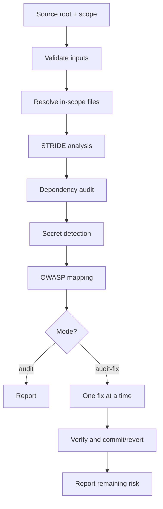
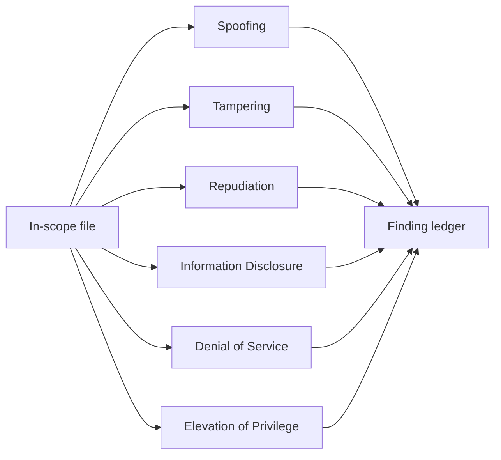
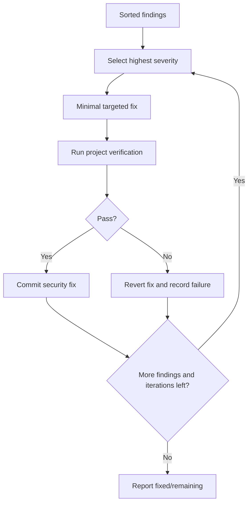
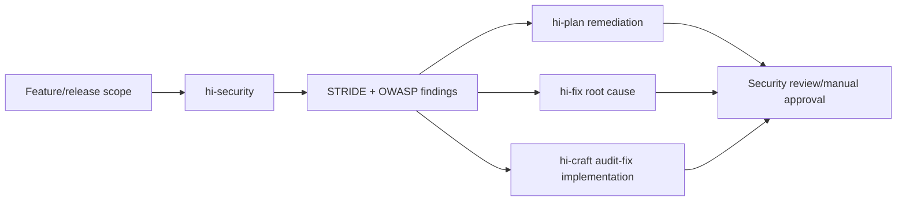

# Hi Security Skill: Complete Guide

> `hi-security` is a security audit based on STRIDE + OWASP, with MCP-assisted code discovery, dependency audit, secret detection, and optional iterative auto-fix. It is used for pre-release audits, after sensitive features, or during compliance reviews.

## 1. When to use?

Use it for:

- before release;
- after auth/payment/data features;
- periodic security reviews;
- SOC 2, GDPR, PCI-DSS preparation;
- after dependency updates;
- when a CVE appears;
- audit scopes containing user-facing code/data.

Do not use it for:

- cosmetic-only changes;
- repositories without user-facing code;
- simple standalone dependency audits — use `npm audit`/`pip-audit` directly;
- quick unstructured reviews.

## 2. Input and modes

Required:

- source root path;
- audit scope: glob or directory;
- mode: `audit` or `audit-fix`.

Optional:

- `max_iterations`: default 10, range 1-50;
- `focus_area`: `auth`, `data`, `api`, `infra`, `all`.

| Mode | Flow | Result |
|---|---|---|
| `audit` | scan → categorize → report | Findings and recommendations, no fixes |
| `audit-fix` | scan → categorize → fix Critical→High→Medium → verify → report | Applied fixes + remaining findings |



## 3. Input validation and safety

Path:

- block `../`;
- whitelist `[a-zA-Z0-9_\-./*]`;
- max 1000 chars;
- source must exist/be readable.

Scope:

- mode must be in `{audit,audit-fix}`;
- focus must be in `{all,auth,data,api,infra}`;
- max iterations 1-50.

Hooks:

- pre `mcp-health-check`, timeout 10s;
- pre `input-validation` with redaction;
- post `output-redaction` for report/findings;
- post cleanup keeps `*.json`, `*.md` under `security-audit-data/`.

Do not log/store detected secrets in plaintext.

## 4. Performance and limits

- max 5000 files;
- max 10MB/file;
- max 100 findings/category;
- total around 30 minutes per env config;
- cache invalidated when scope/workflow starts.

Progress must be reported:

```text
Phase {N} started: {phase_name}
Scanning: {file_path} ({current}/{total})
Analyzing STRIDE: {category}
Fixing: #{finding_number} of {total} ({severity})
Phase {N} complete: Critical={c}, High={h}, Medium={m}
Audit complete: files, findings, fixes
```

## 5. Severity

| Level | Meaning | Priority |
|---|---|---|
| Critical | Exploitable now: breach, RCE, auth bypass | Block release/immediate |
| High | Significant impact, moderate exploit effort | This sprint |
| Medium | Limited exploitability/impact | Next sprint |
| Low | Theoretical/defense-in-depth | Backlog |
| Info | Best practice, no direct risk | Optional |

## 6. Workflow phases

### Phase 0: Scope Resolution

1. validate source/scope/mode/focus;
2. expand glob into a file list;
3. classify file types;
4. exclude test fixtures, examples, and docs when the policy allows;
5. query the `mind_mcp` security policy if available;
6. report the number of in-scope files.

Do not audit out-of-scope files and then claim full coverage.

### Phase 1: STRIDE Analysis

For each in-scope file:

- analyze the 6 STRIDE categories;
- use `graph_mcp` to find entry points/auth/data paths;
- use `mind_mcp` for policy/compliance context;
- record file:line, category, description, severity, recommendation;
- report the finding count.



### Phase 2: Dependency Audit

1. detect the stack from the manifest;
2. run the correct audit tool;
3. parse CVEs;
4. record `cve`, package, severity, fix_version, recommendation;
5. report dependency findings.

| Stack | Command |
|---|---|
| Node.js | `npm audit --json` |
| Python | `pip-audit --format json` |
| Go | `govulncheck ./...` |
| Ruby | `bundle audit check --update` |
| Java/Maven | `mvn dependency-check` |
| Rust | `cargo audit` |

The audit tool must match the detected stack. Do not run `npm audit` for a Python project and then consider the dependency audit complete.

### Phase 3: Secret Detection

Scan pattern:

- generic API keys;
- AWS `AKIA*` and secret keys;
- JWT;
- hardcoded passwords;
- PEM private keys;
- GitHub `ghp_*`;
- Stripe `sk_live_`/`sk_test_`;
- Bearer tokens;
- DB connection strings with credentials.

False-positive exclusions:

- `*.test.*`, `*.spec.*`, `*.example`;
- test/tests/__tests__/fixtures;
- placeholders `YOUR_KEY_HERE`, `<your-token>`, `TODO`;
- clear markdown placeholders.

Every match must be context-verified to reduce false positives. A real secret match is Critical; the report must not print the secret in plaintext.

### Phase 4: OWASP Mapping

Map findings:

| OWASP | Category |
|---|---|
| A01 | Broken Access Control |
| A02 | Cryptographic Failures |
| A03 | Injection |
| A04 | Insecure Design |
| A05 | Security Misconfiguration |
| A06 | Vulnerable/Outdated Components |
| A07 | Identification/Auth Failures |
| A08 | Software/Data Integrity Failures |
| A09 | Logging/Monitoring Failures |
| A10 | SSRF |

Dependency findings map to A06; secret exposure usually maps to A02/A05.

### Phase 5: Fix Execution

`audit-fix` only:

1. sort Critical → High → Medium;
2. fix one finding per iteration;
3. run verification;
4. commit if it passes;
5. revert if it fails;
6. skip Low/Info, only document them;
7. stop at max_iterations.

Rules:

- do not fix more than one issue per iteration;
- tests must pass before moving to the next issue;
- auth changes require manual review;
- do not modify test/config secrets.



### Phase 6: Report Generation

Aggregate:

- counts by severity;
- file:line findings;
- STRIDE/OWASP categories;
- dependency status;
- secret exposure status;
- fixes applied/failed/reverted;
- prioritized next steps;
- residual risk.

## 7. STRIDE checklist

### Spoofing

- endpoint auth;
- bcrypt/argon2, not MD5/SHA1;
- JWT expiry/server validation;
- Secure/HttpOnly/SameSite cookies;
- MFA for sensitive operations;
- OAuth/OIDC `state`;
- default credentials.

### Tampering

- input validation;
- parameterized queries;
- CSRF;
- request signing;
- file upload magic bytes/size/content;
- unsafe deserialization;
- method restriction.

### Repudiation

- auth events;
- authorization failures;
- actor/timestamp data modifications;
- no password/token/PII logs;
- append-only/integrity;
- retention policy.

### Information Disclosure

- no stack traces in production;
- no unnecessary internal IDs/paths/versions;
- encryption at rest;
- TLS 1.2+;
- no hardcoded secrets;
- `.env` ignored;
- minimum response fields.

### Denial of Service

- rate limits;
- body size;
- pagination;
- external/DB timeouts;
- clean connection pools;
- ReDoS review;
- job concurrency/dead-letter.

### Elevation of Privilege

- server-side RBAC;
- horizontal checks/IDOR;
- stricter admin middleware;
- re-auth for escalation;
- least-privilege service accounts;
- minimal third-party permissions.

## 8. Output contract

Deliverables:

```text
audit_report_{timestamp}.md
audit_summary_{timestamp}.md
findings_{timestamp}.json
fix_log_{timestamp}.md  # audit-fix only
```

Each finding must have:

- file:line;
- STRIDE;
- OWASP;
- severity;
- description;
- evidence/context;
- recommendation;
- fix status if audit-fix;
- confidence/limitations if relevant.

Do not use vague claims like "auth may be weak" without a locator.

## 9. Fallback and partial report

- invalid source/scope: abort;
- MCP unavailable: filesystem-only pattern audit, lower confidence;
- empty scope: abort;
- MCP timeout: filesystem patterns;
- missing tool: skip + warning;
- large file: skip and record the gap;
- verification fails: revert the fix;
- partial data: generate a partial report, do not claim exhaustive.

Secret detection still runs normally when MCP is unavailable.

## 10. Metrics

Track:

- files scanned;
- lines analyzed;
- duration;
- findings by severity;
- fixes attempted/applied/failed/reverted;
- verification failures;
- MCP calls/cache hit rate.

Do not report 0 findings if a phase was skipped or the scope was incomplete.

## 11. Verifying hi-security

- [ ] Source/scope/mode/focus validated.
- [ ] File count/size limits enforced.
- [ ] STRIDE covers all 6 categories.
- [ ] Graph entry/auth/data paths were used when available.
- [ ] Dependency audit matches the stack.
- [ ] Secret matches verified and redacted.
- [ ] OWASP mapping complete.
- [ ] Every finding has a file:line.
- [ ] Audit-fix fixes one issue at a time.
- [ ] Verify after every fix.
- [ ] Revert on failure.
- [ ] Auth fixes flagged for manual review.
- [ ] Output redacted.
- [ ] Remaining risks and gaps recorded.

## 12. Example auth audit

Target: `src/auth/**`, focus `auth`, mode `audit`.

Expected findings:

- endpoint missing server-side auth: Critical/A01/A07;
- JWT without `exp`: High/A07;
- password MD5: Critical/A02/A07;
- auth failure not logging actor/resource: Medium/A09;
- missing login rate limit: High/A04/A07;
- token in plaintext in logs: Critical/A02/A09.

Each finding needs an exact file/line and a specific mitigation.

## 13. Relationship with other skills



## 14. Limitations

- Static audit does not replace runtime penetration/load testing.
- Distributed auth spanning multiple repos can be missed.
- Dependency tools must be installed, and lockfiles affect coverage.
- Vendor-patched dependencies can cause false positives.
- Pattern-based secret detection misses custom formats and produces false positives.
- Auto-fix is conservative; auth changes always require manual review.

## 15. Summary

> `hi-security` does not just scan for the keyword "password"; it combines scope, STRIDE, OWASP, dependencies, secrets, severity, and one-fix-at-a-time verification to turn security risks into findings with clear locators, mitigations, and status.
