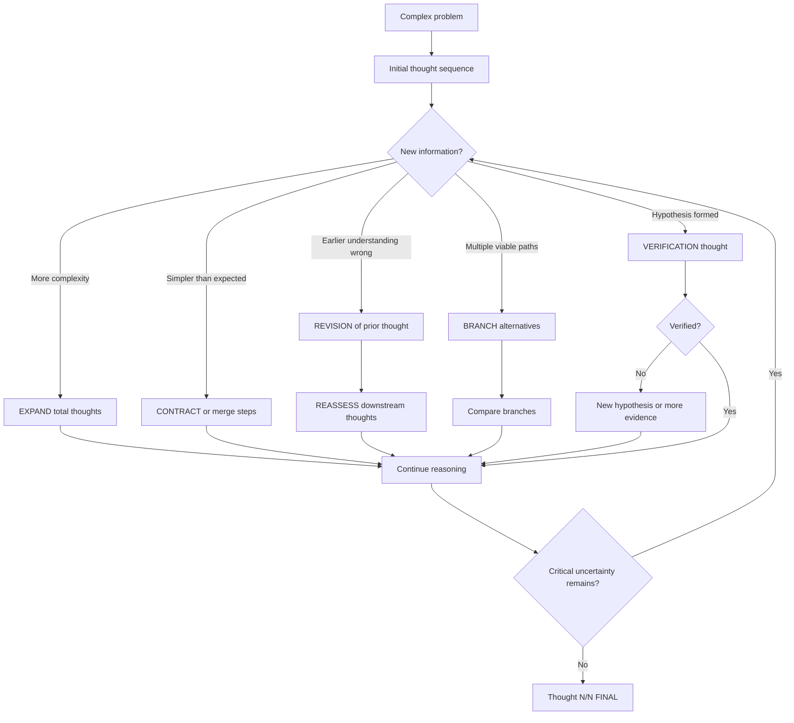
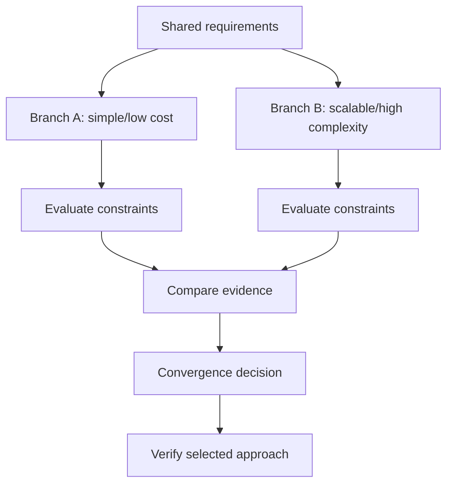
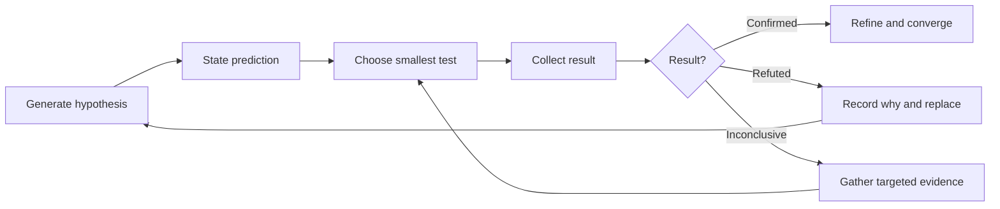
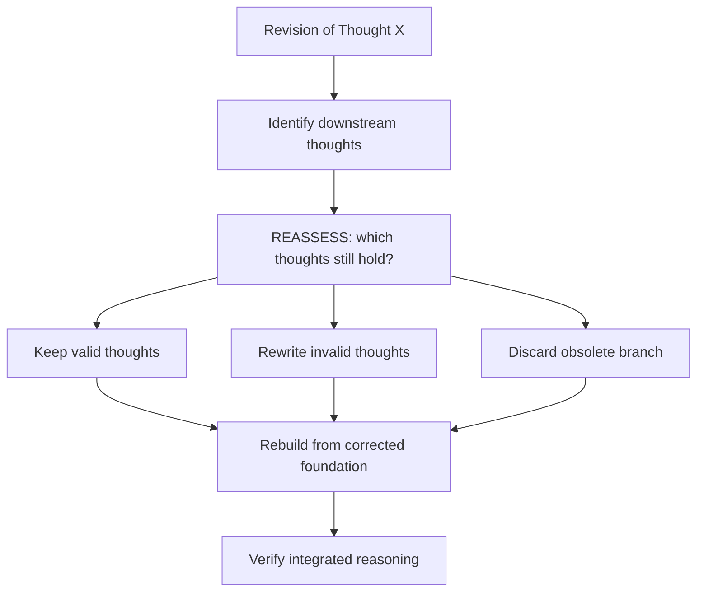
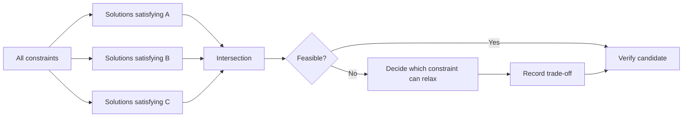
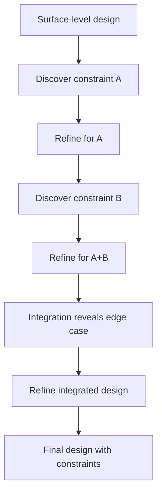
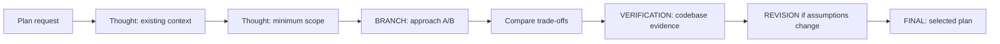
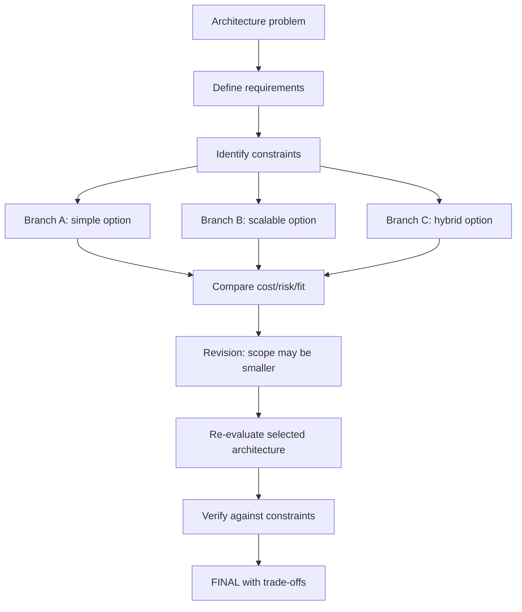
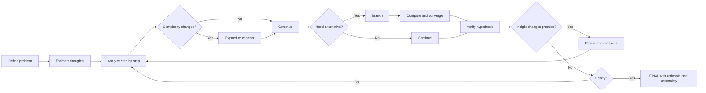

# Hi Sequential Thinking Skill: Complete Guide

> `hi-sequential-thinking` is a skill that organizes reasoning into a numbered, expandable/contractible chain of thoughts, with revision, branching, hypothesis verification and convergence. It suits complex problems, unclear scope, or cases needing course correction.

## 1. What Problem Does This Skill Solve?

Simple linear reasoning often runs into problems:

- locking in a solution too early;
- an initial assumption is wrong but later steps are still built on it;
- several approaches are considered but not clearly compared;
- not knowing whether a hypothesis has been verified;
- complexity increases but the number of steps is not adjusted;
- revision loses context or creates a cascade that is hard to control;
- ending while important uncertainty remains.

`hi-sequential-thinking` turns that process into a chain with state:

```text
Thought 1/N -> Thought 2/N -> ... -> Thought N/N [FINAL]
```

The chain does not have to be straight. It can:

- **Expand**: increase the number of thoughts when complexity is discovered;
- **Contract**: reduce/merge steps when the problem is simpler;
- **Revise**: fix an earlier thought when new insight appears;
- **Branch**: split off approach/scenario/hypothesis;
- **Verify**: check a hypothesis before converging;
- **Reassess**: re-evaluate downstream thoughts after a major revision.

## 2. Mental Model



Each thought should do one clear thing:

- analyze a requirement;
- identify a constraint;
- check evidence;
- compare approaches;
- update the model;
- record uncertainty;
- decide the next step.

A thought should not just restate the previous conclusion in different wording.

## 3. When to Use?

### Should use

- complex problem decomposition;
- adaptive planning;
- architecture/design decisions;
- debugging and root-cause analysis;
- hypothesis-driven investigation;
- changing scope;
- multiple constraints to satisfy simultaneously;
- multiple approaches with trade-offs;
- need to keep history or produce deterministic output format.

### No need for explicit mode

- simple questions;
- routine one-step operations;
- requirements that are completely clear and need no alternatives;
- short internal reasoning that does not need visible markers.

The skill has two ways of applying:

| Mode | How to use | When it fits |
|---|---|---|
| Explicit | Display `Thought N/N` and markers | Complex problems that need audit/handoff |
| Implicit | Apply the method internally, without printing each thought | Routine work or when output must be short |

Explicit does not mean exposing every private chain-of-thought. In documentation/agent workflows, only record the decision-relevant checkpoints, assumptions, evidence and conclusions that need to be handed off.

## 4. Thought Marker Syntax

### 4.1 Regular thought

```text
Thought 1/5: Requirements and constraints
```

### 4.2 Revision

```text
Thought 5/8 [REVISION of Thought 2]: Corrected understanding
- Original: What was stated
- Why revised: New insight
- Impact: What changes
```

A revision must state which thought was changed, why, and its impact on the following steps.

### 4.3 Branch

```text
Thought 4/7 [BRANCH A from Thought 2]: Approach A
Thought 4/7 [BRANCH B from Thought 2]: Approach B
```

Each branch needs:

- branch source;
- its own assumption/approach;
- benefits/drawbacks;
- verification or decision criteria;
- convergence rationale.

### 4.4 Hypothesis and verification

```text
Thought 6/9 [HYPOTHESIS]: Proposed explanation
Thought 7/9 [VERIFICATION]: Test result and conclusion
```

Do not call a hypothesis a confirmed solution before the verification thought.

### 4.5 Final

```text
Thought N/N [FINAL]: Integrated solution and confidence
```

Final may only be marked after critical aspects have been handled and remaining uncertainty is at an acceptable level.

## 5. Adjusting the Thought Count

### 5.1 Expand

Increase `totalThoughts` when:

- the problem gains a new component;
- a new constraint is discovered;
- branching is needed to compare alternatives;
- a hypothesis needs more experiments;
- a revision makes older downstream reasoning insufficient.

Example:

```text
Thought 1/5: Initial design
Thought 2/5: Discover security constraint
Thought 3/7: Expand to evaluate security alternatives
Thought 4/7: Compare approach A
Thought 5/7: Compare approach B
Thought 6/7: Verify selected approach
Thought 7/7 [FINAL]: Decision
```

### 5.2 Contract

Condense or merge when:

- an insight resolves several planned steps;
- the problem is simpler than expected;
- a branch is eliminated early by evidence;
- two steps share the same purpose and do not need to be separate.

Contracting must not delete necessary rationale. If shortening, keep a summary of the insight that was skipped.

### 5.3 Revision

Use revision when understanding changes meaningfully, not to fix typos:

- an assumption is refuted;
- a requirement is clarified;
- a new constraint changes the decision;
- the actual pattern differs from the initial model;
- the initial scope was wrong.

A good revision has three parts:

```text
Original -> New evidence -> Impact
```

## 6. Branching and Convergence

### 6.1 Trade-off evaluation

Use when two approaches have different trade-offs:



### 6.2 Risk mitigation branch

One main branch and one fallback:

```text
Thought 3/8 [BRANCH A]: Primary implementation
Thought 3/8 [BRANCH B]: Fallback if dependency unavailable
Thought 6/8: Compare failure cost and switching cost
Thought 7/8: Select primary with fallback trigger
```

### 6.3 Parallel exploration

Use when concerns are independent:

- Branch DB;
- Branch API;
- Branch frontend;
- then an integrated thought to examine interactions.

Parallel branches do not mean both conclusions are correct. There must be a convergence step.

### 6.4 Hypothesis testing branches

Each hypothesis is a branch with its own experiment:

```text
Branch A: Missing index -> inspect query plan
Branch B: N+1 query -> count queries/request
Branch C: External timeout -> inspect duration logs
Verification: eliminate A/C, confirm B
```

### 6.5 Branch limits

The core pattern recommends a limit of 2-3 branches to avoid branching explosion. If there are many alternatives:

1. group by category;
2. eliminate approaches that clearly fail a constraint;
3. keep a shortlist;
4. compare on the same criteria.

## 7. Hypothesis-Driven Reasoning

### 7.1 The loop



A good hypothesis must state:

- what is being explained;
- why it is likely correct;
- what evidence would confirm it;
- what evidence would refute it;
- the cheapest experiment to distinguish it.

### 7.2 Do not pile fixes

If verification fails:

- do not add a second fix on top of the first without understanding the result;
- record the result;
- update the hypothesis;
- return to the appropriate thought;
- only continue after the new model is clear.

### 7.3 Performance example

```text
Thought 1/5: Endpoint needs <200ms but is taking 2-3s.
Thought 2/5: Dashboard has profile, activities, notifications, analytics.
Thought 3/6 [BRANCH A]: Could be N+1 queries; count queries/request.
Thought 3/6 [BRANCH B]: Could be missing composite index; check EXPLAIN.
Thought 4/6 [VERIFICATION]: Joins are correct, A eliminated; index missing created_at.
Thought 5/6: Add composite index and measure again.
Thought 6/6 [FINAL]: Latency meets target, high confidence.
```

## 8. Revision Cascade and Meta-Thinking

### 8.1 Revision cascade

One revision can invalidate many downstream thoughts. In that case you must not just edit a single marker line and continue as before.

Flow:



Suggested markers:

```text
Thought 7/10 [REVISION of Thought 3]: Constraint changed
Thought 8/10 [REASSESSMENT]: Thoughts 4 and 5 remain valid; Thought 6 is invalid
Thought 9/10: Rebuild decision with corrected constraint
Thought 10/10 [FINAL]: Updated solution
```

### 8.2 Meta-thinking

Use `[META]` when:

- repeating many thoughts without progress;
- not knowing what information is missing;
- every branch is inconclusive;
- the scope is drifting;
- reasoning is stuck inside an assumption.

Example:

```text
Thought 5/8 [META]: We are comparing approaches without knowing traffic scale.
Need one missing input: expected peak requests. Pause comparison and obtain it.
```

Meta-thinking is not added narration; it must change the strategy or identify the information to obtain.

## 9. Uncertainty Management

Do not cover uncertainty with an anonymous assumption. Classify it:

- known fact;
- assumption;
- likely but unverified;
- unknown blocking a decision;
- scenario-dependent result.

### 9.1 Scenario branches

```text
Thought 2/7: Need to decide X, but data insufficient.
Thought 3/7 [SCENARIO A if P true]: Analyze A.
Thought 3/7 [SCENARIO B if P false]: Analyze B.
Thought 4/7: Find solution robust to both.
Thought 5/7: Identify minimum information needed.
Thought 6/7: Ask for or collect that information.
Thought 7/7 [FINAL]: Decision and remaining assumption.
```

### 9.2 Safe assumptions

If you must proceed with missing data:

1. record the assumption explicitly;
2. explain why it is temporarily accepted;
3. assess the downside if it is wrong;
4. design the solution so it does not depend too heavily on the assumption;
5. set a validation checkpoint.

## 10. Constraint Satisfaction

When a solution must satisfy multiple constraints, analyze each constraint, then find the intersection:



Marker example:

```text
Thought 3/10 [CONSTRAINT A]: Candidate set {X, Y, Z}
Thought 4/10 [CONSTRAINT B]: Candidate set {Y, Z, W}
Thought 5/10 [CONSTRAINT C]: Candidate set {X, Z}
Thought 6/10 [INTERSECTION]: Z is only shared candidate
Thought 7/10: Verify Z feasibility
```

Do not pick a solution just because it satisfies one prominent constraint while ignoring the rest.

## 11. Progressive Context Deepening and Spiral Refinement

### 11.1 Progressive context deepening

Go from abstract to integrated system:

```text
Thought 1: High-level problem
Thought 2: Major components
Thought 3: Component A details
Thought 4: Component B details
Thought 5: A-B interaction
Thought 6: Emergent constraint
Thought 7 [REVISION]: Adjust earlier model
Thought 8: Verify complete system
Thought 9 [FINAL]: Integrated solution
```

### 11.2 Spiral refinement

Each refinement round makes the design more concrete:



Spiral refinement is controlled progress, not a restart from scratch. Only revise the affected parts and reassess dependencies.

## 12. When Is It Complete?

The `[FINAL]` marker is appropriate only when:

- the solution has been verified to the required level;
- critical aspects have been addressed;
- important alternatives/trade-offs have been compared;
- remaining uncertainty is clearly recorded;
- no blocking hypothesis remains;
- confidence has a reason, not just a feeling.

The final thought should contain:

- decision/solution;
- rationale;
- evidence/verification;
- trade-offs;
- remaining risk;
- next action if any.

Example:

```text
Thought 7/7 [FINAL]: Use composite index (user_id, created_at DESC).
Evidence: EXPLAIN confirmed sequential scan before; post-change latency 120ms.
Trade-off: migration cost and write overhead.
Remaining risk: verify on production-sized data.
Confidence: High for query bottleneck, medium for production impact.
```

## 13. Explicit and Implicit Modes

### 13.1 Explicit mode

Use markers when:

- the user needs to see reasoning checkpoints;
- a plan/architecture decision needs auditing;
- the investigation has branches/revisions;
- the output will be handed off to another agent;
- history or deterministic validation is needed.

Output should be short and decision-oriented. Do not turn each thought into a long paragraph without action/evidence.

### 13.2 Implicit mode

Use the methodology internally when:

- the task is routine;
- reasoning does not need to be displayed;
- output must be short;
- complexity is low but you still want to self-check assumptions.

Implicit does not mean skipping revision/hypothesis verification; it only means not displaying markers.

## 14. Optional Scripts

The skill has two supporting scripts:

| Script | Role |
|---|---|
| `scripts/process-thought.js` | Validate and track thoughts deterministically, store history |
| `scripts/format-thought.js` | Format thoughts as box/simple/markdown |

Scripts are optional tooling. The methodology can be applied directly without running them.

### 14.1 When to use the scripts

- need deterministic validation;
- need persistent thought history;
- need consistent output format;
- building tool integration;
- want to inspect revision/branch metadata;
- need automated tests.

### 14.2 When the scripts are not needed

- light reasoning within a single response;
- no need to store history;
- no need for special formatting;
- tooling overhead outweighs the value.

## 15. Process Thought CLI

The README describes the main commands:

### 15.1 Regular thought

```bash
node scripts/process-thought.js \
  --thought "Initial analysis" \
  --number 1 \
  --total 5 \
  --next true
```

### 15.2 Revision

```bash
node scripts/process-thought.js \
  --thought "Corrected analysis" \
  --number 2 \
  --total 5 \
  --next true \
  --revision 1
```

Meaning: the current thought is a revision of thought number 1.

### 15.3 Branch

```bash
node scripts/process-thought.js \
  --thought "Branch A" \
  --number 2 \
  --total 5 \
  --next true \
  --branch 1 \
  --branchId "branch-a"
```

### 15.4 History

```bash
node scripts/process-thought.js --history
node scripts/process-thought.js --reset
```

- `--history`: view the thought history;
- `--reset`: clear/reset the history.

### 15.5 Validation contract from the tests

The test suite confirms the processor:

- rejects missing or whitespace-only thoughts;
- rejects non-positive `thoughtNumber`;
- rejects missing or non-boolean `nextThoughtNeeded`;
- accepts valid thoughts;
- tracks thought history;
- automatically adjusts `totalThoughts` if `thoughtNumber` exceeds the initial total;
- tracks revision metadata;
- tracks multiple branches;
- resets history;
- persists and loads history across a new processor instance.

Example of valid input:

```javascript
{
  thought: 'Analyze the constraint',
  thoughtNumber: 1,
  totalThoughts: 5,
  nextThoughtNeeded: true
}
```

Do not treat `totalThoughts` as an immutable promise. The processor can increase the total when actual reasoning exceeds the estimate.

## 16. Format Thought CLI

### 16.1 Box format

```bash
node scripts/format-thought.js \
  --thought "Analysis" \
  --number 1 \
  --total 5
```

This is the default format per the README, with a border and visual marker.

### 16.2 Simple text

```bash
node scripts/format-thought.js \
  --thought "Analysis" \
  --number 1 \
  --total 5 \
  --format simple
```

The result looks like:

```text
Thought 1/5: Analysis
```

### 16.3 Markdown

```bash
node scripts/format-thought.js \
  --thought "Analysis" \
  --number 1 \
  --total 5 \
  --format markdown
```

### 16.4 Formatting revision/branch

```bash
node scripts/format-thought.js \
  --thought "Revised" \
  --number 2 \
  --total 5 \
  --revision 1

node scripts/format-thought.js \
  --thought "Branch" \
  --number 2 \
  --total 5 \
  --branch 1 \
  --branchId "a"
```

The test suite confirms the formatter:

- formats regular thoughts;
- formats revisions with a marker referencing the old thought;
- formats branches with branch ID/letter and source thought;
- markdown has the thought marker;
- box has a border and visual marker;
- long text is wrapped to the width;
- short text is not over-wrapped.

## 17. History and Persistence

The processor stores history to:

- view the chain of thoughts that ran;
- check revisions/branches;
- create audit/debug context;
- reload history when creating a new processor instance;
- reset when starting a new reasoning session.

The tests use a history file in `scripts/.thought-history.json`. This is an implementation detail used by the tests; in operation, use the public CLI/API instead of depending directly on the file unless necessary.

### 17.1 When to reset?

Reset the history when:

- starting a new problem;
- the previous session has ended;
- old history confuses the context;
- tests need isolated state.

Do not reset between thoughts of the same problem if revision/branch tracking is still needed.

### 17.2 History does not replace the final report

Thought history helps trace reasoning, but the final output still needs a summary:

- decision;
- evidence;
- unresolved items;
- next action.

Do not require the reader to replay the whole history to learn the outcome.

## 18. Testing and Validation Tooling

### 18.1 Test commands

From `package.json`:

```bash
npm install
npm test
npm run test:watch
npm run test:coverage
```

### 18.2 Test scope

There are two test suites:

- `tests/process-thought.test.js`: validation, tracking and history;
- `tests/format-thought.test.js`: simple/markdown/box formats and text wrapping.

### 18.3 Verification checklist for the scripts

- [ ] Missing thoughts are rejected.
- [ ] Whitespace-only thoughts are rejected.
- [ ] The thought number must be positive.
- [ ] `nextThoughtNeeded` must be a boolean.
- [ ] Valid thoughts are tracked.
- [ ] Total auto-increases when the thought number exceeds the estimate.
- [ ] Revisions are stored.
- [ ] Branches are stored separately.
- [ ] History reset works.
- [ ] History persist/load works.
- [ ] Simple, markdown and box formats are correct.
- [ ] Revision/branch markers are displayed.
- [ ] Text wrapping does not exceed the width.

## 19. Application to hi-plan

`hi-plan` uses sequential thinking for complex tasks, especially when:

- the scope is unclear;
- a mode needs to be chosen;
- there are multiple approaches;
- dependencies or architecture are uncertain;
- the plan needs revision after research.



Sequential thinking does not itself replace `red-team` or `validate`:

- sequential thinking: organizes reasoning;
- red-team: adversarially challenges the plan;
- validate: asks stakeholders to finalize the decision.

## 20. Application to hi-fix and hi-debug

### 20.1 hi-fix

Use for:

- generating hypotheses about the root cause;
- comparing explanations;
- avoiding patch-on-patch;
- deciding when to stop after failures.

```text
Thought 1/6: Observe exact error.
Thought 2/6: Hypothesis A - invalid input.
Thought 3/6 [BRANCH B]: Hypothesis B - state race.
Thought 4/6 [VERIFICATION]: A refuted, B supported by timing logs.
Thought 5/6: Fix state ownership and add regression test.
Thought 6/6 [FINAL]: Root cause confirmed and prevention added.
```

### 20.2 hi-debug

Use for:

- systematic investigation;
- call stack tracing;
- multi-component incidents;
- performance bottlenecks;
- revision when new evidence invalidates the diagnosis.

Sequential thinking should create evidence checkpoints, not long narration replacing log/metric/test.

## 21. Application to Architecture Decisions

Example pattern:



The architecture example in the references shows an important insight: not every state needs to be centralized. A revision can narrow the scope from "global state management" to server state, UI state, auth context and one lightweight store.

## 22. Standard Output

A good sequential thinking output includes:

```markdown
## Problem
[Scope and goal]

## Thought Sequence
Thought 1/N: ...
Thought 2/N: ...
Thought 3/N [BRANCH A]: ...
Thought 3/N [BRANCH B]: ...
Thought 4/N [VERIFICATION]: ...
Thought 5/N [REVISION of Thought 2]: ...

## Final Decision
[Solution, rationale, evidence]

## Uncertainty and Risks
[What remains unknown]

## Next Action
[Concrete next step]
```

### Output to avoid

- inconsistent thought numbering;
- revisions that do not point to the old thought;
- branches without convergence;
- hypotheses without verification;
- `[FINAL]` while blocking uncertainty remains;
- confidence claims without rationale;
- history dumps without a summary;
- branch explosion without elimination criteria.

## 23. Verifying a Reasoning Sequence

### 23.1 Structural verification

- [ ] Every thought has a clear number/total.
- [ ] The total is adjusted when complexity changes.
- [ ] Revisions point to the correct earlier thought.
- [ ] Branches record their source and identifier.
- [ ] Hypotheses have verification.
- [ ] The final marker only appears when ready.

### 23.2 Reasoning verification

- [ ] Scope and goal do not drift unrecorded.
- [ ] Assumptions are marked.
- [ ] Evidence is distinguished from speculation.
- [ ] Alternatives are compared on the same criteria.
- [ ] Revision cascades have reassessed downstream thoughts.
- [ ] Branches have a convergence rationale.
- [ ] Critical uncertainties have a next action.

### 23.3 Tooling verification

- [ ] The processor rejects invalid input.
- [ ] History tracks the correct number of thoughts.
- [ ] Revisions/branches are persisted.
- [ ] Reset leaves no leftover state.
- [ ] The formatter outputs the correct format.
- [ ] Long text wraps at the correct width.
- [ ] `npm test` passes if claiming the tooling is verified.

## 24. End-to-End Example: Designing an API Auth

Problem: design an authentication API for a multi-tenant SaaS.

```text
Thought 1/5: Requirements
Need tenant isolation, scalability, security. Session vs token unclear.

Thought 2/6: Approach evaluation [EXPAND]
Session: easy revocation, server state, hard to scale.
JWT: stateless, scales well, complex revocation.

Thought 3/6: Token data
Need user ID, tenant ID, permissions, expiration.

Thought 4/7 [REVISION of Thought 3]
JWT claims visible as base64. Keep claims minimal and enforce tenant
verification at gateway/service boundary. Impact: add security layer.

Thought 5/7: Refresh strategy
Use short access token, rotating refresh token, revocation storage.

Thought 6/7 [VERIFICATION]
Check tenant membership at gateway and service; verify rotation/revocation.

Thought 7/7 [FINAL]
Short-lived access token + rotating refresh token + tenant verification.
Trade-off: revocation storage and gateway complexity for stronger isolation.
```

## 25. End-to-End Example: Debugging Performance

Problem: the dashboard endpoint grew from 200ms to 2-3s.

```text
Thought 1/6: Baseline and affected endpoint.
Thought 2/6: Dashboard calls profile, activities, notifications, analytics.
Thought 3/6 [BRANCH A]: N+1 query; count queries and inspect joins.
Thought 3/6 [BRANCH B]: Missing composite index; inspect EXPLAIN.
Thought 4/6 [VERIFICATION]: Joins are correct, A refuted.
Thought 5/6 [VERIFICATION]: Index on user_id exists, created_at missing;
composite filter/sort index explains slow query. B confirmed.
Thought 6/6 [FINAL]: Add index, measure again, verify production-scale data.
```

The key point is that branch A was not eliminated by "feel"; it was eliminated by evidence.

## 26. Failure Modes and Fixes

| Failure mode | Problem | How to fix |
|---|---|---|
| Premature completion | Concluding before verification | Add a verification thought |
| Revision cascade | Later thoughts built on an old premise | `[REASSESSMENT]`, rebuild downstream |
| Branching explosion | Too many alternatives | Limit to 2-3, filter by constraints |
| Context loss | Forgetting old thoughts/references | Point to the thought number and summarize the impact |
| Endless expansion | Total grows without converging | Define decision criteria, contract irrelevant paths |
| False certainty | Claiming confirmed with weak evidence | Mark likely/inconclusive, collect data |
| Pile-on fixes | Adding solutions while the hypothesis is untested | One variable, one experiment |
| Meta-loop | Only thinking about how to think | A meta thought must produce a next action |
| History pollution | Old session affects the new session | Reset history |
| Formatting drift | Inconsistent markers/numbers | Use the formatter script |

## 27. Limitations to Understand Correctly

### 27.1 Sequential thinking does not guarantee a correct conclusion

It guarantees a more structured process. The quality of the conclusion still depends on evidence, sources and verification.

### 27.2 More thoughts do not mean better reasoning

A long chain that repeats itself or has no decision value is noise. Expand only when complexity genuinely increases.

### 27.3 Branches are not automatic parallel execution

Branches are reasoning paths. If parallel search/computation is needed, use appropriate agent/tool orchestration.

### 27.4 Revision is not failure

Revision is a course-correction mechanism. A sequence with explicit revisions is usually more trustworthy than one pretending to be perfectly linear.

### 27.5 Scripts are optional

The methodology can be applied directly. Only use the scripts when deterministic validation, history or formatting is needed.

### 27.6 Final does not replace external verification

`[FINAL]` is the end of the reasoning sequence; it does not by itself prove code, API, build or production behavior. Use the appropriate skill/test to verify actual claims.

## 28. Quick Summary



The shortest sentence to remember:

> `hi-sequential-thinking` does not force every problem down a straight line; it helps reasoning know when to expand, contract, revise, branch, verify and converge.
