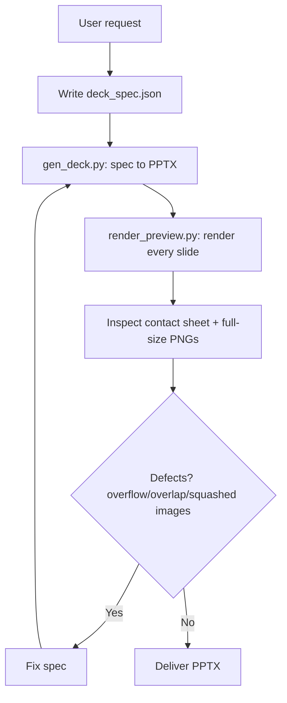
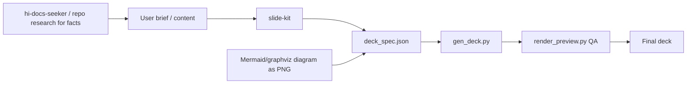

# Slide Kit Skill: Complete Guide

> `slide-kit` is a Python-based deck generator that turns a JSON spec into a `.pptx` file in a fixed navy-and-teal corporate tech style, then renders every slide for mandatory visual QA before delivery.

## 1. Objective

The skill produces `.pptx` decks that match a reference style extracted from a Phase-1 "Vaccine" deck:

- dark navy gradient cover/agenda/closing slides with lightning artwork;
- white content slides with a 60pt navy header band and white title;
- teal-headed zebra tables;
- green/blue sitemap cards with legend swatches;
- rounded code panels with automatic syntax highlighting.

The kit is **brand-neutral**: it never inserts company logos or brand assets, and the skill must not add any.

Use it whenever the user asks for slides/deck/pptx "in this style", "like the Phase1/Vaccine deck", or loads the kit explicitly.

## 2. Hard outcomes

- The deck matches the fixed style tokens (they are hardcoded in `gen_deck.py`, not re-derived per run).
- Every slide is rendered with a real PowerPoint engine and visually inspected before completion.
- No logo, no watermark, no footer branding anywhere.
- Text density stays sane: max ~6 bullets per slide, tables ≤ 12 rows at 8pt, one idea per slide.
- Slide language follows the user's language (the reference deck is Vietnamese with full diacritics — Calibri renders them fine).

## 3. Overall workflow



## 4. Quick start

```bash
python3 <skill_dir>/scripts/gen_deck.py spec.json -o deck.pptx
python3 <skill_dir>/scripts/gen_deck.py <skill_dir>/examples/deck_spec.json -o /tmp/example_deck.pptx
```

Mandatory QA before delivery:

```bash
python3 <skill_dir>/scripts/render_preview.py deck.pptx --output-dir /tmp/deck_preview
```

Open `contact-sheet.jpg` and each `slide-NN.png`, and check for: text overflow/overlap, tables too long, misaligned chips/columns, distorted images. Fix the spec → regenerate → re-render until clean. Never declare completion before rendering and inspecting every slide.

## 5. Spec format (JSON)

Top level:

```jsonc
{
  "output": "deck.pptx",
  "slides": [
    { "layout": "cover",   "title": "...", "subtitle": "...(optional)", "date": "OCT 29 2026", "title_y": 200, "size": 48 },
    { "layout": "agenda",  "items": ["...", "..."] },
    { "layout": "content", "title": "1. Section", "body": [ /* blocks */ ],
      "note": "footer note", "note_color": "E02020" },
    { "layout": "thanks",  "title": "THANK YOU", "subtitle": "..." }
  ]
}
```

- Four layouts: `cover`, `agenda`, `content`, `thanks`. Agenda items are auto-numbered `01, 02, ...`.
- `note` / `note_color` are optional footer annotations on content slides.
- Every slide accepts `"notes": "speaker notes"`.

### Body blocks

Body is an array of blocks stacked vertically in the content area; `"h"` sets a block height in pt (omitted = equal split):

| type | key parameters |
|---|---|
| `bullets` | `items`: [{"t": "...", "lvl": 0/1/2, "bold": bool}], `size` 8–12 |
| `heading` | `text`, `size` (16 default) |
| `table` | `header` [], `rows` [[...]], `cols` [ratios], `align`, `size` (auto 10/9/8), cell `"^"` = merge with cell above; in-cell `\n` line break, `- `/`o ` bullets |
| `image` | `path` (relative = relative to the spec file), auto fit-centered in frame |
| `columns` | `cols`: [block...], `weights`: [0.42, 0.58], `gap` — e.g. table left + image right |
| `code` | `panels`: [{`title`, `code`}], `size` 8, auto syntax highlight for JSON/SQL-ish, `//` = comment |
| `cards` | `groups`: [{`title`, `chips`: [{"t", "tone": "green"/"blue"/"peach", "lvl", "link": bool}]}], `legend`: {"label", "swatches": [["92D050","Phase 1"],["73B5FF","Phase 2"]]} |

### Inline markup (usable in any text)

- `**bold**`
- `[[red|red text]]` — colors: `red green orange teal tealdark blue gray white ink`

## 6. Style tokens

Tokens are hardcoded in `gen_deck.py`; key values:

| Token | Value | Used for |
|---|---|---|
| Navy background | horizontal gradient `#003877 → #02275F` (lands at 42% width) | cover/agenda/thanks (pre-composed background assets) |
| Header band | `assets/header_band.jpg`, 60pt tall, Calibri Bold 24pt white title, x=26pt | every content slide |
| Body text color | `#29333A` | body text |
| Teal | `#32B2C1` | table headers, accents |
| Zebra rows | `#E8F2F4` / `#CDE4E9` | alternating table rows |
| Chips green/blue | `#A7FFCF` / `#C9DCFF`; legend `#92D050` / `#73B5FF`; legend band `#D9D9D9` | sitemap cards |
| Warning / emphasis | red `#E02020`, orange `#F88728`, green `#00B050`, peach `#FDE0C0` | markup in tables/bullets |
| Borders / lines | `#BFBFBF` cards, `#2E75B6` code panels, `#2E6FBE` agenda pills | |
| Code | Menlo 8pt: key `#E06C75`, string `#98C379`, comment `#7F848E`, number `#D19A66`, plain `#3B4249` | |
| Fonts | Calibri (Arial fallback), cover date Segoe UI 16pt | |
| Page size | 13.33 × 7.5 in (960×540pt), 16:9 | |
| Cover title | Calibri Bold 48pt white, x=70pt y≈200pt; date pill 172×38pt x=72 y=472 (white 14.5% fill, 25% border) | |
| Agenda | number + blue-bordered pill 347×30pt, step ≈46.6pt from y=24 | |
| Page number | gray `#7F7F7F` 10pt bottom-right, starting from the agenda slide | |

## 7. Content rules

- **No logos, no branding** — including footers, headers, watermarks. The kit is brand-neutral by design.
- Content slide titles follow the reference pattern of numbered sections (`"1. ..."`, `"2. ..."`).
- Density: max ~6 bullets/slide or a table ≤ 12 rows at 8pt; one slide = one idea. Split dense content into more slides.
- Prefer tables + bold/color markup over long paragraphs; highlight key numbers with `**bold**` or `[[red|...]]`.
- Diagrams: generate a PNG (Mermaid/graphviz/draw.io) and embed it via an `image` block or `columns`; no low-quality screenshots (≥ 2x scale only).
- Images stay in frame: auto fit-centered; if an image is too tall/wide, crop externally or give it its own slide.

## 8. Files and environment

```
slide-kit/
├── SKILL.md                  ← this guide's source of truth
├── assets/                   ← brand-neutral navy backgrounds: bg_cover, bg_agenda (auto-generated constellation+rings), bg_thanks (waves), header_band (.jpg)
├── scripts/gen_deck.py       ← spec JSON → .pptx (python-pptx)
├── scripts/render_preview.py ← .pptx → per-slide PNGs + contact sheet (PowerPoint AppleScript, soffice fallback)
├── scripts/build_assets.py   ← regenerates cover/agenda backgrounds (neutral artwork, fixed seed)
└── examples/deck_spec.json   ← sample deck exercising every layout (with example_diagram.png)
```

Environment requirements: Python 3 + `python-pptx`, `pillow`, `pymupdf` (only `render_preview.py` needs pymupdf), macOS + Microsoft PowerPoint for QA rendering (or LibreOffice).

## 9. Extending

- New layout → add a renderer to `BLOCK_RENDERERS` in `gen_deck.py`, using the tokens above; measure positions in pt on the 960×540 canvas.
- New background artwork → replace files in `assets/` keeping the same names and 1920×1080 ratio (band: 1920×120); or tweak `build_assets.py` and rerun it.

## 10. Verify slide-kit

- [ ] Spec validates: all four layouts used correctly, blocks well-formed.
- [ ] `gen_deck.py` runs clean.
- [ ] `render_preview.py` rendered every slide.
- [ ] Contact sheet + every full-size slide inspected.
- [ ] No text overflow/overlap; tables fit; chips/columns aligned; images undistorted.
- [ ] No logo or brand asset anywhere.
- [ ] Density respected (~6 bullets or ≤12-row table per slide).
- [ ] Every fix was followed by a full regeneration + re-render.

## 11. Relationship with other skills



## 12. Limitations

- Fixed visual system: one navy/teal style; it does not generate charts from data files the way a full BI pipeline would (charts are tables/cards/images).
- QA rendering expects macOS + PowerPoint (or LibreOffice); on other setups the preview path degrades.
- The style tokens are hardcoded — restyling means editing `gen_deck.py`, not a config file.
- Diagrams must be produced externally (Mermaid/graphviz/draw.io) and embedded as PNG.

## 13. Summary

> `slide-kit` trades flexible design for consistency: write a JSON spec, generate a `.pptx` in the fixed navy/teal style, render and inspect every slide, and only then deliver.
