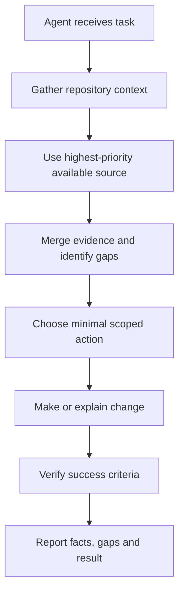
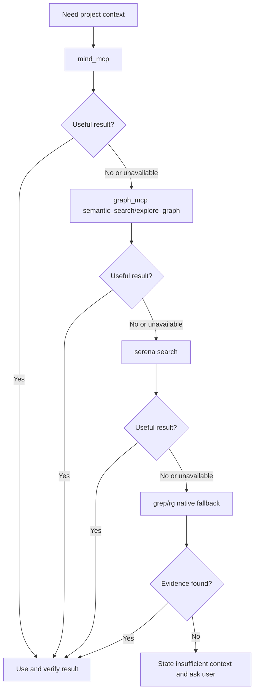
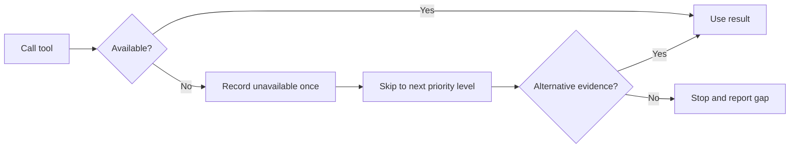
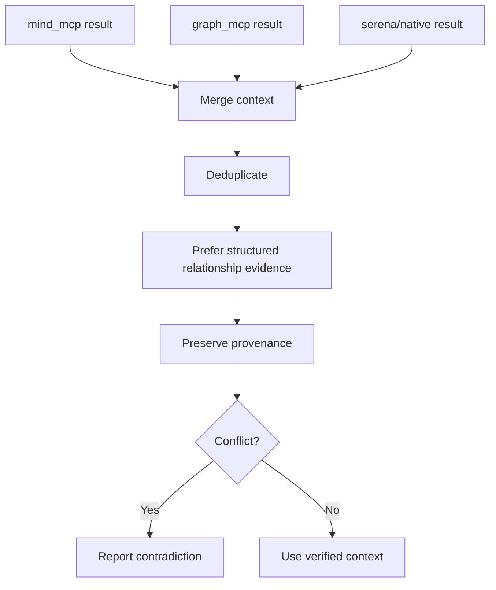
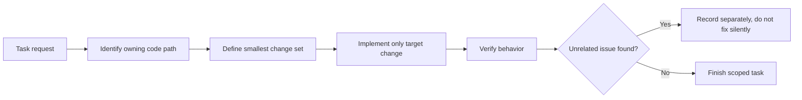
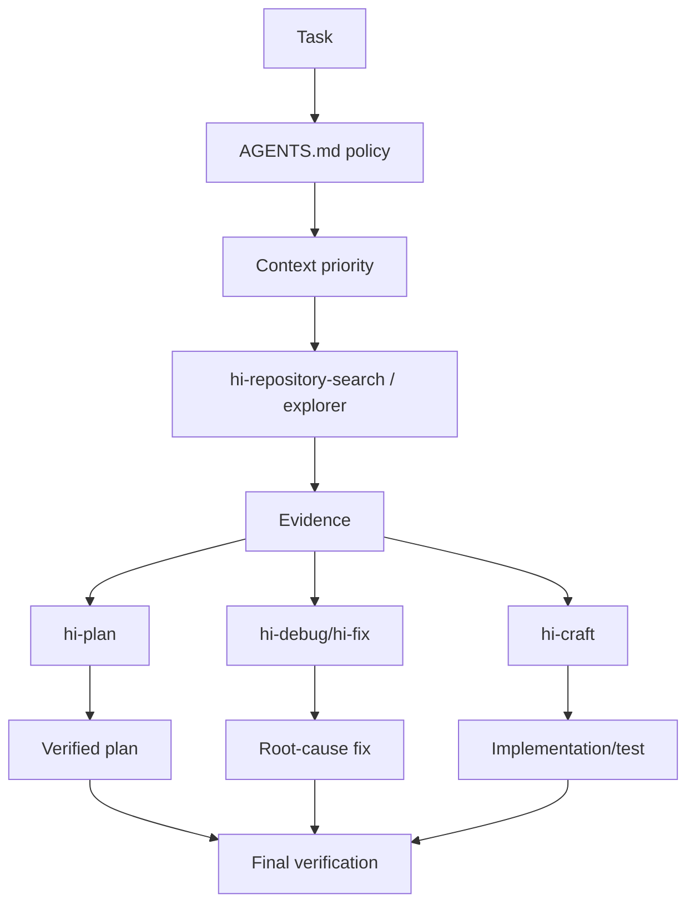
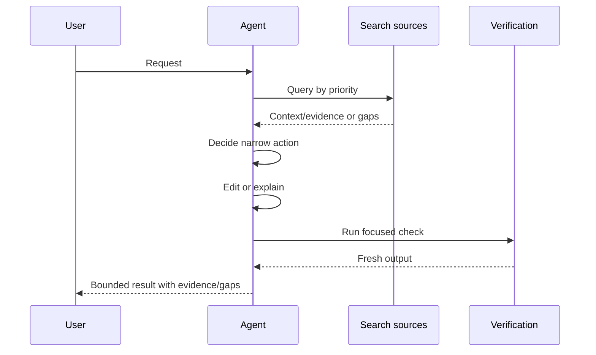
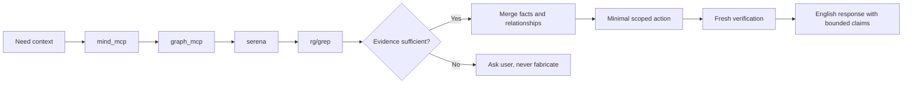

# AGENTS.md: Hướng dẫn vận hành cho Agent

> `AGENTS.md` là policy cấp repository định hướng cách agent thu thập context, kiểm soát độ tin cậy, giới hạn scope và xác nhận kết quả trước khi trả lời hoặc chỉnh sửa code.

## 1. AGENTS.md là gì?

`AGENTS.md` không phải source code, không phải implementation plan và cũng không phải skill thực hiện một feature. Nó là một **operating contract** giữa repository và AI agent.

File này trả lời các câu hỏi:

- Agent phải tìm context từ nguồn nào trước?
- Khi tool không có hoặc bị lỗi thì fallback ra sao?
- Khi nào agent được phép dùng native search?
- Agent phải làm gì nếu không tìm thấy context?
- Làm sao tránh hallucination và assumption không có bằng chứng?
- Thay đổi cần giữ scope ở mức nào?
- Thành công phải được verify như thế nào?
- Agent nên phản hồi bằng ngôn ngữ nào?

Trong repository này, `AGENTS.md` là policy nền cho các skill và task agent chạy trong workspace.

## 2. Mục tiêu chính



Mục tiêu không phải là tìm thật nhiều thông tin. Mục tiêu là:

1. tìm đúng context;
2. dùng source đáng tin nhất trước;
3. không tự bịa khi evidence thiếu;
4. chỉ thay đổi phần cần thiết;
5. kiểm chứng kết quả.

## 3. Cấu trúc policy hiện tại

`AGENTS.md` gồm các nhóm rule:

| Nhóm | Mục đích |
|---|---|
| Objective | Định nghĩa mục tiêu gather project context |
| Fast-Fail Rule | Không retry tool bị thiếu/disconnected |
| Strict Priority Flow | Thứ tự nguồn tìm kiếm |
| Mandatory Rules | No hallucination, merge context, scope, verify |
| Language Rule | Agent phản hồi bằng English |

## 4. Strict Priority Flow

Thứ tự truy vấn bắt buộc:

```text
1. mind_mcp
2. graph_mcp: semantic_search, explore_graph
3. serena
4. grep/rg
```



### 4.1 Level 1: `mind_mcp`

`mind_mcp` là nguồn đầu tiên cho:

- project documentation;
- concepts;
- foundational knowledge;
- requirements;
- business context;
- architecture/project paragraphs.

Dùng level này khi câu hỏi cần hiểu “project nói gì” hoặc “feature có ý nghĩa gì trong domain”.

Ví dụ query tốt:

```text
Find project requirements and architecture decisions related to authentication.
```

### 4.2 Level 2: `graph_mcp`

Nếu `mind_mcp` không đủ, dùng `graph_mcp` để tìm code relationships và logic theo semantics:

- semantic code search;
- graph exploration;
- callers/callees;
- module relationships;
- entry points;
- execution paths;
- impact.

`graph_mcp` ưu tiên semantics, không chỉ exact string. Khi dùng parser-aware graph tools, truyền đúng `parser_type` và giới hạn depth/result theo câu hỏi.

Ví dụ query:

```text
Find the function that handles authentication and trace its call path to token storage.
```

### 4.3 Level 3: `serena`

`serena` là broad structural search fallback cho:

- declarations;
- implementations;
- references;
- symbol overview;
- diagnostics;
- exact project structure cần language-aware search.

Dùng khi structured mind/graph context không trả đủ evidence hoặc tool không khả dụng.

### 4.4 Level 4: `grep`/`rg`

Native exact-string search là fallback cuối:

- tìm literal error message;
- exact filename/path;
- config key;
- identifier/string cụ thể;
- xác minh nhanh sau structured search.

Native search không bị cấm, nhưng không nên là first move khi project context hoặc semantic relationship cần được hiểu trước.

## 5. Quy tắc “proceed only if no result/unavailable”

Priority flow không có nghĩa luôn gọi cả bốn level. Agent phải dừng khi evidence đã đủ.

```text
mind_mcp đủ evidence -> không cần graph/serena/rg
mind_mcp thiếu       -> thử graph_mcp
graph thiếu          -> thử serena
serena thiếu         -> dùng rg/grep
tất cả thất bại      -> dừng và hỏi user
```

Điều này giúp:

- giảm tool calls;
- giảm kết quả trùng lặp;
- giữ query scope nhỏ;
- tránh native search tạo context rời rạc trước khi hiểu domain.

## 6. Fast-Fail Rule

> Nếu tool missing hoặc disconnected: skip ngay, không retry.

### 6.1 Khi nào fast-fail?

- MCP server không connected;
- tool không được expose;
- tool provider unavailable;
- session/config không có capability;
- service trả lỗi rõ ràng là unavailable.

### 6.2 Làm gì sau fast-fail?

1. ghi nhận tool unavailable;
2. chuyển level kế tiếp;
3. không lặp lại cùng call;
4. tiếp tục nếu vẫn có thể thu evidence;
5. ghi gap trong final report.



### 6.3 Không được làm

- retry cùng tool nhiều lần chỉ vì chưa có kết quả;
- giả vờ tool đã chạy;
- tạo evidence từ output không nhận được;
- bỏ qua gap trong final response.

## 7. Mandatory Rule 1: No Hallucination

Quy tắc:

> Nếu toàn bộ search chain không trả context, phải dừng và hỏi user. Không được fabricated context.

### 7.1 Fact, inference và unknown

Agent phải phân biệt:

| Loại | Ý nghĩa | Cách viết |
|---|---|---|
| Fact | Có source trực tiếp | “File X định nghĩa function Y.” |
| Inference | Suy ra từ nhiều evidence | “Điều này cho thấy có thể…” |
| Assumption | Tạm giả định để tiến hành | “Giả định hiện tại là…” |
| Unknown | Chưa có evidence | “Chưa xác định được…” |

### 7.2 Không tìm thấy không có nghĩa không tồn tại

Ví dụ không hợp lệ:

```text
Không tìm thấy implementation nên feature này không có.
```

Cách đúng:

```text
Không tìm thấy implementation trong các nguồn đã kiểm tra;
project context chưa đủ để kết luận feature không tồn tại.
```

### 7.3 Khi phải hỏi user

Hỏi user khi:

- tất cả search levels fail;
- target/feature không rõ;
- nhiều source mâu thuẫn mà không có owner quyết định;
- cần context ngoài repository;
- production behavior không thể suy ra từ static source;
- thay đổi user request có risk nhưng thiếu acceptance criteria.

## 8. Mandatory Rule 2: Merge Context

Khi nhiều tool trả evidence trùng hoặc bổ sung nhau:

1. collect từng result;
2. deduplicate;
3. ưu tiên structured data từ `graph_mcp` khi cùng một relationship;
4. giữ source/provenance;
5. ghi contradiction nếu sources khác nhau;
6. phân biệt fact và inference.



### 8.1 Ví dụ merge

- `mind_mcp`: requirement nói token phải rotate;
- `graph_mcp`: xác định flow token hiện tại;
- `serena`: tìm implementation/reference;
- `rg`: xác nhận literal config key.

Kết luận hợp lệ phải nói rõ claim dựa trên nguồn nào, không gom thành một “source” chung mơ hồ.

## 9. Mandatory Rule 3: No Assumptions

Agent không được lấp khoảng trống bằng suy đoán im lặng.

### 9.1 Assumption gate

Trước khi dùng assumption, hỏi:

- assumption dựa trên evidence nào;
- nếu sai thì impact gì;
- có query rẻ nào kiểm tra được không;
- có thể tiếp tục mà không cần assumption không;
- cần user/domain owner xác nhận không.

### 9.2 Cách report uncertainty

```markdown
## Open Questions
- The target module was found, but its production configuration was not indexed.
- The graph shows a possible callback path; direct runtime registration is unverified.
- Please provide the deployment/environment context before changing behavior.
```

### 9.3 Không biến pattern thành fact

Việc code “thường” dùng repository pattern không chứng minh file này cũng dùng pattern đó. Cần đọc source hoặc relationship trực tiếp.

## 10. Mandatory Rule 4: Minimal Code

Policy yêu cầu giải quyết target problem với code tối thiểu:

- không refactor ngoài scope;
- không thêm abstraction không cần;
- không sửa unrelated bug;
- không đổi metadata không liên quan;
- không mở rộng search/change chỉ vì thấy cơ hội.

“Minimal” không có nghĩa patch mù. Phải đủ để giải quyết root behavior và verify được.



## 11. Mandatory Rule 5: Strict Scope

Scope gồm:

- files được đọc/chỉnh sửa;
- behavior cần giải quyết;
- dependencies liên quan;
- output user yêu cầu;
- acceptance criteria.

### 11.1 Scope discipline

Trước khi mở rộng scope, xác định:

- change mới có blocking cho task không;
- có ảnh hưởng trực tiếp đến correctness/security không;
- có cần user approval không;
- có thể defer và report riêng không.

### 11.2 Unrelated issue

Nếu phát hiện bug không liên quan:

- không tự sửa;
- ghi path/symbol và impact nếu cần;
- đề xuất follow-up;
- giữ diff sạch.

## 12. Mandatory Rule 6: Success Criteria

Task chỉ thành công khi success criteria được verify, không chỉ khi code đã thay đổi.

### 12.1 Verify theo claim

| Claim | Check cần chạy |
|---|---|
| File được tạo | File exists, content/format check |
| Symbol được sửa | Compile/typecheck/test hoặc structural check |
| Bug fixed | Reproduce original symptom sau fix |
| Tests pass | Fresh test command, output/exit code |
| Build pass | Fresh build command, exit 0 |
| Requirements met | Requirement-by-requirement checklist |
| Migration complete | Final tree, links/imports, no unintended files |

### 12.2 Không claim quá mức

Tránh:

- “done” khi chưa chạy validation;
- “all good” khi còn unresolved gap;
- “feature complete” khi mới tạo plan;
- “no impact” khi chỉ trace depth hạn chế.

## 13. Ngôn ngữ phản hồi

Rule cuối của `AGENTS.md`:

> Agent luôn phản hồi bằng English.

Điều này áp dụng cho response của agent trong repository này, dù user có thể trao đổi bằng ngôn ngữ khác. Code comments/docs có thể follow yêu cầu riêng của task hoặc file convention, nhưng final agent response phải bằng English theo policy.

## 14. Interaction với các skill



### 14.1 Với `hi-repository-search`

`AGENTS.md` quy định priority chain. `hi-repository-search` thực thi repository evidence search với modes và Evidence Bundle.

### 14.2 Với `hi-codebase-research-explorer`

Explorer có thể parallelize local/external research, nhưng internal search vẫn phải respect tool priority policy khi tìm local context.

### 14.3 Với `hi-plan`

Trước khi lập plan, agent phải gather đủ repository context, detect uncertainty và không bịa files/architecture.

### 14.4 Với `hi-fix`/`hi-debug`

Root-cause diagnosis cần evidence trước fix. Nếu search chain fail, phải report gap hoặc hỏi user, không đoán root cause.

### 14.5 Với `hi-craft`

Implementation phải giữ strict scope và verify test/build trước completion claim.

## 15. Quy trình vận hành chuẩn

### Phase 1: Understand

- đọc user request;
- xác định concrete anchor;
- kiểm tra applicable instruction files;
- xác định success criteria;
- nêu một local hypothesis và cheap discriminating check nếu coding task.

### Phase 2: Gather

- chạy search theo priority;
- fast-fail unavailable tools;
- merge source evidence;
- ghi gaps/unknowns.

### Phase 3: Decide

- chọn smallest scoped action;
- không mở rộng khi chưa cần;
- hỏi user nếu blocking ambiguity;
- xác định verification command.

### Phase 4: Act

- edit tối thiểu;
- giữ unrelated changes;
- không overwrite hoặc destructive operation;
- preserve existing conventions.

### Phase 5: Verify

- chạy focused executable validation;
- đọc output/exit code;
- sửa local defect nếu có;
- chỉ claim đúng điều evidence chứng minh.



## 16. Fallback matrix

| Primary situation | Fallback | Report |
|---|---|---|
| `mind_mcp` unavailable | `graph_mcp` | Mind context unavailable |
| `graph_mcp` unavailable | `serena` | Graph relationships unverified |
| `serena` unavailable | `rg`/grep | Structural semantic search unavailable |
| All search unavailable | Ask user | Insufficient repository context |
| Source conflict | Keep both claims | Contradiction unresolved |
| Target unclear | Ask user | Need concrete anchor |
| Verification command unavailable | Alternative check or report blocker | Cannot claim full verification |

## 17. Những điều AGENTS.md ngăn chặn

### 17.1 Tool thrashing

Không gọi lặp cùng unavailable tool. Điều này tiết kiệm thời gian và làm failure rõ hơn.

### 17.2 Hallucinated architecture

Không tự dựng module/file relationship khi graph/source chưa chứng minh.

### 17.3 Broad unrelated changes

Không biến một fix nhỏ thành refactor toàn repo.

### 17.4 False completion

Không báo pass/fixed/done nếu chưa fresh verify.

### 17.5 Search-first bằng exact text mù

Không bắt đầu bằng sweep toàn repo nếu project knowledge/semantic graph có thể trả context tốt hơn.

## 18. Checklist cho agent trước khi trả lời

### Context

- [ ] Đã xác định file/symbol/error/request cụ thể chưa?
- [ ] Đã dùng đúng search priority chưa?
- [ ] Tool unavailable có được ghi không?
- [ ] Evidence có source locator không?

### Reasoning

- [ ] Facts và inference đã tách chưa?
- [ ] Có assumption chưa kiểm chứng không?
- [ ] Có contradiction/gap cần nói không?
- [ ] Scope có đang mở rộng không cần thiết không?

### Action

- [ ] Change set nhỏ nhất đã được chọn chưa?
- [ ] Có đụng unrelated file/user changes không?
- [ ] Có nguy cơ overwrite/secrets/destructive action không?

### Verification

- [ ] Verification command nào chứng minh claim?
- [ ] Đã chạy command mới chưa?
- [ ] Đã đọc output và exit code chưa?
- [ ] Final response có nói đúng giới hạn evidence không?

## 19. Ví dụ: search chain thành công

Task:

```text
Find where authentication errors are transformed into API responses.
```

Flow:

1. `mind_mcp`: tìm architecture/requirements về auth error contract.
2. Nếu chưa đủ, `graph_mcp`: semantic search cho auth error handling và trace flow tới HTTP response.
3. `serena`: tìm declaration/reference của error mapper.
4. `rg`: chỉ dùng để xác nhận exact error class/string nếu cần.
5. Đọc trực tiếp source.
6. Trả facts, relationships, confidence và gaps.

Evidence response dạng:

```markdown
## Findings
- `AuthErrorMapper.toResponse` converts domain auth errors to HTTP responses — code — high
  Evidence: direct caller path from auth middleware.

## Relationships
- `AuthMiddleware.handle` -> `AuthService.authenticate` -> `AuthErrorMapper.toResponse`

## Inferences
- Updating the mapper may affect all protected routes using the shared middleware.

## Gaps
- Error behavior for one legacy route is not indexed.
```

## 20. Ví dụ: search chain thất bại

Task:

```text
Explain the business rule for an undocumented legacy billing flow.
```

Nếu:

- `mind_mcp` không có requirement;
- `graph_mcp` không có project/index;
- `serena` không tìm được symbol;
- `rg` không tìm được relevant source;

Agent phải trả:

```text
I could not establish the billing rule from the available project context.
The configured search sources did not return a verified implementation or document.
Please provide the relevant module, repository path, or business requirement.
```

Không được tự suy ra rule từ tên “billing”.

## 21. Ví dụ: conflict giữa code và document

Code hiện tại cho phép session timeout 30 ngày. Security decision document yêu cầu 7 ngày.

Response đúng:

```markdown
## Contradictions
- Code config currently permits a 30-day session timeout.
- Security decision document specifies a 7-day timeout.

## Inferences
- The implementation appears inconsistent with the documented policy.

## Gaps
- The document's effective date and deployment environment are not confirmed.

## Next Step
- Ask the policy owner whether the document or implementation is authoritative before changing behavior.
```

Không tự chọn code hay doc là source of truth mà không có owner/context.

## 22. Verify policy compliance

### 22.1 Search compliance

- [ ] Query bắt đầu từ `mind_mcp` khi applicable.
- [ ] Graph semantic/explore được ưu tiên trước native search.
- [ ] Serena được dùng cho structural search khi cần.
- [ ] `rg` là fallback cuối hoặc exact verification.
- [ ] Dừng khi evidence đủ.

### 22.2 Evidence compliance

- [ ] Không fabricated context.
- [ ] Source locator rõ.
- [ ] Relationships được verify.
- [ ] Contradictions/gaps được report.
- [ ] Inferences được label.

### 22.3 Scope compliance

- [ ] Chỉ target files/behavior cần thiết.
- [ ] Không sửa unrelated issue.
- [ ] Không override user changes.
- [ ] Không destructive command thiếu approval.

### 22.4 Completion compliance

- [ ] Success criteria được kiểm tra.
- [ ] Fresh executable validation đã chạy khi có thể.
- [ ] Output/exit code đã đọc.
- [ ] Claim cuối không vượt quá evidence.
- [ ] Response dùng English theo policy.

## 23. Giới hạn cần hiểu đúng

### 23.1 Priority flow không đảm bảo tool luôn có

Policy chỉ định thứ tự và fallback. Nó không đảm bảo MCP, graph index hoặc Serena đang connected.

### 23.2 Structured result vẫn cần verify

`mind_mcp` hoặc `graph_mcp` trả context có cấu trúc nhưng source có thể stale, incomplete hoặc parser-limited. Claim quan trọng vẫn cần direct verification.

### 23.3 Native search không bị cấm tuyệt đối

`rg` phù hợp cho exact string và fallback. Rule chỉ ngăn việc dùng nó như first/only context strategy khi cần semantics.

### 23.4 Không phải task nào cũng cần hỏi user

Nếu evidence đủ và scope rõ, agent nên hành động. Hỏi user chỉ khi ambiguity/gap blocking hoặc không thể verify an toàn.

### 23.5 Language rule có thể xung đột với user preference

Trong workspace này, `AGENTS.md` yêu cầu English response. Đây là repository instruction cần tuân thủ trừ khi instruction có priority cao hơn override hợp lệ.

## 24. Tóm tắt nhanh



Câu ngắn nhất để nhớ:

> `AGENTS.md` buộc agent đi từ context đáng tin đến hành động tối thiểu, luôn ghi nhận gap và chỉ tuyên bố điều mà evidence và verification thực sự chứng minh.
