# Hi Codebase Research Explorer: Hướng dẫn đầy đủ

> `hi-codebase-research-explorer` là skill thu thập codebase intelligence và external research bằng nhiều agent chạy song song. Nó dùng để tìm file, symbol, dependency, tài liệu web, GitHub repository, hình ảnh, UI và sơ đồ trước khi plan, fix hoặc implement.

## 1. Skill này giải quyết vấn đề gì?

Trong một repository lớn, việc đọc ngẫu nhiên vài file thường dẫn đến kết luận thiếu context. Một task có thể liên quan đến:

- file implementation;
- caller và callee;
- test và fixture;
- config/environment;
- documentation;
- Git history;
- external API hoặc library docs;
- GitHub repository chưa clone;
- screenshot/UI/architecture diagram.

Explorer biến yêu cầu tìm kiếm thành một investigation có tổ chức:

1. phân tích target và scope;
2. chọn internal, external hoặc hybrid mode;
3. chia công việc thành các scope không overlap;
4. chạy agent song song;
5. thu thập, deduplicate và tổng hợp evidence;
6. nêu rõ gap, timeout và unresolved questions.

Nó **không phải** skill để sửa code. Các agent explorer mặc định chỉ đọc/tìm kiếm; output được dùng làm input cho `hi-plan`, `hi-fix`, `hi-craft` hoặc người developer.

## 2. Mental model tổng quát

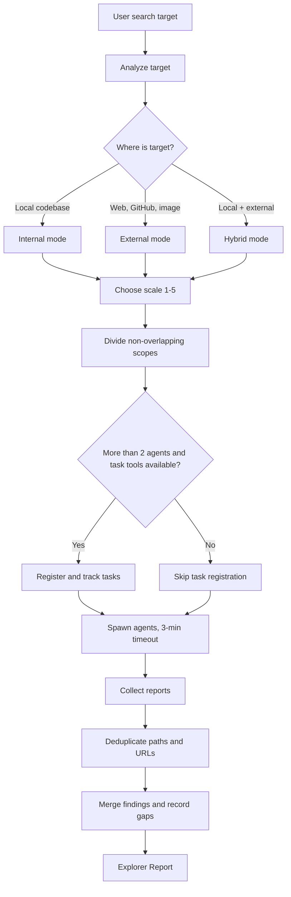

## 3. Cú pháp

```text
/hi-codebase-research-explorer [search-target]
```

`search-target` có thể là:

- directory hoặc path local;
- tên file, class, function hoặc behavior cần tìm;
- error message;
- URL documentation;
- GitHub repository hoặc owner/repo;
- image path, screenshot hoặc diagram;
- chủ đề cần research;
- yêu cầu kết hợp local code và external docs.

Ví dụ:

```text
/hi-codebase-research-explorer authentication middleware and its tests
/hi-codebase-research-explorer https://github.com/vercel/next.js
/hi-codebase-research-explorer screenshot of the failing mobile layout
/hi-codebase-research-explorer local payment client plus current Stripe retry guidance
```

Skill này không có nhiều cờ workflow như `hi-plan` hoặc `hi-fix`. Complexity được điều khiển bằng cách phân tích target, chọn mode và SCALE từ 1 đến 5 agents.

## 4. Bốn loại target

### 4.1 Local

Target nằm trong current codebase:

- source file;
- test;
- config;
- module;
- symbol;
- error path;
- dependency graph nội bộ.

Dùng **internal mode**.

### 4.2 External

Target nằm ngoài repository hiện tại:

- web docs/blog;
- GitHub repository chưa clone;
- GitHub issue/commit/docs;
- image/screenshot;
- architecture diagram.

Dùng **external mode** và MCP tools phù hợp.

### 4.3 Hybrid

Cần nối local code với external evidence:

- local dùng một library và cần đọc docs hiện tại;
- local fork cần so sánh upstream GitHub;
- local UI bug cần đọc screenshot và source component;
- local error cần đối chiếu issue/docs bên ngoài.

Dùng **hybrid mode**, spawn các agent theo từng toolset riêng.

### 4.4 Target mơ hồ

Nếu target không cho biết cần tìm gì, explorer nên:

- rút ra entity/behavior rõ nhất từ prompt;
- tìm local context trước nếu có dấu hiệu repository;
- ghi phần còn mơ hồ vào `Unresolved Questions`;
- không biến một search mơ hồ thành kết luận chắc chắn.

## 5. Analyze: phát hiện scope

Bước đầu parse user prompt và xác định:

- target là local, external hay hybrid;
- loại resource cần tìm;
- phạm vi directory/repository/domain;
- số agent hợp lý;
- toolset cần cấp cho mỗi agent;
- output người dùng cần: paths, docs, dependency, visual understanding hay diagnosis.

### 5.1 SCALE

SCALE là số agent dự kiến, từ 1 đến 5:

| SCALE | Agents | Trường hợp |
|---:|---:|---|
| 1 | 1 | Một file, một docs page hoặc một repo lookup đơn giản |
| 2-3 | 2-3 | Nhiều module, nhiều nguồn hoặc repo + docs |
| 4-5 | 4-5 | Investigation toàn diện với nhiều query/toolset |
| 6+ | Không khuyến nghị | Chia thành nhiều batch thay vì spawn quá nhiều |

SCALE không phải mục tiêu để tăng số agent. Chỉ tăng khi các nhánh có scope độc lập và kết quả bổ sung cho nhau.

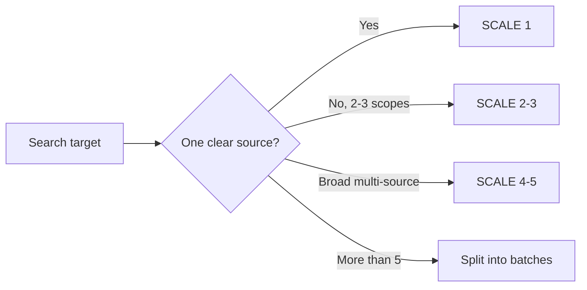

## 6. Divide: chia work không overlap

Mỗi agent phải có một scope riêng, không đọc cùng một vùng chỉ để lặp lại kết luận.

### 6.1 Internal directory division

Các directory thường được chia theo ownership:

```text
src/ | lib/ | tests/ | config/ | api/ | types/
```

Ví dụ với feature authentication:

| Agent | Scope | Câu hỏi |
|---|---|---|
| A | `src/auth/` | Entry points và business logic là gì? |
| B | `tests/auth/` | Test hiện có cover behavior nào? |
| C | `config/` + docs | Config, environment và integration contract là gì? |

Không giao cùng một directory cho nhiều agent nếu không có query khác nhau rõ ràng.

### 6.2 External toolset division

Mỗi external agent nên được gán một toolset:

| Agent | Toolset | Mục tiêu |
|---|---|---|
| Web docs | web search + web reader | Tìm và đọc docs hiện hành |
| GitHub | repo structure + search + read | Phân tích repository |
| Visual | image/UI/diagram analyzer | Hiểu screenshot hoặc diagram |

Một agent có thể có nhiều tool trong cùng category, nhưng tránh giao quá nhiều mục tiêu không liên quan.

### 6.3 Nguyên tắc không overlap

Scope được xem là overlap nếu hai agent:

- đọc cùng file để trả lời cùng câu hỏi;
- tìm cùng symbol nhưng không có lens khác nhau;
- dùng cùng external source mà không phân biệt mục tiêu;
- cùng đưa ra architecture conclusion mà không chia evidence.

Nếu bắt buộc cần redundancy vì issue critical, ghi rõ đó là **independent verification**, không gọi là scope bình thường.

## 7. Register Tasks

Task registration giúp theo dõi các agent khi có hơn hai agents và task tools khả dụng.

### 7.1 Khi đăng ký

- gọi `TaskList` trước để reuse tasks hiện có;
- nếu không có task phù hợp, tạo một task cho mỗi agent;
- gắn metadata đủ để biết agent đang làm gì;
- chuyển task sang `in_progress` trước khi spawn;
- chuyển `completed` sau khi agent trả report;
- đánh dấu timeout/skip thay vì giữ task ở trạng thái active.

### 7.2 Metadata chuẩn

```yaml
agentType: general-purpose
scope: <directory or research scope>
scale: <small|medium|large>
agentIndex: 0
 totalAgents: 3
toolMode: <read|search|bash|web|repo|visual>
tools: [<mcp_tool_1>, <mcp_tool_2>]
priority: P2
effort: 3m
```

Tên field `totalAgents` không nên bị bỏ qua khi tổng hợp report, vì nó giúp nhận biết batch đã đủ hay còn agent bị timeout.

### 7.3 Khi skip task registration

Skip nếu:

- có tối đa 2 agents;
- task tools không khả dụng;
- lookup quá nhỏ và kết quả trả trực tiếp;
- việc tạo task tạo overhead lớn hơn giá trị tracking.

Skip registration không có nghĩa skip parallel work; nó chỉ bỏ tracking layer.

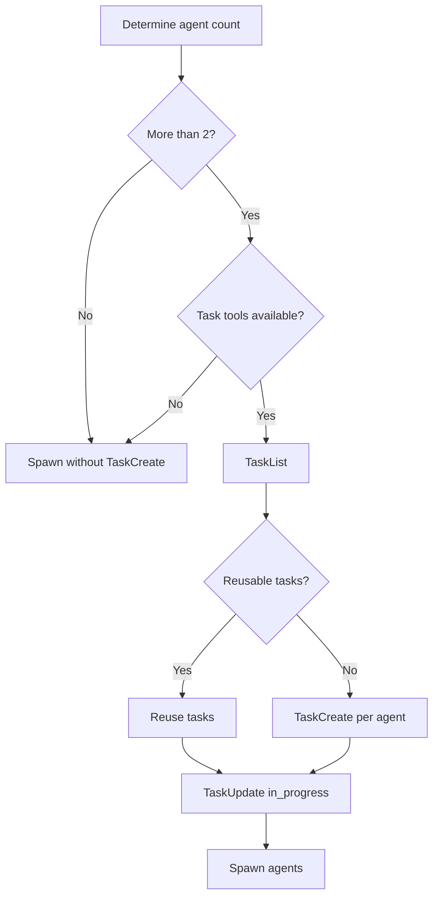

## 8. Spawn và timeout

### 8.1 Trước khi spawn

Mỗi task phải được chuyển `in_progress` trước khi agent bắt đầu. Prompt agent cần có:

- index và tổng số agents;
- scope riêng;
- target cụ thể;
- toolset được phép;
- report format;
- timeout 3 phút;
- yêu cầu ghi unresolved nếu tool unavailable.

### 8.2 Timeout policy

Mỗi agent có timeout mặc định 3 phút:

- agent trả kết quả trước timeout: collect;
- agent timeout: skip, ghi nhận gap;
- không retry mù agent bị timeout;
- nếu tool lỗi, dùng fallback trong cùng category khi có thể;
- nếu nhiều agent cùng tool fail, ghi `tool degraded` trong report.

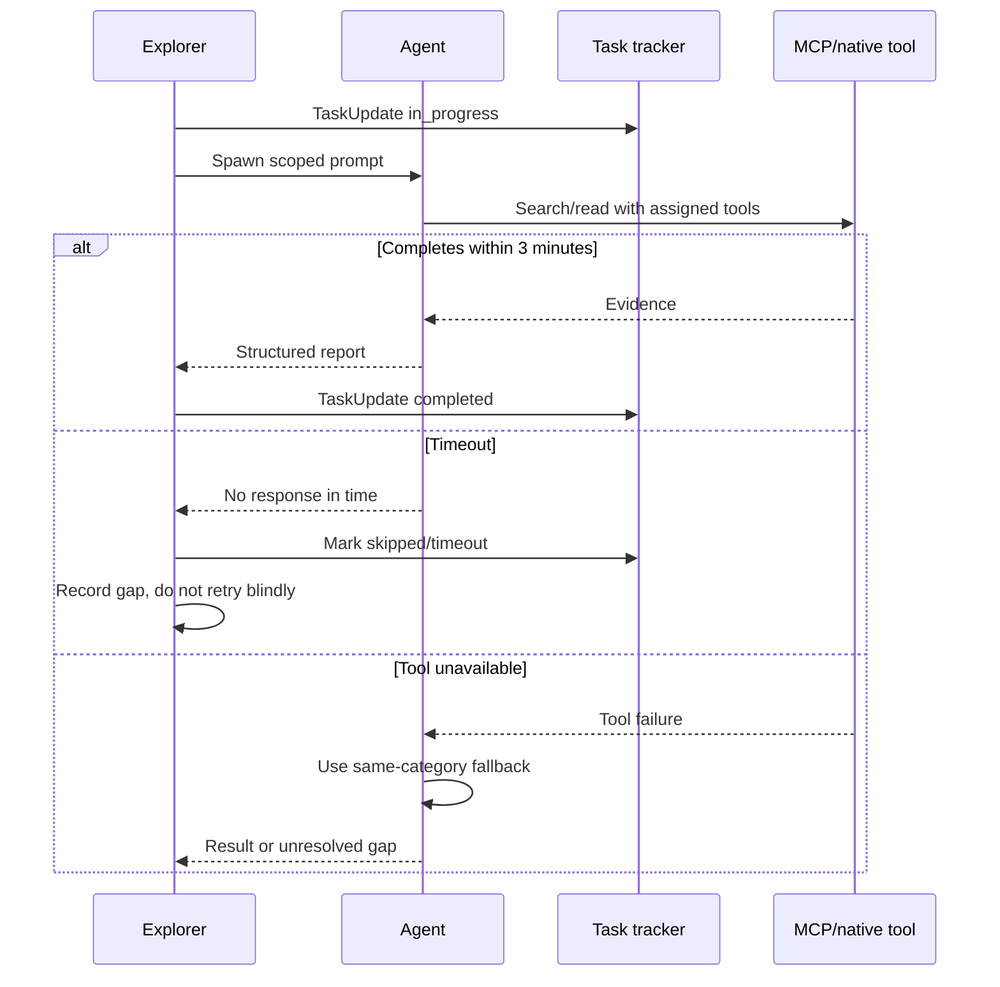

## 9. Internal mode: local codebase

### 9.1 Khi dùng

Dùng internal mode khi target nằm trong single repository hiện tại. Ví dụ:

- “tìm nơi xử lý login”;
- “file nào tạo payment event?”;
- “trace call path của error này”;
- “tìm tests cho component X”;
- “đâu là config của database client?”.

### 9.2 Tool priority flow

Internal explorer phải ưu tiên evidence theo thứ tự:

1. `mind_mcp`: project docs, concepts và foundational knowledge;
2. `graph_mcp`: semantic search và relationship graph;
3. `serena`: broad codebase search;
4. `grep`/`rg`: exact string sweep như fallback cuối.

Fast-fail rule: nếu tool thiếu hoặc unavailable, chuyển ngay tool kế tiếp, không retry vô hạn.

> Lưu ý: quick reference trong `SKILL.md` gọi Glob/Grep/Read/Bash cho internal mode, còn `internal-explore.md` đặt priority flow qua mind/graph/serena trước native tools. Khi vận hành theo repo policy, ưu tiên structured context trước; chỉ dùng native search khi các lớp trước không có kết quả hoặc unavailable.

### 9.3 Prompt internal agent

```text
Quickly explore {DIRECTORY} for: {TARGET}
Use Glob/Grep. List files with descriptions. Timeout 3m.
Report:
## Found Files
- path/file.ext - description
```

Prompt phải giới hạn directory/target để agent không quét toàn repo vô mục tiêu.

### 9.4 File chunking

Khi đọc file:

| Kích thước | Cách đọc |
|---:|---|
| <500 lines | Đọc toàn file |
| 500-1500 lines | Chia 2-3 chunks |
| >1500 lines | Chia thành các chunk khoảng 500 lines |

Chunking giúp giữ context và tránh agent đọc quá nhiều code không liên quan.

### 9.5 Output internal

```markdown
## Found Files
- src/auth/login.ts - login entry point and token creation
- src/auth/user-repository.ts - user lookup contract
- tests/auth/login.test.ts - login regression coverage

## Key Findings
- Login uses repository projection X.
- Token creation requires field Y.

## Unresolved
- Production-only failure cannot be reproduced locally.
```

## 10. External mode: web, GitHub và visual

### 10.1 Web docs/blog

Workflow chuẩn:

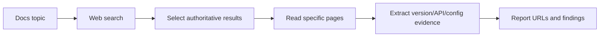

Dùng web search cho query ngắn hoặc tìm error; dùng web reader để đọc URL cụ thể. Khi docs search không có kết quả:

1. refine query;
2. thử search với recency filter nếu tool hỗ trợ;
3. đọc trang cụ thể nếu user cung cấp URL;
4. ghi rõ source gap nếu vẫn không tìm thấy.

Không nên dùng search snippet làm bằng chứng cuối nếu có thể đọc trang gốc.

### 10.2 GitHub repository

Workflow chuẩn:

1. xem repo structure;
2. search docs/code/issues/commits liên quan;
3. đọc file cụ thể;
4. report repo path và line/context nếu có.

Toolset:

```text
mcp__zread__get_repo_structure
mcp__zread__search_doc
mcp__zread__read_file
```

Nếu repo không tìm thấy:

- xác minh `owner/repo`;
- kiểm tra public/private access;
- ghi rõ repo lookup failed;
- không tự dựng nội dung file chưa đọc.

### 10.3 Image, screenshot và UI

Chọn tool theo mục tiêu:

| Target | Tool category | Output |
|---|---|---|
| Screenshot UI | UI/image analyzer | Layout, components, visual issues |
| Error screenshot | Error screenshot analyzer | Text, error context, likely causes |
| Architecture diagram | Technical diagram analyzer | Nodes, edges, flow, boundaries |
| Chart/dashboard | Data visualization analyzer | Trends, anomalies, metrics |
| OCR code/text | Text extraction | Extracted text/code |
| Image chung | General image analyzer | Visual description |

Image source phải phù hợp format tool. Với video hoặc file lớn, cần convert/limit theo tool constraints; không gửi secrets trong image/query.

### 10.4 Visual result không thay thế source evidence

Phân tích screenshot có thể chỉ ra symptom hoặc layout, nhưng không chứng minh root cause. Cần nối visual finding với:

- component source;
- CSS/layout owner;
- data state;
- browser/viewport;
- reproduction steps.

## 11. Hybrid mode

Hybrid mode dùng khi local và external evidence phụ thuộc lẫn nhau.

Ví dụ: local code dùng `Library v3`, cần biết behavior hiện tại của `Library v3` và so sánh upstream implementation.

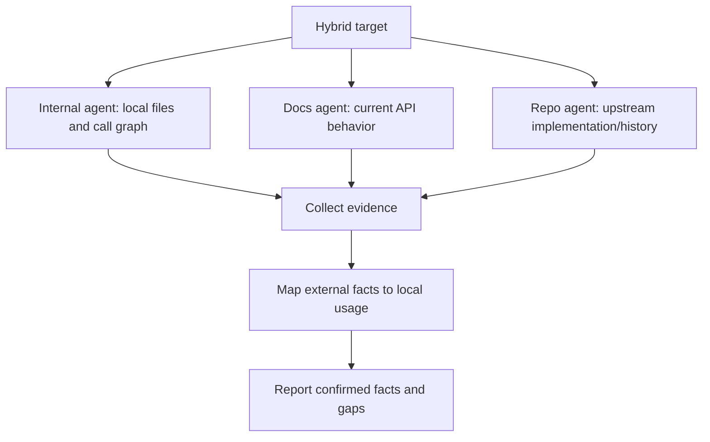

Quy tắc hybrid:

- mỗi agent có một toolset và scope;
- không coi external docs là bằng chứng local implementation nếu chưa map version/config;
- ghi version, source URL/repo và assumption;
- nếu local fork khác upstream, nêu divergence;
- collect phải deduplicate nhưng không gộp hai findings mâu thuẫn thành một fact.

## 12. Collect: tổng hợp kết quả

Collect là bước biến nhiều report thành một explorer report dùng được.

### 12.1 Deduplicate

Deduplicate:

- duplicate file paths;
- duplicate URLs;
- cùng một GitHub path;
- cùng một finding nhưng wording khác;
- agent lặp lại một dependency.

Không được deduplicate bằng cách bỏ mất provenance khi hai agent đưa evidence khác nhau. Có thể gộp mô tả nhưng phải giữ note nếu kết quả mâu thuẫn.

### 12.2 Merge descriptions

Mỗi resource nên có description ngắn trả lời:

- resource này là gì;
- liên quan đến target thế nào;
- agent tìm thấy nó bằng lens nào.

### 12.3 Note gaps và timeout

Report phải ghi:

- agent nào timeout;
- tool nào unavailable;
- source nào không accessible;
- query nào inconclusive;
- phần nào chưa được verify.

Không che gap bằng cách viết report như investigation đã hoàn tất.

### 12.4 Resolve conflicts

Nếu hai agent mâu thuẫn:

1. giữ cả hai claim tạm thời;
2. so sánh source và scope;
3. ưu tiên evidence trực tiếp, mới và đúng version;
4. mark claim là `CONFIRMED`, `REFUTED` hoặc `INCONCLUSIVE`;
5. đưa conflict vào `Unresolved Questions` nếu chưa giải quyết.

## 13. Explorer Report format

Output chuẩn:

```markdown
# explorer Report
## Relevant Files / Resources
- path/to/file.ts - description
- https://docs.example.com/page - description
- github.com/owner/repo/path - description
## Key Findings
- finding 1
- finding 2
## Unresolved Questions
- any gaps
```

### 13.1 Relevant Files / Resources

Danh sách phải là các resource thực sự liên quan. Không liệt kê hàng trăm file chỉ vì chúng nằm cùng directory.

Ví dụ:

```markdown
## Relevant Files / Resources
- src/auth/session.ts - owns session refresh and expiry handling
- tests/auth/session.test.ts - covers refresh success but not expired refresh token
- https://docs.example.com/oauth/refresh - external refresh-token contract
```

### 13.2 Key Findings

Finding nên là fact hoặc conclusion có evidence, không phải danh sách file lặp lại.

Tốt:

```markdown
- Session refresh is initiated from `refreshSession`, not the route handler.
- Existing tests cover valid refresh tokens but omit revoked-token behavior.
```

Không tốt:

```markdown
- There are many auth files.
- Maybe the route handles refresh.
```

### 13.3 Unresolved Questions

Dùng section này cho:

- production-only behavior;
- unavailable tool/source;
- version chưa xác định;
- conflicting agent findings;
- dependency chưa trace được;
- user decision cần hỏi.

## 14. Output và downstream handoff

### 14.1 Output của explorer

Explorer trả về:

- paths/files/resources liên quan;
- descriptions;
- key findings;
- unresolved questions;
- gaps/timeouts/tool degradation nếu có.

Nó không nên trả về:

- code fix chưa được yêu cầu;
- assumption viết như fact;
- toàn bộ file content không cần thiết;
- report không phân biệt local và external evidence.

### 14.2 Handoff cho hi-plan

`hi-plan` dùng explorer report để:

- xác định existing code cần reuse;
- chia phases;
- tạo related code list;
- phát hiện dependency và risk;
- so sánh architecture options;
- viết implementation steps có traceability.

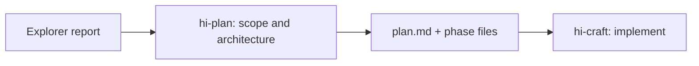

### 14.3 Handoff cho hi-fix

`hi-fix` dùng explorer để locate-only trước diagnosis:

- affected file;
- direct dependencies;
- caller/callee;
- test location;
- config/environment;
- recent history.

Explorer không kết luận root cause thay cho diagnosis, trừ khi evidence đủ rõ và vẫn cần được verify trong diagnosis step.

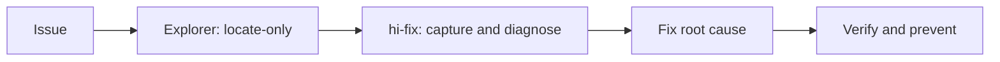

### 14.4 Handoff cho hi-craft

`hi-craft` có thể dùng explorer khi:

- tạo plan nhanh trước implementation;
- plan thiếu file/context;
- cần docs library/API;
- cần research cho full mode.

## 15. Verification của explorer

Explorer không verify behavior bằng test như `hi-fix`. Nó verify chất lượng của **evidence collection**.

### 15.1 Scope verify

- [ ] Target đã được phân loại local/external/hybrid.
- [ ] SCALE phù hợp với complexity.
- [ ] Mỗi agent có scope không overlap.
- [ ] Toolset khớp loại target.
- [ ] Directory hoặc repository boundary rõ.

### 15.2 Execution verify

- [ ] Task được register khi cần.
- [ ] Task chuyển `in_progress` trước khi spawn.
- [ ] Timeout 3 phút được áp dụng.
- [ ] Agent timeout được ghi nhận, không bị xem là success.
- [ ] Tool unavailable được fallback hoặc ghi gap.
- [ ] Internal agents là read-only.

### 15.3 Evidence verify

- [ ] Relevant files/resources có description.
- [ ] Key findings tách khỏi raw file list.
- [ ] Local và external source được phân biệt.
- [ ] Version/source URL/repo được ghi khi external.
- [ ] Findings mâu thuẫn được xử lý, không bị gộp mù.
- [ ] Unresolved Questions phản ánh gap thật.

### 15.4 Collection verify

- [ ] Duplicate paths/URLs đã được deduplicate.
- [ ] Không bỏ mất evidence quan trọng khi gộp report.
- [ ] Tất cả agent result hoặc timeout đều được accounting.
- [ ] Report đủ để downstream skill tiếp tục mà không phải search lại từ đầu.

## 16. Internal search decision tree

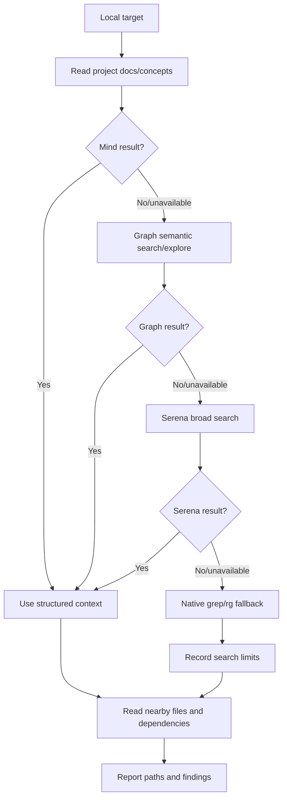

Tool priority là policy để tìm context có cấu trúc trước exact string search. Native search vẫn hữu ích khi cần xác minh symbol/string cụ thể hoặc các MCP layer không có kết quả.

## 17. External research decision tree

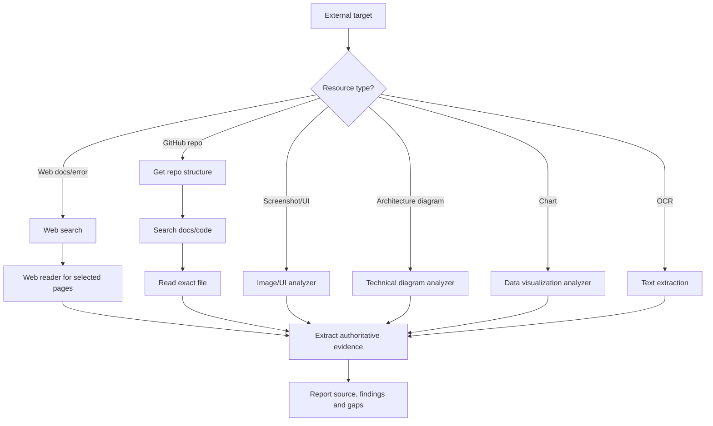

## 18. Failure modes

| Symptom | Hành động |
|---|---|
| Web search không có kết quả | Refine query, thử recency filter |
| Web reader timeout | Dùng URL ngắn hơn hoặc search snippet làm fallback có ghi chú |
| GitHub repo not found | Verify `owner/repo`, kiểm tra access |
| Image format unsupported | Convert sang PNG/JPG/WebP, kiểm tra size |
| MCP tool unavailable | Fallback cùng category, không retry vô hạn |
| 2+ agents cùng tool fail | Ghi `tool degraded` |
| Agent timeout | Skip, ghi gap, không giả định kết quả |
| Findings mâu thuẫn | Giữ provenance, mark unresolved hoặc verify thêm |
| Quá nhiều files | Siết directory/symbol scope, chia batch |
| Search ra quá ít | Mở rộng query có kiểm soát, không mở toàn repo ngay |

## 19. Giới hạn và nguyên tắc an toàn

### 19.1 Explorer không được tự sửa source

Các internal agents là read-only. Nếu user muốn fix, output explorer được bàn giao cho skill phù hợp như `hi-fix` hoặc `hi-craft`.

### 19.2 Không gửi secrets ra external tools

Trước khi gửi URL/query/image ra MCP:

- redact token, API key, password;
- loại bỏ user data không cần thiết;
- không upload screenshot chứa credential;
- giới hạn source vào phần cần research.

### 19.3 External source không luôn đúng với local version

Docs mới nhất có thể không khớp version đang cài. Report phải ghi:

- package/library version;
- version docs được đọc nếu có;
- local config;
- divergence hoặc assumption.

### 19.4 Parallel không tự động nhanh hơn

Parallel có overhead: chia scope, task tracking, spawn, collect và deduplicate. Với một file hoặc một docs page, một agent thường tốt hơn năm agent.

### 19.5 Timeout là thông tin

Timeout cho biết investigation chưa đầy đủ ở một nhánh. Nó không phải bằng chứng rằng target không tồn tại.

## 20. Ví dụ local end-to-end

Yêu cầu:

```text
Tìm toàn bộ flow xử lý refresh token và nơi cần sửa nếu token bị dùng lại.
```

Gọi:

```text
/hi-codebase-research-explorer refresh token flow and reuse handling
```

### 20.1 Analyze

Target là local, scope thuộc auth/session và tests. SCALE 3:

- agent A: session/auth implementation;
- agent B: tests và fixtures;
- agent C: config, middleware và call sites.

### 20.2 Divide và spawn

Mỗi agent có directory/target riêng, timeout 3 phút, không sửa source.

### 20.3 Collect

Kết quả có thể là:

```markdown
# explorer Report
## Relevant Files / Resources
- src/auth/refresh-token.ts - validates and rotates refresh tokens
- src/middleware/auth.ts - attaches session context
- tests/auth/refresh-token.test.ts - covers valid rotation but not replay
- config/auth.ts - token TTL and reuse policy

## Key Findings
- Rotation is owned by `refresh-token.ts`, not the middleware.
- Existing tests do not cover two requests using the same token concurrently.
- Reuse policy is configured but no storage-level uniqueness constraint was found.

## Unresolved Questions
- Is the token store shared across all production instances?
- Is replay expected to revoke the whole token family?
```

### 20.4 Handoff

`hi-fix` có thể dùng report này để diagnosis root cause; `hi-plan` có thể tạo phases cho storage constraint, rotation logic và concurrency tests.

## 21. Ví dụ external/hybrid end-to-end

Yêu cầu:

```text
Kiểm tra local client có retry API đúng theo current provider guidance không.
```

### 21.1 Chia agents

- Agent A: local API client, retry helper, tests.
- Agent B: provider docs về retry, idempotency và status codes.
- Agent C: upstream/provider GitHub examples nếu cần.

### 21.2 Collect đúng cách

Không kết luận “client sai” chỉ vì docs nói retry khác. Cần map:

- local package/provider version;
- local retry config;
- methods có idempotent không;
- status code thực tế;
- test và observed logs.

### 21.3 Report

```markdown
## Relevant Files / Resources
- src/http/retry-client.ts - local retry policy
- tests/http/retry-client.test.ts - retry assertions
- https://provider.example/docs/retries - provider guidance for current API
- github.com/provider/sdk/src/retry.ts - upstream reference implementation

## Key Findings
- Local client retries POST without an idempotency key.
- Provider guidance allows retry only for idempotent requests or keyed writes.
- Local dependency version differs from the upstream example version.

## Unresolved Questions
- Does every POST caller provide an idempotency key in production?
```

## 22. Output quality rubric

### Tốt

- scope rõ;
- source/path cụ thể;
- findings có evidence;
- duplicate được gộp;
- gap và timeout được nêu;
- downstream skill có thể bắt đầu bước tiếp theo.

### Yếu

- chỉ liệt kê file không mô tả;
- report lẫn local và external;
- biến guess thành fact;
- không ghi tool timeout;
- spawn agents overlap;
- không nói version/source;
- trả code fix dù user chỉ yêu cầu explore.

## 23. Quan hệ với các skill khác

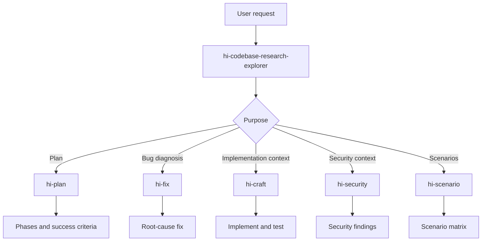

| Skill | Explorer cung cấp gì |
|---|---|
| `hi-plan` | Existing code, architecture context, alternatives, dependencies |
| `hi-fix` | Affected files, direct dependencies, call sites, tests, recent history |
| `hi-craft` | Context để tạo hoặc thực thi plan |
| `hi-security` | Code locations và data flows để audit |
| `hi-scenario` | Behavior surface, edge cases và integration points |
| `hi-repository-search` | Có thể là structured backend cho deeper graph/code search |

## 24. Tóm tắt nhanh

```mermaid
flowchart LR
    A[Target] --> B[Analyze scope]
    B --> C[Choose internal/external/hybrid]
    C --> D[Divide non-overlapping work]
    D --> E[Register tasks when useful]
    E --> F[Spawn with 3-min timeout]
    F --> G[Collect reports]
    G --> H[Deduplicate and merge]
    H --> I[Record unresolved gaps]
    I --> J[Explorer Report]
    J --> K[Plan, diagnose or implement downstream]
```

Câu ngắn nhất để nhớ:

> `hi-codebase-research-explorer` không cố trả lời mọi thứ bằng một lần search; nó tổ chức việc tìm evidence đúng nguồn, đúng scope, đúng tool và bàn giao kết quả có thể kiểm chứng cho bước tiếp theo.
