# Hi Craft Skill: Hướng dẫn đầy đủ

> `hi-craft` là skill thực thi thay đổi phần mềm end-to-end. Nó nhận một yêu cầu hoặc một plan đã có, triển khai code, chạy test, xử lý lỗi và hoàn tất bàn giao. Đây không phải chỉ là lệnh “viết code”.

## 1. Hi Craft giải quyết vấn đề gì?

Một thay đổi phần mềm hoàn chỉnh không kết thúc ở việc tạo ra source code. Cần đồng thời đảm bảo:

- yêu cầu đã được hiểu và có scope rõ;
- implementation bám theo plan hoặc pattern hiện tại;
- task được theo dõi đúng trạng thái;
- test được chạy và kết quả được kiểm tra;
- lỗi test được sửa theo chu kỳ có giới hạn;
- thay đổi được review khi rủi ro yêu cầu;
- artifact và lịch sử thay đổi được hoàn tất.

`hi-craft` đóng vai trò orchestration layer cho chuỗi này:

```text
[Plan] -> [Implement] -> [Test] -> [Finalize]
```

Nó kết nối với các skill khác khi cần:

- `hi-plan`: tạo plan nếu request chưa có plan;
- `hi-sequential-thinking`: phân tích task ngắn trước khi lập plan;
- `hi-docs-seeker`: tra documentation khi cần;
- `hi-fix`: debug chuyên sâu sau nhiều lần test thất bại;
- `hi-log`: ghi nhật ký cuối workflow.

## 2. Mental model tổng quát

`hi-craft` có ba trách nhiệm lớn:

1. **Readiness**: đảm bảo có plan hoặc tạo plan trước khi code.
2. **Execution**: thực hiện các phase/tasks, cập nhật trạng thái và giữ thay đổi trong scope.
3. **Evidence**: chạy test, review nếu cần, rồi tạo dấu vết bàn giao.

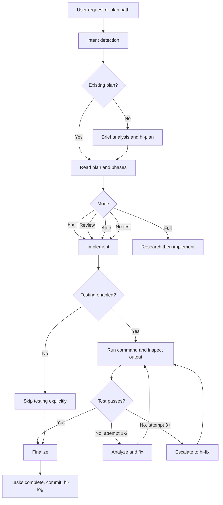

### 2.1 Sequence chi tiết đến mức skill và execution boundary

Diagram dưới đây mở rộng toàn bộ orchestration của `hi-craft`. Riêng bước Plan được giữ như một black box: `hi-craft` chỉ gọi `hi-plan --fast` và nhận lại plan path/phases, không mở rộng workflow nội bộ của `hi-plan`.

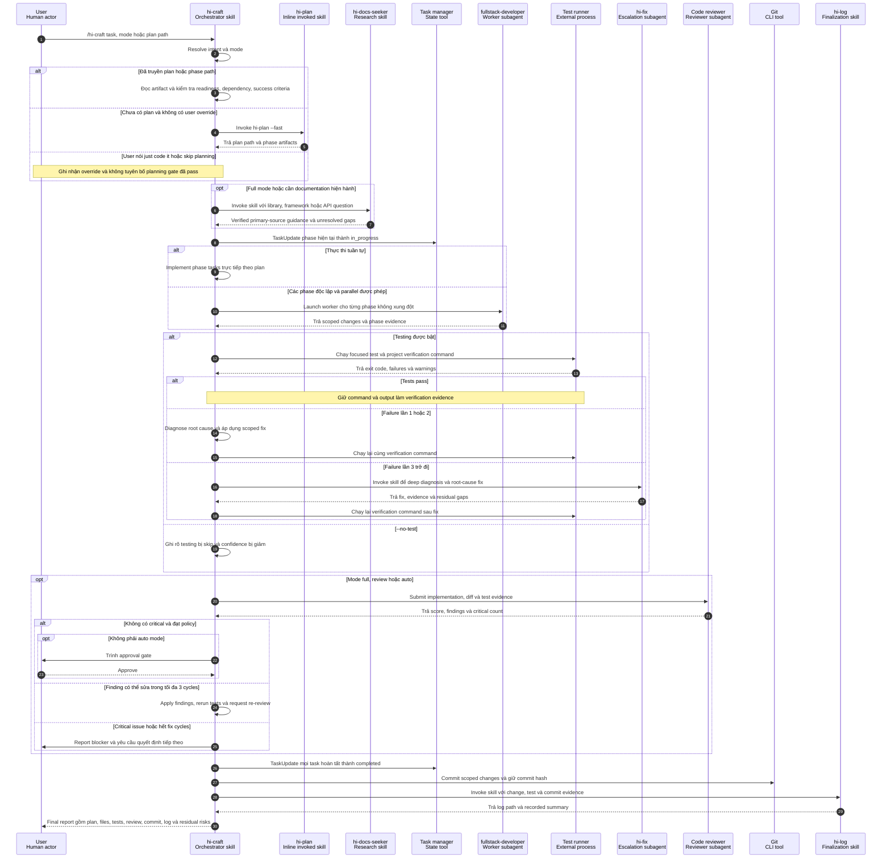

#### 2.1.1 Actor types

Trong sequence diagram, dòng đầu là actor identity và dòng thứ hai là actor type/title. `Skill` mô tả behavior được nạp vào agent; `SubAgent` là một agent runtime riêng được spawn hoặc launch để thực hiện một scope độc lập.

| Actor | Type / title | Runtime behavior | SubAgent? |
|---|---|---|---:|
| User | Human actor | Gửi yêu cầu, approval và quyết định blocking | Không |
| `hi-craft` | **Orchestrator skill** | Chạy trong current/root agent, giữ workflow state và điều phối các bước | Không |
| `hi-plan` | Inline invoked skill | Được `hi-craft` gọi inline để tạo plan; contract cấm spawn planner riêng | Không |
| `hi-docs-seeker` | Research skill | Được current agent invoke khi cần documentation hiện hành | Không |
| Task manager | State-management tool | Giữ task state theo session qua `TaskUpdate` | Không |
| `fullstack-developer` | Worker subagent | Được launch theo phase khi parallel execution an toàn | **Có** |
| Test runner | External process | Chạy test, lint, typecheck hoặc build command và trả exit/output | Không |
| `hi-fix` | Escalation subagent | Sau failure lần 3, craft spawn agent chạy skill `hi-fix` để deep diagnosis | **Có** |
| Code reviewer | Reviewer subagent | Review độc lập, trả score, findings và critical count | **Có** |
| Git | CLI tool | Tạo commit và trả commit identity | Không |
| `hi-log` | Finalization skill | Ghi change/test/commit evidence vào log | Không |

Một actor mang tên skill không đồng nghĩa với SubAgent. Chỉ các bước dùng semantics `spawn` hoặc `launch` mới tạo agent runtime riêng; các lời gọi `invoke`, `use` hoặc `call inline` chạy như capability của current agent, trừ khi orchestration contract nói khác.

Các ranh giới cần hiểu đúng:

- `hi-plan` là một lời gọi skill duy nhất trong sequence này. Chi tiết scope challenge, research, red-team hoặc validation của plan không được lặp lại ở đây.
- `hi-docs-seeker` chỉ chạy khi cần documentation hiện hành hoặc research của full mode, không phải mọi lần gọi craft.
- Test failure lần 1-2 do `hi-craft` tự diagnose và sửa. Từ lần 3 mới chuyển sang `hi-fix`, sau đó vẫn phải chạy lại verification command.
- Code reviewer là reviewer agent của review gate, không phải một skill được đặt tên riêng trong contract hiện tại.
- Parallel execution chỉ hợp lệ khi phase dependency, file ownership và shared contract không xung đột.

Nguồn đối chiếu: [`hi-craft/SKILL.md`](../../hi-craft/SKILL.md).

#### 2.1.2 Context retrieval trước implementation

Core contract của `hi-craft` không tự khai báo `mind_mcp`, `graph_mcp` hoặc Serena. Tuy nhiên, trong repository này, [`AGENTS.md`](../../AGENTS.md) yêu cầu mọi task thu thập project context theo đúng thứ tự ưu tiên trước khi thực thi. Vì vậy `hi-craft` cần chạy retrieval chain sau khi đã có plan/readiness context và trước khi sửa code. Chain dừng ngay khi một tầng đã cung cấp đủ evidence.

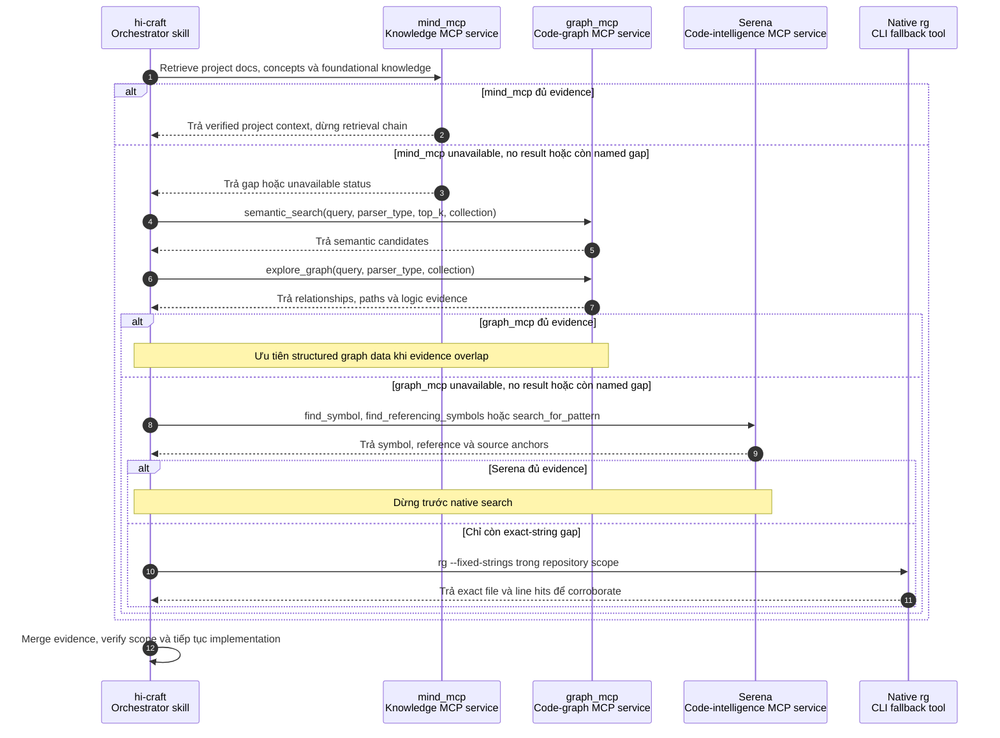

Quy tắc áp dụng:

- Đây là **project-level requirement** từ `AGENTS.md`, không phải behavior portable của mọi bản cài đặt `hi-craft`.
- `mind_mcp` dùng cho project knowledge và docs; `graph_mcp` dùng cho semantic code relationships và logic; Serena dùng để xác nhận symbol/reference/source; `rg` chỉ là fallback exact-string cuối cùng.
- `semantic_search` chỉ tạo candidate. Claim về call path hoặc dependency cần `explore_graph` hoặc direct-source corroboration.
- Không gọi cả bốn tầng theo thói quen. Chỉ đi xuống tầng tiếp theo khi tầng hiện tại unavailable, không có kết quả hoặc còn một evidence gap được đặt tên.
- User override planning gate không tự động bỏ qua context retrieval và evidence verification.

Nguồn đối chiếu: [`AGENTS.md`](../../AGENTS.md) và [`hi-craft/SKILL.md`](../../hi-craft/SKILL.md).

## 3. Hard gate: plan trước code

Quy tắc quan trọng nhất của skill:

> Không được viết code khi chưa có plan tồn tại và chưa được review.

Hard gate này bảo vệ workflow khỏi việc nhảy thẳng vào implementation khi chưa biết:

- mục tiêu thực sự;
- file hoặc module cần sửa;
- dependency giữa các phần;
- success criteria;
- cách test;
- rủi ro và trade-off.

Có một ngoại lệ được ghi rõ: nếu user chủ động yêu cầu “just code it” hoặc “skip planning”, user override hard gate. Tuy nhiên, khi override được dùng, người thực thi nên ghi nhận đây là thay đổi có rủi ro và không tự tuyên bố rằng workflow đã qua planning review.

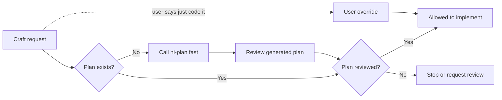

## 4. Cú pháp và intent detection

### 4.1 Các dạng gọi

```text
/hi-craft <task>
/hi-craft <task> --full
/hi-craft <task> --review
/hi-craft <task> --auto
/hi-craft <task> --no-test
/hi-craft path/to/plan.md
/hi-craft path/to/phase-01-name.md
```

### 4.2 Cách nhận diện intent

| Input | Mode | Hành vi |
|---|---|---|
| Không có cờ | `fast` | Bỏ qua research/review, vẫn chạy test |
| `--full` hoặc từ “full” | `full` | Research và review là bắt buộc |
| `--review` | `review` | Bỏ qua research, review là bắt buộc |
| `--auto`, “trust me”, “yolo” | `auto` | Auto-approve review |
| `--no-test` | `no-test` | Bỏ qua testing |
| Path tới `plan.md` hoặc `phase-*.md` | `code` | Thực thi plan đã tồn tại |

Một request có thể vừa chỉ ra task vừa có cờ. Skill phải resolve intent trước khi thực hiện code để biết cần tạo plan, đọc plan hay trực tiếp chạy một phase.

## 5. Mode matrix

| Mode | Research | Review | Testing | Khi nên dùng |
|---|---:|---:|---:|---|
| `fast` | Skip | Skip | Run | Thay đổi rõ, nhỏ hoặc cần tốc độ |
| `full` | Yes | MUST | Run | Feature lớn hoặc cần quy trình đầy đủ |
| `review` | Skip | MUST | Run | Đã có context, nhưng cần code review gate |
| `auto` | Skip | Auto-pass | Run | User chấp nhận auto-approve trong scope phù hợp |
| `no-test` | Theo mode | Theo mode | Skip | Chỉ khi test không khả dụng hoặc user yêu cầu |

### 5.1 Fast mode

Fast là default. Skill:

1. kiểm tra plan;
2. nếu chưa có plan thì gọi `hi-plan --fast` inline;
3. triển khai trực tiếp;
4. chạy test command;
5. finalize.

Fast không có research riêng và không gọi code reviewer. Điều này giúp giảm thời gian, nhưng không nên dùng cho thay đổi có security, architecture hoặc production risk cao nếu chưa có review ngoài.

### 5.2 Full mode

Full thêm research và bắt buộc review. Flow tổng quát:

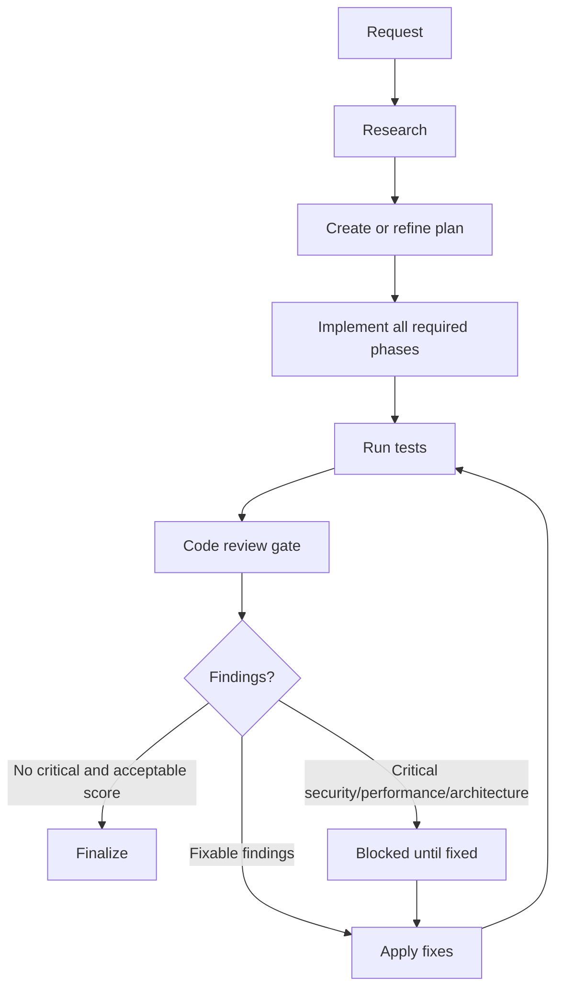

Full phù hợp khi thay đổi chạm nhiều module, API contract, data model, authentication, payment, migration hoặc workflow người dùng quan trọng.

### 5.3 Review mode

`--review` bỏ qua research nhưng review ở cuối là bắt buộc. Dùng khi:

- plan và context đã có sẵn;
- implementation tương đối rõ;
- cần một reviewer độc lập kiểm tra code;
- muốn giữ tốc độ research thấp nhưng không bỏ quality gate.

Review mode không có nghĩa là “review plan”. Đây là code review sau implementation.

### 5.4 Auto mode

`--auto` hoặc các cụm như “trust me”, “yolo” cho phép auto-approve review. Mode này vẫn chạy test, nhưng giảm bước người dùng xác nhận review findings.

Auto mode chỉ phù hợp khi:

- scope nhỏ;
- người yêu cầu hiểu rõ thay đổi;
- không có critical security, performance hoặc architecture risk;
- kết quả test đủ mạnh cho thay đổi đó.

Auto-approve không biến một finding critical thành finding an toàn. Quy tắc của skill vẫn ghi rõ critical issues luôn block khi review phát hiện lỗi thuộc Security, Performance hoặc Architecture.

### 5.5 No-test mode

`--no-test` bỏ qua toàn bộ bước testing. Đây là mode có rủi ro cao và phải được sử dụng có chủ đích.

Các lý do có thể chấp nhận:

- chỉ sửa documentation;
- repository không có test command khả dụng;
- user cần tạo scaffold trước;
- test phụ thuộc external service chưa sẵn sàng.

Khi dùng `--no-test`, output nên ghi rõ testing đã bị skip. Không được báo cáo “tests passed” nếu test chưa chạy.

### 5.6 Code mode: truyền path tới plan

Khi truyền path tới `plan.md` hoặc `phase-*.md`, skill hiểu rằng user muốn thực thi artifact đã tồn tại thay vì tạo plan mới.

```text
/hi-craft plans/260814-audit-log/plan.md
```

Trong code mode:

- đọc plan và các phase liên quan;
- xác định task/phases cần thực hiện;
- giữ implementation bám theo success criteria;
- không tự ý mở rộng scope nếu chưa cập nhật plan;
- chạy test theo mode hiện tại.

Truyền `phase-*.md` hữu ích khi muốn làm một phase cụ thể, nhưng phải kiểm tra `blockedBy` trước khi bắt đầu.

## 6. Workflow từng bước

### 6.1 Bước 1: Plan

#### 6.1.1 Khi chưa có plan

Skill dùng `hi-sequential-thinking` để phân tích task ngắn, sau đó gọi `hi-plan --fast` inline nếu cần. Không spawn một planner riêng cho bước này.

Nếu cần documentation của library, framework, SDK hoặc API, dùng `hi-docs-seeker` trước khi quyết định implementation.

Kết quả mong đợi:

- một plan directory;
- `plan.md`;
- các `phase-*.md` nếu scope cần nhiều phase;
- success criteria và test approach;
- dependency/risks ở mức đủ để bắt đầu.

#### 6.1.2 Khi đã có plan

Skill đọc plan trước khi chạm code. Cần xác định:

- plan status còn active không;
- phase nào đang được thực hiện;
- files/modules liên quan;
- phase có dependency chưa hoàn tất không;
- tasks hiện có tương ứng phase không;
- review/validation decision nào đã được ghi;
- test command hoặc success criteria là gì.

#### 6.1.3 Readiness checklist

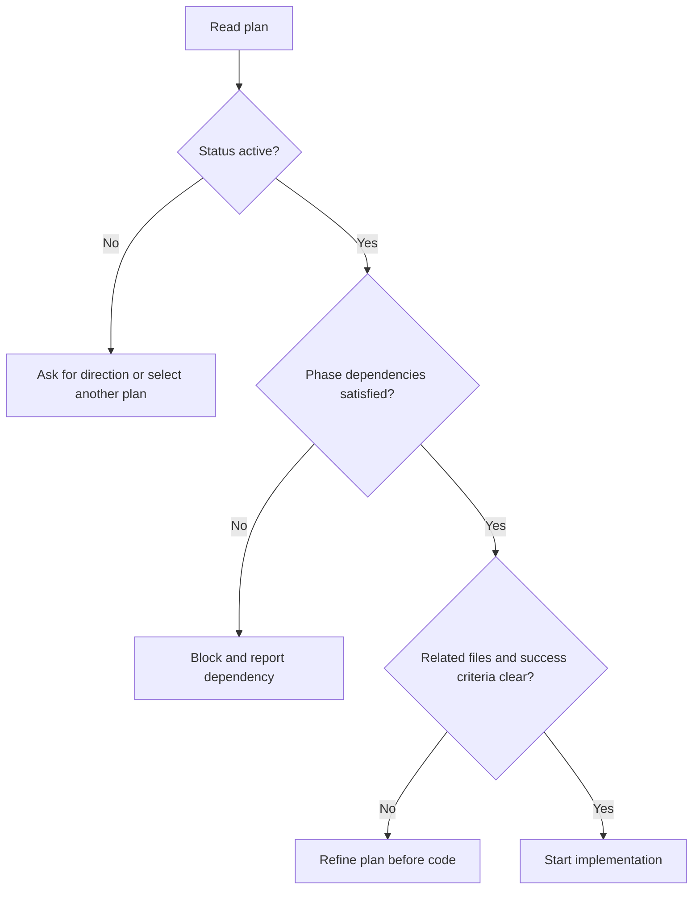

### 6.2 Bước 2: Implement

#### 6.2.1 Thực thi tasks

Skill thực hiện các implementation steps trong phase và cập nhật task state:

- task đang làm: `in_progress`;
- task hoàn tất: `completed`;
- task bị chặn: giữ trạng thái phù hợp và ghi blocker;
- task không còn cần: cập nhật plan thay vì âm thầm bỏ qua.

Nếu có nhiều phase và môi trường hỗ trợ parallel mode, có thể launch `fullstack-developer` cho từng phase. Nhưng parallel chỉ an toàn khi các phase không xung đột file/data contract hoặc dependency đã được chứng minh.

#### 6.2.2 Nguyên tắc triển khai

Implementation cần:

- bám success criteria;
- ưu tiên pattern đã tồn tại trong repository;
- giữ public API ổn định nếu plan không yêu cầu breaking change;
- không sửa unrelated bugs;
- không thêm abstraction nếu không loại bỏ complexity thực sự;
- cập nhật docs khi contract hoặc usage thay đổi;
- ghi lại thay đổi scope nếu phát hiện requirement mới.

#### 6.2.3 Khi plan không đủ

Không nên đoán khi plan thiếu thông tin quan trọng. Có ba hướng hợp lệ:

1. đọc thêm code/call site gần nhất để resolve ambiguity;
2. cập nhật plan/phase với decision mới nếu có đủ bằng chứng;
3. hỏi user khi đó là product decision, security decision hoặc trade-off không thể suy ra từ code.

Một implementation tốt không chỉ “làm cho chạy”, mà phải giữ tính truy nguyên từ request → plan → code → test.

#### 6.2.4 Các điểm cần quan sát khi code

- input validation và error handling;
- authorization và data exposure;
- transaction boundary;
- timeout, retry và idempotency;
- backward compatibility;
- migration/rollback;
- concurrency và race condition;
- performance ở scale dự kiến;
- logging, metrics và correlation ID;
- test cho happy path và failure path.

### 6.3 Bước 3: Test

#### 6.3.1 Test mặc định

Trừ `--no-test`, skill phải chạy test command và kiểm tra output. Test không chỉ là “gọi command”; cần xem exit code, failures, warnings có ý nghĩa và coverage của behavior đã đổi.

Các lớp verify có thể gồm:

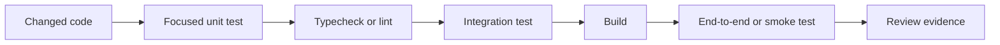

Không phải repository nào cũng có tất cả lớp trên. Skill cần dùng command có sẵn trong project và nói rõ lớp nào đã chạy, lớp nào không có hoặc bị skip.

#### 6.3.2 Chu kỳ xử lý test failure

Quy tắc xử lý được định nghĩa như sau:

- **Lần 1-2**: tự phân tích và sửa lỗi;
- **Lần 3 trở đi**: spawn `hi-fix` để debug chuyên sâu;
- không spawn tester riêng;
- sau mỗi fix phải chạy lại command kiểm chứng.

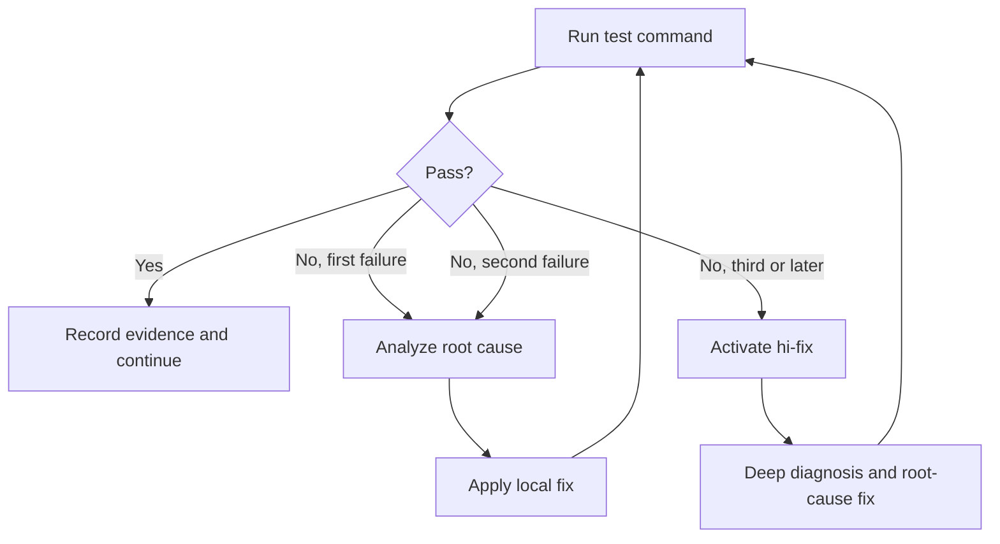

#### 6.3.3 Phân biệt lỗi test

Khi test fail, cần phân loại trước khi sửa:

| Loại lỗi | Cách xử lý |
|---|---|
| Regression do code mới | Sửa implementation hoặc test theo behavior đúng |
| Test sai expectation | Xác minh contract, rồi cập nhật test nếu cần |
| Existing failure không liên quan | Không sửa lan sang scope khác; ghi nhận rõ |
| Environment/dependency failure | Sửa setup nếu thuộc task, nếu không ghi blocker |
| Flaky/race failure | Reproduce, tìm timing/resource cause, không chỉ retry mù |
| Build/type/lint error | Sửa ngay nếu phát sinh từ thay đổi |

#### 6.3.4 Success criteria

Test pass chưa chắc đã đủ. Cần đối chiếu với success criteria của phase:

- behavior chính đúng;
- edge cases quan trọng có coverage;
- error behavior đúng;
- API/schema backward compatibility được xác nhận;
- migration có rollback/roll-forward strategy;
- security controls được verify;
- docs hoặc configuration đã cập nhật.

### 6.4 Bước 4: Review

Review là optional trong fast mode, nhưng bắt buộc trong `full` và `review` mode. `auto` có thể auto-approve theo mode policy.

Reviewer kiểm tra tối thiểu:

- correctness và behavioral regression;
- security;
- performance;
- architecture và maintainability;
- test adequacy;
- scope creep;
- error handling và observability.

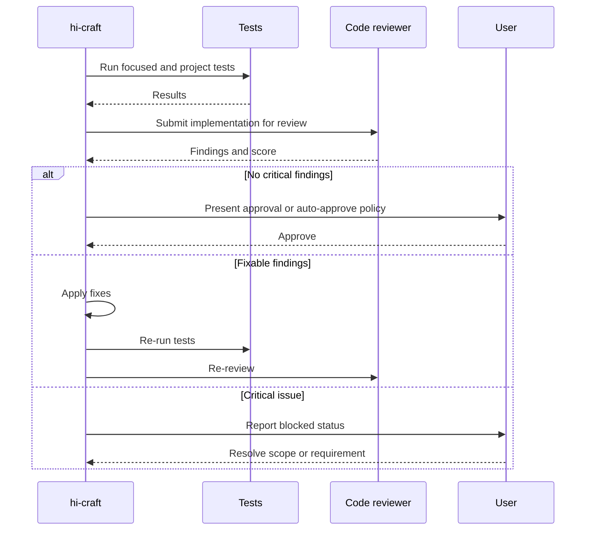

#### 6.4.1 Review score và fix cycles

Rule hiện tại:

- score từ `9.5` trở lên và không có critical issue mới được auto-approve trong auto mode;
- tối đa 3 fix cycles;
- critical issues luôn block, đặc biệt Security, Performance và Architecture violations.

Nếu sau 3 cycles vẫn chưa đạt, không nên tiếp tục patch mù. Cần dừng, tổng hợp finding và quay lại diagnosis/plan.

### 6.5 Bước 5: Finalize

Finalization gồm ba việc chính:

1. đánh dấu tất cả tasks đã hoàn tất;
2. `git commit` thay đổi;
3. chạy `/hi-log` để ghi nhật ký.

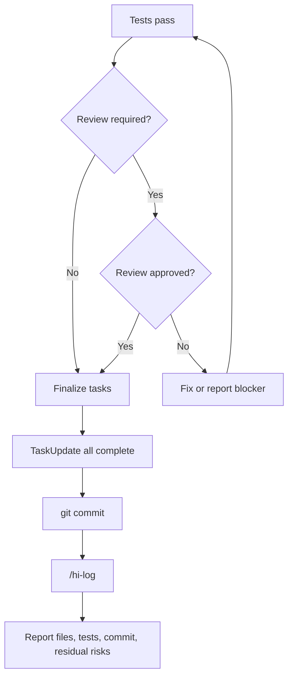

#### 6.5.1 Commit

Commit là một phần của flow finalize theo `SKILL.md`, nhưng vẫn cần tuân thủ quyền và quy ước của project. Commit message nên phản ánh thay đổi thực tế, không ghi chung chung.

Trước commit nên kiểm tra:

- chỉ có file liên quan;
- không có secret hoặc generated artifact ngoài ý muốn;
- test output đã pass;
- plan/phase status đã cập nhật;
- diff không chứa thay đổi unrelated.

#### 6.5.2 Log

`/hi-log` tạo nhật ký cho session/thay đổi. Log nên giúp người khác biết:

- task nào đã làm;
- files hoặc modules nào thay đổi;
- test command và kết quả;
- quyết định đáng chú ý;
- known limitation hoặc follow-up;
- commit/reference liên quan.

## 7. Handoff từ hi-plan sang hi-craft

`hi-plan` tạo persistent artifacts; `hi-craft` dùng artifacts đó để execute.

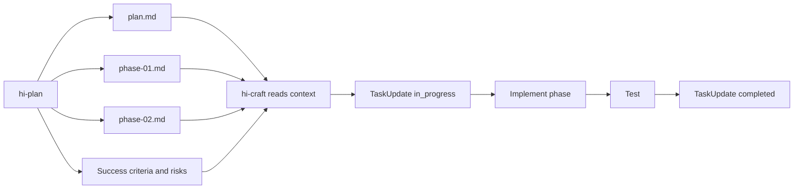

### 7.1 Handoff checklist

Trước khi gọi `hi-craft path/to/plan.md`, kiểm tra:

- plan có status active/pending;
- phases link đúng;
- phase dependencies đã hoàn tất hoặc được xử lý;
- related code paths có tồn tại;
- implementation steps đủ cụ thể;
- success criteria đo được;
- test command hoặc verification method rõ;
- accepted red-team findings và validation decisions đã propagate.

### 7.2 Handoff cùng session và khác session

- **Cùng session**: task list có thể còn tồn tại, `hi-craft` tiếp tục từ task state hiện tại.
- **Khác session**: task list có thể trống, cần đọc plan/phase và re-hydrate từ checklist hoặc task metadata.

Plan file là source of truth persistent; task manager chỉ là execution view tạm thời.

## 8. Verify hi-craft như thế nào?

### 8.1 Readiness verify

Trước code:

- có plan chưa;
- plan có review chưa;
- scope có rõ chưa;
- phase dependency có blocker không;
- success criteria và test strategy có tồn tại không.

### 8.2 Implementation verify

Trong code:

- từng task có chuyển `in_progress` trước khi làm không;
- thay đổi có nằm trong related code của phase không;
- không có silent scope expansion không;
- public contract và backward compatibility có được giữ không;
- errors, security và observability có được xử lý không.

### 8.3 Test verify

Sau code:

- command có chạy thật không;
- exit code có thành công không;
- output có failure/warning đáng kể không;
- focused tests có bao phủ behavior mới không;
- typecheck/lint/build có pass không;
- failure đã được root-cause fix chưa, hay chỉ retry.

### 8.4 Review verify

Nếu mode yêu cầu review:

- reviewer đã chạy chưa;
- score có đạt policy không;
- critical findings bằng 0 chưa;
- fix cycles có dưới giới hạn không;
- finding đã được xử lý hoặc ghi nhận chưa.

### 8.5 Finalize verify

Trước khi báo hoàn tất:

- tasks đã completed;
- commit đã tạo thành công;
- log đã ghi;
- output report có test evidence;
- residual risks và skipped checks đã được nêu;
- working tree không có thay đổi ngoài ý muốn.

## 9. Output của hi-craft

Một output tốt nên nói rõ:

- mode đã chạy;
- plan được dùng hoặc được tạo ở đâu;
- phase/tasks nào đã hoàn thành;
- files/modules chính đã thay đổi;
- test commands đã chạy và kết quả;
- review có chạy không, score/findings chính;
- commit hash hoặc trạng thái commit;
- log path nếu có;
- skipped checks, blockers hoặc residual risks.

Ví dụ cấu trúc report:

```text
Mode: full
Plan: plans/260814-audit-log/plan.md
Completed phases: 1, 2, 3
Changed: auth service, audit event schema, integration tests
Tests: npm test - passed
Review: approved, no critical findings
Commit: abc1234
Log: docs/logs/...
Residual risks: external event delivery still requires staging verification
```

Không nên báo cáo:

- “đã xong” khi test bị skip nhưng không nói rõ;
- “review passed” khi review chưa chạy;
- “all tasks completed” khi còn task blocked;
- “production ready” khi chỉ mới chạy unit test.

## 10. Failure handling và escalation

### 10.1 Plan failure

Nếu không có plan hoặc plan không đủ rõ:

- gọi `hi-plan --fast` khi có thể;
- bổ sung phase/success criteria;
- hỏi user nếu thiếu product/security decision;
- không bắt đầu code bằng assumption không có bằng chứng.

### 10.2 Test failure

Theo policy:

```text
Failure 1 -> self diagnosis and fix
Failure 2 -> self diagnosis and fix
Failure 3+ -> hi-fix
```

`hi-fix` được dùng khi lỗi cần root-cause analysis, call-stack tracing, log analysis, multi-layer validation hoặc environment diagnosis.

### 10.3 Review failure

Review failure không đồng nghĩa với sửa mọi finding bất kể scope. Cần:

1. phân loại critical/high/medium;
2. sửa critical trước;
3. xác định finding có thuộc task không;
4. cập nhật plan nếu phát hiện requirement/architecture mới;
5. chạy lại test sau fix;
6. review lại trong giới hạn 3 cycles.

### 10.4 Không thể test

Nếu test command không chạy được vì environment:

- phân biệt lỗi code với lỗi setup;
- thử verification thay thế phù hợp, như typecheck hoặc focused command;
- ghi rõ command thất bại và lý do;
- không hạ mức confidence một cách im lặng;
- không tuyên bố test pass.

## 11. Khi nào dùng mode nào?

| Tình huống | Khuyến nghị |
|---|---|
| Sửa nhỏ, pattern rõ, test nhanh | Mặc định / `fast` |
| Feature nhiều module hoặc có research | `--full` |
| Đã có plan/context, cần code review bắt buộc | `--review` |
| User chấp nhận auto-approve trong thay đổi nhỏ | `--auto` |
| Chỉ tạo scaffold/docs hoặc test chưa khả dụng | `--no-test` |
| Có plan cụ thể cần triển khai | Truyền path `plan.md` |
| Nhiều phase độc lập và tool hỗ trợ parallel | Parallel execution trong phase, sau khi kiểm tra dependency |

## 12. `--parallel` trong interface và thực tế

`hi-craft/SKILL.md` định nghĩa rõ các mode `fast`, `full`, `review`, `auto` và `no-test`. Tuy nhiên, `hi-craft/agents/openai.yaml` có mô tả default prompt hỗ trợ `--parallel`.

Cách hiểu an toàn:

- `--parallel` được khai báo ở interface prompt;
- workflow chính trong `SKILL.md` chưa có mode matrix riêng cho parallel;
- parallel execution được mô tả trong Step 2 dưới dạng launch `fullstack-developer` per phase;
- chỉ nên dùng parallel khi phase dependency, file ownership và shared contract đã rõ;
- nếu cần behavior chính thức, nên cập nhật `SKILL.md` để định nghĩa mode, matrix, conflict handling và finalize policy đồng bộ với interface.

Đây là một điểm documentation drift cần được biết trước khi vận hành. Không nên suy ra rằng interface prompt tự động định nghĩa đầy đủ semantics của một mode.

## 13. Ví dụ end-to-end

Giả sử yêu cầu là: “Thêm rate limiting cho API login”.

### 13.1 Gọi skill

```text
/hi-craft add rate limiting for the login API --full
```

### 13.2 Plan gate

Skill kiểm tra plan. Nếu chưa có:

```text
/hi-plan add rate limiting for the login API --fast
```

Plan nên xác định:

- middleware hoặc gateway nào sở hữu rate limit;
- key theo IP, account hoặc device;
- response/status code khi bị giới hạn;
- distributed counter và consistency;
- bypass policy cho internal traffic;
- test cho burst, reset window và concurrency.

### 13.3 Implementation

Developer thực hiện các phase đã ghi, ví dụ:

1. configuration và default limits;
2. limiter middleware;
3. storage/counter integration;
4. metrics và error response;
5. unit/integration tests.

### 13.4 Test

Chạy focused tests trước, sau đó project test suite. Nếu test fail lần một hoặc hai, tự phân tích và sửa. Nếu fail từ lần ba, chuyển sang `hi-fix`.

### 13.5 Review

Full mode bắt buộc review các câu hỏi:

- có bypass bằng header giả không;
- account enumeration có bị làm lộ không;
- distributed nodes có dùng counter nhất quán không;
- retry có làm khuếch đại traffic không;
- default limit có làm hỏng client hợp lệ không;
- metrics có chứa credential hoặc PII không.

### 13.6 Finalize

Chỉ finalize sau khi:

- tests pass;
- review không còn critical finding;
- task states đã completed;
- commit và log đã tạo;
- residual risk như tuning limit production đã được ghi.

## 14. Quan hệ với các skill khác

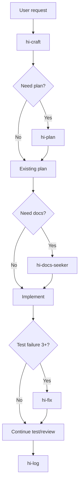

| Skill | Vai trò trong relation với hi-craft |
|---|---|
| `hi-plan` | Tạo implementation plan và phases |
| `hi-sequential-thinking` | Phân tích task ngắn trước khi plan |
| `hi-docs-seeker` | Tìm docs hiện hành cho library/API |
| `hi-fix` | Debug chuyên sâu sau nhiều test failures |
| `hi-log` | Ghi log sau finalize |
| `hi-predict` | Có thể dùng trước thay đổi lớn để dự báo rủi ro |
| `hi-scenario` | Có thể dùng để mở rộng edge-case/test scenarios |
| `hi-security` | Có thể dùng cho security audit chuyên sâu |

## 15. Các giới hạn cần hiểu đúng

### 15.1 Hi-craft không thay thế judgment của developer

Skill điều phối workflow, nhưng không thể tự biết product decision hoặc acceptable risk nếu repository không thể hiện điều đó. Những điểm blocking phải được hỏi hoặc ghi rõ.

### 15.2 Test pass không chứng minh production readiness

Test có thể bỏ sót:

- load/performance behavior;
- external service failures;
- deployment/configuration drift;
- migration rollback;
- permission combinations chưa có fixture;
- real user workflow.

### 15.3 Auto mode không loại bỏ critical risk

Auto-approve chỉ là policy về approval flow. Nó không nên được dùng để bỏ qua security, performance hoặc architecture violation.

### 15.4 Commit không đồng nghĩa với hoàn tất nghiệp vụ

Commit chỉ xác nhận thay đổi đã được ghi vào Git. Cần vẫn nêu residual risk, deployment step, migration step hoặc staging verification chưa chạy.

### 15.5 No-test cần được nhìn như một ngoại lệ

Nếu dùng `--no-test`, confidence giảm. Output phải nói rõ vì sao test bị skip và cần verification nào ở bước sau.

## 16. Tóm tắt nhanh

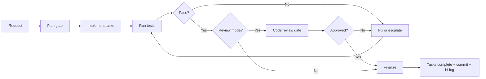

Câu ngắn nhất để nhớ:

> `hi-craft` không chỉ viết code; nó bảo đảm thay đổi đi qua plan gate, execution, test evidence, review phù hợp và finalize có truy nguyên.
