# Hi Debug Skill: Hướng dẫn đầy đủ

> `hi-debug` là skill điều tra bug, test failure, unexpected behavior, performance issue, call stack, log, CI/CD, database và incident hệ thống bằng evidence và root-cause analysis. Nó không phải shortcut để sửa code ngay.

## 1. Hi Debug giải quyết vấn đề gì?

Một triệu chứng có thể xuất hiện ở nơi hoàn toàn khác với nguyên nhân gốc:

```text
UI error -> API response -> service state -> database data -> migration/config
```

Nếu chỉ sửa vị trí symptom, lỗi có thể:

- quay lại qua call path khác;
- bị che bởi fallback hoặc suppression;
- chỉ hết trong local nhưng vẫn xảy ra production;
- làm test pass nhưng contract vẫn sai;
- tạo regression khi data/state thay đổi.

`hi-debug` tổ chức investigation thành các hoạt động có thể kiểm chứng:

1. quan sát và capture trạng thái trước fix;
2. xây hypothesis cụ thể;
3. test từng hypothesis bằng experiment nhỏ;
4. trace ngược tới root cause;
5. thiết kế fix và defense-in-depth;
6. chạy verification mới trước khi claim.

## 2. Hai tầng debugging

Skill có hai workflow chính:

### 2.1 Code-level debugging

Dùng cho bug, test, type/lint, call stack hoặc behavior trong code. Gồm bốn phase:

```text
Root Cause Investigation -> Pattern Analysis -> Hypothesis and Testing -> Implementation
```

### 2.2 System-level investigation

Dùng cho incident, server 500, CI/CD, database, deployment, multi-component failure hoặc behavior thay đổi không rõ lý do. Gồm năm bước:

```text
Initial Assessment -> Data Collection -> Analysis -> Root Cause Identification -> Solution Development
```

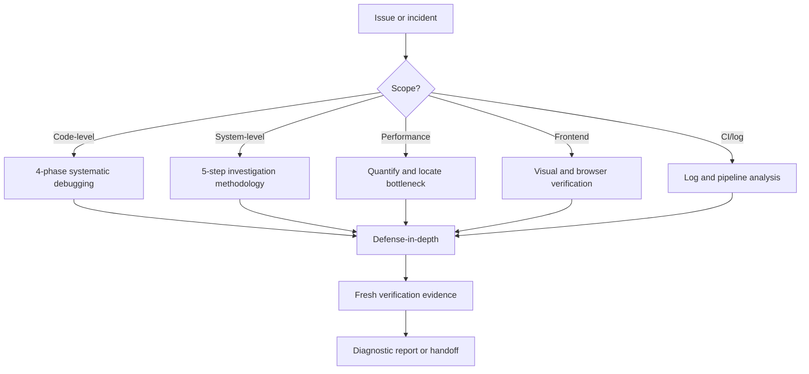

## 3. Nguyên tắc tối cao: Iron Law

> **NO COMPLETION CLAIMS WITHOUT FRESH VERIFICATION EVIDENCE**
>
> Không được claim “đã sửa”, “đã pass”, “đã hoàn thành” nếu chưa chạy verification command mới và đọc output/exit code.

Trước bất kỳ completion claim nào:

1. **Identify**: command nào chứng minh claim?
2. **Run**: chạy đầy đủ command đó.
3. **Read**: đọc output và exit code, đếm failures.
4. **Verify**: output có thật sự xác nhận claim không?
5. **Report**: nếu không xác nhận, nói đúng trạng thái thực tế.

### 3.1 Không đủ để claim

| Claim | Evidence cần có | Không đủ |
|---|---|---|
| Tests pass | Test command mới, 0 failures | Test cũ hoặc “nên pass” |
| Lint clean | Lint output, 0 errors | Một phần file hoặc typecheck |
| Build succeeds | Build exit 0 | Lint pass |
| Bug fixed | Reproduce original symptom đã pass | Code đã đổi |
| Regression test works | Red-green cycle nếu cần | Test pass một lần |
| Agent completed | VCS diff + independent verification | Agent nói success |
| Requirements met | Checklist từng requirement | Tests pass nhưng bỏ sót requirement |

### 3.2 Red flags

Dừng lại và verify khi thấy các câu hoặc suy nghĩ:

- “should work”;
- “probably fixed”;
- “looks correct”;
- “mình khá chắc”;
- “linter pass nên build chắc pass”;
- “agent nói đã xong”;
- “chỉ lần này thôi”;
- “partial check là đủ”.

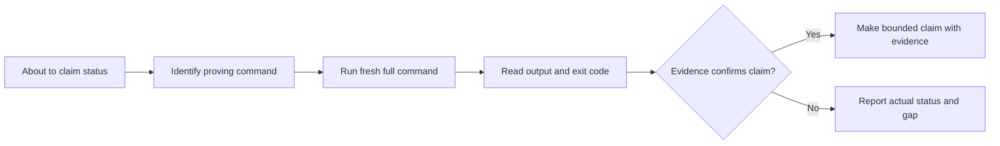

## 4. Khi nào dùng technique nào?

| Technique | Dùng khi | Reference |
|---|---|---|
| Systematic Debugging | Bất kỳ bug/code issue cần điều tra và fix | `systematic-debugging.md` |
| Root Cause Tracing | Error sâu trong call stack, invalid data origin không rõ | `root-cause-tracing.md` |
| Defense-in-Depth | Đã tìm root cause, cần ngăn recurrence ở mọi layer | `defense-in-depth.md` |
| Verification | Sắp claim fixed/passing/completed | `verification.md` |
| Investigation Methodology | Incident server, multi-component failure | `investigation-methodology.md` |
| Log & CI/CD Analysis | Pipeline, deployment, server log | `log-and-ci-analysis.md` |
| Performance Diagnostics | Latency, slow query, CPU/memory/disk | `performance-diagnostics.md` |
| Reporting Standards | Viết diagnostic/incident/performance report | `reporting-standards.md` |
| Task Management | Investigation từ 3 steps hoặc nhiều agent | `task-management-debugging.md` |
| Frontend Verification | UI, layout, responsive, visual regression | `frontend-verification.md` |

Các tool integration chính:

- `psql` cho PostgreSQL;
- `gh` cho GitHub Actions logs/pipeline;
- `hi-docs-seeker` cho package docs;
- `hi-repository-search` và `hi-codebase-research-explorer` cho code/docs context;
- Chrome MCP hoặc `hi-chrome-devtools` cho frontend;
- `hi-problem-solving` khi bị stuck.

## 5. Code-level workflow: bốn phase

### 5.1 Tổng quan

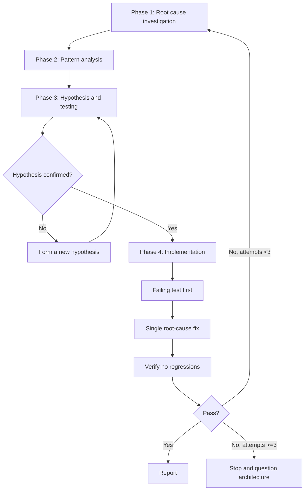

Mỗi phase phải hoàn tất trước phase sau. Không dùng phase Implementation để thay thế diagnosis.

### 5.2 Phase 1: Root Cause Investigation

Trước bất kỳ fix nào:

1. đọc error thật kỹ, không bỏ qua stack trace;
2. reproduce nhất quán nếu có thể;
3. kiểm tra thay đổi gần đây:
   - `git diff`;
   - recent commits;
   - dependency changes;
   - config/environment;
4. capture data in/out ở từng component boundary;
5. trace data flow ngược call stack tới nguồn.

Câu hỏi chính:

- lỗi xảy ra ở đâu?
- giá trị bất thường đầu tiên xuất hiện ở đâu?
- boundary nào không validate?
- behavior mới bắt đầu từ khi nào?
- lỗi deterministic hay intermittent?

### 5.3 Phase 2: Pattern Analysis

Không chỉ tìm code lỗi; hãy tìm code đang hoạt động đúng trong cùng codebase:

- working example của cùng pattern;
- reference implementation đầy đủ;
- mọi khác biệt giữa working và failing path;
- component, config, environment dependency;
- test setup và fixture.

Không được bỏ qua khác biệt bằng câu “cái đó chắc không liên quan”. Mọi difference là một candidate hypothesis cho tới khi được refute.

### 5.4 Phase 3: Hypothesis and Testing

Hypothesis phải cụ thể:

```text
X là root cause vì Y; nếu đúng thì experiment Z sẽ quan sát được W.
```

Ví dụ:

```text
Projection thiếu userId là root cause vì mapper nhận object không có field bắt buộc;
chạy test với projection variant sẽ tái hiện undefined trước token creation.
```

Quy tắc:

- một hypothesis cụ thể mỗi lần;
- experiment nhỏ nhất có tính phân biệt cao;
- thay đổi một biến;
- verify kết quả trước khi chuyển tiếp;
- nếu fail, quay lại với hypothesis mới;
- nói “I don't understand X” khi chưa hiểu, không giả vờ chắc chắn.

### 5.5 Phase 4: Implementation

Chỉ bắt đầu khi root cause đã được xác nhận:

1. tạo failing test case trước khi sửa;
2. implement một fix duy nhất nhắm root cause;
3. chạy test và verification;
4. kiểm tra regression;
5. thêm prevention/defense-in-depth.

Nếu fix không work:

- dưới 3 attempts: quay lại Phase 1 với evidence mới;
- từ 3 attempts: stop và question architecture với human partner.

## 6. Root-cause tracing

### 6.1 Trace skeleton

```text
1. Observe:        Error: <symptom> at <location>
2. Immediate cause: <code line that directly fails>
3. Call chain:     callee <- caller <- ... <- entry point
4. Bad value:      <param> = <unexpected value>
5. Original trigger: <test/setup that introduced the bad value>
```

### 6.2 Trace backward

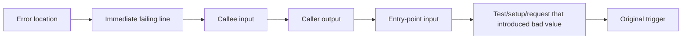

Không sửa tại error location nếu data sai được tạo từ caller hoặc setup. Sửa ở nguồn tạo invariant sai, sau đó validate tại các layer đi qua data.

### 6.3 Instrumentation khi manual trace khó

Trong test có thể thêm `console.error()` để logger không bị ẩn:

```typescript
async function gitInit(directory: string) {
  console.error('DEBUG git init:', {
    directory,
    cwd: process.cwd(),
    stack: new Error().stack,
  });
  await execFileAsync('git', ['init'], { cwd: directory });
}
```

Capture output:

```bash
npm test 2>&1 | grep 'DEBUG git init'
```

Cần lấy:

- test file;
- line number;
- input value;
- cwd/environment;
- call stack;
- pattern lặp lại.

Instrumentation là công cụ điều tra, không phải final fix. Sau khi có evidence, quyết định giữ instrumentation có chủ đích hay loại bỏ.

### 6.4 Tìm test gây pollution

Khi test fail do shared state hoặc pollution, dùng script `scripts/find-polluter.sh`:

```bash
./scripts/find-polluter.sh '.git' 'src/**/*.test.ts'
```

Mục tiêu là tìm test đầu tiên làm bẩn state, không phải test cuối cùng phát hiện state đã bẩn.

## 7. System-level investigation: năm bước

Dùng workflow này cho incident, server error, deployment, database hoặc multi-component behavior.

### 7.1 Sơ đồ tổng quát

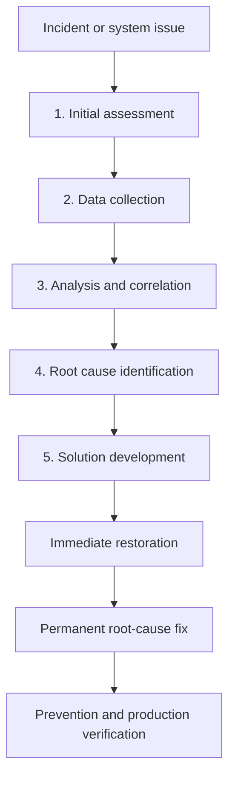

### 7.2 Bước 1: Initial Assessment

Gather scope và impact trước khi đi sâu:

- symptoms, errors, user reports;
- endpoints/services/DB/queues bị ảnh hưởng;
- timeframe và timezone;
- deploy/config thay đổi gần incident;
- severity;
- users affected;
- data at risk;
- blast radius.

Commands hữu ích:

```bash
gh run list --limit 10
git log --oneline -20 --since="2 days ago"
git diff HEAD~5 -- '*.env*' '*.config*' '*.yml' '*.yaml' '*.json'
```

### 7.3 Bước 2: Data Collection

Thu evidence có hệ thống trước khi phân tích:

- server/app logs;
- CI/CD logs;
- database state và migrations;
- CPU, memory, disk, network;
- external dependencies, DNS, CDN, third-party status;
- codebase summary hoặc repository search;
- package docs và version.

CI commands:

```bash
gh run list --workflow=ci.yml --limit 5
gh run view <run-id>
gh run view <run-id> --log-failed
gh run view <run-id> --log > /tmp/ci-full.txt
```

### 7.4 Bước 3: Analysis and Correlation

Xây timeline theo thứ tự:

```text
first signal -> propagation -> component failure -> user impact
```

Correlate:

- timestamp giữa services, nhớ timezone;
- request/correlation ID;
- deploy/config change;
- rate và frequency của error;
- affected user/endpoint segment;
- upstream/downstream errors;
- database query và integrity;
- dependency graph.

Câu hỏi quan trọng:

- có tương quan deployment không?
- lỗi intermittent hay consistent?
- tất cả users hay subset?
- chỉ một endpoint hay toàn hệ thống?
- upstream hay downstream fail trước?

### 7.5 Bước 4: Root Cause Identification

List hypotheses theo evidence strength. Với mỗi hypothesis:

- experiment nhỏ nhất;
- evidence confirm/refute;
- environmental factors;
- race condition/resource limit/config drift;
- full event chain.

Không fix hypothesis đầu tiên chỉ vì nó nghe hợp lý.

### 7.6 Bước 5: Solution Development

Ưu tiên theo impact × urgency:

1. immediate fix: hotfix, rollback hoặc config để restore service;
2. root-cause fix: giải quyết underlying issue;
3. preventive measures: monitoring, alerting, validation;
4. production verification plan.

Immediate mitigation không được bị nhầm là permanent fix.

## 8. Log và CI/CD analysis

### 8.1 GitHub Actions

```bash
gh run list --limit 10
gh run list --workflow=ci.yml --limit 5
gh run view <run-id>
gh run view <run-id> --log-failed
gh run view <run-id> --log > /tmp/ci-full.txt
gh run rerun <run-id> --failed
```

Khi đọc failed pipeline:

1. xác định failed step;
2. lấy focused logs;
3. tìm `Error:`, `FAIL`, `exit code`, stack trace;
4. xem annotations:

```bash
gh api repos/{owner}/{repo}/check-runs/{id}/annotations
```

### 8.2 Pattern thường gặp

| Pattern | Likely cause | Investigation |
|---|---|---|
| Local pass, CI fail | Environment difference | Node/Python/OS/env/secret |
| Intermittent | Race/flaky/shared state | Chạy 3 lần, xem timing |
| Timeout | Resource limit/infinite loop | CPU/memory/loop/timeout |
| Permission error | Token/secret config | Secret names, token scope |
| Install fail | Registry/lockfile/version | Lockfile và registry |
| Build pass, test fail | Test setup/DB/fixture | Test config và fixture |

### 8.3 Server/application logs

Collection strategy:

- xác định log locations;
- filter theo incident timeframe;
- correlate request IDs giữa services;
- tìm repeated errors và rate change;
- bảo toàn original lines.

Fields ưu tiên:

- timestamp;
- level;
- message;
- stack trace;
- request ID;
- user ID nếu không nhạy cảm;
- endpoint;
- response code;
- duration.

### 8.4 Error pattern recognition

| Pattern | Gợi ý |
|---|---|
| Spike đột ngột | Deploy, config, external dependency |
| Tăng dần | Resource leak hoặc data growth |
| Theo chu kỳ | Cron/scheduled job |
| Một endpoint | Code hoặc data riêng endpoint |
| Tất cả endpoint | Infra, DB hoặc network |

## 9. Performance diagnostics

### 9.1 Measure trước optimize

Phải có baseline và current metrics:

- expected response time;
- actual response time;
- percentile nếu có;
- khi degradation bắt đầu;
- endpoint nào affected;
- consistent hay intermittent;
- traffic/load tại thời điểm đó.

Không tối ưu dựa trên cảm giác “app chậm”.

### 9.2 Locate bottleneck layer

```text
Request -> Network -> Web Server -> Application -> Database -> Filesystem
                                      |             |
                                      +-> External APIs/Services
```

| Layer | Check | Tool |
|---|---|---|
| Network | Latency, DNS, TLS | `curl -w`, network logs |
| Web server | Queue, connections | Server metrics/access logs |
| Application | CPU, memory | Profiler, APM, `process.memoryUsage()` |
| Database | Query, connections | `EXPLAIN ANALYZE`, `pg_stat_statements` |
| Filesystem | I/O, disk | `iostat`, `df -h` |
| External API | Duration, timeout | Request logs with duration |

### 9.3 PostgreSQL diagnostics

Slow queries:

```sql
SELECT query, calls, mean_exec_time, total_exec_time
FROM pg_stat_statements
ORDER BY mean_exec_time DESC
LIMIT 20;
```

Active queries:

```sql
SELECT pid,
       now() - pg_stat_activity.query_start AS duration,
       query,
       state
FROM pg_stat_activity
WHERE state != 'idle'
ORDER BY duration DESC;
```

Table sizes:

```sql
SELECT relname,
       pg_size_pretty(pg_total_relation_size(relid))
FROM pg_catalog.pg_statio_user_tables
ORDER BY pg_total_relation_size(relid) DESC
LIMIT 20;
```

Missing-index signal:

```sql
SELECT relname, seq_scan, seq_tup_read, idx_scan
FROM pg_stat_user_tables
WHERE seq_scan > 100
  AND seq_tup_read > 10000
ORDER BY seq_tup_read DESC;
```

Connection pool:

```sql
SELECT count(*), state
FROM pg_stat_activity
GROUP BY state;
```

Specific query:

```sql
EXPLAIN (ANALYZE, BUFFERS, FORMAT TEXT) <your-query>;
```

Look for:

- sequential scan trên bảng lớn;
- nested loop với row count cao;
- sort không có index;
- buffer hit quá lớn;
- N+1 query;
- connection exhaustion;
- bloat.

### 9.4 Application performance patterns

| Issue | Symptom | Hướng điều tra/fix |
|---|---|---|
| N+1 queries | Nhiều DB call nhỏ/request | Eager load hoặc batch |
| Memory leak | Memory tăng theo thời gian | Heap profile, listeners |
| Blocking I/O | Latency cao, CPU thấp | Async, pool |
| CPU-bound | CPU cao theo load | Algorithm, cache |
| Connection exhaustion | Timeout intermittent | Pool size, reuse |
| Large payload | Transfer/memory cao | Pagination, compression, streaming |

### 9.5 Optimization priority

Một thay đổi mỗi lần, đo lại sau mỗi thay đổi:

1. quick wins: index, N+1, cache;
2. configuration: pool, timeout, workers;
3. code: algorithm, data structure;
4. architecture: read replica, async, CDN, distributed cache.

Performance report phải có baseline, bottleneck evidence, root cause, expected impact và verification plan.

## 10. Frontend verification

Chỉ dùng workflow này khi issue liên quan frontend: `tsx`, `jsx`, Vue, Svelte, HTML, CSS, SCSS, component, layout, DOM, responsive, animation, UI hoặc UX.

### 10.1 Detect browser capability

Ưu tiên Chrome MCP. Nếu không có, dùng `hi-chrome-devtools`. Nếu cả hai unavailable, ghi rõ visual verification skipped.

### 10.2 Chrome verification flow

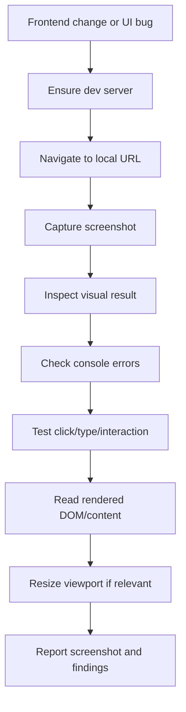

Các bước:

1. `chrome__navigate` tới local URL;
2. `chrome__screenshot`;
3. đọc screenshot;
4. evaluate console errors;
5. click/type để test interaction;
6. get content để xác minh DOM/text;
7. kiểm tra responsive nếu issue liên quan viewport.

### 10.3 Fallback chrome-devtools

```bash
SKILL_DIR="$HOME/.claude/skills/chrome-devtools/scripts"
npm install --prefix "$SKILL_DIR" 2>/dev/null
node "$SKILL_DIR/screenshot.js" --url http://localhost:3000 --output ./verification-screenshot.png
node "$SKILL_DIR/console.js" --url http://localhost:3000 --types error,pageerror --duration 5000
```

Kiểm tra:

- layout không overflow/overlap;
- content render đúng;
- responsive;
- interactions;
- console không có errors;
- screenshot path được ghi trong report.

Visual verification không thay thế unit/integration test. Nó bổ sung evidence cho behavior trình duyệt.

## 11. Defense-in-depth

### 11.1 Vì sao cần nhiều layer?

Một validation duy nhất có thể bị bypass bởi:

- code path khác;
- refactor;
- mock test;
- direct database call;
- config/environment khác.

Mục tiêu không chỉ là “đã sửa bug”, mà là “làm bug khó hoặc không thể quay lại qua các path chính”.

### 11.2 Bốn layer

| Layer | Mục đích | Ví dụ |
|---|---|---|
| 1. Entry point | Reject input sai ở API boundary | Path không tồn tại thì throw |
| 2. Business logic | Đảm bảo data hợp lệ cho operation | Required domain field |
| 3. Environment guard | Ngăn operation nguy hiểm theo context | Test chỉ được dùng temp dir |
| 4. Debug instrumentation | Ghi context để forensic | cwd, input, stack |

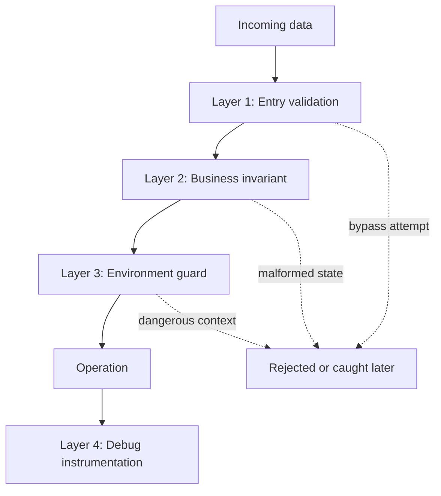

### 11.3 Cách áp dụng

1. trace data từ origin tới use;
2. map mọi checkpoint;
3. thêm validation ở bốn layers phù hợp;
4. test từng layer;
5. thử bypass layer 1 và xác nhận layer 2 vẫn catch;
6. verify logging không lộ secret.

Defense-in-depth không có nghĩa thêm check vô hạn. Chỉ thêm guard có ownership rõ và bảo vệ invariant thật.

## 12. Task management cho investigation

### 12.1 Khi tạo tasks

| Scope | Tasks? | Lý do |
|---|---:|---|
| Một bug, một file | Không | Debug trực tiếp đủ |
| Multi-component, từ 3 steps | Có | Track assess → collect → analyze → fix → verify |
| Parallel log/data collection | Có | Điều phối evidence độc lập |
| CI failure với 3+ causes | Có | Theo dõi hypothesis elimination |

### 12.2 3-Task Rule

Nếu investigation có dưới 3 meaningful steps, bỏ qua task creation để tránh overhead.

### 12.3 Pipeline task chuẩn

```text
Assess incident scope      -> pending
Collect logs and evidence  -> blockedBy: Assess
Analyze root cause         -> blockedBy: Collect
Implement fix              -> blockedBy: Analyze
Verify fix                 -> blockedBy: Fix
```

Metadata nên có:

```yaml
metadata:
  debugStage: assess|collect|analyze|fix|verify
  incident: <id>
  severity: P0|P1|P2|P3
  effort: <estimate>
  cycle: 1
```

### 12.4 Parallel evidence collection

Các collection tasks không block nhau:

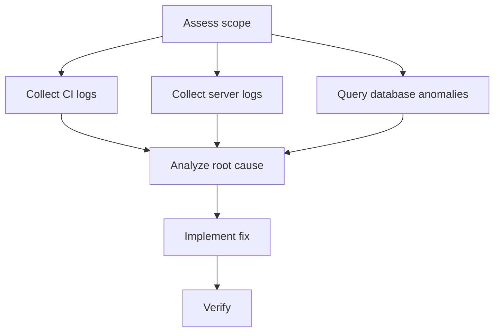

### 12.5 Lifecycle và re-investigation

```text
pending -> in_progress -> completed
```

Nếu Verify fail:

```text
Analyze(cycle 2) -> Fix(cycle 2) -> Verify(cycle 2)
```

Giới hạn 3 cycles, sau đó question architecture.

Tasks là session-scoped. Diagnostic report là artifact persistent và phải được viết sau investigation. Nếu TaskCreate fail, tiếp tục sequential debugging và ghi warning; tasks tăng visibility nhưng không phải core functionality.

## 13. Reporting standards

### 13.1 Nguyên tắc

- concise: facts và evidence, không kể chuyện dài;
- honest: phân biệt `likely cause` và `confirmed cause`;
- nêu unknowns;
- report impact và status;
- tách immediate mitigation khỏi permanent fix.

### 13.2 Template

```markdown
# [Issue Title] - Investigation Report

## Executive Summary
- **Issue:**
- **Impact:**
- **Root cause:**
- **Status:**
- **Fix:**

## Timeline
- HH:MM -
- HH:MM -

## Technical Analysis
### Findings
1.
2.

### Evidence
[logs, queries, metrics]

## Recommendations
### Immediate (P0)
- [ ]

### Short-term (P1)
- [ ]

### Long-term (P2)
- [ ]

## Unresolved Questions
-
```

### 13.3 Evidence cần bảo toàn

- exact error messages;
- stack traces;
- timestamps và timezone;
- request/correlation IDs;
- before/after comparison;
- counts/frequency;
- normal path và error path;
- commands và exit codes.

## 14. Một investigation đầy đủ trông như thế nào?

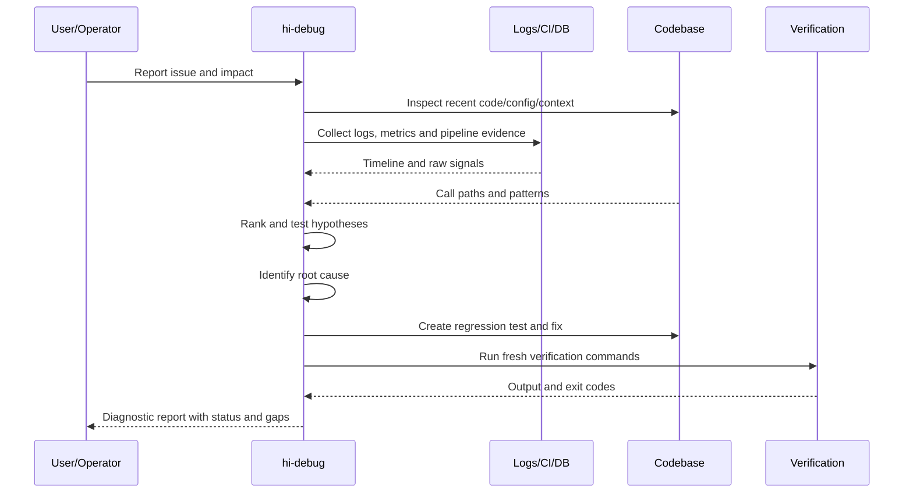

## 15. Ví dụ code-level: undefined data trong call stack

Issue:

```text
Một test fail tại token creation với `userId is undefined`.
```

### 15.1 Observe

Capture:

- exact stack trace;
- test name;
- input fixture;
- command;
- recent diff;
- value tại token service boundary.

### 15.2 Pattern analysis

Tìm working test tạo token thành công. So sánh:

- repository query projection;
- mapper;
- fixture fields;
- async setup;
- transaction state.

### 15.3 Hypothesis

```text
Hypothesis: projection mới bỏ `userId`, vì mapper nhận object thiếu field.
Experiment: chạy mapper với projection cũ/mới và log input boundary.
```

Nếu projection variant tái hiện lỗi và projection cũ pass, hypothesis confirmed.

### 15.4 Root-cause trace

```text
Token error
-> token service reads undefined userId
-> mapper output misses required field
-> repository projection excludes userId
-> test setup introduced new projection
```

### 15.5 Implementation và verify

- viết regression test cho projection mới;
- enforce required field ở repository/domain boundary;
- sửa projection hoặc contract;
- chạy test cũ + test mới;
- chạy typecheck/lint/build theo scope;
- claim chỉ sau khi output mới xác nhận.

## 16. Ví dụ system-level: CI pass local nhưng fail pipeline

Issue:

```text
Local test pass, GitHub Actions fail ở integration test với database timeout.
```

### 16.1 Initial assessment

- workflow/run ID;
- failing job/step;
- bắt đầu từ commit/deploy nào;
- tất cả job hay chỉ integration;
- data/user impact nếu CI đang block release.

### 16.2 Data collection

```bash
gh run list --workflow=ci.yml --limit 5
gh run view <run-id> --log-failed
git log --oneline -20
git diff HEAD~5 -- '.github/**' '*.yml' '*.yaml' '*.json'
```

Kiểm tra thêm:

- DB service startup log;
- Node/Python version;
- env vars/secret names;
- migration status;
- connection pool;
- test parallelism.

### 16.3 Hypotheses

| Hypothesis | Experiment |
|---|---|
| CI DB chưa ready | Kiểm tra service health và startup timing |
| Connection pool quá nhỏ | Compare config và active connections |
| Migration không chạy | Inspect migration logs/schema |
| Test pollution | Chạy test one-by-one, tìm polluter |
| CI version khác local | Compare runtime/lockfile |

### 16.4 Solution development

- immediate: thêm readiness check nếu service chưa ready;
- root cause: sửa lifecycle/config/migration contract;
- prevention: health check, timeout rõ, CI log fields;
- verify: rerun failed job và local reproduction.

Không claim “CI fixed” chỉ vì rerun pass một lần nếu chưa hiểu intermittent cause.

## 17. Ví dụ performance: API latency tăng

Issue:

```text
P95 của `/orders` tăng từ 300ms lên 2s sau khi thêm filter.
```

### 17.1 Quantify

- baseline/current p50/p95/p99;
- traffic và payload size;
- thời điểm bắt đầu;
- endpoint/tenant affected;
- query count/request.

### 17.2 Eliminate layers

Đo duration tại network, web server, application, DB và external API. Nếu app time cao, profile; nếu DB time cao, chạy `EXPLAIN ANALYZE`.

### 17.3 Hypothesis

```text
Filter tạo N+1 query vì mỗi order lại load customer.
```

Experiment:

- đếm query/request;
- compare endpoint trước/sau filter;
- inspect query plan;
- sửa một biến, đo lại.

### 17.4 Report

Report phải có số baseline/current, bottleneck evidence, expected impact và command/metric chứng minh sau tối ưu.

## 18. Ví dụ frontend: visual regression

Issue:

```text
Mobile layout bị overflow sau khi đổi bảng dữ liệu.
```

Workflow:

1. detect frontend scope;
2. start dev server;
3. screenshot desktop/mobile;
4. inspect overflow/overlap;
5. check console errors;
6. click/scroll/filter interaction;
7. đọc DOM/rendered text;
8. sửa đúng component/style owner;
9. chụp lại screenshot và ghi path;
10. chạy test nếu có.

Visual pass chỉ được claim khi screenshot mới, console output và interaction evidence phù hợp đều đã được đọc.

## 19. Verify hi-debug như thế nào?

### 19.1 Investigation verify

- [ ] Scope và severity đã xác định.
- [ ] Exact symptom/error đã capture.
- [ ] Timeframe và recent changes đã kiểm tra.
- [ ] Affected components và blast radius rõ.
- [ ] Logs/metrics/DB/CI evidence đã thu.
- [ ] Timeline đã correlate.

### 19.2 Root-cause verify

- [ ] Call stack/data flow đã trace backward.
- [ ] Working pattern đã được so sánh.
- [ ] Hypothesis có experiment cụ thể.
- [ ] Hypothesis được confirm/refute bằng evidence.
- [ ] Root cause không chỉ là nơi symptom xuất hiện.
- [ ] Environmental factors đã được cân nhắc.

### 19.3 Fix/prevention verify

- [ ] Failing test tồn tại trước fix.
- [ ] Fix là một thay đổi có chủ đích.
- [ ] Regression test pass.
- [ ] Defense-in-depth đã được cân nhắc.
- [ ] Không có unrelated changes.
- [ ] Không có warning mới.

### 19.4 Fresh verification verify

- [ ] Command chứng minh claim đã được identify.
- [ ] Command chạy trong message/session hiện tại.
- [ ] Đã đọc full output.
- [ ] Đã kiểm tra exit code và số failures.
- [ ] Original symptom không còn.
- [ ] Relevant tests/build/lint/typecheck pass.
- [ ] Report nêu những gì chưa verify.

### 19.5 Report verify

- [ ] Executive summary ngắn và đúng.
- [ ] Timeline có timestamp.
- [ ] Technical findings có evidence.
- [ ] Immediate/short/long-term recommendations tách biệt.
- [ ] Unknowns ghi trong Unresolved Questions.
- [ ] `likely` và `confirmed` không bị dùng lẫn.

## 20. Giới hạn cần hiểu đúng

### 20.1 Debug không đồng nghĩa fix

`hi-debug` có thể kết thúc ở diagnosis report nếu user chỉ cần hiểu incident hoặc chưa cho phép sửa. Fix là bước sau và phải có scope/approval phù hợp.

### 20.2 Root cause có thể là architecture

Nếu ba fix attempts không giải quyết, vấn đề có thể là shared state, coupling hoặc contract architecture. Tiếp tục patch sẽ tăng rủi ro; phải hỏi human partner.

### 20.3 Mitigation không phải permanent fix

Rollback hoặc config change có thể restore service nhưng chưa xử lý nguyên nhân. Report phải tách status của immediate mitigation và permanent root-cause fix.

### 20.4 Partial evidence không đủ cho claim rộng

Một unit test pass không chứng minh integration; một screenshot pass không chứng minh backend; một rerun CI pass không chứng minh flaky cause đã biến mất.

### 20.5 Tác vụ session và report persistent

Debug tasks có thể session-scoped. Investigation report phải là artifact persistent để người khác xem lại timeline, evidence, decision và unresolved risk.

## 21. Quan hệ với các skill khác

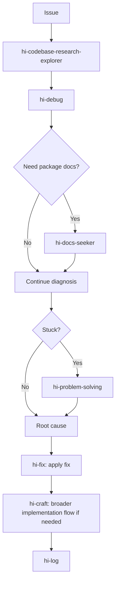

| Skill | Quan hệ |
|---|---|
| `hi-codebase-research-explorer` | Locate files, call paths và external context |
| `hi-fix` | Dùng diagnosis để sửa root cause |
| `hi-craft` | Gọi `hi-fix` sau nhiều test failures hoặc orchestration implementation |
| `hi-plan` | Ghi architectural change hoặc follow-up plan |
| `hi-docs-seeker` | Đọc package/framework/API docs |
| `hi-chrome-devtools` | Browser screenshot, console và interaction |
| `hi-problem-solving` | Đổi framing khi hypothesis loop bị stuck |
| `hi-log` | Ghi investigation/finalization log |

## 22. Tóm tắt nhanh

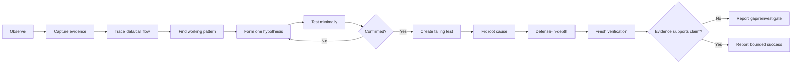

Câu ngắn nhất để nhớ:

> `hi-debug` không bắt đầu bằng câu “sửa dòng nào?”, mà bắt đầu bằng “evidence nào cho biết điều gì đã xảy ra, nguyên nhân gốc nằm ở đâu, và command nào chứng minh kết luận?”.
