# Hi Fix Skill: Hướng dẫn đầy đủ

> `hi-fix` là skill xử lý bug, error, test failure, CI/CD failure, type error, lint error, log error, UI issue và các vấn đề kỹ thuật khác bằng root-cause analysis. Nó không chỉ sửa dòng code đang báo lỗi.

## 1. Hi Fix giải quyết vấn đề gì?

Một lỗi thường có nhiều lớp:

- **Symptom**: biểu hiện nhìn thấy, ví dụ API trả `500` hoặc test fail.
- **Immediate cause**: nguyên nhân trực tiếp, ví dụ `undefined` bị dereference.
- **Contributing factor**: điều kiện làm lỗi xuất hiện, ví dụ input không được validate ở boundary.
- **Root cause**: nguyên nhân gốc trong design, data flow, state, contract hoặc environment.

Nếu chỉ sửa symptom, lỗi có thể biến mất trong một case nhưng quay lại qua call path khác. `hi-fix` buộc workflow phải đi qua research và diagnosis trước khi sửa:

```text
[Codebase-Research-Explorer] -> [Diagnose] -> [Fix] -> [Verify + Prevent] -> [Finalize]
```

Mục tiêu là tạo một fix có thể giải thích bằng evidence:

- lỗi chính xác là gì;
- lỗi nằm ở đâu và bắt đầu từ khi nào;
- hypothesis nào được confirm/refute;
- root cause nằm ở đâu;
- fix tác động vào lớp nào;
- test nào ngăn regression;
- defense-in-depth nào được cân nhắc.

## 2. Mental model tổng quát

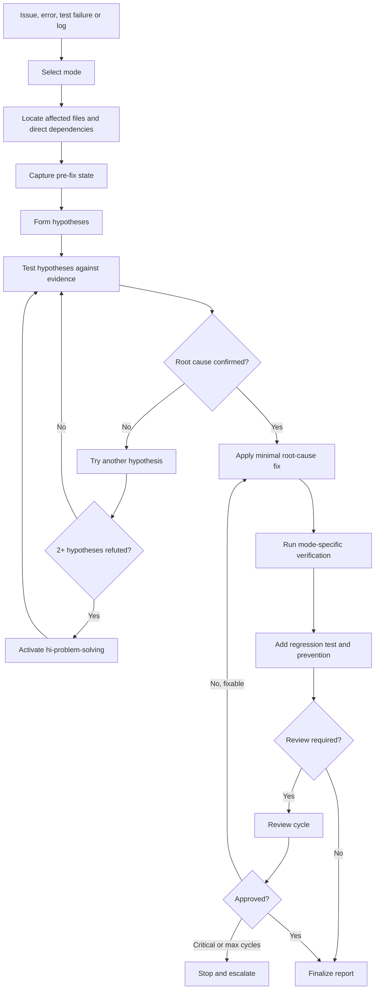

## 3. Hard gates

### 3.1 Diagnose trước Fix

Quy tắc bắt buộc:

> Không được fix trước khi đã chạy Codebase-Research-Explorer và Diagnose.

Điều này có nghĩa là không nên:

- sửa ngay dòng được nêu trong stack trace mà chưa trace backward;
- tăng timeout chỉ để test pass mà chưa biết timeout vì sao;
- thêm `try/catch` để nuốt lỗi;
- thêm `any`, `eslint-disable` hoặc null assertion để che type error;
- đổi expectation của test trước khi xác minh contract;
- retry nhiều lần mà không phân biệt flaky test với deterministic failure.

### 3.2 Root cause trước patch

Diagnosis phải đi theo chuỗi:

```text
Symptom
  -> Immediate cause
    -> Contributing factor
      -> ROOT CAUSE
```

Fix được xem là hợp lệ khi nó xử lý source của behavior sai, không chỉ vị trí lỗi được phát hiện.

### 3.3 Ba lần fix thất bại

Nếu có từ ba lần fix thất bại trở lên:

- dừng việc patch tiếp;
- xem lại diagnosis và architecture;
- hỏi user khi cần quyết định thay đổi kiến trúc hoặc scope;
- không tiếp tục thử ngẫu nhiên.

Nếu có từ hai hypothesis bị refute trở lên, activate `hi-problem-solving` để thoát khỏi vòng lặp giả định cũ.

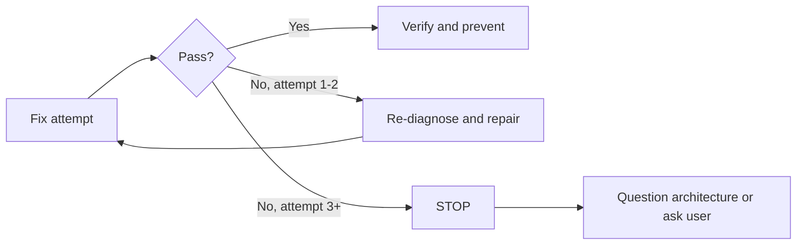

## 4. Cú pháp và mode selection

### 4.1 Cú pháp

```text
/hi-fix <issue>
/hi-fix <issue> --standard
/hi-fix <issue> --deep
/hi-fix <issue> --parallel
/hi-fix <issue> --review
```

`<issue>` có thể là:

- mô tả bug;
- error message;
- test failure;
- CI job failure;
- type/lint error;
- đường dẫn file và line;
- log hoặc stack trace;
- UI behavior cần sửa.

### 4.2 Bảng mode

| Mode | Scope điển hình | Research | Verify | Review |
|---|---|---|---|---|
| Mặc định / Quick | 1 file, type/lint hoặc lỗi rõ | Locate-only | Typecheck + lint | Không |
| `--standard` | 2-5 files | Full explorer, debug khi cần | Typecheck + lint + build + test | Theo policy hoặc `--review` |
| `--deep` | 5+ files, architecture impact | Parallel explorer + diagnose + research | Comprehensive | Có thể review |
| `--parallel` | 2+ issue độc lập | Task tree riêng từng issue | Integration verify sau các nhánh | Theo mode |
| `--review` | Human-in-the-loop | Theo mode còn lại | Theo mode còn lại | Hỏi user ở từng review gate |

`--review` là modifier về approval, không phải một scope riêng. Nó có thể đi cùng workflow phù hợp để yêu cầu user review findings ở từng vòng.

## 5. Quick mode

Quick mode là default cho một file hoặc lỗi có nguyên nhân rõ:

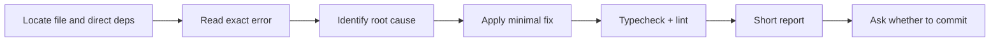

Quick mode phù hợp với:

- một type error rõ;
- một lint error;
- một typo hoặc import sai;
- một file bị lỗi với stack trace trực tiếp;
- test failure có root cause đã biết và không ảnh hưởng architecture.

Quick mode vẫn phải chẩn đoán trước khi sửa. “Quick” rút ngắn phạm vi research và verification, không bỏ hard gate.

Theo workflow reference, quick mode không tự động commit; nó tạo short report và hỏi user có muốn commit hay không.

## 6. Standard mode

`--standard` dành cho thay đổi vừa phải, thường 2-5 files:

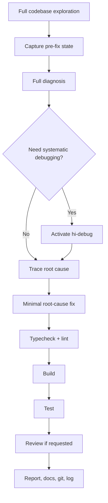

Standard mode nên được dùng khi:

- bug đi qua nhiều layer;
- có từ 2 đến 5 files liên quan;
- cần build và test để chứng minh behavior;
- lỗi có khả năng ảnh hưởng API, data flow hoặc integration;
- cần documentation hoặc review trước commit.

## 7. Deep mode

`--deep` dành cho issue chạm từ 5 files trở lên hoặc có architecture impact. Đây không chỉ là Quick mode với nhiều file hơn; nó cần thêm evidence và verification:

- explorer song song;
- diagnosis và research song song khi độc lập;
- trace call graph/data flow;
- xem xét security, performance và concurrency;
- edge-case và integration verification;
- review trước finalize.

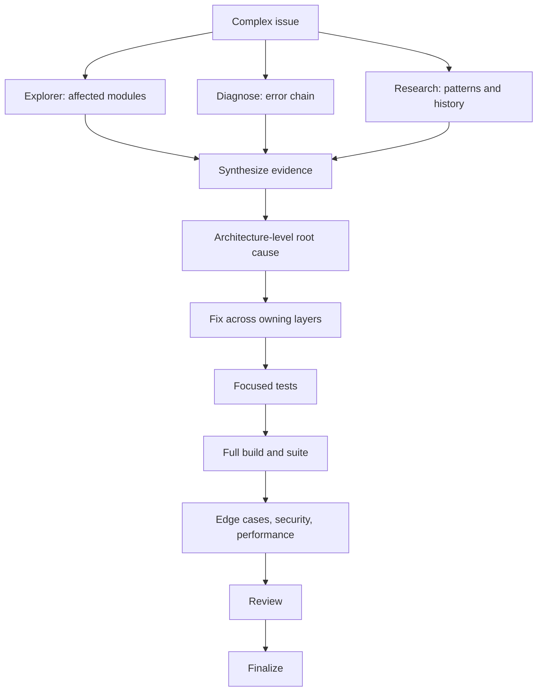

Deep mode phù hợp với:

- data corruption hoặc data loss risk;
- authentication/authorization bug;
- migration hoặc persistence bug;
- memory/resource leak;
- race condition;
- CI/CD pipeline failure ảnh hưởng nhiều job;
- UI issue có frontend, backend và browser state;
- breaking change hoặc architecture violation.

## 8. Parallel mode

`--parallel` dùng cho hai hoặc nhiều issue **độc lập**. Mỗi issue có một task tree riêng:

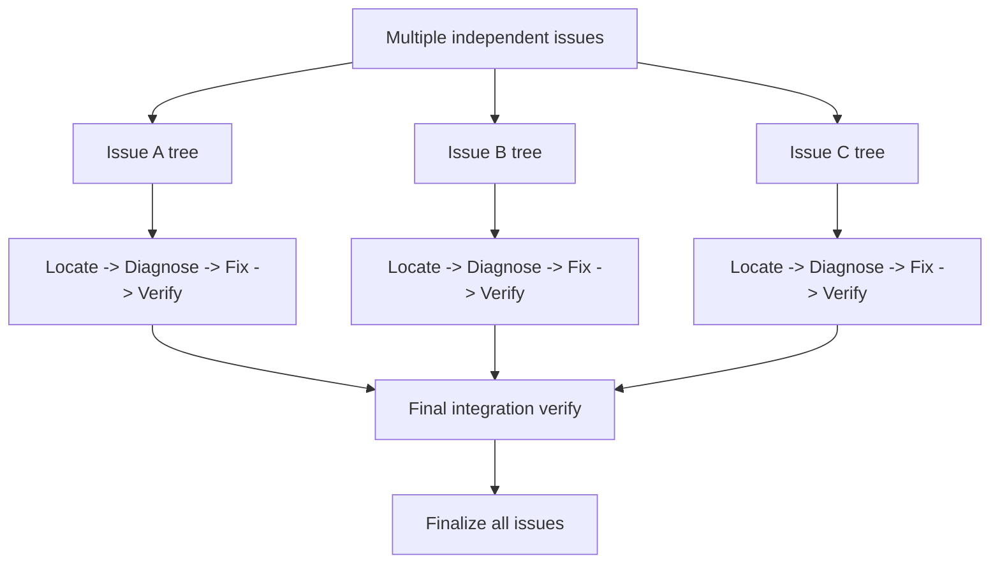

Chỉ parallel khi:

- issue không sửa cùng ownership boundary;
- không có shared root cause chưa được kiểm tra;
- không phụ thuộc chung một migration/API contract;
- kết quả một issue không thay đổi diagnosis của issue khác.

Nếu các issue có thể là biểu hiện của một root cause chung, phải gom thành một diagnosis tree trước. Parallel trong trường hợp đó dễ tạo các fix mâu thuẫn.

Final integration verify bị block cho đến khi mọi nhánh đã hoàn tất verify riêng.

## 9. Review mode

`--review` bật human-in-the-loop ở mỗi review cycle. Trình tự:

1. chạy code reviewer;
2. hiển thị score, critical count, warnings và suggestions;
3. hỏi user lựa chọn;
4. fix theo quyết định;
5. test lại;
6. review lại, tối đa 3 cycles.

Nếu có critical finding, user có thể chọn:

- Fix critical;
- Fix all;
- Approve anyway;
- Abort.

Nếu không có critical finding:

- Approve;
- Fix warnings/suggestions;
- Abort.

Việc user chọn `Approve anyway` nên được ghi rõ trong report cùng residual risk. Nó không làm critical issue biến mất khỏi evidence.

## 10. Bước 1: Codebase-Research-Explorer

### 10.1 Mục tiêu

Explorer ở bước đầu có nhiệm vụ **locate-only**: tìm đúng vùng code trước khi diagnosis sâu.

Cần xác định:

- file báo lỗi;
- direct dependencies;
- entry point của behavior;
- caller/callee gần nhất;
- test liên quan;
- config/environment có thể tác động;
- commit hoặc thay đổi gần đây nếu cần.

### 10.2 Scale theo mode

| Mode | Explorer |
|---|---|
| Quick | 1 agent locate-only |
| Standard | `hi-codebase-research-explorer` hoặc 2-3 explorer |
| Deep | Explorer song song với Diagnose và Research |
| Parallel | Explorer riêng cho từng issue |

Explorer không được tự ý sửa code. Nó trả về context để diagnosis có thể kiểm chứng hypothesis.

### 10.3 Output mong đợi

Một explorer report tốt nên có:

- file và symbol liên quan;
- đường đi của dữ liệu hoặc control flow;
- test/call site gần nhất;
- các file có thể bị ảnh hưởng;
- giới hạn của evidence;
- câu hỏi chưa giải đáp.

## 11. Bước 2: Diagnose

Diagnose là bước mandatory và là nơi skill khác biệt rõ nhất so với patch trực tiếp.

### 11.1 Capture pre-fix state

Phải ghi lại trước khi sửa:

- exact error message;
- file, line và command gây lỗi;
- stack trace;
- log snippets;
- reproduction steps;
- expected behavior;
- actual behavior;
- `git log --oneline -10`.

Việc capture giúp so sánh before/after bằng cùng một command, thay vì dựa vào trí nhớ.

### 11.2 Phase Observe

Các câu hỏi cần trả lời:

- lỗi chính xác là gì?
- xuất hiện ở file/line nào?
- xảy ra khi nào?
- luôn reproduce hay phụ thuộc timing/data/environment?
- bắt đầu từ commit hoặc thay đổi nào?
- có issue tương tự trong log/history không?

### 11.3 Phase Hypothesize

Với mỗi hypothesis, ghi:

- hypothesis statement;
- evidence đang ủng hộ;
- evidence có thể refute;
- experiment hoặc command kiểm tra;
- kết quả: `CONFIRMED`, `REFUTED` hoặc `INCONCLUSIVE`.

Các hypothesis thường gặp:

- regression từ thay đổi gần đây;
- data/state mismatch;
- environment khác nhau;
- missing validation;
- race condition hoặc timing;
- contract mismatch giữa modules;
- dependency/config drift;
- resource limit hoặc timeout.

### 11.4 Phase Test hypotheses

Test hypothesis bằng experiment nhỏ nhất có thể:

- reproduce focused case;
- thêm logging tạm hoặc inspect existing logs;
- chạy test của module;
- trace caller/callee;
- compare input/output tại boundary;
- so sánh environment/config;
- dùng Git history để kiểm tra regression.

Không nên chạy cả test suite trước khi biết test nào có khả năng phân biệt các hypothesis, trừ khi suite là cách rẻ nhất để capture baseline.

### 11.5 Phase Trace root cause

Trace backward theo bốn tầng:

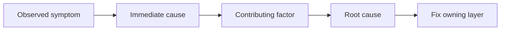

Ví dụ:

```text
Symptom: POST /login trả 500
Immediate cause: token service nhận userId undefined
Contributing factor: mapper bỏ qua field khi query dùng projection khác
Root cause: hai repository contract không thống nhất nhưng không có type/runtime validation
Fix: thống nhất contract tại repository boundary + regression test cho projection variant
```

### 11.6 Escalation trong diagnosis

- Nếu diagnosis phức tạp, activate `hi-debug`.
- Nếu hai hoặc nhiều hypothesis bị refute, activate `hi-problem-solving`.
- Nếu ba lần fix không giải quyết được, dừng và hỏi về architecture.

## 12. Diagnosis report

Trước khi fix, cần có report dạng:

```markdown
## Diagnosis

**Issue:** One-line description.
**Root Cause:** Clearly traced source of incorrect behavior.
**Evidence Chain:** Observation -> hypothesis -> test result.
**Recommended Fix:** Minimal change at owning layer.
**Prevention:** Regression test and defense-in-depth guards.
```

Diagnosis report không phải tài liệu trang trí. Nó là checkpoint để người review kiểm tra rằng fix sắp tới có đang nhắm đúng root cause không.

## 13. Bước 3: Fix

### 13.1 Nguyên tắc

Fix phải:

- xử lý root cause;
- nhỏ nhất nhưng đủ để ngăn lỗi;
- theo pattern hiện có;
- giữ public API nếu không cần breaking change;
- không sửa unrelated bugs;
- không che lỗi bằng suppression hoặc fallback mù;
- có test fail trước fix và pass sau fix.

### 13.2 Owning layer

Sửa ở layer sở hữu invariant bị phá, không nhất thiết ở nơi lỗi được quan sát:

| Symptom xuất hiện ở | Có thể root cause nằm ở |
|---|---|
| UI crash | API contract, state normalization hoặc missing null guard |
| API 500 | persistence mapping, validation hoặc transaction boundary |
| Type error | interface sai, generated type drift hoặc unsafe boundary |
| CI failure | dependency/config/platform mismatch |
| Test flaky | shared state, timing, cleanup hoặc concurrency |
| Slow request | N+1 query, retry amplification hoặc blocking I/O |

### 13.3 Minimal diff

Một fix tốt thường có:

- ít file hơn nhưng đúng ownership;
- không reformat unrelated code;
- không đổi tên public symbol nếu không cần;
- không thêm dependency chỉ để sửa một case đơn giản;
- không bỏ qua warning mới.

Nếu root cause yêu cầu thay đổi lớn, đó là lúc cập nhật architecture/plan hoặc hỏi user, không nên giả vờ rằng một patch nhỏ đã đủ.

## 14. Bước 4: Verify + Prevent

### 14.1 Verification theo mode

| Mode | Verification tối thiểu |
|---|---|
| Quick | Typecheck + lint |
| Standard | Typecheck + lint + build + test |
| Deep | Comprehensive: edge cases + security + performance |
| Parallel | Verify từng issue + final integration verify |

Cùng một command nên được chạy trước và sau fix khi có thể, để so sánh rõ:

```text
Pre-fix command -> fails/reproduces
Post-fix command -> passes/no longer reproduces
```

### 14.2 Prevention gate

Một fix không có prevention là chưa hoàn chỉnh. Regression test là yêu cầu bắt buộc:

> Mỗi fix phải có một test fail nếu bỏ fix và pass khi áp dụng fix.

Ngoài regression test, cân nhắc defense-in-depth ở các lớp:

1. **Entry point**: reject input không hợp lệ ở API boundary.
2. **Business logic**: assert data/state hợp lý.
3. **Environment**: guard dangerous operations, timeout và fallback.
4. **Debug/observability**: thêm logging có ích cho lần diagnosis sau.

### 14.3 Type safety

Nếu lỗi liên quan type:

- `null`/`undefined`: strict null checks, `??` hoặc `?` đúng ngữ cảnh;
- wrong type: type guard hoặc runtime validation;
- missing property: required field trong interface hoặc schema;
- không dùng `any` để làm mất tín hiệu lỗi;
- không dùng suppression nếu chưa xử lý boundary thực sự.

### 14.4 Error handling

Nếu lỗi liên quan failure path:

- promise phải có `.catch()` hoặc `try/catch` phù hợp;
- silent failure phải có explicit error logging;
- fallback phải có timeout và behavior rõ;
- retry phải có giới hạn, backoff và idempotency;
- không expose secret/PII trong error hoặc log.

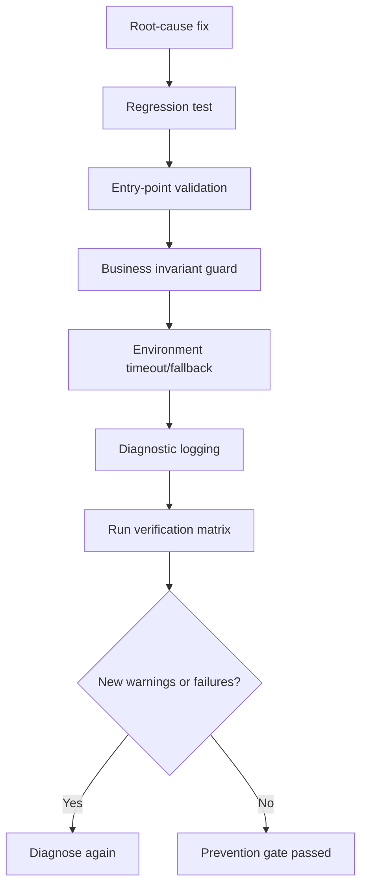

### 14.5 Verification checklist

- [ ] Pre-fix state đã được capture.
- [ ] Fix nằm ở root cause, không chỉ symptom.
- [ ] Cùng command đã được so sánh before/after.
- [ ] Regression test đã được thêm.
- [ ] Defense-in-depth đã được cân nhắc.
- [ ] Không có warning mới.
- [ ] Error handling không bị nuốt.
- [ ] Scope không bị mở rộng im lặng.

## 15. Review cycle

### 15.1 Autonomous review

Quy trình autonomous:

1. chạy code reviewer;
2. lấy `score`, `critical_count`, warnings;
3. nếu score >= 9.5 và critical = 0: auto-approve;
4. nếu có critical và cycle < 3: auto-fix critical, test lại, review lại;
5. nếu cycle >= 3: escalate user;
6. nếu không có critical nhưng score < 9.5: approve với warnings được log.

### 15.2 Human-in-the-loop review

Review với `--review` luôn hiển thị findings và hỏi user. Sau lựa chọn của user:

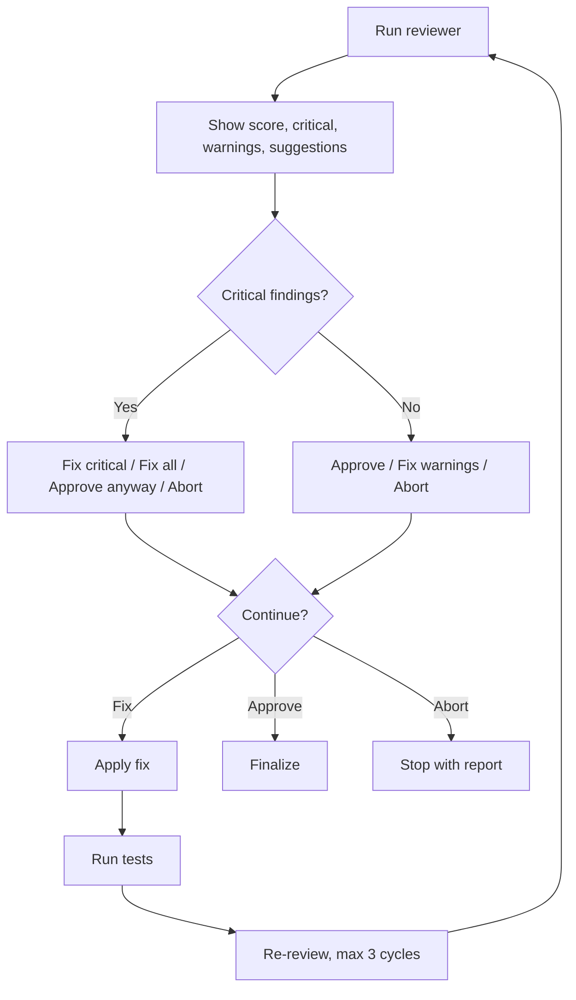

### 15.3 Quick review policy

Quick mode có threshold thấp hơn:

- score >= 8.5 có thể acceptable;
- chỉ một auto-fix cycle trước khi escalate;
- vẫn block các critical issues.

### 15.4 Critical issues luôn block

Các loại sau luôn cần xử lý hoặc user chấp thuận một exception có ghi nhận:

- Security: XSS, SQL injection, OWASP issue;
- Performance: ví dụ O(n²) khi có giải pháp O(n);
- Architecture violations;
- Data loss risks;
- Breaking changes không có migration.

## 16. Bước 5: Finalize

### 16.1 Quick finalize

Quick workflow kết thúc bằng:

- short report;
- test verification summary;
- hỏi user có muốn commit không.

### 16.2 Standard/Deep finalize

Standard và Deep:

1. report;
2. review nếu `--review` hoặc policy yêu cầu;
3. cập nhật documentation;
4. tạo Git commit;
5. ghi log.

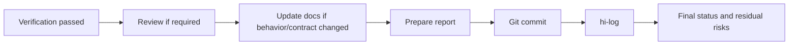

### 16.3 Không finalize khi nào?

Không finalize như successful fix nếu:

- root cause chưa được xác nhận;
- test vẫn fail;
- regression test chưa có, trừ khi ghi rõ blocker hợp lệ;
- critical review finding còn tồn tại;
- đã vượt ba fix attempts mà chưa hỏi về architecture;
- task bị block nhưng report lại ghi completed.

## 17. Output của hi-fix

### 17.1 Quick output

```text
Issue: Type error in user mapper
Root cause: Optional field used as required value
Fix: Runtime guard at mapper boundary
Verify: typecheck passed, lint passed
Prevention: regression test added
Commit: pending user approval
```

### 17.2 Diagnosis report

Với Standard/Deep, output nên có:

- issue summary;
- pre-fix reproduction;
- evidence chain;
- hypotheses và kết quả confirm/refute;
- root cause;
- files changed;
- recommended fix hoặc applied fix;
- verification commands và kết quả;
- regression test;
- defense-in-depth;
- review score/findings;
- commit/log;
- residual risk và follow-up.

### 17.3 Không được nói quá mức

Không nên báo cáo:

- “fixed” khi chỉ đổi test expectation;
- “verified” khi chỉ chạy một command không đủ scope;
- “no regression” khi chưa có regression test;
- “production ready” khi chưa kiểm tra environment/integration;
- “root cause found” khi hypothesis mới chỉ inconclusive.

## 18. Failure handling và escalation

### 18.1 Hai hypothesis bị refute

Khi hai hypothesis trở lên bị refute, diagnosis hiện tại có thể đang dùng sai framing. Activate `hi-problem-solving` để:

- đảo ngược assumption;
- tách symptom thành các scenario;
- thử experiment có tính phân biệt cao hơn;
- xem xét environment hoặc architecture boundary.

### 18.2 Ba fix attempts thất bại

Đây là architecture question, không phải tín hiệu để patch thêm:

1. dừng fix;
2. ghi lại cả ba attempts và kết quả;
3. xác định assumption nào sai;
4. hỏi user có chấp nhận architectural change không;
5. cập nhật plan nếu tiếp tục.

### 18.3 CI workflow

Specialized CI workflow:

1. lấy failed logs, ví dụ `gh run view --log-failed`;
2. phân tích stack traces và pattern;
3. reproduce locally;
4. fix root cause;
5. chạy local verification;
6. ghi khác biệt giữa CI và local environment.

### 18.4 Log workflow

Đọc N dòng log gần nhất, ưu tiên:

- stack trace;
- error code;
- request/correlation ID;
- first failure thay vì cascading failures;
- timestamp và sequence.

Không nên chỉ lấy dòng cuối nếu dòng cuối là consequence chứ không phải source.

### 18.5 Test failure workflow

Với compile failure:

- group errors theo module;
- sửa shared root cause trước;
- không sửa từng error cascade một cách máy móc.

Với type errors:

- chạy `tsc --noEmit` nếu project dùng TypeScript;
- sửa tất cả errors thuộc scope;
- không dùng `any` để che lỗi.

### 18.6 UI workflow

Với UI issue:

1. phân tích screenshot hoặc reproduction;
2. xác định viewport, browser và state;
3. tìm component/style/data owner;
4. implement fix;
5. verify visually và bằng interaction test nếu có;
6. kiểm tra responsive, overlap và accessibility.

## 19. Ví dụ end-to-end

Giả sử issue là:

```text
Production login thỉnh thoảng trả 500 khi user vừa được tạo.
```

### 19.1 Gọi skill

```text
/hi-fix intermittent 500 on login for newly-created users --deep --review
```

### 19.2 Explorer

Tìm:

- login controller;
- user creation transaction;
- token service;
- user repository và mapper;
- integration tests;
- logs theo correlation ID;
- commit gần thời điểm issue xuất hiện.

### 19.3 Capture pre-fix

Ghi:

- exact 500 response;
- stack trace;
- user creation timestamp;
- login request timestamp;
- query/projection được dùng;
- `git log --oneline -10`;
- reproduction rate và environment.

### 19.4 Hypotheses

| Hypothesis | Test | Kết quả giả định |
|---|---|---|
| User creation chưa commit trước login | Trace transaction timing | Refuted nếu login chỉ chạy sau commit |
| Mapper bỏ qua `userId` với projection mới | Compare projection và mapper input | Confirmed |
| Token service có race condition | Reproduce concurrent requests | Inconclusive |

### 19.5 Root cause

```text
Symptom: Login 500
Immediate cause: token service nhận userId undefined
Contributing factor: mapper dùng projection không chứa userId nhưng type không bắt buộc field
Root cause: repository boundary không enforce contract giữa projection và domain mapper
```

### 19.6 Fix và prevention

- enforce required `userId` tại repository/domain boundary;
- sửa projection hoặc mapper theo contract thống nhất;
- thêm runtime guard cho data không hợp lệ;
- thêm regression test với newly-created user và projection variant;
- thêm log không chứa credential để lần sau trace nhanh hơn.

### 19.7 Verify và review

Deep verification:

- focused unit test;
- integration test cho create-then-login;
- concurrent request scenario;
- typecheck, lint, build;
- full relevant test suite;
- security review cho log content;
- review user chọn fix critical nếu có.

Chỉ finalize sau khi root cause được confirm, regression test pass và không còn critical review finding.

## 20. Quan hệ với các skill khác

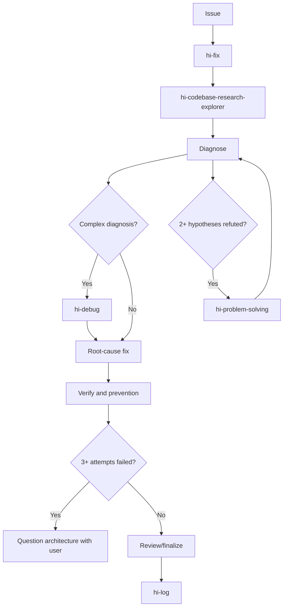

| Skill | Vai trò |
|---|---|
| `hi-codebase-research-explorer` | Locate affected files, symbols và dependencies |
| `hi-debug` | Systematic debugging khi diagnosis khó |
| `hi-problem-solving` | Thoát khỏi framing/hypothesis loop |
| `hi-scenario` | Bổ sung edge cases và scenario matrix |
| `hi-security` | Security audit chuyên sâu |
| `hi-craft` | Gọi hi-fix sau nhiều test failures trong implementation |
| `hi-log` | Ghi log sau finalize |

## 21. Verify hi-fix như thế nào?

### 21.1 Diagnosis verify

- [ ] Exact error và pre-fix state đã được capture.
- [ ] Reproduction hoặc observation có evidence.
- [ ] Hypotheses có cách confirm/refute.
- [ ] Evidence chain đi đến root cause.
- [ ] Không dùng “probably” làm kết luận cuối.

### 21.2 Fix verify

- [ ] Fix nằm ở owning layer.
- [ ] Diff tối thiểu và theo existing pattern.
- [ ] Không có unrelated change.
- [ ] Error handling và boundary validation rõ.
- [ ] Không che lỗi bằng `any`, suppression hoặc swallow exception.

### 21.3 Prevention verify

- [ ] Regression test fail without fix và pass with fix.
- [ ] Defense-in-depth đã được cân nhắc.
- [ ] Type safety đã được kiểm tra.
- [ ] Logging đủ để diagnose recurrence nhưng không lộ secret.
- [ ] Timeout/fallback/retry có policy rõ nếu cần.

### 21.4 Runtime/quality verify

- [ ] Typecheck pass.
- [ ] Lint pass.
- [ ] Build pass nếu mode yêu cầu.
- [ ] Tests pass nếu không dùng `--no-test`.
- [ ] Edge cases đã được chạy trong Standard/Deep.
- [ ] Security/performance đã được cân nhắc trong Deep.

### 21.5 Review/finalize verify

- [ ] Review threshold phù hợp mode.
- [ ] Critical count bằng zero hoặc exception được ghi rõ.
- [ ] Không vượt quá fix cycle limit.
- [ ] Tasks/status đã cập nhật.
- [ ] Docs/log/commit đã hoàn tất theo mode.
- [ ] Residual risks được nêu trong report.

## 22. Các giới hạn cần hiểu đúng

### 22.1 Stack trace không luôn chỉ root cause

Stack trace thường cho biết nơi symptom phát nổ, không phải nơi invariant bị phá. Cần trace backward qua call path và data boundary.

### 22.2 Passing test không chứng minh prevention đầy đủ

Một test pass có thể không bao phủ:

- input boundary khác;
- concurrent request;
- production config;
- retry/timeout;
- migration state;
- browser/device khác;
- data cũ trong database.

### 22.3 Minimal fix không phải shortest diff bằng mọi giá

Một dòng patch có thể là “nhỏ” nhưng sai layer. Minimal đúng nghĩa là ít thay đổi nhất để sửa root cause và ngăn regression.

### 22.4 Review không thay thế diagnosis

Code reviewer có thể phát hiện vấn đề, nhưng review cuối không được dùng để bỏ qua hard gate diagnosis. Một patch chưa có root-cause evidence vẫn chưa sẵn sàng.

### 22.5 User escalation là một outcome hợp lệ

Nếu architecture hiện tại không thể sửa an toàn bằng patch nhỏ, dừng và hỏi user là hành vi đúng. Báo cáo blocker rõ ràng tốt hơn một chuỗi workaround khó truy nguyên.

## 23. Tóm tắt nhanh

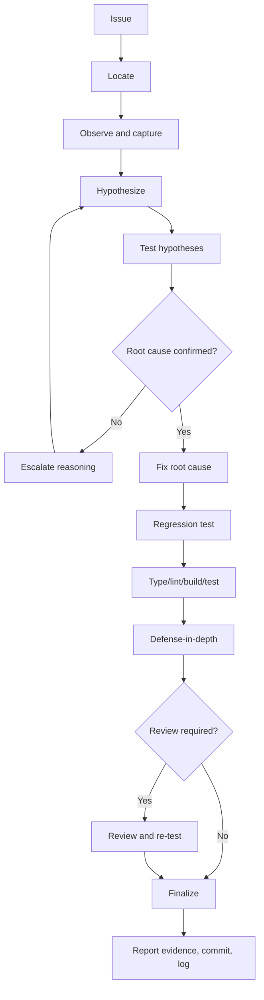

Câu ngắn nhất để nhớ:

> `hi-fix` không hỏi “dòng nào cần sửa?”, mà hỏi “vì sao behavior sai, bằng chứng nào chứng minh điều đó, và làm gì để lỗi không quay lại?”.
