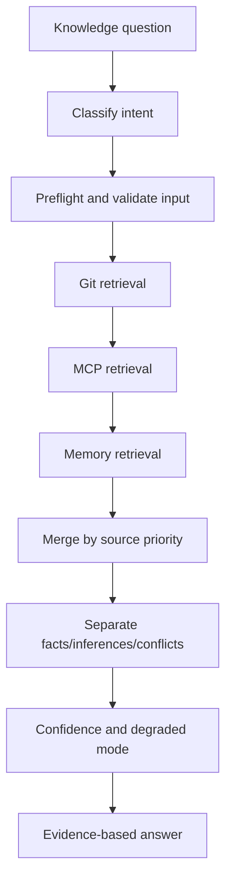
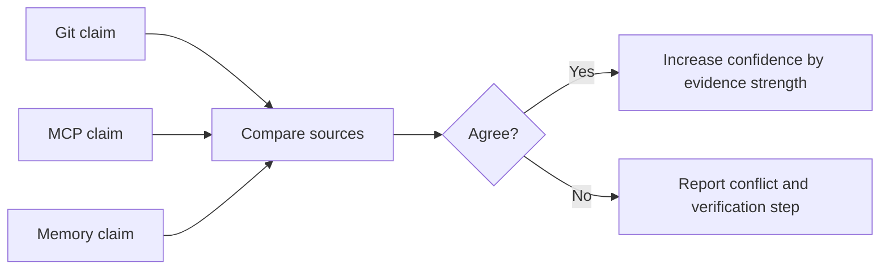
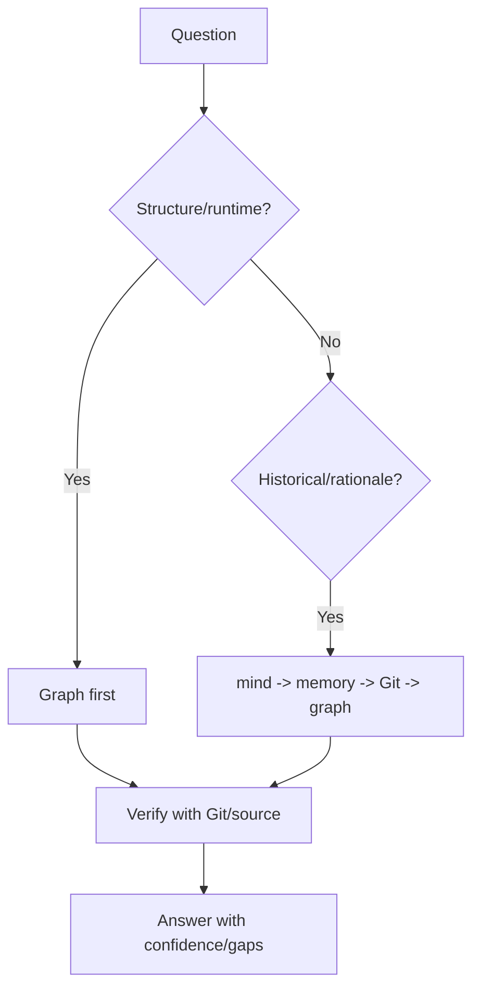

# Hi Knows Skill: Hướng dẫn đầy đủ

> `hi-knows` là unified knowledge retrieval skill: trả lời các câu hỏi về why-changed, impact-radius, architecture context và history trace bằng evidence từ Git, MCP và memory files.

## 1. Mục tiêu và boundary

`hi-knows` xây answer có traceability, không phải syntax helper, implementation engine hay database mutation tool.

Nên dùng cho:

- vì sao code thay đổi;
- commit nào tạo behavior;
- impact radius của một symbol/module;
- architecture rationale;
- lịch sử decision;
- reconcile Git, project knowledge và memory.

Không dùng cho:

- syntax fix đơn giản;
- pure implementation;
- mutation DB;
- câu hỏi không cần historical/architectural evidence.

## 2. Mental model



## 3. Intent và source priority

### 3.1 Intent

| Intent | Câu hỏi mẫu |
|---|---|
| `why-changed` | Vì sao function này được đổi? |
| `impact-analysis` | Đổi module này ảnh hưởng đâu? |
| `architecture-context` | Vì sao system chọn pattern này? |
| `history-trace` | Behavior này hình thành qua commit nào? |

### 3.2 Priority theo intent

| Question type | Priority |
|---|---|
| Structure/Runtime | `graph_mcp → Git → mind_mcp → memory` |
| Historical/Rationale | `mind_mcp → memory → Git → graph_mcp` |

Đây là điểm khác với một search order cố định. Source priority phụ thuộc loại câu hỏi.

## 4. Workflow từng phase

### Phase 1: Preflight

- classify intent;
- xác định path/query/commit;
- validate path không traversal;
- validate query length/special chars;
- kiểm tra commit hash;
- xác định limit/context.

### Phase 2: Git

Bắt đầu scope trước detail:

```bash
git log --oneline --decorate -20 -- <path>
git show <commit> --stat --format="%h %s"
git blame -L <start>,<end> --date=short <file>
```

Git output dài phải normalize trước synthesis bằng `scripts/git-normalize.js`:

```bash
git show <commit> | node scripts/git-normalize.js
git show <commit> | node scripts/git-normalize.js --changed
git log -p | node scripts/git-normalize.js --changed --max-lines 400
```

### Phase 3: MCP

Có thể dùng:

- `mind_mcp`: `hybrid_search`, `query_graph_rag_relation`, `sequential_search`;
- `graph_mcp`: `semantic_search`, `explore_graph`, `query_subgraph`, `find_paths`, `analyze_workflow_impact`.

Dùng graph cho structure/runtime; mind cho concepts/docs/rationale theo intent.

### Phase 4: Memory

Workspace-first, rồi home. Chỉ đọc allowlisted files:

```text
memory*.md
agent*.md
claude*.md
cursor*.md
```

Limits:

- max 300KB/file;
- max 10 files;
- max 1MB total;
- newest first.

### Phase 5: Synthesis

Merge theo priority, tách:

- facts;
- inferences;
- conflicts;
- gaps;
- confidence.

## 5. Input validation và retrieval limits

Retrieval Playbook yêu cầu:

- block `../` và `..\\`;
- query tối đa 1000 chars;
- sanitize `;`, `|`, `&`, `$`;
- commit hash match `/^[a-f0-9]{7,40}$/`.

Operational limits:

- MCP timeout 30s/call;
- tổng 5 phút;
- file 300KB;
- tối đa 10 files/query;
- cache TTL 10 phút.

## 6. Git output normalization

Git có metadata, hunk context và ANSI noise làm tốn token. Normalize trước synthesis:

| Flag | Tác dụng |
|---|---|
| Không flag | Strip metadata, ANSI, blank runs, cap 200 lines |
| `--changed` | Chỉ giữ file headers và `+`/`-` lines |
| `--max-lines N` | Giới hạn output; `0` = không cap |

Principles:

1. summarize first bằng `git log --oneline`/`git show --stat`;
2. full diff chỉ khi summary chưa đủ;
3. diff >100 lines dùng `--changed`;
4. cap output theo token budget.

## 7. Source conflict và confidence

| Confidence | Điều kiện |
|---|---|
| High | 2+ strong sources agree |
| Medium | 1 strong + 1 weak, không conflict |
| Low | Weak sources hoặc unresolved conflict |

Khi conflict:

1. label `conflict`;
2. show cả hai source/citation;
3. đưa verification step;
4. không claim final root cause.



Không vì nhiều artifact lặp cùng claim mà nâng confidence nếu chúng copy cùng một unsupported statement.

## 8. Memory source policy

Memory search theo thứ tự:

1. workspace repository;
2. `~/.claude/**/*.md`;
3. `~/.cursor/**/*.md`;
4. `~/.config/{claude,cursor}/**/*.md`.

Allowlist filename pattern, block binary:

```text
Allowed: memory*.md, agent*.md, claude*.md, cursor*.md
Blocked: *.exe, *.dll, *.so, *.dylib
```

Memory là evidence có thể giúp hiểu rationale, nhưng không tự động authoritative hơn code hoặc Git. Cần đánh giá freshness và source type.

## 9. FalkorDB query suggestion

Không execute direct FalkorDB/Neo4j query. Chỉ suggest để user chạy trong client của họ.

Format:

```text
Graph Query Suggestion (FalkorDB):
- Objective: what the query answers
- Rationale: why this path/depth
- Cypher: parameterized query
- Expectation: expected row shape
- Interpretation: how to read result
```

Ví dụ callers:

```cypher
MATCH (caller)-[:CALLS*1..4]->(target {name: $name})
RETURN caller.name, target.name
LIMIT 200
```

Rules:

- parameterize user values bằng `$param`;
- không string-interpolate Cypher;
- traversal <=5 hops;
- luôn có `LIMIT`;
- FalkorDB là primary, Neo4j secondary.

## 10. Output format

```markdown
## Kết luận ngắn
[Direct answer]

## Độ tin cậy
[Confidence + source basis]

## Bằng chứng
### Git
### MCP
### Memory

## Điểm chưa chắc chắn
[Conflicts/gaps]

## FalkorDB Query Suggestion
[Optional; never executed]
```

Answer phải ngắn trước, evidence sau. Citation cần đủ để người khác reproduce claim.

### Degraded mode

Nếu source unavailable:

```markdown
⚠️ Degraded Mode: {reason}

- Unavailable: {failed channels}
- Missing: {limited evidence}
- Confidence: {downgraded reason}
```

Luôn notify degraded mode với channel cụ thể.

## 11. Khi dùng Graph hay Git trước?



Graph phù hợp caller/dependency/current structure. Git/mind/memory phù hợp why/history/rationale.

## 12. Verify hi-knows

- [ ] Intent được classify.
- [ ] Source priority đúng intent.
- [ ] Input/path/commit validated.
- [ ] Git summary trước full detail.
- [ ] Git verbose output normalized.
- [ ] Memory allowlist/size limits được tôn trọng.
- [ ] MCP timeout/total limit được áp dụng.
- [ ] High-impact claim có citation.
- [ ] Facts/inferences/conflicts tách biệt.
- [ ] Degraded mode được report.
- [ ] FalkorDB query chỉ được suggest, không execute.
- [ ] Confidence không vượt evidence.

## 13. Ví dụ history-trace

Question: “Vì sao retry policy đổi từ 3 lần thành 5 lần?”

1. Preflight: classify `history-trace`, validate path.
2. mind_mcp: tìm incident/decision docs.
3. memory: tìm observations về incident.
4. Git: `git log`/`git show` trên retry module.
5. graph: xác định callers/impact hiện tại.
6. Synthesis:
   - fact: commit đổi limit;
   - rationale: incident doc;
   - current impact: graph callers;
   - inference: workload mới có thể cần verify;
   - gap: chưa có load evidence.

## 14. Giới hạn

- Không có source nào luôn đúng cho mọi intent.
- Memory có thể stale hoặc do agent sinh.
- Git blame cho author/time, không tự giải thích business rationale.
- Graph impact có giới hạn depth/index.
- Cache TTL có thể làm context cũ nếu project vừa đổi.
- Suggestion query không phải query result.

## 15. Tóm tắt

> `hi-knows` không chỉ tìm câu trả lời; nó chọn nguồn theo intent, normalize dữ liệu, reconcile conflict và trả confidence có căn cứ để người đọc biết điều gì là fact, điều gì là inference và điều gì còn thiếu.
