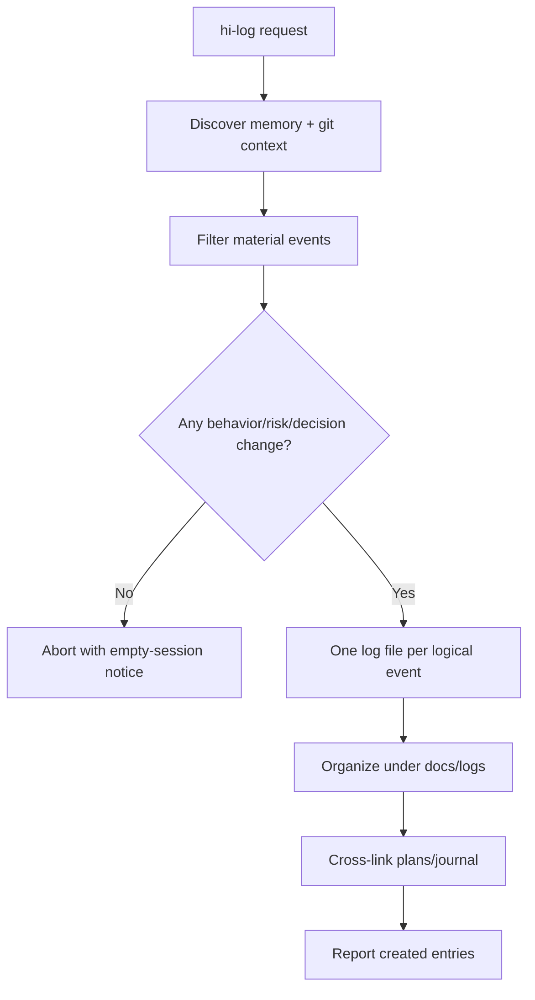
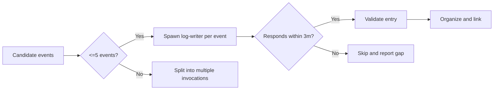
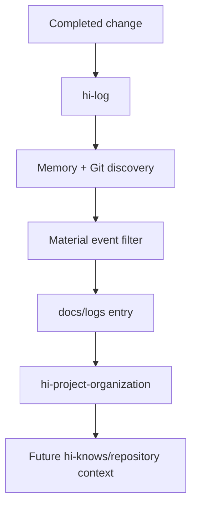

# Hi Log Skill: Hướng dẫn đầy đủ

> `hi-log` ghi lại các thay đổi có ý nghĩa, tác động và quyết định trong một session hoặc một phạm vi công việc. Nó tạo log persistent, ngắn và có reference cụ thể, không tạo daily dump vô nghĩa.

## 1. Mục tiêu

`hi-log` trả lời:

- Điều gì đã kích hoạt công việc?
- Điều gì thực sự thay đổi?
- File/commit nào chứng minh thay đổi?
- Ai hoặc thành phần nào bị ảnh hưởng?
- Vì sao chọn cách này?
- Alternative nào đã được cân nhắc?
- Còn risk/follow-up nào?

Log là artifact lịch sử và decision record. Task/session state có thể biến mất; log dưới `./docs/logs/` giúp người khác hiểu lại thay đổi sau này.

## 2. Scope và output

- Output directory: `./docs/logs/`.
- Một logical event = một file.
- Filename: `YYYY-MM-DD-<slug>.md`.
- Slug: kebab-case, tối đa 60 ký tự, không collision date prefix.
- Tối đa 5 events mỗi invocation.
- Log-writer chỉ read source, được tạo file log và cập nhật log hiện có khi cần correction.



## 3. Cú pháp

```text
/hi-log
/hi-log <topic>
/hi-log <topic> --since <ref>
/hi-log <topic> --scope <dir>
/hi-log <topic> --since <ref> --scope <dir>
```

| Input | Ý nghĩa |
|---|---|
| Không có topic | Tóm tắt session gần nhất |
| `<topic>` | Chỉ log một area như `auth`, `ci`, `release` |
| `--since <ref>` | Chỉ lấy thay đổi sau Git ref/SHA/date; mặc định 24h |
| `--scope <dir>` | Giới hạn exploration vào directory |

`--since` và `--scope` là filters cho discovery, không phải text trang trí trong log.

## 4. Workflow

### Phase 1: Discover

Pull context từ:

- claude-mem/recent observations;
- `git diff`;
- `git log`;
- scope/since filters;
- `hi-codebase-research-explorer` nếu scope mơ hồ.

Mục tiêu là thu event candidates, không viết log ngay khi thấy một diff.

### Phase 2: Filter

Giữ những event:

- thay đổi behavior;
- sửa risk/bug;
- ghi lại architecture/product/operational decision;
- có impact cần future readers biết.

Bỏ noise:

- formatting trivial;
- regenerate-only commit;
- no-op refactor;
- session không có material change.

### Phase 3: Write

Spawn log-writer theo contract. Mỗi logical event một file. Mọi entry bắt buộc có:

- Context;
- Change;
- Impact;
- Decision;
- References.

### Phase 4: Organize

Chạy `/hi-project-organization` để:

- bảo đảm logs nằm dưới `./docs/logs/`;
- kiểm tra naming;
- liên kết plans/journal;
- không tạo monolithic daily dump.

## 5. Empty-session gate

> Không log session rỗng.

Nếu không có thay đổi material:

```text
No material changes found in the requested scope/window; no log created.
```

Không tạo file với nội dung “nothing happened”. Điều đó làm nhiễu lịch sử và khiến log count không còn ý nghĩa.

## 6. Log format

```markdown
# <Title> — YYYY-MM-DD
## Context
What triggered this work (bug, request, plan link).
## Change
What changed, with `file:line` references.
## Impact
Who/what is affected. Risk level (low/med/high).
## Decision
Why this approach. Alternatives considered.
## References
- plan: ./plans/<id>/plan.md
- commit: <full sha>
- memory: <obs-id>
```

### 6.1 Context

Nêu trigger:

- bug/error;
- user request;
- plan/phase;
- incident;
- release/deployment.

### 6.2 Change

Mô tả behavior/file thay đổi. Reference dùng `path/to/file.ts:LINE` hoặc commit full SHA, không chỉ nói “đã sửa auth”.

### 6.3 Impact

Bắt buộc. Ghi:

- affected users/services/files;
- risk level: `low`, `med`, `high`;
- compatibility/deployment implication;
- known limitation.

### 6.4 Decision

Ghi rationale, không chỉ outcome:

- vì sao approach này;
- alternative nào bị loại;
- constraint/trade-off;
- assumption còn lại.

### 6.5 References

Cross-link:

- `./plans/<id>/plan.md`;
- commit full SHA;
- memory observation ID;
- issue/release nếu có.

## 7. Quality contract

- Mọi entry có đủ 5 sections bắt buộc.
- Impact không được `TBD`.
- File references có line hoặc commit đầy đủ.
- Không log secret/plaintext credentials.
- Nếu section không có gì để nói, omit file nếu event không còn material.
- Cross-link plan khi change trace về plan.
- Không edit source code/config.

## 8. Git và memory evidence

Discovery phải xem summary trước detail:

```bash
git log --oneline --decorate -20 -- <path>
git show <commit> --stat --format="%h %s"
git diff -- <scope>
```

Sau đó đọc detail cần thiết. Git output dài nên normalize trước synthesis bằng `git-normalize.js` khi repository có script tương ứng.

Memory giúp biết recent observations, nhưng mọi claim change quan trọng vẫn nên có file/commit reference.

## 9. Timeout và delegation

- Log-writer timeout: 3 phút mỗi spawn.
- Non-responder: skip, không retry vô hạn.
- Tối đa 5 events/invocation.
- Scope mơ hồ: dùng explorer trước.
- Log-writer read-only trên source; chỉ tạo/update logs.



## 10. Verify hi-log

- [ ] Empty session không tạo file.
- [ ] Mỗi logical event là một file.
- [ ] Filename đúng `YYYY-MM-DD-<slug>.md`.
- [ ] Có Context, Change, Impact, Decision, References.
- [ ] Impact có low/med/high.
- [ ] File reference có `path:line` hoặc full SHA.
- [ ] Không có secret.
- [ ] Plan links dùng path đúng.
- [ ] Tối đa 5 events.
- [ ] Log nằm ở `docs/logs/` sau organization.

## 11. Quan hệ với skill khác



- `hi-craft` gọi log sau finalize.
- `hi-plan` có thể log plan decisions.
- `hi-fix`/`hi-debug` log root cause và remediation.
- `hi-project-organization` quản lý vị trí/index.
- `hi-knows` có thể dùng logs làm historical evidence.

## 12. Ví dụ

```markdown
# Refresh token reuse guard — 2026-08-14
## Context
Security follow-up from plans/260814-token-rotation/plan.md.
## Change
Added server-side token-family reuse detection in `src/auth/refresh.ts:84`.
## Impact
Affected browser refresh flow; risk high because replayed tokens now revoke the family.
## Decision
Reuse existing session store instead of adding a second cache. This keeps revocation atomic; a separate cache was rejected because stale state could weaken enforcement.
## References
- plan: ./plans/260814-token-rotation/plan.md
- commit: 0123456789abcdef0123456789abcdef01234567
```

## 13. Giới hạn

- Log không thay thế test hoặc code review.
- Memory observation có thể thiếu hoặc stale.
- `git diff` không tự nói impact; cần synthesis.
- Một event lớn có thể cần nhiều log files theo logical boundary.
- Log chỉ đáng tin khi references cụ thể và rationale được bảo toàn.

## 14. Tóm tắt

> `hi-log` biến thay đổi có ý nghĩa thành các event log nhỏ, có impact và rationale rõ, để lịch sử project giữ lại quyết định chứ không chỉ giữ lại diff.
