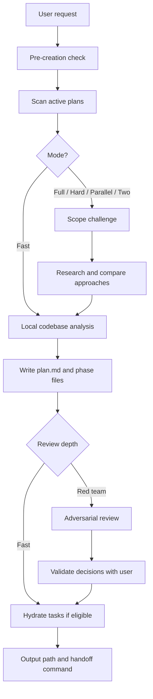
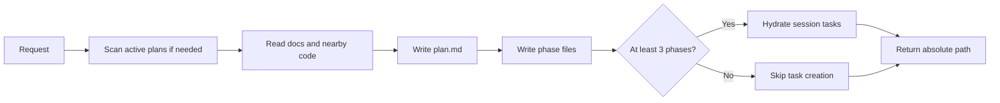
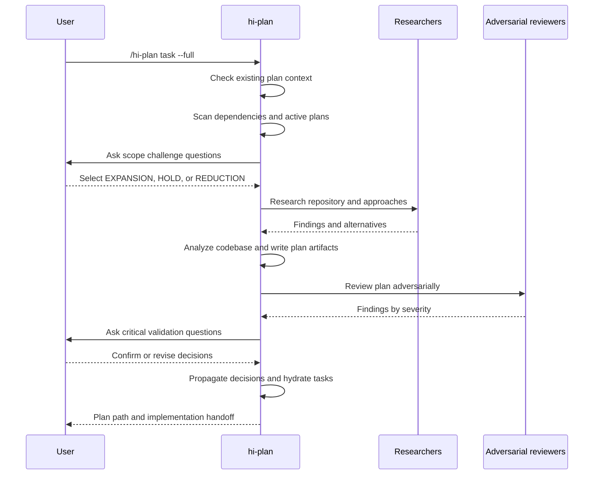
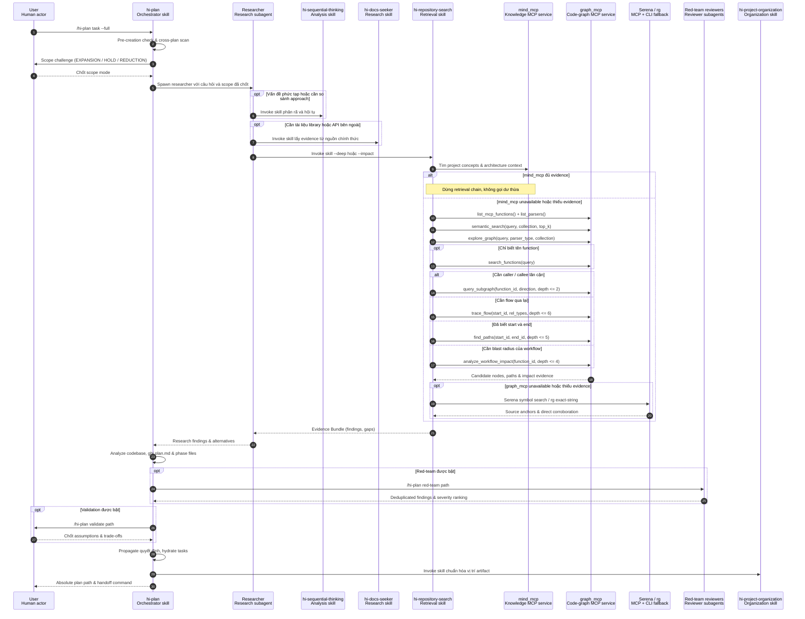
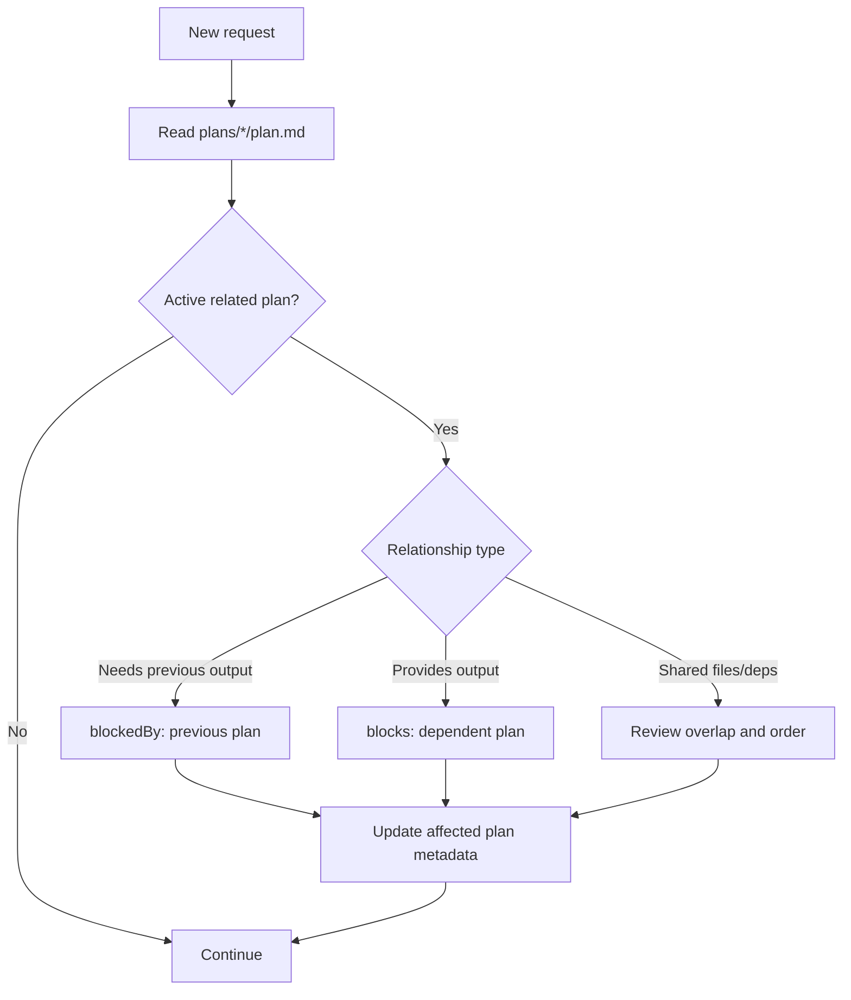
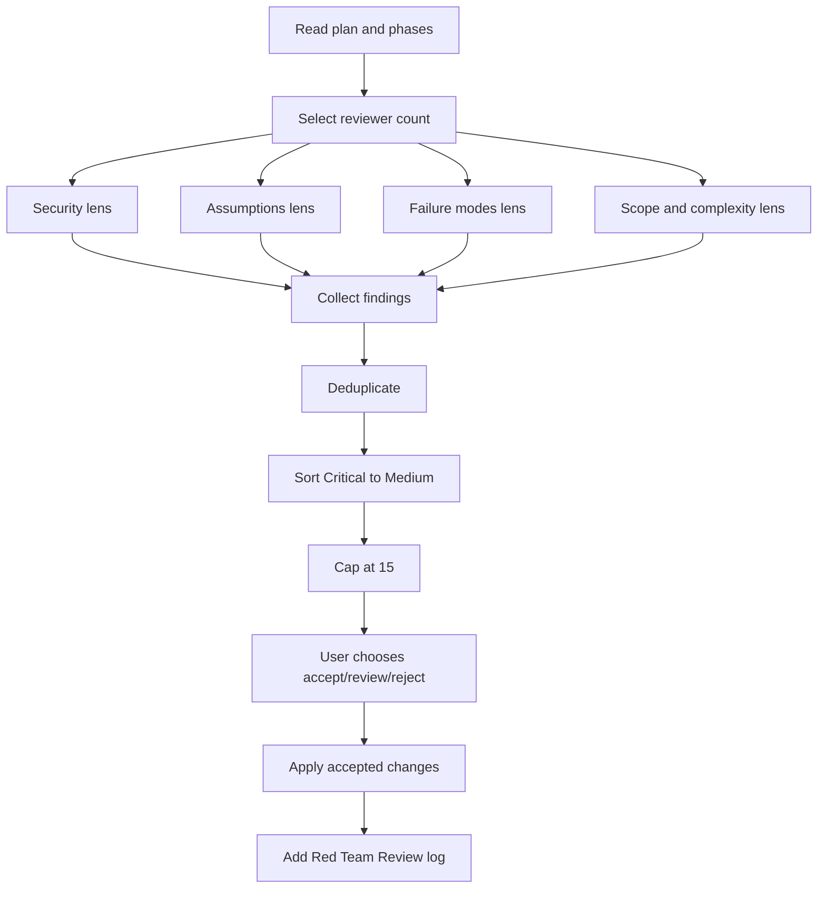
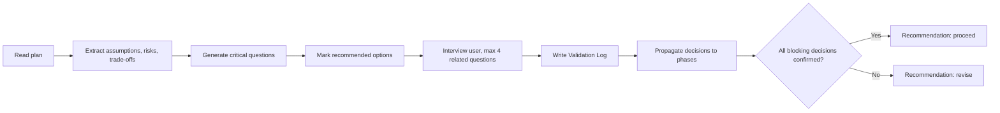
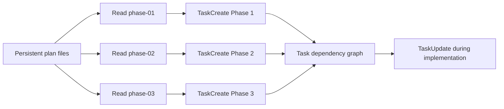
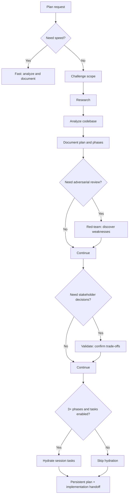

# Hi Plan Skill: Hướng dẫn đầy đủ

> `hi-plan` là skill dùng để biến một yêu cầu kỹ thuật thành một kế hoạch triển khai có cấu trúc, có bằng chứng, có kiểm tra rủi ro và có thể bàn giao cho bước implementation. Nó không chỉ tạo một file `plan.md`.

## 1. Hi Plan giải quyết vấn đề gì?

Khi nhận một yêu cầu như “thêm chức năng đăng nhập”, có nhiều câu hỏi phải được trả lời trước khi viết code:

- Chức năng nào đã tồn tại và có thể tái sử dụng?
- Những file, module, API hoặc dependency nào bị ảnh hưởng?
- Có plan khác đang làm việc trên cùng vùng code không?
- Phạm vi tối thiểu là gì? Phần nào nên hoãn?
- Kiến trúc nào phù hợp và trade-off là gì?
- Giả định nào có thể sai trong production?
- Làm sao kiểm tra rằng plan đủ chi tiết để người khác triển khai?
- Các task triển khai cần phụ thuộc nhau theo thứ tự nào?

`hi-plan` tổ chức các câu hỏi đó thành một workflow nhiều bước. Đầu ra cuối cùng là một nhóm file plan persistent, có thể được `hi-craft` hoặc developer dùng làm hợp đồng triển khai.

## 2. Mental model tổng quát

Có thể xem `hi-plan` như một pipeline gồm bốn lớp:

1. **Context**: hiểu yêu cầu, repository và các plan đang tồn tại.
2. **Design**: xác định scope, nghiên cứu phương án và thiết kế phases.
3. **Challenge**: tìm rủi ro bằng red-team và xác nhận quyết định bằng validate.
4. **Handoff**: ghi artifact, hydrate tasks trong session và bàn giao sang implementation.



## 3. Cú pháp

### 3.1 Tạo plan

```text
/hi-plan <task>
/hi-plan <task> --full
/hi-plan <task> --hard
/hi-plan <task> --parallel
/hi-plan <task> --two
/hi-plan <task> --no-tasks
```

`<task>` là mô tả mục tiêu cần lập kế hoạch. Plan được tạo trong **current working project directory**, không phải trong home directory của người dùng.

### 3.2 Các subcommand trên plan đã có

```text
/hi-plan red-team <path-to-plan>
/hi-plan validate <path-to-plan>
/hi-plan archive
```

- `red-team` review đối kháng một plan đã tồn tại.
- `validate` phỏng vấn người dùng/stakeholder để chốt các giả định và trade-off.
- `archive` dọn các plan đã hoàn thành hoặc được chọn để lưu trữ.

## 4. Cờ và mode

### 4.1 Bảng tổng hợp

| Mode | Research | Red team | Validation | Mục đích |
|---|---:|---:|---:|---|
| Mặc định / fast | Không | Không | Không | Tạo plan nhanh dựa trên context cục bộ |
| `--full` | 1 researcher | Theo full flow | Theo full flow | Pipeline đầy đủ từ scope đến review |
| `--hard` | 2 researchers | Có | Tùy chọn | Yêu cầu phân tích sâu và phản biện |
| `--parallel` | 2 researchers | Có | Tùy chọn | Nghiên cứu song song, phù hợp vấn đề lớn |
| `--two` | 2+ researchers | Sau khi chọn approach | Sau khi chọn approach | So sánh nhiều hướng rồi mới chốt |
| `--no-tasks` | Theo mode | Theo mode | Theo mode | Không tạo tasks session-scoped sau khi ghi plan |

`--no-tasks` là modifier, có thể kết hợp với các mode khác, ví dụ:

```text
/hi-plan add audit logging --full --no-tasks
```

### 4.2 Fast mode

Fast mode là mặc định khi không truyền cờ. Nó bỏ qua research, scope challenge, red-team và validation để ưu tiên tốc độ.

Flow thực tế:



Fast mode phù hợp khi:

- yêu cầu nhỏ hoặc đã rõ;
- người dùng cần một draft nhanh;
- research đã được cung cấp từ trước;
- plan sẽ được review thủ công ở bước sau.

Fast mode **không có nghĩa là plan đã được verify toàn diện**. Nó chỉ có nghĩa là các bước review mở rộng được bỏ qua.

### 4.3 `--full`

Full flow bổ sung các bước trước và sau việc ghi plan:

1. Pre-creation check.
2. Cross-plan scan.
3. Scope challenge.
4. Research.
5. Codebase analysis.
6. Ghi `plan.md` và `phase-*.md`.
7. Red-team review.
8. Validation interview.
9. Hydrate tasks nếu đủ số phase.
10. Trả output path và craft handoff.



#### 4.3.1 Sequence đầy đủ đến mức skill và hàm MCP

Trong diagram ở trên, `Researchers` là **vai trò agent**, không phải tên một skill. Theo contract hiện tại, researcher có thể gọi ba skill được nêu rõ trong research phase:

- `hi-repository-search` để lấy evidence từ repository;
- `hi-docs-seeker` để kiểm tra documentation bên ngoài;
- `hi-sequential-thinking` khi cần phân rã hoặc so sánh vấn đề phức tạp.

`hi-repository-search` mới là lớp định tuyến xuống `mind_mcp`, `graph_mcp`, Serena và `rg`. Các hàm `graph_mcp` trong nhánh dưới đây là **theo intent**, không phải mọi hàm đều luôn được gọi trong một run.



##### 4.3.1.1 Actor types

Trong sequence diagram, dòng đầu là actor identity và dòng thứ hai là actor type/title. `Skill` là behavior package được current agent hoặc một subagent nạp để thực thi; `SubAgent` là agent runtime riêng được spawn với một scope cụ thể.

| Actor | Type / title | Runtime behavior | SubAgent? |
|---|---|---|---:|
| User | Human actor | Gửi planning request, chọn scope và xác nhận trade-off | Không |
| `hi-plan` | **Orchestrator skill** | Chạy trong current/root agent, giữ workflow state và tổng hợp plan | Không |
| Researcher | Research subagent | Được `hi-plan` spawn để điều tra một approach hoặc một research lens | **Có** |
| `hi-sequential-thinking` | Analysis skill | Chạy như capability bên trong researcher khi cần phân rã hoặc so sánh approach | Không |
| `hi-docs-seeker` | Research skill | Chạy trong researcher để lấy documentation từ nguồn chính thức | Không |
| `hi-repository-search` | Retrieval skill | Chạy trong researcher để thu thập repository evidence và điều phối retrieval chain | Không theo flow này |
| `mind_mcp` | Knowledge MCP service | Cung cấp project documents, concepts và architecture context | Không |
| `graph_mcp` | Code-graph MCP service | Cung cấp semantic candidates, relationships, paths và impact evidence | Không |
| Serena / `rg` | MCP + CLI fallback tools | Serena xác nhận symbol/reference; `rg` xử lý exact-string gap cuối cùng | Không |
| Red-team reviewers | Reviewer subagents | Được subcommand `red-team` spawn theo security, assumption, failure hoặc scope lens | **Có** |
| `hi-project-organization` | Organization skill | Được current agent invoke để chuẩn hóa vị trí và cấu trúc artifact | Không |

Một actor mang tên skill không đồng nghĩa với SubAgent. Trong flow này, chỉ `Researcher` và `Red-team reviewers` là agent runtime riêng; các skill còn lại chạy trong current/root agent hoặc trong researcher subagent đã tồn tại.

Các ranh giới cần hiểu đúng:

- Researcher **không mặc định gọi** `hi-codebase-research-explorer`; contract của `hi-plan` hiện không khai báo routing đó.
- Red-team reviewer là agent chạy hostile lens trong `/hi-plan red-team`; contract không nói reviewer tự động gọi `hi-security`.
- `semantic_search` tạo candidate. Relationship chỉ được coi là evidence sau `explore_graph`, graph traversal hoặc source corroboration.
- `query_subgraph`, `trace_flow`, `find_paths` và `analyze_workflow_impact` là các nhánh lựa chọn theo câu hỏi; không chạy tuần tự tất cả.
- Khi runtime schema khác tài liệu, response từ `list_mcp_functions()` là authority; không hardcode tham số cũ.

Nguồn đối chiếu: [`hi-plan/SKILL.md`](../../hi-plan/SKILL.md), [`research-phase.md`](../../hi-plan/references/research-phase.md), [`red-team-workflow.md`](../../hi-plan/references/red-team-workflow.md), [`hi-repository-search/SKILL.md`](../../hi-repository-search/SKILL.md), và [`code_graph.md`](../../hi-repository-search/references/code_graph.md).

### 4.4 `--hard`

`--hard` dùng hai researcher và bật red-team. Đây là mode phù hợp với:

- thay đổi cross-module;
- authentication, authorization, payment, data migration;
- plan có nhiều phase hoặc nhiều dependency;
- thay đổi có rủi ro production cao.

Validation vẫn có thể được chạy sau đó khi cần người dùng chốt các lựa chọn nghiệp vụ hoặc kiến trúc.

### 4.5 `--parallel`

`--parallel` cũng dùng hai researcher và red-team, nhưng nhấn mạnh việc điều tra song song. Mỗi researcher nên có một lens khác nhau, ví dụ:

- researcher A: code path, dependency và implementation pattern hiện tại;
- researcher B: alternative architecture, failure modes và documentation.

Parallel không đồng nghĩa với “mọi thứ chạy song song”. Các bước cần quyết định trước, như scope challenge, và các bước cần tổng hợp, như plan synthesis, vẫn phải có thứ tự.

### 4.6 `--two`

`--two` dành cho trường hợp chưa nên commit ngay vào một kiến trúc. Workflow tạo từ hai hướng tiếp cận trở lên, sau đó:

1. trình bày các approach;
2. nêu trade-off, chi phí và rủi ro;
3. để người dùng chọn;
4. red-team và validate approach đã chọn;
5. viết plan theo quyết định cuối.

Không nên dùng `--two` chỉ để tạo thêm tài liệu. Nó có giá trị khi lựa chọn kiến trúc thực sự chưa rõ.

### 4.7 `--no-tasks`

Mặc định, `hi-plan` cố gắng chuyển phases thành tasks trong task manager của session hiện tại. `--no-tasks` bỏ qua bước này.

Dùng cờ này khi:

- chỉ cần artifact cho review;
- task manager hiện tại không hỗ trợ;
- plan có ít phase;
- muốn hydrate tasks ở session khác.

Lưu ý quan trọng:

- plan files là **persistent**;
- tasks là **session-scoped**, có thể biến mất khi session kết thúc;
- checklist trong phase files là nguồn có thể re-hydrate tasks ở session sau.

## 5. Các bước nội bộ

### Bước 1: Pre-creation check

Skill xác định context của request trước khi viết:

- current working project directory;
- plan directory hiện có;
- plan nào đang pending/in progress;
- task có liên quan hoặc kế thừa output từ plan khác không;
- có instruction như `docs/development-rules.md` cần tuân thủ không.

Nếu context không rõ, workflow có thể yêu cầu người dùng làm rõ thay vì tự tạo một plan sai hướng.

### Bước 2: Cross-plan dependency scan

Skill quét `plans/*/plan.md` và tập trung vào các plan chưa `completed` hoặc `cancelled`.

Nó tìm ba kiểu quan hệ:

| Quan hệ | Ý nghĩa | Xử lý |
|---|---|---|
| `blockedBy` | Plan mới cần output của plan cũ | Ghi plan cũ vào `blockedBy` |
| `blocks` | Plan mới tạo output cho plan khác | Ghi plan liên quan vào `blocks` |
| Overlap | Hai plan sửa cùng file, module hoặc dependency | Đánh giá thứ tự và cập nhật cả hai nếu cần |

Dependency phải được ghi hai chiều khi phù hợp. Nếu chỉ ghi một phía, người đọc ở plan còn lại sẽ không biết có ràng buộc mới.



### Bước 3: Scope challenge

Scope challenge chạy trước research trong các mode mở rộng. Nó ép người lập plan trả lời ba câu hỏi:

1. **What already exists?** Có thể reuse gì?
2. **What's the minimum change set?** Phần nào là bắt buộc, phần nào defer được?
3. **Complexity check** Nếu vượt quá 8 file, 2 class mới hoặc 3 phase, lý do là gì?

Sau đó chọn một hướng:

| Lựa chọn | Hành vi |
|---|---|
| `EXPANSION` | Cho phép `--hard` hoặc `--two`, nghiên cứu alternatives và stretch goals |
| `HOLD` | Giữ scope, tập trung edge cases và test coverage |
| `REDUCTION` | Dùng phiên bản tối thiểu, hoãn phần không blocking |

Quyết định scope phải được giữ xuyên suốt workflow. Không được âm thầm mở rộng scope sau khi đã chọn `REDUCTION`.

### Bước 4: Research

Research bị bỏ qua trong fast mode hoặc khi đã có researcher reports. Với mode cần research, các hướng điều tra có thể gồm:

- scan codebase và tìm implementation hiện tại;
- đọc documentation liên quan;
- dùng sequential thinking cho vấn đề phức tạp;
- xem lịch sử Git, issue, PR hoặc CI khi cần;
- so sánh nhiều approach;
- ghi lại edge cases, security và performance implications.

Research không phải là một bước để thu thập thật nhiều thông tin. Mục tiêu là cung cấp bằng chứng cho quyết định trong plan.

### Bước 5: Codebase analysis

Đây là bước nối research với implementation. Plan cần chỉ ra:

- module/file liên quan;
- điểm vào của behavior;
- data flow và dependency;
- pattern hiện tại nên reuse;
- file cần create/modify/delete;
- test và verification point;
- rủi ro hoặc assumption còn mở.

Nếu một file chỉ forwarding hoặc wiring, cần lần đến abstraction trực tiếp quyết định behavior thay vì dừng ở file trung gian.

### Bước 6: Plan documentation

Một plan tối thiểu gồm:

```text
plans/{plan-dir}/
├── plan.md
├── phase-01-name.md
└── phase-02-name.md
```

`plan.md` là index và contract cấp cao. Mỗi `phase-*.md` là một đơn vị triển khai cụ thể.

## 6. Cấu trúc artifact và output

### 6.1 `plan.md`

Frontmatter chuẩn:

```yaml
title: "Brief plan title"
description: "One-sentence summary"
status: pending
priority: P2
effort: 4h
issue: 74
branch: kai/feat/feature-name
tags: [frontend, api]
blockedBy: []
blocks: []
created: 2025-12-16
```

Một số field có thể được auto-populate:

- `title`: từ task;
- `description`: câu đầu của Overview;
- `status`: mặc định `pending`;
- `priority`: từ user hoặc `P2`;
- `effort`: tổng effort của phases;
- `issue`: từ branch nếu có;
- `branch`: branch hiện tại;
- `tags`: suy ra từ keyword;
- `blockedBy`/`blocks`: từ cross-plan scan;
- `created`: ngày hiện tại.

Body của `plan.md` nên ngắn, thường dưới 80 dòng:

```markdown
# Plan

## Overview

## Phases
| Phase | Name | Status |
|---|---|---|
| 1 | [Setup](./phase-01-setup.md) | Pending |
```

Sau review, file có thể có thêm:

- `## Red Team Review`;
- `## Validation Log`;
- quyết định về rejected/accepted findings;
- unresolved questions hoặc revised assumptions.

### 6.2 `phase-*.md`

Mỗi phase cần đủ thông tin để một developer khác có thể triển khai mà không phải đoán:

1. context links;
2. overview, priority, status, description;
3. key insights từ research;
4. functional và non-functional requirements;
5. architecture, components, data flow;
6. related code: create/modify/delete;
7. implementation steps đánh số cụ thể;
8. success criteria / definition of done;
9. risk assessment và mitigation.

### 6.3 Output cuối workflow

Output thông thường gồm:

- absolute path tới plan directory;
- danh sách phase đã tạo;
- trạng thái task hydration hoặc lý do skip;
- nếu có full flow: review/validation summary;
- craft handoff command để chuyển sang bước implementation.

Plan là output persistent trên filesystem. Task list chỉ là output phụ trong session hiện tại.

## 7. Red-team và validate khác nhau thế nào?

### 7.1 Red-team: tìm vấn đề

Lệnh:

```text
/hi-plan red-team <path>
```

Các bước:

1. đọc `plan.md` và mọi `phase-*.md`;
2. scale số reviewer theo số phase;
3. chạy các lens đối kháng;
4. gom, deduplicate và xếp severity;
5. giới hạn tối đa 15 findings;
6. đề xuất `Accept` hoặc `Reject`;
7. hỏi người dùng cách xử lý;
8. áp dụng finding được chấp nhận vào phase files;
9. thêm `## Red Team Review` vào `plan.md`.

Reviewer lenses:

| Lens | Câu hỏi chính |
|---|---|
| Security adversary | Có injection, auth bypass, data exposure không? |
| Assumption destroyer | Giả định nào không có bằng chứng hoặc có thể sai? |
| Failure mode analyst | Điều gì hỏng trong production? Timeout, retry, partial failure ra sao? |
| Scope/complexity critic | Có over-engineering hoặc scope creep không? |

Số reviewer theo phase:

| Số phase | Reviewer |
|---:|---:|
| 1-2 | 2: Security + Assumptions |
| 3-5 | 3: thêm Failure Modes |
| 6+ | 4: thêm Scope/Complexity |



Red-team không phải là test runtime và cũng không tự quyết định thay người dùng. Nó tạo evidence và đề xuất; user review là một gate riêng.

### 7.2 Validate: chốt quyết định

Lệnh:

```text
/hi-plan validate <path>
```

Các bước:

1. đọc plan và phases;
2. tìm assumptions, risks và trade-offs;
3. tạo critical questions;
4. đánh dấu recommended option cho mỗi câu hỏi;
5. hỏi user theo nhóm, tối đa 4 câu mỗi lần;
6. ghi câu trả lời vào `## Validation Log`;
7. propagate quyết định vào các phase bị ảnh hưởng;
8. kết luận `proceed` hoặc `revise`.

Red-team hỏi: **“Plan này có thể sai ở đâu?”**

Validate hỏi: **“Với các lựa chọn đang có, stakeholder xác nhận lựa chọn nào?”**

Ví dụ:

- Red-team phát hiện assumption rằng API luôn trả response hợp lệ.
- Validate hỏi có cần xử lý malformed response không, retry bao nhiêu lần, và trade-off latency nào được chấp nhận.



## 8. Verify như thế nào?

### 8.1 Verify ở cấp workflow

`hi-plan` không phải một test runner. Trong các tài liệu hiện tại, “verify” chủ yếu là kiểm tra tính đầy đủ và nhất quán của planning artifact qua các gate:

| Gate | Kiểm tra |
|---|---|
| Context gate | Đã đọc đúng project và active plans chưa? |
| Dependency gate | `blockedBy`/`blocks` và overlap có được nhận diện không? |
| Scope gate | Scope có được giới hạn và có lý do cho complexity không? |
| Research gate | Quyết định có evidence hoặc comparison không? |
| Architecture gate | Data flow, module ownership và related code có rõ không? |
| Red-team gate | Security, assumptions và failure modes đã bị challenge chưa? |
| Validation gate | Stakeholder đã xác nhận trade-off blocking chưa? |
| Handoff gate | Phase có implementation steps và success criteria không? |
| Task gate | Tasks có map đúng phase và dependency không? |

### 8.2 Checklist verify thủ công

Trước khi bàn giao, người review nên kiểm tra:

- `plan.md` có frontmatter hợp lệ không;
- mọi link tới `phase-*.md` có tồn tại không;
- mỗi phase có success criteria cụ thể không;
- related code có phân biệt create/modify/delete không;
- phase dependencies có thứ tự hợp lý không;
- effort tổng có khớp các phase không;
- assumptions quan trọng đã có owner hoặc validation decision chưa;
- red-team findings accepted đã được propagate chưa;
- `Validation Log` có ghi quyết định và tác động không;
- plan không chứa implementation details mâu thuẫn với codebase;
- output path là path trong current project, không phải home directory.

### 8.3 Verify sau khi chuyển sang implementation

`hi-plan` tạo kế hoạch, không thực hiện code. Sau handoff, skill implementation như `hi-craft` mới chạy:

```text
Plan -> Implement -> Test -> Finalize
```

Vì vậy cần phân biệt:

- `hi-plan` verify **plan readiness**;
- `hi-craft` hoặc developer verify **behavior bằng test, lint, typecheck, build**;
- runtime/CI verify **integration và production constraints**.

## 9. Task hydration và dependency

Khi có từ 3 phase trở lên, workflow có thể tạo một task cho mỗi phase. Task nên có:

- `subject`: imperative, dưới 60 ký tự;
- `activeForm`: dạng continuous;
- `description`: deliverable cụ thể và link tới phase;
- metadata: phase, priority, effort, plan directory, phase file.

Mapping:



Ví dụ dependency:

```text
Phase 1: Database migration
Phase 2: API changes        blockedBy: Phase 1
Phase 3: UI integration     blockedBy: Phase 2
```

Nếu sang session mới, task list có thể rỗng. Khi đó re-hydrate từ các checkbox và phase files chưa hoàn thành.

## 10. Archive workflow

Lệnh:

```text
/hi-plan archive
```

Archive không tự động đồng nghĩa với delete. Workflow cần:

1. đọc `plan.md` và phần đầu của phase files;
2. hỏi có ghi log bằng `hi-log` không;
3. hỏi archive plan cụ thể hay tất cả plan completed;
4. hỏi move vào `plans/archive` hay delete vĩnh viễn;
5. thực hiện lựa chọn;
6. tùy chọn stage/commit/push nếu user yêu cầu.

Output:

- số plan archived/deleted;
- bảng title, status, created date;
- log/journal entries đã tạo.

## 11. Khi nào dùng mode nào?

| Tình huống | Khuyến nghị |
|---|---|
| Một thay đổi nhỏ, pattern rõ | Fast |
| Feature thông thường cần research và review | `--full` |
| Security hoặc production risk cao | `--hard` |
| Nhiều hướng điều tra độc lập | `--parallel` |
| Chưa biết nên chọn kiến trúc nào | `--two` |
| Chỉ muốn artifact, không cần task session | `--no-tasks` |
| Plan đã tồn tại và muốn phá các assumption | `red-team` |
| Plan đã tồn tại nhưng cần stakeholder chốt trade-off | `validate` |
| Plan đã hoàn tất và cần dọn workspace | `archive` |

## 12. Các giới hạn và điểm cần hiểu đúng

### 12.1 Full flow không thay thế runtime testing

Ngay cả plan có research, red-team và validate, nó vẫn chưa chứng minh code chạy đúng. Cần test ở bước implementation.

### 12.2 Red-team và validate cần user participation

Red-team đưa ra findings và đề xuất, nhưng user chọn apply/review/reject. Validate cần câu trả lời của stakeholder; nếu chưa có câu trả lời cho decision blocking, recommendation phải là `revise`.

### 12.3 Task không phải source of truth duy nhất

Task manager có tính session-scoped. Artifact trong `plans/` mới là phần persistent có thể review, version-control và re-hydrate.

### 12.4 Scope có thể thay đổi có kiểm soát

Scope change nên được ghi lại trong plan, cùng lý do và tác động tới phases, effort, dependency và success criteria. Không nên silently add work trong phase.

### 12.5 Tài liệu hiện tại có một điểm cần diễn giải

Bảng mode mô tả red-team trong `--full` là “Optional”, trong khi full process flow liệt kê bước red-team và validate như các bước của flow. Khi vận hành, cần hiểu:

- `--hard` và `--parallel` chắc chắn yêu cầu red-team;
- full flow thiết kế để chạy red-team/validate sau khi tạo plan;
- nếu muốn bỏ qua, phải ghi rõ lý do hoặc dùng fast mode thay vì gọi đó là full verification.

## 13. Ví dụ end-to-end

Giả sử yêu cầu là: “Thêm audit log cho mọi thay đổi quyền của user”.

```text
/hi-plan add audit logs for user permission changes --hard
```

Workflow dự kiến:

1. Scan active plans để tìm migration hoặc auth plan liên quan.
2. Scope challenge: chỉ log permission mutation, chưa log mọi user event.
3. Research: tìm auth service, event bus, schema và retention policy hiện tại.
4. Codebase analysis: xác định mutation entry points và transaction boundary.
5. Viết `plan.md` cùng phases cho schema, backend emission, consumer/storage và tests.
6. Red-team tìm data exposure, actor spoofing, missing transaction consistency và log injection.
7. Validate hỏi retention, PII masking, delivery guarantee và query requirements.
8. Propagate câu trả lời vào phases.
9. Hydrate task nếu có từ 3 phase.
10. Bàn giao path cho implementation.

Success criteria của plan không nên chỉ là “audit log được thêm”. Nó cần cụ thể hơn, ví dụ:

- mọi permission mutation path đều được định danh;
- event có actor, target, action, timestamp và correlation ID;
- sensitive fields được mask;
- failure policy được quyết định rõ;
- có test cho duplicate, retry, transaction rollback và unauthorized mutation;
- phase dependency và migration rollout đã được ghi.

## 14. Tóm tắt nhanh



Câu ngắn nhất để nhớ:

> `hi-plan` không chỉ trả lời “làm gì”, mà còn cố gắng trả lời “vì sao làm như vậy, ảnh hưởng đến đâu, điều gì có thể sai, ai cần xác nhận, và làm sao bàn giao để người khác triển khai được”.
