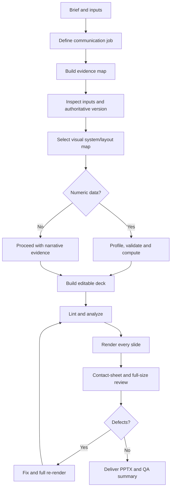
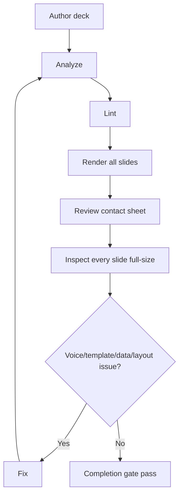
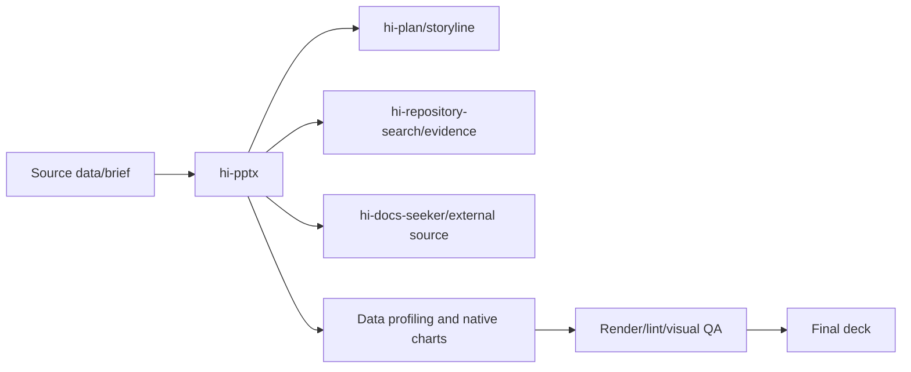

# Hi PPTX Skill: Hướng dẫn đầy đủ

> `hi-pptx` là presentation engine tạo, chỉnh sửa và visually validate PowerPoint client-ready bằng storyline dựa trên evidence, native editable charts, sanitized light design system và quality gates nghiêm ngặt.

## 1. Mục tiêu

Skill phục vụ:

- executive proposal;
- consulting deck;
- architecture/current-state assessment;
- phased roadmap;
- investment options;
- KPI review;
- technical presentation;
- Japanese-customer-facing deck.

Nó không chỉ tạo `.pptx`. Nó phải đồng thời đảm bảo:

- audience và decision rõ;
- mỗi slide có một narrative job;
- claims traceable;
- data tính đúng trước khi design;
- charts/diagrams editable;
- visual hierarchy nhất quán;
- render và inspect mọi slide trước completion.

## 2. Hard outcomes

### Story và evidence

- xác định audience, decision, central takeaway;
- mỗi slide có conclusion-led title;
- phân biệt fact, calculation, assumption, illustrative, unknown;
- không invent metric/quote/case/source;
- external sources/calculation definitions ở speaker notes.

### Visual system

- white/light canvas, dark structural ink, restrained accent;
- chọn layout archetype trước khi custom composition;
- typography/spacing/panels consistent;
- charts/tables/diagrams editable;
- brand assets chỉ dùng khi supplied/authorized.

### Data integrity

- compute first, design second;
- validate unit, denominator, period, missing values, totals, rounding;
- chart theo analytical question;
- highlight một decision-relevant series/point;
- không declare complete trước render/inspect mọi slide.

## 3. Workflow tổng quát



## 4. Intake

Xác định hoặc hỏi khi low-risk:

1. audience/decision makers;
2. meeting objective và decision/action;
3. speaking time/slide count;
4. language/tone/localization;
5. source-of-truth files/data definitions/confidentiality;
6. brand assets có được apply không.

Chỉ hỏi khi thiếu thông tin làm thay đổi:

- claims;
- data interpretation;
- branding;
- storyline.

Nếu không, dùng assumption register rõ ràng.

## 5. Communication job và evidence map

Viết một câu:

```text
By the end, the audience should [action/understanding] because [central takeaway].
```

Evidence map:

| Label | Ý nghĩa |
|---|---|
| Provided fact | Traceable trực tiếp từ input |
| Derived statement | Synthesis/calc reproducible |
| Assumption | Cần nhưng chưa verify |
| Illustrative | Fictional/example, phải label |
| Unknown | Để question/dependency/TBD |

Không lấp hero number bằng metric bịa. Thiếu data thì dùng question/appendix.

## 6. Storyline

Common sequence:

```text
Context → Observed issue → Implication → Proposed response → How it works → Plan → Risks/assumptions → Decision/next step
```

Không ép sequence nếu meeting objective khác. Mỗi slide một primary purpose:

- orient;
- explain;
- compare;
- diagnose;
- recommend;
- decide;
- plan;
- confirm.

### Takeaway title

Title là conclusion/observation, không phải category label.

- yếu: `Current Situation`;
- tốt: `Ba khâu chờ làm chậm mọi phản hồi`.

Title nên một dòng, khoảng <=35 characters theo design system hoặc <=12 words/70 Latin characters theo writing guide, tùy layout hẹp hơn.

Body block tối đa 30-40 words; đưa key point trước; tránh buzzword, cloned bullets và slogan.

## 7. Visual system

### 7.1 60-30-10 light rule

- 60% canvas: white `#FFFFFF` hoặc pearl `#F8FAFC`;
- 30% structure: dark `#0F172A`/`#000000`;
- 10% accent: one hue như indigo, crimson hoặc burnt orange.

Một deck chọn đúng một palette, không trộn palette A/B.

### 7.2 Palette A: Crisp Swiss

- background `#FFFFFF`;
- card `#F1F5F9`;
- primary `#020617`;
- secondary `#64748B`;
- accent `#4F46E5` hoặc `#059669`;
- border `#E2E8F0`.

### 7.3 Palette B: Warm Editorial

- background `#FDFBF7`;
- card `#F3F0E6`;
- primary `#1C1917`;
- secondary `#78716C`;
- accent `#EA580C` hoặc `#DC2626`;
- border `#E7E2D8`.

### 7.4 Hero element

Mỗi slide đúng một focal hero:

- giant metric;
- key quote;
- featured tile;
- stark contrast block.

Nếu hai element cạnh tranh, chuyển một sang slide khác/appendix/notes.

### 7.5 Swiss grid

- canvas 1280×720 px, 16:9;
- 12-column grid;
- padding 60px top/bottom, 80px left/right;
- tối đa 2-3 content blocks;
- có một quiet zone;
- hairline hoặc một soft shadow, không dùng cả hai trên cùng card;
- card radius 16px.

## 8. Layout archetypes

| Layout | Dùng cho | Quy tắc |
|---|---|---|
| Hero Metric | KPI/headline stat | Một giant number, whitespace |
| Stark Editorial Split | Takeaway/chapter | 50/50, một contrast block |
| Tiled Comparison | Framework/strategies | Tối đa 3 tiles, một featured |
| Bold Statement | Quote/vision | Một oversized statement, attribution |

Support layouts cho roadmap, architecture, matrix, risk register nhưng vẫn giữ palette, hierarchy và one-highlight rule.

Không force dense content vào hero layout. Split slide hoặc đưa detail vào appendix.

## 9. Typography và accessibility

- title geometric sans, weight 700/800;
- body readable sans;
- body `.pptx` không dưới 14pt;
- footnote/source tối thiểu 9pt;
- title/body không overflow;
- Vietnamese/Japanese glyphs render đúng;
- font substitution là defect cần verify;
- contrast reading text >=4.5:1;
- không dùng color alone để encode meaning.

Font fallback cần cross-platform; `SF Pro Display` không embed/redistribute, dùng Helvetica Neue/Inter/Arial/Aptos phù hợp.

## 10. Data workflow

Khi có CSV/JSON/table:

1. preserve clean source table;
2. profile bằng `scripts/profile_chart_data.py`;
3. kiểm tra grain, unit, currency, denominator, period, timezone;
4. tìm missing/duplicate/suppressed/estimated/outlier;
5. recalculate totals/shares/deltas/rates;
6. define rounding sau calculation;
7. chọn chart theo analytical question;
8. build native chart;
9. reconcile plotted values với clean table.

Không force chart nếu data không support conclusion; dùng table/question/data-gap slide.

### Chart routing

| Question | Chart |
|---|---|
| Trend over time | Line |
| Category ranking | Horizontal bar |
| Few categories over time | Column |
| Composition | 100% stacked bar |
| Contribution to change | Waterfall |
| Actual vs target | Bar/bullet |
| Relationship | Scatter |
| Distribution | Histogram/box |
| Single decision metric | KPI + small trend |
| Precise values | Table |

Avoid 3D, rainbow, decorative charts, >5-slice doughnut, unjustified dual-axis.

### Chart styling

- primary navy `#1F3864`;
- one highlight orange `#F37021`;
- secondary teal `#127E84`/green `#1E9E54`;
- direct labels when possible;
- zero baseline for bars;
- units/period/source/denominator in notes/footer;
- native editable `slide.charts.add(...)`.

## 11. Implementation

### Native PPTX

- use JavaScript ES modules;
- use `@oai/artifact-tool`;
- 16:9 canvas;
- central design tokens;
- reusable helpers per archetype;
- native charts, not raster screenshots;
- `[Sources]` blocks in notes.

### HTML/CSS route

Có thể dùng cho browser deck, PDF export hoặc prototype:

- canvas 1280×720;
- CSS variables as source of truth;
- self-contained font fallback;
- same palette/layout rules;
- rebuild to editable PowerPoint khi deliverable là `.pptx`.

### Inputs

Nếu user cung cấp deck/template:

- run `analyze_pptx.py`;
- inspect size/layouts/fonts/colors/density/object counts;
- preserve master → layout → slide hierarchy;
- không reconstruct confidential source content.

## 12. QA và completion gate

Automated preflight:

```bash
python scripts/analyze_pptx.py output.pptx --output qa/analysis.json
python scripts/lint_pptx.py output.pptx --output qa/lint.json
python scripts/render_pptx.py output.pptx --output-dir qa/rendered --cols 4
```

Completion chỉ khi:

1. `.pptx` mở thành công;
2. lint không còn unresolved errors;
3. mọi warning được fix hoặc explicitly justify;
4. mọi slide đã render;
5. contact sheet đã review;
6. mọi full-size slide đã inspect;
7. voice gate và template-fidelity gate pass;
8. mọi correction sau đó đã full re-render.



Automated lint là triage, không phải proof visual quality. Không waiver visual defect nếu chưa inspect.

## 13. Voice gate

Kiểm tra mọi title/body:

- không forbidden buzzword/slogan;
- headline là conclusion;
- title một dòng;
- bullet không cloned skeleton;
- không generic marketing claim;
- quote có attribution thật;
- hero number traceable hoặc labeled.

## 14. Template-fidelity gate

Mọi slide:

- primary read rõ;
- navy hierarchy, orange chỉ main decision point;
- map được vào archetype;
- title/key-message/footer/alignment đúng;
- tối đa 3 main options;
- một recommendation highlight;
- chart trong bounded zone;
- contrast đủ;
- white text chỉ trên dark/accent field đủ contrast.

## 15. Visual review

### Contact sheet

Kiểm tra:

- beginning/middle/end;
- section transitions;
- density liên tiếp;
- composition lặp máy móc;
- important slides nổi bật;
- accent có thành wallpaper không;
- final slide có support outcome không.

### Full-size

Kiểm tra:

- clipping/overflow/overlap;
- title/evidence dominance;
- font substitution;
- Vietnamese/Japanese glyphs;
- margin/alignment/card spacing;
- contrast/projector legibility;
- chart labels/axis/source/period;
- diagram reading path;
- no placeholders/TBD ngoài disclosure có chủ ý.

## 16. Output contract

Deliver:

- final `.pptx`;
- short storyline/layout/chart summary;
- unresolved assumptions/missing evidence/editable placeholders;
- contact sheet khi hữu ích cho review.

Không deliver deck hoàn chỉnh nếu chưa render/inspect mọi slide.

## 17. Verify hi-pptx

- [ ] Audience/decision/central takeaway rõ.
- [ ] Evidence map phân biệt fact/calculation/assumption/illustrative/unknown.
- [ ] Source-of-truth input được xác định.
- [ ] Mỗi slide một narrative job.
- [ ] Title conclusion-led và một dòng.
- [ ] Mỗi slide một hero.
- [ ] Palette/layout archetype consistent.
- [ ] Charts native/editable.
- [ ] Data units/denominator/period/rounding đúng.
- [ ] Source/calculation note có mặt.
- [ ] Analyze/lint/render chạy.
- [ ] Contact sheet và full-size slide đã inspect.
- [ ] Warnings được fix/justify.
- [ ] Full re-render sau correction.

## 18. Quan hệ với skill khác



## 19. Giới hạn

- Không invent evidence khi source thiếu.
- Editable chart và visual fidelity có trade-off; ưu tiên editability khi yêu cầu.
- Lint heuristic có false positives/negatives.
- Render cần môi trường/font phù hợp.
- Template supplied override sanitized system nhưng không override evidence/privacy gates.
- Deck đẹp không thay thế data correctness hoặc decision clarity.

## 20. Tóm tắt

> `hi-pptx` không chỉ vẽ slide; nó biến evidence thành một câu chuyện có decision, bố cục có chủ ý, chart editable và chỉ được coi là hoàn tất sau khi render/inspect toàn bộ deck.
