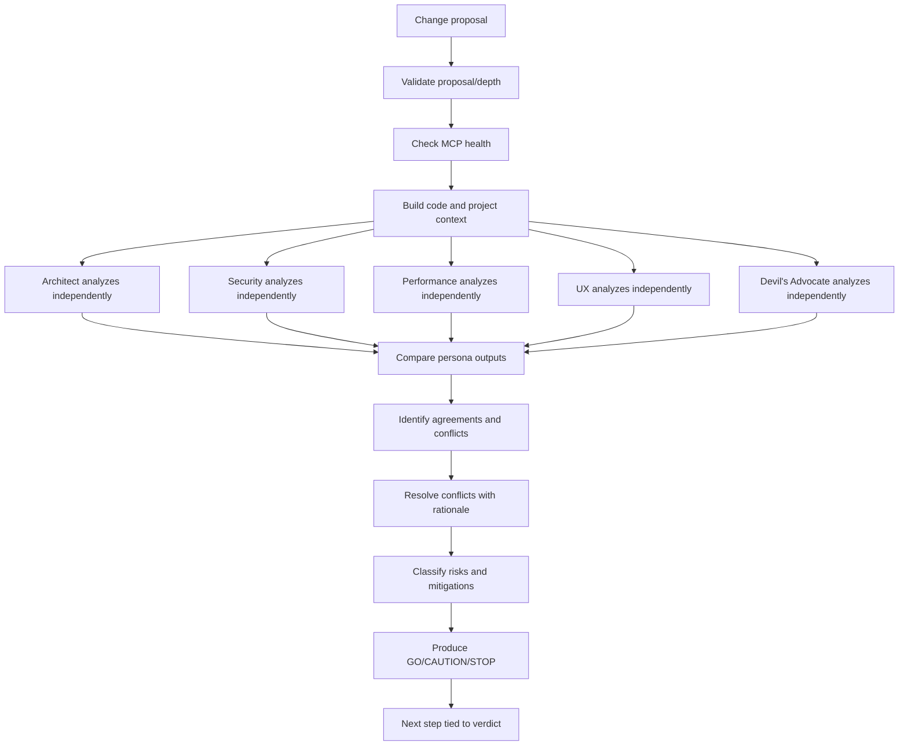
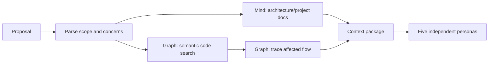
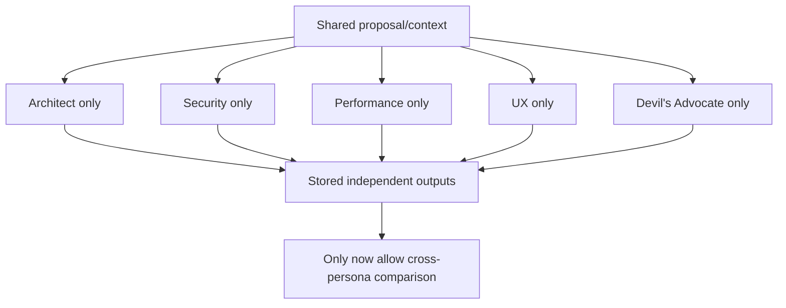
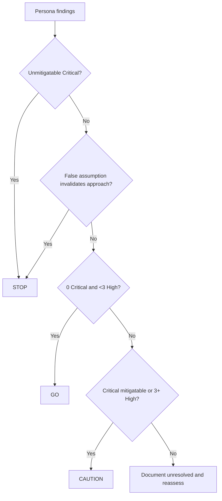
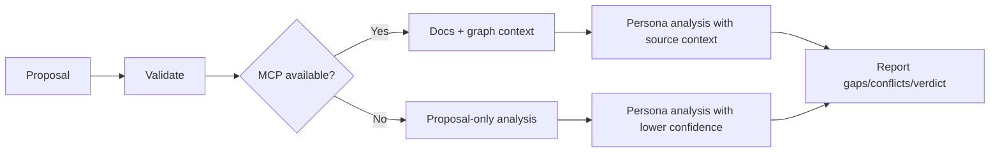
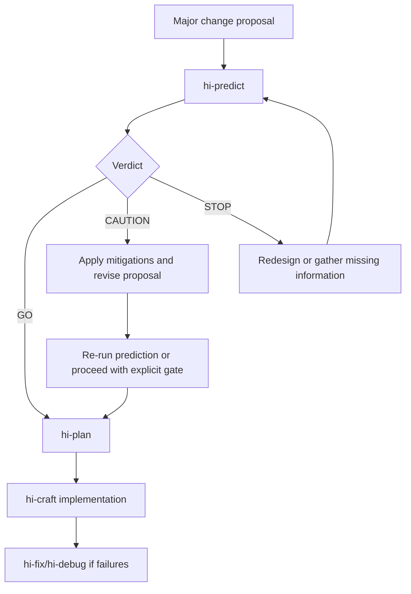
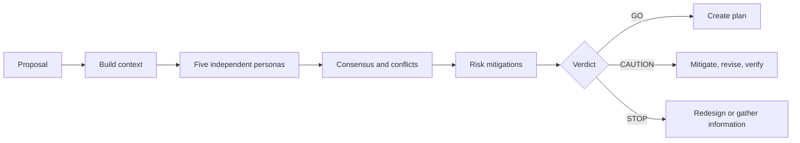

# Hi Predict Skill: Hướng dẫn đầy đủ

> `hi-predict` là pre-analysis gate dùng trước feature lớn, refactor, competing approaches hoặc thay đổi rủi ro cao. Năm persona độc lập phân tích proposal từ các góc architecture, security, performance, UX và assumptions, sau đó debate, resolve conflicts và tạo verdict `GO`, `CAUTION` hoặc `STOP`.

## 1. Hi Predict giải quyết vấn đề gì?

Một proposal có thể nghe hợp lý nhưng chứa rủi ro trước khi dòng code đầu tiên được viết:

- architecture mới tạo coupling hoặc cycle;
- endpoint mở attack surface nhưng thiếu auth;
- query/API call làm tăng latency hoặc N+1;
- UX không có loading/error/empty/accessibility state;
- assumption nền tảng sai;
- scope lớn hơn cần thiết;
- alternative đơn giản hơn chưa được xem xét.

`hi-predict` đưa nhiều lens độc lập vào **trước implementation**, để phát hiện vấn đề khi chi phí thay đổi còn thấp.

Nó không phải:

- code review sau implementation;
- runtime test hoặc performance benchmark;
- thay thế product owner/domain expert;
- quyết định implementation thay cho team;
- guarantee rằng proposal sẽ đúng trong production.

## 2. Mental model tổng quát



## 3. Khi nào dùng?

### 3.1 Nên dùng

- major feature;
- refactor ảnh hưởng nhiều module;
- competing architecture approaches;
- assumption stress-test;
- implementation gate trước code;
- thay đổi authentication/authorization;
- data model/migration;
- payment, compliance hoặc PII;
- hot path/performance-sensitive feature;
- user-facing workflow quan trọng.

### 3.2 Không cần dùng

- trivial change;
- work đã được approve và scope không đổi;
- pure dependency upgrade không có behavior/architecture impact;
- docs-only change;
- thay đổi quá nhỏ đã có verification rõ.

Không nên dùng `hi-predict` để tạo ceremony cho mọi bug nhỏ. Nó có giá trị khi early risk analysis rẻ hơn rework sau implementation.

## 4. Input contract

### 4.1 Proposal

`proposal` phải:

- không rỗng;
- dài 10-5000 ký tự;
- là natural language;
- mô tả change/problem/goal;
- không chỉ là một code snippet không có context.

Proposal tốt:

```text
Add refresh-token rotation for all browser sessions, store token-family
revocation state, and invalidate the family when reuse is detected.
```

Proposal yếu:

```text
function rotateToken() { ... }
```

### 4.2 Optional inputs

- `--files <glob>`: giới hạn files/modules được xem xét;
- concern areas: architecture/security/performance/UX/assumptions;
- `depth`: `quick` hoặc `deep`.

### 4.3 Depth

| Depth | Mục tiêu |
|---|---|
| `quick` | Pre-analysis nhanh cho proposal chính, major risks |
| `deep` | Mở rộng context, code paths, assumptions và conflict analysis |

Quick không có nghĩa bỏ Security persona hoặc Devil's Advocate. Năm persona vẫn là core model; depth điều khiển độ sâu context và analysis.

## 5. Năm persona

| Persona | Focus | Core question |
|---|---|---|
| Architect | System design, scalability, coupling | Có fit architecture và scale mà không tạo coupling mới không? |
| Security | Attack surface, data, auth | Có thể bị abuse ở đâu và data lộ ở đâu? |
| Performance | Latency, memory, query, resource | Latency/N+1/memory/contention impact là gì? |
| UX | Flow, accessibility, errors | Có intuitive, accessible và error state rõ không? |
| Devil's Advocate | Assumptions, alternatives, worst case | Tại sao không làm gì, và assumption nào có thể sai? |

Persona phải analyze **độc lập** ở Phase 1, không cross-read output của nhau. Điều này giảm anchoring và tránh một persona kéo cả nhóm về cùng một assumption trước khi có phân tích riêng.

## 6. Workflow bốn phase

### 6.1 Phase 0: Code Context

Thời gian mục tiêu: 3 phút, timeout 180 giây.

Các bước:

1. parse proposal;
2. đọc architecture/project context;
3. query `mind_mcp.hybrid_search` cho architecture docs;
4. query `graph_mcp.semantic_search` cho affected code;
5. dùng `trace_flow` cho runtime/call path;
6. build context package;
7. report `phase_start`/`phase_complete`.

Context package nên có:

- affected modules/files;
- entry points;
- state mutations;
- external calls;
- dependencies/call paths;
- existing architectural patterns;
- relevant requirements/decisions;
- known constraints.



MCP unavailable không làm proposal fail ngay. Chuyển sang text-only analysis, mark code-derived findings confidence thấp và ghi `MCP unavailable`.

### 6.2 Phase 1: Independent Analysis

Thời gian mục tiêu: 5 phút, timeout 300 giây.

Mỗi persona:

- đọc cùng proposal/context;
- phân tích theo lens riêng;
- không xem output persona khác;
- ghi concerns/threats/bottlenecks/issues/assumptions;
- ghi recommendations/mitigations/alternatives;
- ghi confidence.



### 6.3 Phase 2: Consensus Debate

Thời gian mục tiêu: 3 phút, timeout 180 giây.

So sánh outputs side-by-side:

- **Agreement**: 4+ persona align;
- **Conflict**: disagreement có ý nghĩa;
- **Gap**: một concern chỉ một persona thấy nhưng chưa bị refute;
- **Priority**: risk severity và affected boundary.

Mỗi conflict phải có:

- topic;
- position của từng persona;
- trade-off;
- resolution;
- rationale;
- unresolved status nếu chưa giải quyết được.

### 6.4 Phase 3: Verdict & Report

Thời gian mục tiêu: 1 phút, timeout 60 giây.

Synthesize:

- risk summary;
- agreements;
- conflicts/resolutions;
- per-persona details;
- recommendations;
- mitigations;
- verdict;
- next steps.

Progress events:

```text
phase_start
persona_progress
conflict_resolving
final_summary
```

## 7. Persona: Architect

### 7.1 Focus

- system design;
- component boundaries;
- scalability;
- coupling/cohesion;
- consistency với existing architecture;
- dependency graph;
- reuse abstraction.

### 7.2 Key questions

1. Change có tạo coupling mới giữa modules không?
2. Có scale tới 10x current load không?
3. Có follow established pattern không?
4. Có abstraction hiện tại để reuse không?
5. Dependency graph thay đổi thế nào?

### 7.3 Red flags

- circular dependency mới;
- bypass service/repository layer;
- god component;
- vi phạm module boundary;
- duplicate abstraction;
- architecture style mới không có lý do.

### 7.4 Output format

```yaml
architect:
  concerns:
    - "New service bypasses repository boundary"
  recommendations:
    - "Reuse existing gateway abstraction"
  confidence: "high|medium|low"
```

## 8. Persona: Security

### 8.1 Focus

- attack surface;
- data exposure/protection;
- authentication/authorization boundary;
- input validation/injection;
- secret/token handling;
- logging and transmission.

### 8.2 Key questions

1. Attack surface mới nằm ở đâu?
2. User data được store/transmit/log ở đâu?
3. Auth check có ở mọi entry point không?
4. Input accepted và validated thế nào?
5. Có secret/token path mới không?

### 8.3 Red flags

- endpoint mới thiếu auth;
- plaintext user data trong log;
- SQL/NoSQL string concatenation;
- secret mới không có rotation plan;
- IDOR/horizontal privilege escalation;
- sensitive error detail;
- CORS/CSRF boundary không rõ.

### 8.4 Security priority

Security findings được weight cao hơn trong auth/data concerns. Một security Critical không thể biến thành GO chỉ vì các persona khác đồng ý.

```yaml
security:
  threats:
    - "New endpoint accepts tenantId from client without ownership check"
  severity: "critical"
  mitigations:
    - "Derive tenant from verified session and enforce authorization at service boundary"
```

## 9. Persona: Performance

### 9.1 Focus

- critical path latency;
- N+1 queries;
- memory usage/leak;
- resource contention;
- database indexes;
- external call timing;
- peak load behavior.

### 9.2 Key questions

1. Added latency trên critical user path là bao nhiêu?
2. Có N+1 query không?
3. Có load dataset lớn vào memory không?
4. Có bỏ lỡ caching/batching không?
5. Peak load behavior thế nào?

### 9.3 Red flags

- synchronous external API trên hot path;
- unbounded collection vào memory;
- list endpoint không pagination;
- DB query mới không có index plan;
- retry storm;
- lock/contention mới;
- blocking I/O trong request path.

### 9.4 Output format

```yaml
performance:
  bottlenecks:
    - "One provider call added to synchronous checkout path"
  metrics_impact: "latency +150ms, queries +2"
  alternatives:
    - "Move provider reconciliation to async job"
```

Performance concern cần số liệu/estimate khi có thể. “Có thể chậm” không đủ mạnh bằng latency path, query count, payload size hoặc resource model cụ thể.

## 10. Persona: UX

### 10.1 Focus

- user flow;
- intuitive behavior;
- loading/empty/error states;
- accessibility;
- mobile/slow network;
- abort/resume;
- feedback sau action.

### 10.2 Key questions

1. Error state hiển thị thế nào?
2. Keyboard/screen reader dùng được không?
3. Mobile và slow connection ra sao?
4. User abort mid-flow thì state gì?
5. Mỗi action có feedback rõ không?

### 10.3 Red flags

- silent failure;
- error lộ internal detail;
- mobile overflow/non-responsive;
- async operation không có loading state;
- focus lost sau validation;
- destructive action không confirm/recover.

### 10.4 Output format

```yaml
ux:
  issues:
    - "Async export has no progress or retry state"
  edge_cases:
    - "User navigates away while export is processing"
  a11y_concerns:
    - "Status updates are not announced to screen readers"
```

## 11. Persona: Devil's Advocate

### 11.1 Focus

- hidden assumptions;
- simpler alternatives;
- worst-case failure;
- cost of doing nothing;
- organizational/knowledge risk;
- scope reduction;
- buy vs build.

### 11.2 Key questions

1. Tại sao không làm gì? Cost of inaction là gì?
2. Phiên bản đơn giản nhất giải quyết problem là gì?
3. Assumption nào dễ sai nhất?
4. Nếu bỏ một nửa scope thì gì còn hoạt động?
5. Có existing solution/buy option không?

### 11.3 Red flags

- dùng technology team chưa biết;
- chưa seriously xem simple alternative;
- success phụ thuộc một người;
- timeline giả định không có interruption/scope change;
- proposal giải quyết symptom chứ không phải need;
- false assumption về user behavior hoặc scale.

### 11.4 Quy tắc đặc biệt

Devil's Advocate phải challenge ít nhất một core assumption. Nếu assumption chưa được validate, conflict rule yêu cầu ít nhất `CAUTION`, không được tự động GO.

```yaml
devils_advocate:
  assumptions_challenged:
    - "All clients can migrate to the new API in one release"
  simpler_alternatives:
    - "Add compatibility adapter first"
  worst_case: "Partial rollout creates inconsistent authorization behavior"
```

## 12. Persona output contract

Mỗi persona phải cung cấp output có cấu trúc:

```yaml
persona:
  concerns_or_findings: []
  recommendations_or_mitigations: []
  confidence: high|medium|low
```

Chi tiết theo persona:

```yaml
architect:
  concerns: []
  recommendations: []
  confidence: high|medium|low

security:
  threats: []
  severity: critical|high|medium|low
  mitigations: []

performance:
  bottlenecks: []
  metrics_impact: ""
  alternatives: []

ux:
  issues: []
  edge_cases: []
  a11y_concerns: []

devils_advocate:
  assumptions_challenged: []
  simpler_alternatives: []
  worst_case: ""
```

Output không chỉ liệt kê concern. Mỗi risk cần mitigation cụ thể.

## 13. Consensus và conflict resolution

### 13.1 Agreement

Agreement là khi từ 4 persona trở lên align trên một finding/decision. Agreement không xóa minority concern; concern vẫn cần ghi nếu có severity cao.

### 13.2 Conflict table

Report nên có:

| Topic | Architect | Security | Performance | UX | Devil's Advocate | Resolution |
|---|---|---|---|---|---|---|
| Sync provider call | Acceptable | Token exposure concern | Latency risk | Progress state needed | Async simpler | Async with explicit user state |

### 13.3 Conflict resolution rules

| Conflict | Rule |
|---|---|
| Security vs Performance | Security wins, trừ khi performance làm system unusable |
| Architect vs UX | UX cho user-facing feature, Architect cho backend |
| Devil's Advocate vs everyone | Assumption chưa validate thì ít nhất CAUTION |
| Bất kỳ persona Critical | Không thể GO |

### 13.4 Resolution có rationale

Resolution không được chỉ ghi “Security wins”. Phải ghi:

```text
Security wins because the proposed performance shortcut bypasses tenant authorization.
Mitigation: cache verified authorization result with bounded TTL instead of removing the check.
```

### 13.5 Unresolvable conflict

Nếu không resolve được:

- giữ conflict trong report;
- đánh dấu unresolved;
- nêu information/experiment/owner cần có;
- verdict không được giả vờ GO.

## 14. Verdict levels

### 14.1 GO

Ý nghĩa: có thể proceed với confidence.

Điều kiện:

- tất cả persona không còn critical concern;
- 0 Critical;
- dưới 3 High;
- mitigations rõ và khả thi;
- không có core assumption chưa validate;
- conflicts đã resolve.

Next step:

```text
GO -> hi-plan
```

`GO` không có nghĩa code đã đúng. Nó chỉ có nghĩa proposal đủ an toàn để chuyển sang planning.

### 14.2 CAUTION

Ý nghĩa: có concern nhưng có thể proceed có điều kiện.

Trigger điển hình:

- 1-2 Critical nhưng có mitigation khả thi;
- 3+ High;
- assumption cần validation nhưng không invalid toàn approach;
- unresolved trade-off chưa blocking hoàn toàn.

Next step:

```text
CAUTION -> address mitigations -> update proposal/plan -> verify gates
```

CAUTION phải đi kèm owner, action và acceptance condition. Không để nó thành warning chung chung.

### 14.3 STOP

Ý nghĩa: không được tiếp tục implementation theo proposal hiện tại.

Chỉ một trigger cũng đủ:

- auth bypass/data exposure không có mitigation khả thi;
- architecture incompatibility cần significant rework;
- unacceptable latency/query explosion không có workaround;
- Devil's Advocate chứng minh false assumption invalidates approach;
- conflict critical không resolve được;
- required context thiếu đến mức không thể đánh giá.

Next step:

```text
STOP -> redesign or gather required information -> run hi-predict again
```

STOP report phải nói chính xác:

- điều gì block;
- evidence nào chứng minh;
- proposal cần thay đổi gì;
- điều kiện để rerun.



## 15. Risk mitigation

Every risk phải có mitigation concrete:

| Risk | Không đủ | Mitigation tốt |
|---|---|---|
| Auth bypass | “Add security” | Derive tenant from verified session, check ownership at service boundary, add negative tests |
| Latency | “Optimize later” | Async provider call, timeout, queue, SLO measurement |
| N+1 | “Monitor queries” | Batch/eager loading, query-count test, index plan |
| UX failure | “Show error” | Error state copy, retry action, focus announcement, screen-reader status |
| False assumption | “Validate later” | Specify experiment, owner, deadline, decision gate |

Mitigation nên có:

- action;
- owner/layer;
- verification method;
- acceptance criteria;
- residual risk.

## 16. Output contract

Report tối thiểu có:

1. title;
2. date;
3. depth;
4. verdict;
5. executive summary 2-3 câu;
6. agreements list;
7. conflicts table với 5 persona và resolution;
8. risk summary table;
9. per-persona detail;
10. numbered recommendations và rationale;
11. next steps theo verdict.

### 16.1 Risk summary

```markdown
| Risk | Severity | Persona | Mitigation |
|---|---|---|---|
| Missing tenant authorization | Critical | Security | Derive tenant from verified context + negative tests |
| Synchronous provider call | High | Performance | Async job + timeout + retry policy |
```

### 16.2 Deliverable

```text
prediction_report_{timestamp}.md
```

Report phải giữ toàn bộ persona analyses, conflicts, verdict và recommendations. Không chỉ lưu final verdict rồi bỏ mất dissenting evidence.

## 17. Progress và timeout

Timeout targets:

| Phase | Timeout |
|---|---:|
| Phase 0: Code Context | 180s |
| Phase 1: Independent Analysis | 300s |
| Phase 2: Consensus Debate | 180s |
| Phase 3: Verdict & Report | 60s |
| Total | 720s / 12 phút |

Progress events:

- `phase_start`;
- `persona_progress`;
- `conflict_resolving`;
- `final_summary`.

### 17.1 Persona timeout

Nếu một persona timeout:

- mark incomplete;
- tiếp tục các persona còn lại;
- không coi persona timeout là đồng ý;
- hạ confidence;
- ghi gap trong report;
- xem xét CAUTION/STOP tùy missing lens.

Security hoặc Architect persona bị thiếu trong proposal rủi ro cao là gap quan trọng, không nên âm thầm coi là pass.

## 18. MCP fallback

### 18.1 Preflight

- validate proposal/depth;
- check MCP health;
- abort nếu proposal invalid.

### 18.2 MCP unavailable

Có thể phân tích proposal text-only, nhưng phải:

- ghi `MCP unavailable`;
- mark code-derived findings lower confidence;
- không claim affected path đã verify;
- nêu recommendation để chạy lại với repository context.



## 19. Independent analysis và bias control

### 19.1 Vì sao độc lập?

Nếu persona đọc output trước:

- Architect có thể anchor Security vào design của mình;
- Security có thể bỏ sót UX vì đã thấy “đã xử lý”;
- mọi người đồng thuận giả do groupthink;
- Devil's Advocate mất vai trò challenge.

### 19.2 Quy trình kiểm soát

1. cung cấp cùng context baseline;
2. không chia sẻ persona outputs ở Phase 1;
3. lưu output riêng;
4. chỉ compare ở Phase 2;
5. giữ minority findings nếu chưa refute;
6. ghi rationale khi resolve conflict.

## 20. Ví dụ: refresh-token rotation

Proposal:

```text
Add refresh-token rotation for browser sessions, persist token-family
revocation state, and revoke the family on token reuse.
```

### Architect

- reuse existing session/token repository;
- check dependency giữa login, refresh và logout;
- avoid introducing a second token store;
- assess multi-instance consistency.

### Security

- token replay và family revocation;
- token không được log plaintext;
- auth check tại mọi refresh entry point;
- atomic compare-and-rotate.

### Performance

- thêm DB read/write mỗi refresh;
- index token family/session;
- cache có thể làm stale revocation;
- concurrency/lock contention.

### UX

- reused token khiến user bị logout thế nào;
- clear session-expired message;
- multi-tab refresh race;
- retry không tạo vòng lặp.

### Devil's Advocate

- có thực sự cần rotation cho mọi client không;
- simplest version: rotate chỉ browser hoặc high-risk sessions;
- assumption: mọi client hỗ trợ cookie/session update;
- alternative: existing provider-managed token revocation.

### Conflict resolution

| Topic | Conflict | Resolution |
|---|---|---|
| Cache revocation | Performance muốn cache, Security lo stale state | Security wins; chỉ cache negative/short TTL và authoritative check khi rotate |
| Reuse response | UX muốn silent refresh, Security cần revoke family | Security wins; user-facing session-expired state rõ |
| Storage | Architect muốn reuse store, Performance lo write cost | Giữ store, batch/index/measure thay vì thêm store mới |

### Verdict

Có thể là `CAUTION` nếu token reuse policy chưa có integration test hoặc cache semantics chưa quyết định. Sau mitigation và verification, rerun để đạt GO.

## 21. Ví dụ: refactor payment gateway

Proposal:

```text
Replace direct payment provider calls with a shared PaymentGateway abstraction.
```

Persona concerns:

- Architect: interface có tạo god abstraction không; implementations có cùng semantics không;
- Security: secret ownership, logging, idempotency key;
- Performance: thêm wrapper không đáng kể nhưng retry/middleware có thể duplicate;
- UX: provider error mapping và retry message;
- Devil's Advocate: adapter có thực sự cần nếu chỉ một provider?

STOP trigger nếu:

- abstraction làm mất provider-specific fraud/authorization check;
- direct call path bị bypass nhưng không có migration plan;
- retry semantics gây duplicate charge.

## 22. Ví dụ: feature UI export report

Persona lens:

- Architect: async job/status endpoint và storage lifecycle;
- Security: report authorization, signed URL expiry, PII;
- Performance: large dataset, streaming, queue, memory;
- UX: progress, cancel, retry, download state;
- Devil's Advocate: cần export full không, có thể filter/paginate không.

GO chỉ hợp lý khi:

- access control và URL expiry rõ;
- large export không block request path;
- error/cancel state có design;
- retention/cleanup được xác định;
- assumption về export size có evidence.

## 23. Verify hi-predict như thế nào?

### 23.1 Input/context verify

- [ ] Proposal 10-5000 chars, natural language.
- [ ] Depth hợp lý.
- [ ] Files/glob scope hợp lệ nếu có.
- [ ] MCP health đã check.
- [ ] Context package có code/docs evidence hoặc gap rõ.

### 23.2 Persona verify

- [ ] Đủ năm persona.
- [ ] Phân tích độc lập, không cross-contamination.
- [ ] Devil's Advocate challenge ít nhất một core assumption.
- [ ] Security được weight đúng cho auth/data.
- [ ] Mỗi concern/risk có mitigation hoặc lý do unresolved.

### 23.3 Debate verify

- [ ] Agreements chỉ claim khi 4+ align.
- [ ] Conflicts có position của các persona.
- [ ] Resolution có rationale.
- [ ] Unresolvable conflict được giữ lại.
- [ ] Minority concern không bị xóa chỉ vì không phải consensus.

### 23.4 Verdict verify

- [ ] Critical count đúng.
- [ ] GO chỉ khi 0 Critical, <3 High và mitigations rõ.
- [ ] CAUTION có action/owner/acceptance condition.
- [ ] STOP ghi rõ blocker và điều kiện rerun.
- [ ] Verdict không claim runtime/production guarantee.

### 23.5 Report verify

- [ ] Có title/date/depth/verdict.
- [ ] Executive summary 2-3 câu.
- [ ] Conflict table đầy đủ.
- [ ] Risk summary có severity/persona/mitigation.
- [ ] Per-persona details không bị mất.
- [ ] Next steps khớp verdict.
- [ ] Timeout/MCP gaps/confidence được ghi.

## 24. Quan hệ với các skill khác



| Skill | Quan hệ |
|---|---|
| `hi-plan` | Nhận proposal đã qua pre-analysis để tạo plan |
| `hi-craft` | Implement sau GO hoặc CAUTION đã được xử lý |
| `hi-scenario` | Bổ sung edge cases/test scenarios từ persona risks |
| `hi-security` | Audit sâu các security risks đã phát hiện |
| `hi-debug` | Điều tra assumption/flow khi evidence thiếu hoặc conflict |
| `hi-repository-search` | Cung cấp code/document context cho Phase 0 |
| `hi-red-team`/plan red-team | Adversarial review của plan sau khi proposal đã được chốt |

`hi-predict` và `red-team` không giống nhau:

- `hi-predict`: trước implementation, debate proposal/approach;
- `red-team`: review plan đã được viết, tìm weakness trong artifact.

## 25. Giới hạn cần hiểu đúng

### 25.1 Static analysis only

Skill không runtime simulate, không benchmark và không chứng minh production behavior. Nó dự đoán rủi ro dựa trên proposal/context.

### 25.2 Chất lượng phụ thuộc proposal

Proposal quá ngắn hoặc thiếu constraints làm persona phân tích theo assumption. Nếu business nuance thiếu, cần domain expert review.

### 25.3 One-pass, không hỏi clarification

Persona không ask clarification trong workflow. Câu hỏi thiếu context phải xuất hiện trong gaps/next steps, không được tự điền.

### 25.4 GO không phải approval implementation

GO chỉ nói proposal đủ an toàn để chuyển sang `hi-plan`. Vẫn cần plan, test, code review và runtime verification.

### 25.5 CAUTION không phải “ignore warnings”

Mọi CAUTION cần mitigation/action condition. Nếu không xử lý, nó có thể chuyển thành STOP.

### 25.6 STOP không phải thất bại

STOP là early warning giúp tránh viết code theo approach có blocker. Giá trị của nó là chỉ ra chính xác điều cần redesign hoặc verify.

## 26. Tóm tắt nhanh



Câu ngắn nhất để nhớ:

> `hi-predict` đưa năm góc nhìn độc lập vào trước khi code, để proposal không chỉ được hỏi “có làm được không?” mà còn bị thử thách về architecture, security, performance, UX và assumption trước khi chi phí rework tăng lên.
