# Hi Problem Solving Skill: Hướng dẫn đầy đủ

> `hi-problem-solving` là skill dùng khi reasoning bị mắc kẹt: complexity spiraling, solution bị ép bởi assumption, cần breakthrough, gặp pattern lặp lại hoặc chưa biết production sẽ chịu được đến đâu. Nó không thay thế debug hoặc test; nó giúp đổi cách tiếp cận để thoát khỏi vòng lặp cũ.

## 1. Skill này giải quyết vấn đề gì?

Có những lúc vấn đề không thiếu effort mà thiếu đúng framing:

- cùng một behavior được implement theo 5 cách;
- mỗi lần sửa lại thêm một `if/else`;
- mọi approach trong domain hiện tại đều chỉ là tối ưu nhỏ;
- team nói “đây là cách duy nhất” nhưng chưa từng đảo assumption;
- cùng một loại vấn đề xuất hiện ở nhiều domain;
- solution chạy ở dev nhưng chưa biết production scale;
- debug/test fail vì đang giải quyết sai problem.

`hi-problem-solving` cung cấp các technique có symptom mapping:

| Stuck type | Technique |
|---|---|
| Complexity spiraling | Simplification Cascades |
| Need breakthrough | Collision-Zone Thinking |
| Recurring patterns | Meta-Pattern Recognition |
| Forced by assumptions | Inversion Exercise |
| Scale uncertainty | Scale Game |
| Code broken/test failing | Debugging skill (`hi-debug`/`hi-fix`) |

## 2. Mental model tổng quát

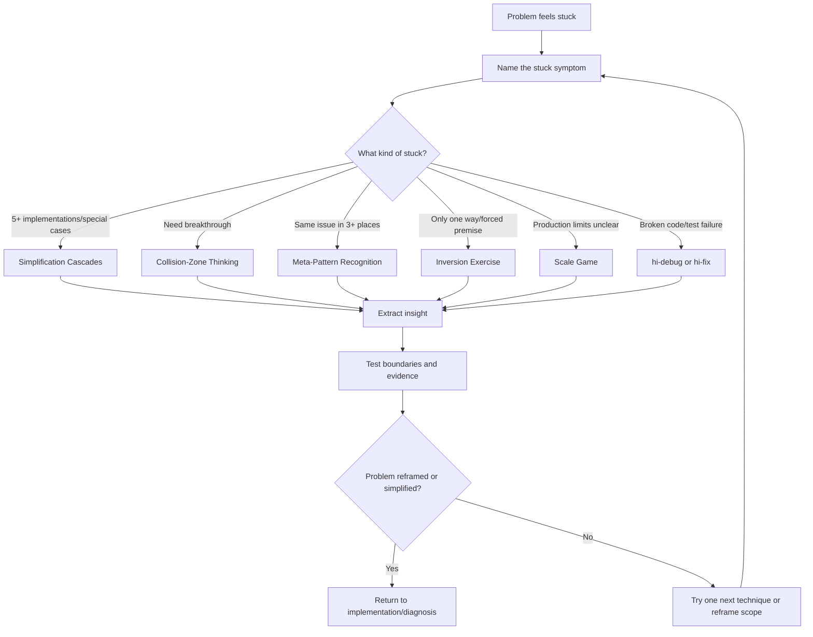

## 3. Khi nào dùng?

### 3.1 Nên dùng

- complexity tăng theo từng patch;
- có nhiều special cases và abstraction chưa rõ;
- conventional solution không đáp ứng requirement;
- cùng issue lặp lại trong nhiều module/team/domain;
- assumption đang khóa solution;
- chưa biết giới hạn scale/performance/reliability;
- đã thử hai hoặc nhiều hypothesis nhưng đều bị refute;
- cần fresh perspective trước khi tiếp tục code.

### 3.2 Không dùng thay cho skill khác

| Tình huống | Skill chính |
|---|---|
| Code đang sai/test fail và cần root cause | `hi-debug` hoặc `hi-fix` |
| Cần tìm file/call path/context | `hi-codebase-research-explorer` |
| Cần plan/architecture artifact | `hi-plan` |
| Cần scenario/edge-case matrix | `hi-scenario` |
| Cần test/implementation end-to-end | `hi-craft` |

`hi-problem-solving` có thể được gọi từ `hi-debug` khi hypotheses thất bại hoặc từ `hi-fix` khi ba attempts không giải quyết được, nhưng nó không tự động chứng minh solution đúng.

## 4. Quy tắc dispatch

### 4.1 Decision tree

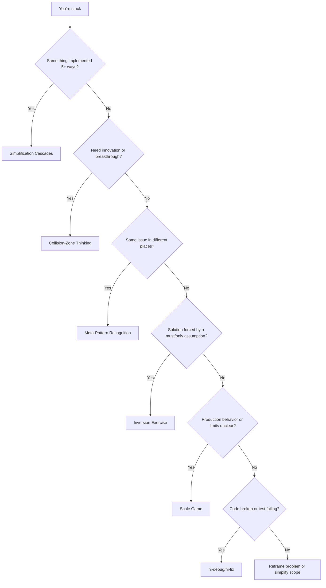

### 4.2 Quy trình chung

1. **Identify stuck-type**: mô tả symptom, không chỉ nói “khó”.
2. **Chọn một technique**: load reference tương ứng.
3. **Apply systematically**: làm đủ các bước của technique.
4. **Document insight**: insight, evidence, boundary, next action.
5. **Test**: kiểm tra insight trong context thực.
6. **Return**: quay lại plan/diagnosis/implementation với framing mới.

Rule: dùng **một technique tại một thời điểm**. Chỉ kết hợp sau khi technique đầu tiên tạo ra insight cần technique thứ hai.

## 5. Simplification Cascades

### 5.1 Ý tưởng cốt lõi

Tìm một insight có thể loại bỏ nhiều component/special case:

> “Nếu điều này đúng, chúng ta không cần X, Y, Z nữa.”

Một abstraction tốt thường biến nhiều implementation thành một pattern tổng quát.

### 5.2 Khi dùng

- cùng behavior implement 5+ cách;
- danh sách special case cứ dài thêm;
- nhiều `if/else` chỉ khác input type/context;
- team nói “chỉ cần thêm một case nữa” lặp đi lặp lại;
- complexity bị che bởi các utility riêng lẻ.

### 5.3 Quy trình

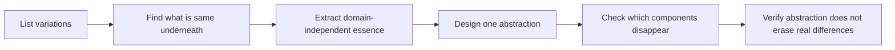

Ba câu hỏi:

1. Những variation nào đang được implement nhiều lần?
2. Chúng giống nhau ở invariant nào?
3. Abstraction nào diễn tả invariant mà không ép các difference giả tạo?

### 5.4 Ví dụ

| Trước | Insight | Sau |
|---|---|---|
| Handler riêng cho batch/realtime/file/network | Tất cả đều là input streams | Một stream processor, nhiều source |
| Session tracking, rate limiting, file validation, connection pool riêng | Đều là per-entity resource limits | Một ResourceGovernor với nhiều resource type |
| Defensive copy, lock, cache invalidation, temporal coupling | Treat data là immutable transformations | Functional data flow |

### 5.5 Boundary

Không phải mọi thứ giống nhau ở surface đều nên gom lại. Kiểm tra:

- abstraction có giữ invariant riêng không;
- error semantics có khác không;
- lifecycle/ownership có khác không;
- abstraction có tạo “god object” mới không;
- cost cognitive có thấp hơn duplication không.

Red flags:

- “Just need to add one more case…”;
- “Đừng chạm vào đó, nó phức tạp”;
- abstraction chỉ đổi tên duplication mà không loại bỏ logic.

## 6. Collision-Zone Thinking

### 6.1 Ý tưởng cốt lõi

Cố ý đưa hai concept không liên quan vào cùng một framing:

> “What if we treated X like Y?”

Mục tiêu không phải tạo metaphor đẹp, mà phát hiện emergent properties từ domain khác.

### 6.2 Khi dùng

- conventional solutions chỉ tạo incremental improvement;
- mọi solution trong domain hiện tại đã thử;
- cần breakthrough;
- problem có behavior giống một domain khác nhưng team chưa nhìn ra.

### 6.3 Quy trình

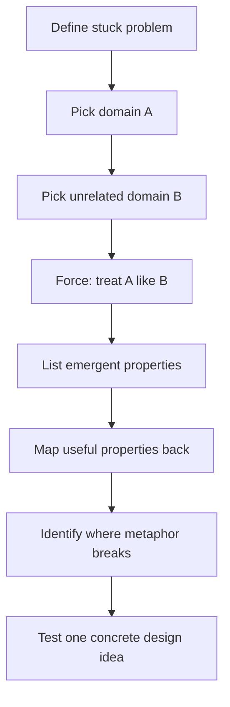

### 6.4 Collision examples

| Treat this | Like this | Có thể phát hiện |
|---|---|---|
| Code organization | DNA/genetics | Mutation testing, evolutionary algorithms |
| Service architecture | Lego bricks | Composable plug-and-play services |
| Data management | Water flow | Streaming, data lakes, flow-based systems |
| Request handling | Postal mail | Message queue, async processing |
| Error handling | Electrical circuits | Circuit breaker, fuse, fault isolation |

### 6.5 Ví dụ distributed failure

Problem: distributed services gây cascading failure.

Collision:

```text
What if services behaved like electrical circuits?
```

Emergent properties:

- circuit breaker;
- fuse;
- isolation boundary;
- load balancing;
- voltage regulation.

Insight: failure isolation có thể được thiết kế như circuit protection.

### 6.6 Boundary

Metaphor chỉ là generator, không phải proof. Phải hỏi:

- property nào thật sự map được;
- assumptions nào của domain gốc không còn đúng;
- metaphor break ở đâu;
- test nào chứng minh design mới tốt hơn.

Red flags:

- “Đã thử mọi cách trong domain này”;
- solution chỉ khác tên nhưng không có behavior mới;
- metaphor được dùng như justification mà không có experiment.

## 7. Meta-Pattern Recognition

### 7.1 Ý tưởng cốt lõi

Khi cùng một shape xuất hiện ở từ 3 domain trở lên, có thể đó là universal principle đáng trích xuất.

Rule:

```text
1 occurrence = coincidence
2 occurrences = possible pattern
3+ occurrences = likely universal pattern
```

### 7.2 Khi dùng

- cùng issue xuất hiện ở nhiều module;
- nhiều team đang reinvent same solution;
- có cảm giác déjà vu;
- muốn tạo reusable principle thay vì fix local.

### 7.3 Quy trình

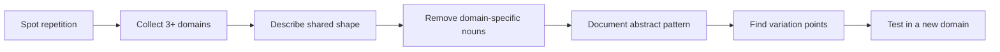

### 7.4 Pattern examples

| Xuất hiện ở | Abstract form | Ứng dụng khác |
|---|---|---|
| CPU/DB/HTTP/DNS caching | Đưa data thường dùng lại gần consumer | CDN, prompt cache |
| Network/storage/compute layering | Tách concern thành abstraction levels | Architecture, org structure |
| Message/task/request queue | Decouple producer-consumer bằng buffer | Async event systems |
| Connection/thread/object pooling | Reuse expensive resources | Memory/governance |
| API throttling/traffic shaping/circuit breaker | Bound resource consumption | LLM token budget |

### 7.5 Output pattern

```text
Observed domains: API throttling, admission control, circuit breaker
Abstract pattern: Bound resource consumption to prevent exhaustion
Variation points: resource, limit, window, behavior when exceeded
New application: bound LLM context tokens by truncate/reject policy
```

### 7.6 Boundary

Pattern chỉ hữu ích nếu mô tả được mà không nhắc domain cụ thể và vẫn giữ causal mechanism. Tránh pattern quá chung như “mọi thứ cần được quản lý”.

Red flag:

- “Problem này unique” mà chưa kiểm tra domain khác;
- abstraction chỉ là slogan;
- analogy không đưa ra design/test consequence.

## 8. Inversion Exercise

### 8.1 Ý tưởng cốt lõi

Đảo assumption cốt lõi để lộ constraint ẩn và alternative approach:

> “What if the opposite were true?”

### 8.2 Khi dùng

- solution bị ép;
- team nói “must”, “only way”, “đây là cách làm chuẩn”;
- requirement có vẻ mâu thuẫn;
- approach hiện tại cảm thấy sai nhưng chưa có alternative.

### 8.3 Quy trình

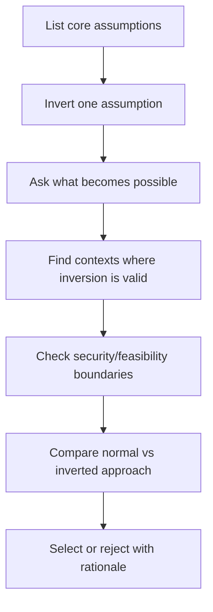

### 8.4 Examples

| Assumption thường | Inversion | Có thể lộ ra |
|---|---|---|
| Cache để giảm latency | Thêm latency để enable cache | Debounce |
| Pull data khi cần | Push trước khi cần | Prefetch/eager load |
| Handle errors khi xảy ra | Làm errors impossible | Type system/contracts |
| Build feature users want | Remove feature users không cần | Simplicity |
| Optimize common case | Optimize worst case | Resilience |
| Eager | Lazy | On-demand resource use |
| Push | Pull | Consumer-driven flow |
| Store | Compute | Derived data |

### 8.5 Ví dụ app chậm

Normal framing: làm mọi thứ nhanh hơn bằng cache, query optimization, CDN, bundle nhỏ.

Inversion: strategic slowness có thể cải thiện UX:

- debounce search;
- rate limit abuse;
- lazy load giảm initial work;
- progressive rendering cải thiện perceived speed.

Insight: không phải mọi latency đều cần loại bỏ; cần phân biệt harmful latency và intentional control.

### 8.6 Valid vs invalid inversion

Valid:

```text
Store data -> Derive data on demand
```

Nếu computation rẻ hơn storage và freshness quan trọng.

Invalid:

```text
Validate input -> Trust all input
```

Đây là security vulnerability, không phải alternative context hợp lệ.

Test inversion bằng câu hỏi: “Nó có hoạt động trong bất kỳ context nào với boundary rõ không?”

## 9. Scale Game

### 9.1 Ý tưởng cốt lõi

Test ở hai cực để lộ sự thật bị che ở scale bình thường:

> Extremes expose fundamentals.

Không chỉ test lớn hơn. Test nhỏ hơn cũng quan trọng vì có thể chỉ ra over-engineering.

### 9.2 Khi dùng

- “Should scale fine” nhưng chưa có numbers;
- production limit chưa rõ;
- edge case min/max chưa biết;
- cần validate architecture;
- performance/resource behavior là risk.

### 9.3 Scale dimensions

| Dimension | Test extremes | Có thể lộ ra |
|---|---|---|
| Volume | 1 vs 1B items | Algorithmic complexity |
| Speed | Instant vs 1 year | Async/caching/state needs |
| Users | 1 vs 1B users | Concurrency/resource limits |
| Duration | Milliseconds vs years | Memory leak/state growth |
| Failure rate | Never vs always fails | Error handling adequacy |

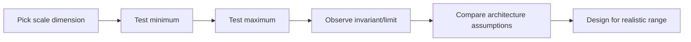

### 9.4 Examples

| Normal assumption | Extreme | Insight/action |
|---|---|---|
| Handle errors as they occur | 1B errors | Logging overload, need bounded/error aggregation |
| Sync API <100ms | Global 200-500ms network | Async-first requirement |
| In-memory state vài ngày | State kéo dài nhiều năm | Persistence/cleanup/stateless |
| Session 100 users | 1M users | Distributed session store |

### 9.5 Test cả hai hướng

- 0/1 item để tìm empty state và over-engineering;
- 1B items để tìm complexity/memory;
- instant response để tìm ordering assumptions;
- year-long duration để tìm leak/expiry;
- zero failure và always failure để kiểm tra recovery.

Red flags:

- “works in dev”;
- không biết limit ở đâu;
- chỉ benchmark median, không có max/load/failure;
- chỉ test bigger mà bỏ qua smaller.

## 10. Khi stuck vì code broken

Dispatch reference chỉ rõ: code broken, test failing hoặc unexpected output nên chuyển sang debugging skill, không dùng collision/inversion để thay thế diagnosis.

Flow phù hợp:

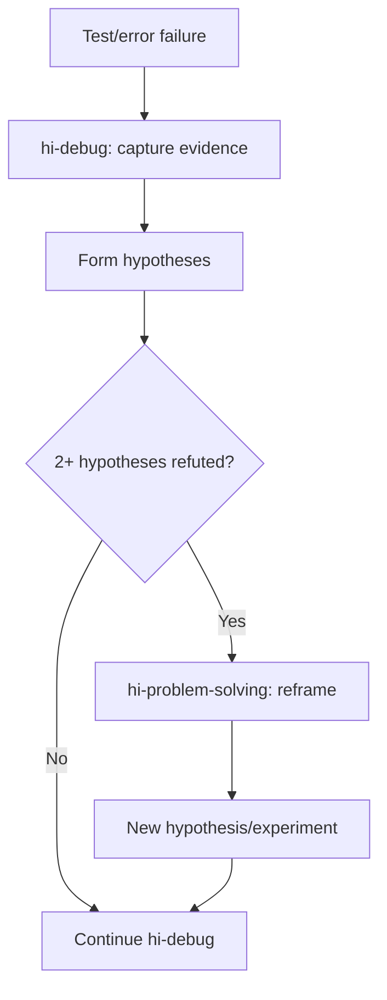

`hi-problem-solving` ở đây giúp đổi framing khi debug loop bị stuck, sau đó trả control về `hi-debug`/`hi-fix` để verify và sửa.

## 11. Technique selection bằng symptom

### 11.1 Complexity spiraling

Symptoms:

- cùng thing có từ 5 implementation;
- special cases tăng;
- if/else sâu;
- behavior gần giống nhưng không share abstraction.

Action: list variations → find essence → extract abstraction → verify differences.

### 11.2 Innovation block

Symptoms:

- conventional solutions đều inadequate;
- improvement chỉ incremental;
- không tìm được breakthrough.

Action: chọn hai domain xa nhau → force collision → extract emergent property → test boundary.

### 11.3 Recurring patterns

Symptoms:

- cùng issue ở nhiều nơi;
- nhiều team reinvent wheel;
- “problem này unique”.

Action: collect 3+ domains → abstract pattern → document variation points → apply elsewhere.

### 11.4 Forced assumptions

Symptoms:

- “must be this way”;
- solution cảm thấy forced;
- không thể question premise.

Action: list assumptions → invert từng cái → tìm context valid → test boundary.

### 11.5 Scale uncertainty

Symptoms:

- “should scale fine”;
- chưa biết production limit;
- normal case pass nhưng edge unclear.

Action: chọn dimension → test min/max → đo resource/latency/state → validate architecture.

## 12. Document insight

Mỗi technique nên kết thúc bằng artifact ngắn:

```markdown
## Problem
[Stuck problem and current framing]

## Technique
[Simplification | Collision | Meta-pattern | Inversion | Scale]

## Observation
[What was found]

## Insight
[New abstraction, alternative, pattern or limit]

## Evidence
[Examples, measurements, code paths or experiments]

## Boundary
[Where insight does not apply]

## Next Action
[Concrete implementation, diagnosis, research or question]
```

Không ghi “đã giải quyết” nếu mới có insight mà chưa verify.

## 13. Kết hợp techniques

Mặc định one technique at a time. Có thể compose theo chuỗi khi mỗi bước tạo input cho bước sau:

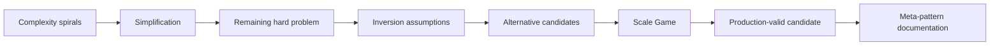

Ví dụ:

1. Simplification loại bỏ 4 custom handlers.
2. Inversion đặt câu hỏi push hay pull data.
3. Scale Game kiểm tra 1 item/1B items.
4. Meta-pattern ghi lại resource governance để reuse.

Không compose chỉ để làm workflow dài. Mỗi technique phải có output rõ.

## 14. Attribution và nguồn gốc

Reference ghi các technique được derive từ agent patterns trong Microsoft Amplifier:

- Repository: [Microsoft Amplifier](https://github.com/microsoft/amplifier)
- Commit: `2adb63f858e7d760e188197c8e8d4c1ef721e2a6`
- Date: `2025-10-10`
- Source agent pattern: `insight-synthesizer`

Các adaptation chính:

- chuyển từ long-lived agent sang quick-reference skills;
- thêm symptom-based dispatch;
- bỏ JSON output requirement;
- có thể áp dụng trực tiếp không cần special tooling;
- progressive disclosure qua `SKILL.md` và references;
- giữ technique domain-agnostic và composable.

## 15. Verify problem-solving insight

### 15.1 Framing verify

- [ ] Stuck symptom đã mô tả cụ thể.
- [ ] Technique được chọn khớp symptom.
- [ ] Không dùng problem-solving để né debug/test cần thiết.
- [ ] Scope không đổi âm thầm.

### 15.2 Technique verify

- [ ] Simplification có chỉ ra components được loại bỏ.
- [ ] Collision có hai domain thực sự khác nhau.
- [ ] Meta-pattern có ít nhất 3 domain.
- [ ] Inversion có boundary valid/invalid.
- [ ] Scale test cả minimum và maximum.

### 15.3 Insight verify

- [ ] Insight diễn tả được rõ, không chỉ là slogan.
- [ ] Có evidence/examples/measurement.
- [ ] Boundary và failure mode được ghi.
- [ ] Next action concrete.
- [ ] Candidate được test trong context thực.
- [ ] Không claim success trước verification.

## 16. Ví dụ end-to-end: complexity cascade

Problem: system có handler riêng cho batch, realtime, file và network; mỗi handler có validation/retry riêng.

### Step 1: Identify

Symptom: cùng logic xuất hiện bốn lần, mỗi bug phải sửa bốn nơi.

### Step 2: Apply simplification

```text
Variations: batch, realtime, file, network
Essence: tất cả đều cung cấp sequence of items
Candidate abstraction: stream processor + source adapter
```

### Step 3: Boundary check

- ordering semantics có giống không;
- backpressure có giống không;
- retry/idempotency có khác không;
- batch có transaction boundary riêng không.

### Step 4: Verify

- implement prototype cho hai source;
- chạy same scenario suite;
- benchmark memory/backpressure;
- so sánh error semantics;
- nếu abstraction giữ invariant và giảm duplication, tạo plan migration.

## 17. Ví dụ end-to-end: collision zone

Problem: distributed service cascade failure.

```text
Domain A: service architecture
Domain B: electrical circuits
Collision: service behaves like circuit
Emergent properties: breaker, fuse, isolation, load regulation
Boundary: services have semantic retries/data consistency not present in circuits
Next action: model circuit breaker states and test retry storm
```

Insight chỉ trở thành design khi chuyển thành state machine, thresholds, recovery policy và test.

## 18. Ví dụ end-to-end: inversion

Problem: search UI gửi request cho từng keystroke và chậm.

Normal assumption: request càng sớm càng tốt.

Inversion: cố ý chờ user pause.

Insight:

- debounce giảm request;
- cancel stale request;
- render result theo query version;
- perceived latency có thể tốt hơn dù mỗi request bắt đầu muộn hơn.

Boundary:

- search cần realtime tuyệt đối không dùng debounce dài;
- accessibility phải có status update;
- security/rate limit không được bỏ chỉ vì UX.

## 19. Ví dụ end-to-end: scale game

Problem: in-memory session đang pass với 100 users.

Test extremes:

- 1 user: kiểm tra flow có cần distributed store không;
- 1M users: đo memory, eviction và connection;
- milliseconds: kiểm tra race/ordering;
- years: kiểm tra TTL/cleanup/state growth.

Insight có thể là session phải externalize vào shared store, nhưng cần verify latency, consistency và failure behavior trước khi architecture change.

## 20. Quan hệ với các skill khác

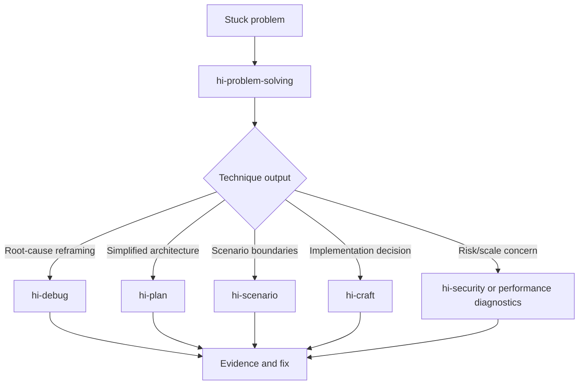

| Skill | Problem-solving đóng góp |
|---|---|
| `hi-debug` | Reframe sau khi hypotheses bị refute |
| `hi-fix` | Thoát vòng lặp fix attempts |
| `hi-plan` | Chọn scope/architecture mới có rationale |
| `hi-scenario` | Mở rộng edge cases từ insight |
| `hi-sequential-thinking` | Ghi chuỗi reasoning, revision và alternatives |
| `hi-craft` | Chuyển insight thành implementation/test |
| `hi-security` | Kiểm tra inversion/abstraction không tạo security gap |

## 21. Giới hạn cần hiểu đúng

### 21.1 Insight không phải proof

Technique tạo hypothesis hoặc reframing. Code, benchmark, test, security review và stakeholder validation mới chứng minh candidate phù hợp.

### 21.2 Collision có thể tạo ý tưởng sai

Metaphor phải được test boundary. Không đưa pattern từ domain khác vào production chỉ vì nó nghe hợp lý.

### 21.3 Simplification có thể xóa khác biệt thật

Nếu abstraction làm mất transaction, security, performance hoặc lifecycle semantics, đó là over-simplification.

### 21.4 Inversion có giới hạn đạo đức/kỹ thuật

Không mọi assumption đều nên đảo. Security validation, data integrity và compliance không được biến thành “trust blindly”.

### 21.5 Scale Game không thay thế load test

Scale thought giúp chọn test dimension và architecture question. Production claim vẫn cần benchmark/load/failure testing thực tế.

### 21.6 Một technique có thể không đủ

Nếu không có insight:

- reframe problem: đang giải đúng problem chưa;
- giải thích cho người khác để tìm blind spot;
- nghỉ và quay lại với context mới;
- giảm scope, giải phiên bản nhỏ trước.

## 22. Tóm tắt nhanh

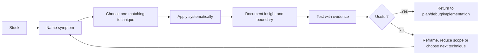

Câu ngắn nhất để nhớ:

> `hi-problem-solving` không thêm effort vào cùng một hướng bế tắc; nó giúp nhận diện loại stuck, đổi framing có phương pháp, tạo insight mới và đưa insight đó trở lại quy trình có verification.
