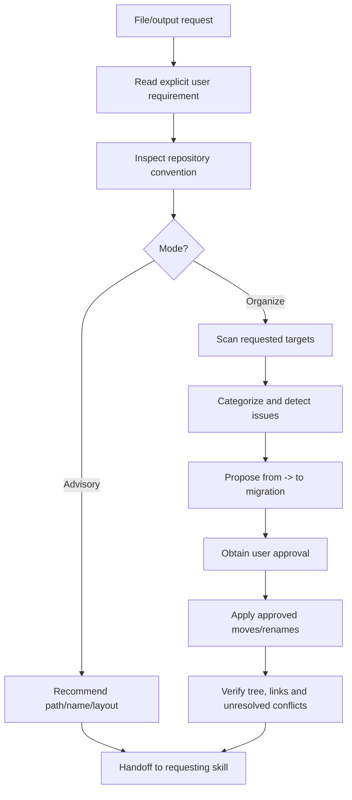
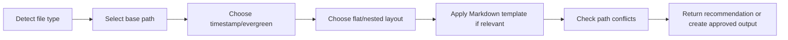
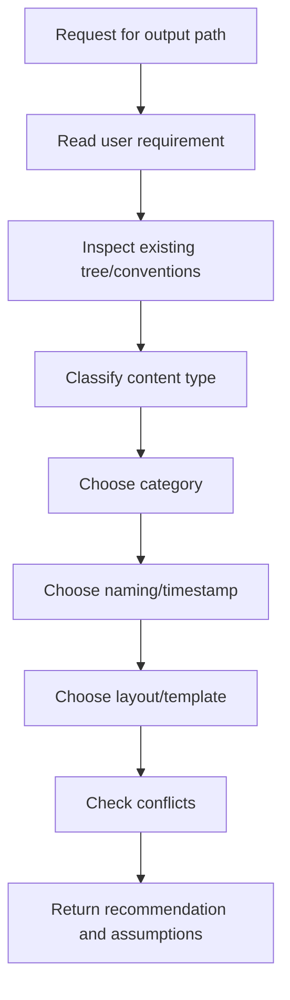
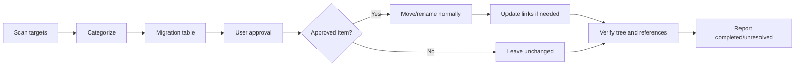
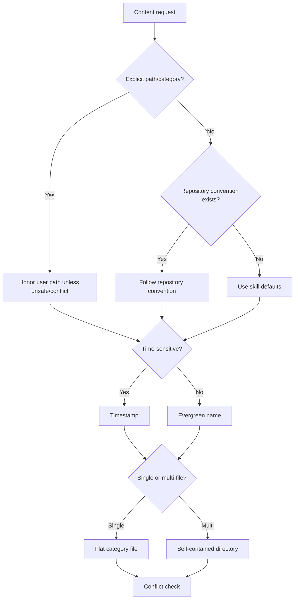
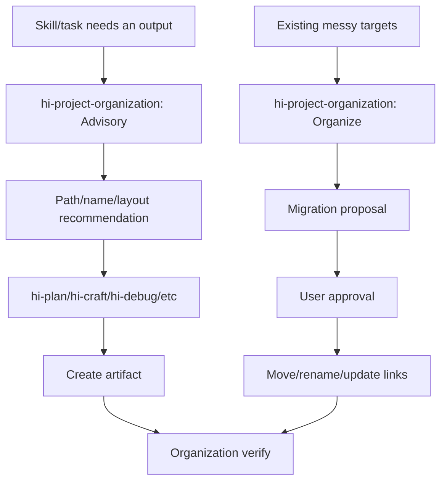
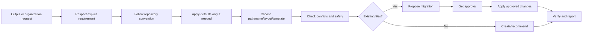

# Hi Project Organization Skill: Hướng dẫn đầy đủ

> `hi-project-organization` là skill quyết định file nên nằm ở đâu, tên gì, cấu trúc thư mục ra sao và Markdown nên có body structure thế nào. Nó giúp project giữ layout nhất quán mà không ghi đè convention hiện có.

## 1. Skill này giải quyết vấn đề gì?

Khi tạo hoặc di chuyển artifact, câu hỏi không chỉ là “file có nội dung đúng không?” mà còn là:

- file nên nằm trong `docs/`, `guides/`, `plans/`, `reports/` hay một category hiện có;
- output một file hay một self-contained directory;
- tên có ổn định, dễ tìm, đúng convention không;
- nội dung là plan, phase, report, log, ADR, guide hay specification;
- có cần timestamp không;
- file đang tồn tại thì xử lý conflict thế nào;
- di chuyển file có làm hỏng links/imports/build không;
- user đã approve migration chưa.

`hi-project-organization` tạo một decision process cho các câu hỏi đó.

## 2. Mental model tổng quát



Priority quyết định:

1. giữ explicit user requirements;
2. follow established repository/ecosystem convention;
3. chỉ dùng default của skill khi hai lớp trên không quyết định được.

## 3. Hai mode

### 3.1 Advisory

Advisory chỉ trả recommendation:

- path nên dùng;
- filename;
- directory layout;
- timestamp hay evergreen;
- Markdown template phù hợp;
- conflict/risk cần lưu ý.

Advisory không tự move, rename hoặc delete file.

Dùng khi:

- skill khác cần biết output path;
- user đang tạo artifact mới;
- chưa được phép thay đổi workspace;
- cần quyết định naming trước implementation.

Ví dụ:

```text
Request: Create a time-sensitive architecture decision.
Recommendation: docs/decisions/260814-auth-token-rotation.md
Template: ADR
Timestamp: yes
```

### 3.2 Organize

Organize thực thi việc sắp xếp targets, nhưng có approval gate:

1. scan chỉ targets được yêu cầu;
2. categorize files/directories;
3. phát hiện misplaced files, naming violations, conflicts;
4. trình bày migration `from -> to`;
5. chờ user approval;
6. chỉ apply các move/rename đã approved;
7. verify final tree và report unresolved issues.

Không được tự ý move trước khi user approve.

## 4. Resolve một output mới

Quy trình sáu bước:



### Bước 1: Detect file type

Phân loại output:

- source;
- test;
- documentation;
- technical log;
- architecture decision;
- plan;
- research/report;
- script;
- asset;
- configuration;
- user guide.

Một file có thể cần category theo ownership chứ không chỉ theo extension.

### Bước 2: Select base path

Dùng repository convention trước. Nếu không có:

| Content | Default location |
|---|---|
| Source | `src/` hoặc ecosystem-standard root |
| Tests | `test/` hoặc `tests/` |
| Documentation | `docs/` |
| Technical logs | `docs/logs/` |
| Architecture decisions | `docs/decisions/` |
| Plans | `plans/{timestamp}-{slug}/` |
| Plan research/reports | `plans/{plan}/research/`, `plans/{plan}/reports/` |
| Standalone research/reports | `plans/research/`, `plans/reports/` |
| Scripts | `scripts/` |
| Assets | `assets/{type}/` |
| User guides | `guide/`, `guides/` hoặc `docs/guides/` |
| Configuration | Ecosystem-standard root hoặc supported `.config/` |

Ví dụ trong repository này, user yêu cầu lưu tài liệu vào `wiki/`, nên explicit requirement đó override default `docs/`.

### Bước 3: Timestamp hay evergreen

Timestamp khi content phụ thuộc thời điểm:

- plan;
- report;
- log;
- session;
- generated artifact có ý nghĩa về creation time.

Không timestamp:

- evergreen docs;
- configs;
- source;
- scripts;
- templates;
- brand assets.

Timestamp mặc định:

```text
{YYMMDD-HHmm}
```

Nếu `$HI_PLAN_DATE_FORMAT` được set, dùng format đó.

### Bước 4: Flat hay nested

- single output: flat trong category;
- multi-file output: self-contained directory;
- plan artifact: nested dưới plan owner;
- variant: flat với suffix;
- collection/platform: dùng subdirectory khi thực sự cần.

### Bước 5: Markdown template

Nếu output là plan, phase, report, log, ADR, changelog, README, guide hoặc specification, chọn template tương ứng. Không thêm frontmatter nếu tool/workflow không consume nó.

### Bước 6: Check path conflicts

Trước khi tạo:

- path đã tồn tại chưa;
- file cùng tên có nội dung khác không;
- directory có naming conflict không;
- link/reference nào sẽ bị ảnh hưởng;
- file có bị `.gitignore` hoặc generated policy chi phối không.

Rule: không overwrite existing file; surface conflict.

## 5. Default directory layout

Các defaults chỉ áp dụng khi repository chưa có convention rõ.

### 5.1 Documentation

```text
docs/
├── system-architecture.md
├── code-standards.md
├── logs/{YYMMDD-HHmm}-{slug}.md
├── decisions/{YYMMDD}-{slug}.md
└── guides/{topic}.md
```

- evergreen docs không timestamp;
- logs timestamp;
- architecture decisions timestamp;
- tài liệu lớn có thể tách theo topic để dễ navigation.

### 5.2 Plans

```text
plans/
├── {YYMMDD-HHmm}-{slug}/
│   ├── plan.md
│   ├── phase-{NN}-{name}.md
│   ├── research/
│   └── reports/
├── research/
├── reports/
├── templates/
└── visuals/
```

Rules:

- zero-pad phase numbers;
- scoped artifacts nằm trong owning plan;
- standalone research/report nằm top-level category;
- `plan.md` concise, link tới detailed phase files.

### 5.3 Tests

```text
tests/
├── unit/
├── integration/
├── e2e/
├── fixtures/
└── helpers/
```

Follow existing test root/suffix convention. Mirror source structure khi phù hợp.

### 5.4 Scripts

```text
scripts/{action}-{target}.{ext}
```

- nhóm theo category khi collection đủ lớn;
- thêm shebang nếu script cần;
- follow existing executable/permission convention.

### 5.5 Assets

```text
assets/
├── images/
├── videos/
├── designs/
├── branding/
└── generated/{type}/
```

- single asset flat;
- multi-file output self-contained;
- size/platform/theme dùng filename suffix;
- generated content timestamp nếu creation time có ý nghĩa.

### 5.6 Configuration

- manifest/compiler config ở ecosystem-standard root;
- `.config/` chỉ khi tool/repository support;
- không relocate secret;
- không commit populated `.env`.

## 6. Naming conventions

### 6.1 Slug

Chuẩn hóa title thành:

1. lowercase;
2. thay space/special chars bằng hyphen;
3. collapse repeated hyphen;
4. trim hyphen ở đầu/cuối;
5. truncate tại word boundary, tối đa 50 chars;
6. ưu tiên self-documenting name, tránh abbreviation khó hiểu.

Ví dụ:

| Input | Slug |
|---|---|
| `User Authentication Flow` | `user-authentication-flow` |
| `Fix: API Rate Limiting Bug #42` | `fix-api-rate-limiting-bug-42` |
| `AI & Automation: A Guide` | `ai-automation-a-guide` |

### 6.2 Time-sensitive names

```text
{YYMMDD-HHmm}-{slug}
```

Examples:

```text
260814-0930-auth-token-rotation
260814-1015-payment-incident
```

### 6.3 Variants

| Variant | Pattern | Example |
|---|---|---|
| Size | `{name}-{width}x{height}.{ext}` | `hero-1920x1080.png` |
| Platform | `{name}-{platform}.{ext}` | `cover-youtube.png` |
| Theme | `{name}-{variant}.{ext}` | `logo-dark.svg` |
| Version | `{name}-v{N}.{ext}` | `mockup-v2.png` |
| Sequence | `{kind}-{NN}-{name}.{ext}` | `step-01-install.md` |

### 6.4 Code và directories

- code follow language/repository convention;
- non-code directory mới dùng kebab-case;
- collection dùng plural;
- sequence dùng zero-padded number;
- không áp kebab-case máy móc lên symbol/code file nếu repo dùng convention khác.

### 6.5 Plans và reports

```text
Plan folder: {YYMMDD-HHmm}-{slug}/
Standalone report: {type}-{YYMMDD-HHmm}-{slug}.md
Plan-scoped report: stable descriptive name inside reports/
```

## 7. Nesting rules

### 7.1 Single output

Giữ flat trong category:

```text
docs/guides/setup.md
```

Không tạo directory riêng cho một file nếu không có ownership/navigation reason.

### 7.2 Multi-file output

Dùng self-contained directory:

```text
plans/260814-auth-flow/
├── plan.md
├── phase-01-schema.md
├── phase-02-api.md
└── reports/
```

### 7.3 Owner context

Artifact nên nằm dưới context sở hữu nó:

- plan research dưới plan;
- plan report dưới plan;
- generated assets dưới asset category/type;
- logs dưới log directory.

### 7.4 Variants

Variants giữ flat với suffix:

```text
logo-dark.svg
logo-light.svg
```

Dùng platform subdirectory chỉ khi collection đủ lớn hoặc repository convention yêu cầu.

### 7.5 `.gitkeep`

Chỉ thêm `.gitkeep` khi empty directory có chủ đích cần track. Không tạo `.gitkeep` cho directory sẽ được tạo khi có content.

## 8. Markdown rules

### 8.1 Một H1

Mỗi Markdown document nên có đúng một H1 title. H2/H3 dùng cho hierarchy nội dung.

### 8.2 Frontmatter

Chỉ thêm frontmatter khi:

- tool consume;
- workflow cần metadata;
- document type yêu cầu.

Không thêm frontmatter chỉ để trang trí.

### 8.3 Content order

Thứ tự mặc định:

```text
Context -> Main content -> Next steps / unresolved questions
```

### 8.4 Formatting

- tables cho structured comparison;
- lists cho sequence;
- prose ngắn, scannable;
- links tương đối nếu phù hợp repository;
- headings descriptive;
- không chôn critical decision trong paragraph dài.

## 9. Markdown body templates

### 9.1 Plan

```markdown
---
title: "{Plan title}"
status: pending
created: YYYY-MM-DD
---
# {Plan title}
## Overview
## Phases
## Dependencies
## Success Criteria
```

### 9.2 Phase

```markdown
# Phase {NN}: {Name}
## Context
## Requirements
## Architecture
## Related Files
## Implementation Steps
## Todo
## Risks
## Success Criteria
```

### 9.3 Report

```markdown
---
type: {report type}
date: YYYY-MM-DD
---
# {Report type}: {Subject}
## Summary
## Findings
## Recommendations
## Unresolved Questions
```

### 9.4 Log

```markdown
---
date: YYYY-MM-DD
topic: {topic}
---
# Log: {Topic}
## Context
## What Happened
## Decisions
## Reflection
## Next Steps
```

### 9.5 Document

```markdown
# {Title}
## Overview
## {Content sections}
## References
```

### 9.6 Architecture Decision Record

```markdown
# ADR-{NNN}: {Decision}
- **Status:** proposed | accepted | deprecated | superseded
- **Date:** YYYY-MM-DD
## Context
## Decision
## Consequences
## Alternatives Considered
```

### 9.7 Changelog

```markdown
## [{version}] - YYYY-MM-DD
### Added
### Changed
### Fixed
### Removed
### Deprecated
```

### 9.8 README

```markdown
# {Project name}
{One-line description}
## Quick Start
## Usage
## Development
## Contributing
## License
```

### 9.9 Guide

```markdown
# {Guide title}
## Prerequisites
## Steps
## Troubleshooting
## FAQ
```

### 9.10 Specification

```markdown
# {Specification title}
## Overview
## Requirements
## Constraints
## API / Interface
## Acceptance Criteria
```

Template là skeleton, không phải yêu cầu điền section rỗng. Omit section không thêm information.

## 10. Advisory workflow chi tiết



Advisory response nên gồm:

- proposed path;
- proposed filename;
- why this category;
- timestamp/evergreen rationale;
- layout;
- template;
- conflicts/assumptions;
- whether user approval is needed before creation.

Advisory không nên tự tạo directory/file trừ khi request chuyển sang create/organize rõ ràng.

## 11. Organize workflow chi tiết

### 11.1 Scan

Chỉ scan requested targets, không map toàn repository nếu không cần. Categorize:

- correctly placed;
- misplaced;
- naming violation;
- duplicate;
- conflict;
- protected/unsafe.

### 11.2 Propose migration

Bảng migration cần có:

| From | To | Reason | Risk |
|---|---|---|---|
| `docs/old-guide.md` | `docs/guides/setup.md` | Align guide category | Links may change |
| `report.md` | `docs/reports/260814-report.md` | Time-sensitive report | Update references |

Nếu rename ảnh hưởng imports/links, ghi rõ update set.

### 11.3 Approval gate

User phải approve trước:

- move;
- rename;
- delete;
- category reorganization;
- bulk migration.

Có thể approve từng dòng hoặc toàn bộ proposed migration. Không suy ra approval từ việc user đã yêu cầu “organize” nếu migration table chưa được xem.

### 11.4 Execute

Chỉ apply approved items. Preserve:

- file history khi có thể bằng normal move;
- content;
- permissions khi phù hợp;
- relative links sau khi update;
- unrelated user changes.

### 11.5 Verify

Kiểm tra:

- final tree;
- target paths;
- links/references;
- imports/build nếu move source;
- no accidental deletes;
- no conflict unresolved;
- `.gitignore`/protected files không bị sửa.



## 12. Path conflict handling

### 12.1 Existing file

Không overwrite. Surface:

- path đã tồn tại;
- content có trùng không;
- merge/rename/skip options;
- user decision cần thiết.

### 12.2 Existing directory

Kiểm tra:

- directory có đúng owner/category không;
- convention bên trong;
- naming/flat-vs-nested conflict;
- có thể reuse không.

### 12.3 Name collision

Options:

- chọn slug khác;
- thêm variant suffix;
- thêm timestamp nếu content time-sensitive;
- merge chỉ khi user yêu cầu và semantics rõ.

Không thêm suffix ngẫu nhiên kiểu `file-final-2-new.md` chỉ để tránh collision.

### 12.4 Link/import impact

Trước move source/doc:

- search relative links;
- search imports/references;
- kiểm tra generated/index files;
- update references sau approval;
- verify build/test/docs links.

## 13. Safety rules

### 13.1 Protected paths

Không modify:

- `.git/`;
- dependency directories;
- secrets;
- `.env` files;
- populated secret config;
- generated directories nếu repository policy cấm.

### 13.2 Never overwrite

Nếu path conflict, dừng tại conflict và hỏi/đề xuất. Không silently replace file.

### 13.3 Respect `.gitignore`

`.gitignore` là project behavior signal. Không tự remove ignore để track output. Không commit generated secret/artifact chỉ vì cần organization.

### 13.4 Preserve user changes

Worktree có thể dirty. Không revert unrelated changes. Nếu target có thay đổi user ảnh hưởng migration, làm việc cùng change hoặc hỏi nếu impossible.

### 13.5 No unnecessary categories

Không tạo `docs/reports/`, `assets/generated/` hoặc nested category nếu output không cần. Category mới phải có justification và phù hợp convention.

## 14. Decision matrix



## 15. Ví dụ: tạo một report

Request:

```text
Create a report summarizing the 2026-08-14 incident.
```

Decision:

- type: report;
- time-sensitive: yes;
- default category: `plans/reports/` nếu standalone planning research, hoặc `docs/logs/` nếu technical incident log theo repo convention;
- name: `incident-260814-<slug>.md` hoặc project convention tương đương;
- template: Report;
- frontmatter: type/date.

Recommendation:

```text
docs/reports/incident-260814-api-timeout.md
```

Nếu repository đã có `docs/incidents/`, follow that instead.

## 16. Ví dụ: tạo plan multi-file

Request:

```text
Create an implementation plan for token rotation with research and phases.
```

Default:

```text
plans/260814-0930-token-rotation/
├── plan.md
├── phase-01-storage.md
├── phase-02-rotation.md
├── phase-03-tests.md
├── research/
└── reports/
```

Rules:

- plan folder timestamped;
- phase numbers zero-padded;
- research/reports belong to plan;
- `plan.md` concise và link detailed phases;
- không để phase files rải ở top-level `plans/`.

## 17. Ví dụ: tổ chức existing files

Current:

```text
root/
├── report.md
├── docs/
│   └── setup.md
└── misc/
    └── architecture-decision.md
```

Proposal:

| From | To | Reason | Approval |
|---|---|---|---|
| `report.md` | `docs/reports/260814-api-report.md` | Report category/time naming | Required |
| `docs/setup.md` | `docs/guides/setup.md` | Guide category | Required |
| `misc/architecture-decision.md` | `docs/decisions/260814-architecture-decision.md` | ADR category/time naming | Required |

Không move ngay. Trước tiên trình migration table, chờ approve, sau đó move và kiểm tra links.

## 18. Ví dụ: tài liệu wiki trong repository này

User yêu cầu các skill docs được lưu trong `wiki/`. Dù default documentation path của skill là `docs/`, priority order áp dụng như sau:

```text
Explicit user requirement: wiki/
    > Repository convention/attachment context
        > Default: docs/
```

Do đó các file như:

```text
wiki/hi-plan-skill.md
wiki/hi-craft-skill.md
wiki/hi-fix-skill.md
```

là hợp lệ theo explicit requirement. Đây là ví dụ quan trọng: defaults không override user intent.

## 19. Verify organization

### 19.1 New output verify

- [ ] Content type đã được phân loại.
- [ ] Explicit user path được ưu tiên.
- [ ] Repository convention đã được kiểm tra.
- [ ] Default chỉ dùng khi không có convention.
- [ ] Timestamp/evergreen đúng.
- [ ] Slug lowercase kebab-case, self-documenting, <=50 chars khi áp dụng.
- [ ] Flat/nested layout phù hợp.
- [ ] Existing path conflict đã kiểm tra.
- [ ] Markdown template phù hợp.

### 19.2 Existing organization verify

- [ ] Chỉ scan requested targets.
- [ ] Misplaced/naming/conflict đã phân loại.
- [ ] Migration table có from/to/reason/risk.
- [ ] User approval đã có trước move/rename/delete.
- [ ] Chỉ apply approved items.
- [ ] Links/imports đã kiểm tra.
- [ ] Final tree đã verify.
- [ ] Unresolved issues đã report.

### 19.3 Safety verify

- [ ] Không đụng `.git/`.
- [ ] Không đụng dependencies/secrets/.env.
- [ ] Không overwrite existing file.
- [ ] Không revert unrelated user changes.
- [ ] `.gitignore` được tôn trọng.
- [ ] Không tạo category/nesting thừa.

## 20. Quan hệ với các skill khác



| Skill | Project organization hỗ trợ |
|---|---|
| `hi-plan` | Plan directory, phase names, research/report placement |
| `hi-craft` | Implementation output và handoff artifact path |
| `hi-fix` | Diagnostic report, logs và related docs |
| `hi-debug` | Incident/performance/report layout |
| `hi-scenario` | Scenario report deliverable path |
| `hi-predict` | Prediction report naming/path |
| `hi-repository-search` | Evidence report/document placement |
| `hi-log` | Technical log path và timestamp |

## 21. Giới hạn cần hiểu đúng

### 21.1 Convention local thắng default

Skill không nên áp default layout khi repository đã có structure khác. Một project dùng `wiki/`, `notes/` hoặc `engineering/` có thể hoàn toàn hợp lệ.

### 21.2 Organization không đánh giá content correctness

Skill sắp xếp path/name/layout. Nó không thay thế technical review, test hoặc documentation accuracy review.

### 21.3 Move có thể có hidden references

Static search có thể bỏ sót generated links, external bookmarks, runtime paths hoặc case-sensitive filesystem differences. Report nên nêu residual risk nếu move lớn.

### 21.4 Timestamps cần policy ổn định

Không timestamp evergreen docs chỉ vì tạo hôm nay. Ngược lại, không bỏ timestamp khỏi incident/report nếu chronology là một phần giá trị.

### 21.5 Template không bắt buộc điền section rỗng

Markdown template là outline. Section không thêm information nên được omit để tài liệu gọn.

## 22. Tóm tắt nhanh



Câu ngắn nhất để nhớ:

> `hi-project-organization` không tự áp một layout cứng; nó tìm điểm cân bằng giữa yêu cầu explicit, convention của repository, naming/layout nhất quán, safety và khả năng người khác tìm thấy artifact sau này.
