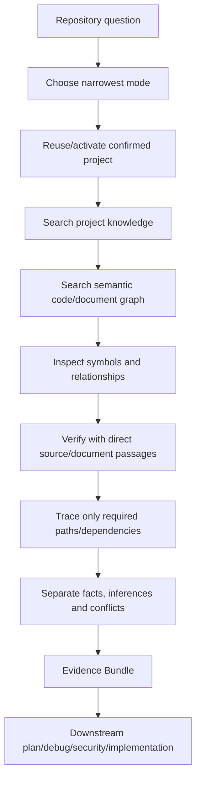
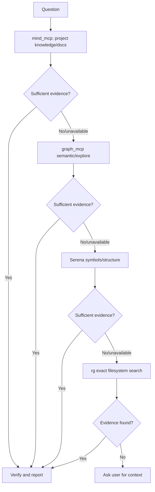
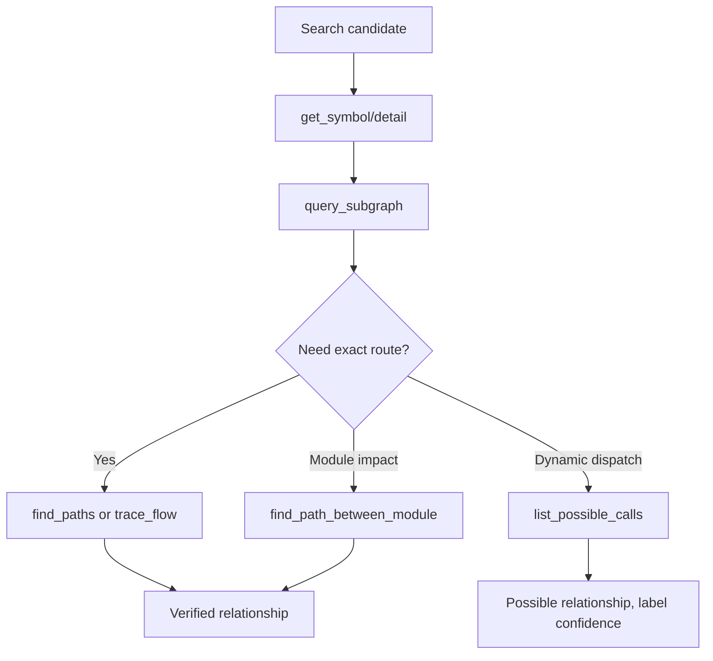
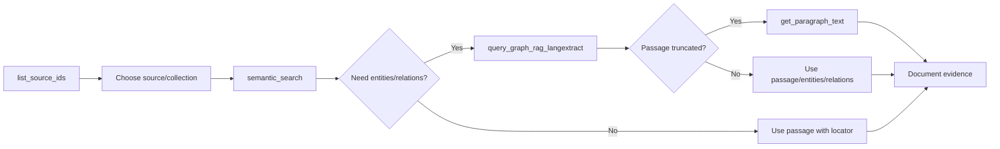
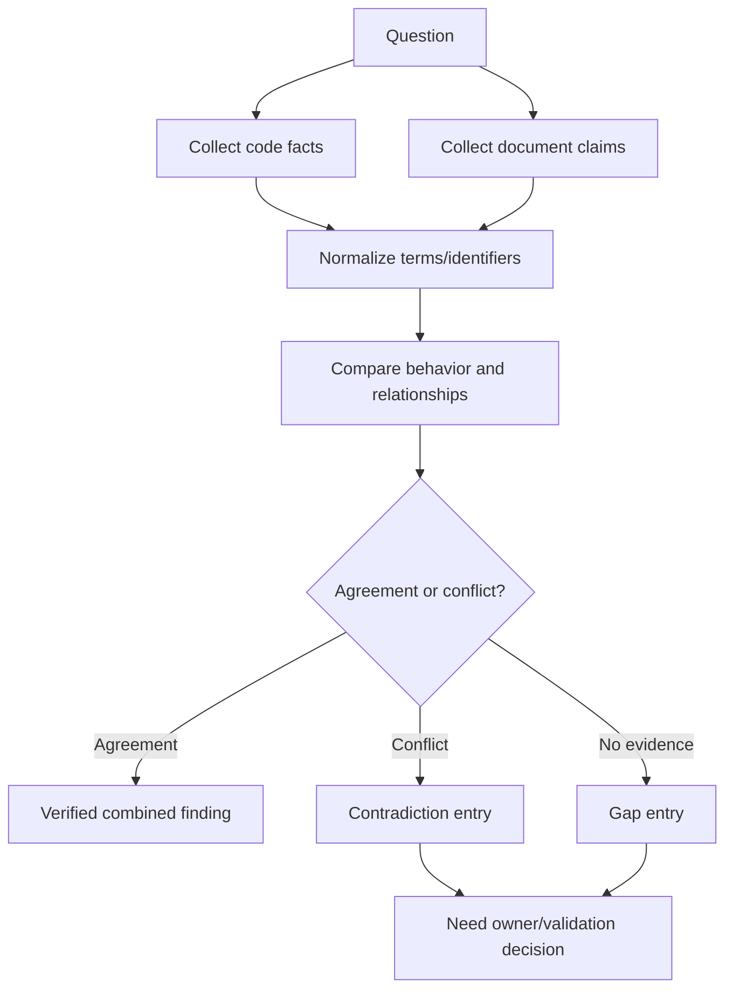
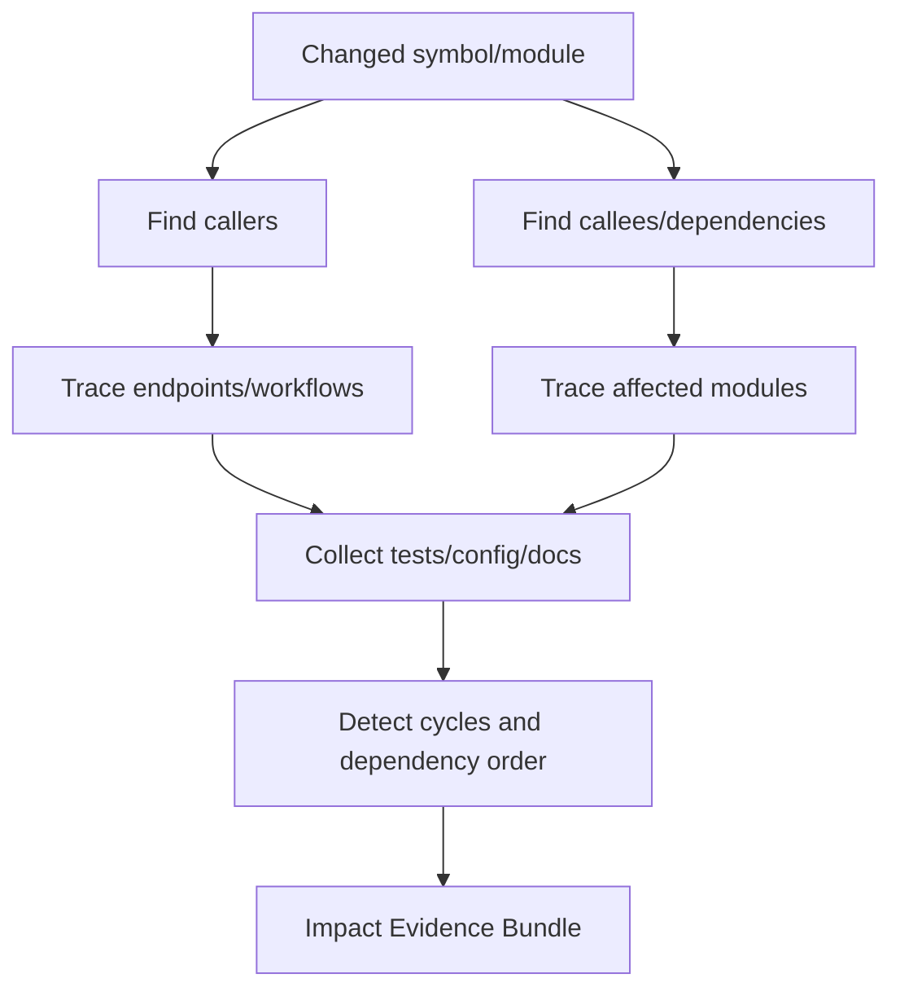
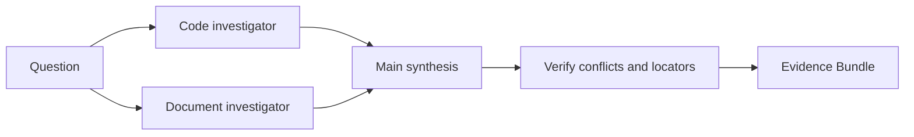
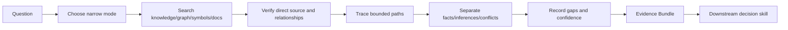

# Hi Repository Search Skill: Hướng dẫn đầy đủ

> `hi-repository-search` là skill thu thập và xác minh evidence từ code của repository và project documents. Nó phục vụ codebase exploration, architecture, feature tracing, dependency/impact analysis và các câu hỏi cần source context có thể truy nguyên.

## 1. Skill này giải quyết vấn đề gì?

Một câu hỏi repository thường cần nhiều loại bằng chứng:

- function/class/file liên quan;
- symbol references và implementations;
- caller/callee và call paths;
- module dependencies;
- project documents, decisions và requirements;
- code-document contradictions;
- impact tới workflow hoặc endpoint;
- confidence và gaps của kết quả.

`hi-repository-search` không chỉ tìm text. Nó kết hợp:

```text
Project knowledge
    + semantic code search
    + graph relationships
    + symbol structure
    + document graph RAG
    + direct source verification
    = Traceable Evidence Bundle
```

Skill này **không sở hữu**:

- planning decision của `hi-plan`;
- root-cause diagnosis của `hi-debug`;
- implementation decision của `hi-craft`;
- final fix của `hi-fix`.

Nó cung cấp context và evidence để các skill đó quyết định đúng hơn.

## 2. Mental model tổng quát



Evidence chỉ đủ khi:

- source liên quan được xác định;
- relationships cần thiết được verify;
- facts và inference được tách;
- contradictions/gaps được nêu;
- confidence có căn cứ.

## 3. Các mode

| Mode | Scope | Khi dùng |
|---|---|---|
| Default | Narrowest search trả lời câu hỏi | Câu hỏi nhỏ, chưa cần graph rộng |
| `--code` | Code, symbols, references, call paths | Tìm implementation và execution flow |
| `--doc` | Project documents, decisions, requirements | Tìm rationale/requirement/document context |
| `--deep` | Reconcile code với documents, report conflicts | Code-document mismatch hoặc architecture review |
| `--impact` | Callers, dependencies, affected modules/workflows | Blast radius, refactor và change impact |

### 3.1 Default mode

Default phải bắt đầu hẹp nhất:

- target một symbol/file/module;
- dùng query đủ để trả lời câu hỏi;
- không tự động expand toàn graph;
- chỉ mở rộng khi evidence hiện tại chưa đủ.

Default không đồng nghĩa search nông. Nó là nguyên tắc kiểm soát scope và noise.

### 3.2 `--code`

Dùng khi cần:

- function/class/type;
- implementations và references;
- entry point;
- caller/callee;
- call path;
- dependency order;
- function pointer/possible calls;
- module boundary.

### 3.3 `--doc`

Dùng khi cần:

- requirements;
- architecture decision;
- business rule;
- project convention;
- design rationale;
- compliance/security policy;
- document source/paragraph.

### 3.4 `--deep`

Dùng khi code và docs cần được đối chiếu. Output phải phân biệt:

- code fact;
- document claim;
- agreement;
- contradiction;
- missing evidence;
- inference cần validation.

### 3.5 `--impact`

Dùng khi thay đổi một node/module có thể ảnh hưởng:

- callers;
- callees;
- dependencies;
- endpoints/workflows;
- affected modules;
- migration/test surface.

Impact mode không chỉ đếm references. Cần trace quan hệ liên quan và nêu depth/limit đã dùng.

## 4. Search order

Skill dùng level đầu tiên có đủ evidence:



Thứ tự:

1. `mind_mcp` cho project knowledge và documents;
2. `graph_mcp.semantic_search`, `graph_mcp.explore_graph` cho semantic code discovery/relationships;
3. `serena` cho symbols, implementations, references và structural search;
4. `rg` cho exact-string filesystem search.

### 4.1 Fast-fail

Nếu tool unavailable:

- ghi nhận một lần;
- chuyển tool level tiếp theo;
- không retry vô hạn;
- giữ gap trong Evidence Bundle.

Dừng descending khi evidence đã đủ. Chỉ dùng lower level để đóng một gap cụ thể, không search rộng theo quán tính.

### 4.2 Candidate vs proof

Semantic search result chỉ là candidate. Mọi claim quan trọng phải được verify bằng:

- direct source;
- symbol relationship;
- call path;
- document passage;
- graph relation phù hợp.

```text
Semantic match -> Candidate
Direct symbol/source/path -> Verified fact
```

## 5. Workflow tổng quát

### Bước 1: Reuse project

- kiểm tra project đã confirmed chưa;
- reuse project context nếu có;
- nếu chưa, discover và activate một lần;
- không activate project lặp lại mỗi query.

### Bước 2: Search narrowly

- biến câu hỏi thành target/query;
- chọn mode hẹp nhất;
- giới hạn depth, top_k và result count;
- ghi parser/project/collection context khi cần;
- không mở toàn graph nếu câu hỏi chỉ cần một symbol.

### Bước 3: Verify claims

- đọc source trực tiếp;
- lấy symbol detail;
- kiểm tra reference/caller/callee;
- trace path cần thiết;
- đọc paragraph tài liệu đầy đủ nếu passage bị truncate.

### Bước 4: Trace relationships cần thiết

Chỉ trace quan hệ trả lời câu hỏi:

- call path tới target;
- dependency của module;
- caller bị ảnh hưởng;
- workflow chứa behavior;
- document relation hỗ trợ claim.

Cap depth/result count để tránh graph explosion.

### Bước 5: Synthesize

Tổng hợp thành Evidence Bundle:

- coverage;
- findings;
- relationships;
- contradictions;
- inferences;
- gaps.

## 6. Evidence Bundle

Output chuẩn:

```markdown
## Coverage
- tool: used | unavailable | no results | skipped

## Findings
- Claim — code|document — file+symbol|source_id+paragraph_id — confidence
  Evidence: concise supporting detail

## Relationships
Verified call paths, dependencies, or document relations.

## Contradictions
Conflicting sources or code-document differences.

## Inferences
Derived conclusions, explicitly labeled.

## Gaps
Unavailable, unindexed, or unanswered context.
```

### 6.1 Coverage

Coverage trả lời:

- tool nào đã dùng;
- tool nào unavailable;
- tool nào không có kết quả;
- scope nào bị skip;
- parser/project/collection nào được bind;
- depth/top_k/limit chính.

Ví dụ:

```markdown
## Coverage
- mind_mcp: used, requirements query limit 10
- graph_mcp: used, semantic search top_k 10, call graph depth 2
- serena: used for symbol references
- rg: skipped, evidence sufficient
```

### 6.2 Findings

Mỗi finding phải có:

- claim;
- domain `code` hoặc `document`;
- source locator;
- confidence;
- evidence detail.

Ví dụ:

```markdown
- `refreshSession` owns token rotation — code — `src/auth/session.ts:refreshSession` — high
  Evidence: route handler calls `refreshSession`; test covers rotation result.
```

Không viết finding kiểu “có vẻ file này liên quan” nếu chưa có evidence.

### 6.3 Relationships

Chỉ ghi relationships đã verify:

```markdown
- `LoginController.handle` -> `AuthService.authenticate` -> `TokenService.issue`
- `orders.ts` depends on `payment-client.ts` through `PaymentGateway.charge`
```

### 6.4 Contradictions

Ghi rõ source nào mâu thuẫn:

```markdown
- Code allows refresh token reuse for 7 days; security policy document says reuse must revoke token family.
```

Không tự chọn một source và giấu source còn lại.

### 6.5 Inferences

Inference là kết luận suy ra, không phải source fact:

```markdown
- Inference: changing `TokenService.issue` may affect login and password-reset flows because both share the same caller path.
```

Inference phải có relationships/evidence dẫn tới nó và confidence phù hợp.

### 6.6 Gaps

Ghi:

- source chưa ingest;
- graph relation không có;
- dynamic dispatch chưa resolve;
- document không có paragraph cần thiết;
- tool unavailable;
- production behavior chưa thể chứng minh.

## 7. Code Graph MCP

Code graph gồm:

- Neo4j/FalkorDB cho functions, classes, calls, dependencies;
- Qdrant cho vector embeddings và semantic search.

### 7.1 Discovery trước query

Theo code graph reference:

1. `list_mcp_functions` để biết tool/parameter/use case;
2. `list_parsers` để biết parser type/language alias;
3. chọn project/parser/collection context;
4. chạy search phù hợp.

Trong graph-enabled environment, truyền `parser_type` trên mỗi call khi tool yêu cầu để tránh dùng sai query profile.

### 7.2 Semantic search

`semantic_search` là entry point khi chưa biết exact function name. Query bằng natural language:

```text
how does authentication refresh an expired session?
allocate memory safely
error handling for database connections
```

Đặc điểm:

- mode: `code`, `comment`, `hybrid`;
- `top_k` giới hạn candidates;
- `collection`/`project_id` scope dữ liệu;
- kết quả semantic là candidate;
- verify bằng `get_symbol`, source hoặc graph relationship.

Không dùng `expand_graph` để thay thế graph explorer nếu policy yêu cầu graph expansion riêng; dùng `explore_graph` cho traversal rõ ràng hơn.

### 7.3 Explore graph

`explore_graph` kết hợp:

- semantic search;
- BM25 keyword search;
- call-graph expansion.

Dùng cho query high-level/ambiguous:

```text
feature that handles failed payment retries
flow from HTTP request to database transaction
where authorization is enforced for admin actions
```

Output thường gồm:

- `matched_nodes`;
- `entry_points`;
- `related_paths`;
- `explanation`;
- `confidence`;
- `query_analysis`;
- `mode`.

### 7.4 Exact symbol/code search

`search_functions` dùng khi biết tên hoặc qualified name:

```text
query: "authenticate|refreshSession|TokenService"
```

`search_by_code` dùng khi biết code text trong function body.

`listup_symbols_matching_file_path` dùng inventory symbol theo path.

`listup_class_matching_path` dùng inventory method trong class.

### 7.5 Entry points

`list_up_entrypoint` tìm function trong module được gọi từ bên ngoài module. Dùng để xác định:

- public API;
- external interface;
- module entry;
- integration boundary.

Đây là starting point tốt cho impact analysis và feature tracing.

### 7.6 Detail inspection

Sau khi có node ID:

- `get_symbol` lấy detail một node;
- `get_node_details` batch-fetch nhiều node hiệu quả hơn.

Content mode có thể chọn:

- `summary`;
- `comment`;
- `code`;
- `name`;
- `auto`.

Batch detail nên được dùng khi đã có nhiều candidate để giảm số MCP calls.

### 7.7 Annotation

`annotate_node` thêm note/tag/severity cho code review hoặc documentation. Annotation là metadata hỗ trợ tra cứu, không thay thế source code hoặc Evidence Bundle.

## 8. Call graph và flow tracing

### 8.1 Subgraph quanh function

`query_subgraph` lấy:

- callers: ai gọi function;
- callees: function gọi gì;
- nodes/edges trong depth.

Tham số quan trọng:

- `function_id`;
- `max_depth` mặc định 2;
- `direction`: `in`, `out`, `both`;
- `relationship_types`, thường `CALLS`.

Dùng `out` để xem callee/dependency; `in` để xem blast radius/callers; `both` để hiểu context.

### 8.2 Path giữa functions

`find_paths` tìm execution paths giữa start và end function. Giới hạn `max_depth` mặc định 5 và giới hạn result để tránh path explosion.

Dùng khi câu hỏi là:

```text
Can request handler eventually call payment settlement?
```

### 8.3 Path giữa modules

`find_path_between_module` tìm call paths theo file/module patterns:

- source modules;
- target modules;
- direction `out`, `in`, `both`;
- `include_possible` cho `POSSIBLE_CALLS`;
- `include_fp` cho function pointers;
- `limit` path count.

Đây là công cụ tốt cho cross-module dependency và architecture impact.

### 8.4 Advanced flow

- `trace_flow`: function-to-function theo custom relationship types;
- `trace_flow_between_module`: module-to-module flow;
- `list_possible_calls`: function pointer, virtual call, callback registration.

`POSSIBLE_CALLS` phải được ghi là possible/inferred relationship, không diễn đạt như direct static call nếu graph chưa chứng minh.



## 9. Dependency planning và cycle detection

### 9.1 Strongly Connected Components

`compute_scc` phát hiện dependency cycles trong graph:

- `components`;
- `node_to_scc`;
- `cycle_summary`;
- `is_cycle`.

Cycle cần được ghi rõ vì nó ảnh hưởng:

- refactor order;
- migration;
- build/deploy dependency;
- parallel implementation.

### 9.2 Topological sort

`topological_sort` tạo:

- linear order;
- parallel waves;
- hoặc cả hai.

Nếu graph có cycle, `on_cycle` có thể:

- `auto_condense_scc`;
- `error`.

Topological order là dependency evidence, không tự động là implementation plan hoàn chỉnh.

### 9.3 Module/file/function dependency order

Tools:

- `plan_dependency_order`: module-level;
- `plan_file_dependency_order`: file-level;
- `plan_function_dependency_order`: function-level.

Output có thể gồm:

- waves;
- module/file/function order;
- depends-on map;
- cycle info.

Dùng output này để hỗ trợ `hi-plan` hoặc parallel implementation, nhưng quyết định cuối vẫn cần scope/risks của plan.

## 10. Document Graph RAG

Document graph RAG dùng:

- Neo4j/FalkorDB cho entities, relations, paragraphs;
- Qdrant cho document vector embeddings.

Default transport reference: streamable HTTP, port `8789`.

### 10.1 Discover documents

`list_source_ids` liệt kê documents đã ingest. Dùng khi chưa biết source IDs.

`list_qdrant_collections` liệt kê collections để chọn collection phù hợp.

Không search collection mơ hồ nếu repository policy yêu cầu bind collection trước.

### 10.2 Semantic document search

`semantic_search` là vector-only:

- trả passages;
- có `score`;
- có `source_id`;
- có `paragraph_id`;
- không expand graph.

Dùng khi chỉ cần đoạn text liên quan.

### 10.3 Graph RAG search

`query_graph_rag_langextract` là primary function cho deep document understanding:

1. query Qdrant lấy passages;
2. lấy entities từ passage;
3. lấy relations từ graph;
4. expand related entities theo depth.

Tham số quan trọng:

- `top_k`;
- `source_id`;
- `collection`;
- `include_entities`;
- `include_relations`;
- `expand_related`;
- `related_k`;
- `graph_depth`;
- `entity_types`;
- `min_score_to_expand`;
- `min_entity_occurrences`;
- `rerank` và weights.

Dùng graph depth nhỏ trước; tăng depth chỉ khi relation trực tiếp chưa đủ.

### 10.4 Full paragraph

Nếu passage bị truncate bởi `max_passage_chars`, dùng:

```text
get_paragraph_text(source_id, paragraph_id)
```

Evidence document nên trỏ tới `source_id + paragraph_id`, không chỉ copy snippet không có locator.

### 10.5 Typical document flow



## 11. Code-document reconciliation: `--deep`

### 11.1 Mục tiêu

So sánh code đang làm gì với documents nói gì:

- requirement được implement chưa;
- config/behavior có lệch policy không;
- architecture docs còn đúng không;
- security decision có bị bypass không;
- code có behavior undocumented không.

### 11.2 Quy trình



### 11.3 Rules

- code fact không tự động overwrite document requirement;
- document claim không tự động prove runtime behavior;
- version/date/source phải được ghi;
- contradiction phải xuất hiện trong report;
- inference phải gắn evidence chain;
- unresolved conflict cần owner hoặc next query.

## 12. Impact analysis: `--impact`

### 12.1 Các câu hỏi

- sửa function này ảnh hưởng callers nào;
- module này phụ thuộc module nào;
- endpoint/workflow nào đi qua path này;
- test nào cần update;
- cycle nào ngăn migration/refactor;
- external integration nào bị ảnh hưởng.

### 12.2 Flow



### 12.3 Depth discipline

Impact analysis phải ghi:

- start node/module;
- direction;
- max depth;
- relationship types;
- result limit;
- possible/dynamic calls có include không;
- known unindexed/unresolved paths.

Không claim “all impacted files” nếu chỉ search depth 2 hoặc chỉ static direct callers.

## 13. Query strategy

### 13.1 Từ câu hỏi tới query

| User question | First tool | Verify bằng |
|---|---|---|
| “Function nào xử lý login?” | `semantic_search` hoặc `search_functions` | `get_symbol`, callers/callees |
| “Ai gọi function này?” | `query_subgraph` direction `in` | direct source/reference |
| “Flow từ A tới B?” | `find_paths`/`trace_flow` | path nodes/edges + source |
| “Module nào bị ảnh hưởng?” | `find_path_between_module`/impact | dependency/order tools |
| “Requirement nói gì?” | doc `semantic_search` | `get_paragraph_text` |
| “Code có đúng docs không?” | `--deep` dual search | contradiction report |
| “Có cycle không?” | `compute_scc` | cycle summary + graph edges |
| “Implement theo thứ tự nào?” | dependency order tools | phase/ownership review |

### 13.2 Query narrowing

Một query tốt gồm:

- behavior hoặc symbol;
- module/domain;
- version/project nếu cần;
- relationship cần trả lời;
- limit/depth vừa đủ.

Ví dụ:

```text
Authentication flow that refreshes expired sessions in the API layer
```

Sau candidate result:

```text
Get symbol details for the refresh-session candidates, then trace callers and token-store writes up to depth 2.
```

### 13.3 Semantic query families

Không dùng một query duy nhất cho feature lớn. Có thể tạo nhóm:

- entry point query;
- state mutation query;
- error handling query;
- external integration query;
- test query;
- authorization query;
- persistence query.

Sau đó deduplicate và reconcile findings.

## 14. Confidence và evidence quality

### 14.1 Confidence levels

| Confidence | Ý nghĩa |
|---|---|
| High | Direct source + verified relationship/path |
| Medium | Strong semantic/graph evidence, direct source chưa đủ |
| Low | Static fallback, inference hoặc possible call |
| Unknown | Tool/source unavailable hoặc conflict chưa giải quyết |

### 14.2 Evidence chain

```text
Query candidate
  -> symbol/path/document locator
    -> direct source/paragraph
      -> relationship verification
        -> bounded claim
```

### 14.3 Không hallucinate

Nếu không tìm thấy:

```markdown
## Gaps
- No indexed implementation found for `X`.
- Dynamic callback path not resolved by available graph.
- Requirement source unavailable.
```

Không chuyển “không tìm thấy” thành “không tồn tại”.

## 15. Subagents

Không spawn mặc định. Dùng tối đa hai investigators:

- một track code;
- một track documents.

Chỉ delegate khi:

- user/project instructions cho phép;
- tracks độc lập;
- công việc trải qua ít nhất 3 subsystems;
- cần independent conflict verification.

Main agent sở hữu synthesis và confidence. Subagent report không được tự động xem là verified evidence; main agent phải kiểm tra locator/claim.



## 16. Output dùng cho downstream skills

### 16.1 Cho `hi-plan`

Cung cấp:

- existing code;
- module ownership;
- architecture relationships;
- dependencies/cycles;
- requirements/decision docs;
- contradictions;
- affected tests/workflows.

### 16.2 Cho `hi-debug`

Cung cấp:

- entry point;
- call chain;
- data flow;
- error handler;
- config/dependency;
- possible dynamic path;
- direct source evidence.

### 16.3 Cho `hi-fix`

Cung cấp locate-only context để fix root cause:

- affected files/symbols;
- callers/callees;
- tests;
- recent implementation patterns;
- impact boundary.

### 16.4 Cho `hi-security`

Cung cấp:

- auth boundary;
- data flow;
- external inputs;
- storage/logging path;
- possible exposure/call path;
- policy/document contradiction.

## 17. Verification checklist

### 17.1 Search verify

- [ ] Mode nhỏ nhất phù hợp đã được chọn.
- [ ] Project/parser/collection context đúng.
- [ ] Search order đã tuân thủ.
- [ ] Tool unavailable được ghi, không retry vô hạn.
- [ ] Semantic results đã được coi là candidates.

### 17.2 Code verify

- [ ] Symbol/file locator tồn tại.
- [ ] Direct source đã được đọc.
- [ ] Caller/callee/path đúng direction.
- [ ] Depth/limit được ghi.
- [ ] Possible/dynamic calls được label đúng.
- [ ] Dependency cycle được kiểm tra khi relevant.

### 17.3 Document verify

- [ ] Source ID/collection đúng.
- [ ] Paragraph ID được ghi.
- [ ] Passage full được lấy khi truncated.
- [ ] Entity/relation expansion phù hợp depth.
- [ ] Version/date/owner của document được ghi nếu cần.

### 17.4 Synthesis verify

- [ ] Facts, relationships và inferences tách biệt.
- [ ] Contradictions không bị giấu.
- [ ] Gaps/unindexed/unavailable được ghi.
- [ ] Confidence có evidence.
- [ ] Claim không rộng hơn search scope.
- [ ] Report đủ để downstream skill tiếp tục.

## 18. Ví dụ: trace authentication flow

Câu hỏi:

```text
Từ HTTP login request, flow nào tạo refresh token và lưu revocation state?
```

### Bước 1: Candidate discovery

Dùng semantic search cho:

```text
HTTP login flow that creates and stores refresh tokens
```

### Bước 2: Verify symbols

- lấy `LoginController`/route candidate;
- lấy `AuthService.authenticate`;
- lấy `TokenService.issueRefreshToken`;
- lấy token repository/storage symbol.

### Bước 3: Trace

Tìm path:

```text
HTTP route -> controller -> auth service -> token service -> token store
```

Kiểm tra cả callers nếu token service được dùng ở password reset hoặc refresh flow.

### Bước 4: Evidence Bundle

```markdown
## Findings
- Login route delegates authentication to `AuthService.authenticate` — code — high
  Evidence: direct call path verified.
- Refresh token persistence occurs in `TokenStore.save` — code — high
  Evidence: path from token service reaches repository write.

## Relationships
- `LoginController.handle` -> `AuthService.authenticate` -> `TokenService.issue`
- `TokenService.issue` -> `TokenStore.save`

## Inferences
- Changing token persistence may affect both login and refresh flows.

## Gaps
- Revocation behavior for concurrent refresh requests is not resolved.
```

## 19. Ví dụ: reconcile code và security policy

Câu hỏi:

```text
Code có thực thi refresh-token reuse policy trong security decision document không?
```

### Code side

- tìm token validation/reuse symbols;
- trace revocation state;
- verify concurrent/replay path.

### Document side

- list source IDs;
- semantic search policy;
- lấy full paragraph chứa reuse rule;
- expand entities/relations nếu cần.

### Reconcile

```markdown
## Findings
- Code permits token reuse until expiry — code — medium/high
- Security policy requires family revocation on reuse — document — high

## Contradictions
- Code behavior and policy requirement diverge on replay handling.

## Inferences
- A security remediation plan is required; do not treat current code as compliant.

## Gaps
- No indexed integration test proves behavior under concurrent replay.
```

## 20. Ví dụ: impact analysis trước refactor

Target:

```text
Rename/change contract of `PaymentGateway.charge`.
```

Impact steps:

1. search symbol và get detail;
2. query callers direction `in`;
3. trace module-to-module paths;
4. include possible calls/callbacks nếu API là interface;
5. list tests and endpoint workflows;
6. compute SCC/topological order nếu dependency cycle;
7. report affected modules, confidence và unresolved dynamic paths.

Không báo “rename an toàn” chỉ vì direct callers ít; interface implementations, function pointers, generated code và docs cần được kiểm tra.

## 21. Failure modes

| Failure | Cách xử lý |
|---|---|
| mind_mcp unavailable | Ghi coverage, chuyển graph |
| graph unavailable | Serena/native fallback, confidence thấp hơn |
| Semantic results quá rộng | Narrow query, filter project/module, verify direct source |
| No exact symbol match | semantic search rồi inspect candidates |
| Graph path explosion | Giảm depth/limit, trace relationship cụ thể |
| Dynamic dispatch unresolved | `POSSIBLE_CALLS`, label possible, ghi gap |
| Document passage truncated | `get_paragraph_text` |
| Collection/source unclear | list collections/source IDs trước |
| Code/docs conflict | giữ cả hai, tạo Contradictions |
| Không tìm thấy evidence | ghi Gap, hỏi user khi tất cả levels fail |

## 22. Giới hạn cần hiểu đúng

### 22.1 Search không phải proof runtime

Graph/code/document search chứng minh source context và static relationship, không chứng minh behavior trong mọi runtime/environment.

### 22.2 Semantic search không phải exact search

Semantic score là candidate ranking. Direct source/path verification vẫn cần cho claim quan trọng.

### 22.3 Graph không luôn đầy đủ

Generated code, reflection, callbacks, function pointers hoặc parser limitations có thể tạo missing edges. `POSSIBLE_CALLS` và Gaps phải được dùng đúng.

### 22.4 Document graph không đảm bảo document mới nhất

Cần ghi source/date/version. Indexed document có thể stale hoặc không phản ánh deployed config.

### 22.5 Impact depth hữu hạn

Nếu chỉ trace depth 2, không claim full transitive blast radius. Report phải nói depth/limit.

### 22.6 Không sở hữu quyết định

Repository search trả evidence. Owner của plan, diagnosis, implementation hoặc security policy mới quyết định hành động.

## 23. Tóm tắt nhanh



Câu ngắn nhất để nhớ:

> `hi-repository-search` không chỉ trả lời “file nào liên quan”; nó xây một Evidence Bundle có locator, relationship, confidence, contradiction và gap để người khác có thể kiểm tra và ra quyết định mà không phải đoán.
