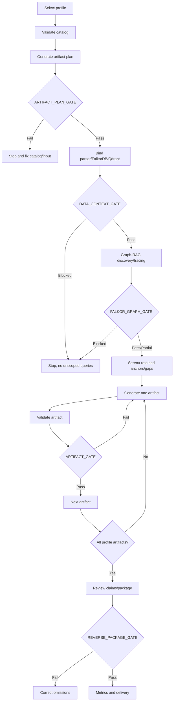
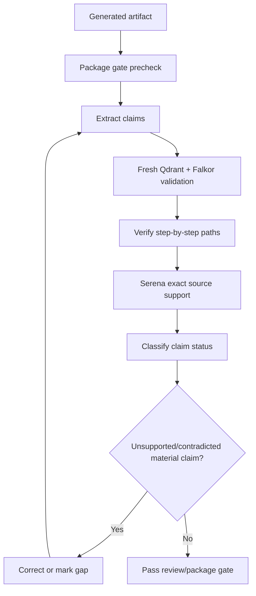
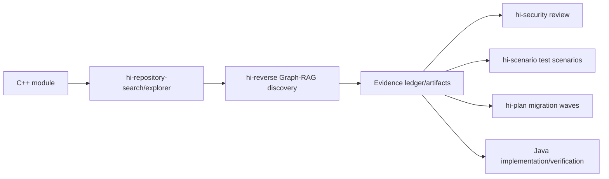

# Hi Reverse Skill: Hướng dẫn đầy đủ

> `hi-reverse` reverse-engineer module C/C++ thành package artifact đã validate: use case, trace, sequence/class/state/activity/architecture diagrams, catalogs, evidence ledger, C++→Java parity/mapping, migration waves/risks/tests và package review.

## 1. Đây không phải “đọc code rồi vẽ diagram”

`hi-reverse` yêu cầu behavior được suy ra từ evidence, không từ tên symbol đoán. Graph-RAG với FalkorDB + Qdrant là primary engine; Serena enrich source-level; native tools chỉ là final fallback.

Mục tiêu:

- discovery đầy đủ có saturation evidence;
- trace trigger → handler → outcome;
- giữ claim-level evidence ledger;
- tạo artifact theo profile;
- validate từng artifact;
- review độc lập;
- package gate trước delivery;
- migration mapping không làm mất parity semantics.

## 2. Profiles

Chọn một:

| Profile | Mục tiêu |
|---|---|
| `usecase` | Reverse một observable business/use case |
| `module` | Tạo module overview/catalog/diagrams |
| `migration` | Map C++ behavior/types/interfaces sang Java |

Runtime yêu cầu Node.js 18+ và commands chạy từ skill directory bằng `npx --yes --offline --package=.`.

## 3. Gate-driven pipeline



Required gates:

- `ARTIFACT_PLAN_GATE`;
- `DATA_CONTEXT_GATE`;
- `FALKOR_GRAPH_GATE`;
- `ARTIFACT_GATE`;
- `REVERSE_PACKAGE_GATE`.

Không claim completion khi required gate fail.

## 4. Preflight và planning commands

1. `hi-reverse-plan --check-catalog`;
2. đọc `PROFILE-USECASE.md` cho usecase, hoặc generated manifest profile guide cho module/migration;
3. generate plan:

```bash
npx --yes --offline --package=. hi-reverse-plan \
  --profile <p> --module <m> [--use-case <slug>] \
  [--condition <c>] --output <manifest> --summary
```

4. yêu cầu `ARTIFACT_PLAN_GATE: PASS`.

Không đọc `ARTIFACT-CATALOG.yaml` trực tiếp trong normal execution; script planner là capability authority.

## 5. Data Context Gate

Trước bất kỳ analysis query:

- activate C++ parser, thường `cplus`;
- confirm FalkorDB context active;
- chọn một C/C++ Qdrant collection;
- validate collection bằng scoped semantic probe;
- module-local hits phải có ít nhất hai hit chứa local paths/qualified names.

Record:

```text
DATA_CONTEXT_GATE: PASS|BLOCKED
parser=cplus
graph_provider=falkordb
graph_context=active|unavailable
qdrant_collection=<validated collection or unavailable>
qdrant_context=active|unavailable
```

Nếu candidate bị reject, bind collection kế tiếp và lặp **chỉ validation probe**. Không chạy query matrix trên nhiều/unscoped collections.

`BLOCKED` phải dừng analysis, không đoán.

## 6. Graph-RAG retrieval order

```text
mind_mcp → graph_mcp/Qdrant → graph_mcp/FalkorDB → Serena → native
```

### 6.1 Preflight

Theo protocol:

1. mind list collections;
2. mind list source IDs nếu documents allowed;
3. mind graph-RAG query nếu documents allowed;
4. graph list functions;
5. graph list parsers;
6. graph list code collections;
7. bind active data context.

Không gọi `graph_mcp.list_databases`, không hardcode/display graph key/endpoint/port/driver.

### 6.2 Query matrix

Applicable query families:

- identity/boundary;
- business intent;
- lifecycle;
- state/mode;
- user trigger;
- integration;
- side effect;
- negative/recovery;
- domain language/multilingual.

Mỗi family cần:

1. semantic search `expand_graph:false` để seed anchors;
2. `explore_graph` để expand FalkorDB relationships;
3. retain vector score và graph evidence riêng;
4. add discovered vocabulary vào pass tiếp theo.

### 6.3 Normalize frontier

Merge theo graph node ID; nếu không có, qualified symbol + file path. Retain:

- node/kind/file/line/class/module;
- exact query/family;
- semantic score và graph WHY/confidence;
- role: trigger, entry, guard, handler, adapter, side effect, recovery;
- paths/relationships/messages/states;
- source support và gaps.

Reject cross-project/module mismatch.

### 6.4 Vertical expansion

Mỗi retained trigger/entry/handler/adapter/side-effect/recovery anchor:

- focused explore query;
- upstream callers/triggers;
- downstream callees/outcomes;
- bidirectional nếu role unclear;
- module paths cho external boundaries;
- callback/virtual/function pointer;
- IPC sender/receiver/handler;
- shared state/cross-module bridges.

Connect trigger → handler → outcome bằng `find_paths`/`trace_flow`; `reconstruct_flow` chỉ dùng khi path shape compatible.

## 7. Falkor Graph Gate

Record:

```text
FALKOR_GRAPH_GATE: PASS|PARTIAL|BLOCKED
provider=falkordb
collection=<validated collection>
semantic_search_calls=<count>
explore_graph_calls=<count>
vertical_graph_trace_calls=<count>
query_families=<completed/applicable>
graph_expansion=<available|no-evidence|unavailable>
```

`PASS` cần:

- validated collection;
- all applicable query families;
- vertical traversal retained anchors;
- two saturation passes;
- FalkorDB graph evidence.

`PARTIAL` chỉ cho phép Serena sau khi Graph-RAG capability đã exhausted và missing evidence được named. `BLOCKED` dừng code analysis.

## 8. Saturation

Sau mỗi pass đo:

- unique nodes/relationships mới;
- path variants/entry candidates;
- triggers/handlers/outcomes;
- upstream/downstream coverage;
- connected trigger-handler-outcome paths;
- IPC/messages/external modules;
- states/modes/guards;
- use-case candidates;
- remaining gaps.

Chỉ pass saturation sau **hai consecutive passes** không thêm material high-confidence item. Stable candidate count chưa đủ nếu paths/errors/messages/states vẫn tăng.

## 9. Serena enrichment

Chỉ bắt đầu sau `FALKOR_GRAPH_GATE: PASS` hoặc `PARTIAL`:

1. `serena.initial_instructions` một lần;
2. activate target repository root;
3. symbols overview trên Graph-RAG files;
4. find retained classes/symbols;
5. body chỉ cho key triggers/guards/handlers/outcomes/gaps;
6. references cho retained anchors;
7. search states/switch/message/callback/validation/timeout/config/multilingual.

Mọi Serena call phải map tới Graph-RAG anchor hoặc named completeness gap. Không restart broad source discovery.

## 10. Evidence ledger

Shared `evidence-ledger.json`; mỗi claim có:

- status;
- graph provider;
- node IDs;
- symbols;
- edges;
- locations;
- retrieval calls;
- Serena support;
- affected artifacts;
- uncertainties.

Statuses:

| Status | Điều kiện |
|---|---|
| `PROVEN` | Trigger, handler, terminal side effect nối bằng Falkor path + source support |
| `LIKELY` | Ít nhất 2/3 connected, bridge còn thiếu được nêu |
| `TENTATIVE` | Semantic/source evidence có nhưng executable path chưa established |
| `REJECTED` | Utility/dead/duplicate/unrelated evidence |

Không upgrade confidence chỉ vì claim được lặp trong nhiều artifact.

## 11. Artifact generation loop

Một artifact mỗi lần:

```bash
npx --yes --offline --package=. hi-reverse-plan --next <manifest>
```

Output compact:

- `ARTIFACT_ID`;
- `TECHNIQUE`;
- `OUTPUT`;
- `EVIDENCE_GAPS`.

Sau đó:

1. đọc technique file duy nhất;
2. retrieve evidence gaps;
3. đọc template đúng artifact;
4. generate;
5. validate:

```bash
npx --yes --offline --package=. hi-reverse-validate-artifact <id> <path> --summary
```

6. require `ARTIFACT_GATE: PASS`;
7. release technique context và gọi `--next` tiếp.

Exit 1 từ `--next` nghĩa all artifacts validated, rồi package gate.

## 12. Use-case bundle

Mỗi use case phải có:

```text
usecase/<MODULE>/
├── ucXXX_<slug>.md
├── trace_<slug>.json
├── seq_<slug>_<YYYYMMDD>_v1.mmd
└── class_<slug>_<YYYYMMDD>_v1.mmd
```

Markdown bắt buộc có:

- `## Sequence Diagram` link exact sequence file;
- `## Class Diagram` link exact class file;
- actor/trigger/precondition/mode/guard;
- main flow với symbol/node/relation/state/evidence;
- alternate/error/timeout/recovery;
- postconditions/side effects;
- IPC/callback/shared-state uncertainties;
- retrieval trace/saturation/gaps;
- artifact gate/version history.

`hi-reverse-validate-package --update` kiểm tra bundle links và package gate.

## 13. Module và migration artifacts

### Module

Thường gồm:

- module map/overview;
- entrypoint/interface catalog;
- class/state/activity/architecture diagrams;
- data dictionary/business rules/errors/concurrency;
- tests/review/open questions.

### Migration

Chỉ generate sau module package structurally valid và evidence-reviewed. Cần:

- behavioral parity;
- type mapping;
- interface/IPC mapping;
- migration waves;
- risks;
- test scenarios.

Không trình bày Java redesign như required parity. Intentional change phải tách riêng.

## 14. Migration mapping chi tiết

### Behavioral parity

Map:

- use case;
- rule;
- state transition;
- side effect;
- error path;
- timing contract;
- required Java behavior;
- acceptance evidence.

### Type mapping

Map C++:

- width/signedness;
- pointer/reference;
- ownership/lifetime;
- enum/union/layout;
- encoding/serialization.

### Interface mapping

Map:

- API;
- IPC message/payload;
- callbacks;
- timeout/retry;
- external contract.

Không silently đổi protocol semantics.

### Migration waves

Order theo:

- runtime dependencies;
- shared data;
- cycles;
- contract ownership;
- independently testable boundaries;
- cycle-breaking strategy;
- entry/exit criteria.

### Migration risks/tests

Rank compatibility, data, concurrency, performance, operational, security, testability. Test scenario phải có source behavior, expected Java behavior, observable outcome và traceability IDs.

## 15. Review workflow

Review độc lập:

1. validate package trước, stop nếu `REVERSE_PACKAGE_GATE` fail;
2. sequence diagram follow trace order;
3. class diagram chỉ có evidenced participants/relations;
4. extract every factual claim;
5. fresh Qdrant paraphrase queries;
6. pair each with explore_graph;
7. verify every executable transition;
8. query callback/virtual/IPC/shared-state bridges;
9. search missing lifecycle/state/integration/side-effect/cancel/error/recovery;
10. sau saturation dùng Serena exact symbols/references/branches/constants/lines;
11. classify `CONFIRMED`, `PARTIAL`, `UNSUPPORTED`, `CONTRADICTED`, `STALE`;
12. rerun artifact/completeness/saturation gates.



UC được Reviewed chỉ khi artifact gate pass, diagrams agree evidence ledger, không còn material unsupported/contradicted claim và applicable dimensions evidenced/unresolved explicitly.

## 16. Metrics

Không dùng file count làm coverage. Required metrics:

- `QUERY_FAMILY_COVERAGE`;
- `ENTRY_CANDIDATE_COVERAGE`;
- `ANCHOR_EXPANSION_COVERAGE`;
- `TRIGGER_HANDLER_OUTCOME_COVERAGE`;
- `ALT_ERROR_COVERAGE`;
- `IPC_CALLBACK_COVERAGE`;
- `SOURCE_SUPPORT_COVERAGE`;
- `PROVEN_UC_RATIO`;
- `UNRESOLVED_GAPS`;
- `SATURATION_STATUS`;
- `GRAPH_RAG_ROUTE`;
- `PROFILE_ARTIFACT_COVERAGE`;
- `REVERSE_PACKAGE_STATUS`.

Append dated snapshot vào `trace_metrics.md`, gồm raw counts, formulas, percentages, route, gaps và highest-priority gaps. Không report 100% khi scope/evidence unresolved.

## 17. Commands map

```text
hi-reverse-init <output-dir>
hi-reverse-plan --check-catalog
hi-reverse-plan --profile <p> --module <m> --output <f> --summary
hi-reverse-plan --next <manifest>
hi-reverse-plan --list-capabilities
hi-reverse-validate-artifact <id> <path> --summary
hi-reverse-validate-package <manifest> --update
hi-reverse-metrics [usecase-dir] [metrics-file] [package-manifest]
```

Dùng `--summary` để compact output; không đọc implementation của validator thay vì chạy validator.

## 18. Constraints và quiet routing

- Không echo backend exceptions, host/port/key/protocol/driver.
- Không narrate fallback/retry operational details cho user.
- Fast-fail một lần/capability; retry một lần chỉ cho `invalid_parameters` theo wrapper schema.
- User constraints:
  - no existing docs: ghi `mind_mcp documents: skipped by user`, vẫn run code Graph-RAG;
  - MCP-only: stop sau Serena, report gaps, không native;
  - possible use case: label mọi result, không biến name-only hit thành proven;
  - không claim exhaustive khi collection/edge/source area thiếu evidence.

## 19. Verify hi-reverse

- [ ] Catalog check pass.
- [ ] Artifact plan gate pass.
- [ ] Parser đúng `cplus`.
- [ ] Một collection validated với module-local hits.
- [ ] Data context gate pass.
- [ ] Query matrix applicable complete.
- [ ] Semantic seed paired với graph expansion.
- [ ] Vertical traversal retained anchors.
- [ ] Two saturation passes zero delta.
- [ ] Falkor graph gate pass/partial có gaps rõ.
- [ ] Serena chỉ enrich retained anchors/gaps.
- [ ] Evidence ledger claim-level đầy đủ.
- [ ] Artifact từng cái validated.
- [ ] Usecase bundle links exact files.
- [ ] Review claim status không còn material unsupported/contradicted.
- [ ] Package gate pass.
- [ ] Metrics snapshot appended.

## 20. Giới hạn

- Graph-RAG phụ thuộc parser/index/collection.
- Dynamic callbacks/IPC/function pointers có thể chưa resolve.
- Static evidence không chứng minh mọi runtime path.
- Saturation là evidence convergence, không phải mathematical exhaustiveness.
- Structural validator không chứng minh semantic correctness.
- Migration parity không đồng nghĩa Java redesign tự động đúng.
- Không được giấu missing evidence bằng prose/diagram đẹp.

## 21. Quan hệ với skill khác



## 22. Tóm tắt

> `hi-reverse` không dịch tên class sang Java hay vẽ diagram từ đoán; nó khóa context, truy hồi Graph-RAG đến saturation, giữ claim-level ledger, validate từng artifact và chỉ deliver package khi evidence, review và gate đều đạt.
