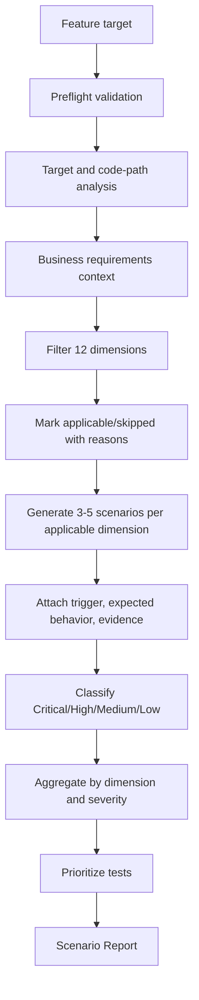
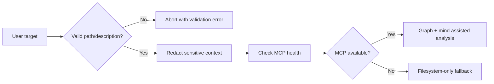
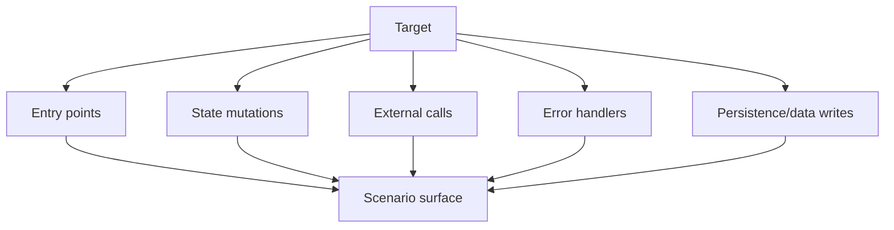
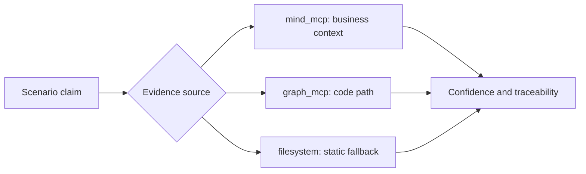
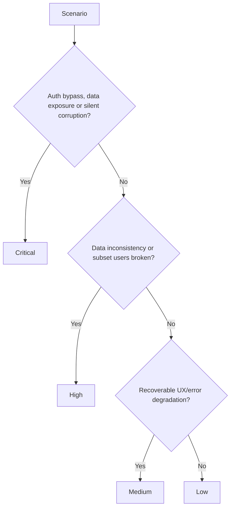
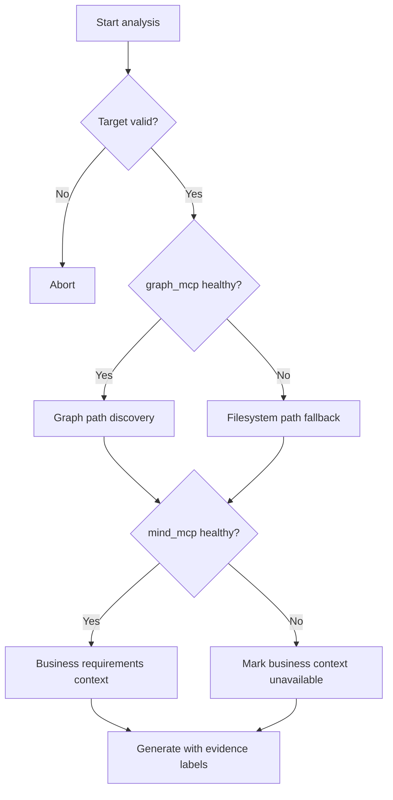
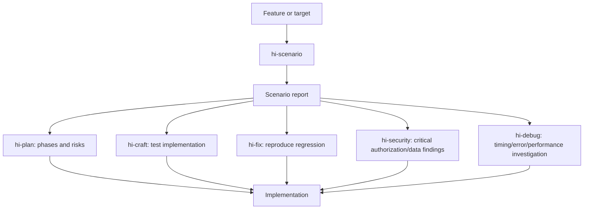
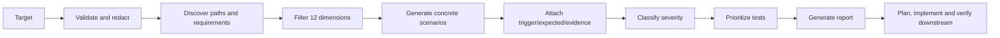

# Hi Scenario Skill: Hướng dẫn đầy đủ

> `hi-scenario` là skill phân rã một feature thành edge cases và test scenarios có thể tái hiện, dựa trên 12 dimensions: user types, input, timing, scale, state, environment, errors, authorization, data integrity, integration, compliance và business logic.

## 1. Hi Scenario giải quyết vấn đề gì?

Một feature có thể chạy đúng happy path nhưng vẫn thất bại khi:

- user khác role sử dụng;
- input rỗng, quá dài hoặc độc hại;
- hai request chạy đồng thời;
- database hoặc external API chậm/không khả dụng;
- state đang ở giữa một workflow;
- dữ liệu đạt boundary scale;
- token hết hạn hoặc quyền không đúng;
- webhook bị replay;
- retention, consent hoặc PII bị xử lý sai;
- business rule có giá trị biên.

`hi-scenario` không cố tạo thật nhiều case một cách mù quáng. Nó:

1. xác định target và code path;
2. lọc dimensions liên quan;
3. tạo scenario cụ thể và reproducible;
4. phân loại severity;
5. gắn evidence source;
6. tạo report và test priority.

## 2. Mental model tổng quát



Output của skill là **risk/test design artifact**, không phải implementation và cũng không phải bằng chứng runtime rằng feature đã pass.

## 3. Khi nào dùng?

### 3.1 Nên dùng

- feature complex hoặc stateful;
- authoring test;
- planning risk assessment;
- API design review;
- refactoring critical path;
- security review;
- onboarding feature chưa quen;
- chuẩn bị review hoặc release;
- cần tìm edge cases trước khi code.

### 3.2 Không nên dùng

- thay đổi cosmetic/trivial;
- code ổn định đã được test tốt và không đổi behavior;
- pure config change không có logic;
- CRUD đơn giản không có business rule;
- docs-only change.

Nếu feature nhỏ nhưng có authorization, data loss hoặc business-critical behavior, vẫn dùng scenario ở depth phù hợp.

## 4. Input contract

Skill nhận:

- `target`: path, glob hoặc description;
- `depth`: `quick` hoặc `deep`;
- optional focus dimensions;
- optional severity filter.

### 4.1 Target

Target cần xác định feature/code surface cần phân tích, ví dụ:

```text
src/payments/refund.ts
src/auth/**
API endpoint POST /orders/{id}/refund
Feature: subscription upgrade and proration
```

### 4.2 Depth

| Depth | Phạm vi |
|---|---|
| `quick` | Các major paths, triage nhanh |
| `deep` | Tất cả branches phù hợp và 12 dimensions |

`quick` không được hiểu là bỏ qua security/error dimensions khi chúng rõ ràng áp dụng. Nó chỉ giảm độ sâu và số lượng path được mở rộng.

### 4.3 Focus dimensions

Có thể yêu cầu tập trung vào một nhóm:

```text
Focus: authorization, data integrity, integration
```

Focused analysis vẫn cần báo dimensions bị skip và lý do, để người đọc biết report có giới hạn.

### 4.4 Severity filter

Có thể lọc output theo severity, ví dụ chỉ xuất Critical/High. Tuy nhiên filter output không nên làm mất record rằng Medium/Low đã được xem xét hay chưa.

## 5. Preflight validation và security

### 5.1 Input validation hook

Skill có pre-hook `input-validation` trên `target` và `analysis_depth`, có redaction enabled.

Target phải:

- tồn tại;
- readable;
- không chứa `../`;
- chỉ dùng whitelist `[a-zA-Z0-9_\-./]`;
- tối đa 1000 ký tự.

Nếu target invalid hoặc không đọc được, preflight abort thay vì đoán.

### 5.2 MCP health-check hook

Skill kiểm tra capability của:

- `graph_mcp` cho code path/relationship;
- `mind_mcp` cho requirements/business context.

Nếu MCP unavailable, fallback sang filesystem/manual analysis và ghi confidence thấp hơn cho scenario phụ thuộc graph/business context.

### 5.3 Redaction

Trước khi gửi query hoặc context tới tool:

- redact secret, token và API key;
- không đưa PII không cần thiết;
- giới hạn source vào target;
- không gửi raw production payload nếu không cần.



## 6. 12 dimensions

| # | Dimension | Câu hỏi chính |
|---:|---|---|
| 1 | User Types | Ai sử dụng và quyền/behavior khác nhau thế nào? |
| 2 | Input Extremes | Input rỗng, lớn, unicode, malformed, injection thì sao? |
| 3 | Timing | Concurrent, timeout, retry, ordering và race thì sao? |
| 4 | Scale | 0, 1, 10k hoặc 1M items, pagination và memory thì sao? |
| 5 | State Transitions | First use, abort, resume, partial và invalid transition thì sao? |
| 6 | Environment | Mobile, no JS, screen reader, VPN, locale, slow network thì sao? |
| 7 | Error Cascades | DB/API/disk/OOM/queue fail lan truyền ra sao? |
| 8 | Authorization | Expired token, wrong role, CSRF, horizontal/vertical escalation? |
| 9 | Data Integrity | Duplicate, orphan, encoding, migration và transaction thì sao? |
| 10 | Integration | Replay, version mismatch, outage, rate limit và contract drift? |
| 11 | Compliance | GDPR, audit, retention, consent, PII và export? |
| 12 | Business Logic | Pricing, coupon, refund, subscription, quota, points? |

Không phải feature nào cũng cần cả 12. Rule là **filter trước, generate sau**.

## 7. Workflow bốn phase

### 7.1 Phase 0: Target Analysis

Mục tiêu là hiểu code path và context trước khi nghĩ edge case.

Các bước:

1. validate target;
2. đọc source files;
3. query `graph_mcp`:
   - `semantic_search` với `top_k: 50`;
   - `explore_graph` depth 5;
   - `trace_flow` depth 5;
   - `find_paths` tới error handlers, tối đa 10;
4. query `mind_mcp` `hybrid_search` limit 10;
5. xác định entry points;
6. xác định state mutations;
7. xác định external calls;
8. report phase complete.

Output status:

```text
Phase 0 complete: Target analyzed
```

Các artifact cần nhận diện:



Graph-derived scenarios phải tham chiếu actual code paths. Không dùng graph result chung chung để tạo scenario không có đường thực thi.

### 7.2 Phase 1: Dimension Filtering

Đánh giá từng dimension:

- `Applicable`: feature thực sự có behavior thuộc dimension;
- `Skipped`: không áp dụng, phải ghi reason;
- `Priority`: risk cao/thấp để quyết định thứ tự.

Ví dụ applicability:

```yaml
dimension_applicability:
  user_types: "Applicable if feature has role-based behavior"
  input_extremes: "Applicable if feature accepts user input"
  timing: "Applicable if concurrent access or async operations"
  scale: "Applicable if feature processes collections"
  state_transitions: "Applicable if feature has multi-step flows"
  environment: "Applicable if feature runs in browser or client"
  error_cascades: "Always applicable for server-side code"
  authorization: "Applicable if feature has access control"
  data_integrity: "Applicable if feature writes to database"
  integration: "Applicable if feature calls external services"
  compliance: "Applicable if feature handles user data"
  business_logic: "Applicable if feature has pricing/rules"
```

Rule đặc biệt:

> Không bao giờ skip `error_cascades` cho server-side code.

Report status:

```text
Phase 1 complete: 8/12 dimensions applicable
```

### 7.3 Phase 2: Scenario Generation

Với mỗi dimension applicable, tạo 3-5 scenario:

- concrete;
- reproducible;
- implementation-agnostic;
- có trigger;
- có expected behavior;
- có evidence.

Ưu tiên dimension high-risk trước, skip dimension không applicable.

Scenario template:

```yaml
scenario:
  dimension: "Which of the 12 dimensions"
  scenario: "Concrete edge case"
  trigger: "How to reproduce"
  expected: "What should happen"
  evidence: "mind_mcp | graph_mcp | filesystem"
```

Report status:

```text
Phase 2 complete: 32 scenarios generated
```

“Implementation-agnostic” nghĩa scenario mô tả behavior/trigger/expected, không khóa vào một cách code cụ thể nếu chưa cần.

### 7.4 Phase 3: Severity Classification

Phân loại từng scenario:

| Severity | Ý nghĩa |
|---|---|
| Critical | Data loss, security breach, auth bypass, silent corruption |
| High | Feature hỏng với subset user, data inconsistency |
| Medium | UX degraded, recoverable error không surfaced rõ |
| Low | Visual glitch nhỏ, non-blocking warning |

Rules không thương lượng:

- auth bypass luôn Critical;
- data exposure luôn Critical;
- silent corruption luôn Critical;
- UI-only issue là Low, trừ khi ảnh hưởng accessibility/security/business;
- Critical phải mô tả expected behavior cụ thể.

Report status:

```text
Phase 3 complete: Scenarios classified
```

### 7.5 Phase 4: Report Generation

Các bước:

1. aggregate theo dimension và severity;
2. tạo applicability summary;
3. tạo skipped table có reason;
4. tạo scenario table;
5. tạo severity summary;
6. tạo test priorities;
7. liệt kê evidence sources;
8. report phase complete.

Report status:

```text
Phase 4 complete: Report generated
```

## 8. Chi tiết từng dimension

### 8.1 User Types

Hỏi:

- unauthenticated user truy cập thì sao;
- admin, regular user, moderator có behavior khác không;
- banned/suspended session;
- brand-new user không có history/data;
- power user có usage cực đoan;
- bot/scraper user agent.

Scenario examples:

| Scenario | Trigger | Expected |
|---|---|---|
| Guest gọi protected action | Request không có session | 401/redirect rõ, không leak data |
| Banned user gọi API | Session hợp lệ nhưng account suspended | Từ chối và audit event |
| New user mở dashboard | User chưa có record phụ | Empty state, không null crash |
| Bot gửi burst | Non-human UA gửi nhiều request | Rate limit và không làm cạn resource |

### 8.2 Input Extremes

Checklist:

- empty/null/undefined;
- max length, ví dụ 1MB text trong name;
- unicode, emoji, RTL, zero-width;
- `<script>`, `' OR 1=1 --`, `../../../etc/passwd`;
- negative/overflow numbers;
- international email;
- malformed JSON/XML.

Expected behavior phải nói rõ reject, normalize, escape, truncate hay accept có giới hạn. Không ghi “handle gracefully” mà không định nghĩa response/state.

### 8.3 Timing

Checklist:

- hai user submit cùng lúc;
- DB query 5 giây;
- external call timeout;
- double-click;
- scheduled job overlap manual action;
- network reorder request.

Cần xác định idempotency, lock, timeout, retry, ordering và user-visible status.

### 8.4 Scale

Checklist:

- 0 items;
- 1 item;
- 10,000+ items;
- last page đúng boundary;
- cursor wrap-around;
- list bị modify trong lúc paginate.

Expected behavior cần đề cập memory, latency, pagination consistency và UI empty/single state.

### 8.5 State Transitions

Checklist:

- first-time use;
- abort giữa flow;
- resume sau crash;
- partial completion;
- skip/backwards invalid transition;
- deadlock/unreachable state.

Nếu feature là state machine, scenario phải chỉ ra state trước, trigger và state sau.

### 8.6 Environment

Checklist:

- mobile low CPU/memory;
- JavaScript disabled;
- screen reader;
- proxy/VPN;
- timezone UTC+14 đến UTC-12;
- locale/date/number/RTL;
- slow 3G.

Environment scenario nên nêu requirement tối thiểu, fallback và degradation behavior.

### 8.7 Error Cascades

Checklist:

- DB connection fail;
- external API 500;
- disk full;
- OOM;
- network partition/split-brain;
- partial write/rollback;
- message queue full/backpressure.

Với server-side code, dimension này luôn applicable. Expected phải mô tả error boundary, rollback, retry, alert và user response.

### 8.8 Authorization

Checklist:

- expired JWT;
- wrong role vào admin endpoint;
- leaked/shared token;
- CORS misconfiguration;
- missing CSRF;
- horizontal privilege escalation;
- vertical privilege escalation.

Auth bypass/data exposure luôn Critical. Scenario phải nêu actor, resource, permission và expected denial.

### 8.9 Data Integrity

Checklist:

- duplicate entry;
- orphan reference;
- UTF-8/Latin-1 mismatch;
- concurrent migration/write;
- soft delete inconsistency;
- circular foreign key.

Cần kiểm tra unique constraint, transaction, rollback, idempotency, consistency và repair path.

### 8.10 Integration

Checklist:

- webhook replay;
- API version mismatch;
- third-party outage;
- contract drift;
- external rate limit;
- SSL certificate expiry.

Expected behavior nên đề cập retry/backoff, idempotency key, dead-letter, fallback và observability.

### 8.11 Compliance

Checklist:

- GDPR deletion;
- audit logging gap;
- retention purge;
- PII trong log/error;
- consent opt-out nhưng vẫn collect;
- data export đầy đủ.

Compliance scenario cần chỉ ra data category, actor, retention, audit evidence và expected deletion/export behavior.

### 8.12 Business Logic

Checklist:

- price $0, negative, rounding;
- coupon stacking;
- refund sau partial delivery;
- quota đúng limit và over limit;
- trial/payment/upgrade/downgrade;
- loyalty points earn/redeem/expire cùng lúc.

Expected behavior phải bám rule nghiệp vụ, không chỉ status code.

## 9. Scenario quality

### 9.1 Scenario tốt

Một scenario tốt trả lời đủ:

```text
Who/what: actor và feature
Precondition: state/data/config trước đó
Trigger: thao tác hoặc event cụ thể
Expected: behavior, response, state, side effect
Severity: impact nếu fail
Evidence: source đã kiểm tra
```

Ví dụ:

```markdown
- Dimension: Timing
- Scenario: Hai request refund cùng order được gửi trong cùng transaction window
- Trigger: Gửi hai POST request đồng thời với cùng idempotency key
- Expected: Chỉ một refund được tạo; request còn lại trả kết quả idempotent; không double-charge
- Severity: Critical
- Evidence: refund service entry point + payment provider integration
```

### 9.2 Scenario xấu

```text
- Check concurrency.
- Handle errors.
- Test edge cases.
```

Các câu trên không reproducible, không có expected behavior, không có severity hoặc evidence.

### 9.3 Implementation-agnostic nhưng code-grounded

Scenario không nên chỉ phụ thuộc class/private function. Tuy nhiên graph-derived scenario phải có actual code path làm evidence. Cân bằng như sau:

- mô tả behavior ở cấp feature;
- tham chiếu entry point/state mutation/external call;
- không dictating implementation mới;
- giữ traceability để developer tìm được nơi verify.

## 10. Evidence sources và confidence

### 10.1 mind_mcp

Dùng cho:

- business requirements;
- domain concepts;
- product rules;
- compliance context;
- expected behavior không nằm rõ trong source.

### 10.2 graph_mcp

Dùng cho:

- entry point;
- call path;
- state mutation;
- external call;
- error handler;
- dependency và actual execution path.

### 10.3 filesystem

Dùng fallback khi MCP unavailable:

- source files;
- tests;
- config;
- docs local;
- static analysis.

Scenario filesystem-only nên được mark confidence thấp hơn nếu business context hoặc dynamic path chưa verify được.



## 11. Severity và test priority

### 11.1 Severity decision tree



### 11.2 Priority mapping

| Priority | Severity | Action |
|---|---|---|
| Immediate | Critical | Test/fix before implementation or release |
| Sprint | High | Đưa vào current implementation/test scope |
| Backlog | Medium + Low | Schedule theo impact và capacity |

Critical không đồng nghĩa scenario chắc chắn xảy ra; nó phản ánh impact nếu xảy ra.

## 12. Output contract

Report chuẩn có title:

```text
# Scenario Report — {target}
```

Header cần có:

- date;
- depth;
- source.

Các section bắt buộc:

1. `Dimensions Analyzed` list;
2. `Skipped` table có reason;
3. `Scenarios` table với columns:
   - #;
   - Dimension;
   - Scenario;
   - Severity;
   - Expected;
4. `Severity Summary`:
   - Critical;
   - High;
   - Medium;
   - Low;
   - Total;
5. `Test Priorities`:
   - Immediate = Critical;
   - Sprint = High;
   - Backlog = Medium + Low;
6. `Evidence Sources`:
   - mind_mcp;
   - graph_mcp;
   - filesystem.

Deliverable mặc định:

```text
scenario_report_{target}_{timestamp}.md
```

## 13. Progress và observability

Skill phải report progress:

- phase start/complete;
- dimension progress;
- final summary;
- counts theo severity.

Metrics cần track:

- total scenarios;
- dimensions analyzed/skipped;
- average scenarios per dimension;
- severity distribution;
- evidence coverage MCP-sourced vs filesystem-sourced.

Ví dụ final summary:

```text
Phase 0 complete: Target analyzed
Phase 1 complete: 8/12 dimensions applicable
Phase 2 complete: 32 scenarios generated
Phase 3 complete: 4 Critical, 10 High, 12 Medium, 6 Low
Phase 4 complete: Report generated
Evidence coverage: graph 60%, mind 20%, filesystem 20%
```

Progress không chỉ để user thấy activity; nó giúp phát hiện dimension timeout hoặc report partial.

## 14. Timeout và operational behavior

Timeout configuration:

| Priority/process | Timeout |
|---|---:|
| p0 | 120s |
| p1 | 30s |
| p2 | 300s |
| p3 | 60s |
| p4 | 60s |
| Total | 600s |

Nếu dimension timeout:

- skip dimension đó;
- ghi reason;
- tiếp tục các dimension khác;
- đánh dấu report partial nếu cần;
- không tạo findings như thể dimension đã được phân tích.

MCP p0 timeout fallback sang filesystem analysis. Partial data vẫn có thể tạo report nhưng phải nêu confidence/gap.

## 15. MCP fallback strategy

### 15.1 Preflight fail

Nếu target invalid/readability fail: abort.

### 15.2 MCP unavailable

Nếu graph/mind unavailable:

1. skip MCP ngay, không retry vô hạn;
2. đọc source/filesystem thủ công;
3. derive call paths từ static analysis;
4. skip business context nếu không có nguồn thay thế;
5. mark graph-derived scenarios confidence thấp hơn;
6. ghi MCP gap trong report.



## 16. Hooks và cleanup

### 16.1 Pre-hooks

| Hook | Scope | Mục đích |
|---|---|---|
| `input-validation` | target, analysis_depth | Reject invalid/unsafe input |
| `mcp-health-check` | MCP capabilities | Chọn full hoặc fallback mode |

### 16.2 Post-hook

`cleanup-handler` áp dụng cho `scenario-data/` và giữ lại:

```text
*.json
*.md
```

Mục tiêu là dọn temporary artifacts nhưng bảo toàn structured data/report cần dùng tiếp. Không xóa report hoặc JSON evidence hợp lệ.

## 17. Verify hi-scenario như thế nào?

### 17.1 Target verify

- [ ] Target tồn tại và readable.
- [ ] Không chứa `../`.
- [ ] Chỉ dùng ký tự whitelist.
- [ ] Không vượt 1000 ký tự.
- [ ] Sensitive context đã redacted.

### 17.2 Analysis verify

- [ ] Entry points đã xác định.
- [ ] State mutations đã xác định.
- [ ] External calls đã xác định.
- [ ] Error handlers đã trace.
- [ ] Graph/mind capability đã check.
- [ ] Fallback được ghi nếu MCP unavailable.

### 17.3 Dimension verify

- [ ] Cả 12 dimensions đều được evaluate.
- [ ] Applicable dimensions có lý do.
- [ ] Skipped dimensions có reason.
- [ ] Error cascades không bị skip cho server-side.
- [ ] Focus/severity filter không che mất applicability context.

### 17.4 Scenario verify

- [ ] Mỗi scenario concrete.
- [ ] Trigger reproducible.
- [ ] Expected behavior cụ thể.
- [ ] Severity hợp lý.
- [ ] Evidence source được ghi.
- [ ] Graph-derived scenario tham chiếu code path thật.
- [ ] Không tạo noise cho dimension không applicable.

### 17.5 Report verify

- [ ] Header có date/depth/source.
- [ ] Dimensions analyzed có list.
- [ ] Skipped table có reasons.
- [ ] Scenario table đủ columns.
- [ ] Severity totals khớp scenario count.
- [ ] Test priorities map đúng.
- [ ] Evidence coverage được báo.
- [ ] Partial/timeout/tool degradation được ghi.
- [ ] Deliverable nằm đúng path.

## 18. Ví dụ: API refund

Target:

```text
POST /orders/{id}/refund
```

### 18.1 Phase 0

Tìm:

- refund controller/entry point;
- authorization middleware;
- order/payment state mutation;
- transaction boundary;
- payment provider call;
- webhook/retry handler;
- refund tests;
- audit/compliance docs.

### 18.2 Dimension filtering

Applicable:

- User Types: admin, support, customer;
- Input Extremes: amount, currency, reason;
- Timing: double submit/concurrent refund;
- State: delivered/partial/cancelled;
- Error Cascades: DB/provider failure;
- Authorization: ownership/role;
- Data Integrity: duplicate/refund total;
- Integration: provider retry/webhook;
- Compliance: audit/PII;
- Business Logic: partial refund/rounding.

Có thể skip Environment nếu endpoint server-only và UI không thuộc target, nhưng vẫn ghi lý do.

### 18.3 Scenario examples

```markdown
| # | Dimension | Scenario | Severity | Expected |
|---|---|---|---|---|
| 1 | Timing | Hai refund cùng order cùng lúc | Critical | Chỉ một refund hợp lệ; không double-charge |
| 2 | Authorization | Customer refund order của user khác | Critical | 403, không lộ order/payment data |
| 3 | Integration | Provider timeout sau khi charge đã tạo | Critical | Idempotent retry/reconciliation, không tạo duplicate |
| 4 | Business Logic | Refund amount vượt amount đã thanh toán | High | Reject rõ, không mutation |
| 5 | Data Integrity | Webhook refund replay | High | Idempotent, một internal refund record |
| 6 | Compliance | Error trả về payment token | Critical | Mask sensitive data, audit event không chứa secret |
```

### 18.4 Test priority

- Immediate: duplicate refund, cross-user access, provider timeout/ambiguous result, token exposure;
- Sprint: rounding, partial delivery, webhook replay, audit completeness;
- Backlog: non-critical UI copy hoặc recoverable display issue.

## 19. Ví dụ: subscription upgrade

Dimensions ưu tiên:

- Business Logic: proration, coupon, trial, currency;
- Timing: double click, concurrent upgrade/downgrade;
- Integration: payment provider timeout, webhook reorder;
- Data Integrity: duplicate invoice, subscription state;
- Compliance: consent, invoice retention, PII;
- User Types: admin/support/customer;
- Scale: batch migration hoặc many subscriptions.

Scenario phải mô tả state transition:

```text
Precondition: subscription đang trial, payment method hợp lệ.
Trigger: upgrade đúng lúc trial expiry job chạy.
Expected: một state transition được commit theo ordering policy;
không charge hai lần; invoice/audit phản ánh kết quả.
```

## 20. Ví dụ: UI search list

Dimensions áp dụng:

- Input Extremes: empty, unicode, injection, max length;
- Scale: zero/one/10k results, pagination boundary;
- Timing: debounce, out-of-order responses, slow 3G;
- State: clear query, back/forward, refresh;
- Environment: mobile, screen reader, no JS;
- Authorization: result visibility per user.

Environment không được auto-skip chỉ vì “đây là UI”. Nó thường là dimension quan trọng nhất cho UI behavior.

## 21. Quan hệ với các skill khác



| Skill | Hi Scenario cung cấp |
|---|---|
| `hi-plan` | Risk list, edge cases, success criteria và test priorities |
| `hi-craft` | Scenario để viết test và verify implementation |
| `hi-fix` | Reproduction cases và regression test candidates |
| `hi-debug` | Hypothesis/test inputs cho timing, error cascade, performance |
| `hi-security` | Auth, data exposure, injection và compliance scenarios |
| `hi-codebase-research-explorer` | Code path/source context để scenario có traceability |
| `hi-sequential-thinking` | Decompose complex scenario space và compare branches |

## 22. Giới hạn cần hiểu đúng

### 22.1 Static analysis only

Skill không runtime simulate toàn bộ scenario. Quality phụ thuộc:

- graph paths;
- mind requirements;
- source/test context;
- completeness của target.

Scenario phải được runtime verify bởi test, staging hoặc browser khi cần.

### 22.2 Không phải 12 dimensions đều áp dụng

Ép mọi feature qua cả 12 sẽ tạo noise. Nhưng skip phải có lý do rõ.

### 22.3 Rare edges có thể bị bỏ sót

Deep mode tăng coverage nhưng không chứng minh exhaustive. Concurrency và environment thường cần runtime/load/browser verification.

### 22.4 MCP dependency

Deep analysis cần graph_mcp; business context cần mind_mcp. Filesystem-only mode có thể tạo report hữu ích nhưng confidence và scope hạn chế hơn.

### 22.5 Severity không phải implementation priority duy nhất

Critical cần immediate attention, nhưng effort, likelihood, exposure và deployment context vẫn phải được team cân nhắc. Report nên giữ severity và priority thành hai khái niệm riêng.

## 23. Tóm tắt nhanh



Câu ngắn nhất để nhớ:

> `hi-scenario` không hỏi “happy path có chạy không?”, mà lập bản đồ có hệ thống về ai có thể dùng, input nào có thể phá, state nào có thể lệch, dependency nào có thể fail và behavior nào phải được chứng minh.
