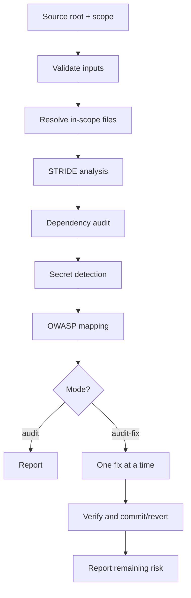
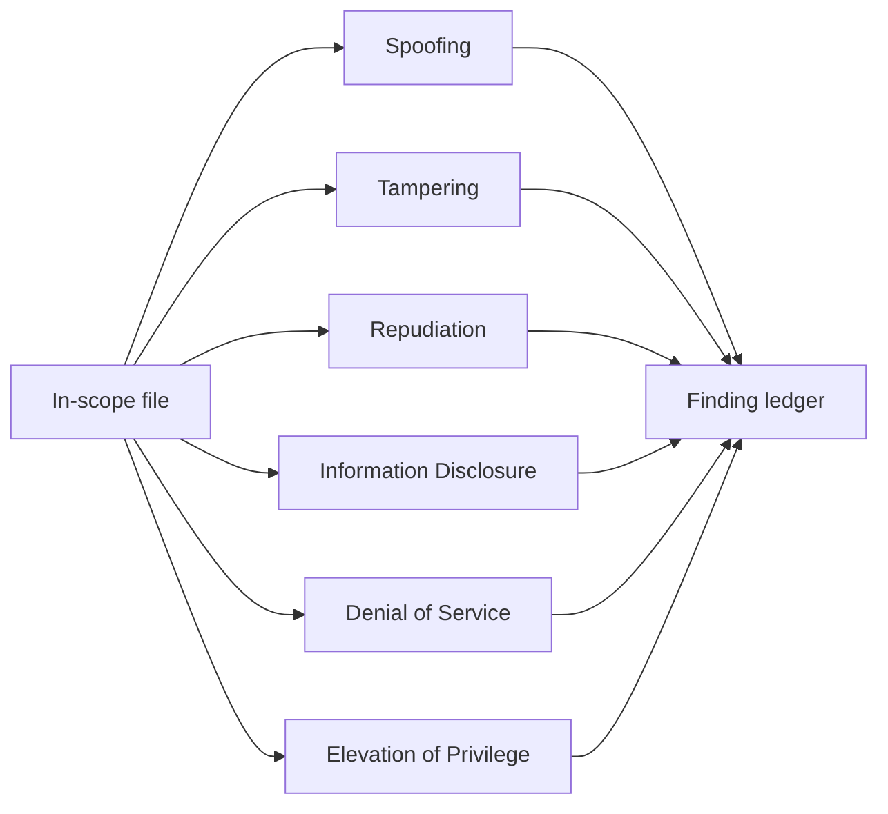
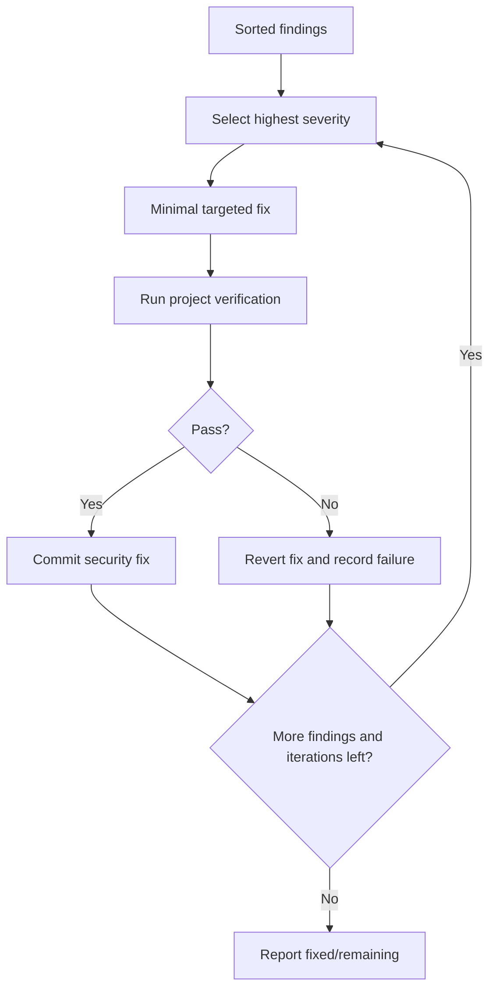
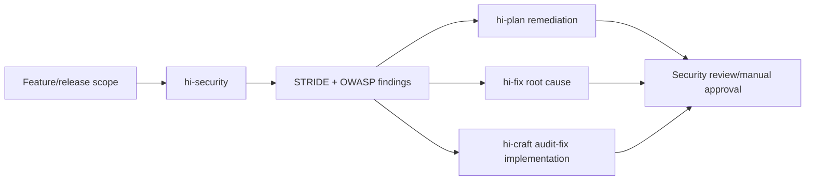

# Hi Security Skill: Hướng dẫn đầy đủ

> `hi-security` là security audit theo STRIDE + OWASP, có MCP-assisted code discovery, dependency audit, secret detection và optional iterative auto-fix. Nó dùng để audit trước release, sau feature nhạy cảm hoặc trong compliance review.

## 1. Khi nào dùng?

Nên dùng cho:

- trước release;
- sau auth/payment/data feature;
- periodic security review;
- SOC 2, GDPR, PCI-DSS preparation;
- sau dependency update;
- khi có CVE;
- audit scope có user-facing code/data.

Không dùng cho:

- cosmetic-only change;
- repository không có user-facing code;
- standalone dependency audit đơn giản, dùng `npm audit`/`pip-audit` trực tiếp;
- quick unstructured review.

## 2. Input và mode

Required:

- source root path;
- audit scope: glob hoặc directory;
- mode: `audit` hoặc `audit-fix`.

Optional:

- `max_iterations`: mặc định 10, range 1-50;
- `focus_area`: `auth`, `data`, `api`, `infra`, `all`.

| Mode | Flow | Kết quả |
|---|---|---|
| `audit` | scan → categorize → report | Findings và recommendations, không sửa |
| `audit-fix` | scan → categorize → fix Critical→High→Medium → verify → report | Applied fixes + remaining findings |



## 3. Input validation và safety

Path:

- block `../`;
- whitelist `[a-zA-Z0-9_\-./*]`;
- max 1000 chars;
- source phải tồn tại/readable.

Scope:

- mode thuộc `{audit,audit-fix}`;
- focus thuộc `{all,auth,data,api,infra}`;
- max iterations 1-50.

Hooks:

- pre `mcp-health-check`, timeout 10s;
- pre `input-validation` với redaction;
- post `output-redaction` cho report/findings;
- post cleanup giữ `*.json`, `*.md` dưới `security-audit-data/`.

Không log/store detected secrets ở plaintext.

## 4. Performance và limits

- tối đa 5000 files;
- tối đa 10MB/file;
- tối đa 100 findings/category;
- total khoảng 30 phút theo env config;
- cache invalidated khi scope/workflow start.

Progress cần report:

```text
Phase {N} started: {phase_name}
Scanning: {file_path} ({current}/{total})
Analyzing STRIDE: {category}
Fixing: #{finding_number} of {total} ({severity})
Phase {N} complete: Critical={c}, High={h}, Medium={m}
Audit complete: files, findings, fixes
```

## 5. Severity

| Level | Ý nghĩa | Priority |
|---|---|---|
| Critical | Exploitable now: breach, RCE, auth bypass | Block release/immediate |
| High | Impact significant, moderate exploit effort | This sprint |
| Medium | Limited exploitability/impact | Next sprint |
| Low | Theoretical/defense-in-depth | Backlog |
| Info | Best practice, no direct risk | Optional |

## 6. Workflow phases

### Phase 0: Scope Resolution

1. validate source/scope/mode/focus;
2. expand glob thành file list;
3. classify file types;
4. exclude test fixtures, examples, docs khi policy cho phép;
5. query `mind_mcp` security policy nếu available;
6. report số file in scope.

Không audit file ngoài scope rồi claim full coverage.

### Phase 1: STRIDE Analysis

Với mỗi in-scope file:

- phân tích 6 STRIDE categories;
- dùng `graph_mcp` tìm entry points/auth/data paths;
- dùng `mind_mcp` cho policy/compliance context;
- record file:line, category, description, severity, recommendation;
- report finding count.



### Phase 2: Dependency Audit

1. detect stack từ manifest;
2. chạy đúng audit tool;
3. parse CVEs;
4. ghi `cve`, package, severity, fix_version, recommendation;
5. report dependency findings.

| Stack | Command |
|---|---|
| Node.js | `npm audit --json` |
| Python | `pip-audit --format json` |
| Go | `govulncheck ./...` |
| Ruby | `bundle audit check --update` |
| Java/Maven | `mvn dependency-check` |
| Rust | `cargo audit` |

Audit tool phải đúng detected stack. Không chạy `npm audit` cho Python rồi coi là dependency audit hoàn tất.

### Phase 3: Secret Detection

Scan pattern:

- generic API keys;
- AWS `AKIA*` và secret key;
- JWT;
- hardcoded passwords;
- PEM private keys;
- GitHub `ghp_*`;
- Stripe `sk_live_`/`sk_test_`;
- Bearer tokens;
- DB connection strings có credential.

False-positive exclusions:

- `*.test.*`, `*.spec.*`, `*.example`;
- test/tests/__tests__/fixtures;
- placeholders `YOUR_KEY_HERE`, `<your-token>`, `TODO`;
- markdown placeholder nếu rõ ràng.

Mọi match phải được verify context để giảm false positive. Secret match thật là Critical; report không in secret plaintext.

### Phase 4: OWASP Mapping

Map findings:

| OWASP | Category |
|---|---|
| A01 | Broken Access Control |
| A02 | Cryptographic Failures |
| A03 | Injection |
| A04 | Insecure Design |
| A05 | Security Misconfiguration |
| A06 | Vulnerable/Outdated Components |
| A07 | Identification/Auth Failures |
| A08 | Software/Data Integrity Failures |
| A09 | Logging/Monitoring Failures |
| A10 | SSRF |

Dependency findings map A06; secret exposure thường A02/A05.

### Phase 5: Fix Execution

Chỉ `audit-fix`:

1. sort Critical → High → Medium;
2. fix một finding mỗi iteration;
3. run verification;
4. commit nếu pass;
5. revert nếu fail;
6. skip Low/Info, chỉ document;
7. stop ở max_iterations.

Rules:

- không fix hơn một issue/iteration;
- test pass trước khi sang issue tiếp;
- auth changes cần manual review;
- không sửa test/config secrets.



### Phase 6: Report Generation

Aggregate:

- counts by severity;
- file:line findings;
- STRIDE/OWASP categories;
- dependency status;
- secret exposure status;
- fixes applied/failed/reverted;
- prioritized next steps;
- residual risk.

## 7. STRIDE checklist

### Spoofing

- endpoint auth;
- bcrypt/argon2, không MD5/SHA1;
- JWT expiry/server validation;
- Secure/HttpOnly/SameSite cookies;
- MFA cho sensitive operations;
- OAuth/OIDC `state`;
- default credentials.

### Tampering

- input validation;
- parameterized queries;
- CSRF;
- request signing;
- file upload magic bytes/size/content;
- unsafe deserialization;
- method restriction.

### Repudiation

- auth events;
- authorization failures;
- actor/timestamp data modifications;
- no password/token/PII logs;
- append-only/integrity;
- retention policy.

### Information Disclosure

- no stack trace production;
- no internal IDs/path/version unnecessary;
- encryption at rest;
- TLS 1.2+;
- no hardcoded secrets;
- `.env` ignored;
- minimum response fields.

### Denial of Service

- rate limits;
- body size;
- pagination;
- external/DB timeout;
- clean connection pools;
- ReDoS review;
- job concurrency/dead-letter.

### Elevation of Privilege

- server-side RBAC;
- horizontal checks/IDOR;
- stricter admin middleware;
- re-auth for escalation;
- least-privilege service accounts;
- minimal third-party permissions.

## 8. Output contract

Deliverables:

```text
audit_report_{timestamp}.md
audit_summary_{timestamp}.md
findings_{timestamp}.json
fix_log_{timestamp}.md  # audit-fix only
```

Mỗi finding phải có:

- file:line;
- STRIDE;
- OWASP;
- severity;
- description;
- evidence/context;
- recommendation;
- fix status nếu audit-fix;
- confidence/limitations nếu relevant.

Không dùng claim vague như “auth may be weak” không có locator.

## 9. Fallback và partial report

- invalid source/scope: abort;
- MCP unavailable: filesystem-only pattern audit, lower confidence;
- empty scope: abort;
- MCP timeout: filesystem patterns;
- missing tool: skip + warning;
- large file: skip và ghi gap;
- verify fail: revert fix;
- partial data: generate partial report, không claim exhaustive.

Secret detection vẫn chạy bình thường khi MCP unavailable.

## 10. Metrics

Track:

- files scanned;
- lines analyzed;
- duration;
- findings by severity;
- fixes attempted/applied/failed/reverted;
- verification failures;
- MCP calls/cache hit rate.

Không report 0 finding nếu phase bị skip hoặc scope không đầy đủ.

## 11. Verify hi-security

- [ ] Source/scope/mode/focus validated.
- [ ] File count/size limits enforced.
- [ ] STRIDE đủ 6 categories.
- [ ] Graph entry/auth/data paths đã được dùng khi available.
- [ ] Dependency audit đúng stack.
- [ ] Secret matches verified và redacted.
- [ ] OWASP mapping đầy đủ.
- [ ] Mỗi finding có file:line.
- [ ] Audit-fix một fix/lần.
- [ ] Verify sau mỗi fix.
- [ ] Fail thì revert.
- [ ] Auth fix manual-review flag.
- [ ] Output redacted.
- [ ] Remaining risks và gaps được ghi.

## 12. Ví dụ auth audit

Target: `src/auth/**`, focus `auth`, mode `audit`.

Expected findings:

- endpoint thiếu server-side auth: Critical/A01/A07;
- JWT không có `exp`: High/A07;
- password MD5: Critical/A02/A07;
- auth failure không log actor/resource: Medium/A09;
- rate limit thiếu login: High/A04/A07;
- token plaintext trong log: Critical/A02/A09.

Mỗi finding cần exact file/line và mitigation cụ thể.

## 13. Quan hệ với skill khác



## 14. Giới hạn

- Static audit không thay runtime penetration/load test.
- Distributed auth spanning nhiều repo có thể bị miss.
- Dependency tool cần được install và lockfile ảnh hưởng coverage.
- Vendor-patched dependency có thể false positive.
- Pattern secret detection miss custom formats và false positive.
- Auto-fix conservative; auth changes luôn manual review.

## 15. Tóm tắt

> `hi-security` không chỉ quét keyword “password”; nó kết hợp scope, STRIDE, OWASP, dependency, secret, severity và one-fix-at-a-time verification để biến security risk thành findings có locator, mitigation và trạng thái rõ ràng.
