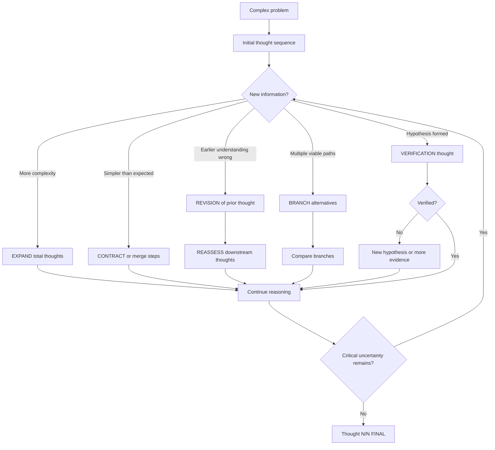
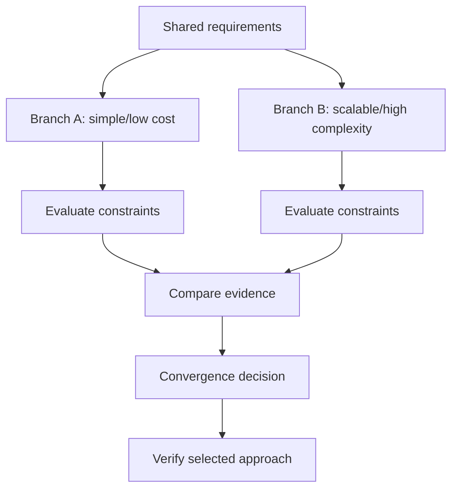
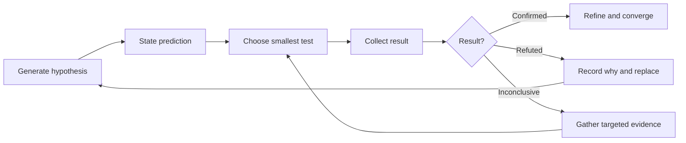
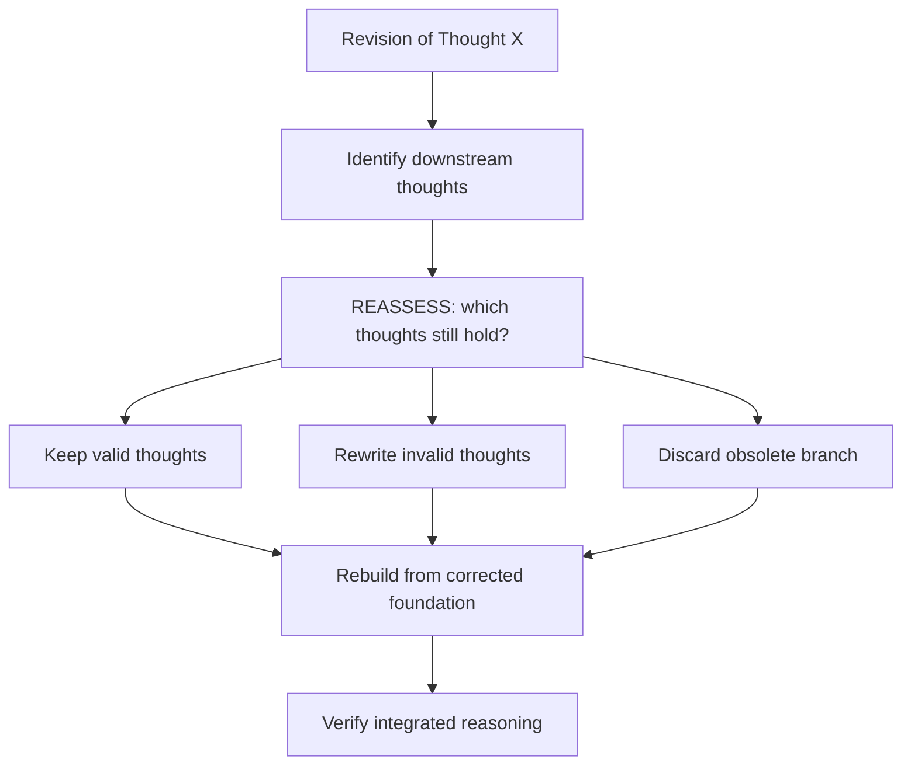
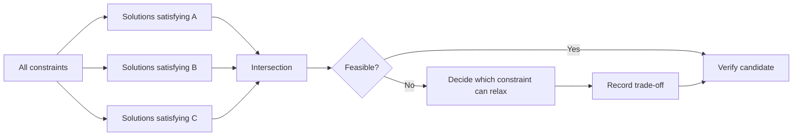
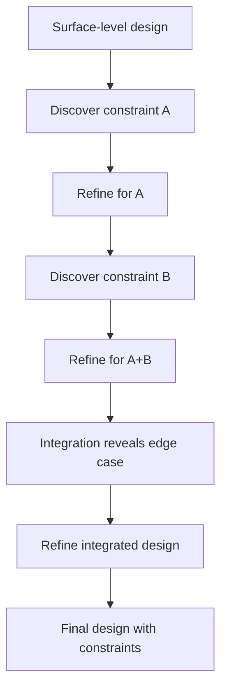
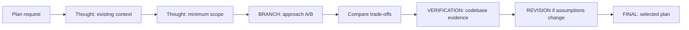
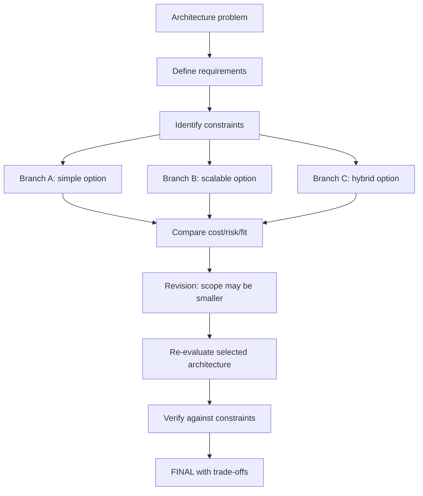
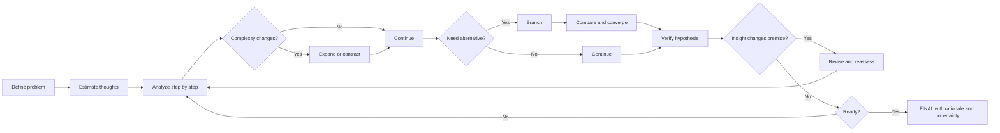

# Hi Sequential Thinking Skill: Hướng dẫn đầy đủ

> `hi-sequential-thinking` là skill tổ chức suy luận thành chuỗi thought có đánh số, có thể mở rộng/thu gọn, revision, branch, hypothesis verification và convergence. Nó phù hợp với bài toán phức tạp, scope chưa rõ hoặc cần course correction.

## 1. Skill này giải quyết vấn đề gì?

Suy luận tuyến tính đơn giản thường gặp các vấn đề:

- chốt solution quá sớm;
- giả định ban đầu sai nhưng các bước sau vẫn xây trên đó;
- nhiều approach được xem xét nhưng không so sánh rõ;
- không biết hypothesis đã được verify chưa;
- complexity tăng nhưng số bước không được điều chỉnh;
- revision làm mất context hoặc tạo cascade khó kiểm soát;
- kết thúc khi còn uncertainty quan trọng.

`hi-sequential-thinking` biến quá trình đó thành một chuỗi có state:

```text
Thought 1/N -> Thought 2/N -> ... -> Thought N/N [FINAL]
```

Chuỗi không bắt buộc phải thẳng. Nó có thể:

- **Expand**: tăng số thought khi phát hiện complexity;
- **Contract**: giảm/gộp bước khi vấn đề đơn giản hơn;
- **Revise**: sửa thought cũ khi có insight mới;
- **Branch**: tách approach/scenario/hypothesis;
- **Verify**: kiểm tra hypothesis trước khi converge;
- **Reassess**: đánh giá lại các thought downstream sau revision lớn.

## 2. Mental model



Mỗi thought nên làm một việc rõ:

- phân tích requirement;
- xác định constraint;
- kiểm tra evidence;
- so sánh approach;
- cập nhật model;
- ghi uncertainty;
- quyết định bước tiếp theo.

Thought không nên chỉ lặp lại kết luận trước bằng wording khác.

## 3. Khi nào dùng?

### Nên dùng

- complex problem decomposition;
- adaptive planning;
- architecture/design decision;
- debugging và root-cause analysis;
- hypothesis-driven investigation;
- scope đang thay đổi;
- nhiều constraint cần thỏa đồng thời;
- nhiều approach có trade-off;
- cần lưu history hoặc format output deterministic.

### Không cần dùng explicit mode

- câu hỏi đơn giản;
- thao tác routine có một bước;
- yêu cầu đã hoàn toàn rõ và không cần alternatives;
- suy luận nội bộ ngắn không cần hiển thị markers.

Skill có hai cách áp dụng:

| Mode | Cách dùng | Khi phù hợp |
|---|---|---|
| Explicit | Hiển thị `Thought N/N` và markers | Vấn đề phức tạp, cần audit/handoff |
| Implicit | Áp dụng phương pháp nội bộ, không in từng thought | Routine hoặc output cần ngắn |

Explicit không có nghĩa là phơi bày mọi chain-of-thought riêng tư. Trong tài liệu/agent workflow, chỉ nên ghi các decision-relevant checkpoints, assumptions, evidence và conclusions cần bàn giao.

## 4. Cú pháp thought marker

### 4.1 Thought thường

```text
Thought 1/5: Requirements and constraints
```

### 4.2 Revision

```text
Thought 5/8 [REVISION of Thought 2]: Corrected understanding
- Original: What was stated
- Why revised: New insight
- Impact: What changes
```

Revision phải chỉ rõ thought nào bị sửa, vì sao và tác động tới các bước sau.

### 4.3 Branch

```text
Thought 4/7 [BRANCH A from Thought 2]: Approach A
Thought 4/7 [BRANCH B from Thought 2]: Approach B
```

Mỗi branch cần có:

- nguồn branch;
- assumption/approach riêng;
- benefits/drawbacks;
- verification hoặc decision criteria;
- convergence rationale.

### 4.4 Hypothesis và verification

```text
Thought 6/9 [HYPOTHESIS]: Proposed explanation
Thought 7/9 [VERIFICATION]: Test result and conclusion
```

Không gọi hypothesis là solution confirmed trước thought verification.

### 4.5 Final

```text
Thought N/N [FINAL]: Integrated solution and confidence
```

Final chỉ được đánh dấu khi đã xử lý critical aspects và uncertainty còn lại ở mức chấp nhận được.

## 5. Điều chỉnh số thought

### 5.1 Expand

Tăng `totalThoughts` khi:

- problem có thêm component;
- phát hiện constraint mới;
- cần branch để so sánh alternatives;
- hypothesis cần thêm experiment;
- revision làm downstream reasoning cũ không còn đủ.

Ví dụ:

```text
Thought 1/5: Initial design
Thought 2/5: Discover security constraint
Thought 3/7: Expand to evaluate security alternatives
Thought 4/7: Compare approach A
Thought 5/7: Compare approach B
Thought 6/7: Verify selected approach
Thought 7/7 [FINAL]: Decision
```

### 5.2 Contract

Thu gọn hoặc merge khi:

- insight giải quyết nhiều bước dự kiến;
- vấn đề đơn giản hơn dự kiến;
- một branch bị loại sớm bằng evidence;
- hai bước có cùng mục đích và không cần tách.

Contract không được xóa mất rationale cần thiết. Nếu rút ngắn, giữ summary của insight đã bỏ qua.

### 5.3 Revision

Revision dùng khi understanding thay đổi có ý nghĩa, không phải để sửa typo:

- assumption bị refute;
- requirement được làm rõ;
- constraint mới thay đổi decision;
- pattern thực tế khác initial model;
- scope ban đầu sai.

Một revision tốt có ba phần:

```text
Original -> New evidence -> Impact
```

## 6. Branching và convergence

### 6.1 Trade-off evaluation

Dùng khi hai approach có trade-off khác nhau:



### 6.2 Risk mitigation branch

Một branch chính và một fallback:

```text
Thought 3/8 [BRANCH A]: Primary implementation
Thought 3/8 [BRANCH B]: Fallback if dependency unavailable
Thought 6/8: Compare failure cost and switching cost
Thought 7/8: Select primary with fallback trigger
```

### 6.3 Parallel exploration

Dùng khi concerns độc lập:

- Branch DB;
- Branch API;
- Branch frontend;
- sau đó có thought integrated để xem interactions.

Parallel branch không có nghĩa hai kết luận đều đúng. Phải có convergence step.

### 6.4 Hypothesis testing branches

Mỗi hypothesis là một branch có experiment riêng:

```text
Branch A: Missing index -> inspect query plan
Branch B: N+1 query -> count queries/request
Branch C: External timeout -> inspect duration logs
Verification: eliminate A/C, confirm B
```

### 6.5 Giới hạn branch

Core pattern khuyến nghị giới hạn 2-3 branches để tránh branching explosion. Nếu có nhiều alternatives:

1. group theo category;
2. loại approach rõ ràng không thỏa constraint;
3. giữ shortlist;
4. compare trên cùng criteria.

## 7. Hypothesis-driven reasoning

### 7.1 Vòng lặp



Một hypothesis tốt phải nói được:

- điều gì đang được giải thích;
- vì sao có khả năng đúng;
- evidence nào sẽ confirm;
- evidence nào sẽ refute;
- experiment nào rẻ nhất để phân biệt.

### 7.2 Không pile fixes

Nếu verification fail:

- không thêm fix thứ hai lên fix thứ nhất mà chưa hiểu kết quả;
- ghi result;
- cập nhật hypothesis;
- quay lại thought thích hợp;
- chỉ tiếp tục sau khi model mới rõ.

### 7.3 Ví dụ performance

```text
Thought 1/5: Endpoint cần <200ms nhưng đang 2-3s.
Thought 2/5: Dashboard có profile, activities, notifications, analytics.
Thought 3/6 [BRANCH A]: Có thể N+1 query; đếm số query/request.
Thought 3/6 [BRANCH B]: Có thể thiếu composite index; kiểm tra EXPLAIN.
Thought 4/6 [VERIFICATION]: Join đúng, A bị loại; index thiếu created_at.
Thought 5/6: Thêm composite index và đo lại.
Thought 6/6 [FINAL]: Latency đạt target, confidence high.
```

## 8. Revision cascade và meta-thinking

### 8.1 Revision cascade

Một revision có thể làm invalid nhiều thought downstream. Khi đó không được chỉ sửa một dòng marker rồi tiếp tục như cũ.

Flow:



Marker gợi ý:

```text
Thought 7/10 [REVISION of Thought 3]: Constraint changed
Thought 8/10 [REASSESSMENT]: Thoughts 4 and 5 remain valid; Thought 6 is invalid
Thought 9/10: Rebuild decision with corrected constraint
Thought 10/10 [FINAL]: Updated solution
```

### 8.2 Meta-thinking

Dùng `[META]` khi:

- lặp lại nhiều thought nhưng không tiến;
- không biết thiếu information nào;
- branch nào cũng inconclusive;
- scope đang trôi;
- reasoning bị stuck trong assumption.

Ví dụ:

```text
Thought 5/8 [META]: We are comparing approaches without knowing traffic scale.
Need one missing input: expected peak requests. Pause comparison and obtain it.
```

Meta-thinking không phải thêm narration; nó phải thay đổi strategy hoặc xác định information cần lấy.

## 9. Uncertainty management

Không che uncertainty bằng một assumption vô danh. Phân loại:

- known fact;
- assumption;
- likely but unverified;
- unknown blocking decision;
- scenario-dependent result.

### 9.1 Scenario branches

```text
Thought 2/7: Need to decide X, but data insufficient.
Thought 3/7 [SCENARIO A if P true]: Analyze A.
Thought 3/7 [SCENARIO B if P false]: Analyze B.
Thought 4/7: Find solution robust to both.
Thought 5/7: Identify minimum information needed.
Thought 6/7: Ask for or collect that information.
Thought 7/7 [FINAL]: Decision and remaining assumption.
```

### 9.2 Safe assumptions

Nếu phải tiến hành khi thiếu data:

1. ghi assumption explicit;
2. giải thích vì sao tạm chấp nhận;
3. đánh giá downside nếu sai;
4. thiết kế solution không quá phụ thuộc assumption;
5. đặt validation checkpoint.

## 10. Constraint satisfaction

Khi solution phải thỏa nhiều constraint, phân tích từng constraint rồi tìm intersection:



Marker example:

```text
Thought 3/10 [CONSTRAINT A]: Candidate set {X, Y, Z}
Thought 4/10 [CONSTRAINT B]: Candidate set {Y, Z, W}
Thought 5/10 [CONSTRAINT C]: Candidate set {X, Z}
Thought 6/10 [INTERSECTION]: Z is only shared candidate
Thought 7/10: Verify Z feasibility
```

Không nên chọn solution vì nó thỏa một constraint nổi bật rồi bỏ qua constraints còn lại.

## 11. Progressive context deepening và spiral refinement

### 11.1 Progressive context deepening

Đi từ abstract tới integrated system:

```text
Thought 1: High-level problem
Thought 2: Major components
Thought 3: Component A details
Thought 4: Component B details
Thought 5: A-B interaction
Thought 6: Emergent constraint
Thought 7 [REVISION]: Adjust earlier model
Thought 8: Verify complete system
Thought 9 [FINAL]: Integrated solution
```

### 11.2 Spiral refinement

Mỗi vòng refinement làm design cụ thể hơn:



Spiral refinement là tiến bộ có kiểm soát, không phải restart từ đầu. Chỉ revision phần bị ảnh hưởng và reassess dependency.

## 12. Hoàn thành khi nào?

Marker `[FINAL]` chỉ phù hợp khi:

- solution đã được verify theo mức cần thiết;
- critical aspects đã được address;
- alternatives/trade-offs quan trọng đã được so sánh;
- uncertainty còn lại được ghi rõ;
- không còn hypothesis blocking;
- confidence có lý do, không chỉ cảm giác.

Final thought nên chứa:

- decision/solution;
- rationale;
- evidence/verification;
- trade-off;
- remaining risk;
- next action nếu có.

Ví dụ:

```text
Thought 7/7 [FINAL]: Use composite index (user_id, created_at DESC).
Evidence: EXPLAIN confirmed sequential scan before; post-change latency 120ms.
Trade-off: migration cost and write overhead.
Remaining risk: verify on production-sized data.
Confidence: High for query bottleneck, medium for production impact.
```

## 13. Explicit và implicit mode

### 13.1 Explicit mode

Dùng markers khi:

- user cần xem reasoning checkpoints;
- plan/architecture decision cần audit;
- investigation có branches/revisions;
- output sẽ được bàn giao cho agent khác;
- cần history hoặc deterministic validation.

Output nên ngắn, decision-oriented. Không biến mỗi thought thành một đoạn văn dài không có action/evidence.

### 13.2 Implicit mode

Dùng methodology nội bộ khi:

- task routine;
- không cần hiển thị reasoning;
- output cần ngắn;
- complexity thấp nhưng vẫn muốn tự kiểm tra assumption.

Implicit không có nghĩa bỏ revision/hypothesis verification; chỉ là không hiển thị marker.

## 14. Scripts optional

Skill có hai script hỗ trợ:

| Script | Vai trò |
|---|---|
| `scripts/process-thought.js` | Validate và track thought deterministically, lưu history |
| `scripts/format-thought.js` | Format thought thành box/simple/markdown |

Scripts là optional tooling. Methodology có thể áp dụng trực tiếp mà không cần chạy chúng.

### 14.1 Khi nên dùng scripts

- cần validation deterministic;
- cần persistent thought history;
- cần output format nhất quán;
- xây tool integration;
- muốn kiểm tra revision/branch metadata;
- cần test automated.

### 14.2 Khi không cần dùng scripts

- suy luận nhẹ trong một response;
- không cần lưu history;
- không cần format đặc biệt;
- overhead tooling lớn hơn giá trị.

## 15. Process Thought CLI

README mô tả các command chính:

### 15.1 Thought thường

```bash
node scripts/process-thought.js \
  --thought "Initial analysis" \
  --number 1 \
  --total 5 \
  --next true
```

### 15.2 Revision

```bash
node scripts/process-thought.js \
  --thought "Corrected analysis" \
  --number 2 \
  --total 5 \
  --next true \
  --revision 1
```

Ý nghĩa: thought hiện tại là revision của thought số 1.

### 15.3 Branch

```bash
node scripts/process-thought.js \
  --thought "Branch A" \
  --number 2 \
  --total 5 \
  --next true \
  --branch 1 \
  --branchId "branch-a"
```

### 15.4 History

```bash
node scripts/process-thought.js --history
node scripts/process-thought.js --reset
```

- `--history`: xem thought history;
- `--reset`: xóa/reset history.

### 15.5 Validation contract từ tests

Test suite xác nhận processor:

- reject thought thiếu hoặc chỉ whitespace;
- reject `thoughtNumber` không positive;
- reject thiếu `nextThoughtNeeded` hoặc không phải boolean;
- accept thought hợp lệ;
- track thought history;
- tự điều chỉnh `totalThoughts` nếu `thoughtNumber` vượt total ban đầu;
- track revision metadata;
- track nhiều branches;
- reset history;
- persist và load history qua processor instance mới.

Ví dụ input hợp lệ:

```javascript
{
  thought: 'Analyze the constraint',
  thoughtNumber: 1,
  totalThoughts: 5,
  nextThoughtNeeded: true
}
```

Không nên xem `totalThoughts` là immutable promise. Processor có thể tăng total khi reasoning thực tế vượt estimate.

## 16. Format Thought CLI

### 16.1 Box format

```bash
node scripts/format-thought.js \
  --thought "Analysis" \
  --number 1 \
  --total 5
```

Đây là format mặc định theo README, có border và marker trực quan.

### 16.2 Simple text

```bash
node scripts/format-thought.js \
  --thought "Analysis" \
  --number 1 \
  --total 5 \
  --format simple
```

Kết quả dạng:

```text
Thought 1/5: Analysis
```

### 16.3 Markdown

```bash
node scripts/format-thought.js \
  --thought "Analysis" \
  --number 1 \
  --total 5 \
  --format markdown
```

### 16.4 Format revision/branch

```bash
node scripts/format-thought.js \
  --thought "Revised" \
  --number 2 \
  --total 5 \
  --revision 1

node scripts/format-thought.js \
  --thought "Branch" \
  --number 2 \
  --total 5 \
  --branch 1 \
  --branchId "a"
```

Test suite xác nhận formatter:

- format thought thường;
- format revision có marker reference tới thought cũ;
- format branch có branch ID/letter và source thought;
- markdown có thought marker;
- box có border và visual marker;
- text dài được wrap theo width;
- text ngắn không bị wrap thừa.

## 17. History và persistence

Processor lưu history để:

- xem chuỗi thought đã chạy;
- kiểm tra revision/branches;
- tạo audit/debug context;
- load lại history khi tạo processor instance mới;
- reset khi bắt đầu một reasoning session mới.

Test dùng history file trong `scripts/.thought-history.json`. Đây là implementation detail được test sử dụng; khi vận hành nên dùng CLI/API public thay vì phụ thuộc trực tiếp vào file nếu không cần.

### 17.1 Reset khi nào?

Reset history khi:

- bắt đầu problem mới;
- previous session đã kết thúc;
- history cũ gây nhầm context;
- test cần isolated state.

Không reset giữa các thought của cùng một problem, nếu còn cần revision/branch tracking.

### 17.2 History không thay thế final report

Thought history giúp truy nguyên reasoning, nhưng final output vẫn cần summary:

- decision;
- evidence;
- unresolved;
- next action.

Không yêu cầu người đọc phải replay toàn bộ history để biết kết quả.

## 18. Testing và validation tooling

### 18.1 Test commands

Từ `package.json`:

```bash
npm install
npm test
npm run test:watch
npm run test:coverage
```

### 18.2 Test scope

Có hai test suites:

- `tests/process-thought.test.js`: validation, tracking và history;
- `tests/format-thought.test.js`: simple/markdown/box format và text wrapping.

### 18.3 Verification checklist cho script

- [ ] Missing thought bị reject.
- [ ] Whitespace-only thought bị reject.
- [ ] Thought number phải positive.
- [ ] `nextThoughtNeeded` phải là boolean.
- [ ] Thought hợp lệ được track.
- [ ] Total tự tăng khi thought number vượt estimate.
- [ ] Revision được lưu.
- [ ] Branches được lưu riêng.
- [ ] History reset hoạt động.
- [ ] History persist/load hoạt động.
- [ ] Simple, markdown và box format đúng.
- [ ] Revision/branch marker hiển thị.
- [ ] Text wrapping không vượt width.

## 19. Áp dụng vào hi-plan

`hi-plan` dùng sequential thinking cho các task phức tạp, đặc biệt khi:

- scope chưa rõ;
- cần chọn mode;
- có nhiều approach;
- dependency hoặc architecture chưa chắc;
- cần revise plan sau research.



Sequential thinking không tự thay thế `red-team` hoặc `validate`:

- sequential thinking: tổ chức reasoning;
- red-team: adversarially challenge plan;
- validate: hỏi stakeholder để chốt decision.

## 20. Áp dụng vào hi-fix và hi-debug

### 20.1 hi-fix

Dùng cho:

- tạo hypotheses về root cause;
- so sánh các explanation;
- tránh patch chồng patch;
- quyết định khi nào dừng sau failures.

```text
Thought 1/6: Observe exact error.
Thought 2/6: Hypothesis A - invalid input.
Thought 3/6 [BRANCH B]: Hypothesis B - state race.
Thought 4/6 [VERIFICATION]: A refuted, B supported by timing logs.
Thought 5/6: Fix state ownership and add regression test.
Thought 6/6 [FINAL]: Root cause confirmed and prevention added.
```

### 20.2 hi-debug

Dùng cho:

- systematic investigation;
- call stack tracing;
- multi-component incident;
- performance bottleneck;
- revision khi evidence mới làm invalid diagnosis.

Sequential thinking nên tạo evidence checkpoints, không tạo narration dài thay cho log/metric/test.

## 21. Áp dụng vào architecture decision

Example pattern:



Architecture example trong references cho thấy một insight quan trọng: không phải mọi state đều cần centralized. Revision có thể thu nhỏ scope từ “global state management” thành server state, UI state, auth context và một lightweight store.

## 22. Output chuẩn

Một output sequential thinking tốt gồm:

```markdown
## Problem
[Scope and goal]

## Thought Sequence
Thought 1/N: ...
Thought 2/N: ...
Thought 3/N [BRANCH A]: ...
Thought 3/N [BRANCH B]: ...
Thought 4/N [VERIFICATION]: ...
Thought 5/N [REVISION of Thought 2]: ...

## Final Decision
[Solution, rationale, evidence]

## Uncertainty and Risks
[What remains unknown]

## Next Action
[Concrete next step]
```

### Output cần tránh

- thought numbering không nhất quán;
- revision không chỉ rõ thought cũ;
- branch không có convergence;
- hypothesis không có verification;
- `[FINAL]` nhưng còn blocking uncertainty;
- claim confidence không có rationale;
- history dump không có summary;
- branch explosion không có elimination criteria.

## 23. Verify một reasoning sequence

### 23.1 Structural verify

- [ ] Mỗi thought có number/total rõ.
- [ ] Total được điều chỉnh khi complexity thay đổi.
- [ ] Revision trỏ đúng thought cũ.
- [ ] Branch ghi source và identifier.
- [ ] Hypothesis có verification.
- [ ] Final marker chỉ xuất hiện khi ready.

### 23.2 Reasoning verify

- [ ] Scope và goal không bị trôi không ghi nhận.
- [ ] Assumptions được đánh dấu.
- [ ] Evidence phân biệt với speculation.
- [ ] Alternatives được so sánh cùng criteria.
- [ ] Revision cascade đã reassess downstream thoughts.
- [ ] Branches có convergence rationale.
- [ ] Critical uncertainties có next action.

### 23.3 Tooling verify

- [ ] Processor reject invalid input.
- [ ] History track đúng số thought.
- [ ] Revision/branch được persist.
- [ ] Reset không để sót state.
- [ ] Formatter output đúng format.
- [ ] Long text wrap đúng width.
- [ ] `npm test` pass nếu claim tooling verified.

## 24. Ví dụ end-to-end: thiết kế API auth

Problem: thiết kế authentication API cho multi-tenant SaaS.

```text
Thought 1/5: Requirements
Need tenant isolation, scalability, security. Session vs token unclear.

Thought 2/6: Approach evaluation [EXPAND]
Session: revocation dễ, server state, scale khó.
JWT: stateless, scale tốt, revocation phức tạp.

Thought 3/6: Token data
Need user ID, tenant ID, permissions, expiration.

Thought 4/7 [REVISION of Thought 3]
JWT claims visible as base64. Keep claims minimal and enforce tenant
verification at gateway/service boundary. Impact: add security layer.

Thought 5/7: Refresh strategy
Use short access token, rotating refresh token, revocation storage.

Thought 6/7 [VERIFICATION]
Check tenant membership at gateway and service; verify rotation/revocation.

Thought 7/7 [FINAL]
Short-lived access token + rotating refresh token + tenant verification.
Trade-off: revocation storage and gateway complexity for stronger isolation.
```

## 25. Ví dụ end-to-end: debug performance

Problem: endpoint dashboard tăng từ 200ms lên 2-3s.

```text
Thought 1/6: Baseline and affected endpoint.
Thought 2/6: Dashboard calls profile, activities, notifications, analytics.
Thought 3/6 [BRANCH A]: N+1 query; count queries and inspect joins.
Thought 3/6 [BRANCH B]: Missing composite index; inspect EXPLAIN.
Thought 4/6 [VERIFICATION]: Joins are correct, A refuted.
Thought 5/6 [VERIFICATION]: Index on user_id exists, created_at missing;
composite filter/sort index explains slow query. B confirmed.
Thought 6/6 [FINAL]: Add index, measure again, verify production-scale data.
```

Điểm quan trọng là branch A không bị “cảm giác” loại bỏ; nó bị loại bằng evidence.

## 26. Failure modes và cách sửa

| Failure mode | Vấn đề | Cách xử lý |
|---|---|---|
| Premature completion | Kết luận trước verification | Thêm verification thought |
| Revision cascade | Thought sau dựa trên premise cũ | `[REASSESSMENT]`, rebuild downstream |
| Branching explosion | Quá nhiều alternatives | Giới hạn 2-3, filter theo constraints |
| Context loss | Quên thought/reference cũ | Trỏ thought number và tóm tắt impact |
| Endless expansion | Total tăng nhưng không converge | Define decision criteria, contract irrelevant paths |
| False certainty | Claim confirmed khi evidence yếu | Mark likely/inconclusive, collect data |
| Pile-on fixes | Thêm solution khi hypothesis chưa test | One variable, one experiment |
| Meta-loop | Chỉ nghĩ về cách nghĩ | Meta thought phải tạo next action |
| History pollution | Session cũ ảnh hưởng session mới | Reset history |
| Formatting drift | Marker/number không nhất quán | Dùng formatter script |

## 27. Giới hạn cần hiểu đúng

### 27.1 Sequential thinking không đảm bảo conclusion đúng

Nó đảm bảo quá trình có cấu trúc hơn. Chất lượng conclusion vẫn phụ thuộc evidence, source và verification.

### 27.2 Nhiều thought không đồng nghĩa reasoning tốt

Một chuỗi dài nhưng lặp lại hoặc không có decision value là noise. Expand chỉ khi complexity thật tăng.

### 27.3 Branch không phải parallel execution tự động

Branch là reasoning paths. Nếu cần search/compute song song, phải dùng agent/tool orchestration phù hợp.

### 27.4 Revision không phải thất bại

Revision là cơ chế course correction. Một sequence có revision rõ thường đáng tin hơn sequence giả vờ hoàn toàn tuyến tính.

### 27.5 Scripts là optional

Có thể áp dụng methodology trực tiếp. Chỉ dùng scripts khi cần deterministic validation, history hoặc formatting.

### 27.6 Final không thay thế external verification

`[FINAL]` là kết thúc reasoning sequence, không tự chứng minh code, API, build hoặc production behavior. Cần skill/test phù hợp để verify claim thực tế.

## 28. Tóm tắt nhanh



Câu ngắn nhất để nhớ:

> `hi-sequential-thinking` không ép mọi vấn đề đi theo đường thẳng; nó giúp reasoning biết khi nào cần mở rộng, thu gọn, sửa lại, tách nhánh, kiểm chứng và hội tụ.
