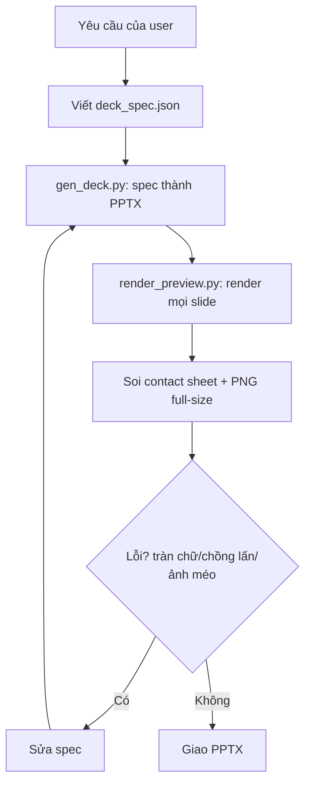
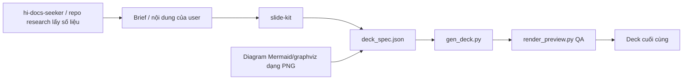

# Slide Kit Skill: Hướng dẫn đầy đủ

> `slide-kit` là deck generator dựa trên Python: biến một JSON spec thành file `.pptx` theo style navy-teal corporate cố định, rồi render từng slide để QA trực quan bắt buộc trước khi giao.

## 1. Mục tiêu

Skill tạo deck `.pptx` đúng theo style tham chiếu được trích xuất từ deck "Vaccine" Phase 1:

- slide cover/agenda/closing nền navy gradient với artwork tia sét;
- slide nội dung nền trắng, dải header navy 60pt và tiêu đề trắng;
- bảng zebra với header teal;
- thẻ sitemap xanh lá/xanh dương kèm legend swatches;
- panel code bo tròn, tự động syntax highlight.

Kit **brand-neutral**: không chèn logo hay brand asset của công ty, và skill không được thêm logo nào vào slide.

Dùng khi user yêu cầu tạo slides/deck/pptx "theo style này", "giống deck Phase1/Vaccine", hoặc load kit một cách rõ ràng.

## 2. Hard outcomes

- Deck bám đúng style tokens cố định (đã hardcode trong `gen_deck.py`, không suy lại mỗi lần chạy).
- Mọi slide được render bằng PowerPoint thật và soi trực quan trước khi tuyên bố hoàn thành.
- Không logo, không watermark, không branding ở footer.
- Mật độ chữ hợp lý: tối đa ~6 bullet/slide, bảng ≤ 12 dòng ở 8pt, một slide một ý.
- Ngôn ngữ slide theo ngôn ngữ user (deck gốc tiếng Việt có dấu — Calibri hiển thị tốt).

## 3. Workflow tổng quát



## 4. Quick start

```bash
python3 <skill_dir>/scripts/gen_deck.py spec.json -o deck.pptx
python3 <skill_dir>/scripts/gen_deck.py <skill_dir>/examples/deck_spec.json -o /tmp/example_deck.pptx
```

QA bắt buộc trước khi giao:

```bash
python3 <skill_dir>/scripts/render_preview.py deck.pptx --output-dir /tmp/deck_preview
```

Mở `contact-sheet.jpg` và từng `slide-NN.png`, kiểm tra: text tràn khung/chồng lấn, bảng quá dài, chip/cột lệch, ảnh méo. Sửa spec → gen lại → render lại đến khi sạch. Không tuyên bố hoàn thành trước khi render và kiểm tra từng slide.

## 5. Spec format (JSON)

Cấp top:

```jsonc
{
  "output": "deck.pptx",
  "slides": [
    { "layout": "cover",   "title": "...", "subtitle": "...(tùy chọn)", "date": "OCT 29 2026", "title_y": 200, "size": 48 },
    { "layout": "agenda",  "items": ["...", "..."] },
    { "layout": "content", "title": "1. Section", "body": [ /* blocks */ ],
      "note": "ghi chú chân slide", "note_color": "E02020" },
    { "layout": "thanks",  "title": "THANK YOU", "subtitle": "..." }
  ]
}
```

- Bốn layout: `cover`, `agenda`, `content`, `thanks`. Item agenda tự đánh số `01, 02, ...`.
- `note` / `note_color` là ghi chú chân slide tùy chọn trên slide nội dung.
- Mỗi slide nhận thêm `"notes": "speaker notes"`.

### Body blocks

Body là mảng block xếp dọc trong vùng nội dung; `"h"` đặt chiều cao block theo pt (bỏ qua thì chia đều):

| type | tham số chính |
|---|---|
| `bullets` | `items`: [{"t": "...", "lvl": 0/1/2, "bold": bool}], `size` 8–12 |
| `heading` | `text`, `size` (16 mặc định) |
| `table` | `header` [], `rows` [[...]], `cols` [tỉ lệ], `align`, `size` (tự chọn 10/9/8), ô `"^"` = trộn dọc với ô trên; trong ô: xuống dòng `\n`, đầu dòng `- `/`o ` |
| `image` | `path` (tương đối = theo thư mục spec), tự fit-git giữa khung |
| `columns` | `cols`: [block...], `weights`: [0.42, 0.58], `gap` — vd. bảng trái + ảnh phải |
| `code` | `panels`: [{`title`, `code`}], `size` 8, syntax highlight tự động cho JSON/SQL-ish, `//` = comment |
| `cards` | `groups`: [{`title`, `chips`: [{"t", "tone": "green"/"blue"/"peach", "lvl", "link": bool}]}], `legend`: {"label", "swatches": [["92D050","Phase 1"],["73B5FF","Phase 2"]]} |

### Inline markup (dùng trong mọi text)

- `**in đậm**`
- `[[red|chữ đỏ]]` — màu: `red green orange teal tealdark blue gray white ink`

## 6. Style tokens

Token hardcode trong `gen_deck.py`; các giá trị chính:

| Token | Giá trị | Dùng cho |
|---|---|---|
| Nền navy | gradient ngang `#003877 → #02275F` (đạt đích ở 42% ngang) | cover/agenda/thanks (asset nền đã compose sẵn) |
| Header band | ảnh `assets/header_band.jpg`, cao 60pt, title Calibri Bold 24pt trắng, x=26pt | mọi slide nội dung |
| Màu chữ | `#29333A` | body text |
| Teal | `#32B2C1` | header bảng, nhấn |
| Zebra | `#E8F2F4` / `#CDE4E9` | dòng bảng xen kẽ |
| Chip xanh/xanh dương | `#A7FFCF` / `#C9DCFF`; legend `#92D050` / `#73B5FF`; dải legend `#D9D9D9` | sitemap cards |
| Cảnh báo / nhấn | đỏ `#E02020`, cam `#F88728`, xanh lá `#00B050`, peach `#FDE0C0` | markup trong bảng/bullet |
| Viền/đường | `#BFBFBF` card, `#2E75B6` code panel, `#2E6FBE` pill agenda | |
| Code | Menlo 8pt: key `#E06C75`, string `#98C379`, comment `#7F848E`, số `#D19A66`, thường `#3B4249` | |
| Font chữ | Calibri (dự phòng Arial), ngày trên bìa Segoe UI 16pt | |
| Kích thước trang | 13.33 × 7.5 in (960×540pt), 16:9 | |
| Cover title | Calibri Bold 48pt trắng, x=70pt y≈200pt; date pill 172×38pt x=72 y=472 (fill trắng 14.5%, viền trắng 25%) | |
| Agenda | số + pill viền xanh 347×30pt, step ≈46.6pt từ y=24 | |
| Số trang | xám `#7F7F7F` 10pt góc phải-dưới, bắt đầu từ slide agenda | |

## 7. Quy tắc soạn nội dung

- **Không logo, không thương hiệu** — kể cả footer, header, watermark. Kit vốn brand-neutral.
- Tiêu đề slide nội dung đánh số theo mục (`"1. ..."`, `"2. ..."`) giống pattern deck gốc.
- Mật độ: tối đa ~6 bullet/slide hoặc bảng ≤ 12 dòng 8pt; một slide một ý. Nội dung dày thì tách slide.
- Ưu tiên bảng + markup in đậm/màu thay vì đoạn văn dài; số liệu quan trọng dùng `**bold**` hoặc `[[red|...]]`.
- Diagram: sinh ảnh PNG (Mermaid/graphviz/draw.io) rồi nhúng qua block `image` hoặc `columns`; không dùng screenshot chất lượng thấp (chỉ dùng ảnh ≥ 2x).
- Ảnh luôn nằm trong khung: đã auto fit-giữa; ảnh quá dọc/quá ngang thì crop ngoài hoặc cho slide riêng.

## 8. Files và môi trường

```
slide-kit/
├── SKILL.md                  ← nguồn chân lý của guide này
├── assets/                   ← nền navy brand-neutral: bg_cover, bg_agenda (đồ họa constellation+rings sinh tự động), bg_thanks (waves), header_band (.jpg)
├── scripts/gen_deck.py       ← spec JSON → .pptx (python-pptx)
├── scripts/render_preview.py ← .pptx → PNG từng slide + contact sheet (PowerPoint AppleScript, fallback soffice)
├── scripts/build_assets.py   ← sinh lại nền cover/agenda (đồ họa trung lập, seed cố định)
└── examples/deck_spec.json   ← deck mẫu đủ mọi layout (kèm example_diagram.png)
```

Yêu cầu môi trường: Python 3 + `python-pptx`, `pillow`, `pymupdf` (chỉ `render_preview.py` cần pymupdf), macOS + Microsoft PowerPoint để render QA (hoặc LibreOffice).

## 9. Mở rộng

- Layout mới → thêm renderer vào `BLOCK_RENDERERS` trong `gen_deck.py`, dùng đúng token màu ở trên; đo vị trí theo pt trên hệ 960×540.
- Đổi artwork nền → thay file trong `assets/` giữ nguyên tên và tỉ lệ 1920×1080 (band: 1920×120); hoặc sửa `build_assets.py` rồi chạy lại.

## 10. Verify slide-kit

- [ ] Spec hợp lệ: cả bốn layout dùng đúng, block well-formed.
- [ ] `gen_deck.py` chạy sạch.
- [ ] `render_preview.py` đã render mọi slide.
- [ ] Contact sheet + từng slide full-size đã soi.
- [ ] Không tràn chữ/chồng lấn; bảng vừa khung; chip/cột thẳng hàng; ảnh không méo.
- [ ] Không có logo hay brand asset nào.
- [ ] Mật độ đúng giới hạn (~6 bullet hoặc bảng ≤ 12 dòng mỗi slide).
- [ ] Mọi lần sửa đều đi kèm gen lại + render lại toàn bộ.

## 11. Quan hệ với skill khác



## 12. Giới hạn

- Visual system cố định: một style navy/teal duy nhất; không sinh chart từ data file như một BI pipeline đầy đủ (chart ở đây là bảng/cards/ảnh).
- Render QA cần macOS + PowerPoint (hoặc LibreOffice); môi trường khác thì đường preview bị suy giảm.
- Style token hardcode — muốn đổi style phải sửa `gen_deck.py`, không có file config.
- Diagram phải tự sinh ở ngoài (Mermaid/graphviz/draw.io) rồi nhúng vào dạng PNG.

## 13. Tóm tắt

> `slide-kit` đổi sự linh hoạt thiết kế lấy tính nhất quán: viết JSON spec, sinh `.pptx` theo style navy/teal cố định, render và soi từng slide, rồi mới giao.
